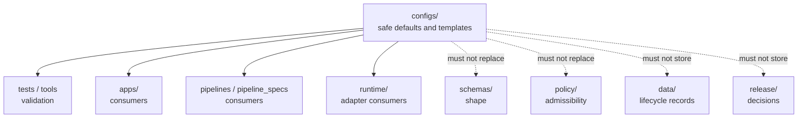

<!-- [KFM_META_BLOCK_V2]
doc_id: kfm://doc/configs-readme
title: configs/ — Safe Configuration Defaults and Templates
type: readme
version: v0.2
status: draft
owners: OWNER_TBD — Ops steward · Security steward · Config steward · Docs steward
created: 2026-06-16
updated: 2026-06-16
policy_label: public
related:
  - ../docs/doctrine/directory-rules.md
  - ../infra/README.md
  - ../runtime/README.md
  - ../apps/README.md
  - ../pipelines/README.md
  - ../pipeline_specs/README.md
  - ../policy/README.md
  - ../schemas/contracts/v1/
  - ../tests/README.md
  - ../tools/README.md
tags: [kfm, configs, configuration, defaults, templates, non-secret, operations, validation, governance]
notes:
  - "configs/ is the canonical root for safe non-secret configuration defaults and templates."
  - "Deployment-only confidential values must not be committed here."
  - "Runtime adapters, infra definitions, policy rules, schemas, source data, release records, and lifecycle data belong in their own roots."
  - "Specific current config inventory, consumers, validation coverage, and CI enforcement remain NEEDS VERIFICATION."
[/KFM_META_BLOCK_V2] -->

<a id="top"></a>

<div align="center">

# Configs

`configs/`

**Canonical root for safe, reviewable configuration defaults and templates. This root may describe configuration shape and non-sensitive defaults; it must not store deployment-only confidential values or become a substitute for schemas, policy, infra, runtime adapters, source data, release records, or lifecycle data.**


[Purpose](#1-purpose) · [Authority](#2-authority) · [Allowed contents](#5-allowed-contents) · [Forbidden contents](#6-forbidden-contents) · [Validation](#9-validation-expectations) · [Definition of done](#12-definition-of-done)

</div>

---

> [!IMPORTANT]
> **Status:** draft / `NEEDS VERIFICATION`  
> **Path:** `configs/README.md`  
> **Responsibility root:** canonical configuration defaults and templates  
> **Truth posture:** CONFIRMED README path / CONFIRMED Directory Rules list `configs/` as canonical / PROPOSED expanded README contract / UNKNOWN current config inventory, consumers, validation coverage, CI enforcement, deployment integration, and owner assignments

> [!CAUTION]
> `configs/` is for safe defaults, examples, and templates only. It must not contain deployment-only confidential values, site-local credentials, host-specific material, private endpoints, sensitive source material, or operational state. Use environment-specific deployment systems and `infra/` controls for real deployment binding.

---

## 1. Purpose

`configs/` is the KFM home for **safe non-secret configuration defaults and templates**.

It should help developers, stewards, CI, local runs, and deployment operators understand which configurable values exist, what safe defaults look like, and how templates should be validated before use. It should not hold canonical truth records, policy decisions, schema authority, release decisions, source data, or runtime state.

This README does not prove that any config files are complete, consumed by applications, validated by CI, deployed anywhere, or synchronized with runtime behavior. Those claims remain `NEEDS VERIFICATION` until checked against current code, tests, workflows, and deployment evidence.

[Back to top](#top)

---

## 2. Authority

`configs/` is a **canonical root** for configuration defaults and templates.

It owns:

- safe default values;
- template files with placeholders;
- local-development sample configuration;
- config documentation tied to repo behavior;
- references to validation tools, schemas, and tests.

It does **not** own policy, schemas, contracts, release records, data lifecycle records, runtime adapters, app source, infra deployment definitions, or source ingestion behavior.

## 3. Directory Rules basis

Directory Rules identify `configs/` as part of the canonical root tree and describe it as the location for non-secret config defaults and templates. The same rule set distinguishes `release/` for release decisions, `runtime/` for adapters/harnesses, `infra/` for deployment/exposure controls, and `data/` for lifecycle data.

## 4. Authority boundary

```text
configs/                    # safe defaults and templates
├── app defaults             # application configuration defaults only
├── pipeline defaults        # safe pipeline parameter examples only
├── local templates          # local dev placeholders only
└── validation notes         # how to check config shape and use

NOT HERE:
  policy/                    # admissibility and policy rules
  schemas/                   # machine-checkable shape
  contracts/                 # object meaning
  apps/                      # deployable app code
  runtime/                   # adapters and harnesses
  infra/                     # deployment and host controls
  data/                      # lifecycle data, receipts, proofs, registry, published artifacts
  release/                   # release decisions, rollback, corrections
```

## 5. Allowed contents

| Allowed item | Example | Required posture |
|---|---|---|
| Safe defaults | local dev default config | Must be non-sensitive and reviewable |
| Templates | `.example`, `.template`, sample YAML/TOML/JSON | Must use placeholders for deployment-only values |
| Config docs | README notes, field explanations | Must point to schemas/contracts/policy where those own meaning |
| Validation pointers | references to tests/tools | Must not claim validation unless verified |
| Environment examples | local/dev/test examples | Must be safe to commit and not production-bound |

## 6. Forbidden contents

| Forbidden here | Correct home |
|---|---|
| Deployment-only confidential values or host-specific binding | external deployment store / `infra/` controls |
| Policy rules or admissibility decisions | `policy/` |
| Machine schema authority | `schemas/contracts/v1/` |
| Object meaning and contract narrative | `contracts/` |
| Application source or deployable service code | `apps/` |
| Runtime adapters, model adapters, harnesses | `runtime/` |
| Deployment, host, network, exposure, access-control definitions | `infra/` |
| Pipeline implementation logic | `pipelines/` |
| Declarative pipeline definitions | `pipeline_specs/` unless explicitly shared as safe defaults |
| Source data, lifecycle data, receipts, proofs, registry records, published artifacts | `data/` |
| Release decisions, release manifests, rollback/correction records | `release/` |
| Generated build/QA artifacts | `artifacts/` |

## 7. Suggested directory shape

Current inventory remains `NEEDS VERIFICATION`.

```text
configs/
├── README.md
├── local/                   # PROPOSED local-development defaults/templates
├── apps/                    # PROPOSED app config examples, if shared across apps
├── pipelines/               # PROPOSED safe pipeline parameter templates
├── runtime/                 # PROPOSED adapter config templates only, not adapters
└── validation/              # PROPOSED config validation notes/examples
```

> [!WARNING]
> Do not treat this suggested shape as repo fact. Verify existing contents before making inventory or migration claims.

## 8. Diagram


```mermaid
flowchart TD
    configs["configs/\nsafe defaults and templates"] --> tests["tests / tools\nvalidation"]
    configs --> apps["apps/\nconsumers"]
    configs --> pipelines["pipelines / pipeline_specs\nconsumers"]
    configs --> runtime["runtime/\nadapter consumers"]
    configs -. "must not replace" .-> schemas["schemas/\nshape"]
    configs -. "must not replace" .-> policy["policy/\nadmissibility"]
    configs -. "must not store" .-> data["data/\nlifecycle records"]
    configs -. "must not store" .-> release["release/\ndecisions"]
```

## 9. Validation expectations

Useful validation for `configs/` should confirm:

- every committed config is safe to share in the repo;
- templates use placeholders where deployment-specific values are needed;
- config names and fields align with current schemas, contracts, apps, pipelines, runtime adapters, and tests;
- no lifecycle data, release state, receipts, proofs, catalog records, or published artifacts are stored here;
- CI or review checks flag risky config additions;
- stale config examples are removed or clearly marked `NEEDS VERIFICATION`.

## 10. Migration posture

If misplaced material is found under `configs/`:

1. Do not treat it as authoritative until reviewed.
2. Identify whether it belongs under `policy/`, `schemas/`, `contracts/`, `apps/`, `runtime/`, `infra/`, `pipelines/`, `pipeline_specs/`, `data/`, `release/`, or `artifacts/`.
3. Move it through a small, reviewable migration.
4. Preserve any necessary provenance, owner notes, and rollback instructions.
5. Add a drift note if the misplaced config was already consumed.

## 11. Safe change pattern

For changes under `configs/`:

1. Confirm the file is a safe default, template, or config-facing documentation.
2. Confirm deployment-only confidential values are not committed.
3. Confirm the config does not duplicate schema, policy, contract, or release authority.
4. Confirm consumers and validators are updated or explicitly marked `NEEDS VERIFICATION`.
5. Document any compatibility impact on apps, pipelines, runtime adapters, or infra.
6. Update tests or explain why the change is documentation-only.

## 12. Definition of done

- [ ] Owners are confirmed and `OWNER_TBD` is replaced.
- [ ] Actual `configs/` contents are inventoried.
- [ ] Every committed config is safe for the repo.
- [ ] No deployment-only confidential values, lifecycle data, release records, receipts, proofs, catalog records, source data, or generated artifacts live here.
- [ ] Config templates identify the owning consumer and validation path.
- [ ] Consumers, tests, and tools are verified or marked `NEEDS VERIFICATION`.
- [ ] Stale or unowned config examples are migrated, deleted, or documented as drift.

## 13. Open verification items

| Item | Why it matters |
|---|---|
| Inventory current `configs/` files | Required before claims about coverage or ownership |
| Confirm app/pipeline/runtime consumers | Required before behavior claims |
| Confirm validation tooling and CI checks | Required before enforcement claims |
| Confirm no deployment-only confidential values are present | Required before safe-sharing claims |
| Confirm config/schema alignment | Required before machine-shape claims |
| Confirm config/policy separation | Required before governance claims |
| Confirm owner assignments | Required before maintenance claims |

<details>
<summary>Appendix A — no-loss preservation note</summary>

The previous README was a short stub. This version preserves its purpose — safe defaults and templates only — and expands the governance, ownership, forbidden-content, validation, and migration contract without claiming any specific config inventory, consumer behavior, deployment behavior, or CI enforcement is implemented.

</details>

## Status summary

`configs/` is the canonical root for safe configuration defaults and templates. It is not a home for deployment-only confidential values, data lifecycle records, release decisions, schemas, contracts, policy rules, source code, runtime adapters, infra definitions, receipts, proofs, or generated artifacts.

<p align="right"><a href="#top">Back to top</a></p>
