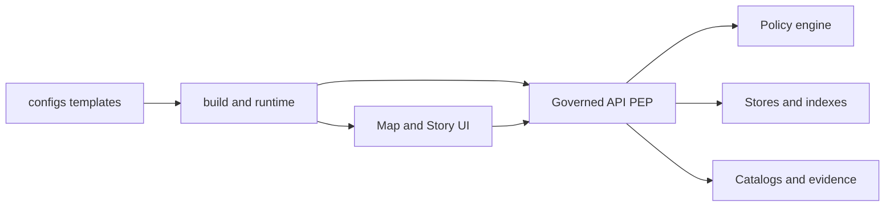

<!-- [KFM_META_BLOCK_V2]
doc_id: kfm://doc/7d0ae54f-92cf-4df0-ba76-42fbc811c788
title: configs/ — Configuration templates
type: standard
version: v2
status: draft
owners: TBD
created: 2026-03-03
updated: 2026-03-03
policy_label: restricted
related:
  - ../docs/
  - ../contracts/
  - ../policy/
tags: [kfm, configs]
notes:
  - Directory README for configuration templates (.env templates, pipeline/UI configs, non-secret deploy configs).
  - Evidence discipline: every meaningful claim is tagged CONFIRMED / PROPOSED / UNKNOWN.
[/KFM_META_BLOCK_V2] -->

<div align="center">

# ⚙️ `configs/`

Configuration templates for KFM (environment, pipelines, UI, and non-secret deployment config)


</div>

> **IMPACT (read this first)**
> - **Status:** draft (design contract; safe defaults)
> - **Owners:** **TBD** (add CODEOWNERS entry for `configs/**`)
> - **Policy posture:** **default-deny, fail-closed**
> - **This directory contains:** **templates + defaults** (reviewable, non-secret)
> - **This directory must never contain:** secrets / credentials / private keys
> - **Non-negotiable invariant:** clients/UI **must not** use config to bypass governed APIs (trust membrane)

**Quick links:** [Scope](#scope) · [Where it fits](#where-it-fits) · [Inputs](#inputs) · [Exclusions](#exclusions) · [Directory tree](#directory-tree) · [Quickstart](#quickstart) · [Usage](#usage) · [Diagram](#diagram) · [Validation matrix](#validation-matrix) · [Definition of done](#definition-of-done) · [FAQ](#faq) · [Appendix](#appendix)

---

## Scope

### Evidence tags used in this README
- **CONFIRMED** — Supported by KFM’s documented architecture/governance (or existing repo artifacts explicitly referenced in KFM docs).
- **PROPOSED** — Recommended convention (safe default) but not verified against the live repo.
- **UNKNOWN** — Not verified here; includes minimal steps to confirm.

### What `configs/` is
- **CONFIRMED:** `configs/` is intended for **configuration templates** (environment, pipeline, UI) and **non-secret** deployment config such as ConfigMaps.  
- **CONFIRMED:** Config belongs to the governed system boundary: it must not weaken policy enforcement or enable bypass paths.

> [!CAUTION]
> **CONFIRMED (trust membrane):** clients and UI must never access storage/DB directly; all access must cross the governed API / policy enforcement point (PEP).  
> Any config that enables direct-to-store behavior is invalid by definition.

[Back to top](#⚙️-configs)

---

## Where this fits

- **CONFIRMED:** `configs/` is a top-level area in the repo design alongside `contracts/`, `policy/`, `apps/`, `packages/`, `infra/`, etc.
- **PROPOSED:** Treat `configs/` as **repo-tracked templates**. Environment-specific instances should be assembled outside git (CI variables, Secret managers, K8s Secrets, Vault) or via gitignored local overrides.

**Related areas (jump points)**
- `../contracts/` — schemas/contracts referenced by configs (**PROPOSED** until verified)
- `../policy/` — policy rules that must not be bypassed (**CONFIRMED** as an invariant)
- `../docs/` — architecture + runbooks that explain expected behavior (**PROPOSED** paths; verify exact docs)

[Back to top](#⚙️-configs)

---

## Inputs

Use `configs/` for **repo-tracked**, reviewable configuration that is safe to store and safe to validate.

### Acceptable inputs
- **CONFIRMED:** `.env` template files (examples / defaults).
- **CONFIRMED:** pipeline configuration files (run specs, lane configs, schedules) — *templates, not secrets*.
- **CONFIRMED:** Kubernetes ConfigMap-style configs (non-secret values).
- **CONFIRMED:** UI configuration files (JSON/YAML) that affect rendering, story behavior, feature flags, etc.  
  - **CONFIRMED:** an example UI config path referenced in KFM docs is `configs/ui/story/rendering.json`.

### Recommended inputs
- **PROPOSED:** versioned config documents (include `config_version` and `schema_ref`).
- **PROPOSED:** explicit “policy posture” flags where relevant (e.g., `default_deny: true` for UI toggles that influence access).
- **PROPOSED:** human ownership + review fields (e.g., `owner`, `last_reviewed`) for operational configs.

[Back to top](#⚙️-configs)

---

## Exclusions

- **CONFIRMED (project security baseline):** No secrets in the repo.
- **PROPOSED:** Do **not** store API keys, private tokens, DB passwords, client secrets, KMS material, or private endpoints that function as credentials.
  - Use secret manager, CI protected variables, K8s Secrets, or `.env.local` (gitignored).
- **PROPOSED:** No personal data (PII) or sensitive payloads.
- **PROPOSED:** No generated artifacts (tiles, catalogs, run receipts, provenance bundles). Those belong in lifecycle zones (`data/**`) and/or release artifacts, not configuration.

> [!WARNING]
> **CONFIRMED fail-closed:** if required config is missing, malformed, or violates invariants, the correct behavior is to **block** the action (build/deploy/publish), not to guess defaults.

[Back to top](#⚙️-configs)

---

## Directory tree

**UNKNOWN:** the exact `configs/` subtree must be verified against the live repo. The structure below is the **PROPOSED target layout**.

```text
configs/
  env/                        # PROPOSED: .env templates and non-secret overlays
    .env.example              # PROPOSED: copy to .env.local (gitignored)
  pipelines/                  # PROPOSED: pipeline specs (deterministic inputs)
    README.md                 # PROPOSED: what consumes these specs
    spec.json                 # PROPOSED: canonical spec hashed for receipts
  ui/                         # PROPOSED: UI runtime configs (rendering, layers, stories)
    story/
      rendering.json          # CONFIRMED (example path referenced in KFM docs)
  k8s/                        # PROPOSED: ConfigMap templates (non-secret)
    app-configmap.yaml        # PROPOSED
```

**Minimum verification step (run locally):**
```bash
tree -L 4 configs/
```

[Back to top](#⚙️-configs)

---

## Quickstart

> These commands are “safe defaults” and **do not assume** special repo tooling exists.

1) **Create a local env instance from a template** (**PROPOSED paths**)
```bash
cp configs/env/.env.example .env.local
```

2) **Validate JSON configs for basic syntax** (**PROPOSED**)  
```bash
python -m json.tool < configs/ui/story/rendering.json > /dev/null
```

3) **(Optional) validate YAML configs if you have `yq` installed** (**PROPOSED**)  
```bash
yq '.' configs/k8s/app-configmap.yaml > /dev/null
```

4) **Wire your service to read templates + overrides** (**PROPOSED**)  
- Defaults: `configs/**`
- Overrides: `.env.local`, `configs/**.local`, or deployment-time injected config

[Back to top](#⚙️-configs)

---

## Usage

### Template vs instance
- **PROPOSED:** The repo contains **templates/defaults** only.
- **PROPOSED:** Local dev instances should be `.env.local` / `.env.dev.local` (gitignored).
- **PROPOSED:** Production instances should be assembled by deployment tooling (CI + infra) and never committed.

### Naming and intent
- **PROPOSED:** Use names that encode scope and safety:
  - `*.example` for copy-as-start templates
  - `dev.*`, `staging.*`, `prod.*` overlays only if they are **non-secret**
  - `*.schema.json` lives under `contracts/` (configs reference schemas, they don’t define them)

### Version fields (recommended)
- **PROPOSED:** Each major config file should include:
  - `config_version`
  - `schema_ref` (relative path into `contracts/`)
  - `owner` (team/handle)
  - `last_reviewed` (ISO date)

### Configs must not pierce the trust membrane
- **CONFIRMED:** UI config cannot enable direct DB/storage access.  
- **PROPOSED enforcement:** add CI rules that reject configs containing raw DB URLs, direct object-store endpoints for clients, or “bypass policy” flags.

[Back to top](#⚙️-configs)

---

## Diagram


```mermaid
flowchart LR
  cfg[configs templates] --> build[build and runtime]
  build --> ui[Map and Story UI]
  build --> api[Governed API PEP]
  ui --> api
  api --> pol[Policy engine]
  api --> stores[Stores and indexes]
  api --> cats[Catalogs and evidence]
```

- **CONFIRMED:** clients/UI call the governed API (PEP); they do not call stores directly.
- **PROPOSED:** treat config changes like code: PR review + schema checks + policy checks + rollback plan.

[Back to top](#⚙️-configs)

---

## Validation matrix

| Config class | Examples | Who consumes it | Validation surface | Posture |
|---|---|---|---|---|
| Env templates | `configs/env/.env.example` | API/UI/pipelines | lint + “no secrets” scan (**PROPOSED**) | fail-closed |
| Pipeline specs | `configs/pipelines/spec.json` | orchestrator/runner | schema + spec-hash determinism (**PROPOSED**) | fail-closed |
| UI runtime config | `configs/ui/**.json` | UI at runtime | schema + “no bypass” policy (**PROPOSED**) | default-deny |
| K8s ConfigMaps | `configs/k8s/*.yaml` | infra | YAML validity + policy rules (**PROPOSED**) | fail-closed |

> **UNKNOWN:** actual validators and schemas must be confirmed in-repo.

[Back to top](#⚙️-configs)

---

## Definition of done

### DoD for a new config file (minimum)
- [ ] **PROPOSED:** Non-secret and safe to publish.
- [ ] **PROPOSED:** Has a schema (or typed loader + unit test) and passes validation in CI.
- [ ] **PROPOSED:** Default behavior is safe (deny-by-default when relevant).
- [ ] **PROPOSED:** Consumer documented (which service reads it, and how).
- [ ] **PROPOSED:** Rollback story is explicit (revert commit / pin previous config version).

### DoD for config changes that affect access control
- [ ] **CONFIRMED:** Does not weaken the trust membrane (no direct store paths; policy still enforced).
- [ ] **PROPOSED:** Includes/updates a policy test or conftest rule that prevents regression.

[Back to top](#⚙️-configs)

---

## FAQ

**Where do secrets go?**  
- **CONFIRMED:** not in git.  
- **PROPOSED:** use CI secrets, K8s Secrets, Vault, or `.env.local` (gitignored).

**Can UI config include endpoints?**  
- **CONFIRMED:** only endpoints that route through governed APIs.  
- **PROPOSED:** treat any “direct-to-store” endpoint as a policy violation and block in CI.

**Why so strict about “fail closed”?**  
- **CONFIRMED:** KFM’s governance model depends on deterministic behavior and policy enforcement; missing or invalid config must not silently change outcomes.

[Back to top](#⚙️-configs)

---

## Appendix

<details>
<summary><strong>UNKNOWNs and minimal verification steps</strong></summary>

1) **UNKNOWN: Actual `configs/` subdirectories and filenames**  
   Verify:
   ```bash
   find configs -maxdepth 4 -type f -print
   ```

2) **UNKNOWN: Which config schemas exist (if any)**  
   Verify:
   ```bash
   find contracts -maxdepth 6 -name "*.schema.json" -print
   ```

3) **UNKNOWN: Which services load which configs**  
   Verify:
   ```bash
   rg -n "configs/" apps packages src
   ```

4) **UNKNOWN: Current CI validation coverage for `configs/**`**  
   Verify:
   ```bash
   ls .github/workflows
   rg -n "configs/" .github/workflows
   ```

</details>

<details>
<summary><strong>Example templates</strong></summary>

### `.env` template (example)
```dotenv
# configs/env/.env.example  (template only — do not commit secrets)
KFM_ENV=dev
KFM_LOG_LEVEL=info

# API base URL used by UI during local dev
KFM_API_BASE_URL=http://localhost:8000
```

### UI story rendering config (skeleton)
```json
{
  "config_version": "v1",
  "schema_ref": "contracts/schemas/ui/story_rendering.schema.json",
  "default_deny": true,
  "story": {
    "render_mode": "evidence_first",
    "show_policy_badges": true,
    "show_dataset_version": true
  }
}
```

### Kubernetes ConfigMap template (non-secret)
```yaml
apiVersion: v1
kind: ConfigMap
metadata:
  name: kfm-app-config
data:
  KFM_ENV: "staging"
  KFM_LOG_LEVEL: "info"
```

</details>

[Back to top](#⚙️-configs)
