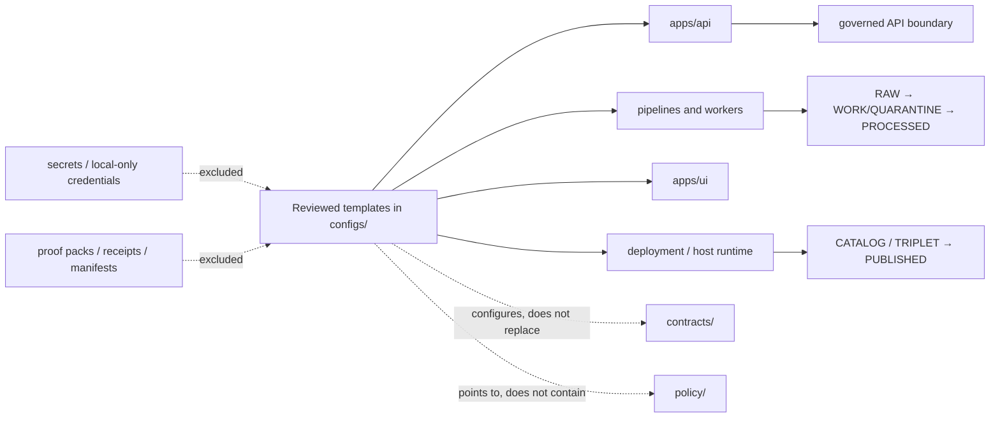

<!-- [KFM_META_BLOCK_V2]
doc_id: kfm://doc/TODO-VERIFY-UUID
title: configs/
type: standard
version: v1
status: review
owners: TODO(verify platform/config owners)
created: TODO(verify YYYY-MM-DD)
updated: TODO(verify YYYY-MM-DD)
policy_label: TODO(verify directory classification)
related: [../README.md, ../contracts/, ../policy/, ../infra/, ../scripts/, ../migrations/, ../tests/]
tags: [kfm, configs, runtime, pipelines, ui, deployment]
notes: [Current session exposed PDF corpus only; exact repo tree, sibling paths, owners, and mounted configs/ contents need direct repo verification before merge.]
[/KFM_META_BLOCK_V2] -->

<a id="top"></a>

# configs/

Configuration templates and non-secret value surfaces for KFM runtime, pipeline, UI, and deployment behavior.

**Status:** experimental  
**Owners:** TODO(verify platform / config owners)  
**Path:** `configs/README.md`


**Quick jump:** [Scope](#scope) · [Repo fit](#repo-fit) · [Accepted inputs](#accepted-inputs) · [Exclusions](#exclusions) · [Directory tree](#directory-tree-doc-grounded-working-shape) · [Quickstart](#quickstart) · [Usage rules](#usage-rules) · [Diagram](#diagram) · [Reference tables](#reference-tables) · [Task list](#task-list--definition-of-done) · [FAQ](#faq) · [Appendix](#appendix)

> [!IMPORTANT]
> This README is **source-grounded but repo-constrained**. The current session exposed KFM PDF doctrine and design artifacts, not a mounted repository tree. Paths, examples, and subdirectories below are written to be merge-ready **after direct repo verification**, not treated as already confirmed filesystem fact.

## Scope

`configs/` is the reviewed home for configuration **templates**, **non-secret defaults**, and **runtime-facing value surfaces** that shape KFM behavior without becoming a shadow source of truth.

In KFM terms, this directory exists to support the governed path, not bypass it. Configuration may influence runtime bring-up, pipelines, UI behavior, deployment posture, and reproducibility, but it must not quietly replace:

- authoritative contracts
- executable policy bundles
- source descriptors or dataset registry entries
- release proof objects
- secrets or machine-local state

That distinction matters because KFM’s trust model depends on keeping **templates and values** separate from **law and proof**.

### Truth posture for this README

| Label | How it applies here |
| --- | --- |
| **CONFIRMED** | The attached March 2026 KFM corpus documents `configs/` as a configuration-template family for env, pipelines, and UI concerns. |
| **INFERRED** | Adjacent repo links and consumer paths are document-grounded cross-references, but not directly reverified from a mounted repo tree in this session. |
| **PROPOSED** | Example `kfm.env`, local runtime bind keys, and systemd-oriented config surfaces come from the latest realization overlays and phase-one runtime design. |
| **UNKNOWN** | Exact owners, live subdirectory set, current validation command, and current branch/release behavior of `configs/` in the real repo. |
| **NEEDS VERIFICATION** | Any literal path, example file, or sibling relationship that depends on the unmounted repository rather than the visible PDF corpus. |

## Repo fit

| Field | Value |
| --- | --- |
| Path | `configs/README.md` |
| Directory role | Configuration templates and non-secret value surfaces for runtime, pipelines, UI, and deployment |
| Source-grounded repo neighbors | `../infra/`, `../scripts/`, `../migrations/`, `../examples/`, `../tests/` |
| Document-grounded consumers | `../apps/api/`, `../apps/ui/`, `../packages/ingest/`, `../packages/catalog/`, `../packages/policy/` |
| Governing constraint | Public and role-limited surfaces still cross the governed API and policy boundary; config must not create a side door around the trust membrane |
| Review posture | Treat changes here as behavior-affecting changes when they alter exposure, promotion scope, evidence requirements, or user-visible trust cues |

### Upstream / downstream links

| Relationship | Paths | Status |
| --- | --- | --- |
| Upstream doctrine and control surfaces | [`../README.md`](../README.md) · [`../contracts/`](../contracts/) · [`../policy/`](../policy/) · [`../infra/`](../infra/) · [`../scripts/`](../scripts/) | document-grounded, **NEEDS VERIFICATION** |
| Downstream consumers | [`../apps/api/`](../apps/api/) · [`../apps/ui/`](../apps/ui/) · [`../packages/ingest/`](../packages/ingest/) · [`../packages/catalog/`](../packages/catalog/) · [`../tests/`](../tests/) | document-grounded, **NEEDS VERIFICATION** |

## Accepted inputs

| Category | Typical contents | Why it belongs here |
| --- | --- | --- |
| Environment templates | bind hosts, ports, DSN/socket hints, artifact-root paths, published-only flags, policy-dir pointers | These are runtime-facing defaults and operator-reviewed inputs |
| Pipeline profiles | ingest, build, publish, projection, timeout, threshold, and cadence settings | Pipelines need explicit, reviewable configuration rather than tribal defaults |
| UI configuration | non-secret surface defaults, feature toggles, rendering defaults, trust-visible presentation settings | KFM surfaces must stay configurable without hard-coding every behavior |
| Deployment value templates | ConfigMap-style values, host/runtime settings, local bring-up variables, systemd-oriented override surfaces | These parameterize runtime without redefining system law |
| Reproducibility-linked snapshots | version-pinned config captures referenced by receipts, manifests, or provenance | Outputs should be traceable to the config that shaped them |

### What belongs here in practice

- `.env.example`-style files
- reviewed runtime defaults
- profile YAML/TOML/JSON for jobs or services
- non-secret deployment value files
- documented local bring-up examples
- config snapshots tied to releases, receipts, or proof objects

## Exclusions

| Do **not** keep here | Put it instead | Why |
| --- | --- | --- |
| Secrets, tokens, private keys, local credentials | secret manager / untracked local files / OS secret surface | Never commit secrets into reviewed config |
| JSON Schemas, OpenAPI contracts, canonical envelopes | [`../contracts/`](../contracts/) | Contracts must stay first-class, machine-readable, and independently reviewable |
| Executable OPA/Rego policy bundles, reason registries, obligation registries | [`../policy/`](../policy/) | Policy should not hide inside ordinary runtime templates |
| Dataset/source registry entries and source descriptors | repo-standard registry location such as `../data/registry/` | Intake is a contract, not loose config |
| Database migrations | [`../migrations/`](../migrations/) | Schema evolution needs migration review, not template review |
| Release manifests, proof packs, receipts, correction notices | release/proof location *(verify exact path)* | Publication evidence is not ordinary configuration |
| Generated machine-local churn | local cache / local state / ignored workspace files | Reviewable config should stay stable and intentional |

> [!WARNING]
> If the repo currently contains mixed placement such as policy-like files under `configs/`, do **not** treat that as settled architecture by default. The stronger March 2026 KFM overlays separate configuration, contracts, and policy into different responsibilities and repeatedly warn against treating proposed paths as mounted fact.

## Directory tree (doc-grounded working shape)

```text
configs/
├── README.md
├── env/                # environment templates and reviewed .env examples
├── pipelines/          # ingest/build/publish/projection profiles
├── ui/                 # non-secret UI defaults and feature flags
├── deployment/         # ConfigMap-style values and deployment-scoped inputs
├── systemd/            # service override fragments or host-runtime examples
└── snapshots/          # version-pinned config captures tied to receipts/manifests
```

This is a **working shape inferred from the corpus**, not a claim that the mounted repo already contains these exact subdirectories. The key invariant is the separation of roles:

- `configs/` for templates and non-secret value surfaces
- `contracts/` for schemas and wire-contract law
- `policy/` for executable policy
- release/proof locations for publication evidence
- secret surfaces for credentials and private material

## Quickstart

1. Inspect the real directory before editing.
2. Identify the runtime, pipeline, UI, or deployment consumer of the setting you want to change.
3. Confirm the change does not move policy, contract law, or evidence requirements into template-only config.
4. Re-run the repo’s actual validation path before merge.

```bash
# Inspect the visible config surface.
find configs -maxdepth 3 -type f | sort

# Search for KFM-specific keys and reviewed defaults.
grep -R "KFM_" configs || true

# Find consumers before changing a shared key.
git grep -nE "KFM_BIND_|KFM_POLICY_DIR|KFM_PUBLISHED_ONLY|KFM_REQUIRE_STRUCTURED_OUTPUT" .
```

Illustrative local-runtime template shape:

```dotenv
# Example only — keys and meanings are source-grounded,
# but literal filenames/placement still need repo verification.

KFM_BIND_HOST=127.0.0.1
KFM_BIND_PORT=8080
KFM_DB_DSN=postgresql:///kfm?host=/var/run/postgresql
KFM_ARTIFACT_ROOT=/srv/kfm
KFM_POLICY_DIR=/etc/kfm/policy/current
KFM_PUBLISHED_ONLY=true
KFM_REQUIRE_STRUCTURED_OUTPUT=true
```

Illustrative Ollama-related override surface:

```ini
# Example only — derived from the phase-one local runtime design.
# Verify actual unit names and override paths before use.

[Service]
Environment="OLLAMA_HOST=127.0.0.1:11434"
Environment="OLLAMA_MODELS=/srv/ollama/models"
```

> [!NOTE]
> The strongest current KFM runtime overlay treats both `kfm.env`-style runtime config and Ollama override surfaces as **PROPOSED realization detail**, not mounted implementation fact. Keep examples here explicit about that status unless the repo itself proves otherwise.

## Usage rules

### 1) Keep `configs/` template-first

Commit:

- examples
- defaults
- reviewed value surfaces
- reproducibility-linked snapshots

Do **not** commit:

- secrets
- one-machine overrides pretending to be team config
- unpublished proof objects pretending to be config
- policy disguised as “just another flag”

### 2) Keep contracts and policy explicit

If a file defines:

- schema shape
- response envelope law
- reason/obligation registry
- promotion gate logic
- policy evaluation semantics

it should usually live outside `configs/` in a first-class contract or policy location.

### 3) Treat config changes as behavior changes

A config change can alter:

- what the API exposes
- what a pipeline publishes
- how UI trust cues appear
- whether a runtime remains loopback-only
- whether citations or structured outputs are required

That means config changes deserve the same review seriousness as code when they affect public behavior, admissibility, release posture, or runtime exposure.

### 4) Snapshot config when outputs depend on it

If a pipeline result, release artifact, or runtime answer depends materially on configuration, the relevant config snapshot should be referenceable from receipts, manifests, or provenance records.

### 5) Prefer one canonical home per concern

Do not duplicate the same rule across:

- `configs/`
- `contracts/`
- `policy/`
- deployment overlays
- application code

One concern should have one canonical owner, with references outward instead of silent drift.

### 6) Keep local-only runtime posture visible

The freshest runtime-specific KFM overlays prefer:

- loopback-only binds in early phases
- local-only model runtime behind the governed API
- canonical stores not directly reachable by clients
- published-only flags on client-visible reads

`configs/` is an appropriate place for the **templates** that express those defaults, but not for weakening them casually.

## Diagram


```mermaid
flowchart LR
  A[Reviewed templates in configs/] --> B[apps/api]
  A --> C[pipelines and workers]
  A --> D[apps/ui]
  A --> E[deployment / host runtime]

  B --> F[governed API boundary]
  C --> G[RAW → WORK/QUARANTINE → PROCESSED]
  E --> H[CATALOG / TRIPLET → PUBLISHED]

  A -. configures, does not replace .-> I[contracts/]
  A -. points to, does not contain .-> J[policy/]
  K[secrets / local-only credentials] -. excluded .-> A
  L[proof packs / receipts / manifests] -. excluded .-> A
```

## Reference tables

### Consumer map

| Config lane | Primary consumers | Typical examples | Non-secret? |
| --- | --- | --- | --- |
| `env/` | API, workers, local runtime | bind rules, socket DSNs, artifact roots, published-only flags | Yes |
| `pipelines/` | ingest/build/publish/projection jobs | profile selection, thresholds, cadence, timeouts | Yes |
| `ui/` | frontend surfaces | layer defaults, feature flags, trust-visible presentation defaults | Yes |
| `deployment/` | host/runtime/deployment layer | config values, environment overlays, deployment-scoped knobs | Yes |
| `systemd/` | local host bring-up *(if standardized)* | service override fragments, local runtime examples | Yes |
| `snapshots/` | receipts/manifests/provenance | version-pinned config captures | Yes |

### Placement rules at a glance

| Concern | Preferred home | Rule |
| --- | --- | --- |
| Runtime and template values | `configs/` | Keep them reviewable, non-secret, and explicit |
| Wire contracts and schema law | `contracts/` | Machine-readable, diffable, testable |
| Executable policy and registries | `policy/` | Versioned, explicit, independently gated |
| Source onboarding facts | registry / descriptor location | Intake is a contract, not loose config |
| Publication evidence | release/proof location | Evidence should not masquerade as config |
| Secrets and credentials | secret surface | Never commit into reviewed config |

### Review questions

| Question | Why it matters |
| --- | --- |
| Does this file configure behavior, or is it secretly defining policy/contract law? | Prevents role drift |
| Is the value non-secret and reviewable? | Prevents credential leakage |
| Can a receipt or manifest point back to this config when needed? | Preserves reproducibility |
| Does the change alter exposure, publication, or trust cues? | Marks the change as architecture-significant |
| Is there already another canonical home for this rule? | Prevents duplication and drift |

## Task list / definition of done

- [ ] No secrets, tokens, or machine-local credentials are committed
- [ ] Every new config file names or documents its primary consumer
- [ ] Config that materially changes outputs is snapshot-able and referenceable from receipts/manifests
- [ ] Contract or policy implications are reflected in `contracts/` or `policy/`, not hidden here
- [ ] Runtime-facing defaults preserve the trust membrane and published-only posture
- [ ] UI-facing config changes preserve trust cues, accessibility, and calm failure
- [ ] Sibling paths, examples, and subdirectories are verified against the mounted repo before merge
- [ ] The README stays aligned with the actual validation path used by the repo

## FAQ

### Why is `configs/` not the home for every rule?

Because KFM depends on a visible separation between **value surfaces** and **governed law**. Config shapes behavior; contracts and policy define what is allowed.

### Can `configs/` change public behavior?

Yes. That is exactly why changes here need the same review seriousness as other architectural changes.

### Can secrets live here?

No. Keep secrets out of versioned config and out of repo-readable templates.

### Are the paths in this README fully confirmed?

No. The directory role is source-grounded, but the current session did not expose the live repo tree. Paths and examples are intentionally marked as document-grounded or NEEDS VERIFICATION where direct repo evidence is missing.

### Why include `systemd/` in the working tree if it is not confirmed?

Because the freshest runtime realization overlay introduces systemd-first local bring-up and runtime override surfaces. Including that lane here helps maintainers see the likely config boundary, while still labeling it as a working shape rather than mounted fact.

### Should generated config snapshots be checked in?

Only when the repo intentionally versions them as reproducibility artifacts. Do not check in noisy local churn.

## Appendix

<details>
<summary><strong>Placement tension: why this README draws a hard line between <code>configs/</code>, <code>contracts/</code>, and <code>policy/</code></strong></summary>

The visible March 2026 corpus is directionally consistent, but not perfectly uniform:

1. The repository-oriented compendium documents `configs/` as the family for configuration templates across env, pipelines, and UI, with examples such as `.env templates`, `pipeline configs`, and Kubernetes configmaps.
2. The stronger doctrinal and realization overlays separate executable contracts, policy bundles, proof objects, and route/state obligations into first-class families rather than treating them as ordinary configuration.
3. The phase-one runtime design introduces concrete runtime config surfaces such as `kfm.env` and an Ollama override, but still labels them as **PROPOSED realization**, not confirmed repo fact.
4. Multiple authority-correction packages explicitly warn that repo-level paths, schemas, workflows, and manifests were not mounted in the session and should not be overclaimed.

This README resolves those signals by normalizing to one practical rule:

- keep **templates and non-secret values** in `configs/`
- keep **schemas and contract law** in `contracts/`
- keep **policy bundles and registries** in `policy/`
- keep **proof objects and receipts** out of `configs/`
- keep **secrets** out of the repository-visible config surface

That keeps the directory readable, governable, and aligned with KFM’s fail-closed posture.

</details>

<details>
<summary><strong>Why this README uses so many review labels</strong></summary>

Because the current session exposed a rich KFM documentation corpus but **not** the mounted repository itself. The right move is to preserve what the documents establish strongly while refusing to turn target-state or repo-shaped language into fake certainty.

That is why this file distinguishes:

- source-grounded directory role
- document-grounded adjacent paths
- proposed runtime config examples
- unknown owners, dates, and mounted subdirectory reality

The result is less smooth than a generic README rewrite, but more trustworthy.

</details>

[Back to top](#top)
