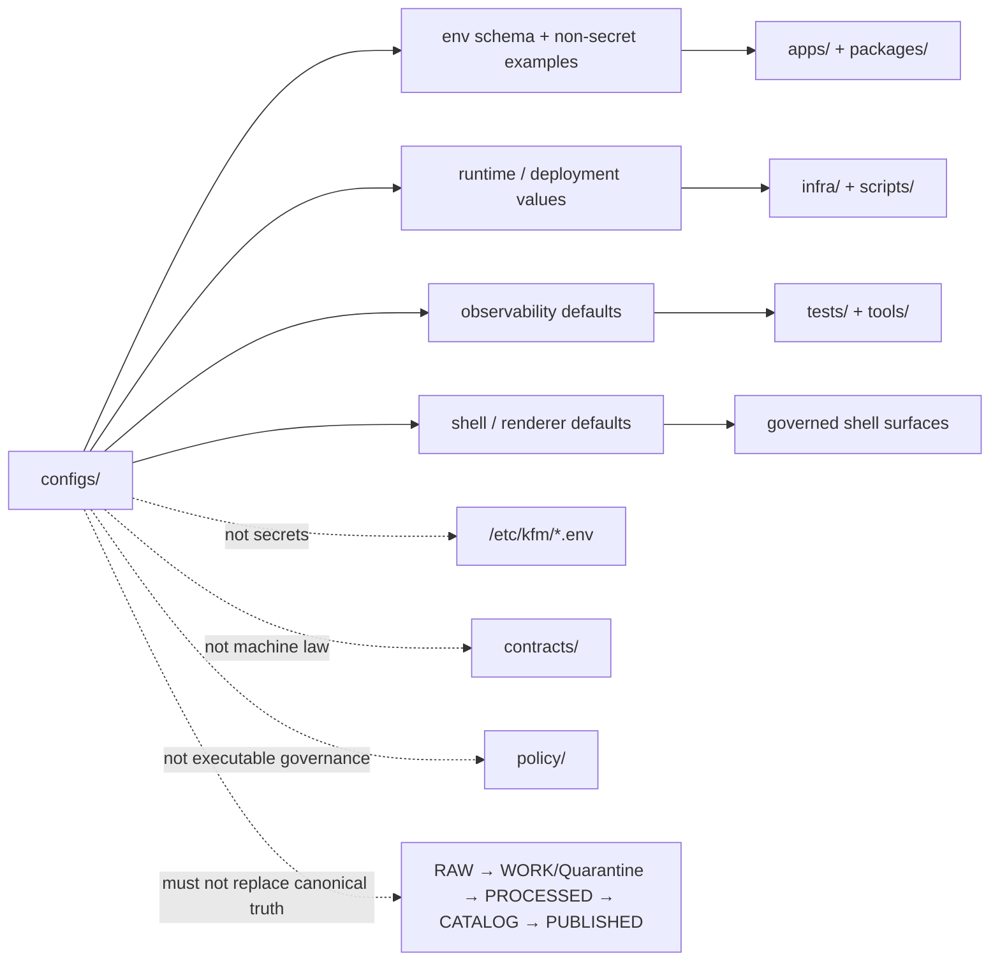

<!-- [KFM_META_BLOCK_V2]
doc_id: kfm://doc/TODO-VERIFY-UUID
title: configs/
type: standard
version: v1
status: review
owners: TODO(verify platform/config owners from CODEOWNERS or lane ownership docs)
created: TODO(verify YYYY-MM-DD)
updated: TODO(verify YYYY-MM-DD)
policy_label: TODO(verify directory classification)
related: [../README.md, ../apps/, ../packages/, ../contracts/README.md, ../policy/README.md, ../infra/, ../tests/README.md, ../tools/README.md, ../scripts/README.md, ../migrations/, ../examples/]
tags: [kfm, configs, runtime, deployment, observability, trust-boundaries]
notes: [Root-level sibling links are grounded in March 2026 repo-inventory documents. Owners, UUID, dates, policy label, and the live configs/ subtree still require direct checkout verification before merge.]
[/KFM_META_BLOCK_V2] -->

<a id="top"></a>

# configs/

_Repo-visible, non-secret configuration surfaces for KFM runtime wiring, deployment, observability, and shell-facing defaults._

> **Status:** experimental  
> **Owners:** TODO(verify platform / config owners)  
> **Path:** `configs/README.md`  
>        
> **Quick jump:** [Scope](#scope) · [Repo fit](#repo-fit) · [Accepted inputs](#accepted-inputs) · [Exclusions](#exclusions) · [Directory tree](#directory-tree-root-lane-confirmed-interior-working-shape-still-to-verify) · [Quickstart](#quickstart) · [Usage rules](#usage-rules) · [Diagram](#diagram) · [Reference tables](#reference-tables) · [Task list](#task-list--definition-of-done) · [FAQ](#faq) · [Appendix](#appendix)

> [!IMPORTANT]
> This README is **repo-aware and source-grounded**, but it is not a substitute for a live checkout inspection. The attached March 2026 KFM manuals and repo-grounded audit documents confirm a root-level `configs/` lane and strong configuration/package-boundary doctrine. They do **not** prove the exact current contents of `configs/` in the mounted repository. Internal subpaths below are therefore marked **CONFIRMED**, **PROPOSED**, or **NEEDS VERIFICATION** inline.

## Scope

In KFM, configuration is not a miscellaneous settings bucket. It is a **trust-bearing operational surface**: it influences how governed services bind, where workers run, how shell defaults behave, how observability joins are emitted, and whether fail-closed behavior survives deployment changes.

This `configs/` README covers the **repo-visible subset** of that space:

- non-secret templates
- validated or reviewable environment schemas
- deployment/runtime value surfaces
- shell-facing defaults that do not become contract law
- observability settings worth diffing in Git

It does **not** flatten KFM’s stronger seams. Contracts, executable policy bundles, canonical data, review/release proof artifacts, and secret-bearing host files remain separate on purpose.

### Truth posture for this README

| Label | How it applies here |
| --- | --- |
| **CONFIRMED** | A root-level `configs/` lane is documented in repo-inventory material, and March 2026 KFM doctrine explicitly treats configuration/package boundaries as trust-bearing. |
| **INFERRED** | `configs/` is intended to hold repo-visible, non-secret runtime/deployment/configuration material used by apps, packages, infra, and verification surfaces. |
| **PROPOSED** | Internal subdirectories, exact file names beyond explicitly named artifacts, and validation command shapes not directly proven in the mounted checkout. |
| **UNKNOWN** | Live `configs/` tree contents, owners, exact loader paths, exact CI wiring, and exact enforcement depth in the current checkout. |
| **NEEDS VERIFICATION** | Any literal subpath, badge target, owner assignment, git-tracked file date, or validation command that depends on the live repo rather than the attached evidence corpus. |

## Repo fit

| Field | Value |
| --- | --- |
| Path | `configs/README.md` |
| Directory role | Repo-visible home for non-secret configuration surfaces and reviewed runtime wiring |
| Baseline doctrine | `KFM_Master_Design_Manual_2026-03-20.pdf` section **Configuration and package architecture** |
| Supporting doctrine | KFM unified geospatial architecture, expanded working manual, Pass 5 synthesis, and repo-grounded March 2026 inventory/audit documents |
| Main consumers | `apps/`, `packages/`, `infra/`, `tests/`, `tools/`, `scripts/` |
| Review posture | Config changes deserve architecture review when they alter exposure, publication, policy behavior, citation behavior, release scope, or visible failure semantics |

### Upstream / downstream links

| Relationship | Paths | Status |
| --- | --- | --- |
| Governance and machine-law sources | [`../contracts/README.md`](../contracts/README.md) · [`../policy/README.md`](../policy/README.md) | **CONFIRMED as repo docs** |
| Main runtime consumers | [`../apps/`](../apps/) · [`../packages/`](../packages/) · [`../infra/`](../infra/) | **CONFIRMED as root lanes** |
| Verification and tooling companions | [`../tests/README.md`](../tests/README.md) · [`../tools/README.md`](../tools/README.md) · [`../scripts/README.md`](../scripts/README.md) | **CONFIRMED as repo docs / lanes** |
| Neighboring operational lanes | [`../migrations/`](../migrations/) · [`../examples/`](../examples/) | **CONFIRMED as root lanes** |
| Root context | [`../README.md`](../README.md) | **CONFIRMED** |
| Host-local companions | `/etc/kfm/*.env` | **Documented runtime pattern; not a repo path** |

## Accepted inputs

| Category | Typical contents | Why it belongs here |
| --- | --- | --- |
| Environment schemas and examples | `env.schema.json`, `.env.example`-style templates, non-secret defaults | Makes runtime wiring reviewable without committing secrets |
| Runtime and deployment values | bind/port settings, service parameters, environment-class defaults, deploy-facing values | Keeps environment-specific wiring explicit and diffable |
| Observability defaults | log field maps, collector/exporter config, join-key defaults, non-secret alert thresholds | Preserves operational evidence without burying it in code |
| Shell / renderer defaults | portrayal flags, map/shell defaults, feature switches that do **not** redefine truth | Lets UI behavior vary without moving governance into the frontend |
| Operational thresholds | non-secret security or validation thresholds, waivers, scan/config tolerances | Useful when kept separate from executable policy bundles |

### What belongs here in practice

- non-secret env examples
- process-start configuration schema
- deployment overlays or value files
- observability defaults
- shell-facing defaults
- non-secret operational thresholds
- documentation-backed configuration examples that help contributors wire the system correctly

## Exclusions

| Do **not** keep here | Put it instead | Why |
| --- | --- | --- |
| Credentials, tokens, private keys, live DSNs with secrets | host-local secret files or secret manager surfaces such as `/etc/kfm/*.env` | `configs/` must stay repo-visible and non-secret |
| JSON Schemas, OpenAPI contracts, controlled vocabularies acting as machine law | [`../contracts/README.md`](../contracts/README.md) | Contracts need a single authoritative home |
| Executable policy bundles, deny/allow rules, reason/obligation logic | [`../policy/README.md`](../policy/README.md) | Governance must stay explicit, testable, and separately reviewable |
| Database migrations | [`../migrations/`](../migrations/) | Schema evolution needs replay discipline |
| Generated caches, temp files, build output, local state | ignored runtime/build/cache locations | Reviewable config should remain intentional and stable |
| Canonical truth objects or release-backed evidence artifacts | governed data / catalog / release-proof surfaces | Config may point at them, but does not replace them |
| Frontend-only heuristics that become trust logic | shell code or governed API, depending the concern | Trust behavior must not hide in convenience toggles |

> [!WARNING]
> A file that changes schema law, evidence law, policy semantics, or publication criteria is almost never “just config” in KFM.

## Directory tree (root lane confirmed; interior working shape still to verify)

```text
configs/
├── README.md
├── env.schema.json              # PROPOSED named artifact in March 2026 design docs
├── env/                         # PROPOSED non-secret examples/defaults
├── deployment/                  # PROPOSED runtime/deploy value surfaces
├── observability/               # PROPOSED collector/log/join config
├── ui/                          # PROPOSED shell or renderer defaults
└── security/                    # PROPOSED non-secret operational thresholds only
```

How to read this tree:

- The **root lane** `configs/` is source-grounded.
- `env.schema.json` is the one internal artifact explicitly named in the March 2026 design material.
- The listed subdirectories are a **doctrine-consistent working shape**, not a mounted-fact claim.
- `security/` here means **non-secret operational settings**, not executable policy bundles.

## Quickstart

1. Inspect the live `configs/` tree before editing anything.
2. Decide whether the change is truly configuration, or whether it belongs in `contracts/`, `policy/`, `migrations/`, or host-local secret surfaces.
3. Make the smallest useful non-secret change.
4. Run the repo’s **actual** validation path before merge.

```bash
# Inspect the live config lane.
find configs -maxdepth 3 -type f | sort
```

```bash
# Trace likely config consumers and named config seams.
git grep -nE 'env\.schema|KFM_(ARTIFACT_ROOT|POLICY_DIR|DB_DSN|MODEL_ADAPTER_URL|PUBLISHED_ONLY|CITATIONS_REQUIRED|BIND)' -- .
```

```bash
# Look for boundary and validation hooks already present in the repo.
git grep -nE '(forbidden import|dependency graph|route-family|config schema|validate_contracts|schema-lint)' -- .
```

Illustrative environment key surface:

```dotenv
# Illustrative names from source docs — verify against the live repo before use.

KFM_ARTIFACT_ROOT=/srv/kfm
KFM_POLICY_DIR=/etc/kfm/policy
KFM_DB_DSN=unix:///var/run/postgresql/.s.PGSQL.5432
KFM_MODEL_ADAPTER_URL=http://127.0.0.1:11434
KFM_PUBLISHED_ONLY=true
KFM_CITATIONS_REQUIRED=true
KFM_BIND=127.0.0.1:8080
```

> [!NOTE]
> The stronger host-runtime pattern keeps secret-bearing files outside the repo, under root-owned paths such as `/etc/kfm/kfm-api.env`, `/etc/kfm/kfm-worker.env`, `/etc/kfm/kfm-publish.env`, and an Ollama override or systemd drop-in.

## Usage rules

### 1) Keep `configs/` non-secret and reviewable

Commit examples, schemas, defaults, and reviewed value surfaces.  
Do **not** commit live credentials, one-machine hacks, or secret-bearing host files.

### 2) Keep configuration subordinate to law

Configuration expresses wiring, defaults, thresholds, and runtime shape.  
It must not quietly become the place where contract law, evidence law, or publication governance actually lives.

### 3) Review trust-affecting config like code

A small config diff can widen network exposure, weaken citation behavior, loosen publication scope, or hide a stale state. In KFM, those are architecture changes.

### 4) Load config explicitly and validate it early

Hidden fallback defaults are especially dangerous in governed systems. Configuration should be parsed, validated, and rejected early rather than silently tolerated.

### 5) Keep one canonical home per concern

If the same rule appears in `configs/`, `contracts/`, `policy/`, app code, and deployment overlays, drift is almost guaranteed.

### 6) Preserve package and route boundaries

Config should reinforce the separation of shell, renderer, style, server, workers, contracts, policy, and evidence resolution — not blur them.

> [!CAUTION]
> Any toggle that weakens citation, publication, rights handling, or scope handling is not a convenience setting. It is a governance change.

## Diagram


```mermaid
flowchart LR
    C["configs/"] --> E["env schema + non-secret examples"]
    C --> R["runtime / deployment values"]
    C --> O["observability defaults"]
    C --> U["shell / renderer defaults"]

    E --> A["apps/ + packages/"]
    R --> I["infra/ + scripts/"]
    O --> T["tests/ + tools/"]
    U --> S["governed shell surfaces"]

    C -. "not secrets" .-> H["/etc/kfm/*.env"]
    C -. "not machine law" .-> K["contracts/"]
    C -. "not executable governance" .-> P["policy/"]
    C -. "must not replace canonical truth" .-> D["RAW → WORK/Quarantine → PROCESSED → CATALOG → PUBLISHED"]
```

## Reference tables

### Config lanes at a glance

| Lane | What it holds | Status | Primary consumers |
| --- | --- | --- | --- |
| `env.schema.json` | process-start config schema / validation anchor | **PROPOSED named artifact** | apps, workers, validation tooling |
| `env/` | non-secret examples and defaults | **PROPOSED** | apps, packages, scripts |
| `deployment/` | runtime/deploy-facing values | **PROPOSED** | infra, scripts, ops |
| `observability/` | log/join/exporter defaults | **PROPOSED** | infra, tools, tests |
| `ui/` | shell/renderer defaults without truth-law drift | **PROPOSED** | UI shell, portrayal layers |
| `security/` | non-secret operational thresholds only | **PROPOSED** | CI, ops, scan tooling |

### “What lives where” matrix

| Concern | Preferred home | Must not hide in |
| --- | --- | --- |
| Source admission rules | `contracts/` + `policy/` | UI config or ad hoc scripts |
| Canonical write logic | workers / canonical-model packages | browser code |
| Evidence resolution | governed API and resolver packages | renderer components |
| Styles, sprites, portrayal assets | style registry / delivery assets | canonical business tables as unexplained blobs |
| Trust cues | shell payloads and shared UI state | implicit frontend heuristics only |
| Secrets | secret store or host-local env refs | repo history or client bundles |
| Projection rebuild logic | projection workers | public routes |
| Review actions | governed API + review surface | hidden admin scripts |

### Review triggers

| Change trigger | Treat as | Why |
| --- | --- | --- |
| Bind address, listening port, proxy boundary, or exposure scope change | security + architecture review | Alters trust and attack surface |
| Citation / published-only / release-scope toggle | governance-significant change | Can weaken public trust behavior |
| New worker or scheduler config | runtime + provenance review | Can alter rebuild, correction, or freshness semantics |
| New observability join key or retention setting | ops + audit review | Can affect traceability |
| New threshold / waiver config | operational risk review | Tolerance drift can silently weaken gates |

## Task list / definition of done

- [ ] No secrets, tokens, or private credentials are committed
- [ ] Every new config file names its primary consumer
- [ ] Configuration does not encode contract law or policy logic that belongs elsewhere
- [ ] Host-local secret-bearing files stay outside versioned `configs/`
- [ ] Config is validated early or linked to a real validation path
- [ ] Any trust-affecting toggle is documented as a governance-significant change
- [ ] The live `configs/` subtree is rechecked before merge
- [ ] Owners, UUID, dates, and policy label in the meta block are verified or intentionally left as placeholders
- [ ] Neighboring docs and lane links are confirmed against the mounted checkout

## FAQ

### Why is this README strict about `configs/` versus `contracts/` and `policy/`?

Because KFM’s trust model depends on visible separation between wiring, machine-readable law, and executable governance.

### Is all KFM configuration supposed to live under `configs/`?

No. This README covers the **repo-visible, non-secret subset** only. Host-local secrets and some deployment/runtime details intentionally live elsewhere.

### Are the internal subdirectories above confirmed?

No. The **root lane** is confirmed by repo-grounded inventory material. The interior working shape is still a review-ready proposal until the live tree is checked.

### Why mention `/etc/kfm/*.env` in a repo README?

Because KFM’s host-runtime guidance explicitly separates repo-visible configuration from secret-bearing local environment files.

### Can `configs/` change user-visible behavior?

Yes. Bind scope, published-only behavior, shell defaults, stale-state handling, and observability can all change user-visible behavior. That is why config deserves review discipline.

## Appendix

<details>
<summary><strong>Documented examples in the current source corpus</strong></summary>

| Example | What it shows | Status |
| --- | --- | --- |
| `configs/env.schema.json` | Explicitly named environment-schema artifact in March 2026 design material | **PROPOSED named artifact** |
| `/etc/kfm/kfm-api.env` | host-local API environment file pattern | **Documented runtime pattern** |
| `/etc/kfm/kfm-worker.env` | host-local worker environment file pattern | **Documented runtime pattern** |
| `/etc/kfm/kfm-publish.env` | host-local publish/runtime environment file pattern | **Documented runtime pattern** |
| `/etc/kfm/ollama.override.env` | local model runtime override pattern | **Documented runtime pattern** |
| `KFM_ARTIFACT_ROOT`, `KFM_POLICY_DIR`, `KFM_DB_DSN`, `KFM_MODEL_ADAPTER_URL`, `KFM_PUBLISHED_ONLY`, `KFM_CITATIONS_REQUIRED`, `KFM_BIND` | illustrative environment-key family | **PROPOSED names from runtime docs** |

</details>

<details>
<summary><strong>Verification checklist before merge</strong></summary>

Verify at least the following against the live checkout:

1. Whether `configs/README.md` already exists and has local style conventions worth preserving.
2. Whether `configs/env.schema.json` exists already, or whether another file currently plays that role.
3. Which internal `configs/` lanes actually exist.
4. Whether there is already a real validator command for config/schema checks.
5. Whether sibling lane READMEs already link back to `configs/`.
6. Whether CODEOWNERS or another ownership surface names a `configs/` owner.
7. Whether any config toggles currently influence trust behavior and should be documented more explicitly.

</details>

[Back to top](#top)
