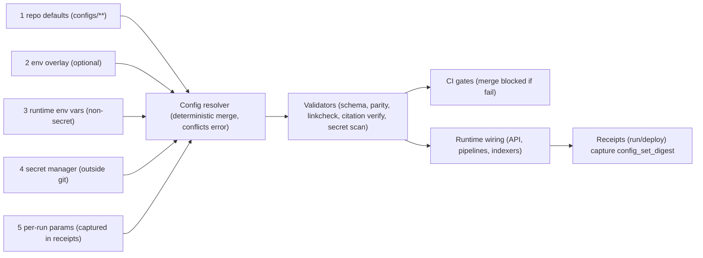

<!-- [KFM_META_BLOCK_V2]
doc_id: kfm://doc/9f8d0a2c-6d1e-4b22-a51d-0d7ac820e4e1
title: configs — Governed configuration registry
type: standard
version: v3
status: draft
owners: TBD (set via CODEOWNERS)
created: 2026-02-22
updated: 2026-03-02
policy_label: restricted
related:
  - ../README.md
  - ../.github/README.md
tags: [kfm, configs, governance, policy-as-code, contracts, promotion-contract, evidence, receipts, deterministic, fail-closed]
notes:
  - Policy-bearing configuration MUST be reviewed, tested, and promotion-gated.
  - This README is fail-closed: repo-specific wiring is UNKNOWN until validated in CI and confirmed via tree/paths.
  - Prefer machine-readable registries + schema validation over tribal knowledge.
  - Alignment anchors: (1) Policy-as-code parity CI↔runtime, (2) Trust membrane + policy-safe errors, (3) EvidenceRefs must resolve, (4) Promotion Contract v1 gate labels A–F required; G optional-but-recommended.
[/KFM_META_BLOCK_V2] -->

<a id="top"></a>

# configs/ — Governed configuration registry

**Purpose:** Governed, version-controlled configuration that drives **policy enforcement**, **contract validation**, **promotion gates**, and **runtime wiring** across Kansas Frontier Matrix (KFM) — **without shipping secrets**.

**Status:** draft • **Owners:** TBD via `CODEOWNERS` • **Policy label:** restricted  
**Core posture:** default-deny • fail-closed • deterministic resolution • audit-ready • reversible changes


<!-- TODO: replace placeholder badges with real GitHub Actions badges once workflow names/paths are confirmed.
Example: https://img.shields.io/github/actions/workflow/status/<org>/<repo>/<workflow>.yml?branch=main
-->

> [!WARNING]
> `configs/` is **behavioral surface area**.
> If a config change can alter **allow/deny**, **obligations**, **rights**, **sensitivity**, **promotion gates**, **evidence resolution**, **citation verification**, or **error behavior**, it is governance-critical and MUST be validated + reviewed like production code.

---

## Navigation

- [Directory contract](#directory-contract)
- [Truth status legend](#truth-status-legend)
- [Where this fits in the repo](#where-this-fits-in-the-repo)
- [Alignment anchors](#alignment-anchors)
- [Governance model and ownership](#governance-model-and-ownership)
- [Quick start](#quick-start)
- [Repo reality check](#repo-reality-check)
- [Scope](#scope)
- [KFM invariants this directory must support](#kfm-invariants-this-directory-must-support)
- [Promotion Contract v1 gates](#promotion-contract-v1-gates)
- [Gate label normalization](#gate-label-normalization)
- [Recommended layout](#recommended-layout)
- [Config registry](#config-registry)
- [Config resolver contract](#config-resolver-contract)
- [Conventions](#conventions)
- [Config precedence and resolution](#config-precedence-and-resolution)
- [Validation and CI gates](#validation-and-ci-gates)
- [Threat-model checklist for config changes](#threat-model-checklist-for-config-changes)
- [Secrets and sensitive values](#secrets-and-sensitive-values)
- [Change management and rollback](#change-management-and-rollback)
- [Definition of Done](#definition-of-done)
- [Appendix](#appendix)
- [Source references](#source-references)

---

## Directory contract

| Contract item | Requirement |
|---|---|
| Purpose | Governed configuration that can change system behavior without changing core code |
| Acceptable inputs | Small, reviewable, machine-validated config files (YAML/JSON/TOML/etc.) that drive policy wiring, promotion gates, pipeline/runtime/UI defaults, observability redaction, and deployment **templates** |
| Exclusions | **Secrets**, private keys, credentialed connection strings, raw restricted coordinates, PII, large datasets, opaque binaries, ad-hoc scripts without tests |
| Review posture | **Fail closed** for governance-critical changes; steward/owner review required |
| Promotion posture | Config changes that affect publishability, access, identity, evidence resolution, or citation verification MUST be promotion-gated and auditable |
| Audit posture | Resolved config set SHOULD be captured (by digest) in run receipts and/or deployment receipts |
| Determinism | Config resolution MUST be deterministic; conflicts MUST surface as errors (no silent precedence) |

> [!NOTE]
> If the real repo structure differs from this README, update the **Config registry** first. Don’t “fix” drift by weakening gates.

---

## Truth status legend

- **CONFIRMED (design):** required KFM posture (must hold regardless of stack)
- **UNKNOWN (repo):** not verified in *this* repository snapshot yet (treat as TODO)
- **PROPOSED:** recommended pattern/template (adopt only after verification)

This README includes **PROPOSED** structure to support bootstrapping, while keeping repo-specific facts **UNKNOWN** until verified.

---

## Where this fits in the repo

`configs/` is the **wiring layer**: it selects, constrains, and parameterizes behavior across the system.

**Keep boundaries clean (fail closed):**
- **`contracts/`**: schemas and API contracts (OpenAPI, JSON Schema, controlled vocabs).
- **`policy/`**: policy engine + rules + fixtures/tests (allow/deny + obligations).
- **`data/`**: dataset specs, truth-path artifacts (RAW/WORK/PROCESSED/CATALOG/PUBLISHED), receipts/manifests.
- **`configs/`**: **non-secret** configuration that selects contract/policy versions, defines gate thresholds, and wires runtime defaults.

> [!IMPORTANT]
> If a rule changes **enforcement semantics**, it belongs in `policy/` (and must have fixtures).
> If a rule changes **shape/compatibility**, it belongs in `contracts/` (and must be versioned).
> If a file changes **wiring/thresholds/defaults**, it may belong in `configs/` — but MUST be validated and ownership-routed.

---

## Alignment anchors

These anchors are the “don’t drift” constraints that `configs/` must support:

- **Policy-as-code parity:** CI and runtime must share the same semantics (or at minimum the same fixtures+outcomes).
- **Trust membrane:** UI/clients never reach storage directly; governed APIs enforce policy and return policy-safe errors.
- **Evidence resolution contract:** citations are EvidenceRefs that must resolve deterministically under policy.
- **Promotion Contract v1:** A–F required; G optional-but-recommended. Gate semantics must fail closed.

> [!NOTE]
> `configs/` is where “alignment drift” sneaks in: different envs, different validators, different policy semantics. Treat drift as a release blocker.

---

## Governance model and ownership

This directory assumes a minimal governance model (PROPOSED) where:
- **Contributors** propose changes (cannot publish/promote).
- **Reviewer/Steward** approves promotions and story publishing; owns policy labels and redaction rules.
- **Operators** run pipelines and deployments; cannot override policy gates.
- **Governance council/community stewards** control culturally sensitive materials and release rules.

> [!IMPORTANT]
> Ownership is only real once `CODEOWNERS` + branch protections/rulesets make the right reviews **mandatory**.

### CODEOWNERS routing (PROPOSED)

```text
# Governance-critical policy inputs
configs/policy/**        @kfm-governance

# Promotion gates + manifests
configs/promotion/**     @kfm-governance @kfm-platform

# Contract wiring
configs/contracts/**     @kfm-standards @kfm-platform

# Runtime knobs
configs/runtime/**       @kfm-platform

# UI wiring
configs/ui/**            @kfm-frontend @kfm-governance

# Observability (log redaction, field allowlists)
configs/observability/** @kfm-platform
```

---

## Quick start

1. Identify which **contract surface** your change touches:
   - policy decisions / obligations
   - rights/licensing behavior
   - schemas / profiles / cross-link rules
   - promotion gates / thresholds
   - evidence resolution / citation verification knobs
   - runtime wiring (flags, caching, indexing)
   - UI wiring (layer registries, view-state schema selection)
   - observability redaction rules
2. Make the smallest change that is **testable** and **reversible**.
3. Update the **Config registry** entry (owner + validators + change class).
4. Add/update **fixtures/tests** proving the expected behavior.
5. Ensure CI validations pass (including anti-skip summary).
6. For governance-critical changes, ensure steward review is enforced and approvals are auditable.

> [!TIP]
> Treat every config change as a behavior change. If you can’t explain how decisions change, you likely can’t validate it.

---

## Repo reality check

This README describes a **target posture**. Before treating statements as **CONFIRMED (repo)**, verify the repo actually contains:

- [ ] `CODEOWNERS` routes reviews for governance-critical config paths
- [ ] CI checks validate configs (schemas + policy parity + linkcheck + citation verification + secret scanning)
- [ ] a deterministic config resolver that **fails on conflicts** (no silent precedence)
- [ ] runtime components apply the **same policy semantics** as CI (parity)
- [ ] publish workflows enforce **resolvable citations** (no “trust me” links)

Minimum verification steps (copy/paste):

```bash
# 0) Capture commit hash and root tree (so doc statements can cite repo reality)
git rev-parse HEAD
tree -L 3 || find . -maxdepth 3 -type d -print

# 1) Inspect actual configs layout
find configs -maxdepth 4 -type d -print
find configs -maxdepth 4 -type f -print | head -n 200

# 2) Find ownership rules
ls -la .github/CODEOWNERS 2>/dev/null || ls -la CODEOWNERS 2>/dev/null || true

# 3) Locate CI workflows that validate configs
ls -la .github/workflows 2>/dev/null || true

# 4) Search for config resolver / loader
rg -n "config resolver|loadConfig|resolveConfig|CONFIG_|feature_flag|policy_label|EvidenceRef|evidence/resolve" -S . || true

# 5) Find required gating checks (gate labels + mapping to validators)
rg -n "Promotion Contract|gate[_ -]?[a-gA-G]|Gate [A-G]|spec_hash|policy parity|linkcheck|receipt|manifest|citation" .github/workflows -S || true
```

> [!IMPORTANT]
> If validation, ownership routing, deterministic resolution, policy-safe errors, or citation-resolvability gates are missing, treat `configs/` as **unsafe** until those controls exist.

---

## Scope

### What lives here

`configs/` holds configuration that changes **system behavior** without changing core code. Treat these files as **governed artifacts**: reviewable, testable, and promotion-gated.

Common categories:

- **Policy-bearing inputs** (configuration *about* policy)
  - policy label definitions (meaning, display text, export posture)
  - obligation catalogs (generalize geometry, suppress export, watermark, require notice)
  - sensitivity/risk rubrics (machine + human readable)
  - policy parity fixtures (synthetic allow/deny expectations)

- **Contract wiring**
  - schema/profile selection (per environment)
  - validator knobs and cross-link/lint rules
  - controlled vocabulary selection and enforcement switches

- **Promotion Contract wiring**
  - gate definitions, required artifacts, failure modes
  - “what must be true to promote” per dataset class and per policy label
  - manifest/receipt schema templates (or pointers to `contracts/`)

- **Runtime wiring** (non-secret defaults)
  - feature flags
  - caching rules (including auth/policy-aware cache keying)
  - indexing configuration (search/vector/graph projections)
  - rate limits / safety knobs (values or references; enforcement is runtime)

- **Pipeline wiring** (non-secret)
  - schedules, dataset class defaults, allowed transforms
  - QA threshold defaults (where the pipeline/spec expects them)

- **UI wiring** (non-secret)
  - layer registry defaults, UI policy badge rules, view-state schema versions
  - citation scheme allowlists (display-only; enforcement is server-side)

- **Observability wiring**
  - telemetry/log redaction rules (policy-safe)
  - log field allowlists/denylists and retention class tags

### What does not live here

- **Secrets** (tokens, passwords, private keys, credentialed connection strings)
- **Raw restricted coordinates** or sensitive-location datasets
- **PII** or private individual details
- **Large datasets** or derived artifacts (those belong in truth path zones with receipts)
- **Ad-hoc scripts** without tests (put tooling under `tools/`)

> [!WARNING]
> If it would be unsafe to paste into a public issue, it does not belong in `configs/`.

---

## KFM invariants this directory must support

Configuration exists to make KFM’s posture enforceable.

### Trust membrane (CONFIRMED design)

- Apps/clients MUST NOT access DB/object storage directly.
- Enforcement MUST happen behind governed APIs (policy + evidence + audit).
- Config MUST NOT enable bypass routes (including caching, backdoors, or error behaviors that leak restricted existence).

### Policy-as-code parity (CONFIRMED design)

- Policy semantics MUST match between CI and runtime (fixture outcomes match).
- If CI and runtime disagree, CI guarantees are meaningless → release blocker.

### Evidence resolution contract (CONFIRMED design)

- Evidence resolution MUST be deterministic and policy-aware.
- EvidenceRefs MUST resolve without guessing (catalog cross-links + resolvers must be strict).
- Resolver MUST return allow/deny + obligations and only include artifact links if allowed.
- Resolver MUST be usable from UI in a bounded call budget (avoid chatty UI→API loops).
- If citations cannot be verified, the system MUST abstain or reduce scope.

### Sensitivity defaults (CONFIRMED posture; exact labels may vary)

- Default deny for sensitive-location and restricted datasets.
- If a public representation is allowed, produce a separate public_generalized dataset version.
- Never leak restricted metadata via error differences.
- Do not embed precise coordinates in Story Nodes or Focus Mode outputs unless policy explicitly allows.
- Treat redaction/generalization as a first-class transform recorded in PROV.

### Licensing and rights enforcement (CONFIRMED posture)

- “Online availability does not equal permission to reuse.”
- Rights metadata must be encoded and enforced in downloads/exports and UI display.
- Metadata-only reference mode is allowed when mirroring/redistribution is not allowed or is unclear.

---

## Promotion Contract v1 gates

Config must support deterministic, fail-closed promotion gates (A–F required; G optional-but-recommended).

> [!NOTE]
> KFM documentation may differ on whether “QA & thresholds” is a named gate or a required check inside Gate E/F workflows.
> **Do not weaken QA**: QA outcomes MUST be versioned, referenced by receipts/manifests, and fail closed when thresholds are not met.

Canonical (this README):

- **Gate A — Identity & versioning:** dataset_id + dataset_version_id; deterministic spec_hash inputs; content digests; drift detection
- **Gate B — Licensing & rights metadata:** license/rights completeness + upstream terms snapshot + export posture consistency
- **Gate C — Sensitivity classification & redaction plan:** policy_label + obligations; default-deny preserved; generalized derivative strategy where required
- **Gate D — Catalog triplet validation:** DCAT/STAC/PROV schema validation + required cross-links + EvidenceRefs resolve without guessing
- **Gate E — Run receipt and checksums:** run receipt exists and is schema-valid; includes checksums/digests and references validation outputs (including QA reports where applicable)
- **Gate F — Policy tests and contract tests:** policy fixtures pass; schema/profile tests pass; evidence resolver contract tests pass
- **Gate G — Production posture (optional but recommended):** promotion manifest/release record, supply-chain attestations (SBOM/provenance), plus smoke checks (perf/a11y) as required by environment policy

---

## Gate label normalization

Some briefs label gates as:
- **E = QA & thresholds**
- **F = Run receipt & audit record**
- **G = Release manifest**

This README treats that as a **labeling difference**, not a behavior difference:
- QA outcomes are still required and fail-closed.
- Receipts and manifests are still required and digest-addressed.
- Implementations MAY keep “legacy E/F/G naming” internally, but MUST map to the canonical gate labels in governance dashboards and steward checklists.

> [!IMPORTANT]
> If you standardize gate labels in CI, document the mapping in `configs/promotion/gates/gate_codes.v1.yaml` and keep it stable.

---

## Recommended layout

> [!NOTE]
> This is a **PROPOSED** buildable layout. Align it to repo reality and keep the Config registry current.

```text
configs/                                              # Governed configuration: machine-validated registries + policy-bearing knobs (NO secrets) for consistent CI/runtime behavior
├─ README.md                                           # Entry guide: what lives here, what must NOT live here (secrets), validation/gates, and how configs map to policy/contracts/apps
│
├─ registry/                                           # Machine-readable registries + schemas + fixtures (small, canonical, CI-validated)
│  ├─ README.md                                        # Registry contract: required fields, naming/versioning rules, how CI validates (schema + checksums), and update workflow
│  ├─ configs.v1.json                                  # Canonical config registry (every governed config file/area listed with owner, version, schema, policy_label, and consumers)
│  ├─ schemas/                                         # JSON Schemas for registries + config shapes (or pointers to contracts/ equivalents)
│  │  ├─ kfm.config_registry.v1.schema.json             # Schema: validates configs.v1.json structure (entries, ownership, references, checksums expectations)
│  │  ├─ kfm.policy_labels.v1.schema.json               # Schema: validates policy label vocabulary/definitions (allowed values + metadata)
│  │  ├─ kfm.obligations_catalog.v1.schema.json         # Schema: validates obligation types + parameters + handling requirements (UI/API logging)
│  │  ├─ kfm.promotion_gates.v1.schema.json             # Schema: validates gate definitions (IDs, required artifacts, pass/fail codes)
│  │  ├─ kfm.linkcheck_rules.v1.schema.json             # Schema: validates linkcheck allow/deny rules (domains, paths, docs scope)
│  │  ├─ kfm.feature_flags.v1.schema.json               # Schema: validates feature flag definitions (default, rollout, owners, safety notes)
│  │  ├─ kfm.rate_limits.v1.schema.json                 # Schema: validates rate limit configuration (tiers, burst, backoff, policy label)
│  │  ├─ kfm.ui_layer_registry.v1.schema.json           # Schema: validates UI layer registry entries (source, time bounds, sensitivity, rendering policy)
│  │  ├─ kfm.view_state_schema.v1.schema.json           # Schema: validates view-state serialization contract (map/story/focus state shape + versioning)
│  │  └─ kfm.redaction_rules.v1.schema.json             # Schema: validates redaction/generalization rules (triggers, transforms, obligations emitted)
│  ├─ fixtures/                                        # Deterministic fixtures for CI validation (known-good and known-bad examples)
│  │  ├─ valid/                                        # Fixtures expected to pass schema + policy checks (used to prevent false negatives)
│  │  ├─ invalid/                                      # Fixtures expected to fail (used to prevent policy regressions / ensure fail-closed)
│  │  └─ README.md                                     # Fixture usage: how tests load fixtures, naming rules, and how to add new cases
│  └─ _generated/                                      # OPTIONAL generated outputs (indexes/checksums); repo policy decides commit vs ignore
│     ├─ configs.index.v1.json                          # Generated index for tools/CI (fast lookup: config → schema/owner/consumers)
│     └─ checksums.v1.json                              # Generated checksums/digests for governed config files (tamper detection + reproducibility)
│
├─ policy/                                             # Policy-bearing configuration (NOT secrets; NOT policy engine code) consumed by policy/ + apps/
│  ├─ README.md                                        # What belongs here vs policy/rego/, how changes are reviewed, and how parity fixtures are maintained
│  ├─ labels/                                          # Label vocab/materialization (e.g., label definitions, default handling, mapping to obligations)
│  ├─ obligations/                                     # Obligation catalog + parameters (notice text, UI behaviors, logging requirements)
│  ├─ rubrics/                                         # Governance rubrics (licensing/sensitivity/quality scoring guides used by stewards and CI hints)
│  └─ fixtures/                                        # Policy parity fixtures (synthetic allow/deny/obligation expectations for CI/runtime consistency)
│
├─ contracts/                                          # Contract wiring knobs (which versions are active) + validation profiles (not the contracts themselves)
│  ├─ README.md                                        # How contract versions are selected, compatibility rules, and how validators are configured
│  ├─ profiles/                                        # Validation profiles (e.g., “strict”, “dev”, “publish”) selecting schema sets and severity thresholds
│  ├─ vocab/                                           # Contract vocabulary selections/overrides (e.g., allowed enums for this deployment)
│  └─ linkcheck/                                       # Linkcheck configuration (allowed domains, local doc rules, CI behavior)
│
├─ promotion/                                          # Promotion Contract wiring (gate definitions, templates, and promotion classes)
│  ├─ README.md                                        # How promotion works, where gate artifacts live, and how CI/runtime enforce A–F (+ optional G)
│  ├─ gates/                                           # Gate definitions + required artifacts + standardized failure codes
│  │  ├─ README.md                                     # Gate authoring rules, test expectations, and how gates map to CI jobs/status checks
│  │  ├─ gates.v1.yaml                                 # Canonical gate set (A–F required, G optional) with gate IDs, requirements, and enforcement mode
│  │  ├─ gate_a_identity.v1.yaml                       # Gate A: identity/deterministic IDs/spec_hash rules (naming, hashing, stable references)
│  │  ├─ gate_b_rights.v1.yaml                         # Gate B: rights/licensing constraints (permissions, attribution, redistribution, embargo)
│  │  ├─ gate_c_sensitivity.v1.yaml                    # Gate C: sensitivity/policy_label correctness + redaction/generalization requirements
│  │  ├─ gate_d_catalogs.v1.yaml                       # Gate D: catalog completeness (DCAT/STAC/PROV + required links/fields)
│  │  ├─ gate_e_receipts_checksums.v1.yaml             # Gate E: receipts/checksums integrity (run receipts, digests, reproducibility)
│  │  ├─ gate_f_policy_contract_tests.v1.yaml          # Gate F: policy + contract tests (OPA parity + schema validation) must pass
│  │  ├─ gate_g_production_posture.v1.yaml             # OPTIONAL Gate G: production posture (attestations, smoke checks, deploy readiness)
│  │  └─ gate_codes.v1.yaml                            # Standard failure/pass codes (machine-readable) used in receipts, CI summaries, and dashboards
│  ├─ templates/                                       # Templates for promotion artifacts (copy/fill) if not stored elsewhere in repo
│  │  ├─ README.md                                     # Template usage rules + where to place completed artifacts + versioning guidance
│  │  ├─ promotion_manifest.v1.json                    # OPTIONAL: promotion record referencing artifacts + digests + approvals + gate results
│  │  ├─ run_receipt.v1.json                           # Run Receipt template (pipelines/index/story/focus): inputs/outputs/digests/tools/versions
│  │  ├─ run_manifest.v1.json                          # OPTIONAL: rollup manifest oriented around promotion (multi-receipt aggregation)
│  │  ├─ audit_entry.v1.json                           # OPTIONAL: audit ledger entry template (decision refs, event type, actor, timestamps)
│  │  ├─ qa_report.v1.json                             # OPTIONAL: QA summary template referenced by receipts (tests, thresholds, anomalies)
│  │  └─ story_publish_receipt.v1.json                 # OPTIONAL: story publish receipt template (claims/citations, layers, obligations, approvals)
│  └─ classes/                                         # Dataset classes (type-specific rules/constraints) used by gates, validators, and UI defaults
│     ├─ README.md                                     # What “class” means, how to add one, and which gates/validators consume classes
│     ├─ classes.v1.yaml                               # Canonical class registry (IDs, descriptions, required metadata, validators)
│     ├─ vector.v1.yaml                                # Class: vector data (features/CRS/geometry rules; tiling/validation expectations)
│     ├─ raster.v1.yaml                                # Class: raster data (bands/CRS/resolution rules; nodata/tiling expectations)
│     ├─ documents.v1.yaml                             # Class: documents (OCR/text extraction rules; citation/provenance requirements)
│     ├─ timeseries.v1.yaml                            # Class: time series (time semantics, aggregation rules, missingness, units)
│     └─ sensitive_location.v1.yaml                    # Class: sensitive location (mandatory redaction/generalization + restricted handling)
│
├─ runtime/                                            # Runtime tuning knobs (safe, governed) for deployed services and apps
│  ├─ README.md                                        # What can be tuned at runtime, how rollouts occur, and how changes are audited
│  ├─ feature_flags/                                   # Feature flags (defaults, rollout plans, owners, safety notes; no secrets)
│  ├─ caching/                                         # Cache policies (TTLs, invalidation strategy, cache keys policy interactions)
│  ├─ indexing/                                        # Indexing knobs (batch sizes, schedules, backpressure; must not violate policy)
│  └─ rate_limits/                                     # Rate limit configs (tiers, burst limits, per-route/per-actor policy)
│
├─ pipelines/                                          # Pipeline configuration (schedules, runners, and dataset-default knobs)
│  ├─ README.md                                        # Pipeline config model, how schedules/runners are selected, and how configs map to receipts
│  ├─ schedules/                                       # Schedules for recurring pipelines (cron-like definitions + blackout windows)
│  ├─ runners/                                         # Runner definitions (local/compose/k8s) and resource profiles (CPU/mem/timeouts)
│  └─ dataset_defaults/                                # Default config per dataset class/source (timeouts, QA thresholds, output formats)
│
├─ ui/                                                 # UI configuration (layer registry, view-state schemas, and trust badges/policy signals)
│  ├─ README.md                                        # How UI consumes configs, versioning strategy, and policy-aware rendering rules
│  ├─ layers/                                          # Layer registry and layer defaults (sources, styling hints, time bounds, label-aware display)
│  ├─ view_state/                                      # View state schemas + defaults (map/story/focus serialization and compatibility)
│  └─ policy_badges/                                   # Trust/policy badge configuration (labels → icons/text; obligation surfacing rules)
│
├─ observability/                                      # Logging/metrics configuration (redaction-aware, policy-safe) for auditability and ops
│  ├─ README.md                                        # Observability goals, data minimization, redaction rules, and audit expectations
│  ├─ logging/                                         # Log routing/levels/fields (must avoid PII/leaks; enforce redaction/generalization)
│  ├─ metrics/                                         # Metrics definitions + labels (cardinality rules; policy-safe dimensions)
│  └─ redaction/                                       # Log/trace redaction rules (fields to drop/hash/generalize; obligations for ops views)
│
└─ env/                                                # Environment examples (NO secrets): documentation for required variables + safe defaults
   ├─ README.md                                        # Variable reference (what each var does) + where secrets must be stored/managed instead
   ├─ dev.example.env                                  # Example dev env file (safe placeholders; no credentials)
   ├─ staging.example.env                              # Example staging env file (safe placeholders; no credentials)
   └─ prod.example.env                                 # Example production env file (safe placeholders; no credentials)
```

> [!IMPORTANT]
> If your repo already has top-level `policy/` and `contracts/` as sources of truth, avoid duplication:
> - keep policy *rules* and schema *definitions* where they live,
> - keep only **wiring + selection + registries + parity fixtures** under `configs/`.

---

## Config registry

The registry prevents config sprawl and “unknown behavior.”

### Machine-readable registry (PROPOSED)

Store a canonical registry that CI can validate:

- `configs/registry/configs.v1.json`

Template:

```json
{
  "kfm_config_registry_version": "v1",
  "updated": "2026-03-02",
  "entries": [
    {
      "id": "policy.labels",
      "path": "configs/policy/labels/",
      "format": "yaml",
      "behavior_class": "governance-critical",
      "promotion_gates_impacted": ["C", "F"],
      "validators": ["configs-lint", "schema-validate", "policy-parity"],
      "owners": ["@kfm-governance"],
      "hash_inputs": true,
      "notes": "Defines policy labels and semantics used by API + evidence resolver + UI badges."
    }
  ]
}
```

### Registry table (human)

Keep this table consistent with the machine registry if you adopt it.

| Area | Path (relative) | Used by | CI validation | Change class | Gate impact |
|---|---|---|---|---|---|
| Policy labels | `policy/labels/` | API + evidence resolver + UI badges | **Required** | Governance-critical | C, F |
| Obligations catalog | `policy/obligations/` | API + pipelines + exports | **Required** | Governance-critical | C, F |
| Policy fixtures | `policy/fixtures/` | CI + runtime parity | **Required** | Governance-critical | F |
| Profiles wiring | `contracts/profiles/` | catalog validators | **Required** | Contract-breaking (sometimes) | D, F |
| Linkcheck rules | `contracts/linkcheck/` | CI linkcheck + resolver tests | **Required** | Contract-breaking (sometimes) | D, F |
| Gate definitions | `promotion/gates/` | promotion lanes | **Required** | Governance-critical | A–F |
| QA thresholds | `promotion/qa/` | pipelines + promotion | **Required** | Governance-critical | E (and/or legacy “E”) |
| Receipts/manifests templates | `promotion/templates/` | audit tooling + publish lanes | **Required (schema)** | Governance-critical | E, G |
| Feature flags | `runtime/feature_flags/` | API + UI | **Required (lint)** | Runtime behavior | (varies) |
| UI layers | `ui/layers/` | UI + API metadata | **Required (lint)** | UX behavior | (display-only) |
| Observability redaction | `observability/redaction/` | logs/metrics | **Required** | Governance-critical | F (privacy posture) |
| Env examples | `env/*.example.env` | local dev | **Required (secret scan)** | Docs-only | (none) |

### Registry Definition of Done

- [ ] Every config area has an owner via `CODEOWNERS`.
- [ ] Every config area has at least one validator running in CI.
- [ ] Governance-critical entries have fixtures proving allow/deny/obligation outcomes.
- [ ] Any config that affects publishability maps to Promotion Contract gates (canonical labels).
- [ ] The registry is updated in the same PR that adds/moves/deprecates config.

---

## Config resolver contract

Config resolution MUST be deterministic and reproducible for audits.

### Resolver invariants (CONFIRMED design)

- Deterministic: same inputs → same resolved config object.
- Explicit conflicts: conflicting sources MUST error unless an explicit, tested override exists.
- Fail closed: missing required config keys MUST error (no silent defaults for governance-critical fields).
- Canonicalization: any hashed config inputs MUST be canonicalized before hashing.
- Auditability: resolver MUST expose (a) resolved config, (b) source list, and (c) a digest.

### Suggested resolver outputs (PROPOSED)

```json
{
  "resolved_at": "2026-03-02T00:00:00Z",
  "config_set_digest": "sha256:...",
  "sources": [
    {"kind": "repo", "path": "configs/policy/labels/labels.v1.yaml", "digest": "sha256:..."},
    {"kind": "env_overlay", "path": "configs/env/staging.yaml", "digest": "sha256:..."}
  ],
  "resolved": { "policy": { "labels": { /* ... */ } } }
}
```

> [!WARNING]
> A resolver that “picks one silently” breaks auditability. Conflicts MUST surface as errors unless explicitly overridden with tests and documentation.

---

## Conventions

### Formats

- Prefer YAML for human-authored config; JSON for fixtures and machine-to-machine artifacts.
- Keep files small and composable.
- Avoid YAML anchors/aliases unless the repo explicitly standardizes them.
- Every governed config SHOULD have a schema or strict lint rules.

> [!TIP]
> If a config has no validator, it is code without tests.

### Identifiers and versioning

- Contract-bearing config SHOULD be versioned (e.g., `v1`, `2026-03`, semver).
- Policy labels are controlled vocabulary; changing meaning is breaking behavior.
- Any identifier that flows into dataset identity/spec hashing MUST be stable and tested.

### Canonicalization and hashing

- When hashing config inputs (for spec_hash or drift detection), canonicalize first (stable key ordering, consistent whitespace).
- Recompute digests in CI for drift detection; treat changes to hash inputs as governance-critical.

### Secret references

If a config must reference a secret, store only a **secret identifier**, never the secret value:

- `secret_ref: KFM_API_KEY`
- `secret_ref: kfm/<env>/<service>/token`

---

## Config precedence and resolution

### Recommended precedence (PROPOSED)

1. Repository defaults in `configs/**`
2. Environment overlay (dev/stage/prod) **if used** (examples unless explicitly promoted)
3. Runtime environment variables (non-secret)
4. Secret manager injection (outside git)
5. Per-run parameters (pipeline/story/focus) captured in run receipts

If two sources conflict, resolution MUST be explicit. If required config is missing, **fail closed**.

### Resolution and enforcement flow


```mermaid
flowchart LR
  A["1 repo defaults (configs/**)"] --> R["Config resolver (deterministic merge, conflicts error)"]
  B["2 env overlay (optional)"] --> R
  C["3 runtime env vars (non-secret)"] --> R
  D["4 secret manager (outside git)"] --> R
  E["5 per-run params (captured in receipts)"] --> R

  R --> V["Validators (schema, parity, linkcheck, citation verify, secret scan)"]
  V --> CI["CI gates (merge blocked if fail)"]
  V --> RT["Runtime wiring (API, pipelines, indexers)"]

  RT --> REC["Receipts (run/deploy) capture config_set_digest"]
```

---

## Validation and CI gates

This directory is only safe if continuously validated.

### Required validations (minimum)

- **Schema/lint:** configs validate against schemas or strict lint rules
- **Policy parity:** fixtures prove expected allow/deny/obligations (CI + runtime parity)
- **Linkcheck:** EvidenceRef and catalog links resolvable deterministically
- **Citation resolvability:** story citations and Focus Mode citations must resolve via evidence resolver (no guessing)
- **QA thresholds:** QA report format validated; thresholds versioned; failures quarantine/promotion-block
- **Secret scanning:** blocks committed credentials
- **Anti-skip summary:** a final always-runs job fails if any required config gate did not run

> [!IMPORTANT]
> Required checks MUST NOT be skippable via `paths:` filters or `if:` conditions.
> Prefer a single “gate-summary” status check as the merge requirement.

### Suggested local commands (PROPOSED)

Replace placeholders with real repo commands once wiring exists:

```bash
make lint-configs
make validate-config-schemas
make test-policy-parity
make linkcheck-catalogs
make test-citation-resolve
make validate-qa-thresholds
make scan-secrets
```

---

## Threat-model checklist for config changes

Use these checks when reviewing any config that changes enforcement posture.

- [ ] **Trust membrane:** UI/client does not fetch data directly from object storage or databases.
- [ ] **Policy-safe errors:** public users cannot infer restricted existence through error behavior.
- [ ] **Exports governed:** downloads/exports respect policy labels + rights metadata.
- [ ] **Evidence + citations:** citations resolve to evidence bundles and are policy-allowed.
- [ ] **Auditability:** governed operations emit audit_ref and capture digests (including config_set_digest).
- [ ] **Policy tested:** policy rules tested in CI with fixtures; parity maintained.

> [!WARNING]
> If any item is “unknown,” treat it as a release blocker until proven.

---

## Secrets and sensitive values

**Never commit secrets.** Use environment injection and secret managers.

Also prohibited in `configs/`:
- raw restricted geometry / sensitive site coordinates
- PII or reidentifiable personal attributes

If sensitivity handling is unclear, default to deny and route for governance review.

---

## Change management and rollback

### Change classes

Use PR labels or title prefixes for `configs/` changes:

| Class | Meaning | Extra requirements |
|---|---|---|
| Docs-only | README/examples; no behavior change | lint + secret scan |
| Runtime behavior | flags/caches/index knobs | smoke checks for affected components |
| Contract-breaking | profile/schema selection rules | version bump + migration notes |
| Governance-critical | allow/deny, obligations, sensitivity defaults, gate thresholds, citation rules, error model knobs | steward review + parity fixtures + gate summary blocking |
| Emergency | kill-switch / recall / rollback | steward + operator sign-off; audit entry required |

### Rollback expectations

Every governance-critical change MUST include a rollback plan:
- revert commit/PR
- restore prior config version
- confirm parity tests and linkcheck pass on rollback

### Deprecation and migrations

- Deprecations MUST be explicit (document in-file and/or ADR/changelog).
- Keep old versions readable long enough for reproducibility/audits.
- Remove deprecated configs only when receipts prove successful migration.

---

## Definition of Done

Use this checklist in PRs touching `configs/`.

- [ ] Change is scoped and reversible (rollback described)
- [ ] Config registry updated (table + machine registry if adopted)
- [ ] Validators updated/added (schema/lint/parity/linkcheck/citation/QA as applicable)
- [ ] Governance-critical changes include fixtures proving new behavior
- [ ] CI validations pass (and anti-skip summary passes)
- [ ] No secrets committed (scan passes)
- [ ] Required owners reviewed (CODEOWNERS + branch protection)
- [ ] Contract-breaking change includes migration notes
- [ ] Resolved config digest is captured in receipts (run/deploy) (if wiring exists)

---

## Appendix

<details>
<summary><strong>PROPOSED: Minimal policy label file shape</strong></summary>

Example: `configs/policy/labels/labels.v1.yaml`

```yaml
version: v1
labels:
  public:
    description: "Publicly viewable and exportable under license terms."
    export: allowed
  public_generalized:
    description: "Public viewable; geometry generalized by obligation."
    export: allowed
    obligations: ["generalize_geometry", "show_generalization_notice"]
  restricted:
    description: "Access restricted by role; deny by default."
    export: denied
  restricted_sensitive_location:
    description: "Sensitive location; deny public access; generalized derivative required for public surfaces."
    export: denied
```

</details>

<details>
<summary><strong>PROPOSED: Obligation catalog shape</strong></summary>

Example: `configs/policy/obligations/obligations.v1.yaml`

```yaml
version: v1
obligations:
  generalize_geometry:
    kind: transform
    parameters:
      method: "grid_snap"
      cell_meters: 1000
  suppress_export:
    kind: enforcement
    parameters:
      export: false
  show_generalization_notice:
    kind: ui_notice
    parameters:
      message: "Geometry generalized due to policy."
```

</details>

<details>
<summary><strong>PROPOSED: Promotion manifest shape (v1)</strong></summary>

A promotion manifest (release record) is an immutable record of what was promoted
(artifact paths + digests + catalogs + QA + policy decision + approvals).

```json
{
  "kfm_promotion_manifest_version": "v1",
  "dataset_slug": "<slug>",
  "dataset_version_id": "<version>",
  "spec_hash": "sha256:<...>",
  "released_at": "<iso8601>",
  "artifacts": [{ "path": "<...>", "digest": "sha256:<...>", "media_type": "<...>" }],
  "catalogs": [
    { "path": "dcat.jsonld", "digest": "sha256:<...>" },
    { "path": "stac/collection.json", "digest": "sha256:<...>" },
    { "path": "prov/bundle.jsonld", "digest": "sha256:<...>" }
  ],
  "qa": { "status": "pass|fail", "report_digest": "sha256:<...>" },
  "policy": { "policy_label": "<label>", "decision_id": "kfm://policy_decision/<id>" },
  "approvals": [{ "role": "steward", "principal": "<id>", "approved_at": "<iso8601>" }]
}
```

</details>

<details>
<summary><strong>PROPOSED: Kill-switch / recall semantics</strong></summary>

If you implement an operational kill-switch, keep it auditable (record reason + digest) and prefer a recall artifact over silent changes.

</details>

---

## Source references

This README is aligned to KFM governance snapshots and delivery briefings (internal). When discrepancies arise,
prefer the governance snapshots for **gate labels and invariants**, and treat briefings as implementation guidance.

<p align="right"><a href="#top">Back to top ↑</a></p>
