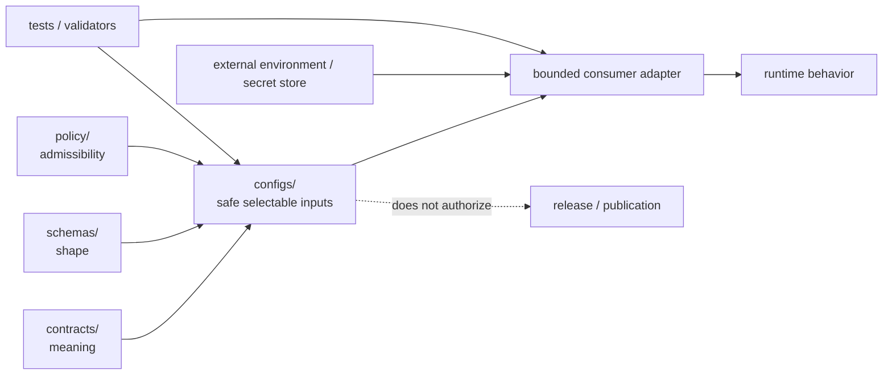

<!-- [KFM_META_BLOCK_V2]
doc_id: kfm://doc/configs-readme
title: configs/ — Canonical Commit-Safe Configuration Root
type: README
subtype: canonical-root-landing-page
version: v0.5
prior_version: v0.4
status: repository-grounded; canonical-root; active; mixed-maturity; no-secret-store; bounded-consumer-binding; non-authoritative
owner: "NEEDS VERIFICATION — CODEOWNERS routes /configs/ to @bartytime4life; no accepted configuration steward, security steward, required-review rule, or independent approval control was verified"
created: 2026-06-16
updated: 2026-08-08
supersedes: v0.4 documentation at the same path; no configuration payload, consumer, schema, contract, policy, test, workflow, deployment binding, runtime behavior, release object, or public behavior is superseded
policy_label: repository-facing; configuration; non-secret; commit-safe; consumer-bound; fail-closed; no-live-binding; non-publisher
current_path: configs/README.md
owning_root: configs/
root_class: canonical
responsibility: own safe, reviewable, non-secret configuration defaults, templates, examples, local-override guidance, and configuration-facing documentation without becoming semantic, schema, policy, source, evidence, lifecycle, release, runtime, deployment, or publication authority
truth_posture: cite-or-abstain; a committed configuration file proves only that bytes exist at a revision unless a named consumer, loader, precedence rule, schema, tests, workflow evidence, and deployment or runtime evidence establish more
evidence_snapshot:
  repository: bartytime4life/Kansas-Frontier-Matrix
  repository_id: "1059091169"
  visibility: public
  base_ref: main
  base_commit: c46694ebc4a43030592a785b44e85977b33f1de2
  root_tree: 6a86499d3428b3e909d334ff3b277e14962c53c3
  configs_tree: 1474b2ba6f770f13d7184f56866944dae2f90789
  prior_blob: 5c857beca50ebe103b2dcfc7d0212c64f3145d36
  directory_rules_doctrine_blob: fd49a0b83e55cef52c1124281f093e263526898d
  directory_rules_decision: ADR-0029 accepted
  directory_rules_legacy_blob: 18653c00ba193a4afaa3e07a0924452807fb98ef
  root_registry_blob: 024f668b5f0a9239bafa4f8b09e2afd86300ff8c
  codeowners_blob: dd2a84aa514d8ecd9208bc347f90f9a2ed37dd61
  gitignore_blob: 50e0e0e2485e6dbd6b7e1c2767350b459335b22b
  configs_domains_readme_blob: 0c4a7e7090dd9a8aabb01efc01ef073484bf0e08
  configs_maplibre_readme_blob: a216d1b1f2203f781846512ea2cca7ac163adc4b
  configs_templates_readme_blob: b1ab4ef69a6f5e74e7988ac8b3acb1ebb14cfcae
  configs_dev_readme_blob: e05de7866a7f2423f462002a687f79c967973ac1
  configs_local_readme_blob: 16f0c64baa482db3b146aa2a8d62a9b7baf3fede
  configs_examples_readme_blob: c040064e4aea09e4e87658faf37f57b4e13a96f8
  configs_test_readme_blob: 06c635480879e3c449fbd5f8c5b205c87f7bf9db
  maplibre_perf_envelope_blob: 2833f99b5316df91e71c0f8913bb06d70917abcf
  tracked_directories_including_root: 21
  tracked_blobs: 28
  tracked_readmes: 21
  tracked_templates: 5
  tracked_json_payloads: 1
  tracked_gitkeeps: 1
related:
  - ../CONTRIBUTING.md
  - ../.github/CODEOWNERS
  - ../.gitignore
  - ../.env.example
  - ../docs/doctrine/directory-rules.md
  - ../docs/adr/ADR-0029-adopt-directory-governance-standard-v2.md
  - ../docs/architecture/directory-rules.md
  - ../docs/security/SECRETS.md
  - ../docs/security/INCIDENT_RESPONSE.md
  - ../control_plane/root_registry.yaml
  - ../contracts/README.md
  - ../schemas/README.md
  - ../policy/README.md
  - ../tests/README.md
  - ../fixtures/README.md
  - ../tools/README.md
  - ../apps/README.md
  - ../runtime/README.md
  - ../infra/README.md
  - ../pipelines/README.md
  - ../pipeline_specs/README.md
  - ../data/README.md
  - ../release/README.md
notes:
  - "This is a same-path Markdown modernization. It creates no sibling README, configuration payload, secret, schema, contract, policy rule, fixture, validator, test, workflow, deployment binding, receipt, proof, release record, runtime behavior, or publication state."
  - "Adopted Directory Rules v2 §16 controls the first twelve H2 sections in this root README."
  - "ADR-0029 makes docs/doctrine/directory-rules.md the sole writable human Directory Rules authority. The full legacy architecture copy remains a read-only compatibility dependency pending its separate tombstone migration."
  - "The current tracked configuration inventory is closed over the exact Git tree at the pinned base: 21 README files, five templates, one JSON payload, and one zero-byte .gitkeep."
  - "The active Root Registry declares configs/ canonical and ACTIVE with the non_secret_configuration profile. That projection does not prove consumer binding, semantic validation, deployment use, or runtime behavior."
  - "Legacy anchors from v0.4 and earlier editions are retained through explicit compatibility anchors."
[/KFM_META_BLOCK_V2] -->

<a id="top"></a>

# `configs/` — Canonical Commit-Safe Configuration Root

> **One-line purpose.** `configs/` owns safe, reviewable, non-secret configuration defaults, templates, examples, local-override guidance, and configuration-facing documentation for named consumers—without becoming schema, policy, source, evidence, lifecycle, release, runtime, deployment, or publication authority.

**Quick navigation:** [Purpose](#purpose) · [Authority](#authority-level) · [Status](#status) · [Belongs](#what-belongs-here) · [Does not belong](#what-does-not-belong-here) · [Inputs](#inputs) · [Outputs](#outputs) · [Validation](#validation) · [Review](#review-burden) · [Related roots](#related-folders) · [ADRs](#adrs) · [Last reviewed](#last-reviewed) · [Lanes](#configuration-lane-index) · [File contract](#minimum-per-file-configuration-contract) · [Consumers](#consumer-binding-precedence-and-overrides) · [Security](#secrets-sensitive-values-endpoints-and-local-overrides) · [Failures](#failure-semantics-and-negative-cases) · [Rollback](#migration-correction-and-rollback) · [Open work](#open-verification-register)

> [!IMPORTANT]
> A configuration file is an **input to a named consumer**, not proof of consumer behavior. Presence, successful parsing, a friendly filename, a static badge, or a green unrelated workflow does not establish that the file is loaded, validated semantically, deployed, release-approved, or safe for public use.

> [!CAUTION]
> `configs/` is **not a secret store**. Real credentials, tokens, passwords, private keys, cookies, signed URLs, confidential endpoints, restricted identifiers, sensitive source details, and deployment-only values are forbidden—even in files labeled `local`, `dev`, `test`, `template`, or `example`.

> [!NOTE]
> The active Root Registry classifies `configs/` as a canonical, ACTIVE root with the `non_secret_configuration` validation profile. The register is a machine projection of adopted governance; it does not create configuration semantics, prove that a consumer loads a file, or authorize a configuration value to override policy, review, release, or public-access decisions.

---

<a id="1-purpose"></a>

## Purpose

`configs/` is KFM's canonical responsibility root for **commit-safe configuration material**.

It exists to make configuration inspectable and reviewable while preserving the separation among meaning, shape, admissibility, implementation, operation, lifecycle state, and release authority. A useful configuration surface lets a maintainer determine:

- what value is configurable;
- which named app, package, connector, pipeline, pipeline specification, runtime adapter, test harness, tool, or workflow consumes it;
- whether the file is a default, template, example, threshold declaration, compatibility surface, or local-override guide;
- which values are safe defaults, obvious mock values, placeholders, or references-by-name;
- which semantic contract owns field meaning;
- which schema checks machine shape;
- which policy or release state constrains use;
- which environment supplies deployment-only values;
- which loader and precedence rules apply;
- which negative states fail closed;
- how the configuration is validated, deprecated, corrected, and rolled back.

A configuration file may influence behavior. It does not make the behavior true, safe, reviewed, released, deployed, or published.

[Back to top](#top)

---

<a id="2-authority"></a>
<a id="3-directory-rules-basis"></a>
<a id="4-authority-boundary"></a>

## Authority level

**Canonical responsibility root for safe configuration defaults and templates; non-authoritative for truth and governance.**

| Field | Authority posture |
|---|---|
| Directory class | `canonical` / `ACTIVE` in the Root Registry projection |
| Primary responsibility | Non-secret configuration profiles, templates, examples, and defaults |
| Permitted artifact kind | `configuration` |
| Mutation posture | Versioned, reviewable changes |
| Exposure posture | Internal configuration surface; repository documentation may be public |
| May own | Small safe defaults, templates, examples, threshold declarations, profile selectors, local-override guidance, migration notes, validation guidance |
| Must not own | Secrets, semantic contracts, machine schemas, policy rules, source registry records, evidence, lifecycle data, receipts, proofs, release decisions, runtime adapters, infrastructure definitions, application code, pipeline logic, generated artifacts, or public data |
| Public-path posture | Public clients must not read `configs/` as a data, evidence, policy, release, or runtime interface |
| Promotion posture | A config change is not lifecycle promotion, release, deployment, or publication |

Adopted Directory Rules establish four configuration-specific constraints:

1. **No secrets.** Actual secret values never enter the repository.
2. **No authority override.** Configuration may select behavior already defined by contracts and policy; it cannot override source authority, policy, review, release, or public-access decisions.
3. **Explicit overlay rules.** Environment overlays require deterministic precedence and ignored local overrides.
4. **Bounded consumption.** Runtime code should consume configuration through a bounded adapter rather than importing scattered files directly.

### Responsibility split

| Question | Owning surface | Relationship to `configs/` |
|---|---|---|
| What does a field or object mean? | [`contracts/`](../contracts/README.md) | Configuration references meaning; it does not redefine it |
| What shape is machine-valid? | [`schemas/`](../schemas/README.md) | Schema validates configuration where an accepted profile exists |
| May an operation or exposure proceed? | [`policy/`](../policy/README.md) | Policy decides admissibility; configuration cannot override it |
| Which values are deployment-bound? | [`infra/`](../infra/README.md) and approved external secret/configuration systems | Repository config may use placeholders or references-by-name only |
| What runtime wiring exists? | [`runtime/`](../runtime/README.md) and named consumers | Runtime owns adapters; config supplies bounded inputs |
| What code loads the file? | [`apps/`](../apps/README.md), packages, connectors, pipelines, runtime, tools, tests, or workflows | Consumer code must identify the load path and precedence |
| What is a durable pipeline definition? | [`pipeline_specs/`](../pipeline_specs/README.md) | Pipeline specifications are not generic configuration |
| What proves behavior? | [`tests/`](../tests/README.md), [`fixtures/`](../fixtures/README.md), and validators | Checks prove only their declared scope |
| What lifecycle state exists? | [`data/`](../data/README.md) | Configuration never stores canonical lifecycle records |
| What is released or rolled back? | [`release/`](../release/README.md) | Templates may illustrate shape; release instances and decisions remain outside this root |

> [!WARNING]
> A file named `release_manifest.template.yaml`, `source_descriptor.template.yaml`, or similar remains a template. Its name and fields do not create a release, admit a source, close evidence, or establish authority.

[Back to top](#top)

---

## Status

### Repository snapshot

| Field | Current bounded result |
|---|---|
| Repository | `bartytime4life/Kansas-Frontier-Matrix` |
| Base | `main@c46694ebc4a43030592a785b44e85977b33f1de2` |
| Root tree | `6a86499d3428b3e909d334ff3b277e14962c53c3` |
| `configs/` tree | `1474b2ba6f770f13d7184f56866944dae2f90789` |
| Prior README blob | `5c857beca50ebe103b2dcfc7d0212c64f3145d36` |
| Directory Rules | `docs/doctrine/directory-rules.md` blob `fd49a0b83e55cef52c1124281f093e263526898d`, adopted by ADR-0029 |
| Root Registry | `control_plane/root_registry.yaml` blob `024f668b5f0a9239bafa4f8b09e2afd86300ff8c` |
| CODEOWNERS route | `/configs/` → `@bartytime4life` |
| Accepted configuration steward | **NEEDS VERIFICATION** |
| Generic config loader and precedence contract | **UNKNOWN** |
| Generic config-wide semantic validator | **NOT ESTABLISHED by this review** |
| Runtime or deployment use | **UNKNOWN unless proven by a named consumer** |
| Release or publication effect | None |

### Material corrections from v0.4

- ADR-0029 is now the accepted Directory Rules decision. `docs/doctrine/directory-rules.md` is the sole writable human authority; the full architecture copy is a read-only compatibility dependency pending separate tombstone migration.
- The Root Registry now exists and classifies `configs/` as canonical and ACTIVE. Its machine projection is evidence of declared governance, not proof of operational configuration use.
- The recursive tracked inventory is closed over the exact current Git tree rather than a bounded named-path search.
- The tree contains **28 tracked blobs** across **21 directories including the root**: 21 README files, five templates, one JSON configuration payload, and one zero-byte `.gitkeep`.
- `configs/maplibre/perf-envelope.v1.json` is the only tracked non-template configuration payload. It declares a public-safe MapLibre performance envelope and threshold values; consumer execution, semantic adequacy, deployment use, and release effect remain separate questions.
- `configs/local/*` remains ignored except for `configs/local/README.md`. Ignored local files are outside the tracked inventory and are not assumed safe, present, or validated.
- Child README files remain mixed-maturity documentation. Their tracked presence does not prove payloads, consumers, loaders, schemas, tests, CI enforcement, or deployment bindings.

<a id="7-current-tracked-directory-shape"></a>

### Exact tracked tree

```text
configs/
├── README.md
├── dev/
│   └── README.md
├── domains/
│   ├── README.md
│   ├── agriculture/README.md
│   ├── archaeology/README.md
│   ├── atmosphere/README.md
│   ├── fauna/README.md
│   ├── flora/README.md
│   ├── geology/README.md
│   ├── habitat/
│   │   ├── .gitkeep
│   │   └── README.md
│   ├── hazards/README.md
│   ├── hydrology/README.md
│   ├── people-dna-land/README.md
│   ├── roads-rail-trade/README.md
│   ├── settlements-infrastructure/README.md
│   └── soil/README.md
├── examples/
│   └── README.md
├── local/
│   └── README.md
├── maplibre/
│   ├── README.md
│   └── perf-envelope.v1.json
├── templates/
│   ├── README.md
│   ├── dataset_manifest.template.yaml
│   ├── layer_manifest.template.yaml
│   ├── release_manifest.template.yaml
│   ├── source_descriptor.template.yaml
│   └── viewer_style.template.json
└── test/
    └── README.md
```

### Inventory closure

| Class | Count | Bounded interpretation |
|---|---:|---|
| Direct child directories | 7 | `dev`, `domains`, `examples`, `local`, `maplibre`, `templates`, `test` |
| Domain child directories | 13 | Documentation lanes for registered domain slugs |
| Directories including root | 21 | Exact tracked Git-tree structure |
| README files | 21 | Boundary and guidance surfaces; not implementation proof |
| Templates | 5 | Illustrative placeholder-oriented files; not instances or authority objects |
| JSON configuration payloads | 1 | MapLibre performance envelope; operational use is consumer-dependent |
| `.gitkeep` placeholders | 1 | Zero-byte marker under `domains/habitat/` |
| Other tracked blobs | 0 | No additional tracked payload class exists at the pinned tree |

### Maturity matrix

| Capability | Status | Safe conclusion |
|---|---:|---|
| Root placement | **CONFIRMED** | `configs/` is the adopted canonical configuration responsibility root |
| Root Registry projection | **CONFIRMED** | Root class, status, responsibility, and prohibited artifact kinds are declared |
| Exact tracked tree | **CONFIRMED** | 28 blobs and their path classes are closed at the pinned tree |
| README coverage | **CONFIRMED** | Root, lane, and domain boundary documentation exists |
| Template inventory | **CONFIRMED** | Five tracked template files exist |
| MapLibre envelope bytes | **CONFIRMED** | One JSON performance-envelope payload exists |
| Consumer binding | **PARTIAL / NEEDS VERIFICATION** | A named consumer must be verified per payload before behavior is claimed |
| Repository-wide precedence | **UNKNOWN** | No global merge order is claimed |
| Generic semantic validation | **NOT ESTABLISHED** | Syntax or unrelated checks are not config-wide semantic proof |
| Secret-scanning enforcement | **NEEDS VERIFICATION** | Doctrine and ignore rules do not prove complete scanner coverage |
| Deployment/runtime parity | **UNKNOWN** | Requires environment and runtime evidence |
| Release/publication authority | **DENY** | This root does not own release or publication decisions |

[Back to top](#top)

---

<a id="5-allowed-contents"></a>

## What belongs here

| Accepted content | Required posture |
|---|---|
| Safe defaults for a named consumer | Non-secret, bounded, reviewable, and accompanied by consumer/load-path evidence |
| Reusable templates | Obvious placeholders; must not be mistaken for source, evidence, release, or lifecycle instances |
| Examples | Synthetic or public-safe; clearly separated from operational configuration |
| Threshold or feature profiles | Units, defaults, version, consumer, validation, and failure behavior documented |
| Domain-scoped configuration boundaries | Safe defaults/templates for named domain consumers; domain truth and source admission remain elsewhere |
| Local-override guidance | Guidance only in tracked Git; actual local values remain ignored and non-authoritative |
| Configuration-facing documentation | Field explanations, precedence notes, migration notes, deprecation notes, validation instructions |
| Compatibility aliases | Temporary, one-way, documented, deprecation-dated, and prevented from evolving independently |
| Public verifier references | Only when the security contract permits repository storage and the material is not secret |

### Admission test

A proposed file belongs under `configs/` only when all answers below are satisfactory:

1. Its primary responsibility is configuration rather than semantic meaning, machine shape, policy, runtime wiring, deployment, or lifecycle state.
2. It is safe to commit to a public repository.
3. A named consumer or documented template purpose exists.
4. The file does not duplicate a contract, schema, policy rule, source descriptor instance, receipt, proof, release object, or generated artifact.
5. Precedence, environment scope, unknown-key behavior, failure behavior, and rollback are known or explicitly marked `NEEDS VERIFICATION`.
6. Sensitive values remain external and are referenced only by safe names or placeholders.
7. The intended check is proportionate to consequence.
8. No parallel configuration authority or speculative directory is created.

A README and `.gitkeep` alone document or reserve no implementation authority.

[Back to top](#top)

---

<a id="6-forbidden-contents"></a>

## What does NOT belong here

| Prohibited content | Correct responsibility |
|---|---|
| Credentials, tokens, passwords, private keys, cookies, signed URLs, or resolved secret values | Approved external secret store; never tracked Git |
| Production host binding, firewall, reverse-proxy, VPN, Kubernetes, Terraform, or access-control definitions | [`infra/`](../infra/README.md) |
| Runtime adapter or provider code | [`runtime/`](../runtime/README.md) or the owning implementation package |
| Application or service code | [`apps/`](../apps/README.md) or `packages/` |
| Connector fetch/admission code | [`connectors/`](../connectors/README.md) |
| Executable transformation logic | [`pipelines/`](../pipelines/README.md) |
| Durable pipeline definitions | [`pipeline_specs/`](../pipeline_specs/README.md) |
| Semantic object or interface definitions | [`contracts/`](../contracts/README.md) |
| Machine schemas | [`schemas/`](../schemas/README.md) |
| Normative allow/deny/hold/restrict/abstain rules | [`policy/`](../policy/README.md) |
| Source registry instances, evidence, lifecycle data, receipts, proofs, catalogs, or published carriers | [`data/`](../data/README.md) in the owning lane |
| Release, correction, withdrawal, promotion, signature, or rollback decisions | [`release/`](../release/README.md) |
| Generated reports, build products, caches, logs, or temporary outputs | `artifacts/` within its governed compatibility profile or external CI storage |
| Real sensitive coordinates, private identifiers, or protected source metadata | Quarantine/restricted systems governed by policy; not configuration |
| A second schema, policy, source, registry, proof, receipt, or release home | Denied without an accepted ADR and migration plan |

[Back to top](#top)

---

## Inputs

Configuration should be derived from explicit, reviewable inputs:

| Input | Required use |
|---|---|
| Named consumer and loader | Establish who reads the file and how |
| Semantic contract | Define field meaning outside `configs/` |
| Machine schema or parser contract | Define allowed shape, types, duplicate-key behavior, and unknown-key behavior |
| Policy and sensitivity posture | Bound values and exposure without moving policy authority into configuration |
| Environment and infrastructure contract | Identify externally supplied values and operational constraints |
| Safe defaults and units | Prevent ambiguous or environment-dependent interpretation |
| Tests and fixtures | Exercise positive, negative, stale, missing, conflicting, and unsafe states |
| Migration/deprecation record | Preserve compatibility and rollback |
| Maintainer review | Confirm ownership, consequence, and change burden |

The following are insufficient by themselves:

- a planning document that names a proposed path;
- a filename such as `production.yaml`;
- a README assertion that a consumer exists;
- a vendor sample copied without review;
- a successful parser run;
- a passing unrelated workflow;
- a merged pull request;
- an operator's local file;
- generated prose or AI output.

[Back to top](#top)

---

<a id="8-diagram"></a>

## Outputs

`configs/` directly emits or supports:

- committed safe defaults and templates;
- configuration examples and documentation;
- threshold and profile declarations for named consumers;
- explicit references-by-name to externally supplied values;
- migration, deprecation, and rollback guidance;
- validation inputs and deterministic expected failure states.

It does **not** directly emit:

- source admission;
- evidence or claim authority;
- policy decisions;
- lifecycle transitions;
- receipts or proofs;
- release approval;
- deployment;
- public API responses;
- published layers or artifacts;
- runtime truth.


```mermaid
flowchart LR
    C["contracts/<br/>meaning"] --> CFG["configs/<br/>safe selectable inputs"]
    S["schemas/<br/>shape"] --> CFG
    P["policy/<br/>admissibility"] --> CFG
    CFG --> A["bounded consumer adapter"]
    E["external environment / secret store"] --> A
    A --> R["runtime behavior"]
    T["tests / validators"] --> CFG
    T --> A

    CFG -. does not authorize .-> REL["release / publication"]
```

[Back to top](#top)

---

<a id="9-validation-expectations"></a>

## Validation

### Current evidence boundary

| Surface | What is confirmed | What is not established |
|---|---|---|
| Directory Rules | Adopted ownership, no-secret, no-authority-override, overlay, and bounded-adapter rules | Per-payload runtime behavior |
| Root Registry validator | Root projection shape, adopted-doctrine binding, root class/status invariants, top-level coverage | Configuration syntax, semantic validity, consumers, precedence, secrets, deployment |
| Exact Git tree | Tracked paths, blobs, counts, and identities at the pinned base | Ignored/untracked files, external stores, runtime-loaded bytes |
| `configs/maplibre/perf-envelope.v1.json` | Valid tracked JSON bytes declaring object type, version, policy posture, thresholds, and notes | Schema completeness, consumer use, browser performance, release effect |
| Template files | Five small placeholder-oriented files exist | Consumer binding, source admission, release closure, semantic adequacy |
| `.gitignore` | `configs/local/*` is ignored except its README | Safety, absence, encryption, or validation of local files |
| CODEOWNERS | `/configs/` routes to `@bartytime4life` | Review occurrence, required-review enforcement, independence, approval |

### Minimum checks for a configuration change

Every material configuration change should identify and run applicable checks:

1. **Syntax** — parse changed JSON, YAML, TOML, or environment-example files with the intended parser.
2. **Duplicate keys and non-finite values** — reject ambiguous or parser-dependent input.
3. **Schema** — validate against the accepted machine shape and reject unsupported fields where consequence warrants it.
4. **Semantics** — check ranges, units, cross-field constraints, placeholder resolution, and prohibited overrides.
5. **Consumer binding** — prove the named loader reads the intended file and version.
6. **Precedence** — test deterministic overlay order, local override boundaries, and conflicts.
7. **Secrets** — scan changed and staged bytes; never log or echo suspect values.
8. **Policy boundary** — confirm configuration cannot weaken source authority, policy, review, release, or public access.
9. **Determinism** — pin ordering, units, versions, identity, and failure codes where configuration affects trust or release.
10. **Rollback** — verify the prior reviewed config/consumer pair can be restored.
11. **Documentation** — update the lane README, consumer docs, migration notes, and open holds.

### Safe inspection examples

Adapt these commands to the actual consumer and repository tooling; they are examples, not proof of a generic config-validation target.

```bash
git ls-tree -r --name-only HEAD configs/
python -m json.tool configs/maplibre/perf-envelope.v1.json >/dev/null
git check-ignore -v configs/local/example.local.yaml
git diff --check
```

For YAML, use the repository's pinned safe parser and duplicate-key controls. Do not introduce a new parser or dependency in a documentation-only change merely to make an example command pass.

### Interpretation rule

A green configuration check proves only the assertions that check executes. It does not establish evidence, policy approval, human review, release, deployment, or publication.

[Back to top](#top)

---

## Review burden

### Confirmed routing

[`.github/CODEOWNERS`](../.github/CODEOWNERS) routes `/configs/` to `@bartytime4life`. CODEOWNERS routes review requests; it is not a `StewardshipAssignment`, `ReviewRecord`, `PolicyDecision`, security approval, release approval, independent review, or proof that review occurred.

### Review by change class

| Change class | Minimum review concerns |
|---|---|
| README-only clarification | Configuration boundary, source accuracy, link integrity, no implementation overclaim |
| New or changed template | Placeholder safety, authority boundary, intended consumer, schema/contract references |
| Shared default or threshold | Consumer owner, units/ranges, backward compatibility, negative tests, rollback |
| Local/development/test guidance | No secrets, no unsafe production imitation, deterministic behavior |
| Domain configuration | Domain consumer plus rights/sensitivity review where values affect exposure |
| Map/runtime configuration | Runtime consumer, performance/accessibility, public-safe behavior, rollback |
| Security-relevant selector | Security and policy reviewers; fail-closed negative cases |
| Precedence or loader change | All affected consumers, compatibility analysis, migration, rollback |
| Configuration used in release | Configuration, consumer, policy, validation, and release reviewers remain separate roles |

Human review must remain distinct from generation, automated validation, release, and publication.

[Back to top](#top)

---

## Related folders

| Surface | Relationship |
|---|---|
| [`dev/`](dev/README.md) | Development configuration guidance; tracked payloads are absent at the pinned tree |
| [`local/`](local/README.md) | Ignored workstation-local overrides; not shared configuration or a secret store |
| [`test/`](test/README.md) | Test configuration guidance; tracked payloads are absent at the pinned tree |
| [`examples/`](examples/README.md) | Configuration examples guidance; tracked payloads are absent at the pinned tree |
| [`templates/`](templates/README.md) | Five commit-safe templates; not source, evidence, release, or lifecycle instances |
| [`maplibre/`](maplibre/README.md) | MapLibre configuration guidance plus one tracked performance envelope |
| [`domains/`](domains/README.md) | README-backed configuration boundaries for thirteen domain slugs |
| [`contracts/`](../contracts/README.md) | Semantic meaning |
| [`schemas/`](../schemas/README.md) | Machine-checkable shape |
| [`policy/`](../policy/README.md) | Normative admissibility |
| [`apps/`](../apps/README.md) | Deployable consumers |
| [`runtime/`](../runtime/README.md) | Bounded runtime adapters |
| [`infra/`](../infra/README.md) | Deployment and exposure controls |
| [`connectors/`](../connectors/README.md) | Source acquisition and admission implementation |
| [`pipelines/`](../pipelines/README.md) | Executable transformations |
| [`pipeline_specs/`](../pipeline_specs/README.md) | Durable declarative pipeline definitions |
| [`tests/`](../tests/README.md) and [`fixtures/`](../fixtures/README.md) | Executable conformance evidence |
| [`data/`](../data/README.md) | Governed lifecycle and accountability instances |
| [`release/`](../release/README.md) | Release, correction, withdrawal, promotion, and rollback decisions |
| [`control_plane/root_registry.yaml`](../control_plane/root_registry.yaml) | Machine projection of adopted root governance |

[Back to top](#top)

---

## ADRs

### Accepted governing decision

[`ADR-0029 — Adopt Directory Governance Standard v2`](../docs/adr/ADR-0029-adopt-directory-governance-standard-v2.md) makes `docs/doctrine/directory-rules.md` the sole writable human Directory Rules authority and begins the controlled compatibility migration for the legacy architecture copy.

This README applies the adopted configuration root contract and README profile. It does not perform the legacy Directory Rules tombstone migration.

### Configuration-specific decision posture

No accepted configuration-root-specific ADR was verified in this review. A new ADR may be required if a later change:

- creates a second configuration root or compatibility root;
- changes the authority owner of configuration;
- moves semantic, schema, policy, source, lifecycle, or release authority into `configs/`;
- establishes a repository-wide loader or precedence contract with cross-root compatibility impact;
- renames, merges, splits, deprecates, or retires a configuration lane;
- changes the public-access or secret posture of the root.

Routine same-path documentation, safe defaults, and consumer-bound templates do not create authority merely by being committed.

[Back to top](#top)

---

## Last reviewed

**2026-08-08**

Evidence boundary:

- `main@c46694ebc4a43030592a785b44e85977b33f1de2`;
- root tree `6a86499d3428b3e909d334ff3b277e14962c53c3`;
- `configs/` tree `1474b2ba6f770f13d7184f56866944dae2f90789`;
- prior README blob `5c857beca50ebe103b2dcfc7d0212c64f3145d36`;
- adopted Directory Rules blob `fd49a0b83e55cef52c1124281f093e263526898d`;
- Root Registry blob `024f668b5f0a9239bafa4f8b09e2afd86300ff8c`.

Re-review when a tracked configuration payload, loader, precedence rule, secret posture, root class, consumer, schema, policy boundary, release dependency, or migration changes materially. Re-review is event- and risk-based; a blanket calendar interval is not asserted.

[Back to top](#top)

---

## Configuration lane index

| Lane | Exact tracked posture | Intended responsibility | Current limitation |
|---|---|---|---|
| [`dev/`](dev/README.md) | README only | Shared safe development defaults and templates | No tracked payload or generic loader established |
| [`local/`](local/README.md) | README only; all children ignored | Workstation-local overrides | Ignored does not mean safe, present, encrypted, or validated |
| [`test/`](test/README.md) | README only | Deterministic test configuration guidance | No tracked payload at the pinned tree |
| [`examples/`](examples/README.md) | README only | Public-safe illustrative configuration | No tracked example payload at the pinned tree |
| [`templates/`](templates/README.md) | README plus five templates | Reusable placeholder-oriented templates | Named consumers and semantic validators require verification |
| [`maplibre/`](maplibre/README.md) | README plus `perf-envelope.v1.json` | MapLibre-specific bounded configuration | Runtime, browser, and release behavior remain consumer-dependent |
| [`domains/`](domains/README.md) | Parent README plus thirteen domain README lanes and one `.gitkeep` | Domain-scoped configuration boundaries | Mostly documentation surfaces; no domain payload maturity is implied |

### Domain lanes

The exact tracked domain slugs are:

```text
agriculture
archaeology
atmosphere
fauna
flora
geology
habitat
hazards
hydrology
people-dna-land
roads-rail-trade
settlements-infrastructure
soil
```

A domain lane may own safe configuration for a named domain consumer. It does not own domain truth, source admission, evidence, policy, lifecycle state, or release authority.

[Back to top](#top)

---

## Minimum per-file configuration contract

The following record is **PROPOSED** for new or materially changed configuration payloads unless a more specific accepted contract applies.

| Concern | Required declaration |
|---|---|
| `config_id` | Stable identity for the configuration profile |
| `config_version` | Explicit version when consumer interpretation can change |
| `class` | Default, template, example, threshold, selector, local override, or compatibility alias |
| `consumer` | Exact app/package/connector/pipeline/runtime/tool/test/workflow |
| `loader` | Exact adapter or load path |
| `environment_scope` | Development, test, local, shared, or other bounded environment |
| `contract_ref` | Semantic meaning, if applicable |
| `schema_ref` | Machine shape, if applicable |
| `policy_refs` | Rules that constrain use; never rules replaced by config |
| `precedence` | Deterministic merge or replacement order |
| `unknown_key_behavior` | Reject, warn, or explicitly ignore |
| `secret_posture` | No secrets; external references-by-name only |
| `defaults_and_units` | Explicit defaults, units, ranges, and sentinel behavior |
| `failure_behavior` | Stable fail-closed outcome and non-echoing reason |
| `tests` | Positive, negative, compatibility, and consumer-loading evidence |
| `migration` | Prior/new version, compatibility window, and deprecation |
| `rollback_target` | Prior reviewed configuration and compatible consumer |
| `owner_and_review` | Responsible consumer owner and required reviewers |

This table is a documentation contract, not a machine schema. A later schema belongs under `schemas/`, semantic meaning under `contracts/`, and admissibility under `policy/`.

[Back to top](#top)

---

## Consumer binding, precedence, and overrides

### Current posture

A repository-wide loader, merge order, unknown-key rule, and environment precedence contract were **not established** by this review. Therefore:

- do not assume `configs/local/` is loaded automatically;
- do not assume templates are copied or rendered;
- do not assume child-directory names imply environment selection;
- do not assume unknown keys are ignored or rejected;
- do not infer production behavior from development, test, or example guidance;
- do not infer runtime use from a configuration filename.

### Required consumer binding

A consequential configuration should bind to:

```text
config identity
  -> named consumer
  -> bounded loader or adapter
  -> accepted contract and schema where applicable
  -> explicit precedence and environment scope
  -> policy constraints
  -> positive and negative tests
  -> migration and rollback target
```

Adopted Directory Rules prefer one bounded configuration adapter at each runtime boundary. Direct imports of scattered configuration files create drift, inconsistent precedence, and untestable authority edges.

### Precedence discipline

Until an accepted repository-wide contract exists, each consumer must state its own deterministic order. Safe behavior includes:

- one documented default source;
- explicit environment overlays;
- ignored local overrides that cannot be committed accidentally;
- explicit conflict behavior;
- rejection of unresolved required placeholders;
- stable unknown-key handling;
- no secret-value logging;
- no client-side override of consequential policy or release state.

### Override ceiling

No configuration layer may override:

- source identity or authority role;
- evidence support;
- rights or sensitivity posture;
- policy decisions;
- required review;
- release state;
- correction or rollback lineage;
- public/private access class;
- protections for exact sensitive locations or private data.

[Back to top](#top)

---

## Secrets, sensitive values, endpoints, and local overrides

### Commit-safe representations

- unmistakable placeholders such as `<REQUIRED_OUTSIDE_REPOSITORY>`;
- environment-variable or secret-store references by name;
- clearly synthetic hostnames and identifiers;
- localhost values for explicitly local development;
- reviewed public endpoints when the consumer and policy allow them;
- public verification material when explicitly approved.

### Forbidden representations

- resolved credentials, tokens, passwords, cookies, or session secrets;
- private key material;
- signed URLs or embedded authorization headers;
- confidential service endpoints;
- private account, tenant, bucket, database, or registry identifiers that increase exposure;
- exact protected locations, restricted source metadata, or living-person/private identifiers;
- operator home directories or machine-specific absolute paths in shared files;
- browser-exposed model, source, or administration credentials.

### Local overrides

[`.gitignore`](../.gitignore) excludes `configs/local/*` and re-includes only `configs/local/README.md`. This is a tracked/untracked boundary, not a security guarantee. Local files can still leak through logs, screenshots, archives, backups, support bundles, container contexts, caches, or force-adds.

Prefer external secret injection by reference. A local file must not be the only undocumented prerequisite for a shared workflow.

### Incident posture

When a secret or protected operational value appears in tracked configuration:

1. stop use and fail closed;
2. rotate or revoke the value;
3. inspect history, logs, caches, artifacts, forks, and downstream consumers;
4. follow [`docs/security/INCIDENT_RESPONSE.md`](../docs/security/INCIDENT_RESPONSE.md);
5. remove the value without rewriting shared history unless the security response explicitly requires a separately governed exception;
6. add prevention tests and document the correction without reproducing the value.

[Back to top](#top)

---

## Formats, placeholders, and versioning

### Format guidance

| Format | Appropriate use | Required caution |
|---|---|---|
| JSON | Strict machine input and threshold declarations | Reject duplicate keys/non-finite values; define schema and unknown-key behavior |
| YAML | Human-reviewable templates and structured defaults | Safe parser only; duplicate keys, implicit typing, anchors, and tags require control |
| TOML | Tool/runtime settings for a named consumer | Bind parser and consumer version |
| `.env.example` | Variable names and safe illustrative values | Never resolved secrets; browser-exposed prefixes require review |
| Markdown | Contracts, boundaries, migration notes, and validation guidance | Documentation cannot replace executable checks |

### Naming

Prefer names that expose consumer, class, and version when ambiguity is material:

```text
<consumer>.<class>.v<major>.json
<consumer>.<environment>.v<major>.yaml
<consumer>.<class>.template.yaml
<consumer>.<class>.example.toml
```

Existing filenames remain valid until a reviewed migration establishes otherwise.

### Placeholder rules

Placeholders must be unmistakable and fail safely:

```text
<REQUIRED_OUTSIDE_REPOSITORY>
${SECRET_REFERENCE_NAME}
example.invalid
mock
```

A plausible production-looking placeholder is unsafe. `TBD` communicates incompleteness but does not guarantee fail-closed behavior; the consumer must reject unresolved required values.

### Versioning and deprecation

Version when a change alters consumer interpretation, defaults, units, enum meaning, required keys, precedence, security posture, or failure behavior. Record:

- prior path/version;
- new path/version;
- compatible consumer range;
- migration procedure;
- deprecation date or exit condition;
- rollback target;
- correction implications.

A compatibility alias is one-way and derived from the canonical source. It must not become independently writable.

[Back to top](#top)

---

## Failure semantics and negative cases

Configuration failure must be explicit, bounded, non-echoing, and fail closed in proportion to consequence.

| Negative case | Required result |
|---|---|
| Missing required file or key | Stable error or held state; no unsafe fallback |
| Duplicate key or non-finite number | Reject before semantic processing |
| Unknown key | Follow the declared rule; trust-significant profiles should not silently accept drift |
| Unresolved placeholder | Reject operational use |
| Secret-like value in tracked config | Stop, redact output, and invoke incident handling |
| Schema/version mismatch | Reject or enter a documented compatibility path |
| Missing or ambiguous consumer | `HOLD` / `NEEDS VERIFICATION`; do not claim behavior |
| Precedence conflict or cycle | Reject with bounded reason |
| Invalid range, unit, or cross-field constraint | Reject before consumer action |
| Policy or release override attempt | `DENY` |
| Unsafe endpoint or public-client credential | `DENY` |
| Sensitive coordinate or identifier exposure | `DENY` or quarantine/generalize through policy |
| Deprecated profile outside its window | Reject or require explicit migration |
| Loader/parser unavailable | `ERROR`; do not choose a weaker parser silently |
| Rollback target incompatible with consumer | Hold rollback and restore a compatible pair |
| Validation tool emits raw values | Treat as a defect; output only path/code or redacted context |

A repository-wide reason-code registry and generic configuration validator are **PROPOSED**, not claimed as current implementation.

[Back to top](#top)

---

<a id="10-migration-posture"></a>

## Migration, correction, and rollback

### Misplaced material

When a file under `configs/` owns another responsibility:

1. stop treating its current path as authority;
2. identify the correct responsibility root from adopted Directory Rules;
3. search producers, consumers, docs, workflows, and generated references;
4. classify the change as routine, migration, compatibility, or ADR-triggering;
5. preserve identity and history where practical;
6. update consumers and links in a bounded migration;
7. validate parity and negative behavior;
8. record correction and rollback;
9. retire the old path only after zero-writer and verified consumer closure.

### Common routing

| Misplaced material | Owning family |
|---|---|
| Semantic contract | `contracts/` |
| Machine schema | `schemas/` |
| Policy rule | `policy/` |
| SourceDescriptor instance | governed source registry under `data/registry/` |
| Receipt or proof | governed `data/receipts/` or `data/proofs/` lane |
| Release, correction, or rollback decision | `release/` |
| Runtime adapter | `runtime/` or owning package |
| Infrastructure binding | `infra/` |
| Generated output | `artifacts/` compatibility lane or external CI storage |

### Documentation rollback

This README can be rolled back by transparently reverting its same-path documentation commit or restoring prior blob:

```text
5c857beca50ebe103b2dcfc7d0212c64f3145d36
```

### Configuration rollback

A configuration rollback restores a **reviewed configuration/consumer pair**, not only old bytes. Verify:

- consumer compatibility;
- schema and parser version;
- precedence and environment scope;
- secret/reference availability;
- policy and release constraints;
- caches and generated derivatives;
- correction notices where public behavior changed.

[Back to top](#top)

---

<a id="11-safe-change-pattern"></a>

## Safe change pattern

For a change under `configs/`:

1. Pin the base commit and read the target plus its lane README.
2. Check for overlapping active branches and pull requests.
3. Classify the file by responsibility, environment, consumer, exposure, mutability, and retention.
4. Verify the file is safe to commit and contains no resolved secret or harmful precision.
5. Identify the named consumer and bounded loader.
6. Confirm meaning, schema, policy, and release authority remain in their owning roots.
7. Define precedence, unknown-key behavior, defaults, units, failure behavior, and rollback.
8. Update positive, negative, compatibility, and consumer-loading tests as applicable.
9. Run changed-area and repository-native validation.
10. Update documentation and migration notes.
11. Record open holds honestly.
12. Use a focused branch and draft pull request.
13. Do not merge, deploy, activate a source, release, or publish as part of configuration documentation alone.

### Change-impact crosswalk

| Change affects | Also inspect or update |
|---|---|
| Field meaning | Contract |
| Required key, type, enum, or shape | Schema plus valid/invalid fixtures |
| Allow/deny/exposure behavior | Policy tests and reviewer set |
| Consumer loading or precedence | Consumer code, adapter, integration tests, migration |
| Source selection | Source registry and source-admission controls |
| Runtime/provider selection | Runtime adapter tests and exposure boundary |
| Map thresholds or rendering | MapLibre consumer tests, accessibility/performance evidence, rollback |
| Release-sensitive behavior | Proof, release, correction, rollback, and cache behavior |
| Secret references | Security review and non-echoing tests |
| Path or filename | Links, imports, aliases, migration, and rollback |

[Back to top](#top)

---

<a id="12-definition-of-done"></a>

## Definition of done

### Root README update

- [x] Same path and document identity are preserved.
- [x] The first twelve H2 sections match the adopted Root Full README profile.
- [x] Accepted ADR-0029 and the sole writable Directory Rules authority are reflected.
- [x] The active Root Registry projection is reflected without treating it as self-authorizing.
- [x] The exact tracked tree is closed at the pinned base.
- [x] Secret, schema, policy, lifecycle, release, runtime, and deployment boundaries are explicit.
- [x] Current implementation maturity is bounded.
- [x] Legacy anchors and rollback target are preserved.
- [ ] Accepted configuration stewardship and independent review controls are established.
- [ ] Generic consumer, precedence, semantic-validation, and secret-scanning closure is proven.

### Consequential configuration payload

A payload is not done until applicable items are complete:

- [ ] named consumer and bounded loader verified;
- [ ] precedence and environment scope documented;
- [ ] contract and schema aligned;
- [ ] safe defaults, units, and ranges explicit;
- [ ] no secrets or harmful precision;
- [ ] stable unknown-key and failure behavior;
- [ ] positive, negative, compatibility, and consumer-loading tests pass;
- [ ] policy and release boundaries remain intact;
- [ ] migration, deprecation, correction, and rollback are documented;
- [ ] review roles are satisfied;
- [ ] operational evidence supports any behavior claim.

[Back to top](#top)

---

<a id="13-open-verification-items"></a>

## Open verification register

| Item | Status | Closure evidence |
|---|---:|---|
| Accepted configuration steward and security reviewer | `NEEDS VERIFICATION` | Governed assignment and review routing |
| Generic configuration identity/metadata contract | `PROPOSED` | Accepted contract and schema with fixtures |
| Repository-wide bounded adapter pattern | `NEEDS VERIFICATION` | Consumer inventory and verified adapter boundaries |
| Repository-wide precedence and unknown-key policy | `UNKNOWN` | Accepted decision plus positive/negative tests |
| Complete consumer map for all payloads/templates | `NEEDS VERIFICATION` | Commit-pinned loader/import/read inventory |
| Generic config semantic validator | `PROPOSED` | Deterministic validator, fixtures, tests, workflow |
| Secret-scanning coverage and required-check coupling | `NEEDS VERIFICATION` | Scanner config, negative fixture, hosted enforcement evidence |
| Child README freshness against adopted v2 rules | `NEEDS VERIFICATION` | Separate bounded documentation review |
| Template consumer and schema bindings | `NEEDS VERIFICATION` | Per-template references and tests |
| MapLibre envelope runtime and browser evidence | `NEEDS VERIFICATION` | Named consumer, deterministic replay, measured run |
| Ignored/untracked local-file posture | `UNKNOWN` | Local audit without disclosing values |
| External environment and secret-store integration | `UNKNOWN` | Deployment and operations evidence |
| Config change correction propagation | `NEEDS VERIFICATION` | Drill across runtime, caches, map/UI, and release surfaces |
| Independent review and separation of duties | `NEEDS VERIFICATION` | Repository controls plus observed review record |

Open items do not reopen this root to secrets or parallel authority. They narrow what can be claimed about maturity.

[Back to top](#top)

---

<details>
<summary>Appendix A — no-loss and anchor-preservation ledger</summary>

### Retained

- canonical commit-safe configuration responsibility;
- no-secret posture;
- separation from contracts, schemas, policy, implementation, lifecycle data, release records, and generated outputs;
- lane index, MapLibre envelope context, templates, consumer binding, precedence, failure behavior, migration, rollback, and verification backlog;
- same path and document identity `kfm://doc/configs-readme`.

### Corrected or narrowed

- replaced the obsolete unresolved-Directory-Rules conflict with accepted ADR-0029 and the still-incomplete legacy tombstone migration;
- replaced “no root registry” posture with the active machine projection and its explicit non-effects;
- replaced bounded path sampling with the exact recursive Git-tree inventory;
- updated base, tree, and blob identities;
- distinguished tracked tree closure from ignored/untracked and external state;
- avoided treating child README breadth as implementation maturity;
- kept MapLibre thresholds as confirmed bytes while bounding consumer/runtime/release claims;
- updated the README-profile reference from the prior section number to adopted Directory Rules v2 §16.

### Legacy anchor map

| Legacy anchor | Current destination |
|---|---|
| `#1-purpose` | Purpose |
| `#2-authority` | Authority level |
| `#3-directory-rules-basis` | Authority level |
| `#4-authority-boundary` | Authority level |
| `#5-allowed-contents` | What belongs here |
| `#6-forbidden-contents` | What does NOT belong here |
| `#7-current-tracked-directory-shape` | Status / exact tracked tree |
| `#8-diagram` | Outputs |
| `#9-validation-expectations` | Validation |
| `#10-migration-posture` | Migration, correction, and rollback |
| `#11-safe-change-pattern` | Safe change pattern |
| `#12-definition-of-done` | Definition of done |
| `#13-open-verification-items` | Open verification register |
| `#status-summary` | Status summary |

</details>

---

<a id="status-summary"></a>

## Status summary

`configs/` is the adopted canonical repository root for commit-safe, non-secret configuration profiles, templates, examples, defaults, threshold declarations, local-override guidance, and configuration-facing documentation.

At the pinned base, its exact tracked tree contains 28 blobs: 21 README files, five templates, one MapLibre performance-envelope JSON file, and one zero-byte `.gitkeep`. This proves tracked repository shape and bytes only. Generic loading, precedence, schema alignment, semantic validation, secret-scanning enforcement, deployment binding, runtime use, correction propagation, and operational maturity remain `UNKNOWN` or `NEEDS VERIFICATION` unless a named consumer and current evidence establish them.

This root is not a secret store, schema registry, semantic contract root, policy engine, source registry, evidence store, lifecycle store, receipt/proof family, release system, runtime, deployment system, generated-artifact root, or public interface.

<p align="right"><a href="#top">Back to top</a></p>
