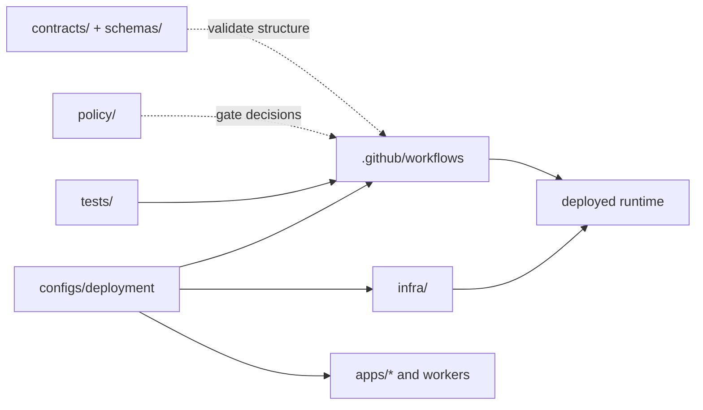

<!-- [KFM_META_BLOCK_V2]
doc_id: kfm://doc/<NEEDS-UUID>
title: Deployment Configuration
type: standard
version: v1
status: draft
owners: <NEEDS OWNER VERIFICATION>
created: YYYY-MM-DD
updated: YYYY-MM-DD
policy_label: <NEEDS POLICY LABEL VERIFICATION>
related: [../../README.md, ../../infra/, ../../policy/README.md, ../../contracts/README.md, ../../schemas/README.md, ../../.github/workflows/README.md]
tags: [kfm, deployment, configs, review-needed]
notes: [Target path provided by user; exact mounted contents of configs/deployment/ remain NEEDS VERIFICATION]
[/KFM_META_BLOCK_V2] -->

# Deployment Configuration

Deployment-facing configuration guidance for KFM rollout parameters, environment bindings, and verification hooks.

> [!IMPORTANT]
> This README is intentionally source-bounded. Root-level `configs/` is repo-grounded, but the exact mounted contents of `configs/deployment/` were not directly verified in the current workspace. Treat the starter structure and examples below as **PROPOSED** until they are mapped to the live repo.

**Status:** experimental  
**Owners:** `<NEEDS OWNER VERIFICATION>`  
**Path:** `configs/deployment/README.md`  
**Repo fit:** configuration-facing companion to [`../../infra/`](../../infra/), not a replacement for it


**Quick jump:** [Scope](#scope) · [Repo fit](#repo-fit) · [Accepted inputs](#accepted-inputs) · [Exclusions](#exclusions) · [Directory tree](#directory-tree) · [Quickstart](#quickstart) · [Usage](#usage) · [Diagram](#diagram) · [Reference tables](#reference-tables) · [Task list](#task-list) · [FAQ](#faq) · [Appendix](#appendix)

---

## Scope

This directory is the review surface for **deployment-facing configuration**: the settings, profiles, bindings, and rollout notes that shape how KFM is wired into an environment without turning configuration files into the hidden home of policy law, contract law, or business logic.

In KFM terms, this lane should help contributors answer four practical questions:

1. What is being configured?
2. Which runtime or surface consumes it?
3. Which verification or rollback step proves the change is safe?
4. Which neighboring lane owns the real authority for that change?

### Truth posture used in this README

| Label | Meaning here |
|---|---|
| **CONFIRMED** | Backed by current-session project evidence or attached KFM doctrine |
| **INFERRED** | Strongly implied by confirmed repo structure plus the target path requested here |
| **PROPOSED** | Recommended starter pattern, not verified as mounted implementation |
| **UNKNOWN** | Not directly proven in the current session |
| **NEEDS VERIFICATION** | Review item that should be retired by direct repo inspection |

[Back to top](#deployment-configuration)

---

## Repo fit

### Path and neighboring lanes

| Item | Status | Role |
|---|---|---|
| `configs/` | **CONFIRMED** | Root-level configuration lane |
| `configs/deployment/` | **INFERRED** | Target sub-area for deployment-facing configuration |
| [`../../infra/`](../../infra/) | **CONFIRMED** | Deployment and operations lane for infrastructure, overlays, and dashboards |
| [`../../policy/README.md`](../../policy/README.md) | **CONFIRMED** | Policy posture, deny-by-default logic, reason/obligation semantics |
| [`../../contracts/README.md`](../../contracts/README.md) | **CONFIRMED** | Contract surface documentation |
| [`../../schemas/README.md`](../../schemas/README.md) | **CONFIRMED** | Schema surface documentation; exact authority split with `contracts/` still needs verification |
| [`../../.github/workflows/README.md`](../../.github/workflows/README.md) | **CONFIRMED** | Workflow lane documentation; actual live merge-blocking YAMLs require verification |
| [`../../tests/README.md`](../../tests/README.md) | **CONFIRMED** | Test taxonomy and fixture expectations |

### Working interpretation

This README treats `configs/deployment/` as the place for **parameterization and binding**, while `infra/` remains the place for **deployment systems and operations mechanics**.

That split matters:

- deployment config should explain **what varies by environment**
- infrastructure lanes should define **how the environment is actually provisioned and operated**
- policy and contract lanes should remain **top-level authority surfaces**
- business law should not be smuggled into manifests or ad hoc scripts

> [!NOTE]
> KFM doctrine strongly favors visible seams: configs parameterize, contracts define, policy decides, infra deploys, tests verify, and docs explain.

[Back to top](#deployment-configuration)

---

## Accepted inputs

The following belong here when they are deployment-facing, non-secret, and tied to an identifiable runtime surface.

| Input type | Status | What belongs here |
|---|---|---|
| Environment-specific non-secret settings | **INFERRED** | Public-safe values, toggles, URLs, ports, feature flags, rollout modes |
| Example env templates | **PROPOSED** | `*.env.example`, example YAML/JSON overlays, documented placeholders |
| Deployment profile metadata | **PROPOSED** | Profile names, intended audience, consumer service, environment class |
| Smoke-check and rollback references | **PROPOSED** | Links to runbooks, health checks, post-deploy verification notes |
| Workflow cross-references | **INFERRED** | References to actual workflow files once verified |
| Service/config ownership notes | **PROPOSED** | Which app, worker, API, or console consumes a given setting |
| Secret *references* only | **INFERRED** | Secret names, vault paths, manager refs, never raw secret values |

### A good fit for this directory usually has all of these properties

- it changes **deployment behavior**, not domain meaning
- it is **safe to review in Git**
- it points to a **named consumer**
- it can be tied to **verification**
- it does **not** redefine policy or contract rules on its own

[Back to top](#deployment-configuration)

---

## Exclusions

The following do **not** belong here.

| Excluded item | Where it goes instead | Why |
|---|---|---|
| Raw secrets, credentials, tokens, private keys | external secret store / deployment platform | Git-tracked deployment docs must stay reviewable and non-sensitive |
| Kubernetes, Terraform, GitOps, Compose, or host manifests | [`../../infra/`](../../infra/) | Infra owns deployment mechanics |
| Rego bundles, rights logic, review rules, deny grammars | [`../../policy/README.md`](../../policy/README.md) | Policy law must stay explicit and testable |
| OpenAPI specs and JSON Schema definitions | [`../../contracts/README.md`](../../contracts/README.md) and/or [`../../schemas/README.md`](../../schemas/README.md) | Shared contracts should not be duplicated inside deployment config |
| Runtime business logic | `../../apps/` or `../../packages/` | Behavior belongs in code, not deployment notes |
| Generated receipts, proof objects, or release artifacts | governed release / evidence / data lanes | Deployment config should reference proof, not impersonate it |
| Catalog truth (DCAT/STAC/PROV) | catalog/evidence lanes | Deployment does not define publication truth |
| Unreviewed “temporary bypass” switches | nowhere by default | KFM prefers explicit exception flow over silent bypasses |

> [!CAUTION]
> If a file here starts to encode policy outcomes, contract semantics, or domain rules, it has drifted into the wrong lane.

[Back to top](#deployment-configuration)

---

## Directory tree

The exact mounted contents of this path are **UNKNOWN**. The tree below is a **PROPOSED starter shape** for review only.

```text
configs/
└── deployment/
    ├── README.md
    ├── profiles/            # PROPOSED — named deployment profiles
    ├── env/                 # PROPOSED — non-secret environment templates
    ├── checks/              # PROPOSED — smoke / health / rollback references
    └── overrides/           # PROPOSED — environment-specific overrides
```

### Interpretation rule

- `README.md` is the directory contract
- `profiles/` describes *what kind of deployment shape exists*
- `env/` documents *which variables and defaults are expected*
- `checks/` anchors *how a config change is verified*
- `overrides/` contains *explicit variation*, not hidden policy

[Back to top](#deployment-configuration)

---

## Quickstart

Use this sequence when adding or changing deployment-facing configuration.

1. **Classify the change**
   - Is it deployment parameterization, infra wiring, policy, contract, or code?
   - If it is not deployment-facing, route it elsewhere before editing this lane.

2. **Name the consumer**
   - Record the app, worker, API, console, or service that reads the config.

3. **Keep the file non-secret**
   - Store secret references only.
   - Never commit live credentials.

4. **Link the neighboring authority**
   - Add references to the relevant workflow, infra overlay, runbook, policy doc, or contract doc.

5. **Define verification**
   - State the health check, smoke check, audit event, or rollback path that proves the change is safe.

6. **Check for hidden law**
   - If the config is deciding who may publish, who may read, or what counts as valid data, move that logic out to policy or contracts.

### Minimal review checklist

- consumer named
- secret handling documented
- verification path linked
- rollback path linked
- no policy drift
- no contract duplication
- no hidden business logic

[Back to top](#deployment-configuration)

---

## Usage

### Authoring rules

1. Prefer **small, explicit files** over giant mixed-environment bundles.
2. Give every config a clear **owner** and **consumer surface**.
3. Keep differences between environments **visible**, not implied.
4. Prefer **references to authoritative lanes** over duplicated prose.
5. Do not describe automation as active unless the referenced workflow or deployment surface is actually present and verified.

### Naming guidance

| Pattern | Status | Intent |
|---|---|---|
| `<surface>.<env>.yaml` | **PROPOSED** | compact deployment profile naming |
| `<service>.env.example` | **PROPOSED** | non-secret environment template |
| `<change>.checklist.md` | **PROPOSED** | rollout or rollback companion note |
| `<surface>.overrides.yaml` | **PROPOSED** | explicit environment overrides |

### Deployment-facing config should answer these questions fast

| Question | Expected answer |
|---|---|
| Who reads this? | named service or surface |
| What does it affect? | runtime binding, rollout, health, observability, or environment behavior |
| Is it secret? | no, or only secret reference |
| What validates it? | workflow, smoke check, runbook, or manual review |
| What rolls it back? | named rollback path |
| What does it *not* decide? | policy law, contract law, publication truth |

[Back to top](#deployment-configuration)

---

## Diagram



### Read the diagram this way

- `configs/deployment/` should feed **consumer runtimes**, **workflow references**, and **infra references**
- `policy/` and `contracts/ + schemas/` remain external authority surfaces
- `tests/` and workflows verify the change
- deployment config helps wire the runtime, but it does **not** become publication truth by itself

[Back to top](#deployment-configuration)

---

## Reference tables

### Change-routing matrix

| If you are changing… | Put it in… | Why |
|---|---|---|
| non-secret deployment parameter | `configs/deployment/` | parameterization belongs with config |
| rollout workflow YAML | `../../.github/workflows/` | workflow lane owns CI/CD mechanics |
| Terraform / Helm / Kubernetes / Compose | `../../infra/` | infra owns deployment and operations |
| Rego rule or reason vocabulary | `../../policy/` | executable policy must stay explicit |
| API envelope or JSON schema | `../../contracts/` or `../../schemas/` | shared contract law should stay canonical |
| service logic | `../../apps/` or `../../packages/` | code belongs with runtime or reusable modules |
| proof object / receipt / release artifact | governed evidence or release lane | generated trust objects are not static config |

### Proposed environment classes

| Environment class | Status | Main companion lane | Notes |
|---|---|---|---|
| `local` | **PROPOSED** | `../../infra/` | developer-safe local wiring |
| `systemd-or-compose` | **PROPOSED** | `../../infra/` | single-host operations shape |
| `hosted` | **PROPOSED** | `../../infra/` | managed or clustered deployment |
| `dashboards` | **PROPOSED** | `../../infra/` | observability surfaces complement, not replace, rollout checks |

### Minimum metadata every deployment config entry should expose

| Field | Status | Why it matters |
|---|---|---|
| `profile_id` | **PROPOSED** | stable human-readable identity |
| `owner` | **PROPOSED** | reviewer routing and change accountability |
| `service_ref` | **PROPOSED** | ties config to a consumer |
| `workflow_ref` | **PROPOSED** | proves whether automation exists |
| `infra_ref` | **PROPOSED** | links to actual deploy surface |
| `secrets_strategy` | **PROPOSED** | keeps secret handling explicit |
| `smoke_checks` | **PROPOSED** | defines safe post-change verification |
| `rollback_ref` | **PROPOSED** | makes reversal visible and reviewable |
| `notes` | **PROPOSED** | captures bounded operational context |

[Back to top](#deployment-configuration)

---

## Task list

### Review gates for this directory

- [ ] Path ownership is set and visible
- [ ] Every config file names a runtime consumer
- [ ] No live secrets are committed
- [ ] Workflow references point to real files or are labeled **NEEDS VERIFICATION**
- [ ] Infra references point to the actual deploy lane
- [ ] Rollback path is documented
- [ ] Smoke verification is documented
- [ ] Policy or contract law is not duplicated here
- [ ] Any material deployment change updates adjacent docs
- [ ] README stays aligned with actual mounted repo contents

### Definition of done

A deployment-config change is ready when:

1. the change belongs in this directory
2. the consumer is named
3. the verification path is explicit
4. the rollback path is explicit
5. no secrets or hidden policy are introduced
6. cross-links to `infra/`, policy, contracts, workflows, and tests are still correct
7. any `UNKNOWN` claim needed for safe use is kept visible

[Back to top](#deployment-configuration)

---

## FAQ

### Why not put manifests here?

Because KFM already distinguishes configuration from deployment-and-operations mechanics. Use this lane for deployment-facing configuration; use [`../../infra/`](../../infra/) for the actual deployment systems.

### Can this directory define policy behavior?

No. It can reference policy surfaces, but deny/allow logic, rights handling, review rules, and finite outcomes belong in [`../../policy/`](../../policy/).

### Can this directory become the source of truth for schemas?

No. API and object contracts belong in the contract/schema lanes, and the exact authoritative split between `contracts/` and `schemas/` still needs verification.

### Should workflow names be documented here?

Yes, but only if they resolve to actual files. Placeholder or aspirational workflow names should be labeled clearly.

### Are `.env` files allowed here?

Only **example** or **template** forms should be documented here. Live secret-bearing files should stay out of Git.

[Back to top](#deployment-configuration)

---

## Appendix

<details>
<summary><strong>Verification backlog for this README</strong></summary>

This README should be tightened after direct repo inspection retires the following items:

- whether `configs/deployment/` already exists in mounted repo state
- actual files and subdirectories under this path
- actual deployment workflow YAML names
- actual infra overlays or runtime targets
- actual secret-handling mechanism
- whether `contracts/` or `schemas/` is authoritative for deployment-related schemas
- actual owner names or team labels
- correct `doc_id`, `created`, `updated`, and `policy_label` values

</details>

<details>
<summary><strong>Illustrative starter template (PROPOSED only)</strong></summary>

```yaml
profile_id: <name>
owner: <team-or-person>
environment_class: <local|systemd-or-compose|hosted>
service_ref: ../../apps/<service-or-surface>
workflow_ref: ../../.github/workflows/<workflow>.yml
infra_ref: ../../infra/<area-or-overlay>
secrets_strategy: out-of-band
smoke_checks:
  - <named-check>
rollback_ref: ../../docs/runbooks/<rollback-doc>.md
notes: []
```

Use this as a review prompt, not as proof of live implementation.

</details>

<details>
<summary><strong>Short lane rule</strong></summary>

A file belongs in `configs/deployment/` only when it helps answer **how a governed runtime is parameterized for an environment** without quietly redefining **what is true, what is allowed, or what the system means**.

</details>

[Back to top](#deployment-configuration)
