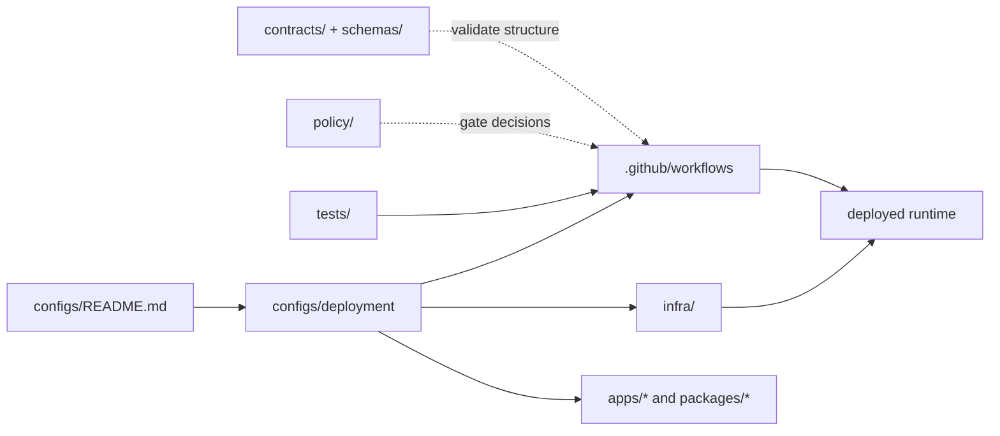

<!-- [KFM_META_BLOCK_V2]
doc_id: kfm://doc/<NEEDS-UUID>
title: Deployment Configuration
type: standard
version: v1
status: draft
owners: @bartytime4life
created: <NEEDS CREATION DATE VERIFICATION>
updated: 2026-03-22
policy_label: <NEEDS POLICY LABEL VERIFICATION>
related: [../README.md, ../../README.md, ../../infra/README.md, ../../policy/README.md, ../../contracts/README.md, ../../schemas/README.md, ../../tests/README.md, ../../.github/workflows/README.md]
tags: [kfm, deployment, configs, review-needed]
notes: [Owner comes from current public /configs/ CODEOWNERS fallback; public main confirms configs/deployment/ exists and currently contains README.md only; created date and policy label still need verification.]
[/KFM_META_BLOCK_V2] -->

# Deployment Configuration

Deployment-facing configuration guidance for KFM rollout parameters, environment bindings, and verification hooks.

> **Status:** experimental  
> **Owners:** `@bartytime4life` *(via current public `/configs/` CODEOWNERS coverage; no narrower `/configs/deployment/` rule was verified on public `main`)*  
> **Path:** `configs/deployment/README.md`  
> **Current public tree state:** `README.md` only on `main`  
> **Repo fit:** child lane of [`../README.md`](../README.md), configuration-facing companion to [`../../infra/`](../../infra/), not a replacement for it


**Quick jump:** [Scope](#scope) · [Repo fit](#repo-fit) · [Accepted inputs](#accepted-inputs) · [Exclusions](#exclusions) · [Directory tree](#directory-tree) · [Quickstart](#quickstart) · [Usage](#usage) · [Diagram](#diagram) · [Reference tables](#reference-tables) · [Task list](#task-list) · [FAQ](#faq) · [Appendix](#appendix)

> [!IMPORTANT]
> Current public `main` confirms that `configs/deployment/` exists and currently contains `README.md` only. Anything deeper than that — live value files, profile overlays, checked-in rollout helpers, or branch-local additions — remains **NEEDS VERIFICATION** until the working checkout is inspected directly.

---

## Scope

This directory is the review surface for **deployment-facing configuration**: the settings, profiles, bindings, and rollout notes that shape how KFM is wired into an environment without turning configuration files into the hidden home of policy law, contract law, or business logic.

In KFM terms, this lane should help contributors answer four practical questions:

1. What is being configured?
2. Which runtime or surface consumes it?
3. Which verification or rollback step proves the change is safe?
4. Which neighboring lane owns the real authority for that change?

### Truth posture used in this README

| Label | Meaning here |
|---|---|
| **CONFIRMED** | Backed by current public `main`, current public file history, or attached KFM doctrine |
| **INFERRED** | Strongly implied by confirmed repo structure plus lane boundaries, but not directly proven as active mounted implementation |
| **PROPOSED** | Recommended starter pattern, not verified as checked-in deployment implementation |
| **UNKNOWN** | Not directly proven in the current session |
| **NEEDS VERIFICATION** | Review item that should be retired by direct working-checkout inspection |

[Back to top](#deployment-configuration)

---

## Repo fit

### Path and neighboring lanes

| Item | Status | Role |
|---|---|---|
| [`../README.md`](../README.md) | **CONFIRMED** | Parent `configs/` contract for repo-visible, non-secret configuration |
| `configs/deployment/` | **CONFIRMED** | Deployment-facing child lane present on current public `main` |
| current public inventory | **CONFIRMED** | `README.md` only |
| [`../../infra/`](../../infra/) | **CONFIRMED** | Deployment and operations lane for infrastructure, overlays, runtime bring-up, monitoring, restore, and rollback |
| [`../../policy/README.md`](../../policy/README.md) | **CONFIRMED** | Policy posture, deny-by-default logic, reason/obligation semantics, runtime negative outcomes |
| [`../../contracts/README.md`](../../contracts/README.md) | **CONFIRMED** | Contract surface documentation and machine-readable trust objects |
| [`../../schemas/README.md`](../../schemas/README.md) | **CONFIRMED** | Schema-lane boundary guide; exact single-authority split with `contracts/` still needs verification |
| [`../../tests/README.md`](../../tests/README.md) | **CONFIRMED** | Governed verification, fixtures, negative paths, and proof expectations |
| [`../../.github/workflows/README.md`](../../.github/workflows/README.md) | **CONFIRMED** | Workflow-lane documentation; current public `main` still shows README only inside `.github/workflows/` |

### Working interpretation

This README treats `configs/deployment/` as the place for **parameterization and binding**, while `infra/` remains the place for **deployment systems and operations mechanics**.

That split matters:

- deployment config should explain **what varies by environment**
- infrastructure lanes should define **how the environment is provisioned, exposed, restored, and observed**
- policy and contract lanes should remain **top-level authority surfaces**
- business law should not be smuggled into manifests or ad hoc scripts

> [!NOTE]
> KFM works best when the seams stay visible: configs parameterize, contracts define, policy decides, infra deploys, tests verify, and docs explain.

[Back to top](#deployment-configuration)

---

## Accepted inputs

The following belong here when they are deployment-facing, non-secret, and tied to an identifiable runtime surface.

| Input type | Status | What belongs here |
|---|---|---|
| Environment-specific non-secret settings | **INFERRED** | Public-safe values, toggles, URLs, ports, feature flags, rollout modes |
| Example env templates | **PROPOSED** | `*.env.example`, example YAML / JSON overlays, documented placeholders |
| Deployment profile metadata | **PROPOSED** | Profile names, intended audience, consumer service, environment class |
| Smoke-check and rollback references | **PROPOSED** | Links to runbooks, health checks, post-deploy verification notes |
| Workflow cross-references | **CONFIRMED / NEEDS VERIFICATION** | References to `../../.github/workflows/README.md` now, and to real workflow YAML files once they are checked in or verified |
| Service/config ownership notes | **PROPOSED** | Which app, worker, API, or console consumes a given setting |
| Secret *references* only | **INFERRED** | Secret names, vault paths, manager refs, never raw secret values |
| Companion lane links | **CONFIRMED / PROPOSED** | Links to actual `infra/` sublanes or runbooks that reconcile approved intent into runtime |

### A good fit for this directory usually has all of these properties

- it changes **deployment behavior**, not domain meaning
- it is **safe to review in Git**
- it points to a **named consumer**
- it can be tied to **verification**
- it does **not** redefine policy or contract rules on its own

[Back to top](#deployment-configuration)

---

## Exclusions

The following do **not** belong here.

| Excluded item | Where it goes instead | Why |
|---|---|---|
| Raw secrets, credentials, tokens, private keys | external secret store / deployment platform | Git-tracked deployment docs must stay reviewable and non-sensitive |
| Kubernetes, Terraform, GitOps, Compose, systemd units, or host manifests | [`../../infra/`](../../infra/) | Infra owns deployment mechanics |
| Rego bundles, rights logic, review rules, deny grammars | [`../../policy/README.md`](../../policy/README.md) | Policy law must stay explicit and testable |
| OpenAPI specs and JSON Schema definitions | [`../../contracts/README.md`](../../contracts/README.md) and/or [`../../schemas/README.md`](../../schemas/README.md) | Shared contracts should not be duplicated inside deployment config |
| Runtime business logic | `../../apps/` or `../../packages/` | Behavior belongs in code, not deployment notes |
| Generated receipts, proof objects, release manifests, SBOMs, or attestations | governed release / evidence / data lanes | Deployment config should reference proof, not impersonate it |
| Catalog truth (DCAT / STAC / PROV) | catalog / evidence lanes | Deployment does not define publication truth |
| Unreviewed “temporary bypass” switches | nowhere by default | KFM prefers explicit exception flow over silent bypasses |

> [!CAUTION]
> If a file here starts to encode policy outcomes, contract semantics, or domain rules, it has drifted into the wrong lane.

[Back to top](#deployment-configuration)

---

## Directory tree

### Current verified snapshot *(public `main`)*

```text
configs/
└── deployment/
    └── README.md
```

### Documented growth shape *(PROPOSED)*

```text
configs/
└── deployment/
    ├── README.md
    ├── profiles/            # named deployment profiles
    ├── env/                 # non-secret environment templates
    ├── checks/              # smoke / health / rollback references
    └── overrides/           # environment-specific overrides
```

### Interpretation rule

- `README.md` is the directory contract
- current public `main` proves the lane exists, but not that the proposed substructure is checked in
- `profiles/` should describe *what kind of deployment shape exists*
- `env/` should document *which variables and defaults are expected*
- `checks/` should anchor *how a config change is verified*
- `overrides/` should hold *explicit variation*, not hidden policy

> [!NOTE]
> If your working branch adds the first real child files under `configs/deployment/`, update this tree and the parent [`../README.md`](../README.md) in the same change stream.

[Back to top](#deployment-configuration)

---

## Quickstart

Use this sequence when adding or changing deployment-facing configuration.

```bash
# 1) inspect the current lane in the working checkout
ls -la configs/deployment
find configs/deployment -maxdepth 2 -type f | sort

# 2) reread the parent and companion lane contracts
sed -n '1,220p' configs/README.md
sed -n '1,240p' infra/README.md
sed -n '1,220p' policy/README.md
sed -n '1,220p' contracts/README.md
sed -n '1,220p' schemas/README.md
sed -n '1,220p' tests/README.md
ls -la .github/workflows

# 3) pressure-test whether the config has a named consumer and real references
grep -RIn "configs/deployment\|profile_id\|service_ref\|workflow_ref\|rollback_ref" \
  apps packages infra tests tools scripts 2>/dev/null || true

# 4) inspect path history before inventing filenames or responsibilities
git log --name-status -- configs/deployment
```

### Minimal review checklist

- consumer named
- secret handling documented
- verification path linked
- rollback path linked
- no policy drift
- no contract duplication
- no hidden business logic
- current verified snapshot updated if the lane stopped being README-only

[Back to top](#deployment-configuration)

---

## Usage

### Authoring rules

1. Prefer **small, explicit files** over giant mixed-environment bundles.
2. Give every config a clear **owner** and **consumer surface**.
3. Keep differences between environments **visible**, not implied.
4. Prefer **references to authoritative lanes** over duplicated prose.
5. Do not describe automation as active unless the referenced workflow or deployment surface is actually present and verified.
6. If the lane is still scaffold-first on the working branch, keep examples clearly marked **PROPOSED**.

### Naming guidance

| Pattern | Status | Intent |
|---|---|---|
| `<surface>.<env>.yaml` | **PROPOSED** | compact deployment profile naming |
| `<service>.env.example` | **PROPOSED** | non-secret environment template |
| `<change>.checklist.md` | **PROPOSED** | rollout or rollback companion note |
| `<surface>.overrides.yaml` | **PROPOSED** | explicit environment overrides |

### Deployment-facing config should answer these questions fast

| Question | Expected answer |
|---|---|
| Who reads this? | named service or surface |
| What does it affect? | runtime binding, rollout, health, observability, or environment behavior |
| Is it secret? | no, or only secret reference |
| What validates it? | workflow, smoke check, runbook, or manual review |
| What rolls it back? | named rollback path |
| What does it *not* decide? | policy law, contract law, publication truth |

[Back to top](#deployment-configuration)

---

## Diagram



### Read the diagram this way

- `configs/deployment/` should feed **consumer runtimes**, **workflow references**, and **infra references**
- `policy/` and `contracts/ + schemas/` remain external authority surfaces
- `tests/` and workflows verify the change
- deployment config helps wire the runtime, but it does **not** become publication truth by itself

[Back to top](#deployment-configuration)

---

## Reference tables

### Change-routing matrix

| If you are changing… | Put it in… | Why |
|---|---|---|
| non-secret deployment parameter | `configs/deployment/` | parameterization belongs with config |
| rollout workflow YAML | `../../.github/workflows/` | workflow lane owns CI/CD mechanics |
| Terraform / Helm / Kubernetes / Compose / systemd units | `../../infra/` | infra owns deployment and operations |
| Rego rule or reason vocabulary | `../../policy/` | executable policy must stay explicit |
| API envelope or JSON schema | `../../contracts/` or `../../schemas/` | shared contract law should stay canonical |
| service logic | `../../apps/` or `../../packages/` | code belongs with runtime or reusable modules |
| proof object / receipt / release artifact | governed evidence or release lane | generated trust objects are not static config |

### Companion runtime lanes already visible on public `main`

| Runtime or operational companion | Path status | Use alongside deployment config |
|---|---|---|
| `../../infra/local/` | **CONFIRMED** | developer-safe local wiring |
| `../../infra/systemd/` | **CONFIRMED** | native host service units and overrides |
| `../../infra/systemd-or-compose/` | **CONFIRMED** | phase-one mixed orchestration lane |
| `../../infra/compose/` | **CONFIRMED** | compose descriptors for service bundles |
| `../../infra/hosted/` | **CONFIRMED** | remote or split-edge overlays |
| `../../infra/kubernetes/` | **CONFIRMED** | cluster-facing deployment overlays |
| `../../infra/gitops/` | **CONFIRMED** | declarative reconciliation lane |
| `../../infra/terraform/` | **CONFIRMED** | provisioning and environment descriptors |
| `../../infra/monitoring/` and `../../infra/dashboards/` | **CONFIRMED** | operational verification companions |
| `../../infra/backup/` | **CONFIRMED** | restore, rollback, and recovery companions |

### Minimum metadata every deployment config entry should expose

| Field | Status | Why it matters |
|---|---|---|
| `profile_id` | **PROPOSED** | stable human-readable identity |
| `owner` | **PROPOSED** | reviewer routing and change accountability |
| `service_ref` | **PROPOSED** | ties config to a consumer |
| `workflow_ref` | **PROPOSED** | proves whether automation exists |
| `infra_ref` | **PROPOSED** | links to the actual deploy surface |
| `secrets_strategy` | **PROPOSED** | keeps secret handling explicit |
| `smoke_checks` | **PROPOSED** | defines safe post-change verification |
| `rollback_ref` | **PROPOSED** | makes reversal visible and reviewable |
| `notes` | **PROPOSED** | captures bounded operational context |

[Back to top](#deployment-configuration)

---

## Task list

### Review gates for this directory

- [ ] Path ownership is set and visible
- [ ] Current public-tree snapshot is still accurate, or intentionally updated in the same PR
- [ ] Every config file names a runtime consumer
- [ ] No live secrets are committed
- [ ] Workflow references point to real files or are labeled **NEEDS VERIFICATION**
- [ ] Infra references point to the actual deploy lane
- [ ] Rollback path is documented
- [ ] Smoke verification is documented
- [ ] Policy or contract law is not duplicated here
- [ ] Any material deployment change updates adjacent docs
- [ ] README stays aligned with the working checkout, not just historical assumptions

### Definition of done

A deployment-config change is ready when:

1. the change belongs in this directory
2. the consumer is named
3. the verification path is explicit
4. the rollback path is explicit
5. no secrets or hidden policy are introduced
6. cross-links to `infra/`, policy, contracts, workflows, and tests are still correct
7. scaffold-first statements are retired only after the working checkout proves them obsolete

[Back to top](#deployment-configuration)

---

## FAQ

### Why not put manifests here?

Because KFM distinguishes configuration from deployment-and-operations mechanics. Use this lane for deployment-facing configuration; use [`../../infra/`](../../infra/) for the actual deployment systems.

### Why does this README say the lane is `README.md`-only?

Because that is what current public `main` shows today. If your working branch contains real deployment config files, update the snapshot and retire the scaffold-only language in the same PR.

### Can this directory define policy behavior?

No. It can reference policy surfaces, but deny/allow logic, rights handling, review rules, and finite outcomes belong in [`../../policy/`](../../policy/).

### Can this directory become the source of truth for schemas?

No. API and object contracts belong in the contract/schema lanes, and the exact authoritative split between `contracts/` and `schemas/` still needs verification.

### Should workflow names be documented here?

Yes, but only if they resolve to actual files. Placeholder or aspirational workflow names should be labeled clearly.

### Are `.env` files allowed here?

Only **example** or **template** forms should be documented here. Live secret-bearing files should stay out of Git.

[Back to top](#deployment-configuration)

---

## Appendix

<details>
<summary><strong>Verification backlog</strong></summary>

This README should be tightened after working-checkout inspection retires the following items:

- exact parity between public `main` and the working branch
- actual files and subdirectories under `configs/deployment/`
- actual runtime consumers and loader paths
- actual deployment workflow YAML names, if any
- actual infra overlays or runtime targets referenced from this lane
- actual secret-handling mechanism
- whether `contracts/` or `schemas/` is authoritative for deployment-related schemas
- correct `doc_id`, `created`, and `policy_label` values

</details>

<details>
<summary><strong>Illustrative starter template (PROPOSED only)</strong></summary>

```yaml
profile_id: <name>
owner: <team-or-person>
environment_class: <local|systemd|systemd-or-compose|hosted|kubernetes>
service_ref: ../../apps/<service-or-surface>
workflow_ref: ../../.github/workflows/<workflow>.yml
infra_ref: ../../infra/<area-or-overlay>
secrets_strategy: out-of-band
smoke_checks:
  - <named-check>
rollback_ref: ../../docs/runbooks/<rollback-doc>.md
notes: []
```

Use this as a review prompt, not as proof of live implementation.

</details>

<details>
<summary><strong>Short lane rule</strong></summary>

A file belongs in `configs/deployment/` only when it helps answer **how a governed runtime is parameterized for an environment** without quietly redefining **what is true, what is allowed, or what the system means**.

</details>

[Back to top](#deployment-configuration)
