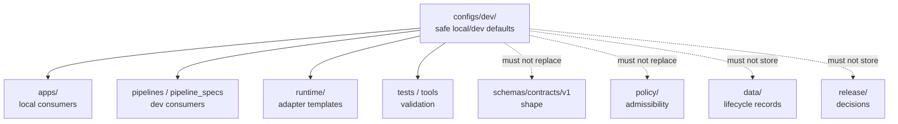

<!-- [KFM_META_BLOCK_V2]
doc_id: kfm://doc/configs-dev-readme
title: configs/dev/ — Development Configuration Defaults and Templates
type: readme
version: v0.1
status: draft
owners: OWNER_TBD — Ops steward · Security steward · Config steward · Developer-experience steward · Docs steward
created: 2026-06-16
updated: 2026-06-16
policy_label: public
related:
  - ../README.md
  - ../../docs/doctrine/directory-rules.md
  - ../../apps/README.md
  - ../../pipelines/README.md
  - ../../pipeline_specs/README.md
  - ../../runtime/README.md
  - ../../infra/README.md
  - ../../tests/README.md
  - ../../tools/README.md
  - ../../schemas/contracts/v1/
  - ../../policy/README.md
tags: [kfm, configs, dev, development, local, defaults, templates, non-secret, validation, governance]
notes:
  - "configs/dev/ is for safe development-only configuration defaults and templates."
  - "Deployment-only confidential values, personal workstation details, live service bindings, and operational state must not be committed here."
  - "This README does not prove any dev config is complete, consumed, validated, or CI-enforced."
  - "Specific current inventory, consumers, validation coverage, and owner assignments remain NEEDS VERIFICATION."
[/KFM_META_BLOCK_V2] -->

<a id="top"></a>

<div align="center">

# Development Configs

`configs/dev/`

**Development-only configuration defaults and templates. This folder may contain safe local/dev examples, but it must not become a home for deployment-only confidential values, live environment bindings, policy, schemas, source data, release records, or lifecycle data.**


[Purpose](#1-purpose) · [Canonical fit](#2-canonical-fit) · [Allowed contents](#5-allowed-contents) · [Forbidden contents](#6-forbidden-contents) · [Validation](#9-validation-expectations) · [Definition of done](#12-definition-of-done)

</div>

---

> [!IMPORTANT]
> **Status:** draft / `NEEDS VERIFICATION`  
> **Path:** `configs/dev/README.md`  
> **Owning root:** `configs/`  
> **Responsibility:** safe development defaults and templates  
> **Truth posture:** CONFIRMED README path / CONFIRMED parent `configs/` is canonical for safe defaults and templates / PROPOSED `configs/dev/` sublane contract / UNKNOWN current dev config inventory, consumers, validation coverage, CI enforcement, and owner assignments

> [!CAUTION]
> Development config must be safe to commit. Keep deployment-only confidential values, workstation-specific paths, live service bindings, and operational state out of this folder. Use placeholders, documented local overrides, ignored local files, or deployment systems instead.

---

## 1. Purpose

`configs/dev/` is the development sublane under the canonical `configs/` root.

It exists to collect safe local-development defaults and templates that help contributors run, test, and inspect KFM without copying deployment-only values or authoritative records into the repository.

This README does not prove that any dev config file is currently used by an app, pipeline, runtime adapter, test, or CI workflow. Those claims remain `NEEDS VERIFICATION` until checked against current code, workflows, and test evidence.

[Back to top](#top)

---

## 2. Canonical fit

`configs/dev/` belongs under:

```text
configs/
```

It may support local development for:

```text
apps/              # deployable apps that read safe dev config
pipelines/         # executable pipeline logic that may use dev defaults
pipeline_specs/    # declarative pipeline definitions, if dev templates reference them
runtime/           # local adapters, via templates only
infra/             # deployment controls, not stored here
```

`configs/dev/` is not a replacement for any of those roots.

## 3. Authority boundary

```text
configs/dev/
├── safe local defaults
├── example development templates
├── placeholder-based sample config
└── validation notes for local runs

NOT HERE:
  production values
  live service binding
  personal workstation state
  policy rules
  schemas/contracts
  lifecycle data
  release decisions
  receipts/proofs
  source code
  generated artifacts
```

## 4. Default posture

Treat every file in `configs/dev/` as a development aid until verified.

A development config may help a contributor run KFM locally, but it does not prove runtime behavior, deployment behavior, release readiness, or policy compliance. It must be validated against the relevant app, pipeline, runtime adapter, schema, contract, and test path before being cited as working behavior.

## 5. Allowed contents

| Allowed item | Example | Required posture |
|---|---|---|
| Local defaults | safe `dev.yaml`, `dev.toml`, `dev.json` | Must be safe to commit |
| Template files | `.example`, `.template` | Must use placeholders for deployment-specific values |
| Local run notes | comments explaining fields | Must identify consumer and validation path |
| Test/dev examples | small safe config samples | Must not include live source/system bindings |
| Compatibility notes | migration notes for renamed config | Must be temporary and review-linked |

## 6. Forbidden contents

| Forbidden here | Correct home |
|---|---|
| Deployment-only confidential values or live service binding | external deployment store / ignored local files / `infra/` controls |
| Personal workstation state, local absolute paths, or machine-specific material | ignored local override files |
| Policy rules and policy decisions | `policy/` |
| Machine schema authority | `schemas/contracts/v1/` |
| Object meaning and human contracts | `contracts/` |
| Application source code | `apps/` |
| Runtime adapters, model adapters, harnesses | `runtime/` |
| Deployment, host, network, exposure, access-control definitions | `infra/` |
| Pipeline implementation logic | `pipelines/` |
| Durable pipeline definitions | `pipeline_specs/` unless the file is explicitly a safe dev template |
| Source data, lifecycle data, receipts, proofs, registry records, published artifacts | `data/` |
| Release decisions, release manifests, rollback/correction records | `release/` |
| Generated build/QA artifacts | `artifacts/` |

## 7. Suggested directory shape

Current inventory remains `NEEDS VERIFICATION`.

```text
configs/dev/
├── README.md
├── apps/                    # PROPOSED app-specific dev config examples
├── pipelines/               # PROPOSED pipeline dev defaults
├── runtime/                 # PROPOSED runtime-adapter templates only
├── local.template.yaml      # PROPOSED placeholder example
└── validation.md            # PROPOSED local validation notes
```

> [!WARNING]
> Do not treat this suggested shape as repo fact. Verify actual files before making inventory or migration claims.

## 8. Diagram



## 9. Validation expectations

Useful validation for `configs/dev/` should confirm:

- every committed file is safe to share in the repo;
- templates use placeholders for deployment-specific values;
- each config identifies its intended consumer;
- config fields align with the relevant schema, contract, app, pipeline, runtime adapter, and tests;
- no lifecycle data, release records, receipts, proofs, catalog records, source data, or generated artifacts are stored here;
- stale local examples are removed or marked `NEEDS VERIFICATION`.

## 10. Migration posture

If misplaced material is found under `configs/dev/`:

1. Do not treat it as authoritative until reviewed.
2. Identify whether it belongs under `policy/`, `schemas/`, `contracts/`, `apps/`, `runtime/`, `infra/`, `pipelines/`, `pipeline_specs/`, `data/`, `release/`, or `artifacts/`.
3. Move it through a small, reviewable migration.
4. Preserve necessary owner notes and rollback instructions.
5. Add a drift note if the misplaced config was already consumed.

## 11. Safe change pattern

For changes under `configs/dev/`:

1. Confirm the file is a safe development default, template, or config-facing documentation.
2. Confirm deployment-only confidential values and machine-specific material are not committed.
3. Confirm the config does not duplicate schema, policy, contract, release, or lifecycle authority.
4. Confirm consumers and validators are updated or explicitly marked `NEEDS VERIFICATION`.
5. Document any compatibility impact on apps, pipelines, runtime adapters, or infra.
6. Update tests or explain why the change is documentation-only.

## 12. Definition of done

- [ ] Owners are confirmed and `OWNER_TBD` is replaced.
- [ ] Actual `configs/dev/` contents are inventoried.
- [ ] Every committed dev config is safe for the repo.
- [ ] No deployment-only confidential values, machine-specific state, lifecycle data, release records, receipts, proofs, catalog records, source data, or generated artifacts live here.
- [ ] Config templates identify the owning consumer and validation path.
- [ ] Consumers, tests, and tools are verified or marked `NEEDS VERIFICATION`.
- [ ] Stale or unowned dev examples are migrated, deleted, or documented as drift.

## 13. Open verification items

| Item | Why it matters |
|---|---|
| Inventory current `configs/dev/` files | Required before claims about coverage or ownership |
| Confirm app/pipeline/runtime consumers | Required before behavior claims |
| Confirm validation tooling and CI checks | Required before enforcement claims |
| Confirm no deployment-only confidential values are present | Required before safe-sharing claims |
| Confirm config/schema alignment | Required before machine-shape claims |
| Confirm config/policy separation | Required before governance claims |
| Confirm owner assignments | Required before maintenance claims |

<details>
<summary>Appendix A — no-loss preservation note</summary>

The previous README was a Greenfield stub. This version establishes the development-config sublane contract without claiming any specific dev config inventory, consumer behavior, deployment behavior, or CI enforcement is implemented.

</details>

## Status summary

`configs/dev/` is a development sublane under the canonical `configs/` root. It is for safe local-development defaults and templates only. It is not a home for deployment-only confidential values, lifecycle records, release decisions, schemas, contracts, policy rules, source code, runtime adapters, infra definitions, receipts, proofs, or generated artifacts.

<p align="right"><a href="#top">Back to top</a></p>
