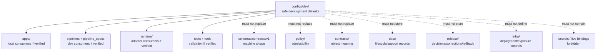

<!-- [KFM_META_BLOCK_V2]
doc_id: kfm://doc/configs-dev-readme
title: configs/dev/ — Development Configuration Defaults and Templates
type: readme
version: v0.2
status: draft
owners: OWNER_TBD — Ops steward · Security steward · Config steward · Developer-experience steward · App steward · Pipeline steward · Runtime steward · Test steward · Docs steward
created: 2026-06-16
updated: 2026-07-10
policy_label: public
related:
  - ../README.md
  - ../../docs/doctrine/directory-rules.md
  - ../../apps/README.md
  - ../../pipelines/README.md
  - ../../pipeline_specs/README.md
  - ../../runtime/README.md
  - ../../infra/README.md
  - ../../tests/README.md
  - ../../tools/README.md
  - ../../schemas/contracts/v1/
  - ../../policy/README.md
  - ../../contracts/
  - ../../data/README.md
  - ../../release/README.md
tags: [kfm, configs, dev, development, local, defaults, templates, non-secret, placeholders, safe-to-commit, validation, governance, no-secrets, no-deployment-authority, no-policy-authority, no-schema-authority]
notes:
  - "Refreshes configs/dev/ as the development-only configuration sublane under the canonical configs/ root."
  - "configs/dev/ is for safe-to-commit development defaults, templates, placeholders, and local validation notes only."
  - "This folder is not a secrets store, deployment authority, runtime adapter home, infrastructure authority, policy authority, schema authority, contract authority, lifecycle data root, release root, receipt/proof root, source registry, generated-artifact home, or public-client surface."
  - "Deployment-only confidential values, live service bindings, personal workstation state, private endpoints, tokens, keys, passwords, cookies, session material, private paths, and operational state must not be committed here."
  - "Dev config may describe local behavior, but it does not prove app behavior, pipeline behavior, runtime behavior, deployment readiness, policy compliance, release readiness, or CI enforcement unless verified from code/tests/workflows/logs."
  - "Directory Rules placement doctrine applies: file location encodes ownership, governance, and lifecycle. configs/dev/ remains a configuration documentation/defaults lane, not an authority shortcut."
  - "Actual current inventory, consumers, validation coverage, CI/review enforcement, secret-scanning maturity, schema alignment, owner assignments, and deployment integration remain NEEDS VERIFICATION."
  - "v0.2 adds current evidence basis, stronger no-secrets/no-live-binding boundary, consumer/validator posture, minimum safe slice, anti-bypass matrix, migration/rollback posture, and safe language rules without claiming enforcement maturity."
[/KFM_META_BLOCK_V2] -->

<a id="top"></a>

<div align="center">

# Development Configs

`configs/dev/`

**Development-only configuration defaults and templates. This folder may contain safe local/dev examples, but it must not become a home for secrets, deployment-only confidential values, live environment bindings, policy, schemas, source data, release records, lifecycle data, runtime adapters, or generated artifacts.**


[Evidence](#0-evidence-basis-for-this-revision) · [Purpose](#1-purpose) · [Canonical fit](#2-canonical-fit) · [Boundary](#3-authority-boundary) · [Allowed](#5-allowed-contents) · [Forbidden](#6-forbidden-contents) · [Validation](#14-validation-expectations) · [Definition of done](#17-definition-of-done)

</div>

---

> [!IMPORTANT]
> **Status:** draft / `NEEDS VERIFICATION`  
> **Path:** `configs/dev/README.md`  
> **Owning root:** `configs/`  
> **Responsibility:** safe development defaults, examples, and templates only  
> **Parent root posture:** `configs/` is the canonical root for safe non-secret configuration defaults and templates  
> **Directory Rules basis:** file location encodes ownership, governance, and lifecycle. `configs/dev/` is a development-configuration sublane and must not become a secrets store, deployment authority, runtime adapter home, infrastructure authority, policy authority, schema authority, contract authority, lifecycle data root, release root, receipt/proof root, source registry, generated-artifact home, or public-client surface.  
> **Truth posture:** CONFIRMED current GitHub README path / CONFIRMED parent `configs/README.md` exists and treats `configs/` as the canonical safe non-secret configuration root / CONFIRMED Directory Rules document exists and states that file location encodes ownership, governance, and lifecycle / PROPOSED `configs/dev/` v0.2 sublane contract / UNKNOWN actual file inventory, consumers, validation coverage, schema alignment, CI/review enforcement, secret scanning, deployment integration, owner assignments, and runtime behavior

> [!CAUTION]
> Development config must be safe to commit. Keep deployment-only confidential values, live service bindings, private endpoints, tokens, keys, passwords, cookies, session material, workstation-specific paths, operational state, and sensitive source material out of this folder. Use placeholders, ignored local override files, local environment variables, or deployment systems instead.

---

## Quick jump

- [0. Evidence basis for this revision](#0-evidence-basis-for-this-revision)
- [1. Purpose](#1-purpose)
- [2. Canonical fit](#2-canonical-fit)
- [3. Authority boundary](#3-authority-boundary)
- [4. Default posture](#4-default-posture)
- [5. Allowed contents](#5-allowed-contents)
- [6. Forbidden contents](#6-forbidden-contents)
- [7. Secret and live-binding rules](#7-secret-and-live-binding-rules)
- [8. Consumer and validator posture](#8-consumer-and-validator-posture)
- [9. Suggested directory shape](#9-suggested-directory-shape)
- [10. Minimum safe dev-config slice](#10-minimum-safe-dev-config-slice)
- [11. Runtime and producer anti-bypass matrix](#11-runtime-and-producer-anti-bypass-matrix)
- [12. Diagram](#12-diagram)
- [13. Migration posture](#13-migration-posture)
- [14. Validation expectations](#14-validation-expectations)
- [15. Safe change pattern](#15-safe-change-pattern)
- [16. Rollback and correction posture](#16-rollback-and-correction-posture)
- [17. Definition of done](#17-definition-of-done)
- [18. Open verification items](#18-open-verification-items)
- [19. Safe language rules](#19-safe-language-rules)

---

## 0. Evidence basis for this revision

This README is a documentation boundary, not proof of config inventory, consumer behavior, runtime behavior, deployment behavior, validation coverage, CI enforcement, secret-scanning coverage, or policy compliance. The 2026-07-10 revision updates an existing development-config README and keeps maturity bounded while aligning `configs/dev/` with the parent `configs/` root and Directory Rules placement posture.

| Evidence item | Status | What it supports | What it does not prove |
|---|---|---|---|
| `configs/dev/README.md` exists on `main`. | CONFIRMED | This is an existing README update, not a new path proposal. | It does not prove actual contents beyond the README, consumers, CI enforcement, or safe-sharing maturity. |
| `configs/README.md` exists and treats `configs/` as the canonical root for safe non-secret configuration defaults and templates. | CONFIRMED parent-root posture | `configs/dev/` is a development sublane under `configs/`, not a separate authority root. | It does not prove current config inventory, consumers, validation, deployment integration, or secret scanning. |
| Directory Rules exists and states that file location encodes ownership, governance, and lifecycle. | CONFIRMED placement doctrine | `configs/dev/` must remain a config/default/template lane and not absorb schemas, policy, runtime, data, release, or infra authority. | It does not prove live repo drift has been fully audited. |
| Related roots such as `apps/`, `pipelines/`, `pipeline_specs/`, `runtime/`, `infra/`, `tests/`, `tools/`, `schemas/`, `policy/`, `contracts/`, `data/`, and `release/` are referenced by the existing README. | CONFIRMED referenced boundaries | Dev config may support those roots, but cannot replace them. | This pass did not re-verify every referenced root or consumer implementation. |

[Back to top](#top)

---

## 1. Purpose

`configs/dev/` is the development sublane under the canonical `configs/` root.

It exists to hold safe local-development defaults, example files, placeholder-based templates, and validation notes that help contributors run, inspect, and test KFM without committing deployment-only values or creating a parallel runtime/deployment authority.

A file in `configs/dev/` can help a contributor run a local workflow. It does **not** prove that an application, pipeline, runtime adapter, deployment, policy gate, release path, or CI workflow actually consumes that config unless that behavior is verified from current implementation evidence.

[Back to top](#top)

---

## 2. Canonical fit

`configs/dev/` belongs under:

```text
configs/
```

It may support local development for:

```text
apps/              # deployable app consumers, if verified
pipelines/         # executable pipeline logic, if verified
pipeline_specs/    # declarative pipeline specs, if verified
runtime/           # local adapters/harnesses, if verified
infra/             # deployment/exposure controls; not stored here
tests/             # validation and smoke checks, if verified
tools/             # validators/helpers, if verified
```

`configs/dev/` is not a replacement for any of those roots. It stores safe config-facing defaults and templates only.

## 3. Authority boundary

```text
configs/dev/
├── safe local defaults
├── placeholder-based example config
├── development-only templates
├── consumer notes
└── validation notes for local runs

NOT HERE:
  secrets / credentials / tokens / cookies / keys
  production values or live service bindings
  personal workstation state
  policy rules or policy decisions
  schemas or machine-shape authority
  human contracts or object-meaning authority
  lifecycle data, source data, registry rows, receipts, proofs, published artifacts
  release decisions, rollback cards, correction notices
  runtime adapters, source code, infra definitions, generated artifacts
```

## 4. Default posture

Treat every file under `configs/dev/` as a development aid until verified.

A development config can be useful without being authoritative. Do not cite it as current system behavior unless the intended consumer, schema/shape alignment, validation path, and runtime/test evidence have been checked.

Default statuses:

| Claim | Default status unless verified |
|---|---|
| The file exists | CONFIRMED only after fetching/inventorying it |
| The file is safe to commit | NEEDS VERIFICATION until secret/live-binding review passes |
| An app consumes it | NEEDS VERIFICATION until code/config loader evidence is checked |
| A pipeline consumes it | NEEDS VERIFICATION until pipeline/spec evidence is checked |
| CI validates it | NEEDS VERIFICATION until workflow/test evidence is checked |
| It is deployment-ready | UNKNOWN unless deployment evidence exists |
| It is policy-compliant | NEEDS VERIFICATION until policy/review evidence exists |

## 5. Allowed contents

| Allowed item | Example | Required posture |
|---|---|---|
| Safe local defaults | `dev.yaml`, `dev.toml`, `dev.json` | Safe to commit; development-only; consumer identified or marked `NEEDS VERIFICATION` |
| Template files | `.example`, `.template`, `.sample` | Use placeholders for deployment-specific values |
| Local run notes | comments, field descriptions, README sections | Identify intended consumer and validation path |
| Test/dev examples | small safe samples | No live source/system bindings or sensitive source material |
| Compatibility notes | migration notes for renamed config keys | Temporary, review-linked, and reversible |
| Validation pointers | references to tests/tools/schemas | Do not claim validation unless verified |

## 6. Forbidden contents

| Forbidden here | Correct home or handling |
|---|---|
| Passwords, API keys, tokens, private keys, cookies, session values, service-account material | External secret manager, local ignored file, or environment variable; never committed |
| Deployment-only confidential values or live service bindings | Deployment system / ignored local file / `infra/` controls as appropriate |
| Production endpoints, private endpoints, internal hostnames, privileged ports, sensitive connection strings | Deployment controls or private operator docs; never public dev defaults |
| Personal workstation state, local absolute paths, usernames, home-directory paths, machine-specific material | Ignored local override files |
| Policy rules and policy decisions | `policy/` and governed policy-decision homes |
| Machine schema authority | `schemas/contracts/v1/` or accepted schema root |
| Object meaning and human contracts | `contracts/` |
| Application source code | `apps/` |
| Runtime adapters, model adapters, harnesses | `runtime/` |
| Deployment, host, network, exposure, access-control definitions | `infra/` |
| Pipeline implementation logic | `pipelines/` |
| Durable pipeline definitions | `pipeline_specs/` unless explicitly shared as safe dev templates |
| Source data, lifecycle data, catalog records, triplets, receipts, proofs, registry records, published artifacts | `data/` lifecycle/support roots |
| Release decisions, release manifests, rollback/correction records | `release/` |
| Generated build/QA artifacts, reports, screenshots, exports, cache outputs | `artifacts/` or ignored local workspace, depending on governance |

## 7. Secret and live-binding rules

`configs/dev/` must be safe to review publicly in the repository.

| Rule | Required posture |
|---|---|
| Use placeholders | Use values such as `<LOCAL_ONLY_PORT>`, `<PLACEHOLDER_TOKEN>`, or `<REPLACE_WITH_LOCAL_PATH>` rather than real values. |
| Prefer harmless defaults | Bind examples to loopback/local-only assumptions only when that is safe and clearly labeled. |
| No real credentials | Never commit real tokens, passwords, certificates, cookies, SSH keys, service-account files, or signed URLs. |
| No private operational endpoints | Do not commit private hostnames, private IPs, non-public APIs, internal dashboards, or live database URLs. |
| No personal paths | Avoid `/home/<user>/...`, `C:\Users\...`, synced-drive paths, or workstation-specific paths unless replaced with placeholders. |
| No sensitive source material | Do not embed source payloads, registry rows, lifecycle snippets, claim evidence, or redaction-sensitive examples. |
| Fail closed | If a value might be a secret or live binding, remove it, replace it with a placeholder, and document the local override mechanism. |

## 8. Consumer and validator posture

Each committed dev config should make its intended consumer clear without overstating that the consumer currently uses it.

| Field to document | Why it matters |
|---|---|
| Intended consumer | Names the app, pipeline, runtime adapter, test, or tool expected to read the file. |
| Config format | YAML, TOML, JSON, dotenv example, or other shape. |
| Validation command | Points to the check that should validate the file, or says `NEEDS VERIFICATION`. |
| Schema/contract reference | Points to owning schema/contract where applicable; does not duplicate authority here. |
| Safety note | States why the sample is safe to commit and what must be overridden locally. |
| Local override path | Identifies ignored/local-only override pattern when needed. |

## 9. Suggested directory shape

Current inventory remains `NEEDS VERIFICATION`.

```text
configs/dev/
├── README.md
├── apps/                    # PROPOSED app-specific dev config examples
├── pipelines/               # PROPOSED pipeline dev defaults
├── runtime/                 # PROPOSED runtime-adapter templates only
├── tools/                   # PROPOSED tool/validator dev examples
├── local.template.yaml      # PROPOSED placeholder example
└── validation.md            # PROPOSED local validation notes
```

> [!WARNING]
> Do not treat this suggested shape as complete repo inventory. Verify actual files before making inventory, consumer, validation, CI, deployment, or migration claims.

## 10. Minimum safe dev-config slice

A smallest safe `configs/dev/` state should prove only that the folder guides development configuration safely.

| Slice item | Minimum requirement | Why it matters |
|---|---|---|
| README | Explains dev-only scope and no-secrets boundary | Prevents config drift and unsafe commits |
| Placeholder examples | Use explicit placeholders, not real values | Prevents credential and endpoint leakage |
| Consumer notes | Identify intended app/pipeline/runtime/test/tool or mark `NEEDS VERIFICATION` | Prevents false behavior claims |
| Validation notes | Identify validation path or mark `NEEDS VERIFICATION` | Prevents untested config from looking blessed |
| Local override guidance | Explains how real local values should stay ignored/uncommitted | Preserves safe commit posture |
| No authority records | No schemas, policy, data, release, receipts, proofs, registry, runtime code, or generated artifacts | Preserves responsibility roots |
| Drift procedure | Explains how to move misplaced material | Keeps remediation reversible |

## 11. Runtime and producer anti-bypass matrix

| Bypass risk | Required behavior | Review signal |
|---|---|---|
| Dev config contains a secret or live credential | Remove immediately; rotate if exposed; replace with placeholder | Secret scan and human review pass |
| Dev config contains private endpoint or live service binding | Move binding to deployment/local ignored mechanism | No private operational endpoint remains |
| Dev config is treated as deployment authority | Reject; deployment authority belongs outside dev defaults and under deployment controls | Infra/deployment review passes |
| Dev config duplicates schema shape | Move machine shape to `schemas/`; keep only a reference here | Schema root remains authoritative |
| Dev config duplicates policy rule | Move policy to `policy/`; keep only a reference here | Policy root remains authoritative |
| Dev config embeds lifecycle/source/catalog data | Remove or move to governed `data/` lifecycle/support roots | Data root remains authoritative |
| Dev config includes release/rollback/correction records | Move to `release/` | Release root remains authoritative |
| App/pipeline/runtime starts depending on undocumented dev defaults | Document consumer and validation path, or move durable defaults to correct owning root | Consumer evidence and tests are reviewed |
| Public client/search/export reads `configs/dev/` | Reject; dev config is not a public data surface | Public path excludes this directory |
| Generated artifact lands here | Move to `artifacts/` or ignored workspace, depending on governance | No generated outputs remain in dev config lane |

## 12. Diagram



## 13. Migration posture

If misplaced material is found under `configs/dev/`:

1. Do not treat it as authoritative until reviewed.
2. Determine whether it is a safe dev default, template, schema, policy, contract, app/runtime code, infra definition, pipeline logic, pipeline spec, data record, release record, receipt, proof, registry row, generated artifact, secret, live binding, or local-only override.
3. If it is sensitive, credential-like, or live-binding material, remove it from Git history through the appropriate repository security procedure and rotate any exposed credential.
4. Move durable machine shape to `schemas/`.
5. Move policy/admissibility material to `policy/`.
6. Move object meaning to `contracts/`.
7. Move app/runtime/pipeline/tool code to the appropriate implementation root.
8. Move deployment/exposure controls to `infra/` or private deployment systems as appropriate.
9. Move lifecycle, registry, receipt, proof, catalog, triplet, published, or release material to its owning root through governed migration.
10. Preserve owner notes, consumer notes, validation expectations, and rollback instructions.
11. Add a drift note if the misplaced file was already consumed or documented elsewhere.
12. Leave `configs/dev/` as a safe development-config sublane unless an accepted ADR explicitly changes the responsibility model.

## 14. Validation expectations

Useful validation for `configs/dev/` should confirm:

- every committed file is safe to share in the repository;
- no secrets, credentials, tokens, private keys, cookies, service-account material, live bindings, private endpoints, or workstation-specific material are present;
- templates use placeholders for deployment-specific values;
- every config identifies its intended consumer or is marked `NEEDS VERIFICATION`;
- config fields align with the relevant schema, contract, app, pipeline, runtime adapter, test, or tool when that alignment is claimed;
- no lifecycle data, release records, receipts, proofs, catalog records, triplets, source data, registry records, or generated artifacts are stored here;
- stale local examples are removed, migrated, or marked `NEEDS VERIFICATION`;
- CI/review checks flag risky additions where enforcement exists.

## 15. Safe change pattern

For changes under `configs/dev/`:

1. Confirm the file is a safe development default, template, sample, or config-facing document.
2. Confirm no deployment-only confidential values, live bindings, tokens, private endpoints, or workstation-specific values are committed.
3. Confirm the file does not duplicate schema, policy, contract, release, lifecycle-data, runtime-adapter, infra, or generated-artifact authority.
4. Confirm the intended consumer and validator are named or explicitly marked `NEEDS VERIFICATION`.
5. Confirm the local override path keeps real local values out of version control.
6. Document any compatibility impact on apps, pipelines, runtime adapters, tests, tools, or infra.
7. Update tests or explain why the change is documentation-only.

## 16. Rollback and correction posture

Rollback or correction is required if `configs/dev/` becomes any of the following:

- a secrets or credential store;
- a deployment/live-binding authority;
- a personal workstation-state dump;
- a schema, policy, contract, lifecycle data, release, receipt, proof, registry, or generated-artifact root;
- a runtime adapter, app source, infra, pipeline implementation, or tool-code home;
- a public-client or search surface;
- a source of claims about runtime/deployment behavior without verified evidence.

Correction steps should remove misplaced material, rotate exposed credentials if applicable, migrate durable material to its owning root, update references, and leave an auditable note when the misplaced material was previously consumed.

## 17. Definition of done

- [ ] Owners are confirmed and `OWNER_TBD` is replaced.
- [ ] Actual `configs/dev/` contents are inventoried.
- [ ] Every committed dev config is safe for the repo.
- [ ] No secrets, credentials, tokens, private keys, cookies, service-account material, live bindings, private endpoints, workstation-specific state, lifecycle data, release records, receipts, proofs, catalog records, triplets, source data, registry records, or generated artifacts live here.
- [ ] Config templates identify the owning consumer and validation path, or are marked `NEEDS VERIFICATION`.
- [ ] Consumers, schemas/contracts, tests, and tools are verified or marked `NEEDS VERIFICATION`.
- [ ] Stale or unowned dev examples are migrated, deleted, or documented as drift.
- [ ] Secret-scanning / review enforcement is verified or marked `NEEDS VERIFICATION`.

## 18. Open verification items

| Item | Why it matters |
|---|---|
| Inventory current `configs/dev/` files | Required before claims about coverage or ownership |
| Confirm app/pipeline/runtime/test/tool consumers | Required before behavior claims |
| Confirm validation tooling and CI checks | Required before enforcement claims |
| Confirm no secrets or live bindings are present | Required before safe-sharing claims |
| Confirm secret-scanning or review guard coverage | Required before enforcement claims |
| Confirm config/schema alignment | Required before machine-shape claims |
| Confirm config/policy separation | Required before governance claims |
| Confirm deployment/local override mechanism | Required before safe operator guidance |
| Confirm owner assignments | Required before maintenance claims |

## 19. Safe language rules

Use precise language when describing this folder.

| Instead of saying | Say |
|---|---|
| “This config runs the system.” | “This config is a development default/template; consumer behavior is `NEEDS VERIFICATION` unless checked.” |
| “Use this for production.” | “Production/deployment binding belongs outside `configs/dev/` and requires deployment controls.” |
| “This value is safe.” | “This value is placeholder/local-only and should be reviewed before committing.” |
| “CI validates this.” | “CI validation is `NEEDS VERIFICATION` unless workflow/test evidence is cited.” |
| “This is the schema.” | “Machine-checkable schema authority belongs under `schemas/`; this file may reference it.” |
| “This is policy.” | “Policy/admissibility authority belongs under `policy/`; this file may reference it.” |

<details>
<summary>Appendix A — no-loss preservation note</summary>

The previous README established `configs/dev/` as a development-only sublane for safe defaults and templates and warned against deployment-only confidential values, live bindings, workstation-specific state, lifecycle data, release records, schemas, contracts, policy, code, runtime adapters, infra definitions, receipts, proofs, and generated artifacts. This v0.2 revision preserves that boundary while adding current evidence basis, stronger secret/live-binding rules, consumer and validator posture, minimum safe slice, anti-bypass matrix, migration/rollback posture, and safe language rules. It does not claim any specific dev config inventory, consumer behavior, deployment behavior, CI enforcement, or secret-scanning maturity is implemented.

</details>

## Status summary

`configs/dev/` is a development sublane under the canonical `configs/` root. It is for safe local-development defaults, examples, and templates only. It is not a home for secrets, deployment-only confidential values, lifecycle records, release decisions, schemas, contracts, policy rules, source code, runtime adapters, infra definitions, receipts, proofs, registry rows, generated artifacts, or public-client surfaces.

<p align="right"><a href="#top">Back to top</a></p>
