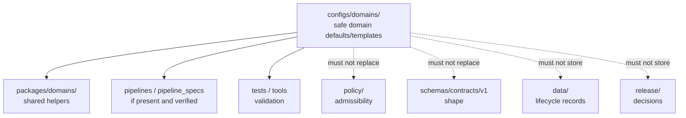

<!-- [KFM_META_BLOCK_V2]
doc_id: kfm://doc/configs-domains-readme
title: configs/domains/ — Domain Configuration Defaults and Templates
type: readme
version: v0.1
status: draft
owners: OWNER_TBD — Config steward · Domain stewards · Policy steward · Data steward · Docs steward
created: 2026-06-16
updated: 2026-06-16
policy_label: public
related:
  - ../README.md
  - ../../docs/doctrine/directory-rules.md
  - ../../packages/domains/
  - ../../docs/domains/
  - ../../policy/
  - ../../schemas/contracts/v1/domains/
  - ../../contracts/domains/
  - ../../data/registry/
  - ../../data/receipts/
  - ../../data/proofs/
  - ../../release/
tags: [kfm, configs, domains, defaults, templates, policy-aware, non-secret, governance]
notes:
  - "configs/domains/ is for safe domain-scoped configuration defaults and templates only."
  - "This folder must not contain authoritative domain records, source registry rows, policy rules, schemas, contracts, receipts, proofs, release decisions, or published artifacts."
  - "Domain-specific protection needs remain governed by policy, lifecycle state, evidence, and release review; config values do not authorize public exposure or promotion."
  - "Specific current domain config inventory, consumers, validation coverage, and CI enforcement remain NEEDS VERIFICATION."
[/KFM_META_BLOCK_V2] -->

<a id="top"></a>

<div align="center">

# Domain Configs

`configs/domains/`

**Safe domain-scoped configuration defaults and templates. This folder may define non-sensitive domain knobs, placeholders, and local/default parameters, but it must not become domain truth, policy, schema, registry, receipt, proof, release, publication, package, or pipeline authority.**


[Purpose](#1-purpose) · [Canonical fit](#2-canonical-fit) · [Protection posture](#4-domain-protection-posture) · [Allowed contents](#5-allowed-contents) · [Forbidden contents](#6-forbidden-contents) · [Validation](#9-validation-expectations) · [Definition of done](#12-definition-of-done)

</div>

---

> [!IMPORTANT]
> **Status:** draft / `NEEDS VERIFICATION`  
> **Path:** `configs/domains/README.md`  
> **Owning root:** `configs/`  
> **Responsibility:** safe domain-scoped defaults and templates  
> **Truth posture:** CONFIRMED README path / CONFIRMED parent `configs/` is canonical for safe defaults and templates / CONFIRMED `configs/domains/habitat/` exists as a domain sublane README / PROPOSED `configs/domains/` sublane contract / UNKNOWN current domain config inventory, consumers, validation coverage, CI enforcement, and owner assignments

> [!CAUTION]
> Domain config values do not authorize publication, source activation, reduced review, precise public display, or lifecycle promotion. Domain-protected material must still pass evidence, policy, lifecycle, steward review, release, redaction/generalization, correction, and rollback controls.

---

## 1. Purpose

`configs/domains/` is the domain-scoped configuration sublane under the canonical `configs/` root.

It exists to collect safe defaults and templates that may support domain ingestion, normalization, validation, source-role handling, public-safe layer preparation, steward review workflows, local development, and tests. It should make domain workflow configuration inspectable without storing authoritative domain records or deployment-only values.

This README does not prove that any domain config file is currently used by an app, package, pipeline, runtime adapter, test, or CI workflow. Those claims remain `NEEDS VERIFICATION` until checked against current repository evidence.

[Back to top](#top)

---

## 2. Canonical fit

`configs/domains/` belongs under:

```text
configs/
```

It may support domain-related consumers such as:

```text
packages/domains/              # shared domain helpers, not config authority
pipelines/domains/             # executable flows, if present and verified
pipeline_specs/                # declarative flow definitions, if present and verified
apps/                          # governed API / review / viewer consumers, if present and verified
runtime/                       # adapter templates only, not adapter code
```

The folder does not replace those roots and does not define domain object meaning, policy, source authority, or machine shape.

## 3. Authority boundary

```text
configs/domains/
├── safe domain defaults
├── placeholder-based templates
├── local validation examples
├── public-safe/generalization defaults
└── configuration notes

NOT HERE:
  source records
  registry rows
  policy rules
  schemas/contracts
  lifecycle data
  receipts/proofs
  release decisions
  published artifacts
  package or pipeline code
  deployment-only values
```

## 4. Domain protection posture

Domain configuration is policy-aware by default.

Safe configuration may describe thresholds, placeholder source IDs, environment labels, review toggles, public-safe generalization defaults, or validation options. It must not store protected domain details, raw source detail, private-land specifics, living-person data, or values that would bypass redaction/generalization.

Any configuration that changes display precision, generalization, review burden, source activation, or publication readiness should be treated as release-significant until policy and steward review confirm otherwise.

## 5. Allowed contents

| Allowed item | Example | Required posture |
|---|---|---|
| Safe domain defaults | `habitat/default.template.yaml`, `soil/dev.template.yaml` | Must be non-sensitive and reviewable |
| Placeholder templates | `.example`, `.template` | Must use placeholders for deployment-specific values |
| Public-safe parameters | generalized zoom thresholds, safe display toggles | Must defer to policy and release review |
| Validation examples | local test config with tiny synthetic values | Must not contain source data or protected detail |
| Documentation | field notes and consumer notes | Must point to schemas/contracts/policy for authority |
| Domain sublane README files | `habitat/README.md` | Must preserve domain authority boundaries |

## 6. Forbidden contents

| Forbidden here | Correct home |
|---|---|
| Domain source records, observations, event records, or lifecycle data | `data/` lifecycle subtrees |
| Source descriptors, source registry rows, rights rows, sensitivity rows | `data/registry/` or governed registry homes |
| Receipts and validation reports | `data/receipts/` |
| EvidenceBundles, proof packs, attestations | `data/proofs/` |
| Release decisions, release manifests, rollback/correction records | `release/` |
| Published artifacts or public layer outputs | `data/published/` after governed release |
| Policy rules and publication decisions | `policy/` and release-governed decision homes |
| Machine schema authority | `schemas/contracts/v1/` |
| Human contracts and object meaning | `contracts/` |
| Shared implementation packages | `packages/domains/` |
| Pipeline implementation logic | `pipelines/` |
| Deployment, host, network, display, and access-control definitions | `infra/` |
| Deployment-only values or environment binding | external deployment store / ignored local files / `infra/` controls |
| Generated build/QA artifacts | `artifacts/` |

## 7. Suggested directory shape

Current inventory remains `NEEDS VERIFICATION`.

```text
configs/domains/
├── README.md
├── habitat/README.md         # CONFIRMED domain sublane README path
├── flora/                    # PROPOSED domain sublane
├── fauna/                    # PROPOSED domain sublane
├── hydrology/                # PROPOSED domain sublane
├── soil/                     # PROPOSED domain sublane
├── geology/                  # PROPOSED domain sublane
└── validation.md             # PROPOSED cross-domain validation notes
```

> [!WARNING]
> Do not treat this suggested shape as repo fact beyond paths verified in this session. Verify actual files before making inventory or migration claims.

## 8. Diagram



## 9. Validation expectations

Useful validation for `configs/domains/` should confirm:

- every committed file is safe to share in the repo;
- templates use placeholders where deployment-specific values are needed;
- each config identifies its intended consumer;
- config fields align with domain schemas, contracts, package helpers, pipelines, apps, and tests when those are present;
- public-safe and protection-related parameters do not bypass policy or release review;
- no lifecycle data, release records, receipts, proofs, catalog records, source registry rows, or published artifacts are stored here;
- stale or unowned domain config examples are removed or marked `NEEDS VERIFICATION`.

## 10. Migration posture

If misplaced material is found under `configs/domains/`:

1. Do not treat it as authoritative until reviewed.
2. Identify whether it belongs under `policy/`, `schemas/`, `contracts/`, `packages/`, `runtime/`, `infra/`, `pipelines/`, `pipeline_specs/`, `data/`, `release/`, or `artifacts/`.
3. Move it through a small, reviewable migration.
4. Preserve necessary owner notes, provenance notes, and rollback instructions.
5. Add a drift note if the misplaced config was already consumed.

## 11. Safe change pattern

For changes under `configs/domains/`:

1. Confirm the file is a safe domain default, template, or config-facing documentation.
2. Confirm deployment-only values and protected domain details are not committed.
3. Confirm the config does not duplicate schema, policy, contract, release, registry, proof, receipt, publication, package, pipeline, or lifecycle authority.
4. Confirm consumers and validators are updated or explicitly marked `NEEDS VERIFICATION`.
5. Document any compatibility impact on domain packages, pipelines, apps, runtime adapters, or infra.
6. Update tests or explain why the change is documentation-only.

## 12. Definition of done

- [ ] Owners are confirmed and `OWNER_TBD` is replaced.
- [ ] Actual `configs/domains/` contents are inventoried.
- [ ] Every committed domain config is safe for the repo.
- [ ] No deployment-only values, protected source details, lifecycle data, registry rows, release records, receipts, proofs, catalog records, published artifacts, source data, or generated artifacts live here.
- [ ] Config templates identify the owning consumer and validation path.
- [ ] Domain policy, schema, contract, package, pipeline, app, and test alignment is verified or marked `NEEDS VERIFICATION`.
- [ ] Stale or unowned domain examples are migrated, deleted, or documented as drift.

## 13. Open verification items

| Item | Why it matters |
|---|---|
| Inventory current `configs/domains/` files | Required before claims about coverage or ownership |
| Confirm each domain sublane and owner | Required before parent-level path claims |
| Confirm package/pipeline/app/runtime consumers | Required before behavior claims |
| Confirm validation tooling and CI checks | Required before enforcement claims |
| Confirm no deployment-only values or protected domain details are present | Required before safe-sharing claims |
| Confirm config/schema/policy alignment | Required before governance claims |
| Confirm owner assignments | Required before maintenance claims |

<details>
<summary>Appendix A — no-loss preservation note</summary>

The previous README was empty. This replacement establishes the domain-config parent sublane contract without claiming any specific domain config inventory, consumer behavior, deployment behavior, validation behavior, or CI enforcement is implemented.

</details>

## Status summary

`configs/domains/` is a domain sublane under the canonical `configs/` root. It is for safe domain-scoped defaults and templates only. It is not a home for source records, lifecycle records, source registry rows, policy rules, schemas, contracts, receipts, proofs, release decisions, published artifacts, source code, runtime adapters, infra definitions, package code, pipeline code, or generated artifacts.

<p align="right"><a href="#top">Back to top</a></p>
