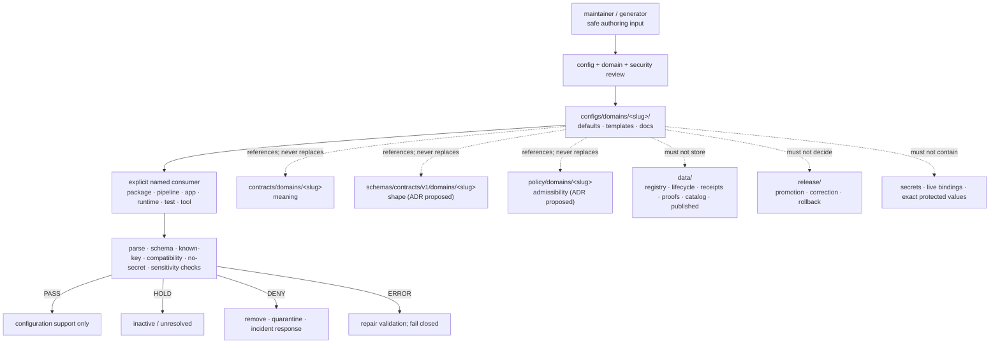

<!-- [KFM_META_BLOCK_V2]
doc_id: kfm://doc/configs-domains-readme
title: configs/domains/ — Governed Domain Configuration Defaults and Templates
type: readme
version: v0.5
status: draft
owners: OWNER_TBD — Config steward · Security steward · Domain stewards · Consumer owners · Validation steward · Policy steward · Release steward · Docs steward
created: 2026-06-16
updated: 2026-07-14
policy_label: "public; config-sublane; domain-scoped; non-secret; non-authoritative; no-live-binding; no-policy-authority; no-schema-authority; no-release-authority"
current_path: configs/domains/README.md
truth_posture: CONFIRMED repository-present parent README, thirteen canonical README-backed child lanes at the pinned base, current child README versions and statuses, empty machine lane register, config-specific CODEOWNERS absence, placeholder docs/link workflow state, and prior revision lineage / PROPOSED future consumer-bound payloads / UNKNOWN exhaustive differently named payload inventory, accepted owners, consumer wiring, loader precedence, schema binding, policy enforcement, CI enforcement, deployment integration, runtime behavior, and publication behavior
evidence_snapshot:
  repository: bartytime4life/Kansas-Frontier-Matrix
  repository_id: "1059091169"
  visibility: public
  base_ref: main
  base_commit: 93da20f35990ff8a30da9db4c2d5dc1809475e7c
  prior_blob: 2c5e8b70f4938eea5ac79f8f705cc3313df3f590
  prior_revision_commit: 2ca2d5c84d2c2f93f4f925e8f062b977a2f692e7
  prior_merge_commit: a5015c9047f6211a575748485a7485cc7271a6d1
related:
  - ../README.md
  - ../dev/README.md
  - ../test/README.md
  - ../local/README.md
  - ../templates/README.md
  - ../examples/README.md
  - ../../docs/doctrine/directory-rules.md
  - ../../docs/domains/README.md
  - ../../docs/registers/DOMAIN_LANE.md
  - ../../docs/registers/DRIFT_REGISTER.md
  - ../../docs/registers/VERIFICATION_BACKLOG.md
  - ../../control_plane/domain_lane_register.yaml
  - ../../docs/adr/ADR-0001-schema-home--schemas-contracts-v1-is-canonical.md
  - ../../docs/adr/ADR-0003-policy-singular-is-canonical-(policies-is-compatibility).md
  - ../../docs/security/SECRETS.md
  - ../../docs/security/INCIDENT_RESPONSE.md
  - ../../contracts/domains/
  - ../../schemas/contracts/v1/domains/
  - ../../policy/domains/
  - ../../packages/domains/
  - ../../pipelines/domains/
  - ../../pipeline_specs/
  - ../../data/registry/sources/
  - ../../data/receipts/
  - ../../data/proofs/
  - ../../data/catalog/domain/
  - ../../data/published/layers/
  - ../../release/candidates/
  - ../../tests/domains/
  - ../../fixtures/domains/
  - ../../tools/
  - ../../.github/CODEOWNERS
  - ../../.github/PULL_REQUEST_TEMPLATE.md
tags: [kfm, configs, domains, bounded-contexts, defaults, templates, placeholders, consumer-binding, validation, source-role, sensitivity, geoprivacy, no-secrets, non-authoritative, governance]
notes:
  - "v0.5 preserves the v0.4 no-secrets, no-authority, source-role, geoprivacy, migration, rollback, validation, and safe-language controls while refreshing the parent index to the current merged child README set."
  - "At the pinned base, all thirteen canonical child README paths are repository-present. Their documentation versions are mixed: nine v0.3, Habitat v0.4, and three v0.2. Version skew describes documentation maturity only; it does not establish executable configuration maturity."
  - "The human-facing domain register lists thirteen canonical domain lanes. The machine register at control_plane/domain_lane_register.yaml currently contains entries: []. No config discovery, validation, or activation behavior should depend on machine registration until the register is populated and validated."
  - "ADR-0001 and ADR-0003 are repository-present but status: proposed. This README references them as proposed governance handles and does not upgrade them to accepted authority."
  - "This revision changes only configs/domains/README.md. No child README, executable configuration payload, consumer, schema, contract, policy, registry, validator, test, fixture, workflow, runtime, deployment, lifecycle object, release object, or public artifact is created or modified."
[/KFM_META_BLOCK_V2] -->

<a id="top"></a>

# Governed Domain Configuration Defaults and Templates

`configs/domains/`

> Domain-scoped configuration may make safe defaults and templates inspectable. It must never make domain truth, source admission, policy, schema, evidence, release, or publication decisions.


**Quick links:** [Purpose](#purpose) · [Authority](#authority-level) · [Status](#status) · [Belongs](#what-belongs-here) · [Exclusions](#what-does-not-belong-here) · [Inputs](#inputs) · [Outputs](#outputs) · [Validation](#validation) · [Review](#review-burden) · [Related](#related-folders) · [ADRs](#adrs) · [Last reviewed](#last-reviewed) · [Domain matrix](#canonical-domain-configuration-matrix) · [File contract](#minimum-per-file-contract) · [Security](#secret-live-binding-and-sensitive-value-rules) · [Rollback](#rollback-and-correction-posture) · [FAQ](#faq)

> [!IMPORTANT]
> **Document status:** draft `v0.5`
> **Owning responsibility root:** `configs/`  
> **Observed lane maturity at the pinned base:** one README-backed child lane for each of the thirteen canonical domain slugs; the child documentation is at mixed versions, and no executable domain config payloads or consumers are established
> **Authority:** safe, non-secret, domain-scoped configuration defaults, templates, examples, and config-facing documentation only  
> **Lifecycle effect:** none by itself; configuration is not promotion, release, publication, or evidence  
> **Default runtime posture:** not loaded, not active, and not safe to assume consumed unless a current consumer and validation path are verified

> [!CAUTION]
> A value in this lane does **not** authorize source activation, exact-location display, geoprivacy bypass, reduced review, lifecycle promotion, public exposure, release readiness, emergency action, legal interpretation, or model truth. Where risk matters, missing or ambiguous support fails closed.

---

## Purpose

`configs/domains/` is the domain-scoped configuration sublane under the canonical `configs/` responsibility root.

It exists to hold small, safe-to-commit defaults, placeholder-based templates, review-oriented examples, and config-facing documentation for named KFM domain consumers. A good file here helps a maintainer understand configurable behavior without turning the configuration file into a hidden authority surface.

### Audience

This README is for:

- configuration and developer-experience maintainers;
- domain stewards;
- security, rights, sensitivity, and geoprivacy reviewers;
- package, pipeline, app, runtime, test, and tooling owners that may consume domain config;
- reviewers checking Directory Rules placement and trust-boundary integrity.

### Operating boundary

A domain config may describe **how a verified consumer should be configured**. It does not establish:

- what a domain object means;
- whether a source is admissible or active;
- whether evidence supports a claim;
- whether a policy allows exposure;
- whether a candidate is released;
- whether an app, pipeline, or runtime currently consumes the file.

[Back to top](#top)

---

## Authority level

**Implementation-supporting configuration sublane; non-authoritative for truth and governance.**

| Concern | Authority status | Determination |
|---|---:|---|
| Folder placement | **CONFIRMED** | `configs/domains/README.md` exists under `configs/`, whose parent README defines safe non-secret defaults and templates as the root responsibility. |
| Domain set | **CONFIRMED human-facing doctrine** | `docs/domains/README.md` and `docs/registers/DOMAIN_LANE.md` identify thirteen canonical domain lanes. |
| Config content | **NON-AUTHORITATIVE** | Files may express safe defaults and placeholders; they cannot own domain meaning, machine shape, policy, source identity, evidence, lifecycle state, or release state. |
| Current child inventory | **CONFIRMED FOR NAMED README PATHS** | Every canonical domain slug has a repository-present child `README.md` at the pinned base. This bounded check does not prove that differently named payloads are absent. |
| Machine domain registration | **NOT ESTABLISHED** | `control_plane/domain_lane_register.yaml` is repository-present but currently contains `entries: []`. |
| Consumer behavior | **UNKNOWN** | No general auto-discovery, loading, merge order, precedence, or unknown-key behavior is established by this README. |
| Validation enforcement | **NEEDS VERIFICATION** | Validation expectations are defined here; the inspected docs/link workflows remain TODO scaffolds rather than proof of enforcement. |
| Secret and sensitivity safety | **REQUIRED / ENFORCEMENT UNKNOWN** | Real secrets and protected context are forbidden; current full-lane scanning and review coverage remain unverified. |
| Production or public use | **NOT AUTHORIZED** | Parsing, presence, or a friendly filename is not deployment, activation, policy approval, or release approval. |

An example or template may point to authority. It cannot become authority by proximity or repetition.

[Back to top](#top)

---

## Status

### Repository snapshot

The evidence snapshot for this revision is pinned to:

| Field | Value |
|---|---|
| Repository | `bartytime4life/Kansas-Frontier-Matrix` |
| Repository ID | `1059091169` |
| Visibility | public |
| Base ref | `main` |
| Base commit | `93da20f35990ff8a30da9db4c2d5dc1809475e7c` |
| Prior target blob | `2c5e8b70f4938eea5ac79f8f705cc3313df3f590` |
| Prior content revision | `2ca2d5c84d2c2f93f4f925e8f062b977a2f692e7` |
| Prior merge commit | `a5015c9047f6211a575748485a7485cc7271a6d1` |

### Directly observed named paths

```text
configs/domains/
├── README.md
├── agriculture/README.md
├── archaeology/README.md
├── atmosphere/README.md
├── fauna/README.md
├── flora/README.md
├── geology/README.md
├── habitat/README.md
├── hazards/README.md
├── hydrology/README.md
├── people-dna-land/README.md
├── roads-rail-trade/README.md
├── settlements-infrastructure/README.md
└── soil/README.md
```

The following proposed payload/validation paths remain absent:

```text
configs/domains/validation.md
configs/domains/defaults.yaml
configs/domains/habitat/default.template.yaml
configs/domains/habitat/review.template.yaml
```

Every named child README path above was fetched successfully at the pinned base. The four proposed payload/validation paths were probed directly and were not found. Child READMEs also describe bounded documentation-only inventories, but an exhaustive recursive tree receipt was not available; differently named payloads therefore remain `NEEDS VERIFICATION`. None of these checks establishes consumer wiring, executable configuration maturity, validation enforcement, deployment integration, or runtime/publication behavior.

### Current child README snapshot

| Canonical slug | README version | Declared status | Blob at pinned base | Bounded conclusion |
|---|---:|---|---|---|
| `agriculture` | v0.3 | draft | `99032995f37f…` | README-backed boundary; executable payload and consumer not established. |
| `archaeology` | v0.3 | draft | `e42316554e24…` | README-backed boundary; executable payload and consumer not established. |
| `atmosphere` | v0.3 | draft | `6379c8123a27…` | README-backed boundary; executable payload and consumer not established. |
| `fauna` | v0.3 | draft | `30504fabf55a…` | README-backed boundary; executable payload and consumer not established. |
| `flora` | v0.3 | draft | `3215a5eeec33…` | README-backed boundary; executable payload and consumer not established. |
| `geology` | v0.3 | draft | `a63c579c397c…` | README-backed boundary; executable payload and consumer not established. |
| `habitat` | v0.4 | draft | `010b05e30b1d…` | README-backed boundary; executable payload and consumer not established. |
| `hazards` | v0.3 | draft | `9ea59b80a1e7…` | README-backed boundary; executable payload and consumer not established. |
| `hydrology` | v0.3 | draft; repository-grounded; documentation-only | `ae9976c523e0…` | README-backed boundary; executable payload and consumer not established. |
| `people-dna-land` | v0.3 | draft | `6b2d5c012786…` | README-backed boundary; executable payload and consumer not established. |
| `roads-rail-trade` | v0.2 | draft | `522af8a076d2…` | README-backed boundary; executable payload and consumer not established. |
| `settlements-infrastructure` | v0.2 | draft | `55104307922f…` | README-backed boundary; executable payload and consumer not established. |
| `soil` | v0.2 | draft | `ae2e04c9629a…` | README-backed boundary; executable payload and consumer not established. |

Documentation-version summary: **nine v0.3 lanes, one v0.4 lane, and three v0.2 lanes**. This version skew is an editorial maturity signal, not evidence that any lane is loaded, validated, deployed, released, or published.

### Maturity matrix

| Capability | Status | Safe conclusion |
|---|---:|---|
| Parent boundary README | **CONFIRMED** | The lane has a documented parent contract. |
| Canonical child READMEs | **CONFIRMED AT PINNED BASE** | All thirteen canonical slugs have a repository-present documentation boundary. |
| Domain configuration payloads | **NOT ESTABLISHED** | No general defaults, templates, or validation file was verified in the named probes. |
| Machine domain-lane entries | **EMPTY** | The current machine register does not enumerate domain lanes. |
| Auto-discovery | **NOT ESTABLISHED** | Folder presence must not trigger activation or loading by assumption. |
| Config precedence | **UNKNOWN** | No overlay order between defaults, dev, test, local, domain, environment, or deployment layers is established here. |
| Schema/contract binding | **NEEDS VERIFICATION** | Proposed governance handles exist; per-file bindings are not proven. |
| Secret scanning | **NEEDS VERIFICATION** | Prohibition is clear; repository-wide enforcement for this lane was not proven. |
| Sensitive-value scanning | **NEEDS VERIFICATION** | Human and automated coverage remain unverified. |
| Docs/link workflows | **PLACEHOLDER SCAFFOLDS** | Inspected workflows run TODO echo steps and do not prove content validation. |
| Accepted owners/CODEOWNERS | **UNKNOWN** | The CODEOWNERS file has a wildcard placeholder but no config-specific rule; effective review enforcement was not inspected. |
| Runtime/deployment/publication | **UNKNOWN / NOT AUTHORIZED BY THIS LANE** | Nothing here proves operational use or release. |

[Back to top](#top)

---

## What belongs here

Only safe, domain-scoped configuration material for a named or explicitly proposed consumer belongs here.

| Accepted material | Purpose | Minimum posture |
|---|---|---|
| Domain child `README.md` | Define the configuration boundary for one canonical domain slug. | Preserve the parent no-authority and no-secrets contract; identify domain-specific sensitivity risks. |
| `*.template.yaml` / `*.template.yml` | Safe template for a named consumer. | Parseable; placeholders only for local/deployment/source-specific values; validation path documented. |
| `*.example.yaml` / `*.example.json` / `*.example.toml` | Illustrative, commit-safe configuration. | Obvious mock values; no automatic activation; consumer and format version identified. |
| Review defaults | Conservative review-routing, hold, caveat, or abstention defaults. | Cannot reduce policy or release burden; fail closed where unclear. |
| Public-safe display templates | Generalization profile names, safe zoom hints, display toggles. | References policy/release controls; never contains exact protected geometry or grants exposure. |
| Validation notes | Human instructions and expected checks. | Commands and workflows must be verified or labeled `PROPOSED` / `NEEDS VERIFICATION`. |
| Compatibility notes | Temporary key/path migration guidance. | Time-bounded, owner-linked, reversible, and not a second config authority. |
| Tiny synthetic examples | Demonstrate config shape without source data. | No real person, parcel, occurrence, infrastructure, archaeology, rights-restricted, or source payload data. |

### Canonical slug rule

A child directory should use a canonical domain slug from the domain register. A new slug, rename, merge, or retirement is not a configuration-only decision; it requires domain-governance review and the applicable ADR process.

[Back to top](#top)

---

## What does NOT belong here

| Prohibited material | Why prohibited | Correct home or action |
|---|---|---|
| Real tokens, passwords, API keys, private keys, cookies, certificates, signed URLs, service-account material | The repository is not a secret store. | External secret manager or approved local/deployment mechanism; rotate and invoke the leak runbook if exposed. |
| Production, staging, tenant, operator, or workstation-specific live values | Creates accidental binding and disclosure risk. | Deployment controls, ignored local overrides, or environment-specific secret/config stores. |
| Private endpoints, internal hostnames, private IPs, connection strings | Exposes operational topology and creates false portability. | Governed deployment system or restricted operator documentation. |
| Exact sensitive coordinates or contextual clues | Can expose rare species, archaeology, cultural sites, private land, living persons, or critical infrastructure. | Governed lifecycle and policy lanes; redact, generalize, stage, quarantine, or deny. |
| Source descriptors, activation records, rights rows, sensitivity rows | Configuration cannot admit or activate sources. | `data/registry/`, `data/registry/sources/`, or the accepted registry authority. |
| Domain observations, source payloads, model outputs, candidates, exports | Configuration is not lifecycle data. | Correct `data/raw`, `work`, `quarantine`, `processed`, `catalog`, `triplets`, or `published` lane. |
| Object meaning and invariants | Config cannot own semantic truth. | `contracts/domains/<slug>/`. |
| Machine schema definitions | Config cannot own shape. | Proposed canonical schema home under `schemas/contracts/v1/domains/<slug>/`, subject to ADR status and current repo evidence. |
| Policy rules, allow/deny logic, geoprivacy decisions | Config cannot authorize exposure. | `policy/domains/<slug>/` or accepted policy authority. |
| Tests and golden/invalid corpora | Config examples are not enforceability proof. | `tests/domains/<slug>/` and `fixtures/domains/<slug>/`. |
| Shared package code | Config is not implementation. | `packages/domains/<slug>/`. |
| Pipeline logic or durable pipeline specifications | Config must not become an execution lane. | `pipelines/domains/<slug>/` or `pipeline_specs/<slug>/`. |
| Runtime adapters and service harnesses | Templates cannot become runtime authority. | `runtime/`. |
| Deployment, network, firewall, access, host, or secret-manager definitions | These govern operational exposure. | `infra/` and external deployment controls. |
| Receipts, validation reports, proof packs, EvidenceBundles | Config cannot prove its own governance. | `data/receipts/`, `data/proofs/`, or accepted evidence homes. |
| Release manifests, promotion decisions, correction notices, rollback cards | Config cannot approve release. | `release/`. |
| Published layers, tiles, API snapshots, reports, exports | This lane is not a public delivery surface. | `data/published/` after governed promotion. |
| Generated reports, caches, screenshots, build output | Generated output must not become config authority. | `artifacts/` or ignored local workspace, subject to artifact rules. |
| Emergency thresholds presented as current warnings | KFM config is not an alert authority. | Official alerting source/system; KFM may carry clearly labeled context only after governance. |

A domain config folder must not become a quiet parallel home for any trust-bearing object family.

[Back to top](#top)

---

## Inputs

### Admissible authoring inputs

A file may be authored from:

- an explicit, current consumer requirement;
- a contract or schema reference that owns meaning or shape;
- a policy reference that owns sensitivity and admissibility;
- safe local, development, test, or review defaults;
- a migration note for a verified key or path change;
- a synthetic example created solely to explain configuration shape.

### Required context before adding a config payload

Before a non-README file is added, the author should identify:

1. canonical domain slug;
2. intended consumer and owning root;
3. configuration class and environment scope;
4. parser or loader version, when verified;
5. schema/contract/policy references, when applicable;
6. validation method;
7. local/deployment override mechanism;
8. secret and sensitivity review;
9. side effects and network behavior;
10. deprecation or rollback path.

### Inputs that must be rejected

Reject or quarantine authoring input that contains:

- real credentials or live bindings;
- protected or personally identifying data;
- exact sensitive locations or reconstructable clues;
- unreviewed legal, ownership, regulatory, or emergency assertions;
- instructions to bypass policy, evidence, review, release, or public-safe transformation;
- copied source payloads presented as configuration examples.

[Back to top](#top)

---

## Outputs

This lane may support downstream consumers by providing:

- documented, safe defaults;
- parseable templates with placeholders;
- configuration examples for local development or review;
- migration notes for config keys and file names;
- validation expectations and references.

This lane does **not** emit or authorize:

- source activation;
- lifecycle transitions;
- EvidenceBundles or claims;
- policy decisions;
- release manifests or promotion receipts;
- published layers, tiles, APIs, or AI answers;
- deployment bindings or runtime credentials.

A consumer must explicitly opt in through reviewed implementation. No consumer should recursively load this directory merely because it exists.

[Back to top](#top)

---

## Validation

No repository-native executable validator was verified for the parent lane in this refresh. The matrix below is the **required validation target**, not a claim that every check is implemented.

### Validation matrix

| Check | Required outcome | Current evidence |
|---|---|---|
| Syntax/parse | File parses under its declared format and version. | `NEEDS VERIFICATION` per payload. |
| Schema shape | Keys and values conform to the referenced schema when one is accepted and available. | `NEEDS VERIFICATION`; ADR-0001 is proposed. |
| Known-key check | Unknown or misspelled keys fail or are surfaced; silent ignore behavior is documented. | `UNKNOWN`. |
| Consumer compatibility | Named consumer can load the file without fallback, network access, or hidden mutation unless explicitly documented. | `UNKNOWN`. |
| Deterministic parse | Same file and parser version produce the same normalized configuration. | `PROPOSED`. |
| Secret scan | No credential-like or private key material exists. | Required; full enforcement `NEEDS VERIFICATION`. |
| Sensitive-value review | No exact protected location, private-person, private-land, cultural, infrastructure, or rights-restricted clue exists. | Required; full enforcement `NEEDS VERIFICATION`. |
| Private endpoint/path scan | No private operational endpoint or personal workstation path exists. | Required; enforcement `NEEDS VERIFICATION`. |
| No side effect | Validation does not activate sources, write lifecycle data, publish, deploy, or call external services. | Required. |
| No-network fixture check | Parse and basic validation can run with network disabled where practical. | `PROPOSED`; not yet proven for this lane. |
| Lifecycle isolation | No data, registry, receipt, proof, catalog, release, or published object is stored here. | Manual boundary review required. |
| Authority references | Schema, contract, policy, consumer, owner, and override references are accurate or explicitly unresolved. | Manual review required. |
| Documentation links | Relative links and anchors resolve. | Inspected repository link workflow is a TODO stub; local/manual check required. |
| Staleness | Owner, consumer, version, and review date remain current. | Review every six months or on consumer change. |

### Finite review dispositions

These dispositions apply to configuration review only; they are **not** KFM publication decisions.

| Disposition | Meaning | Required action |
|---|---|---|
| `PASS` | Required checks pass and review burden is satisfied. | May merge as configuration support; still no release authority. |
| `HOLD` | Checkable uncertainty remains, but no immediate security/sensitivity violation was found. | Do not claim consumption or activation; resolve or document the gap. |
| `DENY` | Secret, live binding, protected detail, authority bypass, or unsafe side effect is present. | Remove or quarantine; invoke security/sensitivity response when applicable. |
| `ERROR` | Validator, parser, or review process failed unexpectedly. | Repair the process; do not treat failure as permission. |

### Workflow threat preflight for this documentation change

The inspected docs-control-plane, docs-build, and link-check workflows:

- trigger on `pull_request` and pushes to `main`;
- use GitHub-hosted `ubuntu-latest` runners;
- contain TODO echo steps rather than substantive validation;
- do not show `pull_request_target`, explicit secret use, or self-hosted runner use in their inspected bodies.

This is a bounded preflight, not proof of repository-wide workflow safety or branch-protection enforcement.

[Back to top](#top)

---

## Review burden

### Minimum reviewers by change class

| Change | Minimum human review posture |
|---|---|
| README clarification only | Config steward or docs steward; affected domain steward when semantics change. |
| New domain child README | Config steward + affected domain steward + docs steward. |
| New or changed config payload | Config steward + consumer owner + affected domain steward. |
| Public-safe display, generalization, geoprivacy, sensitivity, rights, or source-role key | Add policy/sensitivity/security reviewer; release steward when downstream public behavior could change. |
| Credential, endpoint, deployment, runtime, or access-related key | Security and operations review required; keep real values outside the repo. |
| New domain slug, rename, merge, or retirement | ADR-class domain governance; not a config-only PR. |
| Schema-home or policy-home change | Applicable ADR and authority-root reviewers; not a README decision. |

### CODEOWNERS boundary

The inspected `.github/CODEOWNERS` file contains a wildcard placeholder and selected root/domain rules, but no config-specific path rule. Therefore:

- automatic reviewer assignment for this lane is `UNKNOWN`;
- `OWNER_TBD` must not be presented as accepted ownership;
- manual reviewer selection remains necessary until ownership and enforcement are verified.

### Change budget

Prefer one bounded concern per PR:

- one parent/child README revision;
- one config file plus its validation/test change;
- one key migration plus compatibility note;
- one consumer-binding change plus rollback.

Do not bundle config cleanup with unrelated schema, policy, data, release, or runtime rewrites.

[Back to top](#top)

---

## Related folders

| Responsibility | Canonical or proposed counterpart | Relationship to this lane |
|---|---|---|
| Parent configuration boundary | `configs/README.md` | Owns repo-wide safe non-secret configuration posture. |
| Environment-specific examples | `configs/dev/`, `configs/test/`, `configs/local/`, `configs/examples/`, `configs/templates/` | Sibling config concerns; no implicit precedence is established. |
| Human domain doctrine | `docs/domains/<slug>/` | Explains domain scope and source-role/sensitivity posture. |
| Human domain register | `docs/registers/DOMAIN_LANE.md` | Lists the canonical thirteen domain lanes. |
| Machine domain register | `control_plane/domain_lane_register.yaml` | Intended machine index; currently contains no entries. |
| Object meaning | `contracts/domains/<slug>/` | Semantic authority; config only references it. |
| Machine shape | `schemas/contracts/v1/domains/<slug>/` | Proposed canonical schema shape under ADR-0001; verify status and actual files. |
| Admissibility and exposure | `policy/domains/<slug>/` | Policy authority under proposed policy-root ADR; config cannot override it. |
| Shared implementation | `packages/domains/<slug>/` | Consumer code and helpers, when present. |
| Executable pipelines | `pipelines/domains/<slug>/` | Execution logic; may consume config explicitly. |
| Declarative pipeline specs | `pipeline_specs/<slug>/` | Durable pipeline definitions; not merely config examples. |
| Source registry | `data/registry/sources/<slug>/` | Source identity, role, rights, cadence, sensitivity, activation. |
| Lifecycle data | `data/<phase>/<slug>/` | Data state; never stored in config. |
| Receipts and proofs | `data/receipts/`, `data/proofs/` | Audit/proof objects; config cannot self-attest. |
| Release decisions | `release/candidates/<slug>/` and accepted release homes | Promotion, rollback, correction, withdrawal. |
| Enforceability | `tests/domains/<slug>/`, `fixtures/domains/<slug>/`, `tools/` | Tests, fixtures, and validators. |
| Secrets and incident response | external secret manager, `docs/security/SECRETS.md`, `docs/security/INCIDENT_RESPONSE.md` | Real values remain outside the repo; exposure triggers response. |

[Back to top](#top)

---

## ADRs

| ADR or decision surface | Repository status | Effect on this README |
|---|---:|---|
| `ADR-0001 — Schema Home: schemas/contracts/v1/ is Canonical` | **PROPOSED** | Provides a proposed schema-reference target. This README does not upgrade it to accepted authority. |
| `ADR-0003 — policy/ is canonical; policies/ is compatibility` | **PROPOSED** | Provides a proposed policy-root target. This README does not upgrade it to accepted authority. |
| Domain lane addition/rename/removal | **ADR REQUIRED by Directory Rules** | A config directory cannot create a new KFM domain by itself. |
| Config auto-discovery and precedence | **NO ACCEPTED DECISION VERIFIED** | Consumers must bind files explicitly until governed behavior is documented and tested. |
| Universal domain-config envelope | **OPEN / PROPOSED** | This README defines a minimum documentation contract but does not create a machine schema. |

### ADR triggers not exercised by this README-only refresh

This documentation-only revision does not:

- add, remove, or rename a canonical root;
- create a parallel schema, contract, policy, registry, proof, receipt, or release home;
- change lifecycle phases;
- admit or rename a domain;
- establish auto-discovery, precedence, deployment, or release behavior.

[Back to top](#top)

---

## Last reviewed

**2026-07-14** — pinned to `main@93da20f35990ff8a30da9db4c2d5dc1809475e7c`

Review again when any of the following occurs:

- a domain child directory or payload is added;
- the machine domain register gains entries;
- a consumer begins loading files from this lane;
- config precedence or auto-discovery is decided;
- ADR-0001 or ADR-0003 changes status;
- secret/sensitivity validation is implemented;
- six months pass without review.

[Back to top](#top)

---

## Canonical domain configuration matrix

The human-facing domain register identifies thirteen canonical domain lanes. The table below distinguishes **domain standing** from **repository-present config documentation**.

| Canonical slug | Domain posture carried into config | Child README at pinned base | Default config caution |
|---|---|---:|---|
| `hydrology` | Preserve observed, regulatory, modeled, forecast, and historical roles. | **CONFIRMED** | Never become emergency-warning or live-status authority. |
| `soil` | Preserve static survey, gridded derivative, station, satellite, pedon, and interpretation support types. | **CONFIRMED** | Do not flatten support types or expose private production/land context. |
| `habitat` | Preserve landscape ownership, model-vs-observation, stewardship, and public-safe geometry controls. | **CONFIRMED** | Rare-species and stewardship joins require fail-closed handling. |
| `fauna` | Preserve restricted/public occurrence separation and taxonomic/source uncertainty. | **CONFIRMED** | Never expose nests, dens, roosts, telemetry, or exact protected sites by config. |
| `flora` | Preserve specimen/occurrence/range/model distinctions and rare/cultural plant protections. | **CONFIRMED** | Exact rare or culturally sensitive locations fail closed. |
| `agriculture` | Preserve aggregate, field-candidate, survey, model, and private producer distinctions. | **CONFIRMED** | Private joins and producer-identifying context are denied by default. |
| `geology` | Preserve occurrence, deposit, resource estimate, extraction, permit, and physical geology distinctions. | **CONFIRMED** | Resource and infrastructure-sensitive detail may require restriction/generalization. |
| `atmosphere` | Preserve observed, regulatory, modeled, forecast, climatological, and aggregate roles. | **CONFIRMED** | Configuration must not turn forecast/model context into observed fact. |
| `hazards` | Preserve event, observation, warning/advisory context, declaration, exposure, and model distinctions. | **CONFIRMED** | KFM is never an alert or incident-command authority. |
| `roads-rail-trade` | Preserve physical network, administrative route, historic route, condition, and inferred graph roles. | **CONFIRMED** | Operational or sensitive infrastructure detail requires governed review. |
| `settlements-infrastructure` | Preserve settlement, jurisdiction, facility, service area, dependency, and critical-asset distinctions. | **CONFIRMED** | Critical infrastructure and private facility detail fail closed. |
| `archaeology` | Preserve observed site, survey, interpretation, candidate, reconstruction, and cultural authority distinctions. | **CONFIRMED** | Exact sites, human remains, sacred places, and sovereignty-sensitive context remain restricted. |
| `people-dna-land` | Preserve assertion-first identity, consent, living/deceased status, genealogy, DNA, title, and land-claim distinctions. | **CONFIRMED** | Living-person, DNA, consent, title, and cultural-rights controls are mandatory. |

> [!NOTE]
> PR #1116 materialized documentation-only boundaries for every canonical slug. This v0.5 refresh records their current merged state; it does not authorize payloads. A non-README config still requires a real consumer, review owner, validation plan, and rollback path.

[Back to top](#top)

---

## Domain configuration bounded context

Within this lane, use a consistent vocabulary:

| Term | Meaning here |
|---|---|
| **domain config** | A safe, domain-scoped parameter set for a named consumer; never domain truth. |
| **consumer** | The app, package, pipeline, pipeline spec, runtime adapter, test, or tool that explicitly reads the file. |
| **template** | A non-active example containing safe defaults and placeholders. |
| **binding** | Reviewed code or deployment wiring that selects a config file. Presence in this folder is not a binding. |
| **override** | A higher-precedence value supplied through a documented local/deployment mechanism. Precedence is `UNKNOWN` until defined by the consumer. |
| **public-safe profile** | A name or parameter set that supports a governed transformation; it is not a policy or release decision. |
| **source-role parameter** | A value that preserves, filters, or displays an existing source role; it cannot upgrade a role. |
| **review default** | A conservative routing preference such as hold, abstain, or review-required; it cannot waive policy. |
| **activation** | A registry/governance decision that allows a source or capability to operate; never caused by config presence alone. |

The bounded context ends where semantic meaning, machine shape, admissibility, source identity, lifecycle state, or release authority begins.

---

## Configuration class taxonomy

Every payload should declare one class in its documentation or companion metadata.

| Class | Intended use | Commit posture | Activation posture |
|---|---|---|---|
| `template` | Demonstrate supported fields and placeholders. | Safe to commit after review. | Never active by presence. |
| `example` | Explain a realistic but synthetic configuration. | Safe to commit after review. | Never active by presence. |
| `dev-default` | Conservative defaults for a verified development consumer. | Non-secret and portable. | Explicit consumer opt-in only. |
| `test-default` | Deterministic parameters for test execution. | Synthetic and no-network where practical. | Test harness only; not production. |
| `review-default` | Steward/review workflow parameters. | Fail closed; no release shortcuts. | Review tooling only when verified. |
| `public-safe-template` | Parameters for an already governed redaction/generalization profile. | May reference profile IDs, never exact protected data. | Policy and release checks still required. |
| `compatibility` | Temporary mapping for a key/path transition. | Time-bounded and owner-linked. | Remove after migration closure. |
| `production-binding` | Real deployment values and credentials. | **Forbidden here.** | External deployment/secret system only. |

---

## Minimum per-file contract

A non-trivial domain config should make the following information inspectable, either in comments, a companion README, or machine metadata owned by an accepted schema.

| Field | Requirement |
|---|---|
| `domain_slug` | One canonical domain slug. |
| `config_class` | One class from the taxonomy above. |
| `intended_consumer` | Exact app/package/pipeline/runtime/test/tool path or `NEEDS VERIFICATION`. |
| `consumer_version` | Version/range when verified; otherwise unresolved. |
| `format` | YAML/JSON/TOML/dotenv/etc. plus parser expectations. |
| `authority_refs` | Contract, schema, policy, registry, or ADR references—without duplicating their authority. |
| `validation_ref` | Executable check or explicit `NEEDS VERIFICATION`. |
| `network_behavior` | `none` by default; any network use belongs to the consumer and must be documented. |
| `side_effects` | `none` for parse/validation; lifecycle/release/deployment side effects are forbidden. |
| `secret_posture` | No real secrets; name external secret references only. |
| `sensitivity_posture` | No exact protected values or reconstructable sensitive clues. |
| `override_mechanism` | Ignored local or deployment mechanism for real environment values. |
| `owner` | Responsible maintainer or `OWNER_TBD`; do not invent. |
| `reviewed_at` | ISO date. |
| `deprecation` | Replacement and sunset when temporary. |

A universal machine envelope is **PROPOSED**, not created by this README.

---

## Consumer binding and precedence

### Explicit binding rule

A consumer must identify the exact config path it reads. Avoid recursive directory scanning and filename-based activation.

### No precedence by convention

This README does not decide whether values merge in an order such as:

```text
base → domain → dev/test → local → environment → deployment
```

That sequence is illustrative only. The verified consumer must define and test:

- source files considered;
- merge order;
- replace-vs-merge behavior;
- environment-variable substitution;
- unknown-key behavior;
- type coercion;
- error and fallback behavior;
- logging/redaction behavior.

### Fail-safe defaults

When loading fails or a required key is unresolved, a consumer should not silently:

- activate a source;
- broaden access;
- disable review;
- expose exact geometry;
- publish a candidate;
- fall back to a permissive environment.

Use an explicit error, hold, denial, or safe inactive state.

---

## Secret, live-binding, and sensitive-value rules

### Real secrets are forbidden

Never commit:

- credentials, tokens, private keys, certificates, passwords, cookies, service-account files, or signed URLs;
- values described as “test,” “sample,” or “local” when they are real;
- secret values copied from logs, screenshots, notebooks, terminals, issue comments, or support messages.

Acceptable patterns include:

- environment variable **names** without values;
- external secret reference identifiers that reveal no secret;
- public verifier material explicitly safe to publish;
- unmistakable synthetic placeholders such as `<REPLACE_OUTSIDE_REPO>`.

### Domain-sensitive values are also forbidden

A value need not look like a credential to be unsafe. Do not commit:

- exact rare-species or rare-plant locations;
- archaeology, sacred-place, burial, or cultural-site coordinates;
- living-person, DNA, consent, genealogy, or private contact data;
- private parcel/owner joins or dispute-sensitive title information;
- critical infrastructure locations, network details, or vulnerabilities;
- emergency response, facility security, or operational command detail;
- source clues that allow reconstruction of restricted locations.

### Incident posture

When a secret or protected value is committed:

1. stop treating the file as a harmless example;
2. remove it from the active branch;
3. rotate/revoke credentials when applicable;
4. assess history and downstream copies;
5. follow the security/sensitivity runbook;
6. add a correction or incident record as required;
7. improve validation to prevent recurrence.

---

## Source-role and model-parameter anti-collapse rules

| Risk | Required rule |
|---|---|
| Regulatory data presented as observation | Config may select a display role but cannot relabel regulatory context as observed reality. |
| Model output presented as fact | Thresholds and styles remain model parameters; source role and uncertainty stay visible. |
| Historical source presented as current | Temporal scope and stale state remain explicit. |
| Candidate presented as released | Candidate visibility requires review tooling; public clients require release state. |
| Aggregate presented as individual | Aggregation level and privacy constraints remain explicit. |
| Source ID presented as activation | A placeholder/reference does not admit or activate a source. |
| “Public-safe” key treated as approval | Policy, transformation receipt, review, release, and rollback remain required. |
| `review_required: false` treated as waiver | Config cannot waive mandatory policy or release review. |
| Confidence threshold treated as truth | Confidence changes method behavior, not evidentiary authority. |
| Watcher config treated as publisher | Watchers may detect/propose; they do not publish. |

---

## Child-lane creation criteria

Create `configs/domains/<slug>/` only when all of the following are true:

- the slug is canonical or has an accepted domain ADR;
- a documentation-only boundary is explicitly authorized, or a named consumer has a real domain-specific configuration need;
- shared config cannot reasonably live in a non-domain sibling lane;
- the child README preserves this parent contract;
- secret and sensitivity risks are identified;
- validation and rollback are described;
- ownership and review burden are named or explicitly unresolved;
- no parallel schema, policy, registry, data, release, package, or pipeline authority is created.

Do **not** create empty directories or speculative templates solely for symmetry. Explicit authorization for a README boundary does not authorize a payload; every non-README file still requires a verified consumer and format.

### Suggested shape, not current inventory

```text
configs/domains/
├── README.md
└── <canonical-slug>/
    ├── README.md
    ├── <consumer>.template.yaml     # only after a consumer is verified
    └── MIGRATION.md                 # only during a time-bounded migration
```

---

## Runtime and producer anti-bypass matrix

| Bypass risk | Required behavior | Evidence needed to close review |
|---|---|---|
| Config contains a secret or live credential | `DENY`; remove and rotate/revoke where applicable. | Security review and clean history/branch evidence. |
| Config contains a private endpoint or machine path | Replace with reference/placeholder and document external binding. | Portable, non-sensitive payload. |
| Config contains protected detail | `DENY` or quarantine; generalize/redact outside this lane. | Sensitivity review and transform/release evidence. |
| Consumer auto-loads every child directory | Reject implicit activation; require explicit allowlist/binding. | Consumer code and tests. |
| Unknown key is silently ignored | Surface error or documented safe behavior. | Parser/consumer test. |
| Config disables review/policy | Reject; config cannot waive governance. | Policy/release tests. |
| Config duplicates schema or contract | Move authority to the owning root; retain reference only. | Canonical authority link and migration note. |
| Config embeds registry/lifecycle/catalog/release objects | Move object to owning data/release root. | Clean lane scan and provenance-preserving move. |
| Public client reads `configs/domains/` | Reject; route through governed API/released artifacts. | Architecture and integration tests. |
| Validation calls a live source | Replace with fixture/no-network validation where practical. | No-network test or bounded exception. |
| Generated output lands here | Move to artifact/ignored workspace or governed lifecycle home. | Clean diff and output-path test. |

---

## Diagram



---

## Migration posture

When misplaced material is found under `configs/domains/`:

1. freeze authority claims and consumer expansion;
2. identify the material’s true responsibility;
3. remove or quarantine secrets and protected values immediately;
4. preserve provenance and current consumers;
5. move semantic meaning to `contracts/`;
6. move machine shape to the accepted schema home;
7. move admissibility to the accepted policy home;
8. move source identity and activation to registry governance;
9. move lifecycle, receipts, proofs, catalog, and published objects to `data/`;
10. move promotion, correction, withdrawal, and rollback decisions to `release/`;
11. move implementation to `apps/`, `packages/`, `pipelines/`, `runtime/`, or `tools/` as appropriate;
12. update consumers and compatibility notes;
13. test rollback and remove the compatibility layer when safe;
14. record drift/correction when prior use made the misplaced path consequential.

A move is not complete merely because Git history shows a rename. Consumers, validation, references, and rollback must also close.

---

## Safe change pattern

For a change under this lane:

1. pin the base ref and target blob;
2. inspect the parent README, child README, domain doctrine/register, applicable ADRs, drift register, consumers, validators, and workflows;
3. classify the file as documentation, template, example, dev/test/review default, compatibility layer, or forbidden live binding;
4. check secrets, endpoints, workstation paths, and protected values;
5. verify the domain slug and intended consumer;
6. verify or explicitly bound schema/contract/policy references;
7. add or update validation and consumer tests when behavior changes;
8. keep the PR scoped and list non-goals;
9. compare the branch against the pinned base;
10. provide rollback using prior blob/commit or a tested key/path reversal.

Documentation-only changes should say why executable tests are not applicable without implying that runtime behavior was validated.

---

## Rollback and correction posture

### Rollback triggers

Correct or roll back this lane if it begins acting as:

- a secret or live-binding store;
- a source registry or activation surface;
- a schema, contract, or policy authority;
- a lifecycle, catalog, proof, receipt, or release store;
- a public-client data surface;
- an implicit recursive config-discovery root;
- a home for protected values or exact sensitive geometry;
- a way to bypass review, redaction/generalization, correction, or rollback.

### Preferred correction path

1. remove/quarantine unsafe material;
2. rotate or revoke exposed credentials;
3. disable unsafe consumer binding;
4. restore the prior reviewed config or README blob;
5. move durable material to the owning responsibility root;
6. add migration/drift/correction documentation;
7. update tests and validators;
8. confirm no public or downstream artifact remains dependent on the unsafe state.

For this README revision, the prior blob is recorded in the meta block so restoration is inspectable.

---

## Verification backlog

| Item | Status | Evidence needed |
|---|---:|---|
| Exhaustive recursive `configs/domains/` inventory | `NEEDS VERIFICATION` | Non-truncated tree or mounted checkout receipt. |
| Differently named child files/directories | `UNKNOWN` | Full tree inspection. |
| Refresh the parent `configs/README.md` tree snapshot | `OPEN` | Update its stale `main@55a84f062…` inventory, which still shows only the Habitat child lane. |
| Populate and validate `control_plane/domain_lane_register.yaml` | `OPEN` | Machine entries, schema, human/machine parity test, owner review. |
| Accepted config and domain owners | `OWNER_TBD` | Valid CODEOWNERS/team assignments and steward acceptance. |
| Consumer bindings | `UNKNOWN` | Code references, loader tests, package/app/pipeline docs. |
| Precedence and unknown-key behavior | `UNKNOWN` | Accepted decision plus tests. |
| Per-file schema/contract/policy links | `NEEDS VERIFICATION` | Current files and accepted authority references. |
| Secret scanning coverage | `NEEDS VERIFICATION` | Workflow/tool config and passing evidence. |
| Sensitive-value scanning/review | `NEEDS VERIFICATION` | Rules, fixtures, reviewer workflow, passing evidence. |
| No-network validation | `NEEDS VERIFICATION` | Executable test or documented bounded exception. |
| Docs/link validation | `NEEDS VERIFICATION` | Non-placeholder workflow or local receipt. |
| Deployment/runtime/publication integration | `UNKNOWN` | Current implementation, manifests, logs, and release evidence. |
| ADR-0001 and ADR-0003 disposition | `PROPOSED` | Accepted/superseded/rejected ADR status. |

---

## Safe language rules

| Avoid saying | Prefer saying |
|---|---|
| “This folder contains every domain config.” | “The pinned snapshot confirms README boundaries for all thirteen canonical slugs; exhaustive payload and consumer coverage is not established.” |
| “The API uses this file.” | “This file names the API as an intended consumer; wiring is `NEEDS VERIFICATION` unless cited.” |
| “This setting makes the output public-safe.” | “This setting references or supports a public-safe profile; policy, transform, review, release, and rollback remain required.” |
| “The source is active.” | “The template contains a source reference or placeholder; activation belongs to registry governance.” |
| “The schema is canonical.” | “ADR-0001 proposes the schema home; acceptance and file presence must be verified.” |
| “The policy path is canonical.” | “ADR-0003 proposes the policy-root decision; acceptance must be verified.” |
| “CI validates domain config.” | “Validation is required; the inspected docs/link workflows are placeholder scaffolds.” |
| “No secrets are present.” | “No secrets are intended; full inventory and scanning coverage remain `NEEDS VERIFICATION` unless checked.” |
| “The threshold proves risk/suitability/habitat.” | “The threshold is a method parameter and does not establish domain truth.” |
| “Missing config means safe defaults apply.” | “Missing or invalid config must enter an explicit safe inactive/error/hold state defined by the consumer.” |

---

## FAQ

### Does creating `configs/domains/<slug>/` create a KFM domain?

No. Domain standing comes from doctrine, registers, ADRs, and review. Config placement follows an existing domain; it does not create one.

### Should every canonical domain have an empty config folder?

No. All canonical slugs currently have non-empty, documentation-only boundaries, created under the scope of PR #1116. That history does not justify placeholder payloads. Future child lanes or non-README files still require explicit authority or a real consumer, owner, validation plan, and rollback path.

### Can a config contain a source URL?

Only when the URL is public, non-sensitive, safe to commit, and merely illustrative or required by a verified consumer. Source admission, rights, cadence, authority, and activation still belong to registry governance. Private or signed URLs are forbidden.

### Can a config disable geoprivacy or review for local development?

Not when doing so could expose protected context or normalize a bypass. Use synthetic fixtures and controlled test harnesses instead. Mandatory policy cannot be waived by config.

### Can tests use files from this lane?

They may consume safe config templates, but expected inputs/outputs and valid/invalid corpora belong under `fixtures/` and enforceability under `tests/`.

### Can an application auto-discover all domain configs?

No auto-discovery behavior is established here. Prefer explicit bindings. Any discovery mechanism needs a governed contract, allowlist, tests, safe failure behavior, and review.

### Where do real local values go?

In ignored local overrides, environment variables, or approved external secret/config systems. The repository should store only safe references and templates.

### Does `PASS` mean a config may publish data?

No. It means the configuration-support review passed. Publication still requires evidence, policy, validation, review, release, correction, and rollback.

---

## Evidence ledger

| Evidence | Blob / state | Supports | Does not prove |
|---|---|---|---|
| `configs/domains/README.md` | prior blob `2c5e8b70…`; v0.4 | Existing parent boundary and lineage. | Current payload inventory or consumers. |
| `configs/README.md` | blob `129c2016…`; v0.3 | Parent safe non-secret configuration responsibility. | Current domain tree: its embedded snapshot remains pinned to `main@55a84f062…`. |
| Thirteen child `README.md` paths | current blobs listed in the child snapshot; v0.2–v0.4 | All canonical slugs have a repository-present documentation boundary at the pinned base. | Exhaustive payload absence, consumer wiring, validation, or runtime activation. |
| `docs/domains/README.md` | blob `5ee0df96…` | Thirteen canonical domain slugs and Domain Placement Law. | Config child presence. |
| `docs/registers/DOMAIN_LANE.md` | blob `7cd641d9…` | Human-facing domain lane register and sensitivity posture. | Machine enforcement. |
| `control_plane/domain_lane_register.yaml` | blob `81b23beb…`; `entries: []` | Machine register currently empty. | Future population or validator behavior. |
| Directory Rules | blob `2affb080…`; v1.4 | `configs/` no-secrets rule, domain placement, README contract. | Full implementation conformance. |
| ADR-0001 | blob `ab0010a2…`; `status: proposed` | Proposed schema-home governance handle. | Accepted schema authority. |
| ADR-0003 | blob `cef5528d…`; `status: proposed` | Proposed policy-root governance handle. | Accepted policy authority. |
| DRIFT_REGISTER | blob `97a77552…` | Existing drift log inspected; no configs/domains entry observed. | Absence of unrecorded drift. |
| CODEOWNERS | blob `6adabefc…` | No config-specific rule in inspected file. | Effective GitHub team validity or branch protection. |
| Docs/link workflows | blobs `e503…`, `3841…`, `9326…` | Inspected workflow bodies are TODO scaffolds. | Repository-wide CI or security posture. |
| PR #1116 lineage | content `2ca2d5c8…`; merge `a5015c90…` | Creation of the twelve previously missing child README boundaries and the v0.4 parent. | Current implementation maturity. |

---

<details>
<summary><strong>Appendix A — no-loss preservation note</strong></summary>

The v0.2 README established the parent domain-config boundary, no-secrets rule, no-live-binding rule, protected-domain cautions, source-role and geoprivacy guardrails, child-lane posture, consumer/validator expectations, minimum safe slice, anti-bypass matrix, migration guidance, rollback guidance, open verification items, and safe-language rules.

v0.3 preserved those controls and added:

- Directory Rules §15 folder-README section order;
- pinned repository, commit, blob, and prior-revision lineage;
- bounded named-path inventory for all thirteen canonical domain slugs;
- the empty machine-register finding;
- proposed-versus-accepted ADR status;
- Inputs, Outputs, Review burden, Related folders, ADRs, and Last reviewed sections;
- configuration classes and a minimum per-file contract;
- explicit consumer-binding and precedence limits;
- a validation matrix and finite review dispositions;
- workflow threat preflight;
- child-lane creation criteria;
- extended migration, correction, FAQ, evidence ledger, and verification backlog.

No previous boundary is intentionally weakened. Where wording is consolidated, the stricter no-authority, no-secrets, no-sensitive-values, fail-closed, and reversible-change posture controls.

v0.4 added the twelve missing canonical child README boundaries, updated the inventory, and separated explicit documentation-lane authorization from the stricter consumer evidence required for executable payloads.

v0.5 refreshes the parent against the current merged mainline: it records all thirteen child README blobs and declared versions, re-pins machine-register, CODEOWNERS, and workflow evidence, identifies the stale parent `configs/README.md` tree snapshot, and removes branch-era language. It does not add a payload or alter a child lane.

</details>

<details>
<summary><strong>Appendix B — documentation-only change boundary</strong></summary>

This README-only revision does not create or modify:

- child domain READMEs or directories;

- domain config payloads;
- source descriptors or registries;
- consumers or loaders;
- precedence rules;
- schemas or contracts;
- policies;
- validators, tests, or fixtures;
- workflows or secret-scanning rules;
- package, pipeline, app, runtime, or infra code;
- lifecycle, catalog, receipt, proof, or published data;
- release, correction, withdrawal, or rollback objects.

Any future behavior change must be implemented and validated in its owning responsibility roots.

</details>

## Status summary

`configs/domains/` is a governed configuration-support lane under `configs/`. At `main@93da20f35990ff8a30da9db4c2d5dc1809475e7c`, each of the thirteen canonical domain slugs has a repository-present child README: nine declare v0.3, Habitat declares v0.4, and three declare v0.2. No executable domain config payload, loader, or consumer is established by this bounded snapshot, and the machine domain register still contains no entries. These lanes cannot create domain truth, source admission, policy, schema, evidence, lifecycle, release, publication, deployment, or runtime authority.

<p align="right"><a href="#top">Back to top</a></p>
