<!-- [KFM_META_BLOCK_V2]
doc_id: kfm://doc/configs-domains-readme
title: configs/domains/ — Domain Configuration Defaults and Templates
type: readme
version: v0.2
status: draft
owners: OWNER_TBD — Config steward · Security steward · Domain stewards · Policy steward · Data steward · Package steward · Pipeline steward · Release steward · Docs steward
created: 2026-06-16
updated: 2026-07-10
policy_label: public
related:
  - ../README.md
  - ../../docs/doctrine/directory-rules.md
  - ../../packages/domains/
  - ../../docs/domains/
  - ../../policy/
  - ../../schemas/contracts/v1/domains/
  - ../../contracts/domains/
  - ../../data/registry/
  - ../../data/registry/sources/
  - ../../data/receipts/
  - ../../data/proofs/
  - ../../data/catalog/domain/
  - ../../data/published/
  - ../../release/
  - ../../apps/
  - ../../pipelines/
  - ../../pipeline_specs/
  - ../../runtime/
  - ../../infra/
  - ../../tests/
  - ../../tools/
tags: [kfm, configs, domains, defaults, templates, safe-to-commit, placeholders, policy-aware, sensitivity-aware, source-role-aware, non-secret, no-secrets, no-deployment-authority, no-policy-authority, no-schema-authority, governance]
notes:
  - "Refreshes configs/domains/ as the parent domain-configuration sublane under configs/."
  - "configs/domains/ is for safe-to-commit domain-scoped defaults, templates, placeholders, and config-facing documentation only."
  - "This folder is not domain truth, source authority, catalog authority, source registry, policy authority, schema authority, contract authority, lifecycle data root, receipt/proof root, release authority, publication authority, package code, pipeline code, runtime adapter home, infrastructure authority, secrets store, generated-artifact home, or public-client surface."
  - "Domain configuration may describe non-sensitive defaults for local/dev/review workflows, public-safe display parameters, validation toggles, and placeholder source IDs, but values here do not authorize source activation, reduced review, release, publication, exact-location display, or redaction/generalization bypass."
  - "Domain-protected context, including exact sensitive habitat/fauna/flora/archaeology/resource/infrastructure/private-land/living-person context, must not be committed here."
  - "Child sublane README refreshes may exist in separate draft PRs; do not treat branch state as merged main state until verified on the target ref."
  - "Directory Rules placement doctrine applies: file location encodes ownership, governance, and lifecycle. configs/domains/ remains a configuration/default/template lane, not an authority shortcut."
  - "Actual current inventory, child-lane completeness, consumers, validation coverage, CI/review enforcement, secret scanning, schema alignment, policy alignment, package/pipeline/app usage, owner assignments, and deployment integration remain NEEDS VERIFICATION."
  - "v0.2 adds current evidence basis, stronger no-secrets/no-sensitive-domain boundary, child-lane posture, source-role and protection guardrails, consumer/validator posture, minimum safe slice, anti-bypass matrix, migration/rollback posture, and safe language rules without claiming enforcement maturity."
[/KFM_META_BLOCK_V2] -->

<a id="top"></a>

<div align="center">

# Domain Configs

`configs/domains/`

**Safe domain-scoped configuration defaults and templates. This folder may define non-sensitive domain knobs, placeholders, local/default parameters, review toggles, and validation notes, but it must not become domain truth, source authority, policy, schema, registry, receipt, proof, release, publication, package, pipeline, runtime, infrastructure, generated-artifact, or secrets authority.**


[Evidence](#0-evidence-basis-for-this-revision) · [Purpose](#1-purpose) · [Canonical fit](#2-canonical-fit) · [Boundary](#3-authority-boundary) · [Protection](#8-domain-protection-source-role-and-geoprivacy-guardrails) · [Validation](#15-validation-expectations) · [Definition of done](#18-definition-of-done)

</div>

---

> [!IMPORTANT]
> **Status:** draft / `NEEDS VERIFICATION`  
> **Path:** `configs/domains/README.md`  
> **Owning root:** `configs/`  
> **Responsibility:** safe domain-scoped defaults, examples, placeholders, and templates only  
> **Parent root posture:** `configs/` is the canonical root for safe non-secret configuration defaults and templates.  
> **Directory Rules basis:** file location encodes ownership, governance, and lifecycle. `configs/domains/` is a domain-configuration sublane and must not become domain truth, source authority, registry authority, policy authority, schema authority, contract authority, lifecycle data root, catalog authority, receipt/proof root, release authority, publication authority, package code, pipeline code, runtime adapter home, infrastructure authority, secrets store, generated-artifact home, or public-client surface.  
> **Truth posture:** CONFIRMED current GitHub README path / CONFIRMED parent `configs/README.md` treats `configs/` as the canonical safe non-secret configuration root / CONFIRMED `configs/domains/habitat/README.md` exists on `main` as a child sublane README / CONFIRMED Directory Rules document exists and states that file location encodes ownership, governance, and lifecycle / PROPOSED `configs/domains/` v0.2 sublane contract / UNKNOWN actual file inventory, child-lane completeness, consumers, validation coverage, schema alignment, policy alignment, package/pipeline/app usage, CI/review enforcement, secret scanning, owner assignments, deployment integration, and runtime behavior

> [!CAUTION]
> Domain config values do **not** authorize publication, source activation, reduced review, exact-location exposure, public display, lifecycle promotion, release readiness, or geoprivacy/redaction/generalization bypass. Domain-protected material must still pass evidence, policy, lifecycle, steward review, release, redaction/generalization, correction, and rollback controls.

---

## Quick jump

- [0. Evidence basis for this revision](#0-evidence-basis-for-this-revision)
- [1. Purpose](#1-purpose)
- [2. Canonical fit](#2-canonical-fit)
- [3. Authority boundary](#3-authority-boundary)
- [4. Default posture](#4-default-posture)
- [5. Allowed contents](#5-allowed-contents)
- [6. Forbidden contents](#6-forbidden-contents)
- [7. Secret and live-binding rules](#7-secret-and-live-binding-rules)
- [8. Domain protection, source-role, and geoprivacy guardrails](#8-domain-protection-source-role-and-geoprivacy-guardrails)
- [9. Child sublane posture](#9-child-sublane-posture)
- [10. Consumer and validator posture](#10-consumer-and-validator-posture)
- [11. Suggested directory shape](#11-suggested-directory-shape)
- [12. Minimum safe domain-config slice](#12-minimum-safe-domain-config-slice)
- [13. Runtime and producer anti-bypass matrix](#13-runtime-and-producer-anti-bypass-matrix)
- [14. Diagram](#14-diagram)
- [15. Validation expectations](#15-validation-expectations)
- [16. Migration posture](#16-migration-posture)
- [17. Safe change pattern](#17-safe-change-pattern)
- [18. Definition of done](#18-definition-of-done)
- [19. Open verification items](#19-open-verification-items)
- [20. Rollback and correction posture](#20-rollback-and-correction-posture)
- [21. Safe language rules](#21-safe-language-rules)

---

## 0. Evidence basis for this revision

This README is a documentation boundary, not proof of config inventory, child-lane completeness, consumer behavior, runtime behavior, deployment behavior, validation coverage, CI enforcement, secret-scanning coverage, policy compliance, geoprivacy enforcement, release approval, or package/pipeline usage. The 2026-07-10 revision updates an existing domain-configuration README and keeps maturity bounded while aligning `configs/domains/` with the parent `configs/` root and Directory Rules placement posture.

| Evidence item | Status | What it supports | What it does not prove |
|---|---|---|---|
| `configs/domains/README.md` exists on `main`. | CONFIRMED | This is an existing README update, not a new path proposal. | It does not prove actual contents beyond the README, consumers, CI enforcement, or safe-sharing maturity. |
| `configs/README.md` exists and treats `configs/` as the canonical root for safe non-secret configuration defaults and templates. | CONFIRMED parent-root posture | `configs/domains/` is a sublane under the configuration root, not a separate authority root. | It does not prove current config inventory, consumers, validation, deployment integration, or secret scanning. |
| `configs/domains/habitat/README.md` exists on `main` as a child sublane README. | CONFIRMED child example path | Domain children can have domain-specific config README contracts. | It does not prove child-lane completeness, current child versions in draft PRs, safe-sharing review, or consumer behavior. |
| Directory Rules exists and states that file location encodes ownership, governance, and lifecycle. | CONFIRMED placement doctrine | `configs/domains/` must remain a configuration/default/template lane and not absorb policy, schema, data, release, package, pipeline, or runtime authority. | It does not prove live repo drift has been fully audited. |
| Related roots such as `packages/domains/`, `docs/domains/`, `policy/`, `schemas/`, `contracts/`, `data/`, `release/`, `apps/`, `pipelines/`, `pipeline_specs/`, `runtime/`, `infra/`, `tests/`, and `tools/` are referenced by the existing README. | CONFIRMED referenced boundaries | Domain config may support those roots, but cannot replace them. | This pass did not re-verify every referenced root, child lane, or consumer implementation. |

[Back to top](#top)

---

## 1. Purpose

`configs/domains/` is the domain-scoped configuration sublane under the canonical `configs/` root.

It exists to hold safe local-development defaults, domain-review defaults, placeholder-based templates, and validation notes that may support domain ingestion, normalization, source-role handling, public-safe geometry preparation, geoprivacy controls, package helpers, pipeline runs, app/review workflows, and tests.

A file in `configs/domains/` can make domain configuration inspectable. It does **not** prove that an app, package, pipeline, runtime adapter, deployment, policy gate, release path, map surface, Evidence Drawer, Focus Mode, or CI workflow actually consumes that config unless verified from current implementation evidence.

[Back to top](#top)

---

## 2. Canonical fit

`configs/domains/` belongs under:

```text
configs/
```

It may support domain-related consumers such as:

```text
packages/domains/          # shared domain helpers, if verified
pipelines/domains/         # executable flows, if present and verified
pipeline_specs/            # declarative flow definitions, if present and verified
apps/                      # governed API / review / viewer consumers, if present and verified
runtime/                   # adapter templates only, not adapter code
tests/                     # validation and smoke checks, if verified
tools/                     # validators/helpers, if verified
```

`configs/domains/` is not a replacement for any of those roots. It stores safe config-facing defaults and templates only.

---

## 3. Authority boundary

```text
configs/domains/
├── safe domain defaults
├── placeholder-based templates
├── local/dev/review examples
├── public-safe geometry defaults
├── validation notes
└── configuration documentation

NOT HERE:
  secrets or live bindings
  domain source records
  domain registry rows
  policy rules or policy decisions
  schemas/contracts
  lifecycle data
  catalog/triplet records
  receipts/proofs
  release decisions
  published artifacts
  package or pipeline code
  runtime adapters
  infra definitions
  generated artifacts
```

`configs/domains/` may express configuration values such as safe defaults, placeholders, review toggles, and validation expectations. It must not own the meaning, admissibility, evidence, lifecycle state, release decision, public representation, or runtime behavior of domain objects.

---

## 4. Default posture

Treat every file in `configs/domains/` as a development/review aid until verified.

| Claim about a file here | Correct truth posture |
|---|---|
| The file exists | CONFIRMED only after fetching or inventorying it |
| The file is safe to commit | NEEDS VERIFICATION until secret/live-binding and protected-domain review passes |
| A package consumes it | NEEDS VERIFICATION until package-loader evidence is checked |
| A pipeline consumes it | NEEDS VERIFICATION until pipeline/spec evidence is checked |
| An app or runtime consumes it | NEEDS VERIFICATION until implementation evidence is checked |
| CI validates it | NEEDS VERIFICATION until workflow/test evidence is checked |
| It authorizes public display | False; public display requires policy/review/release evidence |
| It is deployment-ready | UNKNOWN unless deployment evidence exists |
| It modifies policy | False unless policy-root evidence and review prove a policy change |

---

## 5. Allowed contents

| Allowed item | Example | Required posture |
|---|---|---|
| Safe domain defaults | `habitat/default.template.yaml`, `soil/dev.template.yaml` | Safe to commit; non-sensitive; consumer identified or marked `NEEDS VERIFICATION` |
| Placeholder templates | `.example`, `.template`, `.sample` | Use placeholders for deployment-specific values, source IDs, endpoints, and local paths |
| Public-safe display defaults | generalized zoom thresholds, geometry redaction labels, display toggles | Must defer to policy and release review; cannot expose exact sensitive locations |
| Local validation examples | tiny synthetic config values for tests | Must not include source payloads, real locations, protected-resource details, or live bindings |
| Domain review workflow defaults | steward-review toggles, hold/abstain defaults, caveat-label examples | Must fail closed and not reduce review burden without policy evidence |
| Documentation | field notes and consumer notes | Must point to schemas/contracts/policy/release roots for authority |
| Domain sublane README files | `habitat/README.md` | Must preserve domain authority boundaries and safe-to-commit posture |
| Compatibility notes | renamed config keys or migration notes | Temporary, review-linked, and reversible |

---

## 6. Forbidden contents

| Forbidden here | Correct home or handling |
|---|---|
| Passwords, API keys, tokens, private keys, cookies, session values, service-account material | External secret manager, local ignored file, or environment variable; never committed |
| Deployment-only confidential values or live service bindings | Deployment system / ignored local file / `infra/` controls as appropriate |
| Production endpoints, private endpoints, internal hostnames, sensitive connection strings | Deployment controls or private operator docs; never public config defaults |
| Personal workstation state, absolute local paths, usernames, home-directory paths, machine-specific material | Ignored local override files |
| Protected domain details, exact protected-resource locations, private-land details, living-person data, archaeology/cultural-sensitive details, rare-species context, critical-infrastructure context, or sensitive source-material clues | Governed lifecycle/proof/policy/review homes with redaction/generalization/staged access; never this config lane |
| Domain source records, observations, occurrence context, event records, model outputs, or lifecycle data | `data/` lifecycle subtrees |
| Source descriptors, source registry rows, rights rows, sensitivity rows | `data/registry/` or governed registry homes |
| Receipts, validation reports, redaction/generalization receipts | `data/receipts/` |
| EvidenceBundles, proof packs, attestations | `data/proofs/` |
| Catalog records, catalog indexes, graph/triplet bundles | `data/catalog/` and `data/triplets/` as appropriate |
| Release decisions, release manifests, rollback/correction records | `release/` |
| Published artifacts, public layers, tiles, exports, reports, API snapshots | `data/published/` after governed release |
| Policy rules and publication decisions | `policy/` and release-governed decision homes |
| Machine schema authority | `schemas/contracts/v1/` or accepted schema root |
| Human contracts and object meaning | `contracts/` |
| Shared package implementation | `packages/domains/` |
| Pipeline implementation logic | `pipelines/` |
| Runtime adapters, model adapters, harnesses | `runtime/` |
| Deployment, host, network, exposure, and access-control definitions | `infra/` |
| Generated build/QA artifacts, reports, screenshots, exports, cache outputs | `artifacts/` or ignored local workspace, depending on governance |

---

## 7. Secret and live-binding rules

`configs/domains/` must be safe to review publicly in the repository.

| Rule | Required posture |
|---|---|
| Use placeholders | Use values such as `<DOMAIN_SOURCE_ID>`, `<LOCAL_ONLY_PATH>`, `<PUBLIC_SAFE_ZOOM>`, or `<REPLACE_WITH_LOCAL_VALUE>` rather than real deployment values. |
| Prefer harmless defaults | Use tiny synthetic values or conservative defaults that fail closed. |
| No real credentials | Never commit real tokens, passwords, certificates, cookies, SSH keys, service-account files, or signed URLs. |
| No private operational endpoints | Do not commit private hostnames, private IPs, non-public APIs, internal dashboards, or live database URLs. |
| No exact sensitive domain data | Do not commit coordinates, site names, property identifiers, person-identifying clues, infrastructure-sensitive clues, or contextual clues for sensitive locations. |
| No personal paths | Avoid `/home/<user>/...`, `C:\Users\...`, synced-drive paths, or workstation-specific paths unless replaced with placeholders. |
| Fail closed | If a value might be a secret, live binding, exact sensitive location, or public-exposure bypass, remove it, replace it with a placeholder, and document the local override mechanism. |

---

## 8. Domain protection, source-role, and geoprivacy guardrails

Domain configuration is policy-aware by default because configuration values can change display precision, generalization thresholds, review routing, source activation, or publication readiness.

| Guardrail | Required posture |
|---|---|
| Configuration is not truth | Config can set a default or template; it cannot make a domain claim true. |
| Source role must stay visible | Regulatory, modeled, observed, aggregate, administrative, candidate, and synthetic roles must not upgrade each other by configuration. |
| Public-safe geometry is not exact geometry | Config may name public-safe geometry profiles, but exact/internal geometry and redaction/generalization decisions remain governed elsewhere. |
| Sensitive context fails closed | Rare species, protected resources, archaeology/cultural heritage, people/DNA/land, critical infrastructure, private-land, water-system, emergency-response, and living-person context require review, redaction, aggregation, staging, or denial. |
| Review toggles are not release decisions | A default such as `review_required: true` can route work; `review_required: false` cannot authorize public release without policy/release evidence. |
| Source activation is not config-only | Placeholder source IDs do not admit or activate a source. SourceDescriptor, rights, sensitivity, cadence, and activation decisions belong in registry governance. |
| Model thresholds are not truth | Suitability, risk, confidence, connectivity, proximity, or classification thresholds are method parameters. They do not prove observations, legal designations, ownership, or stewardship status. |
| Watchers are not publishers | Watcher/source-head outputs may propose candidates; they must not publish or write durable catalog/release/public artifacts through config. |
| Public exposure is release-gated | A config value is not public approval. Published outputs require governed release and rollback support. |

---

## 9. Child sublane posture

Root-level child lanes under `configs/domains/` are domain-specific configuration sublanes when present. They do not become domain authority because they exist.

| Child path | Parent posture | Required boundary |
|---|---|---|
| `configs/domains/habitat/` | CONFIRMED README path on `main` / child completeness still bounded | Habitat config only; not Habitat truth, geoprivacy approval, package code, policy, schema, lifecycle data, or release authority. |
| `configs/domains/flora/` | PROPOSED unless verified | Must fail closed for rare/protected/culturally sensitive plant context and exact-location exposure. |
| `configs/domains/fauna/` | PROPOSED unless verified | Must fail closed for restricted/public occurrence separation, sensitive sites, telemetry, nests/dens/roosts, and exact-location exposure. |
| `configs/domains/hydrology/` | PROPOSED unless verified | Must preserve observed/regulatory/model/source-role boundaries and not become emergency-warning or live-status authority. |
| `configs/domains/soil/` | PROPOSED unless verified | Must preserve SSURGO/gSSURGO/interpretation support-type separation and avoid private-land or production-sensitive exposure. |
| `configs/domains/geology/` | PROPOSED unless verified | Must preserve occurrence/deposit/reserve/permit/model separation and avoid sensitive infrastructure/resource exposure. |
| `configs/domains/hazards/` | PROPOSED unless verified | Must not become life-safety, emergency-alert, current-warning, or operational-command authority. |
| `configs/domains/people-dna-land/` | PROPOSED unless verified / restricted | Must preserve consent, rights, living-person, land-title, cultural sensitivity, and restricted-access boundaries. |
| `configs/domains/roads-rail-trade/` | PROPOSED unless verified | Must not expose restricted infrastructure, operational status, or route-sensitive context outside governed review. |
| `configs/domains/settlements-infrastructure/` | PROPOSED unless verified | Must fail closed for critical infrastructure and private-facility exposure. |

This table is an orientation map, not a completeness claim. Each child path must be fetched and reviewed before claims are made about its current README version, actual files, drift state, CI enforcement, producer exclusion, or migration status.

---

## 10. Consumer and validator posture

Each committed domain config should make its intended consumer clear without overstating that the consumer currently uses it.

| Field to document | Why it matters |
|---|---|
| Intended consumer | Names the package, pipeline, app, runtime adapter, test, or tool expected to read the file. |
| Domain and scope | Names the domain lane and whether the config is local/dev/review/test/public-safe-template. |
| Config format | YAML, TOML, JSON, dotenv example, or other shape. |
| Validation command | Points to the check that should validate the file, or says `NEEDS VERIFICATION`. |
| Schema/contract reference | Points to owning schema/contract where applicable; does not duplicate authority here. |
| Policy reference | Points to domain policy or sensitivity rules where exposure/public-safe settings matter. |
| Safety note | States why the sample is safe to commit and what must be overridden locally. |
| Local override path | Identifies ignored/local-only override pattern when needed. |

---

## 11. Suggested directory shape

Current inventory remains `NEEDS VERIFICATION`.

```text
configs/domains/
├── README.md
├── habitat/README.md             # CONFIRMED child README path on main
├── flora/README.md               # PROPOSED domain config sublane
├── fauna/README.md               # PROPOSED domain config sublane
├── hydrology/README.md           # PROPOSED domain config sublane
├── soil/README.md                # PROPOSED domain config sublane
├── geology/README.md             # PROPOSED domain config sublane
├── hazards/README.md             # PROPOSED domain config sublane
├── people-dna-land/README.md     # PROPOSED restricted domain config sublane
└── validation.md                 # PROPOSED cross-domain validation notes
```

> [!WARNING]
> Do not treat this suggested shape as complete repo inventory. Verify actual files before making inventory, child-lane, consumer, validation, CI, deployment, sensitivity, or migration claims.

---

## 12. Minimum safe domain-config slice

A smallest safe `configs/domains/` state should prove only that the folder guides domain configuration safely.

| Slice item | Minimum requirement | Why it matters |
|---|---|---|
| README | Explains domain config-only scope and no-secrets boundary | Prevents config drift and unsafe commits |
| Placeholder examples | Use explicit placeholders, not real values | Prevents credential, endpoint, and sensitive-location leakage |
| Domain protection warning | States config cannot bypass geoprivacy, redaction, review, or release | Prevents public-exposure shortcuts |
| Source-role warning | States config cannot upgrade source roles | Prevents modeled/regulatory/observed collapse |
| Child-lane map | Identifies child configs as domain-specific sublanes, not authority roots | Prevents topic-as-authority drift |
| Consumer notes | Identify intended package/pipeline/app/runtime/test/tool or mark `NEEDS VERIFICATION` | Prevents false behavior claims |
| Validation notes | Identify validation path or mark `NEEDS VERIFICATION` | Prevents untested config from looking blessed |
| Local override guidance | Explains how real local values should stay ignored/uncommitted | Preserves safe commit posture |
| No authority records | No schemas, policy, data, release, receipts, proofs, registry, package code, pipeline code, runtime code, infra definitions, or generated artifacts | Preserves responsibility roots |
| Drift procedure | Explains how to move misplaced material | Keeps remediation reversible |

---

## 13. Runtime and producer anti-bypass matrix

| Bypass risk | Required behavior | Review signal |
|---|---|---|
| Domain config contains a secret or live credential | Remove immediately; rotate if exposed; replace with placeholder | Secret scan and human review pass |
| Domain config contains private endpoint or live service binding | Move binding to deployment/local ignored mechanism | No private operational endpoint remains |
| Domain config contains exact sensitive location or protected-resource clue | Remove, quarantine, redact/generalize, and review for exposure risk | Sensitivity review passes |
| Domain config is treated as policy authority | Reject; policy/admissibility belongs under `policy/` | Policy root remains authoritative |
| Domain config duplicates schema shape | Move machine shape to `schemas/`; keep only a reference here | Schema root remains authoritative |
| Domain config duplicates object meaning | Move meaning to `contracts/`; keep only a reference here | Contract root remains authoritative |
| Domain config embeds lifecycle/source/catalog data | Remove or move to governed `data/` lifecycle/support roots | Data root remains authoritative |
| Domain config writes release/rollback/correction records | Move to `release/` | Release root remains authoritative |
| Package/pipeline/app starts depending on undocumented defaults | Document consumer and validation path, or move durable defaults to correct owning root | Consumer evidence and tests are reviewed |
| Public client/search/export reads `configs/domains/` | Reject; config is not a public data surface | Public path excludes this directory |
| Generated artifact lands here | Move to `artifacts/` or ignored workspace, depending on governance | No generated outputs remain in config lane |

---

## 14. Diagram

```mermaid
flowchart TD
    cfg["configs/domains/<br/>safe domain defaults/templates"] --> child["configs/domains/<domain>/<br/>child config sublanes if verified"]
    cfg --> pkg["packages/domains/<br/>helpers if verified"]
    cfg --> pipes["pipelines + pipeline_specs<br/>consumers if verified"]
    cfg --> apps["apps / governed API / review UI<br/>consumers if verified"]
    cfg --> tests["tests + tools<br/>validation if verified"]

    cfg -. "must not replace" .-> policy["policy/<br/>admissibility and geoprivacy"]
    cfg -. "must not replace" .-> schemas["schemas/contracts/v1<br/>machine shape"]
    cfg -. "must not replace" .-> contracts["contracts/<br/>object meaning"]
    cfg -. "must not store" .-> data["data/<br/>lifecycle/catalog/registry/receipts/proofs"]
    cfg -. "must not store" .-> release["release/<br/>decisions/corrections/rollback"]
    cfg -. "must not define" .-> infra["infra/<br/>deployment/exposure controls"]
    cfg -. "must not contain" .-> secrets["secrets / live bindings / exact sensitive context<br/>forbidden"]
```



---

## 15. Validation expectations

Useful validation for `configs/domains/` should confirm:

- every committed file is safe to share in the repo;
- templates use placeholders where deployment-specific, local, sensitive, source-specific, or endpoint-specific values are needed;
- no secrets, tokens, keys, passwords, cookies, service-account material, private endpoints, workstation-specific paths, or live bindings are committed;
- no exact sensitive domain details, protected-resource locations, private-land specifics, living-person details, archaeology-sensitive context, infrastructure-sensitive clues, or stewardship-sensitive context are committed;
- each config identifies its intended consumer or is marked `NEEDS VERIFICATION`;
- config fields align with domain schemas, contracts, package helpers, pipelines, apps, tools, tests, and policies where those are present and verified;
- public-safe and protection-related parameters do not bypass policy, review, redaction/generalization, staged access, or release;
- no lifecycle data, release records, receipts, proofs, catalog records, source registry rows, package code, pipeline code, runtime code, infra definitions, or published artifacts are stored here;
- stale or unowned domain config examples are removed or marked `NEEDS VERIFICATION`.

---

## 16. Migration posture

If misplaced material is found under `configs/domains/`:

1. Do not treat it as authoritative until reviewed.
2. Determine whether it is a safe domain default, template, schema, policy, contract, package code, runtime code, infra definition, pipeline logic, pipeline spec, data record, catalog record, registry row, release record, receipt, proof, generated artifact, secret, live binding, local-only override, or sensitive domain detail.
3. If it is sensitive, credential-like, live-binding material, or exact protected-resource context, remove it from the active branch; follow the appropriate repository security or sensitivity procedure; rotate exposed credentials if needed.
4. Move durable machine shape to `schemas/`.
5. Move policy/admissibility/geoprivacy material to `policy/`.
6. Move object meaning to `contracts/`.
7. Move package implementation helpers to `packages/domains/` or the correct package root.
8. Move pipeline logic to `pipelines/` and declarative pipeline specs to `pipeline_specs/`.
9. Move runtime adapters to `runtime/` and infrastructure/deployment definitions to `infra/`.
10. Move lifecycle, catalog, registry, receipt, proof, and published material to the appropriate `data/` family.
11. Move release decisions, rollback, correction, withdrawal, and supersession records to `release/`.
12. Move generated outputs to `artifacts/` or an ignored local workspace, depending on governance.
13. Preserve provenance, owner notes, consumer notes, migration reason, and rollback instructions.
14. Add a drift note or correction note if the misplaced material was already consumed.

---

## 17. Safe change pattern

For changes under `configs/domains/`:

1. Confirm the file is a safe domain default, template, or config-facing documentation.
2. Confirm deployment-only confidential values, live bindings, private endpoints, and protected domain details are not committed.
3. Confirm the config does not duplicate schema, policy, contract, release, registry, proof, receipt, publication, package, pipeline, runtime, infra, or lifecycle authority.
4. Confirm consumers and validators are updated or explicitly marked `NEEDS VERIFICATION`.
5. Document any compatibility impact on domain packages, pipelines, apps, runtime adapters, tools, tests, or infra.
6. Update tests or explain why the change is documentation-only.
7. Preserve rollback instructions if a config key, path, or template name changes.

---

## 18. Definition of done

- [ ] Owners are confirmed and `OWNER_TBD` is replaced.
- [ ] Actual `configs/domains/` contents are inventoried.
- [ ] Child sublanes are verified on the target ref, not assumed from draft branches.
- [ ] Every committed domain config is safe for the repo.
- [ ] No secrets, deployment-only values, protected source details, exact sensitive context, lifecycle data, registry rows, release records, receipts, proofs, catalog records, published artifacts, source data, package code, pipeline code, runtime code, infra definitions, or generated artifacts live here.
- [ ] Config templates identify the owning consumer and validation path.
- [ ] Domain policy, schema, contract, package, pipeline, app, runtime, tool, and test alignment is verified or marked `NEEDS VERIFICATION`.
- [ ] Stale or unowned domain examples are migrated, deleted, or documented as drift.

---

## 19. Open verification items

| Item | Why it matters |
|---|---|
| Inventory current `configs/domains/` files | Required before claims about coverage or ownership |
| Confirm each domain sublane and owner | Required before parent-level path claims |
| Confirm package/pipeline/app/runtime consumers | Required before behavior claims |
| Confirm validation tooling and CI checks | Required before enforcement claims |
| Confirm secret scanning and review coverage | Required before safe-sharing claims |
| Confirm no deployment-only values or protected domain details are present | Required before publishing confidence |
| Confirm config/schema/policy alignment | Required before governance claims |
| Confirm local override conventions | Required before safe developer guidance |
| Confirm owner assignments | Required before maintenance claims |

---

## 20. Rollback and correction posture

Rollback or correction is required if this folder begins to act like any of the following:

- a secret store;
- a deployment authority;
- a policy, schema, contract, registry, receipt, proof, release, publication, package, pipeline, runtime, infra, or data root;
- a public-client surface;
- a place where exact sensitive locations, living-person data, private-land details, critical-infrastructure context, archaeology/cultural-sensitive details, rare-species context, or other protected domain material is committed;
- a source activation shortcut;
- a release or public-display shortcut.

Preferred correction path:

1. remove or quarantine the unsafe material;
2. rotate credentials if any secret or live binding was exposed;
3. move durable content to the owning responsibility root;
4. add a migration, drift, or correction note;
5. update validation so the issue is not reintroduced.

---

## 21. Safe language rules

Use bounded language in this README and child README files.

| Avoid saying | Prefer saying |
|---|---|
| "This config is used by the API." | "This config is intended for the API; consumer wiring is NEEDS VERIFICATION unless cited." |
| "This setting makes a layer public safe." | "This setting names a public-safe profile; release and policy review remain required." |
| "This source is active." | "This template references a placeholder source ID; activation belongs to registry governance." |
| "This threshold proves habitat/risk/occurrence." | "This threshold is a method parameter and does not prove domain truth." |
| "This folder validates domain config." | "Validation is expected; CI/tool evidence is NEEDS VERIFICATION unless cited." |
| "No secrets are present." | "No secrets are intended; current inventory and secret scanning remain NEEDS VERIFICATION unless checked." |

---

<details>
<summary>Appendix A — no-loss preservation note</summary>

The previous v0.1 README established the domain-config parent sublane contract. This v0.2 update preserves that purpose and expands the evidence basis, no-secrets boundary, protected-domain boundary, child-sublane posture, source-role/geoprivacy guardrails, consumer/validator expectations, migration posture, rollback posture, and safe language rules without claiming any specific domain config inventory, consumer behavior, deployment behavior, validation behavior, or CI enforcement is implemented.

</details>

## Status summary

`configs/domains/` is a domain sublane under the canonical `configs/` root. It is for safe domain-scoped defaults and templates only. It is not a home for secrets, source records, lifecycle records, source registry rows, policy rules, schemas, contracts, receipts, proofs, release decisions, published artifacts, source code, runtime adapters, infra definitions, package code, pipeline code, or generated artifacts.

<p align="right"><a href="#top">Back to top</a></p>
