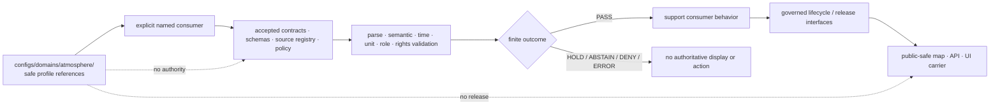

<!-- [KFM_META_BLOCK_V2]
doc_id: kfm://doc/configs-domains-atmosphere-readme
title: configs/domains/atmosphere/ — Governed Atmosphere, Air, Weather, Climate, and Smoke Configuration Boundary
type: readme
version: v0.3
status: draft
owners: OWNER_TBD — Config steward · Atmosphere steward · Air-quality steward · Meteorology/climate steward · Smoke/remote-sensing steward · Station/network steward · Source and rights steward · Temporal/freshness steward · Consumer owner · Validation steward · Policy steward · Hazards liaison · Release steward · Docs steward
created: 2026-07-13
updated: 2026-07-14
policy_label: "public; config-sublane; atmosphere; air-quality; weather; climate; smoke; aod; forecast; advisory-context; source-role-aware; knowledge-character-aware; time-aware; unit-aware; stale-state-aware; non-alert; no-life-safety-authority; non-secret; non-authoritative; no-live-binding; no-model-as-observation; no-aqi-as-concentration; no-aod-as-pm25; no-release-authority"
current_path: configs/domains/atmosphere/README.md
truth_posture: CONFIRMED canonical Atmosphere config lane, parent configuration contract, repository-present Atmosphere doctrine and implementation-shaped surfaces, README-only bounded config inventory, air-versus-atmosphere slug and pipeline-lane conflict, CamelCase-versus-slug/snake-case object-path compatibility, domain-first-versus-subtype-first source-registry topology, placeholder/scaffold state of inspected package metadata and code, pipeline entrypoints, pipeline specs, policy files, schemas, validators, source records, UI files, published-layer documentation, workflow, and schema-home ADR, and prior README lineage / PROPOSED future consumer-bound templates and accepted profile references / CONFLICTED air versus atmosphere, CamelCase versus hyphen/snake-case object paths, contract/schema compatibility pointers, source-registry topology, and pipeline-lane placement / UNKNOWN direct consumers, loader behavior, precedence, deployment binding, exhaustive recursive inventory, runtime behavior, alerting behavior, and publication use / NEEDS VERIFICATION accepted owners, source roles and rights, station identity and siting, units and methods, temporal semantics and freshness budgets, low-cost sensor corrections, model/forecast profiles, smoke and AOD interpretation, climate baselines, executable config validation, policy-runtime binding, scanners, CI enforcement, correction propagation, and rollback/invalidation integration
evidence_snapshot:
  repository: bartytime4life/Kansas-Frontier-Matrix
  repository_id: "1059091169"
  visibility: public
  base_ref: main
  base_commit: 65a0d9f6159efa03aba0711d38a51eb203079c3f
  prior_blob: 46864d086e790ee4e64e909f02acfab633ca5a62
  bounded_path_search: configs/domains/atmosphere/README.md only
related:
  - ../README.md
  - ../../README.md
  - ../../../docs/domains/atmosphere/README.md
  - ../../../docs/domains/atmosphere/ARCHITECTURE.md
  - ../../../docs/domains/atmosphere/CANONICAL_PATHS.md
  - ../../../docs/domains/atmosphere/DATA_LIFECYCLE.md
  - ../../../docs/domains/atmosphere/API_CONTRACTS.md
  - ../../../docs/domains/atmosphere/OBJECT_FAMILY_MAP.md
  - ../../../docs/domains/atmosphere/KNOWLEDGE_CHARACTER_REGISTRY.md
  - ../../../docs/domains/atmosphere/SOURCE_REGISTRY.md
  - ../../../docs/domains/atmosphere/SENSITIVITY.md
  - ../../../docs/domains/atmosphere/PUBLICATION_POSTURE.md
  - ../../../docs/registers/DOMAIN_LANE.md
  - ../../../docs/registers/DRIFT_REGISTER.md
  - ../../../docs/doctrine/directory-rules.md
  - ../../../docs/security/SECRETS.md
  - ../../../contracts/domains/atmosphere/
  - ../../../schemas/contracts/v1/domains/atmosphere/
  - ../../../policy/domains/atmosphere/
  - ../../../data/registry/sources/atmosphere/
  - ../../../data/registry/atmosphere/sources/
  - ../../../packages/domains/atmosphere/
  - ../../../pipelines/domains/atmosphere/
  - ../../../pipelines/domains/air/
  - ../../../pipeline_specs/atmosphere/
  - ../../../tools/validators/domains/atmosphere/
  - ../../../tests/domains/atmosphere/
  - ../../../fixtures/domains/atmosphere/
  - ../../../apps/explorer-web/src/features/domains/atmosphere/
  - ../../../data/raw/atmosphere/
  - ../../../data/work/atmosphere/
  - ../../../data/quarantine/atmosphere/
  - ../../../data/processed/atmosphere/
  - ../../../data/catalog/domain/atmosphere/
  - ../../../data/triplets/atmosphere/
  - ../../../data/published/layers/atmosphere/
  - ../../../data/receipts/atmosphere/
  - ../../../data/proofs/atmosphere/
  - ../../../release/candidates/atmosphere/
  - ../../../release/manifests/atmosphere/
  - ../../../docs/adr/ADR-XXXX-atmosphere-schema-home.md
  - ../../../.github/workflows/domain-atmosphere.yml
tags: [kfm, configs, atmosphere, air, air-quality, weather, meteorology, climate, smoke, aod, aqi, pm25, ozone, forecast, advisory, station, source-role, knowledge-character, time, freshness, units, no-alert, no-secrets, governance]
notes:
  - "The bounded repository search for configs/domains/atmosphere returned this README only. No executable Atmosphere configuration payload or indexed direct consumer was found."
  - "The prior v0.2 README already carried strong non-alert, source-role, temporal, stale-state, AQI/concentration, AOD/PM2.5, model/observation, validation, correction, and rollback controls. v0.3 preserves them and adds current repository evidence, implementation maturity, object/path conflicts, station/measurement/model semantics, derived-cache invalidation, and stricter first-payload gates."
  - "The repository contains many Atmosphere implementation-shaped files, but inspected package code, pipeline entrypoints, declarative specs, policy files, schemas, validators, source records, UI files, workflow jobs, and schema-home ADR remain version-0.0.0, placeholder, empty-stage, PROPOSED, empty-permissive, unimplemented, TBD, TODO-only, or otherwise not proof of production behavior."
  - "Repository evidence preserves air versus atmosphere slug and pipeline conflicts, CamelCase versus hyphen/snake-case contract/schema paths, and subtype-first versus domain-first source-registry paths. This lane does not resolve, alias, or duplicate those conflicts."
  - "Published-layer README lanes document downstream carrier expectations but do not prove emitted layers, release manifests, EvidenceBundle closure, policy approval, or governed runtime use."
  - "Only this Markdown file changes."
[/KFM_META_BLOCK_V2] -->

<a id="top"></a>

# Governed Atmosphere Domain Configuration

`configs/domains/atmosphere/`

> Safe-to-commit configuration documentation and future consumer-bound templates for air-quality observations, weather and station observations, smoke and aerosol context, AOD, climate normals and anomalies, atmospheric model and forecast context, advisory referral context, and public-safe Atmosphere derivatives. This lane is not observation truth, regulatory authority, emergency alerting, health advice, source admission, evidence, policy, or release authority.


**Quick links:** [Purpose](#purpose) · [Authority](#authority-level) · [Status](#status) · [Belongs](#what-belongs-here) · [Exclusions](#what-does-not-belong-here) · [Inputs](#inputs) · [Outputs](#outputs) · [Validation](#validation) · [Review](#review-burden) · [Related](#related-folders) · [ADRs](#adrs-and-drift-triggers) · [Last reviewed](#last-reviewed) · [Scope](#scope-and-bounded-context) · [Classes](#configuration-classes) · [Contract](#minimum-configuration-contract) · [Binding](#consumer-binding-precedence-and-discovery) · [Objects](#atmosphere-object-family-boundaries) · [Roles](#source-role-and-knowledge-character) · [Stations](#station-network-and-sensor-identity) · [Measurements](#measurements-units-methods-averaging-and-quality) · [Time](#time-forecast-cycle-freshness-and-stale-state) · [Space](#spatial-support-resolution-height-and-generalization) · [AQI](#aqi-concentration-aod-pm25-and-smoke-boundaries) · [Models](#models-forecasts-ensembles-and-climate-products) · [Advisories](#advisory-alert-health-and-life-safety-boundary) · [Joins](#cross-domain-context-and-anti-authority) · [Rights](#source-rights-attribution-quotas-and-outages) · [Logging](#logging-telemetry-caches-and-derived-indexes) · [Failure](#failure-behavior) · [AI](#governed-ai-and-generated-language) · [Migration](#migration-and-anti-bypass-posture) · [Rollback](#rollback-correction-supersession-and-invalidation) · [Done](#definition-of-done-for-the-first-payload)

> [!IMPORTANT]
> **Document lifecycle:** draft `v0.3`  
> **Observed lane maturity:** README-only in the bounded config-path search; no executable Atmosphere configuration payload or direct consumer binding is established  
> **Authority:** implementation-supporting configuration sublane; non-authoritative for observation/model/advisory meaning, source admission, station identity, freshness, evidence, policy, emergency direction, or release  
> **Runtime posture:** no loader, precedence rule, network fetch, source activation, station ingest, forecast run, model execution, advisory issuance, alerting, public layer, release, or publication is established by this README

> [!CAUTION]
> KFM Atmosphere is not an emergency alert, clinical, public-health, occupational-safety, aviation-safety, fire-behavior, or life-safety system. A configuration value cannot turn AQI into concentration, AOD or smoke context into surface PM2.5, a forecast or model field into an observation, a normal into current weather, a stale source into current truth, or advisory context into official instruction. Missing source role, knowledge character, time, units, method, quality, rights, evidence, policy, official-source redirect, review, release, or rollback support fails closed.

---

## Purpose

This directory defines the safe-to-commit configuration boundary for the canonical `atmosphere` domain segment under `configs/domains/`.

It may eventually hold small defaults, templates, examples, profile references, or review-oriented settings for a **named and verified consumer**. Those files may describe how that consumer should parse, validate, compare, label, caveat, generalize, render, cache, or package already-governed Atmosphere material, but they cannot decide:

- whether an air-quality, weather, smoke, AOD, climate, model, forecast, station, or advisory record is true;
- whether a value is observed, regulatory, modeled, forecast, climatological, advisory, aggregate, inferred, corrected, provisional, or final;
- whether an AQI value is a pollutant concentration;
- whether an AOD value, smoke mask, plume polygon, or model field is a surface PM2.5 measurement;
- whether a low-cost sensor is calibrated, corrected, comparable to a regulatory monitor, or appropriate for a requested use;
- whether two station identifiers, networks, sites, relocations, instruments, or sensor channels refer to the same real-world station history;
- whether a timestamp means observation time, issue time, model initialization, valid time, retrieval time, processing time, publication time, or stale-after time;
- whether a forecast cycle, lead time, ensemble member, run, analysis, nowcast, hindcast, normal, or anomaly is current or fit for use;
- whether a source is admitted, active, rights-cleared, current, redistributable, or authoritative for a requested claim;
- whether a station point, raster cell, model grid, plume polygon, county aggregate, vertical level, or generalized layer is the right spatial support;
- whether smoke, heat, air quality, weather, or advisory context implies hazard impact, diagnosis, exposure, evacuation, or protective action;
- whether evidence supports a claim;
- whether an artifact may be promoted, released, rendered, indexed, exported, summarized, or published.

This README is intended for configuration maintainers, Atmosphere stewards, air-quality and meteorology reviewers, climate and model reviewers, station/network stewards, smoke/remote-sensing reviewers, source and rights stewards, temporal/freshness reviewers, consumer owners, validation owners, policy and release reviewers, Hazards liaisons, security reviewers, and contributors checking Directory Rules placement.

[Back to top](#top)

---

## Authority level

**Configuration-supporting and non-authoritative.**

| Concern | Authority in this lane |
|---|---|
| Atmosphere domain meaning | **None.** Human doctrine remains under `docs/domains/atmosphere/`; semantic meaning remains in accepted contract homes. |
| Source identity and activation | **None.** Config may reference reviewed source IDs or profiles; it cannot admit, activate, suspend, retire, or supersede a source. |
| Source role and knowledge character | **None.** Config cannot relabel observed, regulatory, modeled, forecast, climatological, advisory, aggregate, contextual, synthetic, candidate, or restricted material. |
| Station/network identity | **None.** Config cannot merge station identifiers, infer relocations, or equate instruments, channels, operators, or networks. |
| Measurement meaning | **None.** Config cannot define pollutant semantics, units, averaging periods, methods, quality flags, detection limits, calibration, or regulatory status. |
| AQI, AOD, smoke, and PM2.5 interpretation | **None.** Config cannot convert indexes, remote-sensing products, masks, plumes, or model context into concentration observations. |
| Model, forecast, and climate interpretation | **None.** Config may select an accepted profile; it cannot create forecast truth, climate baselines, model authority, or fitness-for-use. |
| Freshness and stale-state policy | **None.** Config may select an accepted product-specific profile; it cannot make stale data current or suppress outage/correction state. |
| Advisory and alert authority | **None.** Official issuing authorities and the Hazards lane govern emergency and life-safety direction. |
| Evidence and claim truth | **None.** Config cannot create an `EvidenceBundle`, close proof, validate a claim, or convert a candidate into truth. |
| Policy and review | **None.** Config cannot substitute for accepted executable policy, a `PolicyDecision`, source review, or release review. |
| Release and publication | **None.** Config cannot authorize lifecycle promotion, public map/API/UI use, export, Focus Mode, AI response, or publication. |
| Consumer behavior | **Supporting only.** A verified consumer may read a validated file through explicit binding and deterministic precedence. |

A configuration value may point to authority. It cannot acquire that authority through naming, file placement, parsing, repetition, successful validation, a passing scaffold workflow, or use by a UI.

[Back to top](#top)

---

## Status

### Repository snapshot

| Field | Value |
|---|---|
| Repository | `bartytime4life/Kansas-Frontier-Matrix` |
| Repository ID | `1059091169` |
| Visibility | public |
| Base ref | `main` |
| Base commit | `65a0d9f6159efa03aba0711d38a51eb203079c3f` |
| Prior target blob | `46864d086e790ee4e64e909f02acfab633ca5a62` |
| Current task scope | `configs/domains/atmosphere/README.md` only |

### Truth labels for this lane

| Label | Current use |
|---|---|
| **CONFIRMED** | Target README; parent config contract; Atmosphere doctrine; bounded README-only config result; inspected repository paths and exact file contents; one-file change scope after verification. |
| **PROPOSED** | Future consumer-bound payloads, profile references, validation contract, safe defaults, and first-payload implementation plan. |
| **CONFLICTED** | `air` versus `atmosphere`; `pipelines/domains/air/` versus `pipelines/domains/atmosphere/`; CamelCase versus hyphen/snake-case object paths; domain-first versus subtype-first source registry. |
| **NEEDS VERIFICATION** | Accepted owners, source roles/rights, station identity rules, measurement profiles, product-specific freshness, low-cost corrections, model profiles, meaningful schemas, executable validation, policy runtime, CI, release integration, and correction/rollback propagation. |
| **UNKNOWN** | Direct config consumers, discovery, precedence, fallback, deployment binding, runtime behavior, alerting behavior, and publication use. |

### Current config-lane inventory

A bounded repository search for `configs/domains/atmosphere` returned:

```text
configs/domains/atmosphere/
└── README.md
```

This is a bounded indexed-search result, not proof that no unindexed or generated file could exist elsewhere.

### Surrounding repository maturity

| Surface | Current evidence | Safe conclusion |
|---|---|---|
| Domain documentation | Rich draft README and companion documents exist. | Doctrine and design are documented; implementation maturity must be checked separately. |
| Semantic contracts | Expanded contract README and object contracts exist. | Meaning surfaces exist; naming/casing and compatibility drift remain. |
| Contract compatibility | `AirStation.md` plus lowercase `air-station.md` pointer exist. | Do not create parallel object authority through config. |
| Schemas | Opened `AirStation`, `air_station`, `PM25Observation`, and `climate-anomaly` schemas have empty `properties` and `additionalProperties: true`. | They are `PROPOSED` scaffolds, not meaningful enforcement. |
| Package | `pyproject.toml` is version `0.0.0`; opened source is a placeholder comment. | Package implementation is greenfield. |
| Atmosphere pipeline | Opened ingest, normalize, validate, publish, and triplets entrypoints are placeholder comments. | No executable transformation is proven. |
| `air` pipeline alias lane | `pipelines/domains/air/README.md` exists and labels the path alias-candidate / `NEEDS VERIFICATION`. | Slug conflict is active; config cannot resolve it. |
| Pipeline specs | Opened ingest, normalize, validate, and publish specs use `stages: []`. | Declarative wiring is not implemented. |
| Policy | Opened AOD, model, freshness, advisory, and dry-run files are `PROPOSED` scaffolds with `default allow := false`. | Fail-closed intent exists; complete rules, tests, and runtime binding are not proven. |
| Validators | Opened schema validator raises `NotImplementedError`; other opened validators contain only placeholder docstrings. | Executable validation is not established. |
| Source registries | Both `data/registry/atmosphere/sources/` and `data/registry/sources/atmosphere/` exist. Opened records are empty/TBD/`PROPOSED`. | Registry topology and source admission are unresolved. |
| Published layer lane | A detailed draft README indexes child layer lanes. | Carrier documentation exists; emitted layers, manifests, proofs, and runtime use remain unverified. |
| Explorer UI | Opened Evidence Drawer file exports a placeholder. | UI implementation and privacy/caveat enforcement are unverified. |
| Domain workflow | Pull-request workflow runs TODO echo jobs. | Workflow presence is not substantive validation. |
| Schema-home ADR | `ADR-XXXX-atmosphere-schema-home.md` is a `PROPOSED` scaffold. | It is an open decision handle, not accepted authority. |
| Direct config consumer | None found in the bounded search. | Do not claim loading, activation, or runtime use. |

### Critical scaffold rule

> [!WARNING]
> No future configuration may activate, select, or rely on a `PROPOSED` policy, empty-permissive schema, placeholder validator, zero-stage pipeline spec, placeholder source descriptor, TODO workflow, or draft published-lane README as if it were accepted safety enforcement or release proof.

[Back to top](#top)

---

## What belongs here

Only safe, bounded, non-secret Atmosphere configuration support for a **named consumer** belongs here.

| Material | Permitted purpose | Minimum posture |
|---|---|---|
| `README.md` | Define this configuration boundary. | Preserve source-role, time, units, freshness, public-safety, evidence, policy, and release controls. |
| `*.template.yaml` or `*.template.yml` | Placeholder-based template for a verified consumer. | Parseable, versioned, consumer-bound, no secrets, no live endpoints or source activation. |
| `*.example.yaml`, `*.example.json`, or `*.example.toml` | Tiny synthetic example. | Fictional stations, times, values, model runs, advisories, and geometry only. |
| Profile references | Select an accepted source-role, station, measurement, freshness, caveat, model, generalization, or display profile. | Reference by stable ID/version; do not copy or weaken authority rules. |
| Conservative defaults | Select abstain, hold, stale, unavailable, caveat, official-redirect, or deny behavior. | Must not bypass evidence, policy, rights, review, or release. |
| Test-only values | Support deterministic no-network tests for a named consumer. | Synthetic, clearly non-operational, isolated from production discovery. |
| Migration notes | Document a real key/path/profile transition. | Time-bounded, owner-linked, reversible, and not a parallel authority. |

### Child-lane creation criteria

Do not add a child configuration file merely because a conceptual profile can be imagined. A file is justified only when all of these are identified:

1. exact consumer;
2. owning component and reviewer;
3. bounded behavior;
4. accepted format and version;
5. accepted authority references;
6. deterministic binding and precedence;
7. safe failure behavior;
8. synthetic fixtures and executable validation;
9. correction, deactivation, and rollback;
10. proof that the file does not create source, policy, alert, evidence, release, or publication authority.

[Back to top](#top)

---

## What does not belong here

The following material is forbidden in this lane:

- real air-quality, weather, climate, smoke, AOD, satellite, station, model, forecast, advisory, or alert payloads;
- credentials, tokens, API keys, cookies, connection strings, private endpoints, workstation paths, internal network topology, or deployment secrets;
- source descriptors, activation decisions, endpoint inventories, rate-limit secrets, or live connector settings;
- real station coordinates, private-land/access details, infrastructure-sensitive siting, instrument-security details, or non-public network metadata;
- settings that convert AQI to pollutant concentration or imply they are interchangeable;
- settings that convert AOD, smoke masks, plume polygons, fire detections, or model fields to observed surface PM2.5;
- settings that present models, forecasts, analyses, reanalyses, nowcasts, hindcasts, normals, or anomalies as direct observations;
- settings that remove low-cost sensor correction, calibration, confidence, quality, caveat, or limitation requirements;
- settings that silently merge station IDs, networks, instruments, sensor channels, station relocations, or time series;
- settings that hide units, averaging period, vertical level, detection limit, method, QA flag, uncertainty, provisional/final status, or source role;
- settings that make stale, delayed, partial, superseded, corrected, unavailable, or outage-affected data appear current;
- emergency or life-safety instructions, clinical/health recommendations, evacuation guidance, aviation decisions, occupational exposure decisions, or alert authority;
- hidden bypasses for official-source redirection, Hazards handoff, caveat display, evidence resolution, policy, review, release, correction, or rollback;
- schemas, semantic contracts, policy bundles, registries, receipts, proofs, catalogs, triplets, release objects, or publication decisions;
- alternate `air` or `atmosphere` config authorities created to bypass the unresolved slug conflict;
- duplicate CamelCase, hyphenated, or snake-case profile authorities created to bypass object-path compatibility decisions;
- automatic discovery or activation based only on directory presence or filename convention.

[Back to top](#top)

---

## Inputs

A future Atmosphere configuration payload requires all of the following:

1. **Named consumer** — exact package, pipeline, app, service, worker, test harness, or tool.
2. **Bounded purpose** — one behavior, not a hidden domain policy bundle.
3. **Declared format and version** — parser, encoding, compatibility expectations, and schema version where accepted.
4. **Explicit binding** — exact load point, no assumed recursive discovery.
5. **Deterministic precedence** — relation to defaults, environment, deployment, command-line, local, and test overrides.
6. **Accepted authority references** — contract, schema, source registry, policy, knowledge-character, station, measurement, time, release, and review profiles as applicable.
7. **Source-role preservation** — observed, regulatory, modeled, forecast, climatological, advisory, aggregate, contextual, candidate, synthetic, and restricted roles remain distinguishable.
8. **Knowledge-character preservation** — sensor observation, public AQI report, network/site context, remote-sensing mask, model field, smoke context, climate baseline/anomaly, and advisory context remain distinct.
9. **Station identity context** — network, station ID, sensor/channel, operator, relocation, instrument, method, coordinate precision, and effective-time rules.
10. **Measurement context** — parameter, units, averaging period, method, QA, uncertainty, detection/quantitation limits, regulatory status, correction state, and provisional/final state where applicable.
11. **Temporal context** — observation, issue, initialization, valid, lead, retrieval, ingestion, processing, expiry, supersession, and correction time.
12. **Spatial context** — point, raster, polygon, grid, aggregate, CRS, resolution, vertical level, height reference, and generalization profile.
13. **Rights and operational context** — terms, attribution, redistribution, quotas, outage handling, and official-source redirect.
14. **Safe values** — synthetic placeholders or non-sensitive defaults only.
15. **Validation path** — parse, shape, semantic, temporal, unit, source-role, station, rights, no-network, negative, and rollback tests.
16. **Failure posture** — finite reject, hold, abstain, stale, unavailable, deny, or error behavior.
17. **Correction and rollback** — prior known-good state, cache/index invalidation, deactivation, correction, supersession, withdrawal, and revert path.

A payload missing any required input remains **PROPOSED and inactive**.

[Back to top](#top)

---

## Outputs

This lane currently outputs documentation only.

A future validated configuration file may support a named consumer by selecting safe, already-governed behavior. It may select:

- a source-role or knowledge-character profile;
- a station/network identity profile;
- a measurement/unit/method profile;
- a product-specific time and freshness profile;
- a model/forecast/climate profile;
- a caveat and official-source redirect profile;
- a spatial-support/generalization profile;
- a stale, outage, correction, or unavailable-state profile;
- a review route or conservative finite outcome;
- a cache/index invalidation profile.

It may not:

- admit or activate a source;
- create a station identity or merge station histories;
- define pollutant, AQI, AOD, smoke, model, forecast, climate, or advisory truth;
- issue, suppress, replace, or reinterpret an official alert or advisory;
- create evidence or establish claim truth;
- write lifecycle data as hidden side effect;
- promote an object through the trust membrane;
- create a receipt, proof, catalog record, release object, or publication state;
- expose a public map/API/UI layer merely because a profile exists.

[Back to top](#top)

---

## Validation

### Documentation validation for this revision

The README revision must satisfy:

- exactly one H1;
- required Directory Rules folder-contract headings present and ordered;
- no duplicate H2 headings;
- internal quick-link anchors resolve;
- fenced code blocks are balanced;
- final newline exists;
- no credentials, token-like values, private keys, private endpoints, or live bindings;
- no real station, source payload, advisory, health instruction, or deployment setting;
- current implementation maturity is not overstated;
- `air`/`atmosphere`, object naming, and registry conflicts remain visible;
- no new source, schema, contract, policy, alert, evidence, release, or publication authority is created.

### Validation matrix for a future payload

| Gate | Required check | Fail-safe result |
|---|---|---|
| Parse | File is deterministic and accepted by the named parser. | `CONFIG_PARSE_ERROR` |
| Version | Format/profile version is supported and migration is explicit. | `CONFIG_VERSION_UNSUPPORTED` |
| Consumer | Declared consumer and binding exist. | `CONFIG_CONSUMER_UNBOUND` |
| Precedence | Load and override order is deterministic. | `CONFIG_PRECEDENCE_UNRESOLVED` |
| Unknown keys | Unknown and duplicate keys are rejected or explicitly handled. | `CONFIG_UNKNOWN_KEY` |
| Authority refs | Referenced contract/schema/policy/source/profile IDs resolve and are accepted. | `CONFIG_AUTHORITY_REF_INVALID` |
| Scaffold rejection | Referenced schema/policy/validator/source/release surface is not merely a scaffold. | `CONFIG_SCAFFOLD_DEPENDENCY` |
| Source role | Role and knowledge character remain distinct. | `SOURCE_ROLE_COLLAPSE` |
| Station identity | Station/network/instrument/channel/relocation rules are complete. | `STATION_IDENTITY_UNRESOLVED` |
| Parameter | Parameter identity and pollutant/metric family are explicit. | `PARAMETER_UNRESOLVED` |
| Units | Canonical units and conversion provenance are explicit. | `UNIT_OR_CONVERSION_INVALID` |
| Averaging | Averaging/accumulation period is explicit. | `AVERAGING_PERIOD_MISSING` |
| Method and QA | Method, correction, calibration, QA, uncertainty, and flags are preserved. | `METHOD_OR_QA_UNRESOLVED` |
| Time | Observation/issue/init/valid/lead/retrieval/ingest/expiry semantics are complete. | `TIME_SEMANTICS_INVALID` |
| Freshness | Product-specific stale/outage rules are deterministic. | `FRESHNESS_PROFILE_MISSING` |
| Spatial support | Point/grid/polygon/aggregate support, CRS, resolution, and vertical level are explicit. | `SPATIAL_SUPPORT_INVALID` |
| AQI | AQI is not consumed as concentration. | `AQI_CONCENTRATION_COLLAPSE` |
| AOD/smoke | AOD/smoke/model context is not consumed as observed PM2.5. | `AOD_PM25_COLLAPSE` |
| Model/forecast | Model and forecast fields remain non-observational. | `MODEL_OBSERVATION_COLLAPSE` |
| Climate | Normals/anomalies carry baseline and reference period. | `CLIMATE_BASELINE_MISSING` |
| Advisory | Official issuer, issue/expiry, redirect, and no-alert boundary are preserved. | `OFFICIAL_REDIRECT_MISSING` |
| Rights | Terms, attribution, redistribution, quota, and access posture resolve. | `RIGHTS_OR_TERMS_UNRESOLVED` |
| Secrets | No credentials, private endpoints, or local paths. | `SECRET_OR_LIVE_BINDING_FOUND` |
| Fixtures | Valid/invalid/stale/outage/corrected/denied examples are synthetic and no-network. | `FIXTURE_COVERAGE_INCOMPLETE` |
| Logging | Logs and metrics omit sensitive values and false alert-like wording. | `OBSERVABILITY_UNSAFE` |
| Release | Public-bound behavior has evidence, policy, review, release, correction, and rollback refs. | `RELEASE_SUPPORT_MISSING` |
| Invalidation | Superseded/corrected/outage state invalidates caches, indexes, maps, exports, and AI. | `INVALIDATION_INCOMPLETE` |
| Rollback | Prior known-good behavior can be restored and revalidated. | `ROLLBACK_UNVERIFIED` |

### Finite configuration review outcomes

Use finite review outcomes:

- `PASS` — all applicable gates pass.
- `PASS_WITH_OBLIGATIONS` — accepted only with explicit caveat, stale, redirect, generalization, audience, or review obligations.
- `HOLD` — checkable support is incomplete.
- `ABSTAIN` — available context cannot support a safe interpretation.
- `DENY` — requested behavior is prohibited.
- `ERROR` — parsing, validation, dependency, or execution failed safely.

A passing parser is not proof of source admission, measurement validity, forecast skill, public safety, policy approval, release readiness, or current truth.

[Back to top](#top)

---

## Review burden

README-only changes require:

- configuration/documentation review;
- Atmosphere domain review;
- source-role/knowledge-character review where terminology changes;
- public-safety/Hazards review where advisory or alert language changes.

A future payload also requires, as applicable:

- named consumer owner;
- air-quality or meteorology/climate steward;
- station/network and sensor-method reviewer;
- temporal/freshness reviewer;
- source, rights, attribution, quota, and operational reviewer;
- smoke/AOD/remote-sensing or model reviewer;
- schema and contract reviewer;
- validator, fixture, and test reviewer;
- security and observability reviewer;
- policy and Hazards liaison;
- release, correction, and rollback reviewer;
- ADR or migration reviewer for `air`/`atmosphere`, object naming, registry topology, or profile authority.

### Separation of duties

No single config author should both:

- define or select a risk-significant profile;
- approve its source/right/measurement semantics;
- approve policy behavior;
- approve release;
- certify rollback.

Configuration review cannot substitute for source admission, scientific/method review, policy evaluation, official advisory authority, evidence closure, or release review.

[Back to top](#top)

---

## Related folders

| Concern | Responsibility home | Relationship to this lane |
|---|---|---|
| Parent domain config contract | [`../README.md`](../README.md) | Governs non-secret, non-authoritative, consumer-bound domain configuration. |
| Repository config root | [`../../README.md`](../../README.md) | Governs safe configuration defaults/templates. |
| Atmosphere doctrine | [`../../../docs/domains/atmosphere/README.md`](../../../docs/domains/atmosphere/README.md) | Human domain scope and invariants. |
| Canonical-path discussion | `../../../docs/domains/atmosphere/CANONICAL_PATHS.md` | Records `air`/`atmosphere` drift and responsibility-root placement. |
| Semantic contracts | `../../../contracts/domains/atmosphere/` | Object meaning; not config authority. |
| Machine schemas | `../../../schemas/contracts/v1/domains/atmosphere/` | Shape authority after acceptance; opened files remain scaffolds. |
| Domain policy | `../../../policy/domains/atmosphere/` | Admissibility and release rules; opened files remain scaffolds. |
| Source registry, subtype-first | `../../../data/registry/sources/atmosphere/` | Candidate source descriptor home; topology conflicted. |
| Source registry, domain-first | `../../../data/registry/atmosphere/sources/` | Existing competing registry lane; topology conflicted. |
| Shared package | `../../../packages/domains/atmosphere/` | Reusable Atmosphere helper code; current opened implementation is greenfield. |
| Atmosphere pipeline | `../../../pipelines/domains/atmosphere/` | Intended executable processing; opened entrypoints are placeholders. |
| `air` pipeline lane | `../../../pipelines/domains/air/` | Alias/transitional candidate; slug conflict unresolved. |
| Pipeline specs | `../../../pipeline_specs/atmosphere/` | Declarative specs; opened files have empty stage lists. |
| Validators | `../../../tools/validators/domains/atmosphere/` | Intended checks; opened entrypoints are placeholders/unimplemented. |
| Fixtures and tests | `../../../fixtures/domains/atmosphere/`, `../../../tests/domains/atmosphere/` | Enforcement proof; coverage remains `NEEDS VERIFICATION`. |
| Published layer carriers | `../../../data/published/layers/atmosphere/` | Draft carrier-lane docs; not release proof. |
| Governed public path | governed API and approved released-artifact interfaces | Public consumers must not read internal lifecycle stores directly. |
| Hazards | applicable Hazards docs/policy/runtime lanes | Owns emergency/life-safety interpretation and official-alert handoff. |
| Drift register | `../../../docs/registers/DRIFT_REGISTER.md` | Records unresolved path/authority drift. |
| Secret handling | [`../../../docs/security/SECRETS.md`](../../../docs/security/SECRETS.md) | Prohibits committed secrets and live bindings. |

[Back to top](#top)

---

## ADRs and drift triggers

No ADR is enacted by this README.

A separate accepted governance decision, migration note, or ADR is required before:

- resolving `air` versus `atmosphere`;
- choosing between `pipelines/domains/air/` and `pipelines/domains/atmosphere/`;
- changing contract/schema path authority;
- deciding CamelCase, hyphenated, or snake-case canonical object filenames and compatibility behavior;
- choosing domain-first versus subtype-first source-registry topology;
- defining universal config discovery, precedence, override, or fallback;
- defining canonical source-role or knowledge-character vocabularies;
- establishing public station-coordinate precision;
- establishing low-cost sensor correction or comparability profiles;
- establishing product-specific freshness/stale thresholds;
- establishing AQI, AOD, smoke, forecast, climate, or advisory interpretation profiles;
- allowing a scaffold policy/schema/validator/source record to become active;
- creating alert, emergency, health, aviation, occupational, or life-safety authority;
- creating a new schema, contract, policy, registry, evidence, release, or publication authority.

### Drift that must remain visible

| Drift | Current status | Config posture |
|---|---|---|
| `air` vs `atmosphere` domain slug | `CONFLICTED` | Use current `atmosphere` config lane; do not create alternate authority. |
| Atmosphere pipeline vs `air` pipeline lane | `CONFLICTED` | No automatic aliasing or dual-loading. |
| `AirStation.md` vs `air-station.md` | Canonical contract plus compatibility pointer | Reference accepted canonical identity; do not duplicate semantics. |
| `AirStation.schema.json` vs `air_station.schema.json` | Mixed casing/naming scaffolds | Do not select one as active without migration/ADR evidence. |
| CamelCase vs hyphen/snake-case object files | `NEEDS VERIFICATION` | Preserve exact accepted IDs and versions; reject ambiguous refs. |
| `data/registry/sources/atmosphere/` vs `data/registry/atmosphere/sources/` | `CONFLICTED` | No duplicate source activation or mirrored authority. |
| Published-path README vs actual release | Documentation present; release proof unverified | Never infer publication from directory name. |

[Back to top](#top)

---

## Last reviewed

**2026-07-14**, against `main@65a0d9f6159efa03aba0711d38a51eb203079c3f`.

Review again before:

- the first non-README payload;
- a direct consumer or loader binding;
- a change to `air`/`atmosphere` compatibility;
- a source-role or knowledge-character profile;
- a station, measurement, freshness, model, climate, smoke, AOD, AQI, advisory, or official-redirect profile;
- a policy/schema/validator/source scaffold promotion;
- public map/API/UI, export, alert-like, AI, release, or deployment use.

[Back to top](#top)

---

## Scope and bounded context

The Atmosphere configuration bounded context supports configuration for these **already-governed** object and product families:

- air-quality station and observation context;
- PM2.5 and ozone observation/report context;
- AQI report context;
- smoke and plume context;
- AOD and remote-sensing context;
- weather station and observation context;
- wind, precipitation, and temperature context;
- climate normal and anomaly context;
- atmospheric model and forecast context;
- advisory referral context;
- public-safe, caveat-aware released derivatives.

The lane owns no scientific observation, model run, station record, source record, alert, policy decision, evidence object, or released artifact.

### Configuration boundary diagram



### Anti-collapse summary

```text
config profile           != source admission
station ID               != station identity proof
station point            != observation
AQI                      != pollutant concentration
AOD                      != PM2.5
smoke context            != exposure or health diagnosis
model field              != observation
forecast                 != current observed state
climate normal           != current weather
climate anomaly          != absolute measurement
advisory context         != official alert or instruction
successful parse         != scientific validity
workflow success         != release approval
published-path README    != released artifact
generated language       != EvidenceBundle
```

[Back to top](#top)

---

## Configuration classes

| Class | Example purpose | Activation posture |
|---|---|---|
| Documentation | Boundary, evidence ledger, migration note. | Inert. |
| Template | Placeholder structure for a named consumer. | Inert until instantiated and reviewed. |
| Example | Synthetic station/model/advisory values. | Test/documentation only; never production-discovered. |
| Source-role profile reference | Select accepted source-role/knowledge-character behavior. | Requires accepted profile and explicit binding. |
| Station identity profile reference | Select station/network identity and relocation handling. | Requires accepted station authority and tests. |
| Measurement profile reference | Select units, method, averaging, QA, and correction behavior. | Requires accepted method profile. |
| Freshness profile reference | Select product-specific stale/outage behavior. | Requires accepted time semantics and correction rules. |
| Model/forecast profile reference | Select run/cycle/lead/member/baseline interpretation. | Requires accepted model contract and validation. |
| Display/caveat profile reference | Select public-safe labels, caveats, redirects, and generalization. | Does not authorize release; requires policy/release support. |
| Test override | Force deterministic stale/outage/invalid behavior in fixtures. | Test environment only; no live source/network. |
| Compatibility mapping | Bridge accepted names during migration. | Time-bounded, versioned, non-recursive, tested, reversible. |

### Prohibited configuration classes

Do not create:

- live source endpoint or secret configuration;
- alert issuance or suppression configuration;
- health/safety decision thresholds presented as KFM authority;
- policy-as-config;
- source admission as config;
- evidence truth as config;
- automatic release as config;
- dual `air`/`atmosphere` authority maps;
- permissive fallback that bypasses stale, rights, evidence, policy, or release gates.

[Back to top](#top)

---

## Minimum configuration contract

Every future non-README file must document, in the file or an adjacent accepted specification:

| Field | Required meaning |
|---|---|
| `config_id` | Stable deterministic identifier. |
| `config_version` | Semver or accepted repository version. |
| `status` | `PROPOSED`, `TEST_ONLY`, `ACTIVE`, `DEPRECATED`, or other accepted finite value. |
| `consumer` | Exact component and code path that reads the file. |
| `owner` | Responsible maintainer and review group. |
| `purpose` | One bounded behavior. |
| `format` | Parser-visible file type and encoding. |
| `authority_refs` | Accepted contract, schema, policy, source, profile, and release references. |
| `source_roles` | Allowed roles and anti-collapse behavior. |
| `knowledge_characters` | Allowed knowledge-character labels and transitions. |
| `station_identity_profile` | Network/station/instrument/channel/relocation handling or `N/A`. |
| `measurement_profile` | Parameter, units, averaging, method, QA, correction, uncertainty, and status handling. |
| `time_profile` | Observation/issue/init/valid/lead/retrieval/ingest/expiry/supersession semantics. |
| `freshness_profile` | Product-specific thresholds and stale/outage behavior. |
| `spatial_profile` | Support type, CRS, resolution, vertical level, precision, and generalization. |
| `model_profile` | Model/run/cycle/member/baseline semantics or `N/A`. |
| `advisory_profile` | Official issuer/redirect/expiry/no-alert handling or `N/A`. |
| `rights_profile` | Terms, attribution, redistribution, quota, and access posture. |
| `defaults` | Safe, non-secret, fail-closed defaults. |
| `allowed_overrides` | Explicit sources and keys permitted to override. |
| `precedence` | Deterministic merge/replacement order. |
| `unknown_key_behavior` | Reject, hold, warn, or ignore—never implicit. |
| `missing_file_behavior` | Optional-safe default or required-file failure. |
| `validation` | Parser, semantic, time, unit, role, rights, fixture, and negative checks. |
| `observability` | Safe logs/metrics with no secrets, false alerts, or misleading current-state claims. |
| `correction` | Supersession and invalidation behavior. |
| `rollback` | Prior version, deactivation, restore, and revalidation path. |

### Illustrative template shape

This is a non-operational example:

```yaml
config_id: kfm.config.atmosphere.example
config_version: 0.0.0-example
status: TEST_ONLY
consumer:
  id: example-consumer
  binding: NOT_IMPLEMENTED
authority_refs:
  contract_profile: NOT_SELECTED
  schema_profile: NOT_SELECTED
  policy_profile: NOT_SELECTED
source_roles:
  allowed: [observed, modeled, forecast, climatological, advisory]
  unknown: HOLD
time_profile:
  id: NOT_SELECTED
freshness_profile:
  id: NOT_SELECTED
defaults:
  current_state_when_unknown: ABSTAIN
  alert_authority: false
  official_source_redirect_required: true
network:
  live_fetch: false
```

The example must never be discovered as production configuration.

[Back to top](#top)

---

## Consumer binding, precedence, and discovery

### Explicit binding only

A file is inactive unless the repository proves:

- the exact consumer;
- the exact parser;
- the exact load call or deployment binding;
- accepted schema/semantic validation;
- deterministic precedence;
- tests for missing, malformed, unknown, stale, and conflicting values;
- safe rollback and deactivation.

### No recursive discovery

Consumers must not recursively load every file under `configs/domains/atmosphere/`. Recursive discovery can accidentally activate:

- templates;
- examples;
- migration copies;
- compatibility aliases;
- editor backups;
- deprecated profiles;
- unreviewed `air`/`atmosphere` mappings.

Use an explicit allowlist or manifest owned by the consumer.

### Precedence requirements

A consumer must publish its precedence order. A possible order is **PROPOSED**, not current behavior:

```text
built-in conservative default
  < accepted repository profile
  < deployment-bound non-secret profile
  < explicit test-only override
```

Environment variables, command-line values, secrets, local files, and remote configuration stores must not silently outrank repository policy or release controls.

### Conflict behavior

When two values conflict:

- prefer neither by filename sort;
- do not merge scientific meanings heuristically;
- reject or hold when authority is unclear;
- log only safe identifiers;
- preserve the source of each attempted value;
- require review for `air`/`atmosphere`, casing, registry, station, unit, time, and policy conflicts.

[Back to top](#top)

---

## Atmosphere object-family boundaries

| Object family | Configuration may support | Configuration must not decide |
|---|---|---|
| `AirStation` | Station display/generalization profile; identity-reference profile. | Station identity, exact siting clearance, ownership, access, or operational status. |
| `AirObservation` | Parameter/unit/time/QA/caveat profile selection. | Whether a value is scientifically valid or regulatory. |
| `PM25Observation` | PM2.5 units/averaging/method labels. | AQI equivalence, exposure diagnosis, health advice, or unsupported concentration. |
| `OzoneObservation` | Ozone units/averaging/method labels. | AQI equivalence or regulatory/health determination. |
| `SmokeContext` | Smoke/plume/model context profile. | Surface concentration, exposure, health impact, fire behavior, or hazard truth. |
| `AODRaster` | Remote-sensing resolution, time, and caveat profile. | Surface PM2.5 or observed air quality. |
| `WeatherStation` | Station/network context and safe precision profile. | Operational status, ownership, or observation truth. |
| `WeatherObservation` | Units/method/time/quality profile. | Forecast or model equivalence. |
| `WindField` | Vector units, height/level, time, and model/observed role. | Guaranteed transport, fire behavior, aviation, or hazard outcome. |
| `PrecipitationObservation` | Units, accumulation window, method, and time. | Hydrologic/flood truth or crop impact. |
| `TemperatureObservation` | Units, height, method, and time. | Heat illness, hazard impact, or operational advice. |
| `ClimateNormal` | Baseline/reference-period profile. | Current conditions or future forecast. |
| `ClimateAnomaly` | Baseline-linked anomaly profile. | Absolute observation without baseline/method. |
| `ForecastContext` | Cycle/init/valid/lead/member/model profile. | Observation truth, certainty, alert authority, or guaranteed outcome. |
| `AdvisoryContext` | Official issuer, issue/expiry, redirect, and display caveats. | Official advisory creation, amendment, cancellation, or life-safety instruction. |
| Decision envelope support | Finite outcome/profile mapping. | Evidence proof, policy decision, or release approval. |

### Object-path compatibility

Current repository evidence includes:

- canonical expanded CamelCase contract files such as `AirStation.md`;
- lowercase compatibility pointers such as `air-station.md`;
- CamelCase schema paths such as `AirStation.schema.json`;
- snake-case or hyphenated schema paths such as `air_station.schema.json` and `climate-anomaly.schema.json`.

Configuration must reference exact accepted object/profile IDs, not infer equivalence from normalized filenames.

[Back to top](#top)

---

## Source role and knowledge character

### Required separations

| Category | Meaning boundary |
|---|---|
| Observed sensor | A measurement under a stated instrument/method/time/QA context. |
| Regulatory record | Official or regulatory context under a stated authority and method; not every observation is regulatory. |
| Public AQI report | An index/reporting product; not raw concentration. |
| Low-cost sensor | Observation with correction/calibration/confidence/limitations requirements; not automatically regulatory-comparable. |
| Network/site context | Station/network metadata; not an observation. |
| Remote-sensing mask/raster | A satellite or derived product; not surface concentration. |
| Atmospheric model field | Model output with run/cycle/level/lead/member metadata; not an observation. |
| Forecast context | Future-valid model or official forecast context; not current observed state. |
| Climate baseline | Reference-period normal; not a current measurement. |
| Climate anomaly | Baseline-relative departure; not absolute value without its baseline. |
| Advisory context | Official-source referral context; not KFM-issued instruction. |
| Aggregate/derived product | A transformation whose evidence, method, caveats, and release lineage remain visible. |
| Candidate/synthetic | Provisional or generated material; never mixed with evidence claims. |
| Restricted | Rights-, security-, privacy-, or policy-limited material; deny/hold by default. |

### Role transitions

Configuration must not authorize role upgrades. Any transformation must preserve:

- input role;
- output role;
- transform identity and version;
- method and uncertainty;
- evidence refs;
- validation result;
- review/policy state;
- release state.

### Unknown role

Unknown or conflicting role results in `HOLD` or `ABSTAIN`, not a guessed default.

[Back to top](#top)

---

## Station, network, and sensor identity

A station is not merely a coordinate and a label.

A station identity profile may need to preserve:

- source/network ID;
- station/site ID;
- operator/maintainer;
- instrument and sensor channel;
- parameter;
- method code;
- effective start/end time;
- relocation history;
- instrument replacement history;
- calibration/correction version;
- coordinate precision and siting class;
- elevation and sensor height;
- timezone/reporting convention;
- public precision and access restrictions;
- supersession and alias history.

### Forbidden station inferences

Configuration must not infer that:

- matching coordinates mean identical station identity;
- nearby stations are interchangeable;
- a relocated station is one uninterrupted homogeneous series;
- a station name is globally unique;
- an instrument replacement preserves comparability automatically;
- a low-cost sensor is equivalent to a regulatory monitor;
- station presence means current operation;
- a public station point permits exposure of private access or infrastructure details.

### Station aliases

Aliases require an accepted identity/crosswalk record with effective time and provenance. Config-local alias tables must be test-only or explicitly approved compatibility profiles, never an unreviewed identity authority.

[Back to top](#top)

---

## Measurements, units, methods, averaging, and quality

Every measurement-facing profile must preserve, where applicable:

- parameter identity;
- quantity kind;
- canonical unit;
- source unit;
- conversion method and version;
- averaging or accumulation period;
- sampling method;
- instrument/method code;
- detection and quantitation limits;
- QA/validation flags;
- correction/calibration state;
- uncertainty/confidence;
- below-detection handling;
- missing/invalid/suspect handling;
- provisional/revised/final status;
- regulatory/non-regulatory status;
- vertical height or pressure level;
- source role and knowledge character.

### Examples of non-equivalence

```text
µg/m³ PM2.5 concentration != AQI
ppb ozone                 != ozone AQI
AOD                       != surface PM2.5
instantaneous wind        != hourly mean wind
gust                      != sustained wind
precipitation rate        != accumulation
climate normal            != observation
anomaly                   != absolute measurement
model analysis            != sensor observation
```

### Unit conversion

A configuration profile may select an accepted conversion. It must not invent conversion assumptions or omit temperature/pressure/reference conditions when they matter.

### Low-cost sensors

Low-cost sensor public use requires accepted handling for:

- calibration or correction model;
- training/reference data scope;
- firmware/instrument version;
- humidity/temperature effects where relevant;
- uncertainty and confidence;
- outlier and drift behavior;
- regulatory comparability disclaimer;
- stale or disconnected state;
- correction invalidation after model/version change.

[Back to top](#top)

---

## Time, forecast cycle, freshness, and stale state

Atmosphere data is highly time-sensitive. A single `timestamp` is insufficient.

### Time kinds

Preserve distinct fields when applicable:

- `observation_time`;
- `sample_start_time`;
- `sample_end_time`;
- `issue_time`;
- `model_initialization_time`;
- `forecast_valid_start`;
- `forecast_valid_end`;
- `lead_time`;
- `ensemble_member`;
- `retrieval_time`;
- `ingestion_time`;
- `processing_time`;
- `release_time`;
- `stale_after`;
- `superseded_at`;
- `corrected_at`;
- climatology `baseline_start` and `baseline_end`.

### Product-specific freshness

A single global freshness threshold is unsafe. Profiles must be specific to product family, source, cadence, and use.

Examples requiring distinct handling:

- near-real-time station observations;
- hourly or daily regulatory archives;
- low-cost sensor feeds;
- forecast cycles;
- model analyses;
- smoke-plume products;
- AOD scenes;
- climate normals;
- climate anomalies;
- advisories;
- historical archives.

### Stale-state requirements

When a source becomes stale, delayed, partial, corrected, superseded, or unavailable:

- preserve last known time;
- label stale/unavailable state explicitly;
- do not advance timestamps artificially;
- do not substitute a different role/source silently;
- do not keep an expired advisory looking active;
- do not reuse a prior forecast cycle as current without explicit historical labeling;
- invalidate dependent caches, layers, indexes, exports, and generated summaries as required;
- record recovery and supersession.

### Clock and timezone discipline

Use explicit timezone and UTC normalization where required. Configuration must not interpret naive timestamps without an accepted rule.

[Back to top](#top)

---

## Spatial support, resolution, height, and generalization

Atmosphere values can refer to different spatial supports:

- station point;
- instrument footprint;
- route/mobile observation;
- raster pixel;
- model grid cell;
- smoke/plume polygon;
- county or regional aggregate;
- vertical column;
- pressure level;
- height-above-ground layer;
- generalized public tile.

A profile must preserve:

- CRS;
- support type;
- resolution;
- extent;
- interpolation or aggregation method;
- vertical coordinate/height/pressure level;
- coordinate precision;
- generalization and public-display obligations.

### Spatial anti-collapse

Configuration must not:

- treat a station point as representative of an entire county without accepted method;
- treat a raster pixel as a point measurement;
- treat a model grid as observed local conditions;
- downscale county or regional data to a site;
- infer surface conditions from column AOD without an accepted model and evidence;
- treat plume intersection as exposure;
- expose private/infrastructure-sensitive station siting because coordinates are technically public elsewhere;
- hide resolution or support changes during resampling.

[Back to top](#top)

---

## AQI, concentration, AOD, PM2.5, and smoke boundaries

### AQI is not concentration

AQI configuration must preserve:

- pollutant basis;
- averaging period;
- issuing/reporting authority;
- breakpoint/method version;
- observation inputs;
- issue and valid time;
- stale state;
- caveats.

AQI must not be used as if it were a raw PM2.5 or ozone concentration.

### AOD is not PM2.5

AOD is column-integrated optical information. AOD/PM2.5 relationships require method, meteorology, vertical structure, surface conditions, model/run identity, calibration, validation, uncertainty, and use limitations.

A configuration file may select an accepted AOD interpretation profile. It cannot make AOD a surface PM2.5 observation.

### Smoke context is not exposure

Smoke masks, plume polygons, satellite detections, and model smoke fields may support contextual statements. They do not by themselves establish:

- personal exposure;
- indoor air quality;
- diagnosis or health outcome;
- fire location/behavior truth;
- surface concentration;
- evacuation need;
- regulatory exceedance.

### PM2.5 observation requirements

A PM2.5 profile must preserve concentration units, averaging period, method, QA, correction, station/network identity, time, provisional/final status, and source role.

[Back to top](#top)

---

## Models, forecasts, ensembles, and climate products

### Model and forecast metadata

A profile must preserve where applicable:

- model/product name;
- provider;
- version;
- initialization cycle;
- analysis/forecast distinction;
- lead time;
- valid interval;
- grid/resolution;
- vertical level;
- ensemble member and summary method;
- data assimilation/analysis status;
- post-processing/bias correction;
- uncertainty or spread;
- known limitations;
- superseding run.

### No model-to-observation upgrade

A model field remains modeled even when:

- it matches an observation;
- it is validated;
- it is interpolated to a station;
- it is used in a map;
- it is used in an explanation;
- a newer run supersedes it.

### Forecast handling

Forecasts require visible issue/init/valid/lead metadata. Expired or superseded forecasts must not be presented as current.

### Climate normals

A normal requires:

- metric;
- baseline period;
- aggregation method;
- station/grid support;
- version;
- completeness/quality;
- source.

### Climate anomalies

An anomaly requires the referenced normal/baseline, sign convention, metric, period, method, and uncertainty. A profile cannot display an anomaly without enough context to interpret it.

### Scenario and projection boundary

Climate scenarios or projections are modeled context, not forecasts or observations. They require explicit scenario/model/period/ensemble labels and should not be presented as deterministic local outcomes.

[Back to top](#top)

---

## Advisory, alert, health, and life-safety boundary

Atmosphere may carry `AdvisoryContext` only as a governed referral surface.

Required advisory context includes:

- official issuing authority;
- advisory identifier/type;
- issue time;
- effective/valid period;
- expiry/cancellation/supersession state;
- geographic scope;
- official source link/reference;
- retrieval time;
- stale/unavailable state;
- clear statement that KFM is not the issuing authority.

Configuration may not:

- originate, edit, cancel, or suppress an official advisory;
- infer an alert from thresholds;
- turn model output into an alert;
- issue evacuation, shelter, travel, medical, occupational, aviation, or fire-safety instructions;
- hide the official source;
- keep expired context looking active;
- bypass Hazards or official-authority workflows.

### Health and exposure boundary

Air-quality context is not individualized medical advice or exposure assessment. Health messaging must remain official-source referral/context under accepted policy.

[Back to top](#top)

---

## Cross-domain context and anti-authority

| Other lane | Atmosphere may provide | Atmosphere config must not assert |
|---|---|---|
| Hazards | Smoke, heat, weather, advisory context. | Hazard event truth, alert authority, evacuation/protective action. |
| Agriculture | Heat, precipitation, smoke, weather, drought forcing context. | Crop condition, yield, field, suitability, or loss truth. |
| Hydrology | Precipitation, temperature, snow/weather forcing context. | Streamflow, flood, water-body, or groundwater truth. |
| Soil | Atmospheric inputs or moisture-driving context. | Soil property, map-unit, or field-condition truth. |
| Habitat/Flora/Fauna | Climate, phenology, smoke, weather context. | Species occurrence, sensitive location, habitat condition truth. |
| Settlements/Infrastructure | Weather/air context around places and assets. | Asset operational status, outage, vulnerability, or emergency status. |
| Roads/Rail/Trade | Weather/smoke/visibility context. | Road closure, route safety, navigation, logistics, or railroad status. |
| Geology | Atmospheric transport or dust context. | Geologic/mineral/source attribution truth without evidence. |
| People/Land | Aggregate environmental context. | Individual exposure, health, property, owner/operator, or person-place truth. |

Cross-domain joins must preserve each domain's ownership, time, spatial support, source role, sensitivity, evidence, and release state.

[Back to top](#top)

---

## Source rights, attribution, quotas, and outages

Configuration may reference a reviewed source profile but must not contain credentials or activate a source.

A reviewed profile should cover:

- publisher/authority;
- source/product identity;
- access method;
- current terms/license;
- attribution;
- redistribution;
- caching/retention;
- API key handling outside the repo;
- quotas/rate limits;
- user-agent/contact requirements;
- update cadence;
- outage/degradation behavior;
- correction/supersession;
- source role and knowledge character;
- public-release limitations.

### Quota behavior

Quota exhaustion must not trigger silent source substitution or fabricated continuity.

### Source substitution

Replacing one source with another requires explicit compatibility review. Similar metric names do not prove equivalent method, network, units, time, authority, or use rights.

### Live endpoint boundary

Repository templates may use placeholders. Real private endpoints, tokens, keys, and deployment bindings belong in approved secret/configuration systems, not this public lane.

[Back to top](#top)

---

## Logging, telemetry, caches, and derived indexes

Observability must not create a hidden truth or alert surface.

### Safe logging

Logs may include safe identifiers such as:

- config ID/version;
- consumer ID;
- profile IDs;
- finite validation outcome;
- source descriptor ID;
- product/run ID where public-safe;
- safe reason code;
- stale/outage state.

Logs must not include:

- secrets or tokens;
- private endpoints;
- sensitive station access details;
- unreviewed payload values;
- misleading alert-like language;
- false current-state claims;
- full restricted source responses.

### Cache keys

Cache keys must include enough identity to prevent incompatible reuse:

- source/profile version;
- role/knowledge character;
- parameter/unit/method;
- time/run/valid interval;
- spatial support/resolution/level;
- release/correction/supersession version where applicable.

### Invalidation

Correction, supersession, source-role change, station relocation, method/correction update, model rerun, advisory expiry, rights change, or policy/release change may require invalidation of:

- caches;
- tiles and layer manifests;
- search indexes;
- vector indexes/embeddings;
- graphs/triplets;
- exports/reports;
- dashboards;
- notifications;
- AI summaries and citations.

A config rollback that leaves derived products active is incomplete.

[Back to top](#top)

---

## Failure behavior

| Condition | Minimum safe behavior |
|---|---|
| Missing optional file | Use documented conservative built-in behavior and record that no override loaded. |
| Missing required file | `ERROR` or `HOLD`; do not guess. |
| Parse/schema failure | Reject file; `ERROR`. |
| Unknown/duplicate key | Reject or `HOLD` unless accepted contract says otherwise. |
| Ambiguous config precedence | `HOLD`; no filename-sort winner. |
| Scaffold dependency | Reject activation; `CONFIG_SCAFFOLD_DEPENDENCY`. |
| `air`/`atmosphere` conflict | `HOLD` pending accepted mapping. |
| Object-path/casing ambiguity | `HOLD`; require exact accepted ID/version. |
| Source-registry topology conflict | `HOLD`; do not activate duplicate records. |
| Unknown source role/knowledge character | `HOLD` or `ABSTAIN`. |
| Station identity unresolved | `HOLD`; do not merge time series. |
| Units/method/averaging missing | `ERROR` or `HOLD`. |
| Time semantics missing | `HOLD`, stale, or `ABSTAIN`; never apparently current truth. |
| Source stale/delayed/partial | Display explicit stale/unavailable state or withhold. |
| Source outage/quota exhaustion | Report unavailable/degraded state; no fabricated continuity. |
| AQI treated as concentration | `DENY` or `ERROR`. |
| AOD/smoke treated as observed PM2.5 | `DENY` or `ERROR`. |
| Model/forecast treated as observation | `DENY` or `ERROR`. |
| Climate anomaly lacks baseline | `HOLD` or `ERROR`. |
| Low-cost correction/caveats absent | `HOLD` or `DENY` for public-bound use. |
| Advisory official redirect absent | `HOLD` or `DENY`. |
| Requested alert/health/life-safety action | Redirect to official authority/Hazards; no KFM instruction. |
| Rights/attribution unresolved | `HOLD` or `DENY` for release-facing use. |
| Evidence/policy/release missing | `DENY` public-bound behavior. |
| Correction/rollback incomplete | Keep affected outputs held/withdrawn and continue invalidation. |

A warning log is not sufficient if unsafe behavior continues.

[Back to top](#top)

---

## Governed AI and generated language

AI may help explain released, policy-safe Atmosphere evidence. It may not:

- infer current conditions from stale or ambiguous data;
- convert AQI, AOD, smoke, forecasts, models, normals, or anomalies into unsupported observations;
- issue emergency, health, exposure, travel, aviation, occupational, or fire-safety direction;
- claim an advisory was issued, active, cancelled, or authoritative without cited official context;
- hide source role, time, units, method, uncertainty, caveats, stale state, or limitations;
- treat config values as evidence;
- bypass the governed API or released artifacts;
- preserve a withdrawn/corrected claim in embeddings, search, caches, or generated summaries.

Preferred order:

```text
scope
  -> retrieve released evidence
  -> resolve EvidenceRef to EvidenceBundle
  -> apply source-role / time / unit / policy / release checks
  -> answer with citations and limitations
  -> abstain, deny, or narrow when support is insufficient
```

Generated text remains downstream of evidence and policy.

[Back to top](#top)

---

## Migration and anti-bypass posture

### Safe migration sequence

1. identify current consumer and exact old binding;
2. pin current config and authority versions;
3. define new ID/path/key/profile mapping;
4. resolve `air`/`atmosphere`, casing, registry, and object compatibility explicitly;
5. update schema/contract/profile refs;
6. add compatibility tests;
7. add stale/outage/correction/rollback tests;
8. deploy through reviewed binding;
9. observe safe metrics;
10. remove the old path only after consumers and derivatives are verified;
11. retain correction and rollback lineage.

### Anti-bypass matrix

| Attempt | Required response |
|---|---|
| Activate file because it exists | Deny; require explicit binding. |
| Load both `air` and `atmosphere` profiles | Deny/hold unless accepted migration explicitly permits it. |
| Normalize filenames to select authority | Deny; require exact accepted ID/version. |
| Use empty schema as validation | Deny activation. |
| Use scaffold Rego as policy proof | Deny activation. |
| Use TODO workflow success as enforcement proof | Deny claim. |
| Use published-directory name as release proof | Deny; require release/evidence/policy refs. |
| Use model/forecast fallback after observation outage | Preserve role and label; do not substitute as observation. |
| Hide stale state to keep map populated | Deny. |
| Omit official redirect to simplify UI | Deny public display. |
| Keep corrected output in cache/index/AI | Invalidate and hold until corrected. |

[Back to top](#top)

---

## Rollback, correction, supersession, and invalidation

### README rollback

Before merge, close or abandon the review branch. After merge, create a transparent revert commit or revert PR. Do not rewrite shared history.

### Future payload rollback

1. identify affected config ID/version, consumer, release, and exposure window;
2. disable the binding or select the accepted conservative built-in posture;
3. restore the prior known-good version;
4. rerun parse, semantic, role, station, unit, time, freshness, rights, policy, and no-network tests;
5. invalidate affected caches, tiles, indexes, graphs, exports, dashboards, and AI outputs;
6. preserve logs/receipts safely;
7. issue required correction, supersession, withdrawal, or rollback records in canonical homes;
8. verify public and internal consumers no longer use the unsafe state;
9. record root cause and prevention.

### Correction is not silent mutation

Corrected measurements, station histories, model runs, advisories, profiles, or source rights must preserve lineage. Do not overwrite an old state without supersession/correction references where downstream reliance is possible.

### Rollback limitation

A Git revert does not retract already published, cached, exported, indexed, embedded, or summarized information. Complete rollback includes downstream invalidation and governed correction.

[Back to top](#top)

---

## Definition of done for the first payload

- [ ] exact consumer, code binding, owner, and reviewers verified;
- [ ] config class, format, version, parser, precedence, missing-file, unknown-key, and fallback behavior defined;
- [ ] canonical `air`/`atmosphere` mapping resolved or accepted compatibility map referenced;
- [ ] contract/schema object names and casing resolved or accepted compatibility map referenced;
- [ ] source-registry topology resolved or exact accepted descriptor path referenced;
- [ ] accepted non-empty schema with required fields and controlled additional properties;
- [ ] executable validator and valid/invalid fixtures;
- [ ] accepted policy modules with tests and runtime binding; no scaffold reliance;
- [ ] source IDs, roles, knowledge characters, rights, cadence, and activation verified;
- [ ] station/network/instrument/channel/relocation rules verified;
- [ ] parameter, units, averaging/accumulation, method, QA, correction, uncertainty, and status rules verified;
- [ ] observation/issue/init/valid/lead/retrieval/ingest/expiry/supersession semantics verified;
- [ ] product-specific freshness, outage, recovery, and stale rules verified;
- [ ] spatial support, CRS, resolution, vertical level/height, and generalization verified;
- [ ] AQI/concentration, AOD/PM2.5, smoke/exposure, and model/observation negative tests pass;
- [ ] low-cost sensor correction/caveat tests pass where applicable;
- [ ] climate normal/anomaly baseline tests pass;
- [ ] advisory issuer/issue/expiry/redirect/no-alert tests pass;
- [ ] cross-domain anti-authority tests pass;
- [ ] no real credentials, private endpoints, sensitive siting, or source payloads in fixtures;
- [ ] no-network tests pass;
- [ ] safe logging/telemetry/cache-key tests pass;
- [ ] public-bound flow requires EvidenceBundle, policy, review, release, correction, and rollback;
- [ ] correction/supersession/withdrawal invalidation tests cover caches, maps, search, vector, graph, exports, dashboards, and AI;
- [ ] rollback rehearsal passes;
- [ ] documentation and evidence ledger updated.

---

## Verification backlog

| Item | Status |
|---|---:|
| Exhaustive recursive config inventory | `NEEDS VERIFICATION` |
| Direct config consumer/loader | `UNKNOWN` |
| Discovery/precedence/fallback | `UNKNOWN` |
| Accepted owners/CODEOWNERS | `OWNER_TBD / NEEDS VERIFICATION` |
| `air` versus `atmosphere` | `CONFLICTED` |
| Atmosphere pipeline versus `air` pipeline lane | `CONFLICTED` |
| CamelCase/hyphen/snake-case contract/schema compatibility | `CONFLICTED / NEEDS VERIFICATION` |
| Source-registry topology | `CONFLICTED` |
| Source-role and knowledge-character vocabulary | `NEEDS VERIFICATION` |
| Source rights, terms, quotas, cadence, outage | `NEEDS VERIFICATION` |
| Station identity/relocation/instrument rules | `NEEDS VERIFICATION` |
| Public station precision/siting controls | `NEEDS VERIFICATION` |
| Units/averaging/method/QA/correction profiles | `NEEDS VERIFICATION` |
| Product-specific freshness/stale profiles | `NEEDS VERIFICATION` |
| Low-cost sensor correction/comparability | `NEEDS VERIFICATION` |
| Model/forecast/run/ensemble profiles | `NEEDS VERIFICATION` |
| Climate baseline/anomaly profiles | `NEEDS VERIFICATION` |
| Smoke/AOD interpretation profiles | `NEEDS VERIFICATION` |
| Advisory official-source redirect profile | `NEEDS VERIFICATION` |
| Package implementation | `GREENFIELD 0.0.0 / PLACEHOLDER` |
| Atmosphere pipeline implementation | `PLACEHOLDER` |
| `air` pipeline implementation | `README / ALIAS-CANDIDATE; EXECUTION NEEDS VERIFICATION` |
| Pipeline specs | `EMPTY STAGE LISTS` |
| Policy implementation | `PROPOSED SCAFFOLDS` |
| Schema completeness | `EMPTY-PROPERTIES PERMISSIVE SCAFFOLDS` |
| Validator implementation | `NOT IMPLEMENTED / PLACEHOLDER IN OPENED FILES` |
| Source records | `EMPTY/TBD/PROPOSED` |
| Published layer carriers/manifests | `NEEDS VERIFICATION` |
| Explorer UI | `PLACEHOLDER` |
| Workflow enforcement | `TODO SCAFFOLD` |
| Tests/pass rates | `NEEDS VERIFICATION` |
| Logging/telemetry/cache/index scanners | `NEEDS VERIFICATION` |
| Governed API/runtime/alerting/publication | `UNKNOWN` |
| Correction/supersession invalidation | `NEEDS VERIFICATION` |
| Schema-home ADR | `PROPOSED SCAFFOLD` |

---

## Safe language rules

| Avoid | Prefer |
|---|---|
| “The config is active.” | “The README defines a boundary; direct consumer binding is not established.” |
| “The policy blocks this.” | “Doctrine requires the boundary; opened policy files are scaffolds and runtime enforcement is unverified.” |
| “The schema validates Atmosphere data.” | “Opened schemas are `PROPOSED` empty-permissive scaffolds.” |
| “The validator passed.” | “Opened validator entrypoints are unimplemented/placeholders; no result is claimed.” |
| “The source is registered.” | “A TBD/`PROPOSED` registry record exists; admission and activation are unverified.” |
| “This layer is published.” | “A draft published-lane README exists; emitted carrier and release support remain unverified.” |
| “Current PM2.5 is…” | “A cited PM2.5 observation under stated source, station, time, averaging, method, QA, and freshness is…” |
| “AQI concentration…” | “AQI index/report context…” |
| “AOD shows PM2.5…” | “AOD provides remote-sensing aerosol context; surface PM2.5 is not established.” |
| “Smoke exposure…” | “Smoke/plume/model context; exposure and health impact are not established.” |
| “The model observed…” | “The model estimated/forecast…” |
| “The forecast says it is…” | “The forecast valid for [time] projects…” |
| “Normal weather…” | “Climate normal for the stated baseline period…” |
| “Anomaly temperature…” | “Baseline-relative temperature anomaly under the stated method…” |
| “The station is here and active.” | “A station record reports this public-safe location and effective-time context; current operation is separately supported.” |
| “This alert means…” | “Official advisory context from the cited issuing authority; follow the official source.” |
| “CI validates Atmosphere.” | “The inspected domain workflow currently runs TODO echo jobs.” |
| “air and atmosphere are aliases.” | “The repository records an unresolved `air`/`atmosphere` conflict.” |

---

## Evidence ledger

| Evidence | State | Supports | Does not prove |
|---|---|---|---|
| Target README | prior blob `46864d08…`, v0.2 | Existing non-alert, role, time, stale, safety, validation, rollback safeguards. | Payloads or consumers. |
| Parent config README | blob `2c5e8b70…`, v0.4 | No-secret/no-authority child contract. | Atmosphere runtime behavior. |
| Bounded config search | README only | No indexed payload/direct consumer. | Exhaustive absence. |
| Atmosphere README | blob `005421a9…` | Object families, source-role denials, non-alert doctrine, slug conflict. | Current implementation. |
| Contract README | blob `2626d011…` | Semantic object roster and current `atmosphere` contract lane. | Complete schema/policy/runtime enforcement. |
| `air-station.md` pointer | blob `a7242662…` | CamelCase canonical contract plus lowercase compatibility pointer. | Full naming migration or validator coverage. |
| Package metadata/code | blobs `504e4c6b…`, `1bf26664…` | Version `0.0.0` and placeholder source. | Working package. |
| Atmosphere pipeline files | placeholder comments | Core intended paths exist. | Executable processing. |
| `pipelines/domains/air/README.md` | blob `75bcd81d…` | Alias-candidate/transitional slug conflict. | Accepted pipeline canonical path. |
| Pipeline specs | `stages: []` | Spec paths exist. | Stage wiring/execution. |
| Atmosphere policy files | `PROPOSED`, `default allow := false` | Fail-closed policy intent. | Complete rules, tests, or runtime binding. |
| Opened schemas | empty properties, additional properties allowed | Proposed paths and paired contract refs. | Meaningful validation. |
| Opened validators | `NotImplementedError` or placeholder docstring | Intended validator paths. | Executable validation. |
| Domain-first registry | empty register and TBD source templates | Existing lane and candidate source families. | Accepted source admission/rights. |
| Subtype-first registry | `PROPOSED` placeholder records | Existing competing lane. | Canonical topology or active descriptors. |
| Published layer README | blob `d0d85689…`, draft | Downstream carrier expectations and child-lane index. | Emitted layers, manifests, evidence closure, or public runtime. |
| Explorer Evidence Drawer | placeholder export | Intended UI path. | Real evidence display or caveat enforcement. |
| Domain workflow | TODO echo jobs | Trigger/job scaffolding. | Substantive CI/proof/release. |
| Schema-home ADR | blob `7e565aad…`, `PROPOSED` scaffold | Open decision handle. | Accepted schema/slug decision. |

---

<details>
<summary><strong>Appendix A — no-loss preservation note</strong></summary>

v0.2 established:

- the Atmosphere config lane and documentation-only maturity;
- non-authoritative and no-live-binding posture;
- non-alert/life-safety boundary;
- source-role separation;
- AQI-not-concentration, AOD-not-PM2.5, model-not-observation, and advisory-not-alert rules;
- time-kind and stale-state handling;
- source rights and official-source redirect expectations;
- minimum configuration contract;
- future validation, finite failure behavior, review, correction, and rollback;
- visible `air` versus `atmosphere` conflict.

v0.3 preserves those controls and adds:

- pinned repository and prior-blob evidence;
- bounded config inventory;
- actual scaffold/placeholder maturity across implementation-shaped surfaces;
- pipeline-lane, object-path/casing, schema, and registry conflicts;
- full object-family configuration boundaries;
- station/network/sensor identity and relocation rules;
- units, averaging, methods, QA, correction, uncertainty, and status rules;
- detailed time/run/forecast/freshness semantics;
- spatial support, resolution, vertical-level, and generalization rules;
- low-cost sensor controls;
- smoke/AOD/AQI/PM2.5 interpretation boundaries;
- model, forecast, ensemble, climate-normal, anomaly, and scenario controls;
- advisory/health/life-safety referral boundary;
- cross-domain anti-authority;
- rights/quota/outage behavior;
- logging, telemetry, cache, index, export, and AI invalidation;
- stricter validation matrix, first-payload gate, safe-language matrix, and evidence ledger.

No v0.2 safeguard is intentionally weakened.

</details>

<details>
<summary><strong>Appendix B — documentation-only boundary</strong></summary>

This revision changes no:

- executable config payload;
- consumer, loader, discovery, or precedence behavior;
- source descriptor, source activation, connector, watcher, endpoint, or credential;
- schema, contract, policy, package, pipeline, validator, test, fixture, or workflow code;
- station, observation, model run, forecast, climate baseline, advisory, smoke, AOD, AQI, or source payload;
- lifecycle, registry, receipt, proof, catalog, triplet, graph, or published artifact;
- release, correction, withdrawal, supersession, or rollback object;
- API, map, UI, search, vector, export, Focus Mode, AI, alert, health, or deployment behavior.

Any future behavior change must be implemented and validated in its owning responsibility roots.

</details>

## Status summary

`configs/domains/atmosphere/` is a README-only, non-secret, non-authoritative configuration-support lane. The surrounding repository contains rich Atmosphere doctrine, contracts, published-carrier documentation, and many implementation-shaped paths, but the inspected package, pipeline, specification, policy, schema, validator, source, UI, workflow, and ADR surfaces remain greenfield, scaffolded, placeholder, conflicted, or unverified. No direct config consumer is established. Future payloads require explicit binding, accepted non-empty schemas and executable validators, accepted policy/runtime enforcement, resolved slug/object/registry mappings, source roles and rights, station identity, units/method/quality, time/freshness, spatial support, AQI/AOD/smoke/model/climate/advisory boundaries, evidence, policy, review, official-source redirect, release, correction, invalidation, and rollback.

<p align="right"><a href="#top">Back to top</a></p>
