<!-- [KFM_META_BLOCK_V2]
doc_id: kfm://doc/configs-domains-habitat-readme
title: configs/domains/habitat/ — Habitat Domain Configuration Defaults and Templates
type: readme
version: v0.2
status: draft
owners: OWNER_TBD — Habitat steward · Config steward · Security steward · Policy steward · Data steward · Package steward · Pipeline steward · Release steward · Docs steward
created: 2026-06-16
updated: 2026-07-10
policy_label: public
related:
  - ../../README.md
  - ../README.md
  - ../../../docs/doctrine/directory-rules.md
  - ../../../docs/domains/habitat/README.md
  - ../../../packages/domains/habitat/README.md
  - ../../../policy/habitat/
  - ../../../schemas/contracts/v1/domains/habitat/
  - ../../../contracts/domains/habitat/
  - ../../../data/registry/habitat/
  - ../../../data/registry/sources/habitat/
  - ../../../data/receipts/habitat/
  - ../../../data/proofs/habitat/
  - ../../../data/catalog/domain/habitat/
  - ../../../data/published/
  - ../../../release/
tags: [kfm, configs, domains, habitat, defaults, templates, safe-to-commit, placeholders, sensitivity, geoprivacy, public-safe-geometry, source-role-aware, policy-aware, non-secret, no-secrets, no-deployment-authority, governance]
notes:
  - "Refreshes configs/domains/habitat/ as the Habitat domain configuration sublane under configs/domains/."
  - "configs/domains/habitat/ is for safe-to-commit Habitat-domain defaults, templates, placeholders, and config-facing documentation only."
  - "This folder is not Habitat truth, habitat source authority, habitat catalog authority, source registry, policy authority, schema authority, contract authority, lifecycle data root, receipt/proof root, release authority, publication authority, package code, pipeline code, runtime adapter home, infrastructure authority, secrets store, or public-client surface."
  - "Habitat configuration may describe non-sensitive defaults for local/dev/review workflows, public-safe display parameters, validation toggles, and placeholder source IDs, but values here do not authorize source activation, reduced review, release, publication, exact-location display, or redaction/generalization bypass."
  - "Habitat is sensitivity-aware by default: exact sensitive habitat, rare-species habitat, occurrence-context joins, stewardship context, private-land context, restoration/protected-area context, and protected-resource exposure details must not be committed here."
  - "Directory Rules placement doctrine applies: file location encodes ownership, governance, and lifecycle. configs/domains/habitat/ remains a configuration/default/template lane, not an authority shortcut."
  - "Actual current inventory, consumers, validation coverage, CI/review enforcement, secret scanning, schema alignment, policy alignment, package/pipeline/app usage, owner assignments, and deployment integration remain NEEDS VERIFICATION."
  - "v0.2 adds current evidence basis, stronger no-secrets/no-sensitive-habitat boundary, Habitat source-role/geoprivacy guardrails, consumer/validator posture, minimum safe slice, anti-bypass matrix, migration/rollback posture, and safe language rules without claiming enforcement maturity."
[/KFM_META_BLOCK_V2] -->

<a id="top"></a>

<div align="center">

# Habitat Domain Configs

`configs/domains/habitat/`

**Safe Habitat-domain configuration defaults and templates. This folder may define non-sensitive knobs, placeholders, and local/default parameters for Habitat workflows, but it must not become Habitat truth, policy, schema, registry, receipt, proof, release, publication, package, pipeline, runtime, infrastructure, or secrets authority.**


[Evidence](#0-evidence-basis-for-this-revision) · [Purpose](#1-purpose) · [Canonical fit](#2-canonical-fit) · [Boundary](#3-authority-boundary) · [Habitat guardrails](#8-habitat-sensitivity-source-role-and-geoprivacy-guardrails) · [Validation](#15-validation-expectations) · [Definition of done](#18-definition-of-done)

</div>

---

> [!IMPORTANT]
> **Status:** draft / `NEEDS VERIFICATION`  
> **Path:** `configs/domains/habitat/README.md`  
> **Owning root:** `configs/`  
> **Parent domain-config lane:** `configs/domains/`  
> **Responsibility:** safe Habitat-domain defaults, examples, placeholders, and templates only  
> **Directory Rules basis:** file location encodes ownership, governance, and lifecycle. `configs/domains/habitat/` is a Habitat-domain configuration sublane and must not become Habitat truth, source authority, registry authority, policy authority, schema authority, contract authority, lifecycle data root, catalog authority, receipt/proof root, release authority, publication authority, package code, pipeline code, runtime adapter home, infrastructure authority, secrets store, generated-artifact home, or public-client surface.  
> **Truth posture:** CONFIRMED current GitHub README path / CONFIRMED parent `configs/README.md` treats `configs/` as the canonical safe non-secret configuration root / CONFIRMED `configs/domains/README.md` exists and treats `configs/domains/` as a safe domain-scoped defaults/templates lane / CONFIRMED `docs/domains/habitat/README.md` exists and states Habitat owns landscape, not species, with sensitivity-redacted-by-default and source-role anti-collapse posture / CONFIRMED `packages/domains/habitat/README.md` exists and treats Habitat package code as implementation helpers only / CONFIRMED Directory Rules document exists / PROPOSED `configs/domains/habitat/` v0.2 sublane contract / UNKNOWN actual file inventory, consumers, validation coverage, schema alignment, policy alignment, package/pipeline/app usage, CI/review enforcement, secret scanning, owner assignments, deployment integration, and runtime behavior

> [!CAUTION]
> Habitat config values do **not** authorize publication, source activation, reduced review, exact-location exposure, public display, lifecycle promotion, release readiness, or geoprivacy bypass. Sensitive habitat context, stewardship context, private-land context, rare-species habitat context, occurrence-context joins, and protected-resource context must still pass evidence, policy, lifecycle, steward review, release, redaction/generalization, correction, and rollback controls.

---

## Quick jump

- [0. Evidence basis for this revision](#0-evidence-basis-for-this-revision)
- [1. Purpose](#1-purpose)
- [2. Canonical fit](#2-canonical-fit)
- [3. Authority boundary](#3-authority-boundary)
- [4. Default posture](#4-default-posture)
- [5. Allowed contents](#5-allowed-contents)
- [6. Forbidden contents](#6-forbidden-contents)
- [7. Secret and live-binding rules](#7-secret-and-live-binding-rules)
- [8. Habitat sensitivity, source-role, and geoprivacy guardrails](#8-habitat-sensitivity-source-role-and-geoprivacy-guardrails)
- [9. Consumer and validator posture](#9-consumer-and-validator-posture)
- [10. Suggested directory shape](#10-suggested-directory-shape)
- [11. Minimum safe Habitat config slice](#11-minimum-safe-habitat-config-slice)
- [12. Runtime and producer anti-bypass matrix](#12-runtime-and-producer-anti-bypass-matrix)
- [13. Diagram](#13-diagram)
- [14. Migration posture](#14-migration-posture)
- [15. Validation expectations](#15-validation-expectations)
- [16. Safe change pattern](#16-safe-change-pattern)
- [17. Rollback and correction posture](#17-rollback-and-correction-posture)
- [18. Definition of done](#18-definition-of-done)
- [19. Open verification items](#19-open-verification-items)
- [20. Safe language rules](#20-safe-language-rules)

---

## 0. Evidence basis for this revision

This README is a documentation boundary, not proof of config inventory, consumer behavior, runtime behavior, deployment behavior, validation coverage, CI enforcement, secret-scanning coverage, policy compliance, geoprivacy enforcement, release approval, or package/pipeline usage. The 2026-07-10 revision updates an existing Habitat configuration README and keeps maturity bounded while aligning `configs/domains/habitat/` with the parent `configs/` root, the `configs/domains/` domain-config lane, Habitat doctrine, package boundaries, and Directory Rules placement posture.

| Evidence item | Status | What it supports | What it does not prove |
|---|---|---|---|
| `configs/domains/habitat/README.md` exists on `main`. | CONFIRMED | This is an existing README update, not a new path proposal. | It does not prove actual contents beyond the README, consumers, CI enforcement, or safe-sharing maturity. |
| `configs/README.md` exists and treats `configs/` as the canonical root for safe non-secret configuration defaults and templates. | CONFIRMED parent-root posture | `configs/domains/habitat/` is a sublane under the configuration root, not a separate authority root. | It does not prove current config inventory, consumers, validation, deployment integration, or secret scanning. |
| `configs/domains/README.md` exists and treats `configs/domains/` as safe domain-scoped configuration defaults and templates only. | CONFIRMED parent domain-config posture | Habitat config should inherit the domain-config no-authority/no-protected-detail posture. | It does not prove domain sublane completeness or that all child configs are safe. |
| `docs/domains/habitat/README.md` exists and states Habitat owns landscape, not species; source roles must not collapse; sensitive public derivatives require governed handling. | CONFIRMED Habitat doctrine posture | Habitat config must preserve landscape/species boundaries, source-role separation, and sensitivity posture. | It does not prove config values, policy enforcement, release state, or runtime behavior. |
| `packages/domains/habitat/README.md` exists and treats package code as shared implementation helpers only, not schema, contract, policy, registry, lifecycle, release, receipt, proof, or publication authority. | CONFIRMED package-boundary posture | Habitat config may support package helpers but cannot replace package code or authority roots. | It does not prove package metadata, imports, tests, CI, or consumer wiring. |
| Directory Rules exists and states that file location encodes ownership, governance, and lifecycle. | CONFIRMED placement doctrine | `configs/domains/habitat/` must remain a configuration/default/template lane and not absorb policy, schema, data, release, package, pipeline, or runtime authority. | It does not prove live repo drift has been fully audited. |

[Back to top](#top)

---

## 1. Purpose

`configs/domains/habitat/` is the Habitat-domain configuration sublane under the canonical `configs/` root.

It exists to hold safe local-development defaults, review defaults, placeholder-based templates, and validation notes that may support Habitat ingestion, normalization, public-safe geometry preparation, geoprivacy controls, package helpers, pipeline runs, app/review workflows, and tests.

A file in `configs/domains/habitat/` can make Habitat configuration inspectable. It does **not** prove that an app, package, pipeline, runtime adapter, deployment, policy gate, release path, map surface, Evidence Drawer, Focus Mode, or CI workflow actually consumes that config unless verified from current implementation evidence.

[Back to top](#top)

---

## 2. Canonical fit

`configs/domains/habitat/` belongs under:

```text
configs/
```

It may support Habitat-related consumers such as:

```text
packages/domains/habitat/      # shared Habitat helpers, if verified
pipelines/domains/habitat/     # executable flows, if present and verified
pipeline_specs/habitat/        # declarative flow definitions, if present and verified
apps/                          # governed API / review / viewer consumers, if present and verified
runtime/                       # adapter templates only, not adapter code
tests/                         # validation and smoke checks, if verified
tools/                         # validators/helpers, if verified
```

`configs/domains/habitat/` is not a replacement for any of those roots. It stores safe config-facing defaults and templates only.

---

## 3. Authority boundary

```text
configs/domains/habitat/
├── safe Habitat defaults
├── placeholder-based templates
├── local/dev/review examples
├── public-safe geometry defaults
├── validation notes
└── configuration documentation

NOT HERE:
  secrets or live bindings
  Habitat source records
  Habitat registry rows
  policy rules or policy decisions
  schemas/contracts
  lifecycle data
  catalog/triplet records
  receipts/proofs
  release decisions
  published artifacts
  package or pipeline code
  runtime adapters
  infra definitions
  generated artifacts
```

`configs/domains/habitat/` may express configuration values such as safe defaults, placeholders, review toggles, and validation expectations. It must not own the meaning, admissibility, evidence, lifecycle state, release decision, public representation, or runtime behavior of Habitat objects.

## 4. Default posture

Treat every file in `configs/domains/habitat/` as a development/review aid until verified.

| Claim about a file here | Correct truth posture |
|---|---|
| The file exists | CONFIRMED only after fetching or inventorying it |
| The file is safe to commit | NEEDS VERIFICATION until secret/live-binding and sensitive-habitat review passes |
| A package consumes it | NEEDS VERIFICATION until package-loader evidence is checked |
| A pipeline consumes it | NEEDS VERIFICATION until pipeline/spec evidence is checked |
| An app or runtime consumes it | NEEDS VERIFICATION until implementation evidence is checked |
| CI validates it | NEEDS VERIFICATION until workflow/test evidence is checked |
| It authorizes public display | False; public display requires policy/review/release evidence |
| It is deployment-ready | UNKNOWN unless deployment evidence exists |

## 5. Allowed contents

| Allowed item | Example | Required posture |
|---|---|---|
| Safe Habitat defaults | `default.template.yaml`, `review.template.yaml`, `dev.template.yaml` | Safe to commit; non-sensitive; consumer identified or marked `NEEDS VERIFICATION` |
| Placeholder templates | `.example`, `.template`, `.sample` | Use placeholders for deployment-specific values, source IDs, endpoints, and local paths |
| Public-safe geometry defaults | generalized zoom thresholds, geometry redaction labels, display toggles | Must defer to policy and release review; cannot expose exact sensitive locations |
| Local validation examples | tiny synthetic config values for tests | Must not include source payloads, real locations, protected-resource details, or live bindings |
| Review workflow defaults | steward-review toggles, hold/abstain defaults, caveat-label examples | Must fail closed and not reduce review burden without policy evidence |
| Documentation | field notes and consumer notes | Must point to schemas/contracts/policy/release roots for authority |
| Compatibility notes | renamed config keys or migration notes | Temporary, review-linked, and reversible |

## 6. Forbidden contents

| Forbidden here | Correct home or handling |
|---|---|
| Passwords, API keys, tokens, private keys, cookies, session values, service-account material | External secret manager, local ignored file, or environment variable; never committed |
| Deployment-only confidential values or live service bindings | Deployment system / ignored local file / `infra/` controls as appropriate |
| Production endpoints, private endpoints, internal hostnames, sensitive connection strings | Deployment controls or private operator docs; never public config defaults |
| Personal workstation state, absolute local paths, usernames, home-directory paths, machine-specific material | Ignored local override files |
| Sensitive Habitat site details, exact protected-resource locations, stewardship-sensitive sites, private-land details, restoration site details, rare-species habitat context, or occurrence-context joins | Governed lifecycle/proof/policy/review homes with redaction/generalization/staged access; never this config lane |
| Habitat source records, observations, occurrence context, ecological-system payloads, suitability model outputs, or lifecycle data | `data/` lifecycle subtrees |
| Source descriptors, source registry rows, rights rows, sensitivity rows | `data/registry/` or governed registry homes |
| Receipts, validation reports, redaction/generalization receipts | `data/receipts/` |
| EvidenceBundles, proof packs, attestations | `data/proofs/` |
| Catalog records, catalog indexes, graph/triplet bundles | `data/catalog/` and `data/triplets/` as appropriate |
| Release decisions, release manifests, rollback/correction records | `release/` |
| Published Habitat artifacts, public layers, tiles, exports, reports, API snapshots | `data/published/` after governed release |
| Policy rules and publication decisions | `policy/` and release-governed decision homes |
| Machine schema authority | `schemas/contracts/v1/domains/habitat/` or repo-confirmed schema home |
| Human contracts and object meaning | `contracts/domains/habitat/` or repo-confirmed contract home |
| Shared package implementation | `packages/domains/habitat/` |
| Pipeline implementation logic | `pipelines/` |
| Runtime adapters, model adapters, harnesses | `runtime/` |
| Deployment, host, network, exposure, and access-control definitions | `infra/` |
| Generated build/QA artifacts, reports, screenshots, exports, cache outputs | `artifacts/` or ignored local workspace, depending on governance |

## 7. Secret and live-binding rules

`configs/domains/habitat/` must be safe to review publicly in the repository.

| Rule | Required posture |
|---|---|
| Use placeholders | Use values such as `<HABITAT_SOURCE_ID>`, `<LOCAL_ONLY_PATH>`, `<PUBLIC_SAFE_ZOOM>`, or `<REPLACE_WITH_LOCAL_VALUE>` rather than real deployment values. |
| Prefer harmless defaults | Use tiny synthetic values or conservative defaults that fail closed. |
| No real credentials | Never commit real tokens, passwords, certificates, cookies, SSH keys, service-account files, or signed URLs. |
| No private operational endpoints | Do not commit private hostnames, private IPs, non-public APIs, internal dashboards, or live database URLs. |
| No exact sensitive Habitat data | Do not commit coordinates, site names, property identifiers, or contextual clues for sensitive habitat locations. |
| No personal paths | Avoid `/home/<user>/...`, `C:\Users\...`, synced-drive paths, or workstation-specific paths unless replaced with placeholders. |
| Fail closed | If a value might be a secret, live binding, exact sensitive location, or public-exposure bypass, remove it, replace it with a placeholder, and document the local override mechanism. |

## 8. Habitat sensitivity, source-role, and geoprivacy guardrails

Habitat configuration is policy-aware by default because configuration values can change display precision, generalization thresholds, review routing, source activation, or publication readiness.

| Guardrail | Required posture |
|---|---|
| Habitat owns landscape, not species | Config must not turn Fauna or Flora occurrence truth into Habitat truth. Habitat may reference occurrence context only through governed joins. |
| Source role must stay visible | Regulatory, modeled, observed, aggregate, administrative, candidate, and synthetic roles must not upgrade each other by configuration. |
| Public-safe geometry is not exact geometry | Config may name public-safe geometry profiles, but exact/internal geometry and redaction/generalization decisions remain governed elsewhere. |
| Sensitive context fails closed | Rare-species habitat, breeding/nesting/denning/roosting context, stewardship-sensitive sites, restoration/protected/private-land context, and join-sensitive outputs require review, redaction, aggregation, staging, or denial. |
| Review toggles are not release decisions | A default such as `review_required: true` can route work; `review_required: false` cannot authorize public release without policy/release evidence. |
| Source activation is not config-only | Placeholder source IDs do not admit or activate a source. SourceDescriptor, rights, sensitivity, cadence, and activation decisions belong in registry governance. |
| Model thresholds are not truth | Suitability, connectivity, fragmentation, and restoration thresholds are method parameters. They do not prove occurrence, legal designation, or stewardship status. |
| Watchers are not publishers | Watcher/source-head outputs may propose candidates; they must not publish or write durable catalog/release/public artifacts through config. |
| Public exposure is release-gated | A config value is not public approval. Published Habitat outputs require governed release and rollback support. |

## 9. Consumer and validator posture

Each committed Habitat config should make its intended consumer clear without overstating that the consumer currently uses it.

| Field to document | Why it matters |
|---|---|
| Intended consumer | Names the package, pipeline, app, runtime adapter, test, or tool expected to read the file. |
| Config format | YAML, TOML, JSON, dotenv example, or other shape. |
| Validation command | Points to the check that should validate the file, or says `NEEDS VERIFICATION`. |
| Schema/contract reference | Points to owning schema/contract where applicable; does not duplicate authority here. |
| Policy reference | Points to Habitat policy or sensitivity rules where exposure/public-safe settings matter. |
| Safety note | States why the sample is safe to commit and what must be overridden locally. |
| Local override path | Identifies ignored/local-only override pattern when needed. |

## 10. Suggested directory shape

Current inventory remains `NEEDS VERIFICATION`.

```text
configs/domains/habitat/
├── README.md
├── default.template.yaml       # PROPOSED safe default template
├── dev.template.yaml           # PROPOSED local/dev template
├── review.template.yaml        # PROPOSED steward-review template
├── public_safe.template.yaml   # PROPOSED public-safe display defaults
├── validation.template.yaml    # PROPOSED validation defaults
└── validation.md               # PROPOSED validation notes
```

> [!WARNING]
> Do not treat this suggested shape as complete repo inventory. Verify actual files before making inventory, consumer, validation, CI, deployment, sensitivity, or migration claims.

## 11. Minimum safe Habitat config slice

A smallest safe `configs/domains/habitat/` state should prove only that the folder guides Habitat configuration safely.

| Slice item | Minimum requirement | Why it matters |
|---|---|---|
| README | Explains Habitat config-only scope and no-secrets boundary | Prevents config drift and unsafe commits |
| Placeholder examples | Use explicit placeholders, not real values | Prevents credential, endpoint, and sensitive-location leakage |
| Habitat sensitivity warning | States config cannot bypass geoprivacy, redaction, review, or release | Prevents public-exposure shortcuts |
| Source-role warning | States config cannot upgrade source roles | Prevents modeled/regulatory/observed collapse |
| Consumer notes | Identify intended package/pipeline/app/runtime/test/tool or mark `NEEDS VERIFICATION` | Prevents false behavior claims |
| Validation notes | Identify validation path or mark `NEEDS VERIFICATION` | Prevents untested config from looking blessed |
| Local override guidance | Explains how real local values should stay ignored/uncommitted | Preserves safe commit posture |
| No authority records | No schemas, policy, data, release, receipts, proofs, registry, package code, pipeline code, runtime code, infra definitions, or generated artifacts | Preserves responsibility roots |
| Drift procedure | Explains how to move misplaced material | Keeps remediation reversible |

## 12. Runtime and producer anti-bypass matrix

| Bypass risk | Required behavior | Review signal |
|---|---|---|
| Habitat config contains a secret or live credential | Remove immediately; rotate if exposed; replace with placeholder | Secret scan and human review pass |
| Habitat config contains private endpoint or live service binding | Move binding to deployment/local ignored mechanism | No private operational endpoint remains |
| Habitat config contains exact sensitive Habitat location or protected-resource clue | Remove, quarantine, redact/generalize, and review for exposure risk | Sensitivity review passes |
| Habitat config is treated as policy authority | Reject; policy/admissibility belongs under `policy/` | Policy root remains authoritative |
| Habitat config duplicates schema shape | Move machine shape to `schemas/`; keep only a reference here | Schema root remains authoritative |
| Habitat config duplicates object meaning | Move meaning to `contracts/`; keep only a reference here | Contract root remains authoritative |
| Habitat config embeds lifecycle/source/catalog data | Remove or move to governed `data/` lifecycle/support roots | Data root remains authoritative |
| Habitat config writes release/rollback/correction records | Move to `release/` | Release root remains authoritative |
| Package/pipeline/app starts depending on undocumented defaults | Document consumer and validation path, or move durable defaults to correct owning root | Consumer evidence and tests are reviewed |
| Public client/search/export reads `configs/domains/habitat/` | Reject; config is not a public data surface | Public path excludes this directory |
| Generated artifact lands here | Move to `artifacts/` or ignored workspace, depending on governance | No generated outputs remain in config lane |

## 13. Diagram

```mermaid
flowchart TD
    cfg["configs/domains/habitat/<br/>safe Habitat defaults/templates"] --> pkg["packages/domains/habitat/<br/>helpers if verified"]
    cfg --> pipes["pipelines + pipeline_specs<br/>consumers if verified"]
    cfg --> apps["apps / governed API / review UI<br/>consumers if verified"]
    cfg --> tests["tests + tools<br/>validation if verified"]

    cfg -. "must not replace" .-> policy["policy/<br/>admissibility and geoprivacy"]
    cfg -. "must not replace" .-> schemas["schemas/contracts/v1<br/>machine shape"]
    cfg -. "must not replace" .-> contracts["contracts/<br/>object meaning"]
    cfg -. "must not store" .-> data["data/<br/>lifecycle/catalog/registry/receipts/proofs"]
    cfg -. "must not store" .-> release["release/<br/>decisions/corrections/rollback"]
    cfg -. "must not define" .-> infra["infra/<br/>deployment/exposure controls"]
    cfg -. "must not contain" .-> secrets["secrets / live bindings / exact sensitive habitat<br/>forbidden"]
```



## 14. Migration posture

If misplaced material is found under `configs/domains/habitat/`:

1. Do not treat it as authoritative until reviewed.
2. Determine whether it is a safe Habitat default, template, schema, policy, contract, package code, runtime code, infra definition, pipeline logic, pipeline spec, data record, catalog record, registry row, release record, receipt, proof, generated artifact, secret, live binding, local-only override, or sensitive Habitat detail.
3. If it is sensitive, credential-like, live-binding material, or exact protected-resource context, remove it from the active branch; follow the appropriate repository security or sensitivity procedure; rotate exposed credentials if needed.
4. Move durable machine shape to `schemas/`.
5. Move policy/admissibility/geoprivacy material to `policy/`.
6. Move object meaning to `contracts/`.
7. Move package implementation helpers to `packages/domains/habitat/`.
8. Move pipeline logic to `pipelines/` and declarative pipeline specs to `pipeline_specs/`.
9. Move runtime adapters to `runtime/` and infrastructure/deployment definitions to `infra/`.
10. Move lifecycle, catalog, registry, receipt, proof, and published material to the appropriate `data/` family.
11. Move release decisions, rollback, correction, withdrawal, and supersession records to `release/`.
12. Move generated outputs to `artifacts/` or an ignored local workspace, depending on governance.
13. Preserve provenance, owner notes, consumer notes, migration reason, and rollback instructions.
14. Add a drift note or correction note if the misplaced material was already consumed.

## 15. Validation expectations

Useful validation for `configs/domains/habitat/` should confirm:

- every committed file is safe to share in the repo;
- templates use placeholders where deployment-specific, local, sensitive, source-specific, or endpoint-specific values are needed;
- no secrets, tokens, keys, passwords, cookies, service-account material, private endpoints, workstation-specific paths, or live bindings are committed;
- no exact sensitive Habitat details, protected-resource locations, private-land specifics, occurrence-context joins, or stewardship-sensitive context are committed;
- each config identifies its intended consumer or is marked `NEEDS VERIFICATION`;
- config fields align with Habitat schemas, contracts, package helpers, pipelines, apps, tools, and tests when those are present and verified;
- public-safe and sensitivity-related parameters do not bypass policy, review, redaction/generalization, or release controls;
- no lifecycle data, release records, receipts, proofs, catalog records, source registry rows, package code, pipeline code, runtime adapters, infra definitions, generated artifacts, or published artifacts are stored here;
- stale or unowned Habitat config examples are removed, migrated, or marked `NEEDS VERIFICATION`.

## 16. Safe change pattern

For changes under `configs/domains/habitat/`:

1. Confirm the file is a safe Habitat default, template, sample, validation note, or config-facing documentation.
2. Confirm deployment-only confidential values, live bindings, workstation-specific values, and sensitivity-relevant Habitat details are not committed.
3. Confirm the config does not duplicate schema, policy, contract, release, registry, proof, receipt, publication, package, pipeline, runtime, infra, or lifecycle authority.
4. Confirm public-safe geometry, review, and geoprivacy defaults fail closed unless policy/release evidence says otherwise.
5. Confirm consumers and validators are updated or explicitly marked `NEEDS VERIFICATION`.
6. Document any compatibility impact on Habitat packages, pipelines, apps, runtime adapters, tests, tools, or infra.
7. Update tests or explain why the change is documentation-only.

## 17. Rollback and correction posture

Rollback is required if this folder begins to act as any of the following:

- secrets or live-binding store;
- Habitat source authority;
- Habitat data/lifecycle store;
- Habitat source registry;
- policy/geoprivacy authority;
- schema or contract authority;
- receipt or proof store;
- release or publication authority;
- package or pipeline implementation root;
- runtime or infrastructure definition root;
- public API, map, Evidence Drawer, Focus Mode, search, export, or static-hosting source;
- generated artifact store.

Rollback should remove or migrate misplaced material, preserve a reversible record of the change, and add a correction/drift note if anything outside this folder consumed the misplaced material.

## 18. Definition of done

- [ ] Owners are confirmed and `OWNER_TBD` is replaced.
- [ ] Actual `configs/domains/habitat/` contents are inventoried.
- [ ] Every committed Habitat config is safe for the repo.
- [ ] No secrets, deployment-only confidential values, live bindings, workstation-specific values, sensitive Habitat details, lifecycle data, registry rows, release records, receipts, proofs, catalog records, published artifacts, source data, package code, pipeline code, runtime adapters, infra definitions, or generated artifacts live here.
- [ ] Config templates identify the owning consumer and validation path.
- [ ] Habitat policy, schema, contract, package, pipeline, app, tool, and test alignment is verified or marked `NEEDS VERIFICATION`.
- [ ] Public-safe geometry, redaction/generalization, source-role, and review defaults fail closed unless governed evidence says otherwise.
- [ ] Stale or unowned Habitat examples are migrated, deleted, or documented as drift.

## 19. Open verification items

| Item | Why it matters |
|---|---|
| Inventory current `configs/domains/habitat/` files | Required before claims about coverage or ownership |
| Confirm `configs/domains/` parent disposition and v0.2 need | Required before parent-level path maturity claims |
| Confirm package/pipeline/app/runtime consumers | Required before behavior claims |
| Confirm validation tooling and CI checks | Required before enforcement claims |
| Confirm secret scanning or review workflow coverage | Required before safe-sharing claims |
| Confirm no deployment-only values or sensitive Habitat details are present | Required before safe-sharing and geoprivacy claims |
| Confirm config/schema/policy alignment | Required before governance claims |
| Confirm owner assignments | Required before maintenance claims |

## 20. Safe language rules

Use these phrases for this folder:

- "safe Habitat-domain default/template";
- "intended consumer, NEEDS VERIFICATION";
- "placeholder value";
- "public-safe display setting, subject to policy and release review";
- "configuration aid, not authority";
- "docs-only change unless consumer evidence is cited".

Avoid these unsupported claims unless implementation evidence is checked:

- "the Habitat pipeline uses this config";
- "this config is validated by CI";
- "this config is safe because it is under `configs/`";
- "this setting authorizes public display";
- "this setting replaces policy";
- "this config proves release readiness";
- "this folder contains the full Habitat config inventory".

<details>
<summary>Appendix A — no-loss preservation note</summary>

The previous README established the Habitat-domain config sublane contract. This revision preserves that purpose and expands the evidence basis, no-secrets boundary, sensitive-Habitat/geoprivacy posture, consumer/validator posture, anti-bypass controls, migration/rollback posture, and safe language rules without claiming any specific Habitat config inventory, consumer behavior, deployment behavior, validation behavior, secret-scanning coverage, or CI enforcement is implemented.

</details>

## Status summary

`configs/domains/habitat/` is a Habitat sublane under the canonical `configs/` root. It is for safe Habitat-domain defaults and templates only. It is not a home for Habitat source records, lifecycle records, source registry rows, policy rules, schemas, contracts, receipts, proofs, catalog records, release decisions, published artifacts, source code, package code, pipeline code, runtime adapters, infra definitions, secrets, exact sensitive Habitat detail, or generated artifacts.

<p align="right"><a href="#top">Back to top</a></p>
