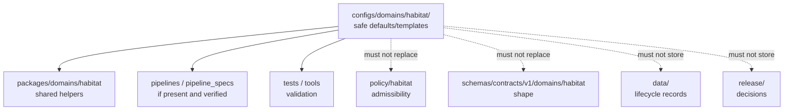

<!-- [KFM_META_BLOCK_V2]
doc_id: kfm://doc/configs-domains-habitat-readme
title: configs/domains/habitat/ — Habitat Domain Configuration Defaults and Templates
type: readme
version: v0.1
status: draft
owners: OWNER_TBD — Habitat steward · Config steward · Policy steward · Data steward · Docs steward
created: 2026-06-16
updated: 2026-06-16
policy_label: public
related:
  - ../../README.md
  - ../../../docs/doctrine/directory-rules.md
  - ../../../docs/domains/habitat/README.md
  - ../../../packages/domains/habitat/README.md
  - ../../../policy/habitat/
  - ../../../schemas/contracts/v1/domains/habitat/
  - ../../../contracts/domains/habitat/
  - ../../../data/registry/habitat/
  - ../../../data/receipts/habitat/
  - ../../../data/proofs/habitat/
  - ../../../release/
tags: [kfm, configs, domains, habitat, defaults, templates, sensitivity, policy-aware, non-secret, governance]
notes:
  - "configs/domains/habitat/ is for safe habitat-domain configuration defaults and templates only."
  - "This folder must not contain authoritative habitat records, source registry rows, policy rules, schemas, contracts, receipts, proofs, release decisions, or published artifacts."
  - "Sensitivity-relevant habitat details must remain governed by policy, lifecycle state, evidence, and release review; config values do not authorize exposure."
  - "Specific current config inventory, consumers, validation coverage, and CI enforcement remain NEEDS VERIFICATION."
[/KFM_META_BLOCK_V2] -->

<a id="top"></a>

<div align="center">

# Habitat Domain Configs

`configs/domains/habitat/`

**Safe habitat-domain configuration defaults and templates. This folder may define non-sensitive knobs, placeholders, and local/default parameters for habitat workflows, but it must not become habitat truth, policy, schema, registry, receipt, proof, release, or publication authority.**


[Purpose](#1-purpose) · [Canonical fit](#2-canonical-fit) · [Habitat sensitivity](#4-habitat-sensitivity-posture) · [Allowed contents](#5-allowed-contents) · [Forbidden contents](#6-forbidden-contents) · [Validation](#9-validation-expectations) · [Definition of done](#12-definition-of-done)

</div>

---

> [!IMPORTANT]
> **Status:** draft / `NEEDS VERIFICATION`  
> **Path:** `configs/domains/habitat/README.md`  
> **Owning root:** `configs/`  
> **Responsibility:** safe habitat-domain defaults and templates  
> **Truth posture:** CONFIRMED README path / CONFIRMED parent `configs/` is canonical for safe defaults and templates / CONFIRMED `packages/domains/habitat/` exists as a shared implementation package README / PROPOSED `configs/domains/habitat/` sublane contract / UNKNOWN current config inventory, consumers, validation coverage, CI enforcement, and owner assignments

> [!CAUTION]
> Habitat config values do not authorize publication or location exposure. Sensitive habitat context, stewardship context, private-land context, and protected-resource context must still pass policy, evidence, lifecycle, review, release, redaction/generalization, and rollback controls.

---

## 1. Purpose

`configs/domains/habitat/` is the habitat-domain configuration sublane under the canonical `configs/` root.

It exists to hold safe defaults and templates that may support habitat ingestion, normalization, validation, public-safe layer preparation, geoprivacy controls, local tests, and steward review workflows. It should make habitat workflow configuration inspectable without storing authoritative records or deployment-only confidential values.

This README does not prove that any habitat config file is currently used by an app, pipeline, runtime adapter, package, test, or CI workflow. Those claims remain `NEEDS VERIFICATION` until checked against current repository evidence.

[Back to top](#top)

---

## 2. Canonical fit

`configs/domains/habitat/` belongs under:

```text
configs/
```

It may support habitat-related consumers such as:

```text
packages/domains/habitat/      # shared habitat helpers, not config authority
pipelines/domains/habitat/     # executable flows, if present and verified
pipeline_specs/habitat/        # declarative flow definitions, if present and verified
apps/                          # governed API / review / viewer consumers, if present and verified
runtime/                       # adapter templates only, not adapter code
```

The folder does not replace those roots and does not define habitat object meaning, policy, or machine shape.

## 3. Authority boundary

```text
configs/domains/habitat/
├── safe habitat defaults
├── placeholder-based templates
├── public-safe/generalization parameters
├── local validation examples
└── configuration notes

NOT HERE:
  habitat source records
  habitat registry rows
  policy rules
  schemas/contracts
  lifecycle data
  receipts/proofs
  release decisions
  published artifacts
  package or pipeline code
  deployment-only confidential values
```

## 4. Habitat sensitivity posture

Habitat configuration is policy-aware by default.

Safe configuration may describe thresholds, placeholder source IDs, environment labels, review toggles, public-safe generalization defaults, or validation options. It must not store sensitive habitat site details, raw observation detail, protected-resource exposure context, private-land specifics, or values that would bypass redaction/generalization.

Any configuration that changes exposure, generalization, review burden, source activation, or publication readiness should be treated as release-significant until policy and steward review confirm otherwise.

## 5. Allowed contents

| Allowed item | Example | Required posture |
|---|---|---|
| Safe habitat defaults | `dev.yaml`, `default.yaml`, `review.yaml` | Must be non-sensitive and reviewable |
| Placeholder templates | `.example`, `.template` | Must use placeholders for deployment-specific values |
| Public-safe parameters | generalized zoom thresholds, safe display toggles | Must defer to `policy/habitat/` and release review |
| Validation examples | local test config with tiny synthetic values | Must not contain source data or sensitive site detail |
| Documentation | field notes and consumer notes | Must point to schemas/contracts/policy for authority |

## 6. Forbidden contents

| Forbidden here | Correct home |
|---|---|
| Habitat source records, observations, occurrence context, or lifecycle data | `data/` lifecycle subtrees |
| Source descriptors, source registry rows, rights rows, sensitivity rows | `data/registry/habitat/` or governed registry homes |
| Receipts and validation reports | `data/receipts/habitat/` or governed receipt homes |
| EvidenceBundles, proof packs, attestations | `data/proofs/habitat/` or governed proof homes |
| Release decisions, release manifests, rollback/correction records | `release/` |
| Published habitat artifacts or public layer outputs | `data/published/` after governed release |
| Policy rules and publication decisions | `policy/habitat/` and release-governed decision homes |
| Machine schema authority | `schemas/contracts/v1/domains/habitat/` or repo-confirmed schema home |
| Human contracts and object meaning | `contracts/domains/habitat/` or repo-confirmed contract home |
| Shared package implementation | `packages/domains/habitat/` |
| Pipeline implementation logic | `pipelines/` |
| Deployment, host, network, exposure, access-control definitions | `infra/` |
| Deployment-only confidential values or live service binding | external deployment store / ignored local files / `infra/` controls |
| Generated build/QA artifacts | `artifacts/` |

## 7. Suggested directory shape

Current inventory remains `NEEDS VERIFICATION`.

```text
configs/domains/habitat/
├── README.md
├── default.template.yaml     # PROPOSED safe default template
├── dev.template.yaml         # PROPOSED local/dev template
├── review.template.yaml      # PROPOSED steward-review template
├── public_safe.template.yaml # PROPOSED public-safe display defaults
└── validation.md             # PROPOSED validation notes
```

> [!WARNING]
> Do not treat this suggested shape as repo fact. Verify actual files before making inventory or migration claims.

## 8. Diagram



## 9. Validation expectations

Useful validation for `configs/domains/habitat/` should confirm:

- every committed file is safe to share in the repo;
- templates use placeholders where deployment-specific values are needed;
- each config identifies its intended consumer;
- config fields align with habitat schemas, contracts, package helpers, pipelines, apps, and tests when those are present;
- public-safe and sensitivity-related parameters do not bypass policy or release review;
- no lifecycle data, release records, receipts, proofs, catalog records, source registry rows, or published artifacts are stored here;
- stale or unowned habitat config examples are removed or marked `NEEDS VERIFICATION`.

## 10. Migration posture

If misplaced material is found under `configs/domains/habitat/`:

1. Do not treat it as authoritative until reviewed.
2. Identify whether it belongs under `policy/`, `schemas/`, `contracts/`, `packages/`, `runtime/`, `infra/`, `pipelines/`, `pipeline_specs/`, `data/`, `release/`, or `artifacts/`.
3. Move it through a small, reviewable migration.
4. Preserve necessary owner notes, provenance notes, and rollback instructions.
5. Add a drift note if the misplaced config was already consumed.

## 11. Safe change pattern

For changes under `configs/domains/habitat/`:

1. Confirm the file is a safe habitat default, template, or config-facing documentation.
2. Confirm deployment-only confidential values and sensitivity-relevant habitat details are not committed.
3. Confirm the config does not duplicate schema, policy, contract, release, registry, proof, receipt, publication, or lifecycle authority.
4. Confirm consumers and validators are updated or explicitly marked `NEEDS VERIFICATION`.
5. Document any compatibility impact on habitat packages, pipelines, apps, runtime adapters, or infra.
6. Update tests or explain why the change is documentation-only.

## 12. Definition of done

- [ ] Owners are confirmed and `OWNER_TBD` is replaced.
- [ ] Actual `configs/domains/habitat/` contents are inventoried.
- [ ] Every committed habitat config is safe for the repo.
- [ ] No deployment-only confidential values, sensitive habitat source details, lifecycle data, registry rows, release records, receipts, proofs, catalog records, published artifacts, source data, or generated artifacts live here.
- [ ] Config templates identify the owning consumer and validation path.
- [ ] Habitat policy, schema, contract, package, pipeline, app, and test alignment is verified or marked `NEEDS VERIFICATION`.
- [ ] Stale or unowned habitat examples are migrated, deleted, or documented as drift.

## 13. Open verification items

| Item | Why it matters |
|---|---|
| Inventory current `configs/domains/habitat/` files | Required before claims about coverage or ownership |
| Confirm `configs/domains/` parent disposition | Required before parent-level path claims |
| Confirm package/pipeline/app/runtime consumers | Required before behavior claims |
| Confirm validation tooling and CI checks | Required before enforcement claims |
| Confirm no deployment-only confidential values or sensitive habitat details are present | Required before safe-sharing claims |
| Confirm config/schema/policy alignment | Required before governance claims |
| Confirm owner assignments | Required before maintenance claims |

<details>
<summary>Appendix A — no-loss preservation note</summary>

The previous README was empty. This replacement establishes the habitat-domain config sublane contract without claiming any specific habitat config inventory, consumer behavior, deployment behavior, validation behavior, or CI enforcement is implemented.

</details>

## Status summary

`configs/domains/habitat/` is a habitat sublane under the canonical `configs/` root. It is for safe habitat-domain defaults and templates only. It is not a home for habitat source records, lifecycle records, source registry rows, policy rules, schemas, contracts, receipts, proofs, release decisions, published artifacts, source code, runtime adapters, infra definitions, or generated artifacts.

<p align="right"><a href="#top">Back to top</a></p>
