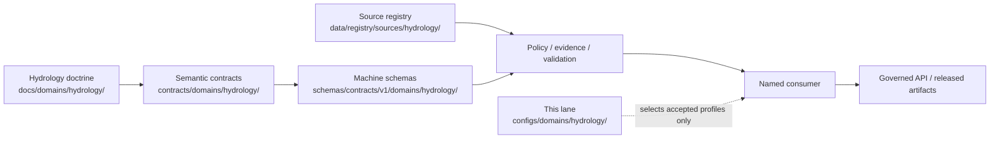

<!-- [KFM_META_BLOCK_V2]
doc_id: kfm://doc/configs-domains-hydrology-readme
title: configs/domains/hydrology/ — Governed Hydrology Configuration Boundary
type: readme
version: v0.3
status: draft; repository-grounded; documentation-only
owners: OWNER_TBD — Config steward · Hydrology steward · Measurement/identity reviewer · Public-safety reviewer · Consumer owner · Validation steward
created: 2026-07-13
updated: 2026-07-14
supersedes: v0.2
policy_label: public; config-sublane; hydrology; evidence-bound; source-role-aware; measurement-aware; freshness-aware; not-for-life-safety; private-property-aware; non-secret; non-authoritative; no-live-binding
current_path: configs/domains/hydrology/README.md
truth_posture: CONFIRMED current target and parent config boundary, Hydrology doctrine and semantic-contract indexes, draft schema/policy/test/fixture/source-registry surfaces, empty machine domain-lane register, source-role anti-collapse rules, NFHL regulatory-only posture, ambiguous-reach abstention, non-alert boundary, and placeholder documentation workflows / PROPOSED future named-consumer templates and accepted profile selectors / UNKNOWN loader, precedence, consumer wiring, deployment binding, executable validation, runtime behavior, release integration, and production use / NEEDS VERIFICATION owners, concrete Hydrology schema inventory, policy enforcement, test payloads and pass results, source rights, freshness profiles, measurement conversions, identity crosswalks, public-safe geometry thresholds, and official-source redirect profiles
evidence_snapshot:
  repository: bartytime4life/Kansas-Frontier-Matrix
  repository_id: "1059091169"
  visibility: public
  base_ref: main
  base_commit: 14b59b6b84ee2b9fa46e002b60e922c97cab2761
  prior_blob: cd932bb068c3131a7629e07613a3ab83fb6656bc
  bounded_lane_search: configs/domains/hydrology/README.md only
  workflow_posture: docs-build, link-check, and citation-validation are pull-request-triggered TODO scaffolds
related:
  - ../README.md
  - ../../README.md
  - ../../../docs/domains/hydrology/README.md
  - ../../../contracts/domains/hydrology/README.md
  - ../../../schemas/contracts/v1/domains/hydrology/README.md
  - ../../../policy/domains/hydrology/README.md
  - ../../../tests/domains/hydrology/README.md
  - ../../../fixtures/domains/hydrology/README.md
  - ../../../data/registry/sources/hydrology/README.md
  - ../../../control_plane/domain_lane_register.yaml
  - ../../../docs/doctrine/directory-rules.md
  - ../../../docs/adr/ADR-0001-schema-home--schemas-contracts-v1-is-canonical.md
  - ../../../docs/adr/ADR-0009-hydrology-is-the-first-proof-bearing-lane.md
  - ../../../docs/registers/DRIFT_REGISTER.md
  - ../../../docs/security/SECRETS.md
notes:
  - "v0.3 replaces stale commit-pinned metadata with current main-branch evidence and records the maturity of adjacent authority surfaces without upgrading draft or scaffold material."
  - "The bounded repository search found only this README inside configs/domains/hydrology/. It did not identify an executable payload, loader, consumer, or activation path. This is bounded evidence, not proof of exhaustive absence."
  - "The revision preserves v0.2 hydrology-specific role, measurement, identity, temporal, NFHL, sensitivity, validation, correction, and rollback controls while reducing repetition and clarifying verified versus proposed surfaces."
  - "No executable configuration, schema, contract, policy, fixture, test, workflow, source record, lifecycle object, release object, runtime behavior, or public artifact is created or changed by this README."
[/KFM_META_BLOCK_V2] -->

# Governed Hydrology Configuration Boundary

`configs/domains/hydrology/`

> Safe-to-commit Hydrology configuration documentation and future named-consumer templates. This lane may select already-governed profiles; it cannot create hydrologic truth, admit sources, resolve identity, define measurement meaning, issue warnings, decide sensitivity, close evidence, or authorize release.

**Quick links:** [Purpose](#purpose) · [Authority](#authority-and-supersession) · [Status](#current-status) · [Scope](#scope) · [Repo fit](#repository-fit) · [File contract](#minimum-file-contract) · [Consumer binding](#consumer-binding-and-precedence) · [Source roles](#source-role-and-semantic-guardrails) · [Measurements](#measurement-spatial-and-identity-integrity) · [Time](#temporal-freshness-and-stale-state) · [NFHL](#nfhl-flood-context-and-life-safety) · [Cross-lane](#cross-lane-and-sensitivity-boundaries) · [Validation](#validation-and-finite-failures) · [AI](#governed-ai-and-public-surfaces) · [Change](#review-change-and-migration-discipline) · [Done](#definition-of-done-for-the-first-payload) · [Rollback](#rollback-and-correction) · [Language](#safe-language)

> [!IMPORTANT]
> **Evidence snapshot:** `main@14b59b6b84ee2b9fa46e002b60e922c97cab2761`  
> **Target blob before this revision:** `cd932bb068c3131a7629e07613a3ab83fb6656bc`  
> **Observed lane maturity:** README-only in the bounded indexed search; no executable Hydrology config payload or consumer binding was found  
> **Runtime effect:** none by directory or file presence

> [!CAUTION]
> **NFHL is regulatory flood context, not observed inundation.** A gauge reading is not a forecast, a modeled hydrograph is not an observation, a HUC aggregate is not site truth, a source outage is not an all-clear, and KFM is not an emergency flood-warning system.

---

## Purpose

This directory is the Hydrology segment under the canonical `configs/` responsibility root. It exists to make small, public-safe, non-secret configuration choices inspectable for a **named and verified consumer**.

A future file here may select an accepted profile for presentation, freshness disclosure, measurement display, identity ambiguity, public-safe geometry, review routing, or stale-state behavior. It must remain subordinate to Hydrology doctrine, semantic contracts, machine schemas, source registry records, policy decisions, evidence, tests, and release state.

This README is for:

- Hydrology and configuration stewards;
- package, pipeline, application, runtime, test, and tool owners that may consume Hydrology settings;
- measurement, datum, identity, time, freshness, rights, sensitivity, public-safety, and release reviewers; and
- reviewers checking Directory Rules placement and trust-membrane integrity.

[Back to top](#top)

---

## Authority and supersession

### Authority level

**Implementation-supporting and non-authoritative.**

| Concern | Authority here | Governing surface |
|---|---:|---|
| Hydrology meaning and boundary | None | [`docs/domains/hydrology/`](../../../docs/domains/hydrology/README.md) |
| Object meaning | None | [`contracts/domains/hydrology/`](../../../contracts/domains/hydrology/README.md) |
| Machine-checkable shape | None | [`schemas/contracts/v1/domains/hydrology/`](../../../schemas/contracts/v1/domains/hydrology/README.md) |
| Source identity, role, rights, cadence, and activation | None | [`data/registry/sources/hydrology/`](../../../data/registry/sources/hydrology/README.md) and source governance |
| Policy, sensitivity, admissibility, and warning restrictions | None | [`policy/domains/hydrology/`](../../../policy/domains/hydrology/README.md) and applicable cross-cutting policy |
| Enforceability | None | [`tests/domains/hydrology/`](../../../tests/domains/hydrology/README.md), [`fixtures/domains/hydrology/`](../../../fixtures/domains/hydrology/README.md), and validators |
| Evidence and claim support | None | `EvidenceRef` / `EvidenceBundle` systems |
| Promotion, release, correction, and rollback | None | `release/` and governed lifecycle records |
| Consumer behavior | Supporting only | A verified consumer may read a validated file through an explicit binding |

A configuration value may **reference** authority. It does not acquire authority through proximity, successful parsing, apparent freshness, repeated use, or rendering in a map, hydrograph, dashboard, Evidence Drawer, Focus Mode answer, export, or AI response.

### Document authority graph

This `v0.3` revision supersedes `v0.2` **at the same path and document ID**. Repository search found no duplicate document carrying `kfm://doc/configs-domains-hydrology-readme`. Older content remains recoverable through Git history; no parallel canonical README is created.

[Back to top](#top)

---

## Current status

### Repository-grounded maturity matrix

| Surface | Current-session evidence | Safe conclusion |
|---|---|---|
| Target lane | Search returned only `configs/domains/hydrology/README.md`. | **CONFIRMED bounded README-only lane.** No executable config payload or consumer was identified by the indexed path search. |
| Parent config contract | [`configs/domains/README.md`](../README.md) is `v0.4`. | **CONFIRMED** domain config is non-secret, non-authoritative, and inactive unless explicitly bound. |
| Root config contract | [`configs/README.md`](../../README.md) defines safe defaults/templates only. | **CONFIRMED** no policy, schema, lifecycle, release, runtime, or secret authority. |
| Hydrology doctrine | [`docs/domains/hydrology/README.md`](../../../docs/domains/hydrology/README.md) exists. | **CONFIRMED repository document** for scope, roles, objects, lifecycle, NFHL, and non-alert boundaries. |
| Semantic contracts | [`contracts/domains/hydrology/README.md`](../../../contracts/domains/hydrology/README.md) exists and indexes several contract files. | **CONFIRMED contract index; completeness and acceptance remain unverified.** |
| Machine schemas | [`schemas/contracts/v1/domains/hydrology/README.md`](../../../schemas/contracts/v1/domains/hydrology/README.md) exists. | **CONFIRMED draft index; concrete Hydrology `.schema.json` inventory was not confirmed by that README.** |
| Policy | [`policy/domains/hydrology/README.md`](../../../policy/domains/hydrology/README.md) is a 33-line greenfield scaffold. | **CONFIRMED scaffold only; substantive policy and enforcement are not proven.** |
| Tests | [`tests/domains/hydrology/README.md`](../../../tests/domains/hydrology/README.md) indexes documented child lanes. | **CONFIRMED documentation; executable modules, CI coverage, and pass results remain `NEEDS VERIFICATION`.** |
| Fixtures | [`fixtures/domains/hydrology/README.md`](../../../fixtures/domains/hydrology/README.md) indexes synthetic fixture families. | **CONFIRMED documentation; payload inventory and consumer use remain `NEEDS VERIFICATION`.** |
| Source registry | [`data/registry/sources/hydrology/README.md`](../../../data/registry/sources/hydrology/README.md) exists and records topology drift. | **CONFIRMED draft registry lane; descriptor instances and final registry topology remain `NEEDS VERIFICATION`.** |
| Machine lane register | [`control_plane/domain_lane_register.yaml`](../../../control_plane/domain_lane_register.yaml) contains `entries: []`. | **CONFIRMED empty register; machine registration is not established.** |
| ADR-0001 | The repository file exists with `status: proposed`. | **CONFIRMED proposed governance handle; not an accepted decision record.** |
| Hydrology-first ADR | The repository file is draft/proposed and records an ADR-number conflict. | **CONFIRMED proposal; not binding sequencing authority.** |
| Documentation workflows | `docs-build`, `link-check`, and `citation-validation` trigger on pull requests but only echo TODO steps. | **CONFIRMED workflow scaffolds; substantive validation is not proven.** |
| Runtime, deployment, release, and publication | No binding evidence was found in the config-lane search. | **UNKNOWN / not authorized by this README.** |

### Evidence limits

- The target-lane search is bounded to indexed repository results and exact named paths.
- Absence from that search does not prove that a differently named, generated, ignored, or unindexed consumer does not exist.
- Repository documents establish declared boundaries; they do not prove runtime enforcement.
- No live source call, hydrologic model, deployment, warning service, release, dashboard, or public route was exercised.

Directory presence must not trigger config discovery, source activation, polling, network access, model execution, identity resolution, unit conversion, warning delivery, geofencing, layer creation, lifecycle promotion, or publication.

[Back to top](#top)

---

## Scope

### What belongs here

Only safe, non-secret, Hydrology-specific material for a named or explicitly proposed consumer belongs here.

| Material | Permitted purpose | Required posture |
|---|---|---|
| `README.md` | Define the boundary and review contract. | Preserve non-authority and fail-closed behavior. |
| `*.template.yaml` / `*.template.yml` | Placeholder-based template for a verified consumer. | Parseable, versioned, no live binding, no credentials, no automatic activation. |
| `*.example.yaml` / `*.example.json` / `*.example.toml` | Tiny illustrative configuration. | Synthetic and impossible values; no real sites, owners, warnings, coordinates, or endpoints. |
| Profile selectors | Select accepted role, freshness, measurement, identity, public-safe geometry, review, or stale-state profiles. | Must reference an existing governed profile; cannot define or weaken it. |
| Presentation hints | Role badges, vintages, caveats, time labels, stale banners, uncertainty, accessibility. | Cannot change evidence, validity, sensitivity, or authority. |
| Migration notes | Document a real consumer/key/version transition. | Owner-linked, time-bounded, reversible, and not a second authority. |
| Validation notes | Describe expected checks. | Commands and workflows must be verified or labeled honestly. |

### What does not belong here

- real gauge, flow, water-level, water-quality, groundwater, well, hydrograph, flood-event, NFHL, or lifecycle payloads;
- API keys, credentials, private endpoints, signed URLs, internal hostnames, personal paths, or deployment bindings;
- current warnings, watches, evacuation instructions, protective-action guidance, all-clear language, dispatch, or escalation settings;
- exact or reconstructable private-well, owner, water-right, dam-internal, utility, treatment, intake, outfall, storage, or resilience-critical detail;
- source admission, activation, cadence, rights, role, or redistribution decisions;
- machine schemas, semantic contracts, policy rules, registry records, receipts, proofs, EvidenceBundles, release records, or correction notices;
- connector, watcher, pipeline, package, application, runtime, infrastructure, or model implementation;
- map tiles, layer manifests, caches, reports, screenshots, indexes, generated narratives, or public exports;
- settings that relabel NFHL as observed flooding, models as observations, aggregates as site truth, or candidates as resolved identity;
- settings that silently change parameters, units, datums, qualifiers, provisional state, precision, or no-data values; or
- settings that interpret missing or unavailable data as safe or normal conditions.

Synthetic examples must not resemble a real private well, water-right holder, active gauge event, regulated facility, warning polygon, dam interior, utility asset, or sensitive property closely enough to enable confusion or reconstruction.

[Back to top](#top)

---

## Repository fit

The path follows Directory Rules: the **responsibility root** is `configs/`; the **domain segment** is `hydrology`.

| Responsibility | Verified or governing home | Relationship to this lane |
|---|---|---|
| Safe repository configuration | [`configs/`](../../README.md) | Parent responsibility root. |
| Domain-scoped configuration | [`configs/domains/`](../README.md) | Immediate parent boundary. |
| Hydrology doctrine | [`docs/domains/hydrology/`](../../../docs/domains/hydrology/README.md) | Human-facing scope and operating law. |
| Object meaning | [`contracts/domains/hydrology/`](../../../contracts/domains/hydrology/README.md) | Semantic authority; configuration may reference only. |
| Machine shape | [`schemas/contracts/v1/domains/hydrology/`](../../../schemas/contracts/v1/domains/hydrology/README.md) | Draft schema index; configuration may reference only. |
| Policy | [`policy/domains/hydrology/`](../../../policy/domains/hydrology/README.md) | Current scaffold; configuration cannot substitute for policy. |
| Source admission | [`data/registry/sources/hydrology/`](../../../data/registry/sources/hydrology/README.md) | Draft source-registry lane; config cannot admit or activate. |
| Enforceability | [`tests/domains/hydrology/`](../../../tests/domains/hydrology/README.md) and [`fixtures/domains/hydrology/`](../../../fixtures/domains/hydrology/README.md) | Tests and synthetic examples, not release authority. |
| Lifecycle data | `data/<phase>/hydrology/` | Never stored here. |
| Receipts and proofs | `data/receipts/`, `data/proofs/` | Trust-bearing outputs remain separate. |
| Release and rollback | `release/`, accepted rollback/correction lanes | Configuration cannot create release state. |
| Public delivery | governed API and released artifacts | Public clients must not read this directory as a data surface. |

### Path and topology posture

Current repository surfaces use the domain-segment forms `contracts/domains/hydrology/` and `schemas/contracts/v1/domains/hydrology/`. Older atlas/crosswalk material recorded flat alternatives. This README follows the current repository plus Directory Rules and must not:

- create flat aliases or duplicate authorities;
- resolve registry topology drift by consumer precedence;
- treat proposed ADR language as accepted solely because a matching path exists; or
- create compatibility paths without an ADR or explicit migration note.

[Back to top](#top)

---

## Inputs and outputs

### Accepted configuration inputs

A future file may consume only explicit, inspectable configuration inputs:

- named consumer ID, owner, and component path;
- format and configuration version;
- verified contract, schema, policy, registry, and doctrine references;
- accepted role, freshness, measurement, identity, public-safe geometry, review, and stale-state profile IDs;
- source-independent presentation defaults;
- synthetic fixture IDs and impossible example values; and
- migration, deactivation, and rollback metadata.

A configuration input is not a source record, observation, forecast, warning, model output, identity decision, policy decision, receipt, proof, or release record.

### Permitted output

The lane currently outputs **documentation only**. A future validated file may produce deterministic settings for one named consumer. It must not output or trigger a source request, hydrologic record, warning, identity decision, scientific conversion, redaction decision, EvidenceBundle, release record, API response, layer, tile, cache, report, or durable lifecycle write.

[Back to top](#top)

---

## Minimum file contract

Before the first non-README payload is accepted, it must document or encode the following. Exact keys remain `PROPOSED` until a schema and consumer are verified.

| Contract item | Required information |
|---|---|
| Status and owner | Draft/example/template/active state; named config owner and consumer owner. |
| Intended consumer | Exact app, package, pipeline, runtime, test, or tool. |
| Binding evidence | Parser/loader entrypoint, supported path, selection mechanism, and tests. |
| Format and version | YAML, JSON, TOML, or another explicit format and config version. |
| Authority references | Exact contract, schema, policy, registry, doctrine, and source-profile references. |
| Source-role handling | Canonical role profile and fail-closed behavior for missing/conflicting role. |
| Measurement handling | Parameter, source/display units, datum, qualifier, provisional, precision, no-data, and conversion profile. |
| Identity handling | HUC digit level, source vintage, reach/site namespace, crosswalk method, confidence, and ambiguity outcome. |
| Spatial handling | CRS, axis order, geometry type, scale/resolution, accuracy, clipping, simplification, and public-safe profile. |
| Temporal handling | Source, observed, valid, issue, expiry, retrieval, processing, release, correction, and supersession semantics. |
| Freshness handling | Source-specific profile, stale/partial/outage behavior, and disclosure requirements. |
| Sensitivity handling | Well, owner, water-right, dam, utility, facility, private-property, join, low-count, differencing, and reconstruction controls. |
| Warning boundary | Explicit non-alert posture and official-source redirect profile reference. |
| Parser behavior | Missing file, unknown key, duplicate key, unsupported version, and malformed value outcomes. |
| Precedence | Complete deterministic order among built-in, repository, environment, local, CLI, and deployment layers. |
| Network behavior | Disabled by file presence and disabled during validation. |
| Validation | Deterministic parse, shape, semantic, negative, sensitivity, and no-network checks. |
| Deactivation | How the consumer stops selecting the file without history rewriting. |
| Migration and rollback | Compatibility window, prior known-good version, restore steps, cache/output review, and correction path. |

Safe placeholders include `<HYDROLOGY_CONSUMER_ID>`, `<VERIFIED_SCHEMA_REF>`, `<VERIFIED_POLICY_PROFILE>`, `<ACCEPTED_FRESHNESS_PROFILE>`, `<ACCEPTED_MEASUREMENT_PROFILE>`, `<ACCEPTED_IDENTITY_PROFILE>`, `<PUBLIC_SAFE_GEOMETRY_PROFILE>`, and `<LOCAL_ONLY_OVERRIDE>`.

Do not use realistic gauge IDs, COMIDs, HUC codes tied to sensitive examples, private-well IDs, owner names, warning IDs, coordinates, endpoints, or credentials as placeholders.

[Back to top](#top)

---

## Consumer binding and precedence

A file is not active merely because it exists. A verified binding must establish:

1. exact path and supported format/version;
2. parser/loader and owning component;
3. load timing, mandatory/optional behavior, and reload atomicity;
4. complete precedence order;
5. duplicate-key and unknown-key behavior;
6. missing, unreadable, invalid, stale, and unsupported-version behavior;
7. deactivation, migration, and rollback; and
8. tests proving that directory presence activates no source, network call, model, warning, or public output.

Until that evidence exists:

- auto-discovery, recursive loading, network access, source activation, model execution, and public exposure are **off**;
- unknown or invalid consequential keys produce hold or rejection;
- missing configuration leaves the proposed feature disabled; and
- no fallback may weaken source role, rights, evidence, freshness, sensitivity, measurement integrity, identity ambiguity, or the warning boundary.

Environment variables, local overrides, CLI arguments, or deployment values do not automatically outrank repository configuration. Precedence must be explicit and tested.

[Back to top](#top)

---

## Source-role and semantic guardrails

The Hydrology source registry currently names the canonical roles `observed`, `regulatory`, `modeled`, `aggregate`, `administrative`, `candidate`, and `synthetic`. Older materials also use `authority`, `observation`, `context`, and `model` wording. Configuration must not invent aliases or perform an ungoverned mapping between those vocabularies.

| Claim or product | Must not become | Required posture |
|---|---|---|
| Gauge reading | Forecast, regulatory zone, model, or warning | Preserve parameter, unit, datum, qualifier, provisional status, site, and observed time. |
| NFHL zone | Observed inundation, current flooding, forecast, or warning | Preserve regulatory role, vintage, effective date, citation, and limits. |
| Modeled/reconstructed hydrograph | Observed series | Preserve model identity, version, inputs, method, uncertainty, and run evidence. |
| HUC/watershed aggregate | Per-site or per-property truth | Preserve aggregation unit, support, time, source set, and receipt reference. |
| Administrative well/water-right roster | Observed flow/use, ownership proof, or event timeline | Preserve administrative role and applicable privacy/rights limits. |
| Candidate reach crosswalk | Resolved `ReachIdentity` | Record candidates, method, evidence, confidence, and `ABSTAIN` when ambiguous. |
| Terrain-derived drainage/inundation | Official hydrography, observation, or regulatory designation | Preserve derived/modeled role, resolution, method, and limitations. |
| Historical flood evidence | Current warning or forecast | Preserve historical time and explicit non-current status. |
| Synthetic fixture | Real site, event, source, or observation | Use impossible values and synthetic labeling. |
| Operational-warning context | KFM-issued alert or life-safety instruction | Context only; cited, time-bounded, and redirected to official authorities. |

Role mismatch is a **publication-blocking condition**, not a display preference.

[Back to top](#top)

---

## Measurement, spatial, and identity integrity

### Measurement integrity

A future profile must preserve source-native parameter, value, unit, datum, qualifier, provisional/approval state, censoring/estimated state, method, precision, uncertainty, support interval, and no-data semantics.

It must never:

- infer unit compatibility from a field name;
- perform an undocumented conversion;
- discard qualifiers or provisional status;
- convert no-data to zero;
- mix stage, discharge, elevation, depth, concentration, or withdrawal values;
- hide vertical or site datum differences; or
- display precision beyond source support.

### Spatial integrity

Preserve source/output CRS, axis order, geometry type, source scale/resolution, horizontal/vertical accuracy, HUC digit level, source vintage, topology expectations, clipping boundary, simplification/generalization profile, and public-safe geometry class.

Client-side style, opacity, zoom, clustering, hidden fields, or popup omission is **not** a sensitivity transform.

### Identity integrity

Preserve source ID and vintage, HUC level, reach/feature namespace, site namespace, crosswalk method/version, candidate set, confidence/reason, topology/geometry checks, temporal validity, supersession lineage, and ambiguity outcome.

When multiple mappings remain defensible, return `ABSTAIN` or hold for review. Do not select the first, nearest, longest, newest, or most convenient candidate unless a separately governed and tested rule authorizes it.

[Back to top](#top)

---

## Temporal, freshness, and stale state

Hydrology is time-aware. Do not collapse these into one timestamp:

| Time | Meaning |
|---|---|
| `source_time` | Upstream assertion or version time. |
| `observed_time` | Measurement or event time. |
| `valid_time` | Window for a model, forecast, or context. |
| `issue_time` / `expiry_time` | Issue and expiration of a time-bounded product. |
| `retrieval_time` / `processing_time` | KFM acquisition and processing time. |
| `release_time` | Public-safe release time. |
| `correction_time` / `superseded_time` | Correction and replacement lineage. |

A source-specific freshness profile should define cadence, latency allowance, fresh/delayed/stale/expired/partial/unavailable/corrected/superseded states, source-head requirements, disclosure, historical visibility, abstention/denial behavior, and recovery after outage.

Required fail-closed behavior:

- stale may remain useful, but stale must be visible;
- missing or unavailable data is not evidence of zero flow, no flooding, or safety;
- cached values retain original observation and retrieval times;
- corrections do not overwrite lineage silently;
- superseded material is not labeled current;
- timezone/offset is explicit when local time is rendered;
- warning/forecast validity is never extended by configuration; and
- a successful request does not prove completeness.

[Back to top](#top)

---

## NFHL, flood context, and life safety

### NFHL contract

A future presentation profile must preserve regulatory role, source/map vintage, zone/designation code, effective/publication date, citation, geometry/scale limits, caveats, evidence, and release state.

It must not label NFHL as observed inundation, current flooding, a gauge observation, a forecast, a warning/watch/advisory, a parcel-level legal/insurance determination, or KFM emergency guidance.

### Composite flood context

Regulatory, observed, modeled, historical, and operational-context material may appear together only when every constituent remains separately role-typed, time-stamped, cited, and sensitivity-filtered. A consumer must not flatten the result into one “flood” truth flag.

### Permanent life-safety boundary

Hydrology configuration must never issue, modify, suppress, extend, cancel, or replace official warnings; generate evacuation, shelter, rescue, travel, medical, or protective-action instructions; emit an all-clear; trigger dispatch/escalation/incident command; or infer safety from missing data.

When a governed surface displays operational-warning context, it must identify the official source and jurisdiction, preserve issue/expiry times, display current/stale/expired/historical state, retain a not-for-life-safety disclaimer, route to an accepted official-source profile, and return `DENY` or `ABSTAIN` when authority, freshness, or official-link state is unresolved.

Exact disclaimer text and redirect profiles remain product/policy decisions and `NEEDS VERIFICATION`.

[Back to top](#top)

---

## Cross-lane and sensitivity boundaries

Hydrology may join neighboring lanes only while preserving ownership, role, time, evidence, and sensitivity.

| Related lane | Hydrology contribution | Boundary |
|---|---|---|
| Hazards | Flow/level, NFHL, drought and flood context | Hazards owns warnings, events, declarations, exposure, and resilience claims. |
| Soil | Watershed, infiltration, runoff, hydrologic-group context | Soil owns soil units, horizons, and properties. |
| Agriculture | Irrigation, water-use, drought, crop-water context | Agriculture owns crops, fields, yield, and production. |
| Settlements / Infrastructure | Bridges, dams, utilities, intakes, treatment, exposure context | Infrastructure owns facility identity and operational status; sensitive precision fails closed. |
| Geology | Aquifer and hydrostratigraphic context | Geology owns geologic units; Hydrology owns water observations/relationships. |
| Habitat / Fauna / Flora | Wetland, riparian, aquatic, occurrence, and vegetation context | Biological lanes retain taxonomy, occurrence, and sensitive-location authority. |
| Roads / Rail / Trade | Crossings, closures, detours, and flood exposure context | Transport owns network and closure truth. |
| People / DNA / Land | Well ownership, water rights, parcels, private-property implications | People/Land owns identity, title, ownership, and parcel claims. |
| Spatial Foundation | CRS, geometry, scale, and generalization | Hydrology consumes shared spatial rules. |

Join-induced sensitivity is evaluated on the **resulting product**, not only its inputs. Review exact well locations, owner/water-right identity, low counts, isolated facilities, dam internals, treatment/intake/outfall/pumping/storage details, emergency resources, resilience dependencies, repeated-query differencing, cached tiles/exports, alternate IDs, temporal changes, and metadata/URL leakage.

A file may select only an accepted sensitivity profile. It must not define ad hoc masking, jitter, delay, buffers, aggregation thresholds, suppression, access tiers, or owner-redaction rules.

[Back to top](#top)

---

## Validation and finite failures

### Performed for this documentation revision

- Verified repository identity, permissions, `main` head, target blob, and absence of an open target PR.
- Inspected parent/root config contracts, Directory Rules, PR template, CODEOWNERS, drift register, Hydrology doctrine, contract/schema/policy/test/fixture/source-registry indexes, machine lane register, and relevant workflow stubs.
- Confirmed the target document ID resolves only to this README in repository search.
- Confirmed no executable config, policy, schema, workflow, runtime, source record, lifecycle object, release object, or public artifact is changed.
- Reviewed the text for secrets, live bindings, real hydrologic records, warning instructions, protected owner/infrastructure detail, and role collapse.

### Required before a future payload

A payload must pass deterministic, no-network checks for parsing/versioning, required and unknown keys, owner/consumer binding, authority-reference resolution, role semantics, NFHL misuse, identity ambiguity, measurement/unit/datum/qualifier/no-data handling, CRS/scale/precision, all material time kinds, stale/partial/outage/correction states, rights/attribution, private-property and infrastructure risk, warning denial, no-side-effects, deactivation, migration, and rollback.

Essential negative cases include:

- NFHL-as-observed; model-as-observation; aggregate-as-site-truth;
- ambiguous reach auto-selection;
- parameter/unit/datum mismatch; discarded qualifier/provisional state; no-data-to-zero;
- stale-as-current; outage-as-safe;
- KFM-generated warning, action instruction, or all-clear;
- unresolved rights accepted; exact well/owner/infrastructure exposed; repeated-query reconstruction;
- unknown consequential key ignored; permissive fallback; network access during validation; or
- connector/watcher/consumer writing directly to catalog, published, or release state.

### Finite failure behavior

| Condition | Required behavior |
|---|---|
| Missing optional file | Feature remains disabled or uses a separately verified safe built-in default. |
| Missing required, unreadable, malformed, or unsupported file | `ERROR` or hold; no best-effort continuation. |
| Unknown consequential or duplicate key | Reject or hold unless explicitly governed. |
| Missing owner/consumer/reference | Hold; no activation. |
| Missing/conflicting source role | `DENY` or hold. |
| NFHL used as observed/current/forecast flood | `DENY`. |
| Model used as observation | `DENY`. |
| Ambiguous identity | `ABSTAIN` or review hold. |
| Measurement/datum/qualifier/no-data mismatch | `DENY` or hold; preserve source-native value. |
| Stale/partial/outage state | Visible state; `ABSTAIN` from unsupported current claims. |
| Unresolved rights or sensitivity | Restrict, `DENY`, or hold. |
| Life-safety use | `DENY` and route through the accepted official-authority path. |
| Network or side effect during no-network validation | `ERROR`. |
| Missing rollback target | Hold activation or release-dependent use. |

The repository’s docs, link, and citation workflows are currently TODO scaffolds. Their successful execution would not prove substantive Hydrology configuration validation.

[Back to top](#top)

---

## Governed AI and public surfaces

Configuration may support presentation preferences for an already-governed AI or Focus Mode consumer. It cannot authorize AI to become Hydrology truth, policy, release authority, or emergency authority.

Generated language must use released resolvable evidence, preserve source role and ownership, distinguish NFHL from observed flooding, distinguish observations from models/aggregates, disclose units/qualifiers/uncertainty/time where material, show stale/partial/corrected/superseded state, `ABSTAIN` when support is insufficient, and `DENY` sensitive or life-safety replacement requests.

Configuration must not instruct a model to infer current flooding from NFHL, forecast without a governed product, suppress caveats, choose an ambiguous reach, convert scientific values without an accepted method, expose protected well/owner/infrastructure detail, or answer authoritatively when evidence requires abstention.

Public clients must use the governed API and released artifacts. They must not read this directory as a data source or authority surface.

[Back to top](#top)

---

## Review, change, and migration discipline

### Review burden

README changes require configuration/documentation and Hydrology-domain review. A future payload additionally requires the applicable consumer, source, measurement, datum, identity, freshness, rights, sensitivity, public-safety, schema/contract, validation, security, accessibility, policy, evidence, and release reviewers.

CODEOWNERS currently has only a wildcard placeholder for this path; do not infer effective review coverage from that file. Owners remain `OWNER_TBD` until verified.

### Safe change sequence

1. identify the exact consumer and owner;
2. verify canonical doctrine, contract, schema, policy, source, measurement, identity, and profile references;
3. preserve all source-role distinctions;
4. verify scientific, spatial, temporal, freshness, rights, and sensitivity semantics;
5. run deterministic parse, semantic, negative, and no-network tests;
6. document precedence, deactivation, migration, correction, and rollback;
7. inspect the diff for secrets, live bindings, real records, warnings, protected detail, and reconstruction clues;
8. verify remote read-back and changed paths; and
9. keep configuration, source admission, evidence, policy, release, and publication separate.

A config PR must not silently add source activation, polling, warning/notification behavior, contracts, schemas, role mappings, scientific conversions, identity algorithms, freshness thresholds, sensitivity rules, connectors, pipelines, models, lifecycle records, receipts/proofs, releases, or public routes/layers.

### Misplaced material

If misplaced content appears here, classify it, remove/quarantine secrets or protected material, route meaning to `contracts/`, shape to `schemas/`, admissibility to `policy/`, source records to registry governance, implementation to its responsibility root, lifecycle objects to `data/`, and release/correction/rollback decisions to `release/`. Preserve provenance, consumer impact, exposure assessment, migration reason, and rollback instructions.

[Back to top](#top)

---

## Definition of done for the first payload

- [ ] Named consumer and accepted owners are verified.
- [ ] File format, version, parser, exact load path, and precedence are verified.
- [ ] Canonical doctrine, contract, schema, policy, registry, source, and profile references resolve.
- [ ] Directory presence alone activates nothing.
- [ ] Role vocabulary and anti-collapse behavior are governed and tested.
- [ ] NFHL cannot become observed/current/forecast flooding or warning authority.
- [ ] Parameter, unit, datum, qualifier, provisional, precision, conversion, and no-data semantics are explicit.
- [ ] HUC level, source vintage, identity namespaces, crosswalk method, confidence, and ambiguity behavior are explicit.
- [ ] Ambiguous identity produces `ABSTAIN` or review hold.
- [ ] CRS, geometry, scale/resolution, precision, and public-safe spatial behavior are explicit.
- [ ] Time kinds and stale/partial/outage/correction/supersession states remain distinct and visible.
- [ ] Rights, attribution, redistribution, cadence, and rate-limit terms are reviewed.
- [ ] Well/owner/water-right/dam/utility/private-property and reconstruction risks use accepted policy profiles.
- [ ] Operational-warning context cannot become KFM action guidance.
- [ ] Synthetic valid, invalid, stale, partial, unavailable, corrected, ambiguous, denied, abstained, and error cases exist.
- [ ] No-network and no-side-effect tests pass.
- [ ] Secret/live-binding/protected-context scans pass.
- [ ] Migration, deactivation, correction, withdrawal, and rollback are tested.
- [ ] Repository-native checks are substantive or their scaffold limitations are stated.

[Back to top](#top)

---

## Related folders and ADR posture

- [`../README.md`](../README.md) — parent domain-configuration contract.
- [`../../README.md`](../../README.md) — root configuration boundary.
- [`../../../docs/domains/hydrology/README.md`](../../../docs/domains/hydrology/README.md) — Hydrology doctrine.
- [`../../../contracts/domains/hydrology/README.md`](../../../contracts/domains/hydrology/README.md) — semantic-contract index.
- [`../../../schemas/contracts/v1/domains/hydrology/README.md`](../../../schemas/contracts/v1/domains/hydrology/README.md) — draft schema index.
- [`../../../policy/domains/hydrology/README.md`](../../../policy/domains/hydrology/README.md) — current policy scaffold.
- [`../../../tests/domains/hydrology/README.md`](../../../tests/domains/hydrology/README.md) — Hydrology test-lane index.
- [`../../../fixtures/domains/hydrology/README.md`](../../../fixtures/domains/hydrology/README.md) — synthetic fixture index.
- [`../../../data/registry/sources/hydrology/README.md`](../../../data/registry/sources/hydrology/README.md) — draft source-registry lane.
- [`../../../docs/doctrine/directory-rules.md`](../../../docs/doctrine/directory-rules.md) — placement doctrine.
- [`../../../docs/adr/ADR-0001-schema-home--schemas-contracts-v1-is-canonical.md`](../../../docs/adr/ADR-0001-schema-home--schemas-contracts-v1-is-canonical.md) — repository-present **proposed** schema-home ADR.
- [`../../../docs/adr/ADR-0009-hydrology-is-the-first-proof-bearing-lane.md`](../../../docs/adr/ADR-0009-hydrology-is-the-first-proof-bearing-lane.md) — repository-present **draft/proposed** sequencing ADR with an unresolved ID conflict.
- [`../../../docs/registers/DRIFT_REGISTER.md`](../../../docs/registers/DRIFT_REGISTER.md) — drift log; it currently contains no Hydrology-config-specific entry.
- [`../../../docs/security/SECRETS.md`](../../../docs/security/SECRETS.md) — secret and sensitive-value handling.

This README introduces no ADR and resolves no existing ADR. Separate governance is required before changing root structure, schema-home authority, role vocabulary, identity algorithms, measurement semantics, freshness thresholds, source rights, sensitivity rules, warning boundaries, lifecycle phases, public access, or release/proof/receipt separation.

[Back to top](#top)

---

## Rollback and correction

Before merge, rollback means closing the draft pull request and abandoning the scoped branch.

After merge, restore the prior README through a transparent revert commit or revert pull request. Do not force-push shared history.

For a future payload correction:

1. stop selecting the affected config through the verified consumer mechanism;
2. stop dependent source/model/render/public-output processes where necessary;
3. preserve the faulty version and review evidence;
4. identify affected observations, identities, conversions, joins, caches, tiles, exports, screenshots, and narratives without exposing protected detail;
5. assess role collapse, measurement corruption, identity error, hidden stale state, and sensitivity exposure;
6. restore the prior known-good version or safe disabled state;
7. rerun validation and negative cases;
8. create required correction, withdrawal, redaction, release, and rollback records in canonical homes; and
9. verify that no public surface continues to serve an unauthorized, stale, misclassified, wrongly converted, wrongly identified, or reconstructable derivative.

A Git revert does not itself revoke exposed data, invalidate caches, correct scientific meaning, undo an identity decision, or establish publication lineage.

[Back to top](#top)

---

## Safe language

Use:

- “safe Hydrology configuration template for a named consumer”;
- “intended consumer — `NEEDS VERIFICATION`”;
- “NFHL regulatory context, not observed inundation”;
- “observed reading with source time, unit, qualifier, and provisional state”;
- “modeled hydrograph, not observation”;
- “candidate reach mapping — ambiguous; `ABSTAIN`”;
- “stale historical context, not current conditions”;
- “configuration aid, not authority”; and
- “bounded search found no indexed executable consumer.”

Avoid unsupported claims such as:

- “the Hydrology pipeline uses this config”;
- “this file activates a source”;
- “CI validates this config” while workflows remain scaffolds;
- “NFHL shows where flooding is happening”;
- “the nearest reach is correct”;
- “missing data means no risk”;
- “no-data is zero”;
- “this conversion is exact” without a governed method;
- “this setting authorizes public display”; or
- “this folder contains the complete operational Hydrology configuration.”

[Back to top](#top)

---

Appendix A — v0.2 preservation and no-loss assessment

This revision preserves the material safeguards from v0.2:

- configuration is non-secret, non-authoritative, consumer-bound, and inactive by presence;
- source roles remain distinct, including NFHL regulatory context, observations, models, aggregates, administrative records, candidates, synthetic fixtures, and operational-warning context;
- measurement, unit, datum, qualifier, provisional, precision, no-data, spatial, identity, and ambiguity rules remain fail closed;
- source, observed, valid, issue, expiry, retrieval, processing, release, correction, and supersession times remain distinct;
- private-property, well, owner, water-right, dam, utility, infrastructure, join, low-count, differencing, and reconstruction risks remain review-gated;
- validation, finite failures, governed AI, review, migration, correction, rollback, and safe-language requirements remain explicit.

The revision removes only repetition, stale commit-pinned evidence, and wording that treated adjacent paths as merely hypothetical after their README indexes were verified. It does not upgrade those adjacent surfaces beyond their observed draft, scaffold, documentation-only, or `NEEDS VERIFICATION` states.

[Back to top](#top)

---

## Last reviewed

**2026-07-14**, against `main@14b59b6b84ee2b9fa46e002b60e922c97cab2761`.

Review again before the first non-README payload, consumer binding, loader or precedence decision, source-role mapping, measurement profile, identity-crosswalk profile, freshness profile, sensitivity profile, source/model activation, warning-context integration, or public-output integration.
