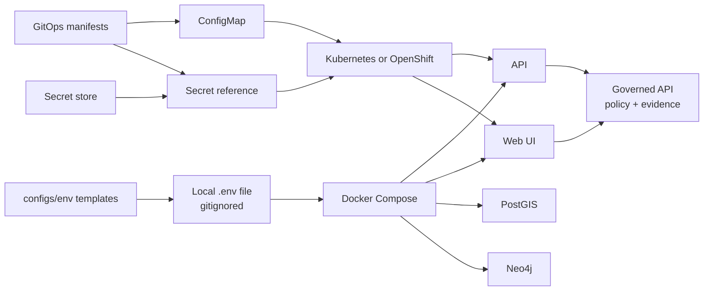

<!-- [KFM_META_BLOCK_V2]
doc_id: kfm://doc/0cfa3f47-8dd5-4e4f-9d05-6b7a3dc1b7e7
title: configs/env
type: standard
version: v1
status: draft
owners: Operator (platform) + Steward (governance)
created: 2026-02-22
updated: 2026-02-22
policy_label: restricted
related:
  - configs/env/README.md
  - configs/env/.env.example
  - configs/env/templates/
  - configs/env/k8s/
  - configs/env/scripts/
tags:
  - kfm
  - config
  - secrets
  - env
  - docker-compose
  - kubernetes
  - openshift
  - gitops
notes:
  - Templates and key names only; never commit secret values.
[/KFM_META_BLOCK_V2] -->

<a id="configsenv"></a>

# configs/env

Central place for **environment configuration templates** and **deployment-safe configuration artifacts** for Kansas Frontier Matrix (KFM) services.

**Status:** Draft · **Owners:** Operator (platform) + Steward (governance) · **Last updated:** 2026-02-22


**Quick nav:**  
[What belongs here](#what-belongs-here) ·
[Directory layout](#directory-layout) ·
[Local development](#local-development) ·
[Kubernetes and OpenShift](#kubernetes-and-openshift) ·
[Configuration contract](#configuration-contract) ·
[Security and governance guardrails](#security-and-governance-guardrails) ·
[Troubleshooting](#troubleshooting) ·
[Definition of Done](#definition-of-done)

---

## Purpose and non-negotiables

This directory exists to make configuration **repeatable**, **reviewable**, and **deployment-safe** across KFM environments.

**Non-negotiables:**

- **MUST NOT** commit plaintext secrets (tokens, passwords, private keys, certs, OAuth client secrets).
- **MUST** keep config key names stable or provide a deprecation plan.
- **MUST** preserve the **trust membrane**: clients never receive storage/database credentials.
- **SHOULD** validate configuration early (CI + startup fail-fast).

> **WARNING**  
> This directory may contain *templates* and *key names*, but **never secret values**.

---

## Configuration and secrets flow



---

## What belongs here

**✅ OK to store in Git (non-secret):**

- Environment variable **templates** (examples / placeholders).
- Environment variable **documentation** (what each key means, which service uses it).
- Non-sensitive defaults (e.g., local ports, feature toggles safe for dev).
- Kubernetes/OpenShift **ConfigMap templates**.
- Secret **shape** templates (key names only), or references to an external secret manager.
- Validation schemas / scripts that ensure required keys exist.

**❌ Not OK to store in Git:**

- Passwords, tokens, API keys, OAuth client secrets, private keys, certificates.
- Production connection strings.
- Any “temporary” secret you plan to remove later.

> **TIP**  
> If a value would be damaging if copied into a GitHub issue, Slack, or a build log, it’s a secret. Don’t commit it.

---

## Directory layout

The intended organization under `configs/env/` is:

```text
configs/
  env/
    README.md                  # this file

    .env.example               # local dev template (no secrets)

    templates/
      api.env.example          # service-scoped template (optional)
      web.env.example          # service-scoped template (optional)

    k8s/
      configmap.yaml.tmpl      # non-secret config for K8s/OpenShift
      secret.keys.yaml.tmpl    # key names only (NO VALUES)

    scripts/
      validate_env.*           # optional: fail-fast checks (CI + local)
```

> **NOTE**  
> If your repo already uses a different layout, keep this README accurate and treat the **actual runtime entrypoints**
> (`docker-compose.yml`, Helm/Kustomize, deployment manifests) as the source of truth.

---

## Local development

Most KFM setups use Docker Compose to run a consistent dev stack (API + UI + databases).

### 1) Create your local env file

If the repo provides a template such as `.env.example`, copy it to a gitignored `.env`:

```bash
cp configs/env/.env.example .env
```

Fill in only what you need for local development.

> **TIP**  
> Ensure `.env` is ignored by Git. A typical pattern:
>
> ```gitignore
> .env
> .env.*
> !.env.example
> ```

### 2) Start the stack

```bash
docker-compose up --build
```

> **NOTE**  
> If you’re using Docker Compose v2, the equivalent is:
>
> ```bash
> docker compose up --build
> ```

### 3) Apply env changes

Environment variables are usually read at container start. If you change `.env`, restart:

```bash
docker-compose down
docker-compose up --build
```

<details>
<summary>Example local <code>.env</code> (placeholders only)</summary>

```dotenv
# Database (PostGIS)
POSTGRES_USER=postgres
POSTGRES_PASSWORD=changeme
POSTGRES_DB=kfm

# Graph
NEO4J_AUTH=neo4j/changeme

# Service ports
FASTAPI_PORT=8000
WEB_PORT=3000

# UI -> API
REACT_APP_API_URL=http://localhost:8000

# Policy engine toggle (prefer enabled; only disable for isolated local debugging)
ENABLE_OPA=true

# Focus Mode AI (choose one approach)
# Local model via Ollama (example)
OLLAMA_MODEL=llama2:7b
# Hosted model (example)
OPENAI_API_KEY=
```

</details>

### Common local pitfalls

- **Port conflicts:** if something already uses `5432` (Postgres), `7474` (Neo4j), or `8000/3000` (API/UI), stop the conflicting service or adjust Compose port mappings.
- **Service order:** if a dependent service starts too quickly, re-run `docker-compose up` or ensure `depends_on` is configured.
- **Volume permissions:** if containers can’t write to mounted volumes (common on Mac/Windows), adjust permissions or the container user.

---

## Kubernetes and OpenShift

For cluster deployments:

- Use **ConfigMaps** for *non-secret* settings.
- Use **Secrets** (or **external secret controllers**) for secret material.
- Prefer environment-specific overlays (e.g., dev/staging/prod) managed via GitOps.

Recommended constraints:

- **No plaintext secrets in GitOps repos.**
- Treat any setting that can weaken policy enforcement, access control, logging, or evidence tracing as **production-critical** and protect it with review + CI gates.

---

## Configuration contract

### Naming and documentation

- Every configuration key must be documented (what it controls, which component reads it).
- Keys should be **stable**; renames require a compatibility plan (defaults, deprecation window).
- Prefer a single place to define defaults for each environment (avoid “mystery overrides”).

### Suggested variable groups

The following are **common** groups (not exhaustive). Verify the exact names in:

- `docker-compose.yml`
- API/UI config loaders
- K8s manifests (ConfigMaps/Secrets)

| Group | Examples | Notes |
|---|---|---|
| Databases | `POSTGRES_USER`, `POSTGRES_PASSWORD`, `POSTGRES_DB` | Do not expose DB creds to the frontend. |
| Graph | `NEO4J_AUTH` | Treat as secret. |
| Ports | `FASTAPI_PORT`, `WEB_PORT` | Keep host port mappings flexible. |
| UI wiring | `REACT_APP_API_URL` | UI points only to the **governed API**. |
| Policy | `ENABLE_OPA` | Should be **on** in any shared environment. |
| Focus Mode AI | `OLLAMA_MODEL`, `OPENAI_API_KEY` | Treat keys as secrets; document data-handling expectations. |

> **WARNING**  
> Frontend environment variables are typically baked into the build output and are **not secret** by definition.
> Never place secrets in variables that the frontend can read.

### Validation

- Services should fail at startup if required configuration is missing.
- CI should validate that:
  - templates include all required keys
  - K8s manifests reference valid keys
  - no secret values are present in committed templates

---

## Security and governance guardrails

These guardrails preserve KFM’s core invariants (policy enforcement, provenance, auditability):

- **Trust membrane:** frontend and external clients should never receive storage/DB credentials.
- **Policy enforcement is not optional in shared environments:** configuration must not allow bypassing policy checks at runtime.
- **Reproducibility:** pipeline and promotion runs should capture *non-secret* environment details (e.g., git commit, container image digest, run parameters) while keeping secrets out of logs and receipts.
- **Canonical IDs:** avoid embedding environment-specific hostnames in canonical identifiers; hostnames belong in deployment URLs.

> **TIP**  
> If you add a new env var that influences access control, redaction, licensing enforcement, or evidence resolution,
> treat it as a **governance change**, not “just config.”

---

## Troubleshooting

### Compose stack won’t start

- Re-run `docker-compose up` after a short delay.
- Check logs:

```bash
docker-compose logs --tail=200
```

### API or UI not reflecting changes

- Code hot reload depends on volume mounts.
- If you changed environment variables, restart containers (`down` then `up`).

### AI integration errors

- If using a **local model**, ensure the model service is running and reachable from the API container.
- If using a **hosted model**, ensure the API key is set and not accidentally committed.

---

## Definition of Done

A PR that changes anything under `configs/env/` is **Done** when:

- [ ] No plaintext secrets are added (including “temporary” ones).
- [ ] Templates are updated to include new keys (with safe placeholder values).
- [ ] This README is updated (meaning + usage + ownership).
- [ ] Any config change that can affect policy/provenance has an explicit review note for Steward/Operator.
- [ ] If a validation script/schema exists, it is updated and runs in CI.

---

[Back to top](#configsenv)
