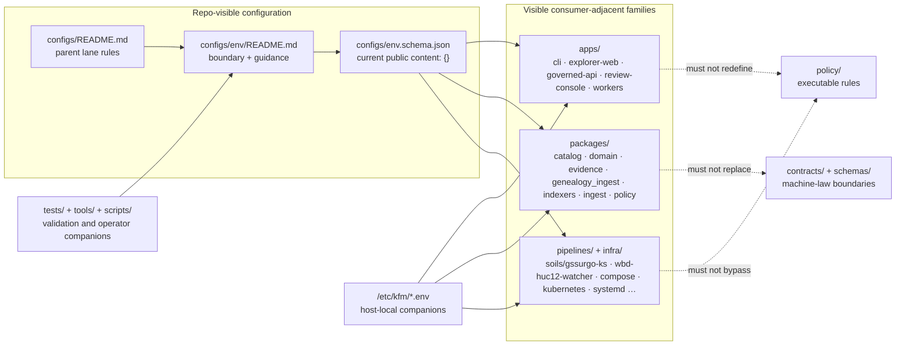

<!-- [KFM_META_BLOCK_V2]
doc_id: kfm://doc/NEEDS_VERIFICATION
title: configs/env
type: standard
version: v1
status: draft
owners: @bartytime4life
created: YYYY-MM-DD
updated: YYYY-MM-DD
policy_label: NEEDS VERIFICATION
related: [../README.md, ../env.schema.json, ../deployment/README.md, ../observability/README.md, ../security/README.md, ../ui/README.md, ../../apps/README.md, ../../packages/README.md, ../../pipelines/, ../../infra/README.md, ../../tests/README.md, ../../tools/README.md, ../../scripts/README.md, ../../policy/README.md, ../../contracts/README.md, ../../schemas/README.md]
tags: [kfm, config, env]
notes: [Current public main confirms configs/env/README.md plus sibling configs/env.schema.json={}, while actual env loaders, checked-in example files, and workflow enforcement depth still need verification.]
[/KFM_META_BLOCK_V2] -->

# configs/env

_Repo-visible environment wiring for KFM runtimes: non-secret, diffable, and explicitly subordinate to contracts, policy, review, release state, and correction discipline._

> Status: experimental · current public `main` lane is README-only · repo-grounded README revision  
> Owners: `@bartytime4life` (via current `/configs/` CODEOWNERS coverage; no narrower `/configs/env/` rule was directly verified on public `main`)  
> Path: `configs/env/README.md`  
> Current public tree state: `configs/env/` currently shows `README.md` only; sibling `configs/env.schema.json` exists and current public content is `{}`  
>         
> Repo fit: child lane of [`../README.md`](../README.md) · schema anchor [`../env.schema.json`](../env.schema.json) · consumer families [`../../apps/README.md`](../../apps/README.md), [`../../packages/README.md`](../../packages/README.md), [`../../pipelines/`](../../pipelines/), [`../../infra/README.md`](../../infra/README.md) · verification companions [`../../tests/README.md`](../../tests/README.md), [`../../tools/README.md`](../../tools/README.md), [`../../scripts/README.md`](../../scripts/README.md) · law-bearing neighbors [`../../policy/README.md`](../../policy/README.md), [`../../contracts/README.md`](../../contracts/README.md), [`../../schemas/README.md`](../../schemas/README.md)  
> Quick jump: [Scope](#scope) · [Repo fit](#repo-fit) · [Accepted inputs](#accepted-inputs) · [Exclusions](#exclusions) · [Directory tree](#directory-tree) · [Quickstart](#quickstart) · [Usage](#usage) · [Diagram](#diagram) · [Reference tables](#reference-tables) · [Task list](#task-list) · [FAQ](#faq) · [Appendix](#appendix)

> [!IMPORTANT]
> Current public `main` now confirms that `configs/env/` is a real subtree and that `configs/env.schema.json` exists one level up.
>
> The public gap is no longer lane existence. The gap is execution depth: actual checked-in env examples, populated schema rules, concrete loader code, and active workflow enforcement.

> [!WARNING]
> `configs/env/` is not a second contract lane, not a second policy engine, and not a place for live credentials.

* * *

## Scope

`configs/env/` is the review surface for non-secret environment wiring in KFM.

In practice, that means variable names, grouping, process-start defaults, precedence notes, validation anchors, and host-local companion guidance for runtime surfaces that boot from environment values. It does **not** mean secrets, policy decisions, contract semantics, or ad hoc business logic disguised as configuration.

### Truth posture used in this README

| Label | Meaning here |
| --- | --- |
| **CONFIRMED** | Current public `main` shows `configs/env/README.md`, sibling `configs/env.schema.json`, and a broader `configs/` subtree with `deployment/`, `env/`, `observability/`, `security/`, and `ui/` alongside it. |
| **INFERRED** | Visible app, package, pipeline, and infra families strongly suggest where environment wiring will be consumed, but they do not by themselves prove actual loader code or concrete key names. |
| **PROPOSED** | Starter example files, key families, precedence rules, and validation steps that fit KFM doctrine and the current repo shape. |
| **UNKNOWN** | Exact env loaders, branch-local additions, real workflow enforcement depth, and mounted runtime behavior not directly proven on current public `main`. |
| **NEEDS VERIFICATION** | UUID, git-history dates, policy label, actual checked-in env examples, and the repo’s final single-authority decision for machine-law schema placement. |

### Boundary rule

Environment configuration in KFM should answer one narrow question: **how a process is wired to run**.

It must not silently redefine:

- policy outcomes
- contract meaning
- review or release state
- citation or correction obligations

[Back to top](#configsenv)

* * *

## Repo fit

### Path and neighboring lanes

| Item | Status | Role here |
| --- | --- | --- |
| [`../README.md`](../README.md) | **CONFIRMED** | Parent config contract for repo-visible, non-secret configuration surfaces. |
| [`../env.schema.json`](../env.schema.json) | **CONFIRMED** | Shared environment validation anchor; current public content is still a placeholder `{}`. |
| [`../deployment/README.md`](../deployment/README.md) | **CONFIRMED** | Companion lane for rollout-facing parameterization and environment-profile guidance. |
| [`../observability/README.md`](../observability/README.md) | **CONFIRMED** | Companion lane for collector/exporter and trace/log/metric configuration. |
| [`../security/README.md`](../security/README.md) | **CONFIRMED** | Companion lane for non-secret security thresholds and scan-facing settings. |
| [`../ui/README.md`](../ui/README.md) | **CONFIRMED** | Companion lane for declarative shell and renderer defaults that should not be hidden in env files. |
| [`../../apps/README.md`](../../apps/README.md) | **CONFIRMED** | Runtime-facing app boundary; visible current public child lanes are `cli/`, `explorer-web/`, `governed-api/`, `review-console/`, and `workers/`. |
| [`../../packages/README.md`](../../packages/README.md) | **CONFIRMED** | Shared internal modules; visible current public child lanes include `catalog/`, `domain/`, `evidence/`, `genealogy_ingest/`, `indexers/`, `ingest/`, and `policy/`. |
| [`../../pipelines/`](../../pipelines/) | **CONFIRMED path / INFERRED consumption** | Pipeline-facing execution family; visible current public child lanes include `soils/gssurgo-ks/` and `wbd-huc12-watcher/`. |
| [`../../infra/README.md`](../../infra/README.md) | **CONFIRMED** | Bring-up, deployment, runtime control, and exposure management surface; visible current public child lanes include `compose/`, `kubernetes/`, `systemd/`, `local/`, and related operational lanes. |
| [`../../tests/README.md`](../../tests/README.md) · [`../../tools/README.md`](../../tools/README.md) · [`../../scripts/README.md`](../../scripts/README.md) | **CONFIRMED** | Verification, tooling, and operator-entrypoint companions for any future env validation wiring. |
| [`../../policy/README.md`](../../policy/README.md) | **CONFIRMED** | Executable policy belongs there, not here. |
| [`../../contracts/README.md`](../../contracts/README.md) | **CONFIRMED** | Machine-readable contract backbone and trust-object boundary. |
| [`../../schemas/README.md`](../../schemas/README.md) | **CONFIRMED** | Live schema subtree exists, but canonical schema-home authority remains unresolved at the repo level. |

### Working interpretation

This lane should stay boring on purpose.

`configs/env/` is where contributors can review environment wiring without hunting through app code, manifests, or private host files. The stronger seams remain unchanged:

- config parameterizes runtime
- contracts define machine-readable shapes
- policy decides
- tests and tools verify
- infra deploys
- review and release artifacts carry outward trust

[Back to top](#configsenv)

* * *

## Accepted inputs

| Input type | Current public state | What belongs here |
| --- | --- | --- |
| `README.md` | **CONFIRMED** | Boundary guidance, precedence notes, key-family documentation, and host-local companion rules. |
| Non-secret example files such as `*.env.example` | **PROPOSED** | Safe starter values, comments, and documented placeholders only. |
| Environment key registry | **PROPOSED** | Key name, purpose, consuming lane, required/optional status, secret/no, and verification notes. |
| Validation expectations | **INFERRED / PROPOSED** | References to `env.schema.json`, test helpers, validator commands, and proof expectations. |
| Host-local companion guidance | **CONFIRMED pattern / PROPOSED mapping detail** | Documented pointer to local secret-bearing companions such as `/etc/kfm/*.env`, never the secret material itself. |
| Consumer ownership notes | **PROPOSED** | Which app, package, pipeline, worker, or infra lane actually consumes a key. |

### Good-fit checklist

A value is a good fit for this directory when all of the following are true:

- it changes wiring, not doctrine
- it is safe to keep in Git
- it can point to a named consumer
- it can be validated or reviewed
- it does not become a hidden exception path around policy or release state

## Exclusions

| Do not keep here | Put it instead | Why |
| --- | --- | --- |
| Credentials, tokens, private keys, live DSNs with secrets | Host-local files or secret-manager surfaces such as `/etc/kfm/*.env` | `configs/` is intentionally repo-visible and non-secret. |
| Executable policy logic, deny/allow rules, reason or obligation grammars | [`../../policy/README.md`](../../policy/README.md) | Policy must stay explicit, testable, and separately reviewable. |
| Machine-readable trust objects, request/response contracts, release proof objects | [`../../contracts/README.md`](../../contracts/README.md) | Environment wiring must not replace formal contract surfaces. |
| Duplicate schema authority for trust-bearing objects | The repo’s authoritative `contracts/` / `schemas/` decision once verified | `configs/` must not become a third machine-law home. |
| Pipeline orchestration logic or watcher behavior | [`../../pipelines/`](../../pipelines/) or runtime/package surfaces | Config may parameterize execution, but should not become execution logic. |
| UI presentation defaults that are really shell behavior | [`../ui/README.md`](../ui/README.md) | Declarative presentation belongs in the UI config lane first. |
| Generated exports, cache files, runtime state | Derived runtime locations, not Git | Reviewable config should stay intentional and stable. |
| “Temporary” flags that weaken citation, review, correction, or publication discipline | Do not add without explicit architecture review | Hidden trust exceptions age badly and are hard to audit. |

> [!CAUTION]
> A committed `.env` file with live credentials is both a security failure and a documentation failure.

[Back to top](#configsenv)

* * *

## Directory tree

### Current public snapshot

```text
configs/
├── README.md
├── env.schema.json                  # current public content: {}
├── deployment/
│   └── README.md
├── env/
│   └── README.md
├── observability/
│   └── README.md
├── security/
│   └── README.md
└── ui/
    └── README.md
```

### `configs/env/` current public snapshot

```text
configs/env/
└── README.md
```

### Safe next shape (PROPOSED)

Adopt this only together with schema, consumer, and validation updates in the same change set.

```text
configs/
├── env.schema.json
└── env/
    ├── README.md
    ├── shared.env.example
    ├── governed-api.env.example
    ├── workers.env.example
    ├── cli.env.example
    └── profiles/
        ├── local.env.example
        ├── stage.env.example
        └── prod.env.example
```

### Naming guidance

- Commit examples, never secrets.
- Split **service** concerns from **profile** concerns.
- Prefer exact consumer names over generic catch-all files.
- Add `review-console` or `explorer-web` examples here only if the need is truly process-start environment wiring rather than declarative UI configuration.

[Back to top](#configsenv)

* * *

## Quickstart

Run these from a checked-out repo clone.

```bash
# 1) Inspect the current env lane
find configs/env -maxdepth 2 -type f | sort
cat configs/env.schema.json

# 2) Read the parent config contract and adjacent lanes
sed -n '1,220p' configs/README.md
find configs -maxdepth 2 -name README.md | sort

# 3) Inspect visible consumer-adjacent families before naming any new key
find apps packages pipelines infra -maxdepth 2 -mindepth 1 -type d | sort

# 4) Search for existing KFM_* usage before inventing a new variable
git grep -nE '\bKFM_[A-Z0-9_]+\b' -- . ':!node_modules' ':!dist' ':!build'

# 5) Search for likely environment loader surfaces
git grep -nE 'dotenv|EnvironmentFile|env_file|ConfigMap|Secret|process\.env|os\.getenv|getenv' \
  -- apps packages pipelines infra scripts tools
```

> [!TIP]
> Grep before naming. This lane should stabilize meaning, not multiply near-duplicates.

* * *

## Usage

### Current public reality

Current public `main` proves three things that this README should now reflect plainly:

1. `configs/env/` exists as a real repo subtree.
2. The subtree is currently `README.md` only.
3. The shared anchor `configs/env.schema.json` exists, but its current public content is still `{}`.

That means the public tree now proves **lane existence**, but it does **not** yet prove:

- checked-in example env files
- populated environment schema rules
- actual env loader code
- live CI enforcement depth

### Working contract for additions

Use this lane conservatively:

1. Document the key or key family here.
2. Name the expected consumer explicitly.
3. Add or update `../env.schema.json`.
4. Add only a non-secret example if it is safe to commit.
5. Keep host-local or secret-bearing values outside the repo.
6. Add verification references in `tests/`, `tools/`, or `scripts/`, and only claim workflow enforcement once it is directly verified.
7. Fail closed when required trust-bearing variables are missing or malformed.

### Precedence model

| Layer | Purpose | Secret-bearing? | Current status |
| --- | --- | ---: | --- |
| `../env.schema.json` | Shared shape and early validation anchor | No | **CONFIRMED file / placeholder content** |
| `configs/env/*.env.example` | Reviewable starter values and commentary | No | **PROPOSED** |
| Host-local companion files such as `/etc/kfm/*.env` | Secret-bearing or machine-local runtime values | Yes | **CONFIRMED documented pattern** |
| Process environment / orchestrator injection | Final runtime override | Maybe | **INFERRED / NEEDS VERIFICATION per consumer** |

> [!NOTE]
> Parent `configs/README.md` already documents host-local runtime examples such as `/etc/kfm/kfm-api.env`, `/etc/kfm/kfm-worker.env`, `/etc/kfm/kfm-publish.env`, and `/etc/kfm/ollama.override.env`. Treat those as documented runtime patterns, not as proof that this lane’s checked-in example filenames are already settled.

### Service/profile split

| Axis | Example values | Rule |
| --- | --- | --- |
| **Service** | `governed-api`, `workers`, `cli` | Names the process or lane that consumes the value. |
| **Profile** | `local`, `stage`, `prod` | Changes wiring and operating context, not policy or contract meaning. |

A profile may change endpoints, bind scope, or runtime roots. It must not silently change trust law.

### Validation posture

Schema validation is the minimum floor, not the whole contract.

- the shape should be machine-checkable
- example files should validate cleanly once they exist
- missing required values should fail startup or deployment checks instead of degrading silently
- keys that affect public-surface behavior, evidence routing, or review burden deserve architecture review
- workflow claims should stay **PROPOSED** until actual workflow YAML or direct branch verification proves them

> [!NOTE]
> Current public `main` still shows `.github/workflows/` as `README.md` only. Treat CI enforcement claims with that boundary in mind.

[Back to top](#configsenv)

* * *

## Diagram


```mermaid
flowchart LR
    subgraph Repo["Repo-visible configuration"]
        R["configs/env/README.md<br/>boundary + guidance"]
        S["configs/env.schema.json<br/>current public content: {}"]
        C["configs/README.md<br/>parent lane rules"]
    end

    subgraph Consumers["Visible consumer-adjacent families"]
        A["apps/<br/>cli · explorer-web · governed-api · review-console · workers"]
        P["packages/<br/>catalog · domain · evidence · genealogy_ingest · indexers · ingest · policy"]
        X["pipelines/ + infra/<br/>soils/gssurgo-ks · wbd-huc12-watcher · compose · kubernetes · systemd …"]
    end

    V["tests/ + tools/ + scripts/<br/>validation and operator companions"]
    H["/etc/kfm/*.env<br/>host-local companions"]
    Pol["policy/<br/>executable rules"]
    Con["contracts/ + schemas/<br/>machine-law boundaries"]

    C --> R
    R --> S
    S --> A
    S --> P
    S --> X
    H --> A
    H --> P
    H --> X
    V --> R

    A -. must not redefine .-> Pol
    P -. must not replace .-> Con
    X -. must not bypass .-> Pol
```

* * *

## Reference tables

### What lives here vs elsewhere

| Concern | Correct home | Why |
| --- | --- | --- |
| Non-secret starter env values | `configs/env/` | Reviewable wiring guidance and examples. |
| Shared env validation anchor | `configs/env.schema.json` | Explicit early validation surface for environment-shaped config. |
| Host-local secrets | `/etc/kfm/*.env` or a secret manager | Keep secret-bearing values outside the repo. |
| Executable policy logic | `policy/` | Machine-law belongs in the policy lane. |
| Trust-bearing request/response or release objects | `contracts/` | Wiring should not masquerade as formal contract law. |
| Schema families under live repo inventory | `schemas/` plus the repo’s eventual canonical authority decision | Current public tree is richer than before, but authority still needs verification. |
| UI shell defaults | `configs/ui/` | Presentation behavior should stay declarative and legible. |
| Pipeline logic and watcher orchestration | `pipelines/` or runtime/package code | Environment config may parameterize execution, but should not become the execution engine. |

### Current visible consumer-adjacent families

These rows are grounded in current public directory names. They prove likely consumption surfaces, not actual environment loader code.

| Family | Current visible child lanes | What that proves | What it does not prove |
| --- | --- | --- | --- |
| `apps/` | `cli/`, `explorer-web/`, `governed-api/`, `review-console/`, `workers/` | Runtime-facing app families exist on public `main`. | Exact env loaders, key names, or secret handling. |
| `packages/` | `catalog/`, `domain/`, `evidence/`, `genealogy_ingest/`, `indexers/`, `ingest/`, `policy/` | Shared internal module families exist. | Which packages parse env directly. |
| `pipelines/` | `soils/gssurgo-ks/`, `wbd-huc12-watcher/` | Pipeline-facing execution surfaces exist. | That pipeline orchestration or watcher behavior should be documented here. |
| `infra/` | `backup/`, `compose/`, `dashboards/`, `gitops/`, `hosted/`, `kubernetes/`, `local/`, `monitoring/`, `systemd-or-compose/`, `systemd/`, `terraform/` | Deployment and runtime-control families exist. | The exact file or platform that injects each env value. |

### Illustrative key families (PROPOSED / not current public inventory)

The names below are starter placeholders only. Do not claim they already exist until the repo proves it.

| Family | Illustrative keys | Likely consumer family | Secret-bearing? | Status |
| --- | --- | --- | ---: | --- |
| Bind / exposure | `KFM_BIND` | `apps/governed-api/`, `apps/workers/` | No | PROPOSED |
| Artifact / policy roots | `KFM_ARTIFACT_ROOT`, `KFM_POLICY_DIR` | `apps/`, `packages/`, `pipelines/`, `infra/` | No | PROPOSED |
| Database reachability | `KFM_DB_DSN` | `apps/governed-api/`, `apps/workers/`, `pipelines/` | Maybe | PROPOSED |
| Local model adapter | `KFM_MODEL_ADAPTER_URL` | `apps/governed-api/` | No | PROPOSED |
| Public-surface safety | `KFM_PUBLISHED_ONLY`, `KFM_CITATIONS_REQUIRED` | `apps/governed-api/`, `packages/policy/` | No | PROPOSED |
| CLI/API targeting | `KFM_API_BASE_URL` | `apps/cli/` | No | PROPOSED |

> [!NOTE]
> If a variable changes trust posture, route exposure, correction behavior, or evidence requirements, it is not “just config.”

[Back to top](#configsenv)

* * *

## Task list

### Definition of done for this lane

- [ ] Retire stale “PDF-only / mounted repo verification pending” wording; current public `main` already proves the lane exists.
- [ ] Replace the placeholder `{}` in `../env.schema.json` with a first real, machine-checkable env schema.
- [ ] Keep `doc_id`, `created`, `updated`, and `policy_label` aligned with verified repo metadata once that metadata is available.
- [ ] Add only non-secret `*.env.example` files.
- [ ] Name the owning consumer for every documented key or key family.
- [ ] Verify real loaders before publishing actual variable names: start with visible public families under `apps/`, `packages/`, `pipelines/`, and `infra/`.
- [ ] Decide how env-related schema references should point into the broader `contracts/` / `schemas/` authority split without creating duplicate law.
- [ ] Wire validator references through `tests/`, `tools/`, and `scripts/`; claim workflow enforcement only after direct verification.
- [ ] Keep host-local companion guidance consistent with the parent `configs/README.md` runtime pattern.
- [ ] Confirm fail-closed startup or deploy behavior for required trust-bearing variables.
- [ ] Remove duplicate or competing definitions between `configs/env/`, `configs/deployment/`, `configs/ui/`, `configs/security/`, and any consumer-local docs.

### Review triggers

Open review whenever a change:

- introduces a new `KFM_*` key
- changes bind scope, publication scope, or citation behavior
- adds or removes a service/profile split
- moves a value between repo-visible and host-local storage
- changes how a runtime finds policy, evidence, database, model-adapter, or pipeline roots
- makes a claim about CI enforcement, runtime loading, or schema authority that is not directly reverified

[Back to top](#configsenv)

* * *

## FAQ

### What does current public `main` actually prove?

It proves that `configs/env/README.md` exists, that `configs/env/` is currently README-only, and that `configs/env.schema.json` exists one level up with placeholder content `{}`. It does not prove populated example files, concrete loader code, or active workflow enforcement.

### Why is the schema one level up?

Because current public `main` places the shared env anchor at `configs/env.schema.json`. That settles the visible path. It does not yet settle the repo’s final contract-versus-schema authority question.

### Why not keep secrets here?

Because this lane is meant to stay repo-visible, reviewable, and non-secret. Secret-bearing values belong in host-local companion files or secret-manager surfaces.

### Can environment variables change policy or contract meaning?

No. They can wire endpoints, paths, roots, and startup toggles. They must not replace executable policy, formal contract semantics, review state, or correction discipline.

### Why mention both `contracts/` and `schemas/`?

Because the current public repo visibly contains both lanes. Public docs also keep canonical machine-law authority unresolved, so this README should not pretend the split is settled when it is not.

### Should UI-facing surfaces use env files or `configs/ui/`?

Use `configs/ui/` first for declarative shell behavior and presentation defaults. Use `configs/env/` only when a process-start environment variable is truly the right fit.

### Should pipeline-only values live here?

Only when they are truly process-start configuration and can be named, reviewed, and validated as such. Pipeline logic, watcher behavior, and orchestration semantics still belong in stronger execution surfaces.

[Back to top](#configsenv)

* * *

## Appendix

<details>
<summary><strong>Illustrative starter fragments (PROPOSED / not current public inventory)</strong></summary>

### `shared.env.example`

```dotenv
# Non-secret starter values only
KFM_ARTIFACT_ROOT=/srv/kfm
KFM_POLICY_DIR=/etc/kfm/policy
KFM_PUBLISHED_ONLY=true
KFM_CITATIONS_REQUIRED=true
```

### `governed-api.env.example`

```dotenv
# API-facing, non-secret starter values
KFM_BIND=127.0.0.1:8080
KFM_MODEL_ADAPTER_URL=http://127.0.0.1:11434

# Prefer loopback or socket forms in examples; never commit credentials
KFM_DB_DSN=unix:///var/run/postgresql/.s.PGSQL.5432
```

### `workers.env.example`

```dotenv
KFM_ARTIFACT_ROOT=/srv/kfm
KFM_POLICY_DIR=/etc/kfm/policy
KFM_DB_DSN=unix:///var/run/postgresql/.s.PGSQL.5432
```

### `cli.env.example`

```dotenv
KFM_API_BASE_URL=http://127.0.0.1:8080
KFM_CITATIONS_REQUIRED=true
```

### Review prompts

- Does this key change wiring only, or is it smuggling in business meaning?
- Is the value safe to commit?
- Is the consumer named explicitly?
- Is `env.schema.json` updated in the same change?
- Is the failure mode visible and fail-closed?
- Does the change belong here, or should it live in `deployment/`, `ui/`, `security/`, `policy/`, `contracts/`, `schemas/`, or a host-local surface instead?

</details>

[Back to top](#configsenv)
