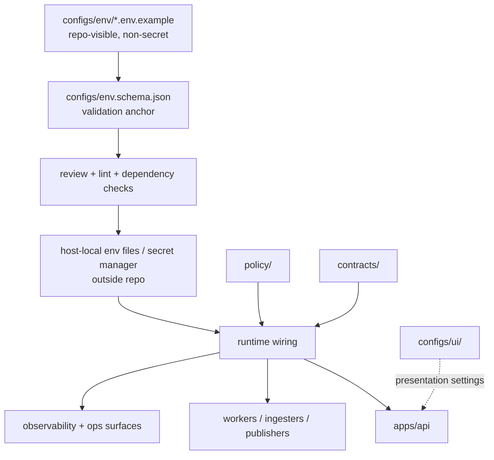

# configs/env

Repo-visible environment wiring for KFM runtimes—non-secret, reviewable, and explicitly subordinate to contracts, policy, and governed truth-path rules.

> **Repo fit:** `configs/env/README.md` · Upstream: [`../README.md`](../README.md), [`../env.schema.json`](../env.schema.json) · Downstream: [`../../apps/`](../../apps/), [`../../packages/`](../../packages/), [`../../infra/`](../../infra/), [`../../policy/`](../../policy/), [`../../contracts/`](../../contracts/)
>
> **Status:** experimental  
> **Owners:** NEEDS VERIFICATION  
>     
>
> **Quick jumps:** [Scope](#scope) · [Repo fit](#repo-fit) · [Accepted inputs](#accepted-inputs) · [Exclusions](#exclusions) · [Directory tree](#directory-tree) · [Quickstart](#quickstart) · [Usage](#usage) · [Diagram](#diagram) · [Config tables](#config-tables) · [Task list](#task-list) · [FAQ](#faq)

> [!IMPORTANT]
> **Current state**
>
> This lane is still scaffold-level.
>
> - `configs/env/` should be treated as a directory contract, not as proof of landed runtime wiring.
> - `../env.schema.json` is the intended validation anchor, but it still needs real contract content.
> - Secret-bearing environment files belong outside the repo boundary.

## Scope

`configs/env/` is the repo-visible lane for **environment contracts**: names, grouping, review rules, example shapes, validation expectations, and operator guidance for runtime wiring.

It is **not** the place for credentials, policy logic, request/response contracts, or ad hoc business rules disguised as environment variables.

| Truth posture | What it means here |
|---|---|
| **CONFIRMED** | `configs/` is the non-secret configuration lane, this directory exists, and `../env.schema.json` is the shared env validation anchor. |
| **PROPOSED** | The file layout, precedence model, example files, and starter key groups below. |
| **NEEDS VERIFICATION** | Mounted loaders, CI validators, supervisor/container wiring, and exact deployed filenames. |

[Back to top](#configsenv)

## Repo fit

This directory sits inside the broader `configs/` lane and should stay aligned with the adjacent configuration surfaces rather than growing its own private conventions.

| Neighbor | Relationship |
|---|---|
| [`../README.md`](../README.md) | Parent config doctrine: non-secret, reviewable, and bounded by trust seams. |
| [`../env.schema.json`](../env.schema.json) | Shared validation anchor for env-shaped config. |
| [`../ui/`](../ui/) | UI and renderer settings belong there, not here. |
| [`../observability/`](../observability/) | Collector, metrics, traces, and logging defaults belong there, though env may point at them. |
| [`../../policy/`](../../policy/) | Machine-law and decision logic live there; env may point to policy bundles but must not redefine policy. |
| [`../../contracts/`](../../contracts/) | Contract shapes belong there; env chooses wiring, not payload meaning. |
| [`../../apps/`](../../apps/) / [`../../packages/`](../../packages/) / [`../../infra/`](../../infra/) | Runtime consumers and materializers of the variables documented here. |

### Working rule

Keep `configs/env/` focused on **how a process is wired**, not **what the process is allowed to mean**.

## Accepted inputs

The following belong here:

- non-secret `*.env.example` files or equivalent starter templates
- grouped key registries for service classes such as API, worker, and publish jobs
- path, bind, toggle, and adapter variables that are safe to review in Git
- comments describing precedence, defaults, override rules, and fail-closed behavior
- schema-backed validation expectations mirrored into [`../env.schema.json`](../env.schema.json)
- operator notes about what must stay host-local or secret-managed

## Exclusions

The following do **not** belong here:

- real secrets, tokens, private keys, certificate material, or credential-bearing production values
- policy logic, obligation rules, rights decisions, or review gates
- request/response schemas, JSON contract bodies, or catalog payload definitions
- runtime-generated `.env` files copied from live hosts
- UI presentation defaults that belong in [`../ui/`](../ui/)
- “temporary” flags that weaken `published-only`, citation, review, or correction posture

> [!CAUTION]
> A committed env file containing real credentials is both a security failure and a documentation failure. Keep secret-bearing values out of repo content and inject them host-locally or through the deployment platform.

[Back to top](#configsenv)

## Directory tree

### Observed now

```text
configs/
├─ env/
│  └─ README.md
└─ env.schema.json
```

### Recommended working shape (PROPOSED)

Adopt this only together with schema, loader, and review updates.

```text
configs/
├─ env/
│  ├─ README.md
│  ├─ shared.env.example
│  ├─ api.env.example
│  ├─ worker.env.example
│  ├─ publish.env.example
│  └─ profiles/
│     ├─ dev.env.example
│     ├─ stage.env.example
│     └─ prod.env.example
└─ env.schema.json
```

### Naming guidance

- Use committed files only for **safe examples**.
- Keep **service** and **profile** axes separate.
- Prefer stable names over clever names.
- If the repo later chooses a different layout, update this README and `../env.schema.json` in the same change.

## Quickstart

```bash
# Inspect the live lane
find configs/env -maxdepth 3 -type f | sort

# Inspect the shared validation anchor
cat configs/env.schema.json

# Find existing KFM_* usage before adding new keys
git grep -nE '\bKFM_[A-Z0-9_]+\b' -- . ':!node_modules' ':!dist' ':!build'

# Find likely loader/materialization points
git grep -nE 'dotenv|EnvironmentFile|env_file|ConfigMap|Secret|process\.env|os\.getenv' \
  apps packages infra .github configs

# Review adjacent config lanes for overlap
find configs -maxdepth 2 -name README.md | sort
```

> [!TIP]
> Before adding a new key, grep first. `configs/env/` should stabilize names that already matter, not multiply near-duplicates.

## Usage

### Loading model (PROPOSED)

Use a layered model that keeps reviewable examples in Git and secret-bearing values outside it.

1. Define or update the key in this README.
2. Add or update validation in [`../env.schema.json`](../env.schema.json).
3. Add a non-secret example value in `configs/env/*.env.example` if safe.
4. Inject secret-bearing or host-specific values outside repo content.
5. Load values into the runtime through the supervisor, container platform, or orchestration layer.
6. Fail closed when required trust-bearing variables are absent or malformed.

### Precedence model (PROPOSED)

| Layer | Purpose | Secret-bearing? | Notes |
|---|---|---:|---|
| `../env.schema.json` | Validation anchor | No | Required whenever shape changes. |
| `configs/env/*.env.example` | Reviewable starter values | No | Git-visible, explanatory, safe to commit. |
| Host-local files such as `/etc/kfm/*.env` | Service-specific runtime values | Yes | Keep outside repo content. |
| Process environment / orchestrator injection | Final runtime override | Maybe | Use sparingly and document it. |

### Service/profile split

Keep these two concerns separate:

| Axis | Examples | Rule |
|---|---|---|
| **Service** | `api`, `worker`, `publish` | Documents which process consumes the key. |
| **Profile** | `dev`, `stage`, `prod` | Adjusts wiring, never doctrine. |

A profile may alter endpoints, paths, or bind scope. It must **not** silently alter KFM invariants.

## Diagram


```mermaid
flowchart TD
    A["configs/env/*.env.example<br/>repo-visible, non-secret"] --> B["configs/env.schema.json<br/>validation anchor"]
    B --> C["review + lint + dependency checks"]

    C --> D["host-local env files / secret manager<br/>outside repo"]
    D --> E["runtime wiring"]

    P["policy/"] --> E
    K["contracts/"] --> E

    E --> API["apps/api"]
    E --> W["workers / ingesters / publishers"]
    E --> O["observability + ops surfaces"]

    UI["configs/ui/"] -. presentation settings .-> API
```

## Config tables

### What lives here vs elsewhere

| Concern | Correct home | Why |
|---|---|---|
| Non-secret starter env values | `configs/env/` | Reviewable, documented, safe to commit. |
| Secret-bearing runtime values | Host-local files or secret manager | Must stay out of repo content. |
| Env validation rules | [`../env.schema.json`](../env.schema.json) | Shared anchor, one lane of truth. |
| Policy decision logic | [`../../policy/`](../../policy/) | Machine-law belongs there. |
| Contract shapes and payload schemas | [`../../contracts/`](../../contracts/) | Env wiring must not replace formal contracts. |
| UI presentation defaults | [`../ui/`](../ui/) | Different responsibility seam. |
| Generated runtime exports | Runtime artifacts, not Git | Derived, environment-specific output. |

### Illustrative key families

The exact names below are **starter keys**, not proof of mounted implementation.

| Family | Illustrative keys | Purpose | Secret-bearing? | Status |
|---|---|---|---:|---|
| Bind / exposure | `KFM_BIND` | Approved listening scope for a service | No | PROPOSED |
| Paths / storage | `KFM_ARTIFACT_ROOT`, `KFM_POLICY_DIR` | Point runtimes at governed filesystem roots | No | PROPOSED |
| Database access | `KFM_DB_DSN` | Prefer socket or loopback DB reachability | Maybe | PROPOSED |
| Model adapter | `KFM_MODEL_ADAPTER_URL` | Local or governed model endpoint | No | PROPOSED |
| Public-surface safety | `KFM_PUBLISHED_ONLY`, `KFM_CITATIONS_REQUIRED` | Preserve fail-closed public behavior | No | PROPOSED |

> [!NOTE]
> If a variable changes trust posture, route exposure, review burden, or correction behavior, treat it as a design review item rather than “just config.”

[Back to top](#configsenv)

## Task list

### Definition of done for this lane

- [ ] Replace the owners placeholder with confirmed ownership.
- [ ] Turn [`../env.schema.json`](../env.schema.json) into a real first-wave schema.
- [ ] Add only non-secret `*.env.example` files.
- [ ] Verify actual loaders in `apps/`, `packages/`, and `infra/`.
- [ ] Add CI validation for committed examples against the schema.
- [ ] Confirm fail-closed startup behavior for missing or malformed required keys.
- [ ] Link deployment/runbook material that explains where host-local files actually live.
- [ ] Remove any duplicate key definitions that drift from this README.

### Review triggers

Open review when a change:

- introduces a new `KFM_*` key
- changes bind scope, publication scope, or citation requirements
- adds a new service class or profile class
- moves a value from repo-visible to host-local or the reverse
- changes how the runtime finds policy, evidence, database, or model-adapter paths

## FAQ

### Why is the real `.env` file not committed?

Because this lane is for **reviewable examples**, not secret-bearing runtime state.

### Why is the schema one level up?

Because the current config doctrine points to a **shared** env validation anchor. Until the repo proves a better split, keep the schema centralized and the examples local.

### Can environment variables change policy or contract meaning?

They can wire paths, endpoints, or toggles. They must not silently replace policy, redefine contracts, or bypass review state.

### Where do UI flags go?

Use [`../ui/`](../ui/) for renderer, shell, and presentation defaults unless the flag is truly process-wide environment wiring.

### How do I add a new variable correctly?

Update this README, update [`../env.schema.json`](../env.schema.json), add a safe example if appropriate, verify the loader, and add or update tests and runbooks in the same change.

### Can local development be looser than production?

It can be wired differently. It should not break doctrine. Local convenience must not become a stealth exception path.

[Back to top](#configsenv)

## Appendix

<details>
<summary><strong>Starter example sketches (PROPOSED)</strong></summary>

### `shared.env.example`

```dotenv
# Non-secret starter values only
KFM_ARTIFACT_ROOT=/srv/kfm
KFM_POLICY_DIR=/etc/kfm/policy
KFM_PUBLISHED_ONLY=true
KFM_CITATIONS_REQUIRED=true
```

### `api.env.example`

```dotenv
# API-specific, non-secret starter values
KFM_BIND=127.0.0.1:8080
KFM_MODEL_ADAPTER_URL=http://127.0.0.1:11434

# Prefer socket or loopback DB access; do not commit credential-bearing DSNs
KFM_DB_DSN=unix:///var/run/postgresql/.s.PGSQL.5432
```

### `worker.env.example`

```dotenv
KFM_ARTIFACT_ROOT=/srv/kfm
KFM_POLICY_DIR=/etc/kfm/policy
KFM_DB_DSN=unix:///var/run/postgresql/.s.PGSQL.5432
```

### `publish.env.example`

```dotenv
KFM_PUBLISHED_ONLY=true
KFM_CITATIONS_REQUIRED=true
KFM_ARTIFACT_ROOT=/srv/kfm
```

### Review prompts

- Does this key alter wiring only, or does it smuggle in business meaning?
- Is the value safe to commit?
- Is the schema updated?
- Is the failure mode explicit?
- Does the runtime surface stale/missing/denied states clearly?

</details>

[Back to top](#configsenv)
