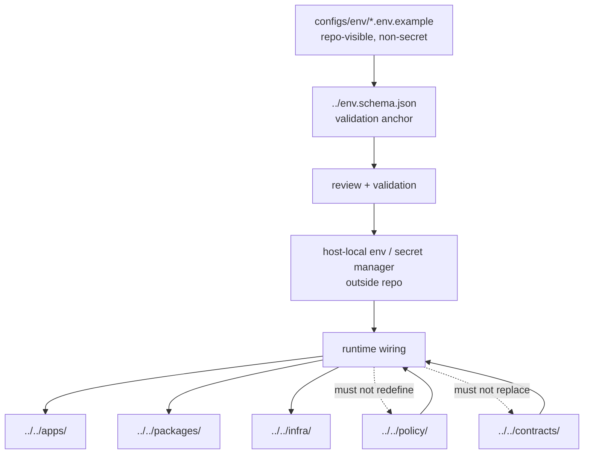

<!-- [KFM_META_BLOCK_V2]
doc_id: kfm://doc/NEEDS_VERIFICATION
title: configs/env
type: standard
version: v1
status: draft
owners: NEEDS VERIFICATION
created: YYYY-MM-DD
updated: YYYY-MM-DD
policy_label: NEEDS VERIFICATION
related: [../README.md, ../env.schema.json, ../../apps/, ../../packages/, ../../infra/, ../../policy/, ../../contracts/]
tags: [kfm, config, env]
notes: [Task-provided target path and related links retained; mounted repo verification pending in the current session.]
[/KFM_META_BLOCK_V2] -->

# configs/env

Repo-visible environment wiring for KFM runtimes—non-secret, reviewable, and explicitly subordinate to contracts, policy, and governed truth-path rules.

> **Status:** experimental  
> **Owners:** NEEDS VERIFICATION  
>       
> **Repo fit:** `configs/env/README.md` *(task-provided target path; mounted repo verification pending)* · Upstream: [`../README.md`](../README.md), [`../env.schema.json`](../env.schema.json) · Downstream: [`../../apps/`](../../apps/), [`../../packages/`](../../packages/), [`../../infra/`](../../infra/), [`../../policy/`](../../policy/), [`../../contracts/`](../../contracts/)  
> **Quick jumps:** [Scope](#scope) · [Repo fit](#repo-fit) · [Accepted inputs](#accepted-inputs) · [Exclusions](#exclusions) · [Directory tree](#directory-tree) · [Quickstart](#quickstart) · [Usage](#usage) · [Diagram](#diagram) · [Config tables](#config-tables) · [Task list](#task-list) · [FAQ](#faq) · [Appendix](#appendix)

> [!IMPORTANT]
> **Current session posture**
>
> This README is grounded in the March 2026 KFM doctrinal corpus plus repo-grounded summary artifacts, not a mounted repository checkout.
>
> - Treat the pathing below as the requested repo target, not as proof that every linked path is currently present.
> - Treat `configs/env/` as a documentation-first contract surface until the repo tree, schema files, loaders, and CI gates are directly verified.
> - Keep secret-bearing values outside the repo boundary.

## Scope

`configs/env/` is the reviewable lane for environment contracts: variable names, grouping, non-secret examples, validation expectations, precedence rules, and operator guidance for wiring KFM runtimes.

It is **not** the place for credentials, policy logic, request/response schemas, or ad hoc business rules disguised as environment variables.

| Truth posture | Meaning here |
| --- | --- |
| **CONFIRMED** | KFM doctrine favors a contract-first, fail-closed, evidence-aware build; current-session workspace evidence is PDF-only. |
| **INFERRED** | `configs/env/` is the intended repo-visible lane for environment wiring under the requested target path. |
| **PROPOSED** | Example file layout, precedence model, starter key families, validation flow, and operator guidance below. |
| **NEEDS VERIFICATION** | Actual repo presence of `configs/env/`, `../env.schema.json`, loader code, CI validation, owners, and deployment-specific filenames. |

Environment wiring in KFM should answer one narrow question: **how a process is configured to run**. It should not redefine what the process is allowed to mean.

[Back to top](#configsenv)

## Repo fit

Pathing in this section follows the requested target file and adjacent links; mounted repo confirmation is still pending.

| Neighbor | Relationship |
| --- | --- |
| [`../README.md`](../README.md) | Parent config overview and the right place for cross-config doctrine. |
| [`../env.schema.json`](../env.schema.json) | Intended shared validation anchor for env-shaped config. |
| [`../../policy/`](../../policy/) | Policy bundles, reasons, obligations, and decision logic live there; env may point at policy assets but must not replace them. |
| [`../../contracts/`](../../contracts/) | Formal contract meaning belongs there; env chooses wiring, not payload semantics. |
| [`../../apps/`](../../apps/) / [`../../packages/`](../../packages/) / [`../../infra/`](../../infra/) | Runtime consumers, adapters, and deployment surfaces that may read the variables documented here. |

### Working rule

Environment config may choose endpoints, paths, bind addresses, feature toggles, and adapter selection. It must not silently weaken the trust membrane, bypass review state, or mutate policy meaning.

## Accepted inputs

The following belong here:

- non-secret `*.env.example`, `.env.sample`, or equivalent starter templates
- grouped registries of keys by service class or responsibility
- comments that explain defaults, overrides, failure modes, and host-local secret expectations
- validation expectations mirrored into the env schema anchor
- operator notes about what must stay outside Git

## Exclusions

The following do **not** belong here:

- real secrets, tokens, private keys, certificate material, or live production values
- policy logic, rights decisions, or review-gate semantics
- request/response contracts, catalog payload definitions, or schema bodies that belong in `contracts/` / schema registries
- runtime-generated `.env` files copied from hosts or containers
- presentation defaults that belong in a dedicated UI/config lane
- temporary flags that weaken citation, publication, correction, or review posture

> [!CAUTION]
> A committed env file containing real credentials is both a security failure and a documentation failure.

[Back to top](#configsenv)

## Directory tree

### Task-scoped path assumptions

This tree reflects the requested target file and linked neighbor file, not a mounted repo inventory.

```text
configs/
├─ env/
│  └─ README.md
└─ env.schema.json
```

### Recommended working shape (PROPOSED)

Adopt this only together with schema, loader, and review updates.

```text
configs/
├─ env/
│  ├─ README.md
│  ├─ shared.env.example
│  ├─ api.env.example
│  ├─ worker.env.example
│  ├─ publish.env.example
│  └─ profiles/
│     ├─ dev.env.example
│     ├─ stage.env.example
│     └─ prod.env.example
└─ env.schema.json
```

### Naming guidance

- Commit examples, never secrets.
- Keep **service** and **profile** concerns separate.
- Prefer stable, boring names over clever names.
- If repo reality later differs, update this README and the schema anchor in the same change.

## Quickstart

Run these from the repository root once the repo is mounted locally.

```bash
# Inspect the env lane
find configs/env -maxdepth 3 -type f | sort

# Inspect the intended validation anchor
cat configs/env.schema.json

# Find existing KFM_* usage before adding a new key
git grep -nE '\bKFM_[A-Z0-9_]+\b' -- . ':!node_modules' ':!dist' ':!build'

# Find likely loader/materialization points
git grep -nE 'dotenv|EnvironmentFile|env_file|ConfigMap|Secret|process\.env|os\.getenv|getenv' \
  apps packages infra .github configs

# Review adjacent config docs
find configs -maxdepth 2 -name README.md | sort
```

> [!TIP]
> Grep before naming. This lane should stabilize existing meaning, not multiply near-duplicates.

## Usage

### Loading model (PROPOSED)

A conservative KFM loading model looks like this:

1. Document the key here.
2. Add or update validation in `../env.schema.json`.
3. Add a non-secret example only if the value is safe to commit.
4. Inject host-specific or secret-bearing values outside the repo.
5. Materialize them into the runtime through the supervisor, container platform, or orchestrator.
6. Fail closed when required trust-bearing variables are missing or malformed.

### Precedence model (PROPOSED)

| Layer | Purpose | Secret-bearing? | Notes |
| --- | --- | ---: | --- |
| `../env.schema.json` | Shape and validation anchor | No | Keep the dialect explicit; default to JSON Schema Draft 2020-12 unless the repo proves a different pin. |
| `configs/env/*.env.example` | Reviewable starter values | No | Git-visible and explanatory only. |
| Host-local env files | Service-specific runtime values | Yes | Keep outside repo content. |
| Process environment / orchestrator injection | Final runtime override | Maybe | Use intentionally and document it. |

### Service/profile split

| Axis | Examples | Rule |
| --- | --- | --- |
| **Service** | `api`, `worker`, `publish` | States which process consumes the key. |
| **Profile** | `dev`, `stage`, `prod` | Adjusts wiring, not doctrine. |

A profile may alter endpoints, paths, or bind scope. It must not silently alter KFM invariants.

### Validation posture

Schema validation is the minimum floor, not the whole contract.

- The shape should be machine-checkable.
- Non-secret examples should validate cleanly.
- Missing required values should fail startup or deployment checks, not degrade silently.
- Any key that changes public-surface behavior, evidence routing, or review burden should trigger design review.

## Diagram


```mermaid
flowchart TD
    A["configs/env/*.env.example<br/>repo-visible, non-secret"] --> B["../env.schema.json<br/>validation anchor"]
    B --> C["review + validation"]

    C --> D["host-local env / secret manager<br/>outside repo"]
    D --> E["runtime wiring"]

    P["../../policy/"] --> E
    K["../../contracts/"] --> E

    E --> AP["../../apps/"]
    E --> PK["../../packages/"]
    E --> IF["../../infra/"]

    E -. must not redefine .-> P
    E -. must not replace .-> K
```

## Config tables

### What lives here vs elsewhere

| Concern | Correct home | Why |
| --- | --- | --- |
| Non-secret starter env values | `configs/env/` | Reviewable examples and wiring guidance. |
| Secret-bearing runtime values | Host-local files or a secret manager | Must stay out of repo content. |
| Env validation rules | `../env.schema.json` | Shared env-shaped validation anchor. |
| Policy decision logic | `../../policy/` | Machine-law belongs there. |
| Contract meaning and payload schemas | `../../contracts/` | Wiring must not replace formal contracts. |
| Generated runtime exports | Runtime artifacts, not Git | Environment-specific output should stay derived. |

### Illustrative key families

The names below are **illustrative placeholders**, not confirmed repo keys.

| Family | Illustrative keys | Purpose | Secret-bearing? | Status |
| --- | --- | --- | ---: | --- |
| Bind / exposure | `KFM_BIND` | Approved listening scope for a service | No | PROPOSED |
| Paths / roots | `KFM_ARTIFACT_ROOT`, `KFM_POLICY_DIR` | Point runtimes at governed filesystem roots | No | PROPOSED |
| Database reachability | `KFM_DB_DSN` | Prefer loopback or socket access where applicable | Maybe | PROPOSED |
| Model adapter | `KFM_MODEL_ADAPTER_URL` | Local or governed inference endpoint | No | PROPOSED |
| Public-surface safety | `KFM_PUBLISHED_ONLY`, `KFM_CITATIONS_REQUIRED` | Preserve fail-closed outward behavior | No | PROPOSED |

> [!NOTE]
> If a variable changes trust posture, route exposure, correction behavior, or evidence requirements, it is not “just config.”

[Back to top](#configsenv)

## Task list

### Definition of done for this lane

- [ ] Confirm that `configs/env/README.md` and `../env.schema.json` exist at the expected paths.
- [ ] Replace owners, dates, policy label, and doc ID placeholders with verified values.
- [ ] Decide whether `../env.schema.json` is the single authoritative env schema home.
- [ ] Land real first-wave env schema content rather than a placeholder anchor.
- [ ] Add only non-secret `*.env.example` files.
- [ ] Verify actual loaders in `../../apps/`, `../../packages/`, and `../../infra/`.
- [ ] Add CI validation for examples and config files against the env schema.
- [ ] Confirm fail-closed startup behavior for missing or malformed required keys.
- [ ] Link the runbook or deployment material that explains where host-local values actually live.
- [ ] Remove duplicate or competing definitions of the same env key.

### Review triggers

Open review whenever a change:

- introduces a new `KFM_*` key
- changes bind scope, publication scope, or citation requirements
- changes precedence or override rules
- adds a new service class or profile class
- moves a value from repo-visible to host-local or the reverse
- changes how a runtime finds policy, evidence, database, or model-adapter paths

## FAQ

### Why is the real `.env` file not committed?

Because this lane is for reviewable examples and validation guidance, not live runtime state.

### Why is the schema one level up?

The requested repo fit points to a shared env validation anchor. Keep that centralized unless mounted repo evidence proves a better split.

### Can environment variables change policy or contract meaning?

No. They can wire paths, toggles, and endpoints. They must not redefine policy, replace contracts, or bypass review state.

### Where do secrets go?

Host-local env files, a deployment platform, or a secret manager—never in committed example files.

### How do I add a new variable correctly?

Update this README, update the env schema anchor, add a safe example if appropriate, verify the loader, and land tests or validation changes in the same change set.

### Can local development be looser than production?

It can be wired differently. It should not become a stealth exception path that weakens KFM doctrine.

[Back to top](#configsenv)

## Appendix

<details>
<summary><strong>Starter example sketches (PROPOSED / illustrative only)</strong></summary>

### `shared.env.example`

```dotenv
# Non-secret starter values only
KFM_ARTIFACT_ROOT=/srv/kfm
KFM_POLICY_DIR=/etc/kfm/policy
KFM_PUBLISHED_ONLY=true
KFM_CITATIONS_REQUIRED=true
```

### `api.env.example`

```dotenv
# API-specific, non-secret starter values
KFM_BIND=127.0.0.1:8080
KFM_MODEL_ADAPTER_URL=http://127.0.0.1:11434

# Prefer socket or loopback DB access; do not commit credential-bearing DSNs
KFM_DB_DSN=unix:///var/run/postgresql/.s.PGSQL.5432
```

### `worker.env.example`

```dotenv
KFM_ARTIFACT_ROOT=/srv/kfm
KFM_POLICY_DIR=/etc/kfm/policy
KFM_DB_DSN=unix:///var/run/postgresql/.s.PGSQL.5432
```

### `publish.env.example`

```dotenv
KFM_PUBLISHED_ONLY=true
KFM_CITATIONS_REQUIRED=true
KFM_ARTIFACT_ROOT=/srv/kfm
```

### Review prompts

- Does this key alter wiring only, or does it smuggle in business meaning?
- Is the value safe to commit?
- Is the schema updated?
- Is the failure mode explicit?
- Does the runtime surface stale, missing, denied, or partial states clearly?

</details>

[Back to top](#configsenv)
