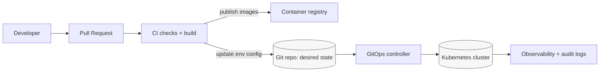

<!-- [KFM_META_BLOCK_V2]
doc_id: kfm://doc/5f6d3a18-9f7b-4c74-8ecb-2f4e4f8d2c1e
title: configs/env/k8s
type: standard
version: v1
status: draft
owners: TODO(platform-ops)
created: 2026-02-23
updated: 2026-02-23
policy_label: restricted
related:
  - TODO(kfm://doc/<env-configs-root-readme>)
tags: [kfm, k8s, gitops, config-as-code]
notes:
  - Defines the contract + workflows for Kubernetes environment configuration.
  - Treat as a governed interface: changes must be reviewable and reversible.
[/KFM_META_BLOCK_V2] -->

# configs/env/k8s

> Kubernetes environment configuration (GitOps-ready) for Kansas Frontier Matrix.


**Quick nav:**
[Purpose](#purpose) ·
[Directory contract](#directory-contract) ·
[How this fits in KFM](#how-this-fits-in-kfm) ·
[Recommended layout](#recommended-layout) ·
[Deploying](#deploying) ·
[Promotion gates](#promotion-gates) ·
[Conventions](#conventions) ·
[Troubleshooting](#troubleshooting)

---

## Purpose

This directory is the **single source of truth** for Kubernetes deployment configuration by environment
(e.g., `dev`, `stage`, `prod`). It is designed to support **GitOps** (preferred) and **repeatable manual deploys**
(allowed for local/dev only).

**Primary goals**
- **Governed changes:** Every change is reviewable, testable, and reversible.
- **Environment parity:** Differences between environments are intentional, explicit, and minimal.
- **No secret leakage:** Secrets are referenced, not embedded.

---

## Directory contract

### What belongs here

| Category | Examples | Notes |
|---|---|---|
| K8s manifests | `Deployment`, `Service`, `Ingress`, `NetworkPolicy`, `HPA`, `PDB` | Prefer server-side apply + declarative ownership |
| Kustomize or Helm wiring | `kustomization.yaml`, `Chart.yaml`, `values.yaml` | Pick one as the default workflow; allow the other only when justified |
| Environment overlays | patches, per-env values, per-env `kustomization.yaml` | Keep overlays small; push shared config into `base/` |
| Policy-as-code | Kyverno / OPA Gatekeeper constraints, `conftest` rules | Must be enforced in CI before promotion |
| Runbook docs | “how to deploy”, “how to rotate”, “how to rollback” | Short, actionable, and versioned with config |

### What must **not** be here

- ❌ **Plaintext secrets** (API keys, passwords, private keys)
- ❌ One-off “temporary” hotfix YAML that isn’t represented in the target state
- ❌ Cluster-specific kubeconfig files
- ❌ Unreviewed generated manifests checked in as the only source

> **WARNING**
> If you need a secret, use an approved pattern (External Secrets, sealed secrets, or SOPS—see below) and
> reference it from workloads. Do not commit raw `Secret` objects.

---

## How this fits in KFM

KFM’s operational posture is: **declare desired state in Git → validate in CI → reconcile to cluster**.



**Key invariant:** UI/clients never talk to storage directly; all runtime services should be deployed behind
governed APIs and policy boundaries (authn/z, audit, rate limits).

---

## Recommended layout

> **NOTE**
> The repo’s actual contents may differ today. If this directory already exists with a different structure,
> treat the following as the **target contract** and either (a) migrate toward it incrementally, or (b) update
> this README to reflect the real contract.

```text
configs/env/k8s/                                   # Kubernetes/OpenShift config templates (non-secret; deploy-safe)
├─ README.md                                        # You are here: how base/overlays/policies fit together + CI gates
│
├─ base/                                            # Shared, environment-agnostic resources (common defaults)
│  ├─ namespaces/                                   # Namespace manifests + baseline labels/quotas (if used)
│  ├─ platform/                                     # Platform components (ingress, cert-manager, external-dns, etc.)
│  ├─ apps/                                         # Application workloads (Deployment/Service/Ingress/Route)
│  └─ kustomization.yaml                            # Kustomize entry (or Chart.yaml if Helm-first)
│
├─ overlays/                                        # Per-environment deltas ONLY (keep minimal + explicit)
│  ├─ dev/
│  │  ├─ kustomization.yaml                         # Dev overlay entry
│  │  ├─ patches/                                   # Patch files (strategic merge / json6902)
│  │  └─ values.yaml                                # Optional (Helm only): dev values overrides
│  ├─ stage/
│  │  └─ …                                          # Stage overlay (prod-like where possible)
│  └─ prod/
│     └─ …                                          # Prod overlay (HA, strict network/egress, audited settings)
│
├─ policies/                                        # Policy-as-code (CI enforced; optionally admission-enforced)
│  ├─ kyverno/                                      # Kyverno policies (or gatekeeper/ if that’s the chosen tool)
│  └─ conftest/                                     # Conftest policies/tests for manifest validation (fail-closed)
│
└─ scripts/                                         # Optional helper scripts (safe + reviewed; CI-parity)
   ├─ validate.sh                                   # Preflight validation (kustomize build, schema checks, policy checks)
   └─ diff.sh                                       # Rendered diff helper (base vs overlays; change review aid)
```

---

## Deploying

### Option A: GitOps (preferred)

1. Change manifests/overlays in a PR.
2. CI validates and (optionally) publishes images.
3. A GitOps controller (e.g., Argo CD / Flux) reconciles the desired state to the cluster.

**Operational rule:** the cluster should converge **only** from Git state; avoid `kubectl apply` in prod.

### Option B: Manual deploy (dev/local only)

> **WARNING**
> Manual deploys are allowed only for non-prod environments unless explicitly approved. Always capture a
> deploy receipt (who/what/when/why + commit SHA).

Examples (adjust paths to match the actual overlay names):

```bash
# Validate what you are about to apply
kustomize build configs/env/k8s/overlays/dev > /tmp/dev.yaml

# Server-side dry-run (requires cluster access)
kubectl apply --server-side --dry-run=server -f /tmp/dev.yaml

# Show diff
kubectl diff -f /tmp/dev.yaml

# Apply
kubectl apply --server-side -f /tmp/dev.yaml
```

Rollback patterns:

- **GitOps:** revert the commit / roll back the Application revision.
- **Manual:** `kubectl rollout undo deploy/<name> -n <ns>` (only if rollouts are enabled and you understand
  what you are undoing).

---

## Secrets patterns

Use **one** primary mechanism and document it here once chosen:

- **External Secrets Operator** (preferred when using a managed secret store)
- **Sealed Secrets** (encrypted secrets stored in Git; controller decrypts)
- **SOPS** (encrypt YAML at rest; decrypt in CI/GitOps controller)

Minimum rules (regardless of choice):
- Secrets must be **encrypted at rest** if stored in Git.
- Workloads must reference secrets by **name**, not embed values.
- Rotation must be a documented procedure.

---

## Promotion gates

Treat environment promotion like a release. At minimum, require:

### Required CI checks (fail closed)
- [ ] `kustomize build` / `helm template` succeeds for every environment
- [ ] Schema validation (`kubeconform` / `kubectl --dry-run=server` against target cluster version)
- [ ] Policy checks (Kyverno/Gatekeeper/conftest) pass
- [ ] No plaintext secrets (repo scan)
- [ ] Image references are immutable (digest or pinned tag policy)

### Required deploy receipt
Capture as an artifact (file, release note, or audit log entry):
- [ ] Environment (dev/stage/prod)
- [ ] Git commit SHA
- [ ] Image digests/tags deployed
- [ ] Migration steps (if any)
- [ ] Verification steps + results
- [ ] Rollback plan

---

## Conventions

### Naming & labels
- Namespaces: `kfm-<domain>` (example)
- Labels: use `app.kubernetes.io/*` consistently
- Annotations: include ownership + traceability (team, commit SHA)

### Resource hygiene
- Always set resource **requests/limits**.
- Always set **liveness/readiness** probes.
- Prefer **PodDisruptionBudget** for critical services.
- Prefer **NetworkPolicy** (default deny + allow required flows).

### Image policy
- Do not use `:latest`.
- Prefer digests (`@sha256:...`) in prod.

---

## Troubleshooting

Common failure modes and what to check:

1. **"resource mapping not found"**
   - Missing CRD (install the CRD before applying CR instances).

2. **"no matches for kind"**
   - API version mismatch (validate against the cluster’s Kubernetes version).

3. **Drift in prod**
   - Someone applied changes manually. Reconcile back to Git and lock down RBAC.

4. **Kustomize/Helm output differs in CI vs local**
   - Tool version mismatch. Pin versions in CI and document required versions.

---

## Appendix

### Minimal kustomization example

```yaml
# overlays/dev/kustomization.yaml
apiVersion: kustomize.config.k8s.io/v1beta1
kind: Kustomization
resources:
  - ../../base
patches:
  - path: patches/replicas.yaml
```

---

<a id="top"></a>
**Back to top:** [↑](#configsenvk8s)
