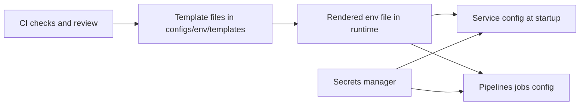

<!-- [KFM_META_BLOCK_V2]
doc_id: kfm://doc/0000d29f-a7aa-4d01-982a-9a7a1f8a35ee
title: configs/env/templates — Environment Template Registry
type: standard
version: v1
status: draft
owners: TBD
created: 2026-02-23
updated: 2026-02-23
policy_label: restricted
related:
  - ../../../.env.example
  - ../../../docker-compose.yml
  - ../../../docs/MASTER_GUIDE_v13.md
  - ../../../docs/governance/ROOT_GOVERNANCE.md
tags: [kfm, env, configs, templates]
notes:
  - Templates only. No secrets. Rendered env files must stay untracked.
[/KFM_META_BLOCK_V2] -->

# `configs/env/templates`
**Purpose:** Canonical *templates* for environment configuration (dev/CI/prod) — **placeholders only, never secrets**.


---

## Quick nav
- [Overview](#overview)
- [Where this fits](#where-this-fits)
- [How it works](#how-it-works)
- [Template registry](#template-registry)
- [What belongs here](#what-belongs-here)
- [Usage](#usage)
- [Rules and invariants](#rules-and-invariants)
- [Change management](#change-management)
- [Troubleshooting](#troubleshooting)
- [Related docs](#related-docs)

---

## Overview
This directory exists to provide **reviewable, non-secret** templates that describe:
- what configuration keys exist,
- what is safe to default,
- what must be injected at runtime (via secret manager, CI variables, deployment platform, etc).

> **WARNING:** Do not commit real tokens, passwords, keys, private endpoints, or sensitive partner credentials here.

---

## Where this fits
From repo root:

```
configs/
  env/
    templates/   <-- you are here
```

This complements:
- `.env.example` (root) as the “human-readable contract” for required env keys.
- `docker-compose.yml` (root) for local orchestration.
- CI/deploy tooling that injects secrets at runtime.

---

## How it works


---

## Template registry
Add every template in this directory to this table.

| Template (path) | Format | Target scope | Rendering method | Secret policy | Owners | Notes |
|---|---|---|---|---|---|---|
| `TBD` | `.env` / `yaml` / `json` | `dev` / `ci` / `prod` | `envsubst` / `helm` / `kustomize` / `custom` | **No secrets** | TBD | Add when created |

> TIP: If you don’t have a “registry owner” yet, set it to `TBD` and open a governance ticket to assign stewardship.

---

## What belongs here
### Acceptable inputs
- Environment templates with **placeholders** (not values):
  - `.env.template`, `.env.dev.template`, `.env.ci.template`, etc.
  - `values.yaml.template` / `values-dev.yaml.template` (Helm-style)
  - `appsettings.json.template` (if applicable)
- Minimal docs that explain the template (inline comments are preferred)
- Optional: a **template schema** (e.g., `env.schema.json`) that enumerates keys + types + “secret vs non-secret”

### Exclusions
- ❌ Any real secret value (even “temporary”)
- ❌ Production tokens copied from a live system
- ❌ Generated files (rendered `.env`, rendered `values.yaml`, etc.)
- ❌ Vendor secrets dumps, kubeconfigs, cloud credentials, `.p12`/`.pem` keys
- ❌ Anything that would bypass policy labels / redaction boundaries

---

## Usage
### 1) Create a local `.env` from a template (example patterns)
Pick one of these patterns and standardize it in your environment docs.

**Option A — Copy then fill manually**
```bash
cp configs/env/templates/.env.dev.template .env
# edit .env locally (never commit)
```

**Option B — Render via `envsubst`**
```bash
# exports come from your shell, secret manager injection, or CI vars
envsubst < configs/env/templates/.env.dev.template > .env
```

**Option C — Compose uses `.env` by convention**
```bash
# assumes docker-compose.yml reads .env (common convention)
docker compose up
```

### 2) Keep `.env` untracked
Recommended `.gitignore` entries (if not already present):
```gitignore
.env
.env.*
*.local.env
```

---

## Rules and invariants
### Non-negotiables
- Templates **must be safe to publish internally** (no secrets, no privileged tokens).
- Anything sensitive **must** come from a secret manager or runtime injection.
- Templates should be **diff-friendly**:
  - stable ordering
  - comments for why a key exists
  - explicit “required vs optional”

### Secrets hygiene (what “no secrets” means)
- Use placeholders like `__REQUIRED__` or `${VAR_NAME}`.
- If a value is sensitive, document *where it comes from*, not the value itself.

Example `.env` template snippet:
```dotenv
# Environment identifier
KFM_ENV=__REQUIRED__

# Non-secret defaults are OK (only if safe)
KFM_LOG_LEVEL=info

# Secret values must be injected at runtime
DATABASE_URL=__INJECT_FROM_SECRET_MANAGER__
API_KEY=__INJECT_FROM_SECRET_MANAGER__
```

---

## Change management
### When you add/change a template
1. Add/update the **Template registry** row.
2. Ensure the change doesn’t introduce secrets (run your secret scanner / pre-commit hooks).
3. Update `.env.example` if the *set of required keys* changes.
4. If the change affects deployments, document rollout notes (who needs to update what).

### Definition of Done
- [ ] Registry row added/updated
- [ ] No secrets in template (scanner/pre-commit passes)
- [ ] `.env.example` updated (if key set changed)
- [ ] Any impacted docs updated (links below)
- [ ] CI gates pass (merge-blocking)

---

## Troubleshooting
- **“It works locally but fails in CI”**
  - Confirm CI injects all required keys.
  - Confirm template placeholders are not being shipped to runtime.

- **“A secret leaked into a template”**
  - Remove it immediately.
  - Rotate the secret.
  - Add/strengthen secret scanning gates.
  - File a governance incident note.

- **“Rendered config differs across machines”**
  - Ensure rendering is deterministic (pin tooling versions; avoid implicit defaults).
  - Prefer explicit values for non-secret defaults.

---

## Related docs
> NOTE: These paths are expected to exist in the repo; update links if the repo layout changes.

- `../../../docs/MASTER_GUIDE_v13.md`
- `../../../docs/governance/ROOT_GOVERNANCE.md`
- `../../../docs/governance/REVIEW_GATES.md`
- `../../../docs/standards/KFM_REPO_STRUCTURE_STANDARD.md`

---

<p align="right"><a href="#configsenvtemplates">Back to top</a></p>
