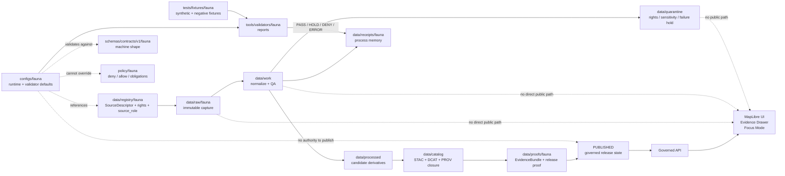

<!-- [KFM_META_BLOCK_V2]
doc_id: kfm://doc/REVIEW_REQUIRED_UUID
title: configs/fauna
type: standard
version: v1
status: draft
owners: REVIEW_REQUIRED_CONFIGS_FAUNA_OWNER
created: REVIEW_REQUIRED_YYYY-MM-DD
updated: 2026-05-01
policy_label: REVIEW_REQUIRED_PUBLIC_OR_RESTRICTED
related: [../README.md, ../../README.md, ../../data/registry/fauna/README.md, ../../schemas/contracts/v1/fauna/README.md, ../../policy/fauna/README.md, ../../tools/validators/fauna/README.md, ../../tests/fixtures/fauna/README.md]
tags: [kfm, configs, fauna, geoprivacy, source-registry, validators]
notes: [Target path requested as configs/fauna/README.md. Current authoring evidence did not include a mounted KFM repository or existing configs/fauna tree. Owner, created date, policy label, parent README presence, and related path existence need direct repo verification before merge.]
[/KFM_META_BLOCK_V2] -->

<a id="top"></a>

# `configs/fauna/`

Configuration boundary for fauna-lane defaults, fixture-safe overlays, public-safety guardrails, and validator-facing runtime settings.

<div align="left">


</div>

> [!IMPORTANT]
> **Status:** `experimental`  
> **Owners:** `REVIEW_REQUIRED_CONFIGS_FAUNA_OWNER`  
> **Path:** `configs/fauna/README.md`  
> **Quick jumps:** [Scope](#scope) · [Repo fit](#repo-fit) · [Accepted inputs](#accepted-inputs) · [Exclusions](#exclusions) · [Directory tree](#directory-tree) · [Quickstart](#quickstart) · [Usage](#usage) · [Diagram](#diagram) · [Operating tables](#operating-tables) · [Definition of done](#definition-of-done) · [FAQ](#faq) · [Appendix](#appendix)

> [!NOTE]
> This directory is a **configuration boundary**, not a source of canonical fauna truth. It may tune how validators, synthetic fixtures, layer builders, and governed API adapters behave. It must not define source authority, publish restricted locations, store raw occurrence records, override policy, or silently promote data.

---

## Scope

`configs/fauna/` holds small, reviewable configuration files for the KFM fauna lane.

Use it to express **how verified fauna-lane machinery should run**, especially for:

- synthetic and no-network fixtures;
- validator defaults and report expectations;
- geoprivacy defaults and public geometry supports;
- taxon-resolution guardrails;
- layer and popup field allowlists;
- Focus Mode context limits;
- backfill and batch settings that preserve idempotency.

The directory should stay boring in the right way: compact, explicit, and subordinate to schemas, registries, policies, receipts, proofs, and release state.

### Truth posture

| Claim area | Status | Handling |
|---|---:|---|
| KFM fauna doctrine: source-role discipline, taxonomy resolution, geoprivacy, evidence-bound outputs | **CONFIRMED from attached doctrine** | Reflected here as operating rules. |
| Current existence of `configs/fauna/` in the mounted repo | **UNKNOWN** | This README is drafted for the requested path and needs repo verification before merge. |
| Specific config filenames below | **PROPOSED** | Keep, rename, or split after inspecting repo conventions. |
| Live source connectors, public occurrence layers, API routes, and UI components | **UNKNOWN / NEEDS VERIFICATION** | Do not imply activation from config presence alone. |

[Back to top](#top)

---

## Repo fit

| Relationship | Path | Role |
|---|---|---|
| Current README | `configs/fauna/README.md` | Orientation and guardrails for fauna configuration. |
| Parent config lane | [`../README.md`](../README.md) | **NEEDS VERIFICATION:** parent config standards and shared conventions. |
| Repo root | [`../../README.md`](../../README.md) | **NEEDS VERIFICATION:** project-level orientation and contribution rules. |
| Source registry | [`../../data/registry/fauna/`](../../data/registry/fauna/) | Source descriptors, source roles, rights status, authority scope, and verification backlog. |
| Schema authority | [`../../schemas/contracts/v1/fauna/`](../../schemas/contracts/v1/fauna/) | Machine-checkable fauna object shapes, pending schema-home ADR confirmation. |
| Policy authority | [`../../policy/fauna/`](../../policy/fauna/) | Release/runtime admissibility, deny logic, obligations, sensitivity, and rights gates. |
| Validator surface | [`../../tools/validators/fauna/`](../../tools/validators/fauna/) | Validation entry points and machine-readable reports. |
| Fixture surface | [`../../tests/fixtures/fauna/`](../../tests/fixtures/fauna/) | Positive, negative, synthetic, and no-network examples. |

> [!WARNING]
> Relative links in this README are **target repo links**. They should be link-checked after the real repository tree is mounted. Do not treat a linked path as implemented merely because it appears here.

[Back to top](#top)

---

## Accepted inputs

Files in this directory may contain **non-secret**, **public-safe**, and **schema-validated** configuration such as:

- validator defaults for source registry checks, occurrence checks, geoprivacy checks, catalog closure, layer checks, and API contract checks;
- `source_id`, `dataset_id`, `taxon_authority_id`, or `policy_package_id` references that resolve elsewhere;
- public geometry support settings such as `county`, `huc12`, `grid`, `bbox`, or other reviewed generalized supports;
- layer field allowlists for public map popups and Evidence Drawer summaries;
- no-network fixture settings for synthetic thin slices;
- feature flags that keep live connectors disabled until source verification and steward review pass;
- batch and backfill settings that preserve `spec_hash`, source snapshot, transform version, policy version, and rollback references.

### Accepted file qualities

| Quality | Requirement |
|---|---|
| Small | Configs should be inspectable in review. Large source payloads belong elsewhere. |
| Explicit | Every external reference should name the registry, schema, policy, or fixture it depends on. |
| Fail-closed | Missing rights, missing source role, ambiguous taxonomy, or unresolved sensitivity should default to `HOLD`, `ABSTAIN`, `DENY`, or `QUARANTINE`, never silent publication. |
| Reversible | Config changes that affect outputs should be tied to receipts, validation reports, and rollback notes. |
| No secrets | Tokens, API keys, restricted URLs, and credential material do not belong in repo config. |

[Back to top](#top)

---

## Exclusions

Do **not** place these in `configs/fauna/`:

| Excluded material | Correct home or posture |
|---|---|
| RAW occurrence records, agency exports, community-science snapshots, or live API payloads | `data/raw/fauna/` or another governed RAW location. |
| WORK outputs, normalization scratch, QA intermediates, or repair candidates | `data/work/` or `data/quarantine/`. |
| Restricted exact occurrence coordinates, den/roost/nest/hibernacula locations, or steward-controlled precise records | Restricted internal store only; never public config. |
| Source descriptors, source authority rankings, rights status, cadence, endpoints, or geoprivacy source flags | `data/registry/fauna/`. |
| JSON Schema definitions or contract semantics | `schemas/contracts/v1/fauna/` or repo-confirmed schema home. |
| OPA/Rego policy packages and policy tests | `policy/fauna/` and policy test fixtures. |
| EvidenceBundles, proof packs, release manifests, signatures, and attestations | `data/proofs/fauna/` or repo-confirmed proof surface. |
| Run receipts, validation reports, redaction receipts, rollback receipts | `data/receipts/fauna/` or repo-confirmed receipt surface. |
| PMTiles, TileJSON, GeoParquet, COGs, public API snapshots, or generated layer outputs | `data/processed/`, `data/catalog/`, or `data/published/` after promotion. |
| AI-generated species claims or free-form model outputs | Governed API response envelopes only; cite-or-abstain applies. |

> [!CAUTION]
> A config file must never “turn on” public exact geometry for sensitive fauna records by itself. Public exposure requires source rights, source role, sensitivity review, redaction receipts when applicable, EvidenceBundle resolution, policy gates, and promotion state.

[Back to top](#top)

---

## Directory tree

**PROPOSED until repo inspection confirms the actual convention.**

```text
configs/fauna/
├── README.md
├── ingest.yml                 # source activation flags, no-network defaults, batch controls
├── taxonomy.yml               # authority-order references and ambiguous-match handling
├── geoprivacy.yml             # public support defaults and redaction requirements
├── layers.yml                 # layer allowlists, popup fields, zoom/support defaults
├── focus.yml                  # Focus Mode context limits and evidence-only defaults
├── backfill.yml               # idempotent backfill and rollback-reference defaults
└── examples/
    ├── synthetic-thin-slice.yml
    └── public-safe-layer.yml
```

### Naming expectations

| Pattern | Use |
|---|---|
| `*.yml` | Preferred for human-reviewed config if repo convention does not require JSON/TOML. |
| `examples/*.yml` | Non-authoritative illustrative configs for fixtures and review. |
| `README.md` | Human-facing scope, exclusions, and review gates. |
| `CHANGELOG.md` | Add only if repo docs convention prefers per-directory change logs. Otherwise use the domain evolution log. |

[Back to top](#top)

---

## Quickstart

> [!IMPORTANT]
> These commands are **PROPOSED** because the active repo stack, package manager, validator entry points, and parent config conventions are not verified in this authoring pass.

### 1. Check unresolved placeholders

```bash
grep -RIn "REVIEW_REQUIRED\|NEEDS VERIFICATION\|UNKNOWN\|PROPOSED" configs/fauna
```

### 2. Inspect config files without activating live sources

```bash
find configs/fauna -maxdepth 2 -type f \
  \( -name "*.yml" -o -name "*.yaml" -o -name "README.md" \) \
  -print
```

### 3. Run fauna validators after repo conventions are confirmed

```bash
# PROPOSED command shape — verify actual runner before use.
python tools/validators/fauna/run_all.py \
  --config configs/fauna \
  --no-live-sources \
  --report-dir build/fauna/reports
```

### 4. Keep live connectors disabled until source admission passes

```bash
# PROPOSED review check — do not treat as an implemented command.
python tools/validators/fauna/validate_sources.py \
  --registry data/registry/fauna/sources.yml \
  --config configs/fauna/ingest.yml \
  --deny-live-unverified
```

[Back to top](#top)

---

## Usage

### Add or revise a fauna config

1. Verify the config belongs here instead of `data/registry/fauna/`, `schemas/`, `policy/`, `tests/fixtures/`, `data/receipts/`, or `data/proofs/`.
2. Confirm every `source_id`, `dataset_id`, `taxon_authority_id`, and `policy_package_id` resolves to the proper authority surface.
3. Add or update a positive fixture and at least one negative fixture.
4. Run schema, source, geoprivacy, layer, API, evidence, and continuity validators.
5. Record behavior-changing config updates in the domain documentation, ADR, receipt, or release notes required by repo convention.
6. Keep public release blocked unless source rights, sensitivity posture, EvidenceBundle resolution, policy gates, review state, and promotion state all pass.

### Illustrative config fragment

This example is not a contract. Validate the real file against the repo-confirmed schema before use.

```yaml
config_id: kfm.fauna.config.geoprivacy.defaults.v1
status: draft
config_scope: fauna_public_derivatives
source_registry_ref: data/registry/fauna/sources.yml
policy_package_ref: policy/fauna/geoprivacy.rego

public_geometry:
  default_when_unclassified: steward_review_required
  allowed_supports:
    - county
    - huc12
    - grid
    - bbox
  deny_exact_for:
    - restricted_precise
    - embargoed
    - steward_review_required
    - quarantine

receipts_required:
  redaction_receipt: true
  run_receipt: true
  validation_report: true

publication_defaults:
  live_connectors_enabled: false
  unknown_rights_behavior: DENY
  ambiguous_taxonomy_behavior: HOLD
  missing_evidence_behavior: ABSTAIN
```

[Back to top](#top)

---

## Diagram



[Back to top](#top)

---

## Operating tables

### Config responsibility matrix

| Proposed file | Purpose | May reference | Must not contain | Gate |
|---|---|---|---|---|
| `ingest.yml` | Source activation defaults, no-network mode, batch size, idempotency knobs | `source_id`, source family, fixture source IDs | Credentials, live tokens, raw payloads, source authority claims | Source registry validator; live connectors disabled until verified. |
| `taxonomy.yml` | Taxon normalization and resolution behavior | Taxon authority registry IDs, ambiguity handling | Canonical taxon records, synonym tables, private steward notes | Ambiguous/unresolved matches must `HOLD` or `ABSTAIN`. |
| `geoprivacy.yml` | Public support defaults and redaction requirements | Sensitivity policy IDs, public support classes | Restricted geometry, before-redaction coordinates | Public-safety and geoprivacy validators. |
| `layers.yml` | Public layer and popup field allowlists | Layer manifest IDs, public fields, zoom/support defaults | Hidden semantics, restricted fields, exact sensitive coordinates | Layer validator and field allowlist tests. |
| `focus.yml` | Focus Mode context limits | Runtime envelope schema, EvidenceBundle refs, citation rules | Free-form model prompts with restricted details | Citation validator; no RAW/WORK/QUARANTINE access. |
| `backfill.yml` | Batch windows, source snapshots, rollback references | Source snapshot IDs, transform version, policy version | Destructive migration without rollback target | Continuity and rollback validators. |

### Public geometry behavior

| Sensitivity class | Default public behavior | Config may do | Config must not do |
|---|---|---|---|
| `public_exact_allowed` | Exact geometry may publish only when source rights, evidence, and policy allow it. | Set field allowlists and proof requirements. | Bypass source rights or evidence checks. |
| `public_generalized` | Publish generalized or aggregated support only. | Select reviewed supports such as county, HUC, grid, or bounding area. | Expose original precise coordinates. |
| `restricted_precise` | No public precise geometry. | Require restricted-store handling and redaction receipts. | Place exact geometry in public layer, API, Focus Mode, search, graph, or screenshots. |
| `embargoed` | No public record until embargo clears, or public summary only. | Set delay and review behavior. | Backdate or override embargo without evidence. |
| `steward_review_required` | Hold until review. | Route to review obligations. | Promote automatically. |
| `quarantine` | Not public. | Record hold reason and validator expectations. | Treat unresolved rights, sensitivity, taxonomy, or geometry as publishable. |

### Validator expectations

| Validator family | Config dependency | Fail-closed examples |
|---|---|---|
| Source validation | `ingest.yml` references source registry records. | Unknown `source_role`, missing rights, live connector enabled without source admission. |
| Schema validation | Every config file has a known schema or documented review exception. | Config key drift, missing required references, conflicting schema home. |
| Occurrence validation | Config does not weaken geometry, CRS, temporal, or evidence requirements. | Missing EvidenceRef, unknown CRS, invalid event/publication time handling. |
| Geoprivacy validation | `geoprivacy.yml` requires redaction/generalization and receipts. | Restricted exact geometry in public output; redaction transform without receipt. |
| Layer validation | `layers.yml` enforces public field allowlists and manifest linkage. | Hidden restricted fields, source-private fields, no digest, no tile build receipt. |
| Focus/API validation | `focus.yml` keeps generated answers subordinate to released EvidenceBundles. | Uncited species claim, restricted location in prompt/output, malformed structured output. |
| Continuity validation | `backfill.yml` and aliases preserve prior IDs or document migration. | Silent taxon churn, destructive layer rename, unmapped legacy fixture. |

[Back to top](#top)

---

## Definition of done

Before this README and any sibling config files are merged:

- [ ] **Repo evidence captured:** active branch, path existence, parent config convention, package manager, validator runner, and link check are verified.
- [ ] **Owner resolved:** `owners` in the KFM meta block and impact block is replaced with the repo-confirmed owner or team.
- [ ] **Policy label resolved:** README-level label and child config sensitivity class are confirmed.
- [ ] **Schema home resolved:** fauna schema authority is confirmed or `ADR-fauna-schema-home.md` is accepted.
- [ ] **No secrets:** config files contain no tokens, private URLs, credentials, restricted coordinates, or raw occurrence payloads.
- [ ] **Registry references resolve:** all source, dataset, taxon authority, policy package, and layer references resolve to their authority surfaces.
- [ ] **Negative fixtures exist:** unknown rights, missing evidence refs, ambiguous taxonomy, and restricted exact public geometry all fail closed.
- [ ] **Synthetic/no-network path works:** first proof path uses fixture data and does not call live sources.
- [ ] **Geoprivacy passes:** public outputs contain no restricted geometry and require redaction receipts when generalized.
- [ ] **Evidence closure passes:** public claims resolve through EvidenceRef → EvidenceBundle.
- [ ] **Focus Mode remains bounded:** no RAW, WORK, QUARANTINE, direct source API, restricted exact location, or uncited claim path exists.
- [ ] **Rollback path exists:** any output-affecting config change has rollback notes, release-bundle linkage, or deletion/rebuild plan.
- [ ] **Docs updated:** behavior changes update the fauna domain docs, ADRs, validator docs, or release notes required by repo convention.

[Back to top](#top)

---

## FAQ

### Why is this not `data/registry/fauna/`?

`data/registry/fauna/` should own source descriptors, rights status, source roles, source authority, cadence, and verification backlog. `configs/fauna/` may reference registry entries, but it must not become a second registry.

### Can a config enable a live source connector?

Not by itself. Live connectors require current source verification, rights review, source-role classification, steward review where applicable, source descriptors, fixtures, validators, and promotion gates. Default config should keep live connectors disabled.

### Can a config make sensitive exact locations public?

No. Config can define reviewed support defaults and redaction requirements. It cannot override policy, steward review, source geoprivacy flags, or public-safety validators.

### What should happen when taxonomy is ambiguous?

Hold or abstain. Ambiguous or unresolved taxon resolution must not silently merge records, rewrite IDs, or publish confident species claims.

### What does this directory prove?

At most, it proves that configuration defaults are reviewable. It does not prove source validity, public readiness, API behavior, UI behavior, policy enforcement, or release state.

[Back to top](#top)

---

## Appendix

<details>
<summary>Placeholder register</summary>

| Placeholder | Why it remains |
|---|---|
| `doc_id: kfm://doc/REVIEW_REQUIRED_UUID` | No repo document registry was available during authoring. |
| `owners: REVIEW_REQUIRED_CONFIGS_FAUNA_OWNER` | No mounted `CODEOWNERS` or team registry was available for this path. |
| `created: REVIEW_REQUIRED_YYYY-MM-DD` | Creation date should come from repo history or governance record. |
| `policy_label: REVIEW_REQUIRED_PUBLIC_OR_RESTRICTED` | The README may be public-safe while child configs may govern restricted behavior; repo policy needs confirmation. |
| Relative links to adjacent surfaces | Target paths are doctrine-aligned but need direct link checking in the real checkout. |
| Proposed config filenames | File homes and naming may change after repo convention inspection. |

</details>

<details>
<summary>Config review prompts</summary>

Use these questions during review:

1. Does this config reference an authority object instead of redefining it?
2. Does it preserve `RAW → WORK/QUARANTINE → PROCESSED → CATALOG/TRIPLET → PUBLISHED`?
3. Does it default unknown rights, unresolved sensitivity, ambiguous taxonomy, and missing evidence to hold/deny/abstain?
4. Does every public-facing setting have a corresponding negative fixture?
5. Could this config reveal a restricted location through a layer, popup, graph projection, search index, Focus Mode prompt, screenshot, or derived tile?
6. Does any change require a redaction receipt, run receipt, release proof, ADR, or rollback note?
7. Is any live connector still blocked until source admission is verified?

</details>

[Back to top](#top)
