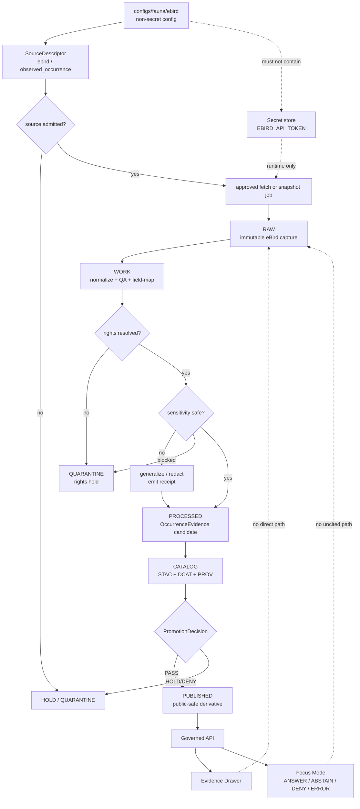

<!-- [KFM_META_BLOCK_V2]
doc_id: kfm://doc/TODO-UUID-configs-fauna-ebird-readme
title: eBird Fauna Source Configuration
type: standard
version: v1
status: draft
owners: <TODO: fauna/source-steward owner>
created: 2026-05-01
updated: 2026-05-01
policy_label: <TODO: public|restricted>
related: [<TODO: configs/fauna/README.md>, <TODO: data/registry/fauna/README.md>, <TODO: policy/fauna/README.md>, <TODO: tools/validators/fauna/README.md>, <TODO: docs/domains/fauna/README.md>]
tags: [kfm, fauna, ebird, source-config, occurrence, geoprivacy]
notes: [Target repo checkout was not visible in this session; owner, related paths, validator commands, and schema homes require verification before commit.]
[/KFM_META_BLOCK_V2] -->

# eBird Fauna Source Configuration

Configuration guidance for admitting eBird bird-observation support into the KFM fauna lane without weakening evidence, rights, sensitivity, or publication gates.

<a id="top"></a>

## Impact block


| Field | Value |
|---|---|
| Status | **experimental** |
| Owners | **NEEDS VERIFICATION** — `<TODO: fauna/source-steward owner>` |
| Path | `configs/fauna/ebird/README.md` |
| Primary role | Source configuration README for eBird-backed fauna occurrence support |
| Connector state | **UNKNOWN** — this file does not prove a live connector exists |
| Publication state | **DENY by default** until rights, sensitivity, source role, catalog closure, review, and promotion pass |

**Quick jumps:** [Scope](#scope) · [Repo fit](#repo-fit) · [Inputs](#accepted-inputs) · [Exclusions](#exclusions) · [Directory tree](#directory-tree) · [Quickstart](#quickstart) · [Configuration contract](#configuration-contract) · [Governance gates](#governance-gates) · [Diagram](#diagram) · [Definition of done](#definition-of-done) · [Open verification](#open-verification)

> [!IMPORTANT]
> This directory is a **configuration surface**, not source data, not a connector implementation, not a policy bundle, and not publication approval. eBird-derived support must remain downstream of source admission and upstream of governed evidence resolution.

---

## Scope

This README defines what belongs under `configs/fauna/ebird/` once the real repository conventions are verified.

It is intended to help maintainers configure eBird as a **bird occurrence support source** while preserving KFM’s source-role discipline:

| Claim | Status | Meaning |
|---|---:|---|
| eBird can support bird observation evidence. | **CONFIRMED doctrine / NEEDS VERIFICATION operationally** | Use as `observed_occurrence` support after source terms, field mappings, and provenance are resolved. |
| eBird is a legal or conservation-status authority. | **DENY** | Legal/status authority belongs to verified Kansas, federal, or steward-approved sources, not community-observation feeds. |
| eBird records are automatically public-safe. | **DENY** | Rights, sensitivity, geoprivacy, and precision must be evaluated record-by-record or release-by-release. |
| This README proves connector implementation. | **NO** | Target repo implementation depth is **UNKNOWN** until a checkout, tests, validators, and runtime behavior are inspected. |

This directory should support:

- eBird source-admission configuration.
- eBird API and EBD snapshot mode configuration.
- Non-secret endpoint, query-profile, field-map, and transform settings.
- Rights and citation reminders.
- Public-safety defaults for bird occurrence support.
- Validator inputs for source-role, rights, provenance, and geoprivacy checks.

[Back to top](#top)

---

## Repo fit

### Path

```text
configs/fauna/ebird/README.md
```

### Upstream surfaces

These paths are **NEEDS VERIFICATION** because the mounted repo tree was not visible in this session.

| Surface | Expected relationship |
|---|---|
| `configs/fauna/README.md` | Parent configuration lane for fauna sources. |
| `data/registry/fauna/` | Expected source descriptor, source-role registry, or source admission records. |
| `schemas/contracts/v1/fauna/` | Expected machine-contract home if the repo confirms this schema convention. |
| `policy/fauna/` | Sensitivity, rights, geoprivacy, and source-role policy enforcement. |
| `docs/domains/fauna/` | Domain doctrine, runbooks, and source-admission notes. |

### Downstream surfaces

| Surface | Must consume this safely |
|---|---|
| `data/raw/fauna/ebird/` | Immutable captures or snapshots only; never public client input. |
| `data/work/fauna/ebird/` | Normalization, QA, field repair, and redaction work. |
| `data/quarantine/fauna/ebird/` | Rights ambiguity, missing provenance, sensitive exact geometry, or schema failure. |
| `data/processed/fauna/` | Validated occurrence evidence candidates and public-safe derivatives. |
| `data/catalog/{stac,dcat,prov}/fauna/` | Catalog closure before outward publication. |
| `apps/governed_api/` | Governed API only; routes must not fetch eBird directly at request time. |
| Map / Evidence Drawer / Focus Mode | Must render rights, sensitivity, precision, source role, and finite outcomes. |

[Back to top](#top)

---

## Accepted inputs

Only non-secret, reviewable configuration belongs here.

| Input | Accepted? | Notes |
|---|---:|---|
| Source-family config | ✅ | Example: `source_family: ebird`, `source_role: observed_occurrence`. |
| Endpoint family selection | ✅ | Example: realtime API, taxonomy reference, EBD snapshot mode. |
| Query profiles | ✅ | Kansas-focused region, taxon, date-window, and no-network fixture profiles. |
| Field-map hints | ✅ | Field names must be verified against the active API/EBD schema before use. |
| Rights/citation notes | ✅ | Include current terms-check date and reviewer. |
| Geoprivacy defaults | ✅ | Public exact geometry must be disabled unless policy and steward review allow it. |
| API token or key | ❌ | Use a secret manager or environment variable only; never commit credentials. |
| Raw EBD downloads | ❌ | Store under the governed data lifecycle, not under `configs/`. |
| Generated occurrence records | ❌ | Store under `data/work/`, `data/processed/`, or equivalent repo-confirmed homes. |

[Back to top](#top)

---

## Exclusions

| Do not put here | Where it should go instead | Reason |
|---|---|---|
| API tokens, `.env` files, local credentials | Secret manager, ignored local environment, or deployment secret store | Prevent credential leakage. |
| Raw eBird API captures or EBD files | `data/raw/fauna/ebird/` | RAW records are source captures, not config. |
| Normalized occurrence evidence objects | `data/processed/fauna/` | Processed records must carry receipts and validation outputs. |
| Rights-ambiguous or sensitive records | `data/quarantine/fauna/ebird/` | KFM fails closed when rights or sensitivity are unresolved. |
| Policy-as-code | `policy/fauna/` | Policy must remain enforceable and testable. |
| Validators | `tools/validators/fauna/` | Validators are operational gates, not source config. |
| API route logic | `apps/governed_api/` or repo-confirmed equivalent | Runtime logic must remain behind governed APIs. |
| Map styles or layer manifests | Map/layer registry path after repo verification | Rendering is downstream of release and trust state. |
| Claims that eBird is a legal-status authority | Nowhere | eBird is occurrence support only unless a future authority decision explicitly says otherwise. |

[Back to top](#top)

---

## Directory tree

**PROPOSED until repo inspection confirms file homes.**

```text
configs/fauna/ebird/
├── README.md
├── source.config.example.yml          # non-secret source-admission config
├── query_profiles.example.yml         # no-network and reviewable fetch profiles
├── field_map.example.yml              # API/EBD field mapping hints
├── rights_and_citation.template.md    # terms-check and citation review notes
└── .gitignore                         # optional: block local overrides and secrets
```

> [!NOTE]
> If the mounted repo already uses different names or homes, preserve this README’s intent but adapt file names through an ADR or compatibility note rather than creating parallel authorities.

[Back to top](#top)

---

## Quickstart

### 1. Start with no-network validation

```bash
# NEEDS VERIFICATION: adapt to the repo's actual validator command after checkout.
python tools/validators/fauna/validate_sources.py \
  --source-family ebird \
  --config configs/fauna/ebird/source.config.example.yml \
  --no-live-fetch
```

### 2. Keep credentials out of Git

```bash
# PROPOSED secret name; verify repo secret naming before use.
export EBIRD_API_TOKEN="<redacted-token-from-secret-store>"
```

### 3. Prefer header-based authentication when live fetch is approved

```bash
# PSEUDOCODE — do not run in CI unless live-source gates explicitly allow it.
curl \
  -H "x-ebirdapitoken: ${EBIRD_API_TOKEN}" \
  "https://api.ebird.org/v2/data/obs/US-KS/recent"
```

### 4. Promote only through governed gates

```bash
# NEEDS VERIFICATION: illustrative gate order only.
python tools/validators/fauna/validate_sources.py --source-family ebird
python tools/validators/fauna/validate_occurrences.py --source-family ebird
python tools/validators/fauna/validate_geoprivacy.py --source-family ebird
python tools/validators/fauna/validate_catalogs.py --source-family ebird
```

[Back to top](#top)

---

## Configuration contract

### Minimal source configuration

```yaml
# ILLUSTRATIVE ONLY.
# Verify against the mounted repo's schema before committing.

source:
  id: kfm://source/ebird
  name: eBird
  family: ebird
  role: observed_occurrence
  authority_scope:
    occurrence_support: true
    legal_status_authority: false
    conservation_status_authority: false
    modeled_range_authority: false

access:
  default_mode: disabled
  live_fetch_allowed: false
  api_version: "2.0"
  base_url_ref: official_ebird_api_v2
  token_env: EBIRD_API_TOKEN
  auth_header: x-ebirdapitoken
  use_query_parameter_key: false

modes:
  realtime_api:
    status: needs_review
    intended_use: recent_observation_context
    max_public_precision_default: county
    requires:
      - terms_review
      - token_secret
      - query_profile
      - run_receipt
      - source_response_snapshot_or_hash
  ebd_snapshot:
    status: needs_review
    intended_use: stable_backfill_or_research_snapshot
    requires:
      - approved_data_request
      - snapshot_date
      - terms_review
      - attribution_text
      - run_receipt
      - source_file_hash
  taxonomy_reference:
    status: needs_review
    intended_use: taxon_code_lookup
    requires:
      - taxonomy_version
      - retrieval_timestamp
      - field_map_review

rights:
  status: needs_verification
  commercial_use: prohibited_without_permission
  redistribution_original_data: prohibited_without_permission
  outward_publication_default: hold
  citation_required: true

sensitivity:
  default_public_precision: county
  exact_geometry_public_default: false
  sensitive_taxa_exact_geometry: deny
  unresolved_sensitivity: quarantine
  redaction_receipt_required: true

provenance:
  require_retrieval_timestamp: true
  require_source_uri_or_request_profile: true
  require_run_receipt_ref: true
  require_transform_version: true
  require_policy_version: true
```

### Query profile shape

```yaml
# ILLUSTRATIVE ONLY.
# Query profiles are config, not source evidence.

profiles:
  kansas_recent_observations:
    status: review
    mode: realtime_api
    region_code: US-KS
    time_window:
      kind: recent
      max_days: 30
    public_surface:
      allowed: false
      reason: "Live recent observations require rights/sensitivity review before outward use."

  kansas_county_public_safe_fixture:
    status: fixture
    mode: no_network
    region_code: US-KS
    precision_served: county
    expected_runtime_outcomes:
      - ANSWER
      - ABSTAIN
      - DENY
      - ERROR
```

### Field-map reminder

```yaml
# ILLUSTRATIVE ONLY.
# Verify exact field names against current API/EBD docs and local schemas.

field_map:
  source_record_id:
    candidates: [subId, checklistId, observation_id]
    required: true
  location_id:
    candidates: [locId, location_id]
    required: true
  scientific_name:
    candidates: [sciName, scientific_name]
    required: true
  common_name:
    candidates: [comName, common_name]
    required: false
  event_date:
    candidates: [obsDt, observation_date, event_date]
    required: true
  latitude:
    candidates: [lat, latitude]
    required_when_geometry_present: true
  longitude:
    candidates: [lng, longitude]
    required_when_geometry_present: true
  precision_class:
    candidates: [precision_class, coordinate_uncertainty, public_precision]
    required: true
```

[Back to top](#top)

---

## Governance gates

### Source-role gates

| Gate | Required result |
|---|---|
| `source.family` | Must equal `ebird`. |
| `source.role` | Must equal `observed_occurrence`. |
| Legal-status use | Must be denied. |
| Modeled-range use | Must be denied or routed to a separate modeled-product source descriptor. |
| Unknown rights | Must block outward publication. |
| Unknown sensitivity | Must go to `QUARANTINE` or return `ABSTAIN` / `DENY`. |

### Rights gates

| Condition | Runtime or promotion behavior |
|---|---|
| Terms not reviewed | `HOLD` or `DENY` outward publication. |
| Redistribution forbidden | `DENY` outward publication. |
| Commercial use requested without permission | `DENY`. |
| Citation missing | `HOLD` until citation is added. |
| Original raw data requested for public distribution | `DENY`. |

### Sensitivity and geoprivacy gates

| Condition | Required behavior |
|---|---|
| Sensitive taxon + exact point | `DENY` public exact geometry. |
| Generalization allowed | Emit generalized public geometry and redaction receipt. |
| Steward review required | `HOLD`; no public promotion. |
| Embargo active | Withhold or serve public summary only. |
| Reverse-engineering risk | Reduce precision, aggregate, delay, or withhold. |

### Runtime outcome gates

| Outcome | Meaning for eBird support |
|---|---|
| `ANSWER` | Public-safe, rights-safe, provenance-backed, generalized as needed, and visibly labeled as observation support. |
| `ABSTAIN` | Evidence, provenance, rights, taxonomy, or sensitivity is not strong enough for a trustworthy outward answer. |
| `DENY` | Policy forbids the requested use, precision, redistribution, or surface. |
| `ERROR` | Config, request, fixture, schema, or transform is malformed. |

[Back to top](#top)

---

## Diagram



[Back to top](#top)

---

## Review checklist

Before enabling any live eBird mode, verify:

- [ ] Target repo path exists or this README is moved through an ADR.
- [ ] Owner / steward is assigned.
- [ ] Source descriptor exists and says `source_role: observed_occurrence`.
- [ ] eBird terms review is recorded with date, reviewer, and approved use.
- [ ] API token handling is secret-managed and never committed.
- [ ] Query profiles are approved and rate/freshness expectations are documented.
- [ ] Field map is reconciled to current API/EBD fields and local schemas.
- [ ] Rights status is explicit; unknown rights block outward use.
- [ ] Sensitive exact geometry is blocked from public API, UI, tiles, Focus, screenshots, exports, and graph projections.
- [ ] Redaction/generalization receipts are emitted when precision changes.
- [ ] EBD snapshot runs preserve snapshot date, source-file hash, and retrieval timestamp.
- [ ] Realtime API runs preserve request profile, retrieval timestamp, response hash or source snapshot, and run receipt.
- [ ] EvidenceRef resolves to EvidenceBundle before any consequential outward claim.
- [ ] API and UI tests render `ANSWER`, `ABSTAIN`, `DENY`, and `ERROR` visibly.
- [ ] Promotion has a rollback target.

[Back to top](#top)

---

## Definition of done

This README is ready to support implementation only when the following are true:

| Area | Done means |
|---|---|
| Repository fit | Target path and adjacent docs are verified in the mounted checkout. |
| Metadata | KFM Meta Block fields are resolved or deliberately retained as TODOs with owner review. |
| Source descriptor | `kfm://source/ebird` or repo-confirmed equivalent exists and is source-ledgered. |
| Config schema | Example YAML validates against the repo’s source-config schema. |
| Rights | eBird access terms, citation obligations, and redistribution limits are recorded. |
| Secrets | No committed token, key, `.env`, cookie, or local override file. |
| Geoprivacy | Sensitive exact locations fail closed in validators and runtime fixtures. |
| Runtime | Occurrence-backed responses use finite outcomes and Evidence Drawer support. |
| Publication | No public release without catalog closure, review, proof, and rollback. |

[Back to top](#top)

---

## FAQ

### Is eBird a legal authority for Kansas bird status?

No. In this lane, eBird is treated as **observed occurrence support**. Legal, protected, endangered, threatened, regulatory, or conservation-status claims require verified authority sources and source roles.

### Can eBird data be used for exact public points?

Not by default. Exact public geometry requires explicit rights, sensitivity, source geoprivacy, steward, and policy approval. The default public posture is generalized or withheld.

### Can a governed API route fetch eBird directly?

No for normal public runtime behavior. The route should consume validated, released, public-safe support. Fetching belongs in governed source jobs with receipts.

### Can the API token live in `source.config.example.yml`?

No. Keep tokens in a secret manager or local ignored environment. The config may name the expected secret, but must not contain the secret.

### Why include `ABSTAIN` and `DENY` fixtures?

Because fail-closed behavior is part of KFM trust. A missing provenance chain or unsafe precision is not a UX failure; it is a correct safety outcome.

[Back to top](#top)

---

## Open verification

| Item | Status | Reviewer note |
|---|---:|---|
| Exact owner | **UNKNOWN** | Replace `<TODO: fauna/source-steward owner>`. |
| Exact repo-adjacent README paths | **NEEDS VERIFICATION** | Confirm after checkout. |
| Canonical schema home | **CONFLICTED / NEEDS VERIFICATION** | Resolve `schemas/contracts/v1` vs other contract homes through ADR if needed. |
| Validator command | **UNKNOWN** | Replace illustrative commands with repo-native commands. |
| API token secret name | **PROPOSED** | Confirm secret naming convention. |
| eBird terms review | **NEEDS VERIFICATION** | Record review date and approved use. |
| Active API/EBD field names | **NEEDS VERIFICATION** | Reconcile field map before connector activation. |
| Live connector availability | **UNKNOWN** | This README does not claim one exists. |
| Public release gate | **UNKNOWN** | Verify promotion, proof, and rollback artifacts in repo. |

[Back to top](#top)

---

<details>
<summary>Appendix: source-role decision record stub</summary>

```yaml
decision_record:
  id: TODO
  title: "Admit eBird as observed occurrence support for KFM fauna"
  status: proposed
  truth_posture: PROPOSED
  decision:
    source_family: ebird
    source_role: observed_occurrence
    legal_status_authority: false
    public_exact_geometry_default: false
  evidence_basis:
    - KFM fauna source-role doctrine
    - KFM source lifecycle doctrine
    - official eBird API documentation
    - official eBird data access terms
  required_before_acceptance:
    - mounted_repo_path_verified
    - owner_assigned
    - terms_review_recorded
    - source_descriptor_validated
    - rights_policy_tests_pass
    - geoprivacy_policy_tests_pass
    - no_secrets_committed
    - rollback_target_defined
```

</details>

<details>
<summary>Appendix: pre-publish checklist for this README</summary>

- [x] Title present.
- [x] One-line purpose directly below title.
- [x] Top impact block present.
- [x] Badges present.
- [x] Owners present as TODO.
- [x] Status present.
- [x] Quick jump links present.
- [x] Repo fit included.
- [x] Accepted inputs included.
- [x] Exclusions included.
- [x] Directory tree included and truth-labeled.
- [x] Quickstart snippets included and marked NEEDS VERIFICATION.
- [x] Mermaid diagram included.
- [x] Governance tables included.
- [x] Task list / definition of done included.
- [x] Long appendix wrapped in `<details>`.
- [x] No API token or secret value included.
- [x] Open verification items retained.

</details>
