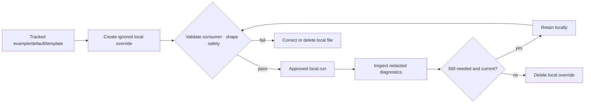

<!-- [KFM_META_BLOCK_V2]
doc_id: kfm://doc/configs-local-readme
title: configs/local/ — Local-Only Configuration Override Boundary
type: readme
version: v0.2
status: draft
owners: OWNER_TBD — Config steward · Security steward · Developer-experience steward · Ops steward · Consumer owner(s) · Validation steward · Docs steward
created: 2026-06-16
updated: 2026-07-13
policy_label: public; config-sublane; local-overrides; ignored-by-default; non-authoritative; no-secret-store; no-runtime-authority; no-deployment-authority; no-release-authority
current_path: configs/local/README.md
truth_posture: CONFIRMED target README, parent configs contract, .gitignore local-lane rules, root .env.example guidance, tracked sibling configuration boundaries, secrets and incident-response doctrine, and v0.1 introduction lineage / PROPOSED local-override contract, consumer metadata, naming posture, validation matrix, migration rules, and minimum safe local slice / UNKNOWN ignored workstation files, exhaustive local inventories, consumers, loaders, merge precedence, schema bindings, secret-store integration, validators, CI enforcement, deployment integration, owner assignments, and runtime behavior
evidence_snapshot:
  repository: bartytime4life/Kansas-Frontier-Matrix
  repository_id: "1059091169"
  visibility: public
  base_ref: main
  base_commit: b6bcc4cd27dc8c0fa1f74aa5b989cb3240e90aa8
  prior_blob: be6dce4a40e95f94eccb397dd351a4f912f64ba1
  introduction_commit: 5b458ab970cbda8966dc5c799d560a64ed086804
related:
  - ../README.md
  - ../dev/README.md
  - ../examples/README.md
  - ../templates/README.md
  - ../test/README.md
  - ../../.gitignore
  - ../../.env.example
  - ../../docs/doctrine/directory-rules.md
  - ../../docs/security/SECRETS.md
  - ../../docs/security/INCIDENT_RESPONSE.md
  - ../../apps/README.md
  - ../../packages/README.md
  - ../../pipelines/README.md
  - ../../pipeline_specs/README.md
  - ../../runtime/README.md
  - ../../infra/README.md
  - ../../schemas/contracts/v1/
  - ../../contracts/
  - ../../policy/
  - ../../tests/README.md
  - ../../tools/README.md
  - ../../release/README.md
tags: [kfm, configs, local, overrides, ignored, workstation, development, placeholders, secret-references, validation, precedence, governance]
notes:
  - "The repository .gitignore ignores configs/local/* and explicitly re-includes configs/local/README.md. The tracked lane is therefore the README; workstation-local override files are intentionally untracked."
  - "The root .env.example also states that configs/local/ is ignored and forbids committing real secrets."
  - "A path-scoped repository search returned this README but no additional tracked configs/local files. Ignored workstation files are not observable through GitHub and remain UNKNOWN by design."
  - "v0.1 called the lane commit-safe local templates. v0.2 corrects that boundary: commit-safe examples and reusable templates belong in configs/examples/, configs/templates/, configs/dev/, or another reviewed tracked lane; configs/local/ is for uncommitted local overrides."
  - "docs/security/INCIDENT_RESPONSE.md is confirmed at the pinned base. The separately referenced docs/runbooks/SECRET_LEAK_RUNBOOK.md path was not found and remains NEEDS VERIFICATION; this README does not publish a broken link to it."
  - "Only this Markdown file changes. No local override, example, template, .gitignore rule, .env file, consumer, loader, schema, policy, secret, test, workflow, runtime behavior, deployment binding, release record, or public artifact is created or modified."
[/KFM_META_BLOCK_V2] -->

<a id="top"></a>

# Local-Only Configuration Overrides

> `configs/local/` is the workstation-local configuration override boundary under `configs/`. Git ignores every child path in this lane except this README. Local files may support an explicitly named developer or operator workflow, but they are untracked, non-authoritative, machine-specific, and unsuitable as shared configuration, secret storage, deployment binding, runtime truth, or evidence of system behavior.

<p>
  
  
  
  
  
</p>

> [!IMPORTANT]
> **Document lifecycle:** `draft v0.2`  
> **Tracked lane maturity:** README-only at the inspected repository search; `.gitignore` excludes all other `configs/local/*` paths  
> **Owning responsibility root:** `configs/` — safe configuration defaults, templates, and configuration-facing documentation  
> **Local lane responsibility:** uncommitted, machine-local overrides for explicitly verified consumers  
> **Authority:** no schema, contract, policy, deployment, runtime, lifecycle, release, publication, or evidence authority  
> **Default posture:** useful locally only after validation; absent from shared builds unless a verified consumer explicitly supports it

> [!CAUTION]
> **Ignored does not mean safe.** A file under `configs/local/` can still leak through shell history, logs, screenshots, support bundles, backups, archives, editor sync, copied patches, or accidental force-adds. Prefer references-by-name and approved secret injection. Do not use this directory as a plaintext credential vault.

**Quick links:** [Purpose](#purpose) · [Authority](#authority-level) · [Status](#status) · [Lane distinctions](#configuration-lane-distinctions) · [What belongs](#what-belongs-here) · [What does not](#what-does-not-belong-here) · [Secrets](#secret-and-sensitive-value-posture) · [Consumers](#consumer-binding-and-precedence) · [Local contract](#proposed-local-override-contract) · [Lifecycle](#local-override-lifecycle) · [Validation](#validation) · [Negative states](#negative-state-and-failure-posture) · [Change pattern](#safe-change-pattern) · [Migration](#migration-and-promotion-posture) · [Rollback](#rollback-and-correction-posture) · [Evidence](#evidence-basis) · [Backlog](#verification-backlog) · [Done](#definition-of-done)

---

## Purpose

`configs/local/` provides a deliberately untracked place for **developer- or operator-specific configuration overrides** that should not become shared repository state.

A safe local override answers:

- which app, package, pipeline, runtime adapter, test harness, or tool consumes it;
- which tracked default, example, or template it overrides;
- which file format and parser are expected;
- whether the local file is optional or required for that consumer;
- which schema, contract, or validation command applies;
- which values are machine-specific but non-sensitive;
- which sensitive values are supplied by reference rather than stored directly;
- which precedence rule the verified consumer uses;
- what happens when the local file is missing, malformed, stale, or contains unknown fields.

This lane exists to keep machine-local customization from contaminating tracked configuration. It must not become a hidden dependency that only one workstation can satisfy.

[Back to top](#top)

---

## Authority level

**Local configuration sublane / untracked override boundary.**

| Concern | Authority status | Determination |
|---|---:|---|
| Folder placement | **CONFIRMED** | The path exists under the canonical `configs/` responsibility root. |
| Git tracking | **CONFIRMED** | `.gitignore` excludes `configs/local/*` and explicitly re-includes `configs/local/README.md`. |
| Root environment example | **CONFIRMED** | `.env.example` says local configuration is ignored and warns against committing real secrets. |
| Local file inventory | **UNKNOWN BY DESIGN** | Ignored files are workstation state and cannot be inventoried from GitHub. |
| Shared configuration authority | **DENY** | An ignored local file cannot define shared defaults, schema, policy, contract meaning, or deployment state. |
| Consumer behavior | **UNKNOWN unless verified** | This README does not establish that any app, pipeline, runtime, or tool loads this lane. |
| Merge precedence | **UNKNOWN unless verified** | No generic overlay or environment precedence is asserted here. |
| Secret storage | **NOT AUTHORIZED** | The lane may reference secrets but must not become a repository-adjacent plaintext secret store. |
| Production use | **NOT AUTHORIZED** | Local override success is not production readiness, deployment approval, or release evidence. |
| Validation | **PROPOSED / NEEDS VERIFICATION** | Expectations are documented; executable consumers and checks must be verified separately. |

A local override can influence a verified local consumer. It cannot establish project-wide truth.

[Back to top](#top)

---

## Status

### Bounded repository snapshot

At base commit `b6bcc4cd27dc8c0fa1f74aa5b989cb3240e90aa8`, the tracked lane is:

```text
configs/local/
└── README.md          # tracked by explicit .gitignore exception
```

The repository ignore rule is:

```gitignore
configs/local/*
!configs/local/README.md
```

A path-scoped repository search returned this README and no additional tracked file under `configs/local/`. This is the expected visible state. Ignored files on contributor workstations, in untracked local checkouts, or on other branches remain `UNKNOWN` and must not be inferred.

### Material correction from v0.1

The prior README described this lane as a place for "commit-safe local configuration templates." Current repository evidence narrows that statement:

- **tracked commit-safe examples** belong under `configs/examples/`, a reviewed `.env.example`, or another explicitly tracked example lane;
- **reusable templates** belong under `configs/templates/`;
- **shared development defaults** belong under `configs/dev/`;
- **machine-local overrides** belong under ignored `configs/local/` files.

This correction preserves the original goal—keeping personal overrides out of repository authority—while aligning the README with the actual ignore contract.

### Current maturity

| Capability | Status | Safe conclusion |
|---|---:|---|
| README boundary | **CONFIRMED** | The local override lane is documented. |
| Ignore contract | **CONFIRMED** | All children except the README are ignored by default. |
| Local override files | **UNKNOWN BY DESIGN** | GitHub cannot prove what exists on a workstation. |
| Named consumers | **NOT ESTABLISHED** | No loader or consumer is bound by this README. |
| Loader and precedence | **NOT ESTABLISHED** | Do not infer automatic discovery, overlay order, or environment substitution. |
| Schema validation | **NOT ESTABLISHED** | No local-file schema or validator is proven here. |
| Secret integration | **NEEDS VERIFICATION** | Doctrine exists; concrete store, injection, and redaction behavior require implementation evidence. |
| Test/CI enforcement | **LIMITED BY DESIGN** | CI cannot validate ignored workstation files; it can validate tracked examples, loader behavior, and boundary tests. |
| Deployment integration | **DENY BY DEFAULT** | Nothing here establishes staging or production binding. |
| Ownership | **OWNER_TBD** | Accepted owners have not been confirmed in the file metadata. |

[Back to top](#top)

---

## Configuration lane distinctions

The local lane must remain distinct from adjacent configuration responsibilities.

| Lane or surface | Intended responsibility | Relationship to `configs/local/` |
|---|---|---|
| [`../README.md`](../README.md) | Root contract for safe configuration defaults and templates. | Governs this sublane. |
| [`../examples/README.md`](../examples/README.md) | Commit-safe illustrative configuration for named consumers. | Use when reviewers and other contributors should see the file. |
| [`../templates/README.md`](../templates/README.md) | Reusable tracked configuration templates. | Use when a template is shared rather than workstation-specific. |
| [`../dev/README.md`](../dev/README.md) | Shared safe development defaults and tracked development templates. | Use when all developers should receive the same development posture. |
| [`../test/README.md`](../test/README.md) | Test-specific configuration defaults and templates. | Use for tracked deterministic test configuration. |
| [`.env.example`](../../.env.example) | Root environment-variable names and safe example values. | Copy or translate into local environment state; never commit the resulting secret-bearing file. |
| `runtime/` | Runtime adapters and harnesses. | A runtime may consume local config only through verified code. |
| `infra/` | Deployment, host, network, and exposure controls. | Local files cannot replace infrastructure authority. |
| `schemas/` and `contracts/` | Machine shape and semantic meaning. | Local config may reference them; it cannot redefine them. |
| `policy/` | Allow, deny, restrict, and abstain decisions. | Local overrides cannot bypass policy. |
| `fixtures/` and `tests/` | Deterministic test inputs and expected outcomes. | Ignored local files are not fixtures and cannot be CI evidence. |

> [!IMPORTANT]
> When a value must be reviewed, shared, reproduced, or tested in CI, it does **not** belong only in `configs/local/`. Create a safe tracked example, template, default, fixture, or test in its owning lane.

[Back to top](#top)

---

## What belongs here

The following material may exist locally under `configs/local/` when an explicitly verified consumer needs it.

| Local-only material | Example purpose | Required posture |
|---|---|---|
| Machine-specific path override | Local cache, checkout, socket, or model directory. | Portable fallback exists; no private data copied into the repository. |
| Local port or bind override | Avoid a port conflict during development. | Loopback or otherwise safe exposure; no assumption of production parity. |
| Developer feature toggle | Exercise a local-only code path. | Cannot bypass policy, release, validation, or access controls. |
| Local mock service endpoint | Point a verified consumer to a local mock. | Must not point public clients to internal services or credentials. |
| Resource limit | CPU, memory, worker, cache, or local concurrency adjustment. | Bounded; no claim that the setting is production-safe. |
| Local logging preference | Log level or local output path. | Must not disable mandatory audit or leak sensitive values. |
| Secret reference name | Environment-variable or secret-store key name. | Reference only; real value supplied outside the file when practical. |
| Optional consumer-specific overlay | Local override for a tracked default. | Consumer, base config, precedence, and validation are documented. |
| Local troubleshooting note | Temporary note next to a local override. | Untracked; no authority; remove when no longer needed. |

Local files should contain only the minimum values needed for the local workflow. A copied full production configuration is not a safe local override.

[Back to top](#top)

---

## What does not belong here

| Prohibited or misplaced material | Why it does not belong | Correct home or action |
|---|---|---|
| Commit-safe example intended for other contributors | Ignored files are invisible to review and CI. | `configs/examples/`, `.env.example`, or a consumer-owned example. |
| Reusable generic template | Shared templates require review and version control. | `configs/templates/`. |
| Shared development default | A team default must not depend on one workstation. | `configs/dev/`. |
| Deterministic test configuration | Ignored state cannot be reliable CI input. | `configs/test/`, `fixtures/`, and `tests/`. |
| Real token, password, private key, cookie, signing material, or database credential | This folder is not a secret store. | Approved secret manager, environment injection, OIDC, KMS/HSM, or governed workstation store. |
| Production or staging configuration | Local state is not deployment authority. | Governed deployment system and `infra/` controls. |
| Private endpoint or internal service handle that may leak | Ignored files can still escape through logs and support bundles. | Secure environment-specific configuration with access controls. |
| Schema definition | Local config cannot own machine shape. | `schemas/contracts/v1/` or accepted schema home. |
| Object or configuration semantics | Local files cannot own meaning. | `contracts/` and consumer documentation. |
| Policy rule or bypass flag | Local overrides cannot authorize behavior. | `policy/`; remove bypasses. |
| Application, package, pipeline, or runtime code | Configuration is not implementation. | `apps/`, `packages/`, `pipelines/`, or `runtime/`. |
| Deployment, network, firewall, proxy, or access-control definition | Local config cannot govern exposure. | `infra/`. |
| Source data, API responses, local databases, model weights, rasters, vectors, exports | This lane is not a data or artifact store. | Governed `data/`, `runtime/`, or external local storage as appropriate. |
| SourceDescriptor, registry row, receipt, proof, catalog/triplet record | Ignored local state cannot become canonical trust material. | Owning `data/` or `control_plane/` surfaces. |
| Release manifest, promotion decision, correction notice, rollback card | Local config cannot approve or record release. | `release/`. |
| Generated logs, reports, coverage, caches, or build outputs | Configuration lane is not an artifact home. | Local temp/cache directories or governed `artifacts/`. |
| Sensitive location, living-person data, genomic material, restricted infrastructure detail | Not necessary for local config and can cause harm. | Deny, redact, generalize, quarantine, or use synthetic values. |

A file being ignored does not authorize it to violate KFM policy or security boundaries.

[Back to top](#top)

---

## Secret and sensitive-value posture

`configs/local/` is **not** a secret store. KFM secrets doctrine states that no real secret may be committed, including values labeled "local" or "test," and that the repository should carry references-by-name rather than secret values.

For local overrides:

1. Prefer environment-variable names, secret-store references, OIDC, or short-lived credentials over embedded values.
2. Keep secret material outside version-controlled paths even when those paths are ignored.
3. Apply least privilege, owner assignment, rotation, and revocation to any local credential.
4. Prevent local loaders, loggers, exception handlers, tracing, telemetry, screenshots, and support bundles from echoing secret values.
5. Never expose local secrets to browser bundles or client-readable environment variables.
6. Never put a secret-bearing URL in a tracked example, issue, PR, test snapshot, README, or generated report.
7. Treat accidental tracking or disclosure as an incident: stop use, rotate or revoke, audit access, remove from history where appropriate, and follow [`docs/security/INCIDENT_RESPONSE.md`](../../docs/security/INCIDENT_RESPONSE.md).
8. Use obvious mock markers in tracked examples; never use values that merely "look fake" but are actually active.

### Git safeguards

Before relying on a local override, a maintainer can confirm the ignore rule with ordinary Git tooling:

```bash
git check-ignore -v configs/local/<candidate-file>
git status --short --ignored configs/local/
```

These commands confirm Git treatment, not secret safety, consumer behavior, or runtime correctness.

> [!WARNING]
> `git add -f` can bypass ignore rules. Force-adding a local override requires security and configuration review and normally indicates that the file belongs in a tracked example, template, or development-default lane after sanitization—not that the ignore policy should be bypassed.

[Back to top](#top)

---

## Consumer binding and precedence

This README does **not** define a universal configuration loader or overlay order.

A consumer may read a file under `configs/local/` only when current implementation evidence establishes:

- the consumer name and owner;
- the supported local filename or path;
- the parser and format version;
- whether the file is optional;
- the base/default configuration it overlays;
- the exact precedence relative to defaults, tracked development config, environment variables, command-line flags, secret injection, and deployment configuration;
- unknown-field and type-error behavior;
- schema or contract reference;
- validation command and tests;
- redaction and diagnostic behavior;
- behavior when the local file is absent.

### Precedence rule

Do not infer precedence from path names such as `local`, `dev`, or `override`. Precedence belongs to the verified consumer contract.

A safe consumer should:

1. start from a tracked, reviewable default or explicit empty configuration;
2. apply only documented local fields;
3. reject or warn on unknown fields according to a tested contract;
4. resolve secrets through approved injection rather than echoing values;
5. fail closed when a required value is malformed or unsafe;
6. continue safely when an optional local override is absent;
7. make the effective non-secret configuration inspectable without exposing secrets.

A shared workflow must not require an ignored local file unless the repository also provides a safe tracked example and documents the requirement.

[Back to top](#top)

---

## Proposed local override contract

The following metadata is **PROPOSED documentation guidance**, not a new machine schema.

| Field | Purpose |
|---|---|
| `consumer` | App, package, pipeline, runtime adapter, test harness, or tool that reads the file. |
| `owner` | Accountable consumer/config owner. |
| `format` | YAML, JSON, TOML, INI, env file, or other parser-specific format. |
| `base_config_ref` | Tracked default, template, or example being overridden. |
| `schema_or_contract_ref` | Machine-shape or semantic authority when one exists. |
| `local_path_pattern` | Verified path or filename recognized by the consumer. |
| `optional` | Whether the consumer can operate safely without the local file. |
| `precedence` | Explicit merge order relative to defaults, env, CLI, secrets, and deployment config. |
| `secret_refs` | Names of secret references, never the values. |
| `validation` | Verified command or test; otherwise `NEEDS VERIFICATION`. |
| `redaction` | Fields or values that must never appear in diagnostics. |
| `safe_absence_behavior` | Expected behavior when the file does not exist. |
| `last_reviewed` | Date the consumer binding and fields were checked. |

A future canonical machine contract belongs under the accepted schema and contract homes. Do not create a parallel schema inside this README or an ignored local file.

[Back to top](#top)

---

## Local override lifecycle

Local overrides do not enter the KFM publication lifecycle. They follow a narrower workstation lifecycle:



Local configuration must not bypass the canonical data lifecycle:

```text
RAW -> WORK / QUARANTINE -> PROCESSED -> CATALOG / TRIPLET -> PUBLISHED
```

A local override may configure an approved local process. It cannot promote data, approve evidence, change release state, create policy authority, or substitute for receipts, proofs, review, correction, or rollback.

[Back to top](#top)

---

## Validation

Because local files are ignored, repository CI cannot inspect their values directly. Validation must therefore be split between **tracked consumer/boundary tests** and **local operator checks**.

### Tracked validation responsibilities

| Validation area | What tracked tests or tooling should prove | Failure posture |
|---|---|---|
| Ignore boundary | Local payload files are ignored; README remains tracked. | Fail boundary check. |
| Optional absence | Consumers that advertise optional local config behave safely when the lane is empty. | Fail test; no hidden workstation dependency. |
| Loader path | Consumer reads only the documented local path or explicit caller-supplied path. | Fail closed; no recursive discovery. |
| Path confinement | User-controlled fields cannot escape allowed local paths or redirect writes into governed roots. | `DENY` or `ERROR`. |
| Format and schema | Parser errors, wrong types, unknown fields, and incompatible versions have deterministic outcomes. | Fail closed or explicit warning per contract. |
| Precedence | Merge order with defaults, env, CLI, and secret injection is deterministic and tested. | Fail test. |
| Redaction | Secrets and private values never appear in logs, errors, telemetry, snapshots, or support bundles. | Security failure. |
| Policy boundary | Local toggles cannot disable evidence, rights, sensitivity, validation, release, or access-control gates. | `DENY`; fail test. |
| Exposure boundary | Local bind or host settings cannot silently expose internal services publicly. | Fail closed. |
| Shared reproducibility | Any required local shape has a sanitized tracked example and documented setup. | Incomplete implementation. |

### Local operator checks

Before using a local override, verify:

- [ ] the file is ignored by Git;
- [ ] the consumer and loader path are current;
- [ ] the file was derived from a reviewed tracked example or documented contract;
- [ ] no real secret is embedded when a reference or secret injection is available;
- [ ] local paths, ports, endpoints, and resource limits are intentional;
- [ ] the consumer validates the file before performing side effects;
- [ ] diagnostics are redacted;
- [ ] optional absence behavior is understood;
- [ ] stale or unused overrides are removed;
- [ ] the local file does not bypass policy, release, evidence, or access controls.

### Minimum local test scenarios

A verified consumer should cover:

- local file absent;
- valid local override;
- malformed syntax;
- unknown field;
- wrong type;
- unsupported version;
- missing required non-secret value;
- missing secret reference;
- redaction of secret-bearing diagnostics;
- unsafe bind or public-exposure attempt;
- path traversal or destination escape attempt;
- precedence conflict between local, environment, and CLI values;
- stale or deprecated field;
- local value attempting to disable a mandatory governance gate.

[Back to top](#top)

---

## Negative-state and failure posture

| Condition | Required posture |
|---|---|
| Optional local file is absent | Continue with tracked safe defaults and record no false error. |
| Required local file is absent | Stop with a clear local setup error; do not invent values. |
| File is malformed | `ERROR`; no partial application unless explicitly designed and tested. |
| Unknown field appears | Reject or warn according to the verified schema or consumer contract; never silently repurpose it. |
| Secret reference is unresolved | `DENY` or `ERROR`; do not expose secret-bearing context. |
| File contains a likely real secret | Stop use, remove exposure, rotate or revoke if necessary, and follow incident procedure. |
| Local override weakens policy or evidence gates | `DENY`; local configuration cannot override governance. |
| Local override binds an internal service publicly | `DENY` unless a reviewed infra and security posture explicitly authorizes exposure. |
| Local file conflicts with deployment configuration | Deployment authority wins; surface the conflict rather than merging silently. |
| Local file is stale or references removed fields | Fail validation or emit an actionable deprecation error. |
| Consumer behavior is not verified | Mark `NEEDS VERIFICATION`; do not claim the override works. |
| A shared workflow depends on an ignored file | Treat as reproducibility drift and add a sanitized tracked example or remove the dependency. |

[Back to top](#top)

---

## Safe change pattern

For documentation or code changes that affect `configs/local/`:

1. Confirm the local lane is the correct responsibility boundary.
2. Inspect `.gitignore` and preserve the README exception.
3. Do not add or force-add workstation-specific override values.
4. Put shared examples, templates, or defaults in their tracked configuration lanes.
5. Identify every verified consumer and loader path affected by the change.
6. Document precedence, safe absence behavior, schema or contract references, and redaction.
7. Add or update tracked tests for loader, precedence, path confinement, redaction, and governance boundaries.
8. Keep local values out of commits, PR descriptions, issue comments, test snapshots, and generated artifacts.
9. Explain migration for renamed fields or paths without exposing local values.
10. Preserve a rollback path for the README, ignore rules, and consumer behavior.

A README-only change must state that no consumer, loader, ignore rule, local value, schema, policy, runtime behavior, or deployment binding changed.

[Back to top](#top)

---

## Migration and promotion posture

### When local-only material becomes shared

If an ignored local setting needs to become visible to other contributors or CI:

1. Identify the consumer and authority owner.
2. Remove all real secrets, personal paths, private endpoints, sensitive identifiers, and workstation state.
3. Convert values to obvious placeholders or safe defaults.
4. Place the sanitized artifact in `configs/examples/`, `configs/templates/`, `configs/dev/`, `configs/test/`, or the consumer-owned tracked lane.
5. Add schema or contract references and validation.
6. Add tracked tests and documentation.
7. Keep the real local override ignored.
8. Record compatibility and rollback when field names or precedence change.

This is a governed promotion from **local-only convenience** to **reviewed shared configuration**. It is not KFM data publication and does not create release authority.

### When tracked material was placed here by mistake

Because `.gitignore` normally blocks tracked children, investigate any tracked non-README file under `configs/local/`:

1. Determine whether it was force-added or predates the ignore rule.
2. Inspect for secrets and sensitive workstation details before moving or displaying content.
3. Rotate or revoke exposed credentials where necessary.
4. Move sanitized shared material to its owning tracked lane.
5. Remove the local file from tracking while preserving a contributor's local copy only when safe.
6. Record drift if a consumer or workflow depended on the tracked path.

[Back to top](#top)

---

## Rollback and correction posture

Rollback is required if this README is used to justify any of the following without stronger evidence:

- committing workstation-specific override files;
- treating `configs/local/` as the shared example or template lane;
- storing plaintext secrets or sensitive operational values;
- claiming a consumer, loader, precedence rule, validation path, or runtime behavior that has not been verified;
- making ignored local state a CI, deployment, release, policy, evidence, or publication dependency;
- allowing local flags to bypass mandatory governance or security controls.

Rollback target:

```text
Restore configs/local/README.md v0.1
blob SHA: be6dce4a40e95f94eccb397dd351a4f912f64ba1
```

This is a documentation-only change. Rollback does not alter `.gitignore`, `.env.example`, workstation files, secret values, consumers, schemas, policies, tests, runtime behavior, deployments, lifecycle records, releases, or public artifacts.

[Back to top](#top)

---

## Evidence basis

| Source | Status | Supports | Limits |
|---|---:|---|---|
| [`../README.md`](../README.md) | **CONFIRMED** | `configs/` is the canonical root for safe non-secret defaults and templates and cannot replace schema, policy, infra, runtime, data, or release authority. | Does not prove this lane's consumers or local files. |
| [`.gitignore`](../../.gitignore) | **CONFIRMED** | `configs/local/*` is ignored and `configs/local/README.md` is explicitly tracked. | Cannot inventory ignored workstation files. |
| [`.env.example`](../../.env.example) | **CONFIRMED** | Local config is ignored; real secrets must not be committed; example variables use safe local values. | Does not prove a specific consumer or precedence chain. |
| [`../examples/README.md`](../examples/README.md) | **CONFIRMED** | Commit-safe examples are a distinct tracked lane and are non-authoritative. | Does not prove actual examples or consumer binding beyond its evidence snapshot. |
| [`../templates/README.md`](../templates/README.md) | **CONFIRMED** | Reusable tracked templates are distinct from local overrides. | Current template inventory and validation remain bounded by that README. |
| [`../dev/README.md`](../dev/README.md) | **CONFIRMED** | Shared development defaults and templates are a tracked configuration sublane with no secret or deployment authority. | Does not prove this local lane's loaders. |
| [`../test/README.md`](../test/README.md) | **CONFIRMED** | Test configuration has a separate tracked lane and remains subordinate to `tests/` and `fixtures/`. | Does not prove local consumer behavior. |
| [`../../docs/security/SECRETS.md`](../../docs/security/SECRETS.md) | **CONFIRMED doctrine** | Repository is not a secret store; references-by-name and secret injection are preferred; real secrets in local or test material must not be committed. | Concrete secret store, rotation, and enforcement remain implementation-specific. |
| [`../../docs/security/INCIDENT_RESPONSE.md`](../../docs/security/INCIDENT_RESPONSE.md) | **CONFIRMED draft** | A tracked security incident-response surface exists. | Detailed secret-leak runbook path remains `NEEDS VERIFICATION`. |
| `docs/runbooks/SECRET_LEAK_RUNBOOK.md` | **NOT FOUND at pinned base** | The path is referenced by secrets doctrine as proposed procedural detail. | Do not publish it as a working link until created or relocated. |
| Repository search for `configs/local/` | **BOUNDED RESULT** | Returned this README and no additional tracked local file. | Search is not a recursive workstation inventory; ignored files remain invisible. |
| v0.1 introduction commit `5b458ab970cbda8966dc5c799d560a64ed086804` | **CONFIRMED lineage** | Preserves the original intent to keep personal and machine-specific overrides outside repository authority. | Its commit-safe-template wording conflicted with current ignore evidence and is corrected here. |
| Actual local overrides, consumers, loaders, precedence, validators, CI, deployments, and runtime behavior | **UNKNOWN / NEEDS VERIFICATION** | Required before implementation claims. | This README is not executable proof. |

[Back to top](#top)

---

## Verification backlog

| Item | Status | Evidence needed |
|---|---:|---|
| Confirm accountable owners. | **NEEDS VERIFICATION** | CODEOWNERS, maintainer decision, or accepted ownership record. |
| Inventory consumers that support local override files. | **NEEDS VERIFICATION** | Code search, consumer docs, config loaders, and tests. |
| Confirm supported local filenames and formats. | **NEEDS VERIFICATION** | Loader implementations and parser contracts. |
| Confirm merge and precedence rules. | **NEEDS VERIFICATION** | Consumer code and deterministic tests. |
| Confirm safe absence behavior. | **NEEDS VERIFICATION** | Tests with an empty `configs/local/` lane. |
| Confirm schema and contract bindings. | **NEEDS VERIFICATION** | Schema references, validation results, and consumer docs. |
| Confirm secret injection, redaction, rotation, and revocation posture. | **NEEDS VERIFICATION** | Security config, tests, and operational evidence. |
| Confirm the canonical detailed secret-leak runbook path. | **NEEDS VERIFICATION** | Create or locate the runbook and update `docs/security/SECRETS.md` references. |
| Confirm public-exposure protections for local bind and host overrides. | **NEEDS VERIFICATION** | Infra and security tests plus runtime evidence. |
| Confirm path confinement and traversal protection. | **NEEDS VERIFICATION** | Negative tests for loader paths and output destinations. |
| Confirm tracked examples exist for every required local shape. | **NEEDS VERIFICATION** | `configs/examples/`, `.env.example`, or consumer-owned example inventory. |
| Confirm CI boundary checks for ignore rules, loader behavior, redaction, and governance bypass. | **NEEDS VERIFICATION** | Workflow files and passing run evidence. |
| Confirm no shared workflow depends solely on ignored local state. | **NEEDS VERIFICATION** | CI, app, pipeline, runtime, and developer-setup audit. |

[Back to top](#top)

---

## Definition of done

- [ ] `OWNER_TBD` is replaced with accountable config, security, developer-experience, operations, consumer, validation, and docs owners.
- [ ] `.gitignore` continues to ignore local payloads and track only the README unless an accepted, security-reviewed change says otherwise.
- [ ] Every consumer that supports local overrides documents the path, format, optionality, precedence, schema or contract, validation, redaction, and safe absence behavior.
- [ ] Shared workflows do not depend solely on ignored workstation files.
- [ ] Every required local shape has a sanitized tracked example or template.
- [ ] No local override can bypass policy, evidence, validation, release, access-control, or exposure gates.
- [ ] Secret references, injection, redaction, rotation, revocation, and incident response are documented and tested.
- [ ] Loader tests cover absence, validity, malformed syntax, unknown fields, wrong types, unsupported versions, precedence conflicts, path escape, unsafe exposure, and governance-bypass attempts.
- [ ] Local diagnostics can expose effective non-secret configuration without leaking secrets or sensitive workstation state.
- [ ] Tracked configuration lanes clearly distinguish examples, templates, shared development defaults, tests, and local-only overrides.
- [ ] CI and review evidence is cited before enforcement or implementation maturity is claimed.
- [ ] Stale field names, paths, loaders, and local setup notes have migration and rollback guidance.

[Back to top](#top)

---

## Related surfaces

- [`../README.md`](../README.md) — canonical configuration-root contract.
- [`../examples/README.md`](../examples/README.md) — commit-safe configuration examples.
- [`../templates/README.md`](../templates/README.md) — reusable tracked templates.
- [`../dev/README.md`](../dev/README.md) — shared development defaults and templates.
- [`../test/README.md`](../test/README.md) — tracked test configuration defaults and templates.
- [`.gitignore`](../../.gitignore) — local-lane ignore contract.
- [`.env.example`](../../.env.example) — tracked environment-variable example.
- [`../../docs/security/SECRETS.md`](../../docs/security/SECRETS.md) — secret handling doctrine.
- [`../../docs/security/INCIDENT_RESPONSE.md`](../../docs/security/INCIDENT_RESPONSE.md) — confirmed security incident-response surface.
- [`../../docs/doctrine/directory-rules.md`](../../docs/doctrine/directory-rules.md) — placement and responsibility-root doctrine.
- `apps/`, `packages/`, `pipelines/`, `pipeline_specs/`, `runtime/`, and `tools/` — possible consumers only when verified.
- `schemas/`, `contracts/`, `policy/`, `infra/`, `data/`, and `release/` — separate authority roots that local overrides cannot replace.

---

## Status summary

`configs/local/` is the intentionally ignored workstation-override lane under `configs/`. The README is tracked; local payload files are not. Local overrides may support a verified local consumer, but they are non-authoritative, non-reproducible unless paired with tracked examples and tests, and unable to define schemas, policy, deployment, runtime truth, lifecycle state, evidence, release, or publication.

<p align="right"><a href="#top">Back to top</a></p>
