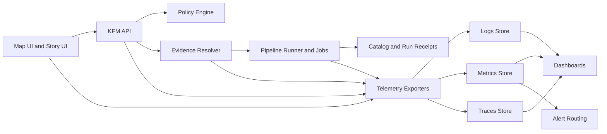

<!-- [KFM_META_BLOCK_V2]
doc_id: kfm://doc/7a9a6f18-93b8-4e8a-90f2-6e7b2c6f9c2d
title: Observability Configs
type: standard
version: v2
status: draft
owners: Steward + Operator
created: 2026-02-22
updated: 2026-02-23
policy_label: restricted
related:
  - configs/observability/
tags:
  - kfm
  - observability
  - governance
notes:
  - Declarative, governed observability configuration for logs/metrics/traces/dashboards/alerts/runbooks.
  - Treat this as a contract surface: changes ripple into dashboards, alerting, and investigations.
  - v2 adds: directory contract, config registry, classification+retention guidance, SLO/runbook scaffolding, expanded CI gates.
[/KFM_META_BLOCK_V2] -->

# Observability Configs

Declarative, governed observability configuration for Kansas Frontier Matrix (KFM): **logs**, **metrics**, **traces**, **dashboards**, **alerts**, and **runbooks**.

**Status:** Draft (v2) • **Scope:** Runtime + Pipelines • **Environments:** dev / staging / prod • **Owners:** Steward + Operator (assign in `CODEOWNERS`)


> WARNING  
> This folder is part of the **trust membrane**. Any change here can change what operators see, what pages, what routes alerts take, and what investigations can prove.

---

## Quick navigation
- [Directory contract](#directory-contract)
- [Config registry](#config-registry)
- [Minimum required telemetry](#minimum-required-telemetry)
- [Telemetry contract](#telemetry-contract)
- [Data classification and retention](#data-classification-and-retention)
- [Cardinality and cost controls](#cardinality-and-cost-controls)
- [Dashboards, SLOs, and alerting](#dashboards-slos-and-alerting)
- [Deployment model](#deployment-model)
- [Change workflow](#change-workflow)
- [CI gates](#ci-gates)
- [Appendix](#appendix)

---

## Directory contract

### Purpose
Provide a **single governed source of truth** for KFM observability configuration so that:
- operators can answer **“is it healthy?”**
- stewards can answer **“is it compliant?”**
- investigations can answer **“what happened, end-to-end, without leaking restricted data?”**

### Where it fits in the repo
This directory is expected at:

- `configs/observability/` (this file is the entrypoint)

### Acceptable inputs
Only **declarative configuration artifacts** that can be validated and promoted via GitOps:
- dashboards (e.g., Grafana JSON)
- alert rules (e.g., Prometheus rules, Alertmanager routes, or vendor equivalents)
- collector/agent configs (e.g., OpenTelemetry Collector config)
- log parsing pipelines (e.g., JSON parsing rules, grok patterns)
- retention / routing policies (as config, not prose)
- runbooks and escalation playbooks (markdown)

### Exclusions
Do **not** put these here:
- application instrumentation code (belongs in services)
- business/product analytics events (separate pipeline; avoid mixing with governance telemetry)
- secrets (API keys, tokens, passwords). Reference secret names, never store secret values.
- raw sensitive data or precise restricted coordinates/geometries

> NOTE  
> You can choose any observability stack. This README defines **the contract and governance posture** that any stack must satisfy.

---

## Config registry

This registry makes changes reviewable and prevents “mystery dashboards/alerts.”

| Config type | Primary intent | Recommended location | Required checks |
|---|---|---|---|
| Dashboards | Human diagnosis | `dashboards/<persona>/` | schema + lint + UID stability |
| Alert rules | Actionable paging/tickets | `metrics/rules/` | syntax + unit test + routing |
| Alert routing | Who gets notified | `alerts/routing/` | dry-run + severity rules |
| Metrics scrape/targets | What is measured | `metrics/scrape/` | diff review + cardinality budget |
| Log pipelines | Parsing + redaction | `logs/pipelines/` | redaction lint + sample tests |
| Retention policies | Storage time horizons | `policies/retention/` | policy-label alignment |
| Trace sampling | Cost + privacy | `traces/sampling/` | sampling spec validation |
| Collector/agent config | Export + processors | `collectors/` | config validate + redaction lint |
| Runbooks | “What to do when it pages” | `runbooks/` | required for P0/P1 |

> TIP  
> If you add a new config type, add it to this table first. Make review explicit.

---

## Minimum required telemetry

KFM’s **minimum observability baseline**.

**Do not ship without:**
- **Structured logs** with `correlation_id` and `audit_ref`
- **Metrics**
  - request latency **P95** per endpoint
  - evidence resolver latency
  - tile response latency
  - pipeline run durations and failures
  - policy decision counters (allow/deny)
- **Traces**
  - optional early, but supported by the contract if enabled (same IDs, same redaction posture)

> NOTE  
> “Minimum” is the floor. Add more as you learn, but keep identifier and field semantics stable.

---

## Telemetry contract

This section defines **stable semantics** so dashboards, alerts, and investigations do not break as implementations evolve.

### Correlation and audit identifiers

- `correlation_id`  
  A request-scoped ID used to join logs, metrics, and traces across components (UI → API → downstream).

- `audit_ref`  
  A governed-operation reference. It **MUST** be emitted in logs and returned by governed API operations and policy-safe errors so investigations can be audited **without leaking restricted details**.

### End-to-end observability model



### Required log event families

Use stable `event.family` (or equivalent) so parsers and dashboards remain consistent.

| Family | Required? | Purpose | Must include |
|---|---:|---|---|
| `request` | ✅ | API/UI request lifecycle | `correlation_id`, `http.method`, `http.route`, `http.status_code` |
| `policy` | ✅ | Allow/deny decisions | `audit_ref`, `policy.decision`, `policy.reason_codes[]` |
| `audit` | ✅ | Governed audit ledger record | `audit_ref`, `who`, `what`, `when`, `io.digests[]` |
| `pipeline` | ✅ | Pipeline runs + receipts | `run_id`, `pipeline.name`, `status`, `commit_sha` |
| `catalog` | ✅ | Publish/promote events | `dataset_id`, `dataset_version_id`, `policy_label` |
| `security` | ✅ | Auth, abuse, denials, anomalies | `audit_ref` when governed |

> WARNING  
> Do not invent new event families casually. Add families via PR with a migration note and dashboard updates.

### Audit record minimum fields

Every governed operation **MUST** emit an audit log record that captures:
- **who**: principal + role  
- **what**: endpoint + parameters (policy-safe)  
- **when**: timestamp  
- **why**: purpose if declared  
- **inputs/outputs**: by **digest** (not raw payloads)  
- **policy decisions**: allow/deny, obligations, reason codes

### Standard identifiers and attributes

Standardize on the following keys (adjust names only via explicit contract change).

| Concept | OTel attribute | Prom label | Notes |
|---|---|---|---|
| Correlation ID | `kfm.correlation_id` | (avoid as label) | Use logs/traces; metrics via exemplars |
| Audit ref | `kfm.audit_ref` | (avoid as label) | High cardinality; allow exemplars only |
| Run ID | `kfm.job.run_id` | `job_run_id` | UUID/ULID |
| Commit SHA | `kfm.git.commit_sha` | `commit_sha` | 7–40 hex |
| Status | `kfm.job.status` | `status` | scheduled/running/succeeded/failed/canceled |
| Started | `kfm.job.started_at` | `started_at` | RFC3339; also emit unix seconds |
| Ended | `kfm.job.ended_at` | `ended_at` | RFC3339; also emit unix seconds |
| Dataset ID | `kfm.dataset.id` | `dataset_id` | DCAT/STAC id |
| Dataset version | `kfm.dataset.version_id` | `dataset_version_id` | immutable version identifier |
| Pipeline | `kfm.pipeline.name` | `pipeline` | stable slug |
| Env | `deployment.environment` | `env` | dev/staging/prod |
| Service | `service.name` | `service` | stable name |

### Metrics naming and labeling rules

These rules keep dashboards coherent and keep costs bounded.

- Prefer **RED** (Rate/Errors/Duration) for APIs and **USE** (Utilization/Saturation/Errors) for infrastructure.
- Always include **service** and **env** labels for request metrics.
- Include **route template** (`/api/v1/foo/:id`) not raw paths.
- **Do not** label metrics with high-cardinality values:
  - raw query text
  - raw coordinates / geometries
  - user identifiers
  - dataset_version_id in metrics (allowed in logs; metrics only by sampling/exemplars)
  - `audit_ref` in metrics (exemplars only)

> TIP  
> If you need to pivot on “who/what”, put that detail in **audit logs** (restricted access) and join via `audit_ref`, not by exploding metrics cardinality.

---

## Data classification and retention

Observability is governance. Telemetry must not leak restricted data or personal data, and it must follow retention rules.

### Telemetry classification tiers

Use policy labels consistently across storage and access controls.

| Telemetry stream | Default policy label | Examples | Access | Storage and retention baseline |
|---|---|---|---|---|
| Service metrics | `public` or `restricted` (choose) | latency, error rate, saturation | broad internal | longer retention OK (SLO trending) |
| Traces | `restricted` | end-to-end spans, attributes | stewards/operators, limited dev | medium retention; sampling required |
| Structured service logs | `restricted` | request logs, component logs | stewards/operators | medium retention; strict redaction |
| Audit ledger logs | `restricted` (highest sensitivity) | who/what/why + digests | stewards/operators only | retention + legal hold policy |
| Security events | `restricted` | auth failures, abuse signals | security + operators | medium retention; immutable where required |

> WARNING  
> If a stream contains `audit_ref`, treat it as **restricted** by default.

### Sensitive location and restricted data leakage

Do not log:
- raw restricted geometries or precise coordinates
- policy-protected dataset existence hints in “public” contexts
- full query payloads if they contain restricted identifiers

Preferred patterns:
- log `dataset_version_id` + digests, not raw records
- log generalized/coarsened spatial filters when needed
- store sensitive details in the audit ledger under restricted access controls, linked via `audit_ref`

### Retention policy requirements

Retention must be **declared, enforced, and reviewed**:
- define per-stream retention targets (days/months)
- define deletion/archival procedures
- define access reviews and audit trails for restricted telemetry

> NOTE  
> Exact time horizons are organization/policy dependent. Add them in `policies/retention/` and treat policy changes like breaking changes.

---

## Cardinality and cost controls

Observability can DoS itself via unbounded labels and too much trace volume.

### Cardinality budget (baseline)

- **Hard deny**: user IDs, raw coordinates, raw query strings, raw geometries as metric labels
- **Soft allow with review**: dataset_id as label (only if bounded), pipeline as label
- **Exemplars**: attach `audit_ref` / `correlation_id` as exemplars where supported (sampling)

### Trace sampling posture

- default to head-based sampling in high-volume paths
- allow tail sampling for P0 investigation triggers (bounded and time-boxed)
- always apply attribute redaction before export

---

## Dashboards, SLOs, and alerting

Dashboards should support three primary personas.

### Steward dashboards

Focus: policy and rights compliance.

Panels (examples):
- policy denials by rule / dataset / endpoint
- rights issues (unclear rights, blocked publish attempts)
- quarantine counts and backlogs
- evidence resolver allow/deny rates and latency

### Operator dashboards

Focus: runnability and SLOs.

Panels (examples):
- pipeline run success rate and duration distributions
- storage usage by lifecycle zone (raw/work/processed/published)
- API error rates and saturation, queue depths
- deployment status signals (rollouts, crash loops)

### Product dashboards

Focus: user-facing quality.

Panels (examples):
- UI performance (page load, map interaction latency)
- tile latency and error rates
- a11y regression indicators (from CI and/or runtime checks)

### Proposed default SLOs

These are starting points; tune with real baselines.

| Surface | Indicator | Objective | Notes |
|---|---|---:|---|
| API availability | `5xx` + request success | 99.9% | per env; exclude planned maintenance |
| API latency | P95 duration | target per endpoint | different endpoints have different targets |
| Tile service | success + latency | 99.9% + P95 target | watch for upstream dependency issues |
| Evidence resolver | success + latency | 99.5% + P95 target | often bounded by external I/O |
| Pipeline runner | run success rate | 99%+ | by pipeline class (daily vs ad hoc) |

### Alerting

Alerts must be **actionable** and routed by severity with a runbook.

**P0 / Page**
- sustained API unavailability
- sustained tile failures
- pipeline runs failing above threshold
- evidence resolver failing or timing out
- audit log ingestion failures (blindness)

**P1 / Ticket**
- SLO burn (latency P95 elevated)
- storage nearing capacity
- rising policy denial rate (potential misconfig or attempted misuse)

> TIP  
> Prefer multi-window burn-rate alerts over single hard thresholds. Track alert fatigue as a first-class signal.

---

## Deployment model

Preferred operational posture is GitOps:
- declarative manifests in repo
- environments: dev, staging, prod
- promotion between environments is controlled and audited
- secrets managed outside git but referenced declaratively

> NOTE  
> This repo does not declare a specific tool (Kustomize, Helm, Argo CD, Flux, etc.). Choose one, and keep overlays consistent across envs.

---

## Suggested directory layout

Add only what you actually use.

```text
configs/observability/                               # Governed observability config (logs/metrics/traces/dashboards/alerts)
├─ README.md                                         # What’s governed here, ownership, and how CI/runtime consumes it
│
├─ contracts/                                        # Optional: contracts/schemas for telemetry consistency
│  ├─ telemetry-contract.md                          # (Optional) Field-level contract: required attrs, redaction, naming
│  └─ schemas/                                       # (Optional) JSON Schemas for dashboards/rules/config objects
│
├─ collectors/                                       # Telemetry collectors configuration (by env/role)
│  └─ otel-collector/                                # (Optional) OTel Collector configs (ingest/export pipelines)
│
├─ metrics/                                          # Metrics configuration (scrape + rules)
│  ├─ scrape/                                        # (Optional) Scrape configs (if not operator-managed)
│  └─ rules/                                         # Recording rules + alert rules (Prometheus-style)
│
├─ alerts/                                           # Alerting configuration
│  └─ routing/                                       # Routing rules (severity → destinations, grouping, silences)
│
├─ logs/                                             # Log pipelines + governance (parse/redact/retain)
│  ├─ pipelines/                                     # Parsing + redaction rules (PII/sensitive-field handling)
│  └─ retention/                                     # Retention policies (if not centralized elsewhere)
│
├─ traces/                                           # Distributed tracing governance
│  ├─ sampling/                                      # Sampling strategies (head/tail, per-route/service policies)
│  └─ processors/                                    # Processors (attribute redaction, batching, enrichment)
│
├─ dashboards/                                       # Dashboards organized by audience
│  ├─ steward/                                       # Steward-facing (data quality, policy denies, promotion health)
│  ├─ operator/                                      # Operator-facing (infra/runtime health, saturation, errors)
│  └─ product/                                       # Product-facing (usage, UX funnels, performance)
│
├─ runbooks/                                         # Alert-linked runbooks (P0/P1 response guides)
│  ├─ p0-api-unavailable.md                          # (Optional) P0: API down
│  ├─ p0-audit-ingestion-down.md                     # (Optional) P0: audit pipeline down
│  └─ p1-slo-burn-latency.md                         # (Optional) P1: latency burn
│
└─ deploy/                                           # Deployment wiring (helm/kustomize manifests)
   ├─ base/                                          # Baseline manifests / values
   └─ overlays/                                      # Per-environment deltas
      ├─ dev/
      ├─ staging/
      └─ prod/
```

---

## Change workflow

Treat observability changes like an API contract change.

### Required PR content

1. **Intent:** what question are we trying to answer?
2. **Contract stability:** identifiers remain stable (`audit_ref`, `correlation_id`, run IDs).
3. **Dashboards + alerts:** updated together, or justify why not.
4. **Cardinality review:** confirm no high-cardinality labels were introduced.
5. **Safety review:** confirm redaction and retention impact.

### Breaking change policy

Breaking changes include:
- renaming a metric series used by dashboards/alerts
- changing log field semantics (same field, new meaning)
- changing `audit_ref` emission rules
- changing alert severity definitions or routing keys

If breaking:
- add a migration note in the PR
- update dashboards/alerts in the same PR
- bump doc version if the contract meaning changes

---

## CI gates

**Proposed** gates to enforce safe, stable observability (implement per chosen stack):

- validate dashboard JSON schema and provisioning
- validate alert rules syntax (and optionally unit test rule behavior)
- run a “metrics contract” test (expected series names exist)
- run a “no secrets in configs” scan
- run a “no restricted leakage” lint (deny known coordinate fields, raw geometries, raw query blobs)
- validate collector configs (collector config parser / dry-run)
- require runbook presence for P0 alerts

<details>
<summary><strong>Example: CODEOWNERS snippet</strong></summary>

```txt
# TODO: replace with real GitHub teams/users
/configs/observability/ @kfm-steward @kfm-operator
```

</details>

---

## Appendix

<details>
<summary><strong>Example: audit log record shape</strong></summary>

```json
{
  "ts": "2026-02-23T18:12:03.123Z",
  "level": "INFO",
  "service": "kfm-api",
  "env": "staging",

  "correlation_id": "01HZZZZZZZZZZZZZZZZZZZZZZZ",
  "audit_ref": "kfm://audit/01HYYYYYYYYYYYYYYYYYYYYYYYY",

  "event": { "family": "audit", "name": "governed.operation" },

  "who": { "principal": "user:123", "role": "steward" },
  "what": { "endpoint": "POST /api/v1/focus/ask", "params": { "scope": "public" } },
  "why": "investigation",

  "io": {
    "inputs": [{ "digest": "sha256:..." }],
    "outputs": [{ "digest": "sha256:..." }]
  },

  "policy": {
    "decision": "allow",
    "obligations": ["attribution_required"],
    "reason_codes": ["P-ALLOW-001"]
  },

  "latency_ms": 842
}
```

</details>

<details>
<summary><strong>Metric checklist</strong></summary>

- [ ] API request latency P95 per endpoint
- [ ] API error rate (4xx/5xx split)
- [ ] Evidence resolver latency
- [ ] Tile response latency + error rate
- [ ] Pipeline run durations histogram
- [ ] Pipeline run failures counter
- [ ] Policy denials counter (by rule, bounded)
- [ ] Rights blocks counter
- [ ] Quarantine backlog gauge
- [ ] Audit ingestion health (dropped events, lag)

</details>

<details>
<summary><strong>Design rule: metrics vs logs vs traces</strong></summary>

- Metrics answer “how often / how long / how many” at low cost.
- Logs answer “what exactly happened” under restricted access.
- Traces answer “where time went” with sampling + redaction.

If you need attribution or sensitive details, use logs with `audit_ref`, not metric labels.

</details>

---

<a id="top"></a>
**Back to top:** [Observability Configs](#observability-configs)
