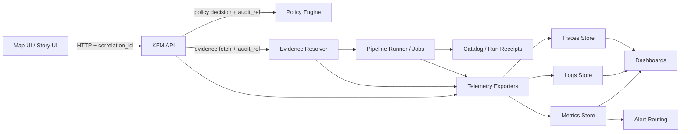

<!-- [KFM_META_BLOCK_V2]
doc_id: kfm://doc/7a9a6f18-93b8-4e8a-90f2-6e7b2c6f9c2d
title: Observability Configs
type: standard
version: v1
status: draft
owners: Steward + Operator
created: 2026-02-22
updated: 2026-02-22
policy_label: restricted
related:
  - configs/observability/
tags:
  - kfm
  - observability
  - governance
notes:
  - Declarative, governed observability configuration for logs/metrics/traces/dashboards/alerts.
  - Treat this as a contract surface: changes ripple into dashboards, alerting, and investigations.
[/KFM_META_BLOCK_V2] -->

# Observability Configs

Declarative, governed observability configuration for Kansas Frontier Matrix (KFM): **logs**, **metrics**, **traces**, **dashboards**, and **alerts**.

**Status:** Draft (vNext) • **Scope:** Runtime + Pipelines • **Environments:** dev / staging / prod • **Owners:** Steward + Operator (assign in `CODEOWNERS`)

  

---

## Quick navigation
- [What lives here](#what-lives-here)
- [Minimum required telemetry](#minimum-required-telemetry)
- [Telemetry contract](#telemetry-contract)
- [Dashboards and alerting](#dashboards-and-alerting)
- [Governance and safety](#governance-and-safety)
- [Suggested directory layout](#suggested-directory-layout)
- [Deployment model](#deployment-model)
- [Change workflow](#change-workflow)
- [Appendix](#appendix)

---

## What lives here

This folder is the **configuration surface** for KFM observability. It should let operators and stewards answer:

- **Is the platform healthy?** availability, latency, capacity, errors
- **Are governed operations compliant?** policy denials, rights issues, quarantines, audit integrity
- **Is user experience degrading?** UI performance and a11y regression signals
- **Can we trace a specific governed action end-to-end?** UI → API → evidence resolver/pipelines → catalogs/run receipts

### Non-goals
- Application instrumentation code (belongs in service repos/modules).
- Business analytics (belongs in product analytics; keep separate from governance telemetry).

---

## Minimum required telemetry

KFM’s **minimum observability baseline**.

**Do not ship without:**
- **Structured logs** with `correlation_id` and `audit_ref`
- **Metrics**
  - request latency **P95** per endpoint
  - evidence resolver latency
  - tile response latency
  - pipeline run durations and failures
- **Traces**
  - optional early, but supported by contract if enabled

> NOTE  
> “Minimum” is the floor. Add more as you learn, but keep identifier and field semantics stable.

---

## Telemetry contract

This section defines **expected semantics** for identifiers and fields so that dashboards, alerts, and investigations remain consistent across services.

### Correlation and audit identifiers

- `correlation_id`  
  A request-scoped ID used to join logs, metrics, and traces across components (UI ↔ API ↔ downstream services).

- `audit_ref`  
  A governed-operation reference. It **MUST** be emitted in logs and returned by governed API operations and policy-safe errors so investigations can be audited without leaking restricted details.

### End-to-end observability model



### Audit record minimum fields

Every governed operation **MUST** emit an audit log record that captures:

- **who**: principal + role  
- **what**: endpoint + parameters (policy-safe)  
- **when**: timestamp  
- **why**: purpose if declared  
- **inputs/outputs**: by **digest** (not raw payloads)  
- **policy decisions**: allow/deny, obligations, reason codes

> WARNING  
> Audit logs are sensitive operational data. See [Governance and safety](#governance-and-safety).

### Standard run identifiers

KFM benefits from stable identifiers shared across telemetry and catalogs (DCAT/STAC/PROV/run receipts).  
If you implement OpenTelemetry and/or Prometheus-style labels, standardize on the following keys.

| Concept | OTel attribute | Prom label | Notes |
|---|---|---|---|
| Run ID | `kfm.job.run_id` | `job_run_id` | UUID/ULID |
| Commit SHA | `kfm.git.commit_sha` | `commit_sha` | 7–40 hex |
| Status | `kfm.job.status` | `status` | scheduled/running/succeeded/failed/canceled |
| Started | `kfm.job.started_at` | `started_at` | RFC3339; also emit unix seconds |
| Ended | `kfm.job.ended_at` | `ended_at` | RFC3339; also emit unix seconds |
| Dataset ID | `kfm.dataset.id` | `dataset_id` | DCAT/STAC id |
| Pipeline | `kfm.pipeline.name` | `pipeline` | stable slug |

### Metrics naming rules

These rules keep dashboards coherent even as implementations change.

- Prefer **RED** (Rate/Errors/Duration) for APIs and **USE** (Utilization/Saturation/Errors) for infrastructure.
- Include **service**, **env**, and **endpoint** labels for request metrics.
- Do **not** label metrics with high-cardinality values:
  - raw query text
  - raw coordinates / geometries
  - user identifiers
  - unbounded IDs (unless explicitly approved, and then only via controlled sampling / exemplars)

> TIP  
> If you need to pivot on “who/what”, put those details in **audit logs** (restricted access) and join via `audit_ref`, not by exploding metrics cardinality.

---

## Dashboards and alerting

Dashboards should support three primary views.

### Steward view

Focus: policy and rights compliance.

Examples of panels:
- policy denials by rule / dataset / endpoint
- rights issues (unclear rights, blocked publish attempts)
- quarantine counts and backlogs
- evidence resolver allow/deny rates and latency

### Operator view

Focus: runnability and SLOs.

Examples of panels:
- pipeline run success rate and duration distributions
- storage usage by lifecycle zone (raw/work/processed/catalog)
- API error rates and saturation, queue depths
- deployment status signals (rollouts, crash loops)

### Product view

Focus: user-facing quality.

Examples of panels:
- UI performance (page load, map interaction latency)
- tile latency and error rates
- a11y regression indicators (from CI and/or runtime checks)

### Alerting

Alerts should be **actionable** and routed by severity.

**P0 / Page**
- sustained API unavailability
- sustained tile failures
- pipeline runs failing above threshold
- evidence resolver failing or timing out

**P1 / Ticket**
- SLO burn (latency P95 elevated)
- storage nearing capacity
- rising policy denial rate (potential misconfig or attempted misuse)

> TIP  
> Track alert fatigue. Prefer multi-window burn-rate alerts over noisy single-threshold alerts.

---

## Governance and safety

Observability is part of governance: it **MUST NOT** leak restricted data or personal data.

### Audit log protections

Audit logs **MUST** be treated as sensitive operational data:

- append-only
- redacted for PII and restricted info
- access restricted to stewards/operators
- retention and deletion policies defined and enforced

### Sensitive location and restricted data leakage

Do not log:
- raw restricted geometries or precise coordinates
- policy-protected dataset existence hints in “public” contexts
- full query payloads if they contain restricted identifiers

Preferred patterns:
- log `dataset_version_id` + digests, not raw records
- log generalized or coarsened spatial filters when needed
- store sensitive details in the audit ledger under restricted access controls, linked via `audit_ref`

---

## Suggested directory layout

This repository may choose any observability stack. The following layout is recommended because it cleanly separates concerns and makes GitOps overlays straightforward.

```text
configs/observability/
  README.md

  # Metrics — scraping + recording + alert rules
  metrics/
    # scrape/        # scrape configs (if not operator-managed)
    # rules/         # recording rules and alert rules

  # Logs — parsing, routing, retention
  logs/
    # pipelines/     # parsing rules (json, grok, etc.)
    # retention/     # retention configs/policies

  # Traces — sampling, tail policies, exporters
  traces/
    # sampling/      # sampling strategies
    # processors/    # attribute redaction, batching, etc.

  # Dashboards — JSON, provisioning, folders
  dashboards/
    # steward/
    # operator/
    # product/

  # Stack deployment glue
  deploy/
    # base/          # baseline manifests / helm values
    # overlays/      # dev / staging / prod overlays
```

> NOTE  
> Don’t create empty folders just to match this tree. Add only what you actually use, and keep the README accurate.

---

## Deployment model

Preferred operational posture is GitOps:

- declarative manifests in repo
- environments: dev, staging, prod
- promotion between environments is controlled and audited
- secrets are managed outside git but referenced declaratively

For Kubernetes or OpenShift-style deployments, observability should cover:
- pipeline runner (batch jobs)
- API service
- evidence resolver (may be part of API)
- policy engine (sidecar or embedded)
- search and database services (managed where possible)

---

## Change workflow

When you change observability configs, treat it like an API contract change: dashboards and alerts depend on it.

### Required steps

1. Describe the intent in the PR: **what question are we trying to answer**?
2. Keep identifier contracts stable: `audit_ref`, `correlation_id`, run IDs and labels.
3. Update dashboards and alerts (or justify why not).
4. Confirm no high-cardinality labels were introduced.
5. Confirm redaction and retention impact (audit logs are sensitive).

### CI gates

**Proposed** gates for CI to enforce safe, stable observability:

- validate dashboard JSON schema and provisioning
- validate alert rules syntax
- run a “metrics contract” test (expected series names exist)
- run a “no secrets in configs” scan
- run a “no restricted leakage” lint (deny known coordinate fields in audit logs)

---

## Appendix

<details>
<summary><strong>Example: audit log record shape</strong></summary>

This example shows a shape that satisfies the governed audit requirements. Field names may vary by implementation, but the semantics should remain stable.

```json
{
  "ts": "2026-02-22T18:12:03.123Z",
  "level": "INFO",
  "service": "kfm-api",
  "env": "staging",

  "correlation_id": "01HZZZZZZZZZZZZZZZZZZZZZZZ",
  "audit_ref": "kfm://audit/01HYYYYYYYYYYYYYYYYYYYYYYYY",

  "who": { "principal": "user:123", "role": "steward" },
  "what": { "endpoint": "POST /api/v1/focus/ask", "params": { "scope": "public" } },
  "why": "investigation",

  "io": {
    "inputs": [{ "digest": "sha256:..." }],
    "outputs": [{ "digest": "sha256:..." }]
  },

  "policy": {
    "decision": "allow",
    "obligations": ["attribution_required"],
    "reason_codes": ["P-ALLOW-001"]
  },

  "latency_ms": 842
}
```

</details>

<details>
<summary><strong>Example: metric checklist</strong></summary>

- [ ] API request latency P95 per endpoint
- [ ] Evidence resolver latency
- [ ] Tile response latency
- [ ] Pipeline run durations histogram
- [ ] Pipeline run failures counter
- [ ] Policy denials counter
- [ ] Rights blocks counter
- [ ] Quarantine backlog gauge

</details>
