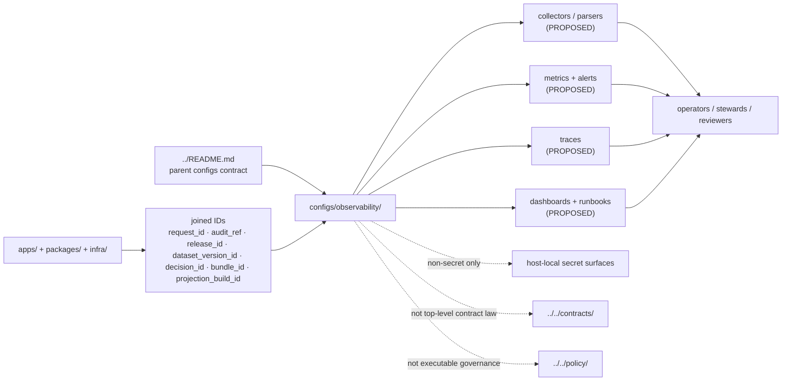

<!-- [KFM_META_BLOCK_V2]
doc_id: kfm://doc/TODO(verify-doc-uuid)
title: observability/
type: standard
version: v1
status: draft
owners: @bartytime4life
created: TODO(verify-created-date)
updated: TODO(verify-updated-date)
policy_label: TODO(verify-policy-label)
related: [configs/README.md, configs/env.schema.json, .github/CODEOWNERS, contracts/README.md, policy/README.md, tools/README.md, tests/README.md]
tags: [kfm, observability, configs]
notes: [repo-grounded rewrite of a scaffold README; owner derived from current /configs/ CODEOWNERS coverage; internal observability lanes remain PROPOSED until committed]
[/KFM_META_BLOCK_V2] -->

# observability/

Repo-visible, non-secret observability configuration and runbook entrypoint for KFM runtime, pipelines, and governed delivery surfaces.

> **Status:** experimental directory · scaffold-only current tree · README expansion  
> **Owners:** `@bartytime4life` (current `/configs/` CODEOWNERS coverage)  
> **Path:** `configs/observability/README.md`  
>        
> **Quick jump:** [Scope](#scope) · [Repo fit](#repo-fit) · [Accepted inputs](#accepted-inputs) · [Exclusions](#exclusions) · [Directory tree](#directory-tree) · [Quickstart](#quickstart) · [Usage](#usage) · [Diagram](#diagram) · [Reference tables](#reference-tables) · [Task list](#task-list--definition-of-done) · [FAQ](#faq) · [Appendix](#appendix)

> [!IMPORTANT]
> This directory is **currently scaffold-only** in the public repo.  
> This README therefore does two jobs at once:
> 1. state what is **CONFIRMED** about the current lane;
> 2. define the **PROPOSED** working contract for what may be added here next without blurring KFM’s stronger seams.

> [!NOTE]
> Use these labels throughout this file:
> - **CONFIRMED** — directly supported by current repo evidence or repeated KFM doctrine
> - **INFERRED** — strongly suggested by adjacent repo structure or doctrine, but not yet proven here as a committed artifact
> - **PROPOSED** — recommended next shape for this lane
> - **UNKNOWN** — not yet demonstrated in the current repo
> - **NEEDS VERIFICATION** — merge-time detail that should be rechecked before landing

## Scope

`observability/` is the `configs/` child lane for **reviewable, repo-visible observability surfaces**.

In KFM, observability is not just uptime math. It is part of the system’s explanatory capacity: how operators reconstruct what ran, what was denied, what changed, what release or dataset version was involved, and whether correction or rollback signals remained visible after the fact.

This lane should therefore hold only the subset of observability material that is both:

1. **configuration-like** rather than application code; and
2. **safe to keep in Git** because it is non-secret, reviewable, and diff-worthy.

## Repo fit

`observability/` narrows the stronger parent rule already established by [`../README.md`](../README.md): `configs/` is for repo-visible, non-secret runtime wiring, deployment values, observability defaults, and shell-facing defaults.

### Current repo-grounded state

| Item | Current state | Status |
| --- | --- | --- |
| Directory path | `configs/observability/` exists | **CONFIRMED** |
| Current contents | `README.md` only | **CONFIRMED** |
| Parent config lane | [`../README.md`](../README.md) exists and already defines `configs/` as a trust-bearing, non-secret config surface | **CONFIRMED** |
| Parent schema anchor | [`../env.schema.json`](../env.schema.json) exists | **CONFIRMED** |
| Parent schema depth | current file content is minimal and should not be treated as a mature config contract yet | **CONFIRMED** |
| Owner coverage | [`../../.github/CODEOWNERS`](../../.github/CODEOWNERS) currently assigns `/configs/` to `@bartytime4life` | **CONFIRMED** |
| Collector, metrics, traces, dashboards, alerts, runbooks inside this lane | no committed internal inventory is visible here yet | **UNKNOWN** |

### Upstream / downstream links

| Direction | Path | Why it matters | Status |
| --- | --- | --- | --- |
| Upstream | [`../README.md`](../README.md) | parent `configs/` contract and local style baseline | **CONFIRMED** |
| Upstream | [`../env.schema.json`](../env.schema.json) | current config-schema anchor at the parent lane | **CONFIRMED** |
| Upstream | [`../../contracts/README.md`](../../contracts/README.md) | top-level machine-law surface; this lane must not compete with it | **CONFIRMED** |
| Upstream | [`../../policy/README.md`](../../policy/README.md) | executable governance belongs there, not here | **CONFIRMED** |
| Sidecar | [`../../tools/README.md`](../../tools/README.md) | validators and config-check tooling should point here, not bury config rules in prose | **CONFIRMED** |
| Sidecar | [`../../tests/README.md`](../../tests/README.md) | alert, retention, and leakage rules need test hooks | **CONFIRMED** |
| Sidecar | [`../../scripts/README.md`](../../scripts/README.md) | operational helpers may consume this lane, but should not become its hidden source of truth | **CONFIRMED** |
| Downstream | `apps/`, `packages/`, `infra/` | likely consumers of observability config once this lane grows beyond scaffold | **INFERRED** |

## Accepted inputs

The following content belongs here when it is **non-secret**, **reviewable**, and **configuration-like**.

| Input class | Typical contents | Why it belongs here |
| --- | --- | --- |
| Collector / exporter config | OTel Collector, forwarder, processor, exporter, receiver, or parser config | reviewable signal-shaping belongs in Git |
| Metrics config | scrape targets, recording rules, alert rules, bounded label maps | keeps operational semantics explicit |
| Log pipeline config | redaction rules, parsing pipelines, structured field maps, routing defaults | prevents “mystery log shaping” in runtime-only systems |
| Trace config | sampling policies, processors, enrichment/redaction rules | keeps cost/privacy tradeoffs visible |
| Dashboard definitions | persona-scoped dashboard JSON or equivalent | diagnostics should be diffable and reviewed |
| Alert routing config | severity maps, routing groups, silence defaults, escalation paths | pager behavior is trust-impacting |
| Runbooks | P0/P1 response guides, audit reconstruction steps, correction-response steps | alerting without response guidance is incomplete |
| Local observability field guidance | naming rules, joined-identifier tables, field expectations for logs/metrics/traces | useful here only if kept subordinate to top-level contract authority |

### What belongs here in practice

- non-secret observability defaults
- reviewable collector and routing config
- dashboard and alert definitions
- redaction and retention config
- alert-linked runbooks
- local, observability-scoped field guidance that does **not** try to become a second top-level contract universe

## Exclusions

| Do **not** keep here | Put it instead | Why |
| --- | --- | --- |
| Secrets, API keys, tokens, webhook credentials, DSNs with secret values | host-local secret files or secret manager surfaces | this lane must remain safe to commit |
| Application instrumentation code | service or package source trees | code belongs with the runtime that emits it |
| Business or product analytics events | separate product analytics lane or app code | do not mix governance telemetry with product analytics |
| Raw sensitive records, precise restricted coordinates, restricted geometries | governed data / audit / evidence surfaces | observability must not become a leakage side channel |
| Top-level JSON Schemas, OpenAPI, vocabularies acting as machine law | [`../../contracts/README.md`](../../contracts/README.md) | KFM needs a visible, singular contract authority |
| Executable governance logic, deny/allow bundles, reason/obligation registries | [`../../policy/README.md`](../../policy/README.md) | policy belongs in policy |
| Generated caches, temp logs, agent state, build output | ignored runtime state outside Git | reviewable config should stay intentional |
| Release evidence, correction notices, rollback manifests | designated evidence / release surfaces | observability may point to them, not replace them |

> [!WARNING]
> If a file here changes what operators can prove, what a runbook assumes, how restricted telemetry is handled, or whether rollback/correction can be reconstructed, that file is **not** “just config.”

## Directory tree

### Current live tree

```text
configs/observability/
└── README.md
```

### Working shape once real observability artifacts land

The tree below is **PROPOSED**, not current repo fact.

```text
configs/observability/
├── README.md
├── collectors/            # PROPOSED: collector / forwarder / exporter config
├── metrics/               # PROPOSED: scrape, recording, and alert rules
├── alerts/                # PROPOSED: routing, silences, escalation defaults
├── logs/                  # PROPOSED: parsing, redaction, retention config
├── traces/                # PROPOSED: sampling and processors
├── dashboards/            # PROPOSED: steward / operator / product views
├── runbooks/              # PROPOSED: alert-linked response docs
├── contracts/             # PROPOSED: local field guidance only, not a second top-level schema authority
└── deploy/                # PROPOSED: env-specific wiring for this lane
```

### Reading rule for this tree

- The **current** repo only proves the directory and this README.
- The **proposed** subpaths are here to make future growth orderly.
- Add a subdirectory only when the first real committed artifact for that concern lands.
- If a future artifact would silently compete with top-level `contracts/` or `policy/`, stop and move it there instead.

[Back to top](#observability)

## Quickstart

Before adding the first real observability artifact, inspect current reality.

```bash
# 0) Confirm current lane state.
find configs/observability -maxdepth 3 -type f | sort

# 1) Re-read the parent config contract and owner coverage.
sed -n '1,240p' configs/README.md
sed -n '1,160p' .github/CODEOWNERS
cat configs/env.schema.json

# 2) Find likely observability consumers and existing signal vocabulary.
git grep -nE 'audit_ref|correlation_id|request_id|release_id|dataset_version_id|decision_id|bundle_id|projection_build_id|otel|opentelemetry|prometheus|grafana|tempo|loki' -- .

# 3) Check whether the concern actually belongs here.
git grep -nE 'schema|contract|openapi|policy|rego|retention|redaction|readiness|health' -- contracts policy apps packages tools tests scripts
```

### First useful move

When this lane stops being scaffold-only, the smallest useful commit is usually:

1. one real config artifact,
2. one validation path,
3. one linked runbook if alerting is involved,
4. one README update that changes **PROPOSED** to **CONFIRMED** only where the file tree now proves it.

## Usage

### 1) Keep this lane non-secret and declarative

Commit only what reviewers can safely inspect and diff.

That means:
- config
- dashboards
- rules
- runbooks
- field guidance

Not:
- credentials
- host-local state
- raw runtime output
- ad hoc copied log bundles

### 2) Keep joined identifiers stable

KFM doctrine is strongest where operators can trace a public-facing result or failure back through release, policy, evidence, and runtime layers.

Do not casually rename or fragment the joined identifier vocabulary used across logs, traces, audit records, and run artifacts.

Minimum starter set for this lane:

- `request_id`
- `audit_ref`
- `release_id`
- `dataset_version_id`
- `decision_id`
- `bundle_id`
- `projection_build_id`

### 3) Treat readiness as trust-bearing

A live process is not enough.

Observability in KFM should help answer questions like:

- Is published scope readable?
- Is evidence resolution functioning?
- Are policy bundles loaded?
- Are audit sinks writable?
- Are correction and rollback events still queryable?

### 4) Prefer trust questions over vanity dashboards

Start with dashboards that answer consequential questions, not only “CPU good / CPU bad.”

Good early categories are:

- **steward** — policy denials, rights uncertainty, quarantine backlog
- **operator** — run success, queue depth, audit health, failure concentration
- **product** — tile latency, page responsiveness, visible stale-state incidents

### 5) Couple alerts and runbooks

If a rule can wake someone up, the corresponding “what to do next” guide should land in the same governed change stream.

Prefer:
- `alert rule + runbook + reviewer note`

Avoid:
- `alert rule now, runbook later`

### 6) Do not create a second schema universe

The repo already carries stronger top-level authority surfaces for contracts and policy.

If this lane later gets `contracts/`, keep it explicitly narrow:
- local observability field guidance
- schema fragments for dashboard or config object validation
- migration notes for observability-only changes

Do **not** let it become a competing source of truth for repo-wide contract law.

> [!CAUTION]
> A local observability helper schema is acceptable.  
> A second authoritative schema regime is not.

## Diagram


```mermaid
flowchart LR
    P["../README.md<br/>parent configs contract"] --> O["configs/observability/"]
    O --> C["collectors / parsers<br/>(PROPOSED)"]
    O --> M["metrics + alerts<br/>(PROPOSED)"]
    O --> T["traces<br/>(PROPOSED)"]
    O --> D["dashboards + runbooks<br/>(PROPOSED)"]

    A["apps/ + packages/ + infra/"] --> J["joined IDs<br/>request_id · audit_ref · release_id · dataset_version_id · decision_id · bundle_id · projection_build_id"]
    J --> O

    O -. "non-secret only" .-> S["host-local secret surfaces"]
    O -. "not top-level contract law" .-> K["../../contracts/"]
    O -. "not executable governance" .-> Y["../../policy/"]

    C --> X["operators / stewards / reviewers"]
    M --> X
    T --> X
    D --> X
```

## Reference tables

### Current evidence boundary

| Concern | What this README treats as settled | Status |
| --- | --- | --- |
| Lane existence | `configs/observability/` exists in the live repo | **CONFIRMED** |
| Lane depth | current lane is scaffold-only | **CONFIRMED** |
| Parent config doctrine | `configs/` is the repo-visible, non-secret configuration home | **CONFIRMED** |
| Current internal observability inventory | committed collectors, dashboards, alert rules, traces, runbooks | **UNKNOWN** |
| Future local lane shape | organized subpaths under this directory | **PROPOSED** |
| Actual deployed observability stack | Grafana / Prometheus / OTel / Tempo / Loki or alternatives | **UNKNOWN** |

### Doctrine-aligned minimums for this lane

| Concern | Minimum KFM expectation | Current repo state |
| --- | --- | --- |
| Joined identifiers | stable IDs across logs, traces, audit records, and run artifacts | **PROPOSED contract** |
| Honest readiness | health proves more than process liveness | **UNKNOWN implementation** |
| Restricted telemetry handling | no secrets, no raw restricted geometries, no precise restricted coordinates in repo-visible telemetry config | **README rule to enforce** |
| Release / rollback visibility | observability can reconstruct what changed and why | **PROPOSED** |
| Trust-question dashboards | persona-scoped, governed diagnostic views | **PROPOSED** |
| Alert / runbook coupling | paging rules and response docs land together | **PROPOSED** |

### First committed file set when this lane becomes active

| First artifact | Why it matters | Status |
| --- | --- | --- |
| `collectors/` config | makes signal export and redaction reviewable | **PROPOSED** |
| `metrics/` rules | turns SLO and alert semantics into diffable config | **PROPOSED** |
| `logs/` pipeline rules | prevents hidden parsing / redaction drift | **PROPOSED** |
| `traces/` sampling config | keeps privacy and cost visible | **PROPOSED** |
| `dashboards/` definitions | prevents “mystery dashboard” sprawl | **PROPOSED** |
| `runbooks/` | keeps alert response coupled to alert creation | **PROPOSED** |
| `deploy/` wiring | makes per-env rollout shape explicit | **PROPOSED** |

[Back to top](#observability)

## Task list / definition of done

- [ ] The live `configs/observability/` tree was rechecked before merge
- [ ] This README clearly separates **CONFIRMED** current state from **PROPOSED** future shape
- [ ] No secrets, tokens, or private credentials are committed
- [ ] Every new file names its primary consumer
- [ ] Any joined identifier added here is documented and stable
- [ ] Any redaction or retention rule change includes reviewer-visible rationale
- [ ] Alert-routing changes include a runbook update in the same change stream
- [ ] No local file here competes with top-level contract or policy authority
- [ ] Meta-block placeholders were verified or intentionally kept as placeholders
- [ ] Relative links to parent and adjacent repo docs were rechecked against the live tree

## FAQ

### Why give observability its own config lane if KFM treats it as part of one evidence system?

Because observability still needs a reviewable home for non-secret config, dashboards, rules, and runbooks.

What this lane must **not** do is pretend observability is separate from contracts, policy, release evidence, or correction logic.

### Why not keep all dashboards and alerts under `infra/` instead?

That is a valid repo choice if the project later decides to centralize them there.

This README does not force a split. It defines what belongs in `configs/observability/` **if** the repo chooses to grow this lane from scaffold to working surface.

### Are traces required on day one?

Not necessarily.

But if tracing is enabled, it should preserve the same joined-identifier and redaction posture as the rest of the lane.

### Why mention rollback and correction in an observability README?

Because KFM observability is supposed to help explain what changed, what failed, what was denied, and what was superseded.

That is not extra polish. It is part of operational trust.

## Appendix

<details>
<summary><strong>Telemetry starter set and trust questions</strong> (PROPOSED)</summary>

### Starter keys worth keeping stable

| Key | Why it matters | Where it should not go |
| --- | --- | --- |
| `request_id` | reconstruct request lifecycles | unstable metric label explosions |
| `audit_ref` | join operator-visible events to governed audit context | raw public telemetry surfaces |
| `release_id` | explain which promoted surface was active | ad hoc dashboard-only notes |
| `dataset_version_id` | trace visible behavior to immutable data state | uncontrolled high-cardinality labels |
| `decision_id` | explain policy outcomes across layers | implicit frontend-only state |
| `bundle_id` | connect runtime explanation to evidence packaging | informal analyst notes |
| `projection_build_id` | diagnose stale or mismatched derived surfaces | hidden internal-only logs no one can find |

### Good first trust questions for dashboards

- Can released scope be resolved right now?
- Are policy bundles current and loaded?
- Are correction notices propagating to operator-visible views?
- Are projection builds stale?
- Can audit ingestion still reconstruct a governed event?
- Which pipeline class is failing, and against which dataset or release context?

### Merge-time verification checklist

```bash
# Reconfirm current lane contents.
find configs/observability -maxdepth 3 -type f | sort

# Reconfirm owner coverage.
sed -n '1,120p' .github/CODEOWNERS

# Reconfirm parent config context.
sed -n '1,240p' configs/README.md
cat configs/env.schema.json

# Reconfirm whether any real observability artifacts now exist elsewhere.
git grep -nE 'otel|opentelemetry|prometheus|grafana|tempo|loki|alertmanager|audit_ref|correlation_id' -- .
```

</details>

[Back to top](#observability)
