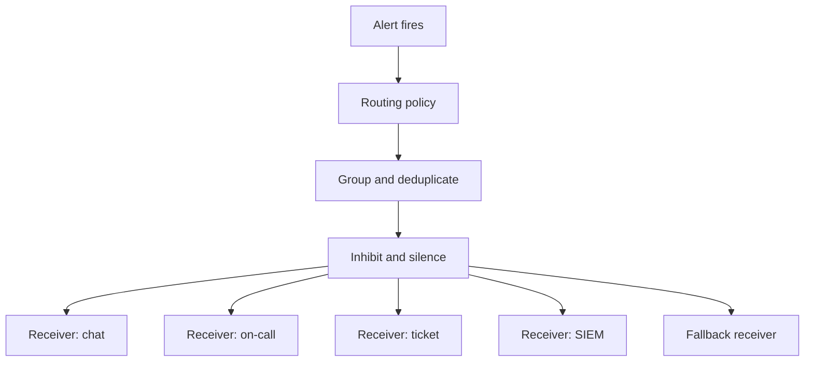

<!-- [KFM_META_BLOCK_V2]
doc_id: kfm://doc/2a311a8b-3d7e-42d7-bf50-265674c733ec
title: Alert Routing Configuration
type: standard
version: v1
status: draft
owners: TBD-observability
created: 2026-02-23
updated: 2026-02-23
policy_label: restricted
related: []
tags: [kfm, observability, alerts, routing]
notes:
  - Routing policy is reviewed like code; no secrets/PII in this directory.
  - Tool-specific rendered configs should be generated deterministically.
[/KFM_META_BLOCK_V2] -->

<a id="top"></a>

# Alert routing configs
**Purpose:** Define *where* alerts go (team/channel/on-call), *when* they escalate, and *how* duplicates are reduced — as a governed, reviewable policy layer.


> [!WARNING]
> Treat routing as an **operational control plane**. Small changes can page the wrong people (or nobody).
> This directory is **restricted-by-default**: do not commit secrets, phone numbers, emails, webhooks, or vendor tokens.

## Navigation
- [Directory contract](#directory-contract)
- [How routing works](#how-routing-works)
- [Required alert labels](#required-alert-labels)
- [Routing patterns](#routing-patterns)
- [Receivers and secret handling](#receivers-and-secret-handling)
- [Change workflow](#change-workflow)
- [Validation and CI gates](#validation-and-ci-gates)
- [Troubleshooting](#troubleshooting)
- [Unknowns to confirm](#unknowns-to-confirm)
- [Appendix](#appendix)

---

## Directory contract

| Item | Contract |
|---|---|
| **Where this fits** | `configs/observability/alerts/…` → routing policy for alert notifications (not alert *rules*) |
| **Acceptable inputs** | Route trees/policies, receiver *names* (no tokens), grouping/inhibition rules, environment scoping, mapping tables (team ↔ service ↔ channel) |
| **Exclusions** | Secrets (webhooks, API keys), PII (personal emails/phones), alert rule definitions, dashboards, runbook content, vendor-specific credentials |

### Suggested layout
> This repo snapshot wasn’t available when this README was generated — treat this as a **recommended** layout, and adapt to the files present in this directory.

```text
configs/observability/alerts/routing/
  README.md                      # This file (human contract)
  policy/                        # Human-authored routing policy (source of truth)
    routes.yaml                  # Route tree and matchers
    receivers.yaml               # Receiver registry (names + metadata only)
    inhibition.yaml              # Noise reduction / inhibition rules
  rendered/                      # Tool-specific output (generated; do not hand-edit)
    alertmanager.yaml            # Example: Prometheus Alertmanager config
    grafana-notifications.json   # Example: Grafana Unified Alerting policies/contact points
  schemas/                       # JSONSchema / CUE / other validation artifacts
  tests/                         # Unit tests / golden tests for routing decisions
  tools/                         # Render + validate helpers (scripts, jsonnet, cue, etc.)
```

---

## How routing works

Routing is the deterministic decision of:

1. **Match** an alert (by labels/annotations) to a route.
2. **Group & deduplicate** to avoid paging storms (group_by, group_wait, group_interval, repeat_interval).
3. **Inhibit/silence** secondary alerts when a primary/root-cause alert is firing.
4. **Deliver** to one or more receivers (chat, on-call, tickets, SIEM, etc.).
5. **Fallback** safely (a default receiver) if no route matches.



### Design goals
> These are **general** requirements for an effective alerting system and downstream response workflows.
> Keep the *intent* even if your tooling changes (see Section 2 citations in this chat for the reference excerpts).

- **Actionable delivery:** route to response systems (on-call/ticket/SIEM), not just dashboards.
- **Noise control:** group/dedupe/inhibit aggressively; page only on what humans must act on.
- **Determinism:** the same input labels must always select the same route (tests enforce this).
- **Least surprise:** routing should match org boundaries (team ownership) and service boundaries.

---

## Required alert labels

> [!NOTE]
> Routing is only as good as the metadata on alerts. If alerts are missing labels, routing turns into fragile string-matching on alert names.

**Minimum required labels (recommended):**

| Label | Example | Why it matters |
|---|---|---|
| `env` | `dev`, `staging`, `prod` | Prevents dev alerts paging prod on-call |
| `service` | `tiles-api`, `etl-ingest` | Primary ownership handle |
| `team` | `platform`, `data`, `frontend` | Primary routing handle |
| `severity` | `info`, `warning`, `page` | Escalation control |
| `region` | `us-central1` | Useful for geo routing and maintenance windows |

**Minimum required annotations (recommended):**

| Annotation | Example | Why it matters |
|---|---|---|
| `summary` | `High 5xx rate on tiles-api` | Human scan line |
| `runbook_url` | `docs/runbooks/tiles-api.md` | Makes the alert actionable |
| `dashboard_url` | `…` | Optional, but speeds triage |

> [!TIP]
> Prefer **stable** routing labels (`team`, `service`, `env`) over volatile ones (pod name, instance IP).

---

## Routing patterns

### 1) Environment guardrails
Recommended policy: **never page from non-prod** unless explicitly allowed.

- `env != prod` → chat-only receiver (or drop entirely)
- `env == prod` + `severity == page` → on-call receiver

### 2) Team ownership first, then service
When in doubt, match `team` first, then refine by `service`:

- `team=platform` routes to platform channels/on-call
- `team=data` routes to data channels/on-call
- `team=frontend` routes to frontend channels/on-call

### 3) Severity drives escalation
A common 3-tier mapping:

| Severity | Typical delivery | Ticket? | On-call page? |
|---|---|---:|---:|
| `info` | chat digest | optional | no |
| `warning` | chat + ticket | yes | no |
| `page` | on-call + chat | optional | yes |

### 4) Default/fallback route
Define a **single** fallback receiver for unmatched alerts. It should be staffed, monitored, and treated as a bug queue for missing labels/routes.

---

## Receivers and secret handling

> [!IMPORTANT]
> Receiver *configuration* often requires secrets (webhooks, tokens). Keep those out of git.

**Policy in this repo:**
- ✅ OK: receiver **names**, descriptions, owning team, paging windows, escalation policy references.
- ❌ Not OK: Slack webhooks, PagerDuty routing keys, Opsgenie API keys, email lists with personal addresses.

**Recommended practice (implementation-dependent):**
- Store secrets in a secret manager (Kubernetes Secret, SOPS-encrypted files, Vault, cloud secret store).
- Reference secrets by **stable key name** (e.g., `secretRef: pagerduty_platform_prod`).

---

## Change workflow

1. **Change only one intent per PR** (e.g., “route tiles-api warnings to #frontend-alerts”).
2. Add or update **tests** proving the routing decision.
3. Update the **receiver registry** (ownership, contact method, escalation policy link).
4. Run local validation (see below).
5. PR must include:
   - Before/after routing decision examples
   - Any impacted teams tagged for review
   - Rollback plan (usually revert PR)

### Definition of done
- [ ] Every new/changed route has at least one test case
- [ ] No secrets/PII added (secret scan passes)
- [ ] Default route remains safe and staffed
- [ ] All required labels are present in affected alerts (or a tracking issue exists)
- [ ] Change is reversible via revert

---

## Validation and CI gates

Because the exact toolchain for this repo isn’t confirmed here, treat the following as a **menu**. Implement whichever matches your alerting stack.

### Common checks
```bash
# YAML syntax + style
yamllint .

# Policy schema validation (pick one):
cue vet ./policy ./schemas
# or
jsonschema -i policy/routes.yaml schemas/routes.schema.json
```

### If using Prometheus Alertmanager
```bash
# Validate Alertmanager config (tool name may differ by distro/version)
amtool check-config rendered/alertmanager.yaml
```

### Routing regression tests
Recommended approach: a small harness that feeds synthetic alerts (label sets) and asserts the chosen receiver(s).

```bash
# Example target name — wire to your actual test runner
make test-alert-routing
```

> [!NOTE]
> CI should fail closed: if routing configs don’t validate, **do not deploy**.

---

## Troubleshooting

### An alert went to the wrong place
- Confirm the alert’s **labels** match what you think (copy the label set from the alert UI).
- Find the **first matching route** in the tree (route order matters in many systems).
- Check **inhibition rules**: the alert might be suppressed by a higher-severity/root-cause alert.
- Verify the receiver exists and is spelled correctly (registry → rendered config).

### An alert went nowhere
- Check whether it hit the **default route**.
- If it didn’t, you likely have an invalid route tree or a rendering error (CI should catch this).
- If it did, treat it as a **labeling bug** and fix the alert labels (preferred) over adding a brittle route.

---

## Unknowns to confirm

The following are intentionally **not assumed** in this README. Confirm them in the repo/tooling, then tighten this document with concrete commands and file names.

1. **Alert routing backend:** Alertmanager, Grafana Unified Alerting, a cloud provider, or something else?
2. **Where secrets live:** Kubernetes Secrets, SOPS, Vault, cloud secret manager?
3. **Deployment path:** How do routing changes get promoted (Raw → Work → Published) and applied to runtime?
4. **Required labels:** Which labels are guaranteed by your alert rule generator(s)?
5. **Ownership + approvals:** Which team owns routing? Who must approve paging-impacting changes?

Minimum verification steps:
- Inspect `configs/observability/alerts/` and identify the tool-specific config files present.
- Find the CI job(s) that validate alerts/routing; mirror those commands locally.
- Identify the on-call/ticket/chat integrations configured in the environment and document the receiver registry schema.

---

## Appendix

### Example route decision record (paste into PR description)
```text
Alert:
  alertname: <name>
  labels:
    env: <dev|staging|prod>
    service: <service>
    team: <team>
    severity: <info|warning|page>

Expected routing:
  primary_receiver: <receiver-name>
  secondary_receivers: [<optional>]
  inhibited_by: <optional root cause alert>
  ticket: <yes|no>

Evidence:
  - test: tests/<case>
  - screenshot/log: <optional>
Rollback:
  - revert PR <sha>
```

<details>
<summary>Routing policy principles</summary>

- **Prefer fixing labels over adding special-case routes.**
- **Make routes boring.** Complexity belongs in alert rules/runbooks, not in routing trees.
- **Keep prod paging narrow and high-signal.** Page only when a human must act.
- **Test the decision surface.** Every important route should have a golden test.

</details>

---

Back to top: [↑](#top)
