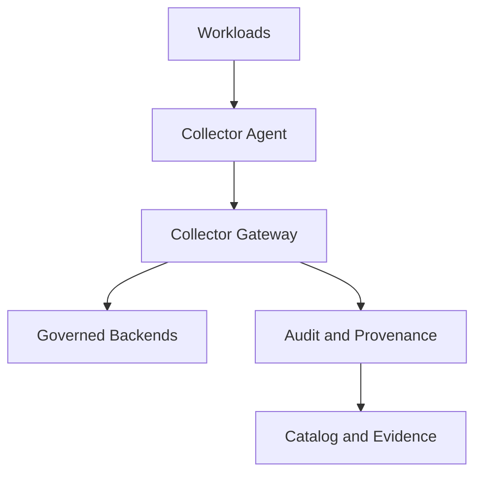

<!-- [KFM_META_BLOCK_V2]
doc_id: kfm://doc/3e8c9b61-6b25-4ef7-9b0f-0a5f8f8f5c2b
title: Observability Collectors
type: standard
version: v1
status: draft
owners: TODO(platform-observability)
created: 2026-02-23
updated: 2026-02-23
policy_label: restricted
related:
  - TODO(configs/observability/README.md)
  - TODO(docs/governance/observability.md)
tags: [kfm, observability, collectors, telemetry]
notes:
  - This README defines governance + contracts for telemetry collector configs (logs/metrics/traces).
  - Default-deny: do not introduce new sinks or widen data capture without a policy decision + review.
[/KFM_META_BLOCK_V2] -->

# Observability Collectors
**Purpose:** governed configuration for telemetry collectors (logs, metrics, traces) that enforce the *trust membrane* between workloads and observability backends.


> [!WARNING]
> **Do not commit secrets** (API keys, bearer tokens, client certs, DSNs) into this directory. Use your secret store / environment injection. Any PR that includes secrets must fail closed.

## Quick navigation
- [What this directory is](#what-this-directory-is)
- [Where it fits](#where-it-fits)
- [Directory contract](#directory-contract)
- [Collector inventory](#collector-inventory)
- [Configuration rules](#configuration-rules)
- [Validation and CI gates](#validation-and-ci-gates)
- [Change workflow](#change-workflow)
- [Security and data minimization](#security-and-data-minimization)
- [Troubleshooting](#troubleshooting)
- [Appendix](#appendix)

---

## What this directory is
This folder contains **collector configurations and related deployment glue** used to ingest, process, and export observability telemetry in a governed way.

Typical responsibilities of a collector tier:
- **Ingest:** receive telemetry from workloads/agents (push or scrape).
- **Normalize:** add consistent resource attributes (service, environment, build, region).
- **Minimize:** drop/obfuscate sensitive fields, apply sampling, enforce allowlists.
- **Route:** send to approved backends (metrics, logs, traces) through approved endpoints.
- **Prove:** record enough metadata to explain “what got captured, where it went, and why”.

> [!NOTE]
> This README intentionally avoids naming a specific collector product (e.g., OTel Collector, Fluent Bit, Vector, Prometheus) because the repo’s authoritative stack is not confirmed in the artifacts provided. Replace “collector” terms below with your concrete implementations.

---

## Where it fits
Path: `configs/observability/collectors/`

This directory is part of the governed chain:



Interpretation:
- Workloads emit telemetry.
- Agents/gateways apply rules from this directory.
- Only **approved** egress routes are permitted.
- Collector configs are treated as **governed artifacts** (auditable changes, small diffs, reversible).

---

## Directory contract

### Acceptable inputs
Files that **belong** here:
- Collector config files (e.g., YAML/TOML/JSON) for agents and gateways
- Deployment manifests/templates *only* for collectors (e.g., k8s snippets, systemd units), if your repo uses them
- Allowlist/denylist files for processors (regex lists, attribute allowlists)
- Documentation specific to collectors (runbooks, troubleshooting, decision logs)

### Exclusions
Files that **must not** be added here:
- Secrets (tokens, keys, private certs) or any credentials
- Large binary artifacts
- Application code unrelated to collector configuration
- One-off debug configs that widen capture scope without a documented policy decision
- Telemetry payload samples containing real identifiers/PII (use redacted synthetic examples)

---

## Directory layout

Because the current repo tree is not available in the prompt, treat the following as an **example layout** to align on structure. Update it to match reality.

```text
configs/observability/collectors/
  README.md
  _shared/                          # shared snippets/allowlists/processors (optional)
    processors/
    allowlists/
    denylists/
  <collector_id>/                   # one directory per collector "bundle"
    README.md                       # bundle-specific notes/runbook
    config.<ext>                    # primary collector config (yaml/toml/json)
    deploy/                         # deployment glue (optional)
      k8s/
      systemd/
    test/                           # validation fixtures (optional)
      golden/                       # expected outputs or config render outputs
```

### Naming conventions (proposed)
Use stable, grep-friendly IDs:

- `agent-<platform>-<scope>` (e.g., `agent-k8s-node`, `agent-linux-host`)
- `gateway-<env>-<region>` (e.g., `gateway-prod-us-central`, `gateway-dev-local`)
- `lab-<purpose>` for experiments that never ship to production

> [!TIP]
> If your org already has naming rules, replace the above. The important part is: **IDs must be stable** so dashboards/runbooks can reference them.

---

## Collector inventory

Maintain a lightweight “registry” table so reviewers can reason about blast radius.

| collector_id | role | runtime | inputs | outputs | owner | policy_label | last_reviewed |
|---|---|---|---|---|---|---|---|
| `TODO(agent-...)` | agent | TODO(k8s/host) | TODO(ports/protocols) | TODO(backends) | TODO(team) | restricted | TODO(YYYY-MM-DD) |
| `TODO(gateway-...)` | gateway | TODO | TODO | TODO | TODO | restricted | TODO |

Definition notes:
- **inputs**: what the collector accepts (protocols/ports/sources)
- **outputs**: allowed sinks (by name; do not embed credentials)
- **policy_label**: treat as restricted by default (telemetry can contain sensitive data)

---

## Configuration rules

### Hard rules
1. **Default-deny capture expansion**
   - Any change that expands telemetry scope (new log paths, new scrape targets, new spans, new exporters) must include:
     - rationale + risk
     - evidence of redaction/minimization
     - explicit reviewer sign-off (see checklist below)

2. **No secrets in repo**
   - Use env vars / secret mounts.
   - Reference secret keys by name only.

3. **Explicit egress allowlist**
   - Every output endpoint must be in an allowlist (DNS name + port + protocol).
   - “Send to the Internet” is not permitted without explicit governance approval.

4. **Version pinning**
   - If collector images/binaries are referenced anywhere in this folder, pin versions (no `latest`).

### Recommended rules
- Standardize resource attributes:
  - `service.name`, `service.version`, `deployment.environment`, `cloud.region`, `k8s.cluster.name` (or your equivalents)
- Normalize timestamps and trace IDs across formats (where supported)
- Apply data minimization early (before fan-out)

---

## Validation and CI gates

> [!NOTE]
> The exact CI tooling is **Unknown** from the provided context. The list below is a recommended baseline; wire it into your CI as appropriate.

### Required gates (minimum)
- [ ] **Config syntax check** (parser-level)
- [ ] **Schema/semantic validation** (collector-specific “dry-run” if available)
- [ ] **Secret scanning** (fail if any credential-like material appears)
- [ ] **Diff risk classification** (see [Change workflow](#change-workflow))

### Recommended gates (strongly suggested)
- [ ] **Golden tests** for rendered configs (if templating is used)
- [ ] **Smoketest** in ephemeral environment (collector starts + health endpoint OK)
- [ ] **Egress policy check**: only approved exporters/endpoints
- [ ] **PII guardrails check**: denylist rules present for logs/attributes

### Local validation (templates)
Use whichever commands match your collector stack. Replace these with your actual ones:

```bash
# Example patterns (replace with real commands/tools):
# - YAML linting
yamllint .

# - template rendering (if you use helm/kustomize/etc.)
# helm template ... > /tmp/rendered.yaml

# - collector dry-run (if supported)
# collector-binary --config ./<collector_id>/config.yaml --dry-run
```

---

## Change workflow

### When to open a PR
Any time you:
- add/edit/remove a collector config
- add a new exporter/sink
- change sampling, filtering, or redaction rules
- change scrape targets / log include paths

### PR checklist (required)
- [ ] **Intent stated**: what behavior changes?
- [ ] **Blast radius stated**: which services/environments are affected?
- [ ] **Policy impact assessed**: does capture/egress expand?
- [ ] **Rollback plan**: how to revert safely (one commit, one tag, etc.)
- [ ] **Validation evidence**: attach command outputs / CI links
- [ ] **Owner sign-off**: collector owner reviewed

### Risk classification (recommended)
| Change type | Example | Risk level | Requirements |
|---|---|---:|---|
| Strictly reducing capture | dropping fields, narrowing regex | Low | 1 reviewer |
| Neutral refactor | comments, reorder, rename without behavior change | Low | 1 reviewer + validation |
| Expanding capture | new scrape target, new log file glob | High | 2 reviewers + governance note |
| New egress/sink | new exporter endpoint | Critical | governance approval + security review |

---

## Security and data minimization

Telemetry often includes:
- user identifiers in logs
- request paths with IDs
- headers/cookies/tokens
- SQL queries or payload fragments

### Baseline mitigations (recommended)
- **Redaction:** remove or hash known sensitive keys/fields
- **Allowlisting:** only keep known-safe attributes (drop the rest)
- **Sampling:** reduce volume and risk for high-cardinality traces
- **Tenant boundaries:** ensure no cross-tenant routing without policy

> [!WARNING]
> If your telemetry includes data covered by regulatory regimes (PII/PHI/etc.), treat this directory as **restricted** and ensure the capture policy is documented and reviewed.

---

## Troubleshooting

### Common symptoms
- Collector crash-looping
- Backpressure / dropped telemetry
- Missing attributes (service/env/region)
- Export failures (auth, TLS, DNS)
- Cardinality explosions (metrics labels, log fields)

### Standard triage steps (generic)
1. Confirm the collector config currently deployed matches the repo version.
2. Check health endpoints / status pages for:
   - receiver errors
   - processor queue saturation
   - exporter retry/backoff
3. Inspect recent config diffs for:
   - new receivers
   - new routing rules
   - new processors that drop fields
4. Roll back to the last-known-good config if necessary.

---

## Appendix

### Minimal “collector bundle” README template
If you create `configs/observability/collectors/<collector_id>/README.md`, use:

- Purpose + scope
- Inputs and outputs
- Runtime (k8s daemonset, deployment, host service)
- How to validate locally
- How to roll back
- Known limitations

<details>
<summary>Example bundle README skeleton</summary>

```markdown
# <collector_id>

## Purpose
TODO

## Inputs
- TODO

## Outputs
- TODO

## Validation
- TODO

## Rollback
- TODO
```

</details>

---

## Unknowns to confirm
To convert this README from “template” to “confirmed”, validate:
- Which collector implementations are actually used in this repo (and their config formats).
- Where collector deployment manifests live (if not here).
- The repo’s CI gates and any existing policy docs for observability.
- Existing naming conventions and environment taxonomy.

Back to top: [Observability Collectors](#observability-collectors)
