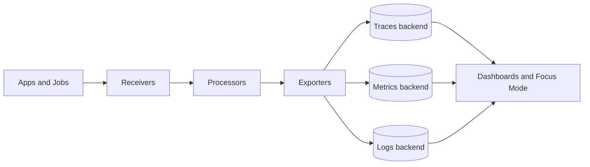
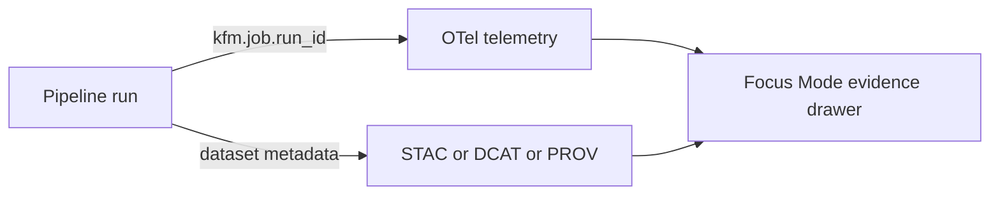

<!-- [KFM_META_BLOCK_V2]
doc_id: kfm://doc/3c6b1f2a-1a1b-49b9-9b3b-7a7f5f3c1d44
title: OpenTelemetry Collector (otel-collector) configs
type: standard
version: v1
status: draft
owners: Platform Observability (TBD)
created: 2026-02-23
updated: 2026-02-23
policy_label: restricted
related:
  - configs/observability/collectors/README.md
tags: [kfm, observability, opentelemetry, collector]
notes:
  - Do not commit secrets (endpoints, tokens, creds) into this directory.
  - This README is written to be correct even if the exact file layout changes; fill TODOs once repo files are confirmed.
[/KFM_META_BLOCK_V2] -->

# OpenTelemetry Collector (otel-collector)
Governed OpenTelemetry Collector configuration(s) for KFM: **ingest traces/metrics/logs**, apply **policy-aware processing**, and export to approved backends.


-blue)


> [!WARNING]
> Treat collector configs as **governed artifacts**: changes can alter what telemetry is collected, what is dropped/redacted, and where it is exported.

---

## Quick navigation
- [Purpose](#purpose)
- [Where this fits](#where-this-fits)
- [Directory contents](#directory-contents)
- [Collector dataflow](#collector-dataflow)
- [Quickstart](#quickstart)
- [KFM telemetry conventions](#kfm-telemetry-conventions)
- [Security and governance](#security-and-governance)
- [Troubleshooting](#troubleshooting)
- [Change checklist](#change-checklist)
- [References](#references)

---

## Purpose
This directory contains the configuration(s) for the **OpenTelemetry Collector** used by KFM components (services, jobs, pipelines) to send telemetry via OTLP and related protocols.

**Primary goals**
- Standardize collector behavior (pipelines, processors, exporters).
- Make telemetry **traceable to pipeline runs** and **linkable to catalogs** (STAC/DCAT/PROV).
- Enforce safety defaults: **no secrets in Git**, **controlled endpoints**, and **privacy-aware processing**.

---

## Where this fits
**Repo location:** `configs/observability/collectors/otel-collector/`

**Layering model alignment (trust membrane):**
- This directory is **configuration** (policy-bound interface input) for the observability layer.
- Apps/jobs should emit telemetry; they should **not** talk directly to observability backends if the architecture uses a collector boundary.

---

## Directory contents
> [!NOTE]
> The exact file list in this directory was **not confirmed** from the repo in this session. Keep this section updated as files evolve.

Expected patterns (choose one; don’t mix styles without a migration note):

```text
configs/observability/collectors/otel-collector/        # OpenTelemetry Collector config (ingest → process → export)
├─ README.md                                           # You are here: how this collector is used + validation workflow
│
├─ collector.yaml                                      # Primary collector config (recommended canonical name)
├─ collector.local.yaml                                # Optional: local/dev overrides (non-secret deltas)
├─ collector.prod.yaml                                 # Optional: prod overrides (strict posture; audited changes)
│
├─ exporters/                                          # Optional: split exporter blocks (one file per provider/target)
├─ processors/                                         # Optional: split processor blocks (batching, redaction, transforms)
├─ receivers/                                          # Optional: split receiver blocks (otlp, prometheus, filelog, etc.)
│
└─ env.example                                         # Optional: documented env vars (NO secrets; keys + descriptions)
```

**Acceptable inputs**
- YAML config files for `otelcol` / `otelcol-contrib`.
- Non-secret example env files (e.g., `.example`).
- Lightweight run scripts **that do not embed secrets**.

**Exclusions**
- ❌ API keys, tokens, passwords, client secrets.
- ❌ Private endpoint URLs if they reveal internal network topology (prefer placeholders + secret manager).
- ❌ “One-off” debugging configs that loosen policy (put in a separate `debug/` folder with clear warnings, or keep out of repo).

---

## Collector dataflow

### Standard pipeline model
The Collector routes telemetry through **pipelines**:
**receivers → processors → exporters** (per signal: traces/metrics/logs).



### KFM traceability linkage
KFM expects pipeline runs to be linkable across telemetry and catalogs.



---

## Quickstart

### 1) Validate configs (required gate)
Use the Collector’s built-in validation before deploying or merging changes:

```bash
# Example (adjust path):
otelcol validate --config=collector.yaml
```

> [!TIP]
> Make validation a CI-required check for every PR touching `configs/observability/**`.

### 2) Inspect what a distribution supports
Different distributions include different components. List available components:

```bash
otelcol components
```

### 3) Run locally with Docker (example)
Pick **core** or **contrib** images depending on component needs.

```bash
# Contrib image (broad component coverage):
docker run --rm \
  -p 127.0.0.1:4317:4317 \
  -p 127.0.0.1:4318:4318 \
  -v "$PWD/collector.yaml:/etc/otelcol/config.yaml:ro" \
  otel/opentelemetry-collector-contrib:latest \
  --config=/etc/otelcol/config.yaml
```

> [!WARNING]
> Bind management/debug endpoints (health, zPages, pprof) to localhost by default unless explicitly required and protected.

### 4) Send test telemetry (optional)
If you use `telemetrygen` for testing, run it against OTLP endpoints (example only):

```bash
# Example usage; see OpenTelemetry "Quick start" for full walkthrough
telemetrygen traces --otlp-insecure --traces 3
```

---

## Configuration conventions

### Baseline structure
Collector configs are typically organized as:

- `receivers`
- `processors`
- `exporters`
- `connectors` (optional)
- `extensions` (optional)
- `service` (enables pipelines + extensions)

> [!NOTE]
> Configuring a component does **not** enable it. It must be referenced under `service.pipelines` (or `service.extensions`).

### Environment variables and composition
Prefer env var expansion for non-secret toggles and **secret injection for credentials**.

Common patterns:
- `${env:VAR}` and defaults: `${env:VAR:-default}`
- Multiple config sources:
  - `--config=file:...`
  - `--config=env:...`
  - `--config=https://...` (use carefully)
- Small overrides: `--set key=value`

---

## KFM telemetry conventions

### Canonical run identifiers and labels
To make every run traceable across metrics/traces and catalogs, KFM uses canonical keys.

| Semantic meaning | OTel attribute | Prom label | Notes |
|---|---|---|---|
| Run ID | `kfm.job.run_id` | `job_run_id` | UUID/ULID |
| Commit | `kfm.git.commit_sha` | `commit_sha` | 7–40 hex |
| Status | `kfm.job.status` | `status` | scheduled\|running\|succeeded\|failed\|canceled |
| Started | `kfm.job.started_at` | `started_at` | RFC3339 + (also emit unix seconds) |
| Ended | `kfm.job.ended_at` | `ended_at` | RFC3339 + (also emit unix seconds) |
| Dataset | `kfm.dataset.id` | `dataset_id` | STAC/DCAT id |
| Pipeline | `kfm.pipeline.name` | `pipeline` | stable slug |
| Environment | `kfm.env` | `env` | dev\|staging\|prod |

**Collector implementation guidance (recommended)**
- Ensure these attributes exist as **resource attributes** (preferred) or span/log attributes, consistently.
- For metrics backends, ensure label names match and relabeling rules preserve them.
- Emit timestamps twice:
  - RFC3339 strings for traces/catalog metadata
  - Unix seconds for Prometheus math

### Catalog linkage (recommended)
- Write `run_id`, `commit_sha`, `status`, and times into STAC Item properties (example keys: `kfm:run_id`, etc.).
- In PROV JSON-LD, model the run as `prov:Activity` and attach time bounds + agents.
- Use `dataset_id` as a join key between telemetry dashboards and catalog pages in Focus Mode.

---

## Security and governance

### Default-deny posture
- **No secrets in Git.** Use env vars, secret stores, or workload identity.
- Limit network exposure:
  - Prefer `127.0.0.1` / `localhost` for dev
  - Explicitly bind interfaces in prod
- Use TLS where available; avoid `insecure: true` except in isolated local/dev.

> [!WARNING]
> OpenTelemetry docs note the collector historically defaulted to binding `0.0.0.0`, but that default is expected to change toward `localhost`. Always set endpoints explicitly in production configs.

### Proposed promotion gates (adapt to your CI)
- [ ] `otelcol validate` passes for every config artifact
- [ ] YAML formatting/lint passes
- [ ] Secret scanning passes (repo-standard tool)
- [ ] Config changes are reviewed by Observability owners
- [ ] Export destinations are approved for the target environment
- [ ] (Optional) Configs are canonicalized and hashed for reproducibility
- [ ] (Optional) Container images pinned by digest where reproducibility matters

---

## Troubleshooting

### Safe debugging tools
- **Health check extension**: expose a simple status endpoint.
- **zPages**: inspect live receiver/exporter data paths (keep local unless protected).
- **pprof**: runtime profiling (advanced, keep local unless protected).

### Minimal debug pipeline
To verify ingestion quickly, add a **debug exporter** (use temporarily; do not ship to prod unless explicitly approved):

```yaml
exporters:
  debug:
    verbosity: detailed

service:
  pipelines:
    traces:
      receivers: [otlp]
      processors: []
      exporters: [debug]
```

### Checklist for complex pipelines
- Are there errors in collector logs?
- Is telemetry arriving at the receiver endpoint?
- Are processors modifying/dropping data as intended (sampling, redaction)?
- Is the exporter destination reachable and accepting data?
- Are there network policies blocking traffic?

---

## Change checklist
Use this when editing collector configs.

**Before PR**
- [ ] Run: `otelcol validate --config=<your-config>`
- [ ] Confirm endpoint bindings (no accidental `0.0.0.0` exposure)
- [ ] Confirm no secrets added
- [ ] Confirm KFM canonical attributes are preserved end-to-end
- [ ] Confirm exporters match environment policy (dev/staging/prod)

**Before deploy**
- [ ] Confirm collector distribution supports required components (`otelcol components`)
- [ ] Confirm resources allocated appropriately (avoid drops/backpressure)
- [ ] Confirm dashboards/alerts updated if labels/attributes changed

---

## References
- OpenTelemetry Collector docs (configuration, architecture, troubleshooting).
- KFM Integration patterns (telemetry-to-catalog linkage and canonical keys).

---

<p align="right"><a href="#opentelemetry-collector-otel-collector">Back to top ↑</a></p>
