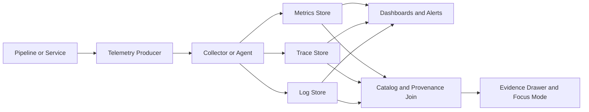

<!-- [KFM_META_BLOCK_V2]
doc_id: kfm://doc/0b2b7f40-42b1-4f5e-9b40-9078757f0f0d
title: Observability Contracts
type: standard
version: v1
status: draft
owners: TODO: <team-or-names>
created: 2026-02-23
updated: 2026-02-23
policy_label: public
related:
  - ../README.md
  - ../../README.md
tags: [kfm, observability, contracts]
notes:
  - Canonical naming + schema contracts for telemetry (logs/metrics/traces) and run-to-catalog linkage.
[/KFM_META_BLOCK_V2] -->

# Observability Contracts
**One-line purpose:** Canonical contracts (schemas + naming rules) that make KFM telemetry traceable, governable, and joinable to evidence & catalogs.

[](#)
[](#)
[](#)
[](#)

> **TODO (repo-specific):** Replace the CI badge with your real workflow badge URL once the validation job exists.

---

## Navigation
- [Why this folder exists](#why-this-folder-exists)
- [Where it fits in KFM](#where-it-fits-in-kfm)
- [Directory layout](#directory-layout)
- [Contract categories](#contract-categories)
- [Canonical KFM telemetry keys](#canonical-kfm-telemetry-keys)
- [Log event envelope contract](#log-event-envelope-contract)
- [Metric naming and label contract](#metric-naming-and-label-contract)
- [Trace and span contract](#trace-and-span-contract)
- [Security, privacy, and sensitive data](#security-privacy-and-sensitive-data)
- [CI gates](#ci-gates)
- [How to add or change a contract](#how-to-add-or-change-a-contract)
- [FAQ](#faq)

---

## Why this folder exists
KFM is evidence-led. Telemetry is not “just ops”—it’s part of the trust membrane.

This folder is the **single source of truth** for:
- **What telemetry must look like** (field names, required attributes, allowed values).
- **How telemetry joins to governed artifacts** (run receipts, catalogs, evidence bundles).
- **What must never appear in telemetry** (PII, restricted coordinates, secrets).

If producers and consumers don’t share these contracts, you get:
- broken dashboards (rename drift),
- untraceable pipeline runs (“which dataset version produced this alert?”),
- governance bypass (sensitive content leaking into logs).

[Back to top](#observability-contracts)

---

## Where it fits in KFM
These contracts sit in the **Interfaces/Contracts** layer and are intended to be enforced by:
- instrumentation libraries (producer-side),
- collectors/exporters (transport),
- validators and CI gates (merge-time),
- storage/indexing policies (retention and access controls).



[Back to top](#observability-contracts)

---

## Directory layout
> **NOTE:** This is a *recommended* layout. If the repo already uses different names, align this README to the existing structure (don’t fork conventions).

```
configs/observability/contracts/
  README.md                       # You are here (normative spec + how-to)
  otel/                           # OpenTelemetry-facing contracts (attributes, resources)
    kfm_attributes.v1.yaml         # Canonical attribute keys + allowed values
    kfm_resource.v1.yaml           # Required resource attributes for all signals
  prometheus/                     # Prometheus/Mimir-facing contracts (labels, metric registry)
    labels.v1.yaml                 # Canonical label mapping (OTel -> Prom)
    metrics.v1.yaml                # Metric registry (names, type, unit, labels)
    alerts.v1.yaml                 # Alert label/annotation contract (optional)
  schemas/                        # Machine-validated schemas (JSON Schema recommended)
    log_event.v1.schema.json       # Log envelope schema (JSON logs)
    focus_trace_link.v1.schema.json# Optional: schema for run->evidence linkage events
  fixtures/                       # Golden examples used by CI contract tests
    good/                          # Must validate
    bad/                           # Must fail (negative tests)
  tools/                          # Contract tooling (lint, validate, compat checks)
    README.md                      # How to run locally
```

### Acceptable inputs
- YAML contracts: `.yml` / `.yaml`
- JSON schemas: `.schema.json`
- JSON fixtures: `.json` / `.jsonl`
- Minimal docs: `.md` (only to explain contract intent; schemas remain the source of truth)

### Exclusions
Do **not** put these here:
- collector deployment manifests (belongs in `configs/observability/...`)
- dashboards (Grafana JSON) and panel definitions
- runtime secrets, tokens, or credentials
- environment-specific alert routing (belongs in environment overlays)

[Back to top](#observability-contracts)

---

## Contract categories
This directory is expected to cover (at minimum):

1. **Run identity and join keys**
   - IDs that connect telemetry ↔ run receipts ↔ catalogs ↔ evidence bundles.

2. **Logs**
   - A stable JSON envelope that can be validated and indexed.

3. **Metrics**
   - Metric naming, units, types, and label sets that stay stable over time.

4. **Traces**
   - Span naming + required attributes for correlation and RCA.

5. **Governance hooks**
   - Redaction obligations, privacy levels, policy labels (as allowed).

---

## Canonical KFM telemetry keys
These are the **minimum join keys** that must exist in at least one of:
- OTel resource attributes
- span attributes
- log attributes
- metric labels

### Required keys (baseline)
| Concept | Canonical key | Signal(s) | Notes |
|---|---|---:|---|
| Run ID | `kfm.job.run_id` | logs/metrics/traces | UUID/ULID preferred |
| Commit SHA | `kfm.git.commit_sha` | logs/metrics/traces | 7–40 hex |
| Run status | `kfm.job.status` | logs/metrics/traces | `scheduled` \| `running` \| `succeeded` \| `failed` \| `canceled` |
| Started at | `kfm.job.started_at` | logs/traces | RFC3339 timestamp |
| Ended at | `kfm.job.ended_at` | logs/traces | RFC3339 timestamp |
| Dataset ID | `kfm.dataset.id` | logs/metrics/traces | Must match catalog ID (STAC/DCAT) |
| Pipeline name | `kfm.pipeline.name` | logs/metrics/traces | Stable slug |
| Environment | `kfm.env` | logs/metrics/traces | `dev` \| `staging` \| `prod` |

### Prometheus/Mimir label mapping
Prometheus labels should use snake_case versions of the keys:
- `kfm.job.run_id` → `job_run_id`
- `kfm.git.commit_sha` → `commit_sha`
- `kfm.job.status` → `status`
- `kfm.job.started_at` → `started_at` *(also emit unix seconds when you need Prom math)*
- `kfm.job.ended_at` → `ended_at` *(also emit unix seconds when you need Prom math)*
- `kfm.dataset.id` → `dataset_id`
- `kfm.pipeline.name` → `pipeline`
- `kfm.env` → `env`

> **Rule:** emit timestamps *twice* when necessary:
> - RFC3339 strings for traces and catalog metadata
> - unix seconds for metric math and alerting

### Catalog linkage expectations
When a telemetry event corresponds to a dataset/pipeline run:
- write `kfm.job.run_id`, `kfm.git.commit_sha`, `kfm.job.status` into catalog-friendly metadata (e.g., STAC Item properties),
- model the run as an activity in provenance artifacts,
- use `kfm.dataset.id` to join dashboards to dataset pages (Map/Story/Focus).

[Back to top](#observability-contracts)

---

## Log event envelope contract
### Goals
- Logs must be **machine-validated**.
- Logs must support **correlation** (trace/span/run IDs).
- Logs must be **safe by default** (no secrets, no PII, no restricted coordinates).

### Required fields (minimum)
| Field | Type | Required | Notes |
|---|---|---:|---|
| `timestamp` | RFC3339 string | ✅ | Example: `2026-02-23T18:15:23.123Z` |
| `severity` | string | ✅ | `DEBUG` \| `INFO` \| `WARN` \| `ERROR` |
| `message` | string | ✅ | Human-readable |
| `service.name` | string | ✅ | Service identifier |
| `kfm.job.run_id` | string | ✅ (when run-scoped) | UUID/ULID |
| `attributes` | object | ✅ | Event-specific k/v |
| `trace_id` | string | ⛔/✅ | Required when trace is available |
| `span_id` | string | ⛔/✅ | Required when trace is available |

### Example (valid)
```json
{
  "timestamp": "2026-02-23T18:15:23.123Z",
  "severity": "INFO",
  "message": "Promotion gate passed",
  "service": { "name": "kfm-pipeline-runner", "version": "1.13.0" },
  "kfm": {
    "job": {
      "run_id": "01J0Z3B7P8E4K1Y7Q0W3Z8P1X2",
      "status": "succeeded",
      "started_at": "2026-02-23T18:02:11Z",
      "ended_at": "2026-02-23T18:15:21Z"
    },
    "git": { "commit_sha": "a1b2c3d4e5f6" },
    "dataset": { "id": "kfm://dataset/soil/ks/2026-02" },
    "pipeline": { "name": "soil-artifacts" },
    "env": "prod"
  },
  "trace_id": "4bf92f3577b34da6a3ce929d0e0e4736",
  "span_id": "00f067aa0ba902b7",
  "attributes": {
    "gate": "catalog-links-ok",
    "policy_label": "public",
    "artifact_digest": "sha256:2222..."
  }
}
```

### Logging “do not”
- Do not log secrets (tokens, passwords, private keys).
- Do not log raw personal identifiers (names, emails, phone numbers).
- Do not log precise restricted locations (use generalized geography if needed).
- Do not log entire documents/blobs; log digests + resolvable references instead.

[Back to top](#observability-contracts)

---

## Metric naming and label contract
### Metric naming rules
- Prefer: `<domain>_<thing>_<unit>` or `<domain>_<operation>_<result>`
- Use `_total` suffix for counters.
- Always document unit and type in the metric registry.

Examples:
- `kfm_pipeline_runs_total`
- `kfm_pipeline_run_duration_seconds`
- `kfm_catalog_validation_failures_total`

### Label rules
- Labels must be **low cardinality** (bounded sets).
- Required labels for run-scoped metrics:
  - `job_run_id`
  - `pipeline`
  - `dataset_id` *(only if bounded; otherwise emit on logs/traces only)*
  - `env`
  - `status` *(when representing outcomes)*

> **WARNING:** `job_run_id` can be high-cardinality. Use it only on:
> - short-lived debug metrics, or
> - exemplars, or
> - metrics stored in a backend that tolerates it.
>
> If your metrics backend cannot tolerate this, move `job_run_id` to logs/traces and keep metrics aggregated by `(pipeline, dataset_id, env, status)`.

[Back to top](#observability-contracts)

---

## Trace and span contract
### Span naming
Use stable operation names. Prefer:
- `pipeline.stage/<stage_name>`
- `api/<route>`
- `db/<operation>`

### Required span attributes (when applicable)
- `kfm.job.run_id`
- `kfm.pipeline.name`
- `kfm.dataset.id`
- `kfm.git.commit_sha`
- `kfm.env`

### Error signaling
- Set span status to error for failed gates or failed runs.
- Emit a structured event on the span for each gate decision (recommended):
  - event name: `kfm.gate.decision`
  - attributes: `{ gate_id, decision, policy_label, reason_code }`

[Back to top](#observability-contracts)

---

## Security, privacy, and sensitive data
Observability is governed data.

### Default posture
- Logs/traces are **restricted by default** unless explicitly classified otherwise.
- Sensitive location details must be generalized (e.g., county-level, bbox-level) when policy requires.
- If a field may refer to a living person, prefer:
  - generalized values, or
  - hashed/pseudonymous identifiers, or
  - deny-by-default logging (drop field).

### Redaction requirements
If a producer emits fields that are governed:
- the collector/processor must be able to redact or transform them,
- the resulting output must preserve traceability via digests + IDs (not raw content).

[Back to top](#observability-contracts)

---

## CI gates
A change to any contract should be treated like an API change.

### Required gates (Definition of Done)
- [ ] **Schema validation:** YAML/JSON Schema parses and validates.
- [ ] **Fixture tests:** all `fixtures/good/**` pass; all `fixtures/bad/**` fail.
- [ ] **Compatibility check:** breaking changes require a version bump and a migration note.
- [ ] **Docs sync:** README updated when contract meaning changes.

### Suggested local commands (TODO: wire these to real scripts)
```bash
# Validate schemas and contracts
make observability-contracts-validate

# Run contract tests (fixtures)
make observability-contracts-test

# Check compatibility (e.g., detect removed required fields)
make observability-contracts-compat
```

> **TODO (repo-specific):** Replace `make ...` targets with the actual task runner used in this repo (Makefile, npm scripts, just, etc.).

[Back to top](#observability-contracts)

---

## How to add or change a contract
1. **Create or edit** the contract file under the appropriate subfolder (`otel/`, `prometheus/`, `schemas/`).
2. **Bump version** when required:
   - patch: clarifications, new optional fields
   - minor: additive fields that don’t break consumers
   - major: removal/rename of required fields, meaning changes, breaking enum changes
3. **Add fixtures**
   - at least one valid example
   - at least one invalid example targeting the new rule
4. **Update this README**
   - document the new keys/rules
   - add migration notes if breaking
5. **Run gates locally** and ensure CI passes.

### Minimal contract header (recommended)
For YAML contracts, include a small metadata header:
```yaml
contract_id: kfm.observability.otel.attributes
version: 1.0.0
status: draft
owners:
  - TODO: team
updated: 2026-02-23
```

---

## FAQ
### Why contracts for observability?
Because telemetry is only useful if it’s consistent, searchable, and joinable to governed evidence. Contracts prevent silent drift.

### Can we add service-specific attributes?
Yes—under `attributes.*` namespaces. But do not invent new keys in the global join-key set without updating the contract and validators.

### What if a system can’t emit traces?
Emit logs + metrics with the canonical join keys and ensure the run receipt links exist. Traces improve RCA but aren’t the only evidence.

[Back to top](#observability-contracts)
