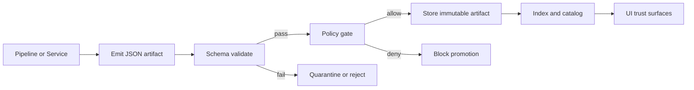

<!-- [KFM_META_BLOCK_V2]
doc_id: kfm://doc/e3a9a6f6-2c8f-4d1b-9e6a-2b6d0d6110d4
title: Observability Contract Schemas
type: standard
version: v1
status: draft
owners: kfm-observability (TODO: set real owner team)
created: 2026-02-23
updated: 2026-02-23
policy_label: restricted
related: []
tags: [kfm, observability, contracts, schemas]
notes:
  - Canonical home for machine-validated schema contracts used by observability + provenance workflows.
  - Default-deny: if unsure about sensitivity, mark restricted and route to governance review.
[/KFM_META_BLOCK_V2] -->

<a id="top"></a>

# Observability Contract Schemas
Machine-validated schemas for KFM observability contracts (receipts, manifests, watcher registry). These schemas are the **fail-closed** foundation for policy gates, promotion lanes, and UI trust affordances.


> **NOTE**
> This directory is “real” only when schema validation is automated (CI/local) and merges/promotion can be blocked on failure.

## Quick navigation
- [Purpose](#purpose)
- [Where this fits](#where-this-fits)
- [Directory contract](#directory-contract)
- [Directory layout](#directory-layout)
- [Schema registry](#schema-registry)
- [Versioning rules](#versioning-rules)
- [Validation and gates](#validation-and-gates)
- [How to add or change a schema](#how-to-add-or-change-a-schema)
- [Security and data minimization](#security-and-data-minimization)
- [Appendix](#appendix)

---

## Purpose
This folder contains the **canonical schema contracts** that define “what valid looks like” for observability artifacts.

**Fail-closed principle**
- If an artifact **does not validate**, it must be treated as **untrusted**:
  - it cannot be signed/attested,
  - it cannot be promoted/published,
  - and it should not be rendered with “green” trust affordances in UI.

**Thin-slice delivery**
- Adopt changes in small PR-sized increments:
  1) add/update schemas (contracts),
  2) enforce them (policy gates),
  3) surface them (UI evidence + trust badges).

[Back to top](#top)

---

## Where this fits


[Back to top](#top)

---

## Directory contract

### Acceptable inputs
This directory should contain:
- **Schema files** for observability contracts (typically JSON Schema).
- **Fixture examples**:
  - at least one **valid** example per schema,
  - and at least one **invalid** example per schema (to prove the gate fails closed).
- Optional: lightweight **docs** per contract:
  - field notes, invariants, compatibility notes,
  - migration notes when versions advance.

### Exclusions
Do **not** put these here:
- Real logs/receipts with production identifiers, secrets, tokens, or PII.
- Non-canonical duplicates of schemas (one source of truth).
- Ad-hoc “example shapes” that diverge from the schema.
- Tool-specific build artifacts (compiled bundles, node_modules, etc.).

[Back to top](#top)

---

## Directory layout

> **TIP**
> Keep filenames and versions boring and predictable. If a consumer can’t guess the schema filename, it’s too clever.

**Expected layout (adjust to match the repo’s actual files):**
```text
configs/observability/contracts/schemas/
├─ README.md
├─ run_receipt.v1.schema.json          # contract: per-run receipt
├─ run_manifest.v1.schema.json         # contract: promotion-oriented rollup
├─ watcher.v1.schema.json              # contract: signed allow-list for automation
└─ examples/
   ├─ run_receipt.v1.valid.json
   ├─ run_receipt.v1.invalid.json
   ├─ run_manifest.v1.valid.json
   ├─ run_manifest.v1.invalid.json
   ├─ watcher.v1.valid.json
   └─ watcher.v1.invalid.json
```

[Back to top](#top)

---

## Schema registry

| Contract | Canonical filename | Purpose | Primary consumers | Sensitivity |
|---|---|---|---|---|
| Run receipt | `run_receipt.v1.schema.json` | Per-run receipt: inputs/outputs/checks/timestamps | Pipelines, CI gates, evidence resolver, UI receipt viewer | Usually **restricted** |
| Run manifest | `run_manifest.v1.schema.json` | Promotion rollup: digests, rights, attest refs | Promotion lane, release tooling, auditing | Usually **restricted** |
| Watcher registry | `watcher.v1.schema.json` | Signed allow-list for automation | Watchers, CI automation, governance | **restricted** |

> **TODO**
> Confirm: schema format/draft (from `$schema`), and the exact consumers/paths in this repo.

[Back to top](#top)

---

## Versioning rules

### Filename convention
Use: `<contract>.v<MAJOR>.schema.json`

Examples:
- `run_receipt.v1.schema.json`
- `watcher.v2.schema.json`

### Compatibility policy
- **Minor additive changes** (non-breaking):
  - add optional fields,
  - widen enums safely (only if consumers tolerate new values),
  - add new definitions without changing existing semantics.
- **Breaking changes** require a **new MAJOR**:
  - remove/rename fields,
  - tighten types/constraints such that previously valid payloads fail,
  - change semantics (even if the shape is similar).

### Deprecation
When publishing `v2`, keep `v1` readable/validatable long enough for:
- dual-read support,
- migration scripts,
- and rollback windows.

[Back to top](#top)

---

## Validation and gates

### Required checks (Definition of Done for schema work)
When you change or add a schema, the PR must include:

- [ ] Schema compiles (no syntax/refs errors)
- [ ] `examples/*.valid.json` validate **PASS**
- [ ] `examples/*.invalid.json` validate **FAIL**
- [ ] Backwards-compatibility statement:
  - [ ] “Non-breaking” OR “Breaking; new MAJOR”
- [ ] Migration note if breaking
- [ ] CI is wired so invalid fixtures **block** merge/promotion (required status check)

### Local validation (recommended patterns)
Pick one toolchain and make it consistent (repo standard wins).

**Option A: Node (Ajv)**
```bash
# TODO: replace with repo-standard script / package.json target
npx ajv compile -s configs/observability/contracts/schemas/run_receipt.v1.schema.json
npx ajv validate -s configs/observability/contracts/schemas/run_receipt.v1.schema.json \
  -d configs/observability/contracts/schemas/examples/run_receipt.v1.valid.json
```

**Option B: Python (jsonschema)**
```bash
# TODO: pin exact dependencies/version and draft support
python -m jsonschema \
  --instance configs/observability/contracts/schemas/examples/run_receipt.v1.valid.json \
  --schema   configs/observability/contracts/schemas/run_receipt.v1.schema.json
```

> **WARNING**
> Whatever toolchain you use, lock versions in CI. Schema validation must be deterministic.

[Back to top](#top)

---

## How to add or change a schema

1. **Decide the contract boundary**
   - What is the smallest artifact you can validate that still prevents downstream ambiguity?

2. **Create or update the schema**
   - Use clear, stable field names.
   - Prefer explicit types and required fields for invariants.
   - Document any “must” rules in schema constraints when possible.

3. **Add fixtures**
   - `*.valid.json`: minimal but complete.
   - `*.invalid.json`: proves the gate fails closed (one invalid reason per file).

4. **Update the registry table**
   - Add the contract entry (or update version).

5. **Wire enforcement**
   - Ensure CI validates schemas + fixtures.
   - Ensure policy gates and promotion lanes deny on failure.

6. **Record compatibility intent**
   - If breaking: bump MAJOR and add migration notes.

[Back to top](#top)

---

## Security and data minimization

- Treat observability artifacts (especially audit logs / receipts) as **sensitive by default**.
- Do not encode secrets, tokens, PII, or sensitive location precision in examples.
- Prefer **structural telemetry** over content telemetry:
  - schema version, artifact digests, run IDs, policy decision codes,
  - not raw payloads.

> **NOTE**
> If consumers need additional fields, add them carefully and keep them policy-safe. If unsure, route through governance review.

[Back to top](#top)

---

## Appendix

<details>
<summary><strong>Template: New contract checklist</strong></summary>

- [ ] Contract name and purpose are clear
- [ ] Canonical filename follows `<contract>.v<MAJOR>.schema.json`
- [ ] Required/optional fields chosen intentionally
- [ ] Valid + invalid fixtures included
- [ ] CI validation job updated (or confirmed)
- [ ] Downstream consumer impact assessed (API/UI/pipelines)
- [ ] Compatibility statement written
- [ ] If breaking: migration notes + sunset plan

</details>

<details>
<summary><strong>Template: Minimal README snippet for a specific schema</strong></summary>

> Add a short `README` *near* the schema only if the invariants are not self-evident from constraints.

- **Contract:** `run_receipt` (v1)
- **Purpose:** per-run receipt for pipelines
- **Invariants:**
  - required fields: ...
  - digest rules: ...
  - timestamps: ...
- **Compatibility:**
  - v1 is frozen for semantics; additive only
- **Examples:**
  - valid: `examples/run_receipt.v1.valid.json`
  - invalid: `examples/run_receipt.v1.invalid.json`

</details>

[Back to top](#top)
