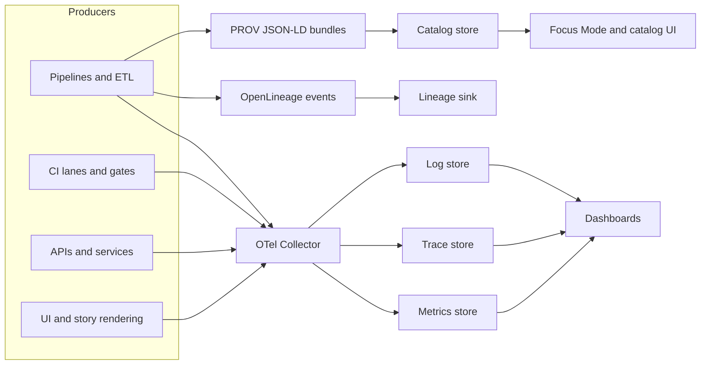

<!-- [KFM_META_BLOCK_V2]
doc_id: kfm://doc/137f3830-5d07-48c0-a846-78139df1c6b9
title: Telemetry Contract
type: standard
version: v1
status: draft
owners: TBD
created: 2026-02-23
updated: 2026-02-23
policy_label: restricted
related:
  - configs/observability/
  - catalogs/stac/
  - catalogs/dcat/
  - prov/
tags: [kfm, observability, telemetry, otel, contract]
notes:
  - Draft contract. Canonical keys align with the OBSERVABILITY-OTEL-MAPPINGS pattern in the KFM integration snapshots.
  - Keep changes additive when possible; breaking key renames require a major version bump.
[/KFM_META_BLOCK_V2] -->

# Telemetry Contract
**Purpose:** Make every KFM job/run traceable across **metrics**, **traces**, **logs**, and **catalog/provenance artifacts** (STAC/DCAT/PROV) using a small set of canonical identifiers.


<!-- TODO: replace generic badges with repo/CI badges once paths are finalized -->

[Overview](#overview) •
[Canonical keys](#canonical-keys) •
[Signal requirements](#signal-requirements) •
[Catalog and provenance linkage](#catalog-and-provenance-linkage) •
[Idempotency](#idempotency-and-retries) •
[Validation gates](#validation-gates) •
[Privacy and safety](#privacy-and-safety) •
[Change management](#change-management) •
[Appendix: examples](#appendix-a-examples)

---

## Overview

This document is a **contract** between:
- **Telemetry producers** (pipelines, CI jobs, APIs, UI, Focus Mode services)
- **Telemetry transport/collection** (OpenTelemetry SDKs + Collectors)
- **Telemetry stores** (metrics, traces, logs)
- **Governance artifacts** (STAC/DCAT/PROV bundles, build attestations)

The goal is that any user-visible claim or artifact can be traced to:
1) **the pipeline run that produced it**, and  
2) **the evidence emitted during that run** (telemetry + provenance).

> **Normative language**
> - **MUST / MUST NOT / SHOULD / MAY** are used as defined by RFC 2119.

### Architecture sketch



> **NOTE**
> This contract is vendor-neutral. Backends (e.g., Prometheus-compatible metrics or Tempo-compatible traces) are deployment choices, but **the key names and semantics here are stable**.

---

## Canonical keys

Canonical keys provide a minimal “join spine” across:
- metric labels
- trace/span attributes
- structured logs
- STAC/DCAT metadata
- PROV bundles

### Required keyset for any *job/run* telemetry

| Semantic field | OTel attribute key | Prom label | Type | Required | Constraints / examples |
|---|---|---|---|---:|---|
| Run ID | `kfm.job.run_id` | `job_run_id` | string | ✅ | UUID or ULID |
| Commit SHA | `kfm.git.commit_sha` | `commit_sha` | string | ✅ | 7–40 hex |
| Run status | `kfm.job.status` | `status` | string | ✅ | `scheduled` &#124; `running` &#124; `succeeded` &#124; `failed` &#124; `canceled` |
| Started time | `kfm.job.started_at` | `started_at` | string | ✅ | RFC3339 timestamp (also emit unix seconds for metrics math) |
| Ended time | `kfm.job.ended_at` | `ended_at` | string | ✅* | RFC3339 timestamp (also emit unix seconds for metrics math). Required once terminal. |
| Dataset ID | `kfm.dataset.id` | `dataset_id` | string | ⚠️ | Required when a run reads/writes a dataset artifact (STAC/DCAT id) |
| Pipeline name | `kfm.pipeline.name` | `pipeline` | string | ✅ | Stable slug |
| Environment | `kfm.env` | `env` | string | ✅ | `dev` &#124; `staging` &#124; `prod` |

> **WARNING: High-cardinality labels**
> `job_run_id` and `dataset_id` can be high-cardinality in Prometheus-style metrics.
> - You **MUST** avoid attaching these labels to “always-on” high-frequency series (e.g., per-request HTTP metrics) unless the backend is explicitly sized for it.
> - Prefer **traces/logs** (and catalog linkage) for per-run drill-down, and keep metrics aggregated whenever possible.

### Standard resource attributes

Producers **SHOULD** also emit standard OpenTelemetry resource attributes to support cross-service correlation:
- `service.name` (e.g., `kfm-pipeline-runner`, `kfm-api`, `kfm-ui`)
- `service.version` (release/tag)
- `deployment.environment` (mirror of `kfm.env`)

> **NOTE**
> The canonical KFM keys above are **in addition to** standard OTel semantic conventions.

[Back to top](#telemetry-contract)

---

## Signal requirements

### Traces

**Traces MUST:**
1) Include the canonical keys as span attributes on the **root span** for a run.
2) Propagate context to child spans and downstream services where possible.
3) Keep timestamps in RFC3339 when also written into catalog/provenance artifacts.

**Recommended span naming (Proposed):**
- `kfm.pipeline.run` (root span for a pipeline/job run)
- `kfm.stage.extract`
- `kfm.stage.transform`
- `kfm.stage.validate`
- `kfm.stage.publish`

**Span attribute rules:**
- Canonical keys MUST be present on root span.
- Child spans SHOULD inherit `kfm.job.run_id`, `kfm.pipeline.name`, and `kfm.env`.

### Metrics

**Metrics MUST:**
1) Use the Prom label names from the canonical mapping table when those identifiers are attached.
2) Emit timestamps *twice*:
   - RFC3339 strings for traces/catalog metadata
   - Unix seconds (numeric) where you need Prometheus math (durations, ranges)

**Metrics SHOULD:**
- Be designed around **low cardinality**, using canonical labels only where needed to join to traces/catalogs.

**Recommended metric families (Proposed, vendor-neutral):**
- `kfm_job_duration_seconds` (histogram)
- `kfm_job_status_total` (counter, labeled by `status`)
- `kfm_stage_duration_seconds` (histogram, labeled by `stage`)
- `kfm_artifacts_written_total` (counter, labeled by `artifact_type`)

### Logs

**Logs MUST:**
1) Be structured (JSON strongly recommended).
2) Carry enough context to join back to traces:
   - `trace_id` and `span_id` (when available)
3) Include canonical keys:
   - Always include `kfm.job.run_id`, `kfm.pipeline.name`, `kfm.env`
   - Include `kfm.dataset.id` when the log event is dataset-specific

**Log field baseline (Proposed):**
- `timestamp` (RFC3339)
- `severity`
- `message`
- `trace_id`, `span_id`
- `attributes` (object holding `kfm.*` keys and other dimensions)

[Back to top](#telemetry-contract)

---

## Catalog and provenance linkage

Telemetry is not “just operations”; it is also **governance evidence**.

### STAC/DCAT linkage

When a run produces dataset artifacts, it MUST write identifiers into catalog metadata so catalog pages can join to dashboards:
- STAC Item properties SHOULD include: `kfm:run_id`, commit sha, and status.
- Dataset identifiers MUST align with `kfm.dataset.id` (the STAC/DCAT id).

### PROV linkage

In PROV JSON-LD:
- Model each pipeline run as a `prov:Activity`.
- Attach run start/end times.
- Associate agents responsible for the run (CI actor/service account, etc.) where available.

### OpenLineage linkage

OpenLineage is used for run-level telemetry that captures:
- job/run ids
- inputs/outputs
- execution state

> **NOTE**
> The repo location/format for persisted OpenLineage artifacts (e.g., `artifacts/openlineage.*`) is implementation-specific and should be referenced by local pipeline runbooks.

[Back to top](#telemetry-contract)

---

## Idempotency and retries

CI and pipeline re-runs are expected. Telemetry and provenance sinks MUST be safe under retries.

**Requirements:**
- Downstream sinks SHOULD be keyed by an **idempotency key** so repeated validations/runs do not duplicate lineage.
- If a sink does not support idempotency, the producer MUST de-duplicate on write (e.g., overwrite-by-run-id pattern).

**Recommended idempotency key shape (Proposed):**
- `idempotency_key = "<kfm.job.run_id>:<producer>:<event_type>:<sequence>"`

[Back to top](#telemetry-contract)

---

## Validation gates

Telemetry contracts are only useful if they are enforced.

### Minimum gates (MUST)

- ✅ **Presence checks:** every run emits the required canonical keys.
- ✅ **Type + format checks:** e.g., commit sha is hex; status is in enum; timestamps parse.
- ✅ **Catalog join check:** if a run emits `kfm.dataset.id`, the corresponding STAC/DCAT artifact must reference the same id.

### Recommended gates (SHOULD)

- 🔎 **Cross-signal consistency:** run_id matches across traces/logs/metrics.
- 🔎 **Terminal completeness:** terminal runs (`succeeded`/`failed`/`canceled`) must have `kfm.job.ended_at`.
- 🔎 **Backpressure guardrails:** metrics label cardinality budgets are not exceeded.

> **TIP**
> Implement gates as CI checks (Conftest/OPA or equivalent) that validate exported OTLP payloads, log samples, and catalog/prov artifacts in the build outputs.

[Back to top](#telemetry-contract)

---

## Privacy and safety

Telemetry is governed data.

**MUST NOT emit:**
- secrets (tokens, API keys, credentials)
- raw personal data (emails, phone numbers, addresses)
- precise sensitive locations (exact coordinates) unless explicitly permitted by policy

**SHOULD:**
- hash or redact user identifiers
- aggregate or coarsen sensitive spatial signals when uncertain
- treat telemetry as potentially user-visible evidence (because it can be surfaced in governance UIs)

[Back to top](#telemetry-contract)

---

## Change management

This contract follows semantic versioning:
- **Minor versions**: additive keys, additive enums, new recommended metrics/spans (backwards compatible).
- **Major versions**: renames/removals or semantic changes that break joins/dashboards/catalog tooling.

**Breaking change checklist (MUST):**
- Provide a migration plan for:
  - dashboards
  - collector relabel/transforms
  - catalog/prov writers
  - contract validation gates
- Provide an overlap window where old+new keys are emitted in parallel, if feasible.

---

## Appendix A: Examples

### Example: root span attributes (JSON-ish)

```json
{
  "name": "kfm.pipeline.run",
  "attributes": {
    "kfm.job.run_id": "01J0F9Y9G9M2K6C2F9A3K8Z8Q1",
    "kfm.pipeline.name": "soils_artifacts",
    "kfm.env": "prod",
    "kfm.git.commit_sha": "4f2c9a1b7e",
    "kfm.job.status": "running",
    "kfm.job.started_at": "2026-02-23T20:00:00Z",
    "kfm.dataset.id": "stac:soils:us-midwest:v2026-02-23"
  }
}
```

### Example: structured log line (JSON)

```json
{
  "timestamp": "2026-02-23T20:01:12Z",
  "severity": "INFO",
  "message": "Wrote GeoParquet artifact",
  "trace_id": "2f4c3a8d9b...",
  "span_id": "8a1b2c3d4e...",
  "attributes": {
    "kfm.job.run_id": "01J0F9Y9G9M2K6C2F9A3K8Z8Q1",
    "kfm.pipeline.name": "soils_artifacts",
    "kfm.env": "prod",
    "kfm.dataset.id": "stac:soils:us-midwest:v2026-02-23",
    "artifact_type": "geoparquet"
  }
}
```

<details>
<summary>Example: Prom label set (illustrative)</summary>

```text
kfm_job_status_total{
  job_run_id="01J0F9Y9G9M2K6C2F9A3K8Z8Q1",
  pipeline="soils_artifacts",
  env="prod",
  status="running",
  commit_sha="4f2c9a1b7e",
  dataset_id="stac:soils:us-midwest:v2026-02-23"
} 1
```

</details>

[Back to top](#telemetry-contract)
