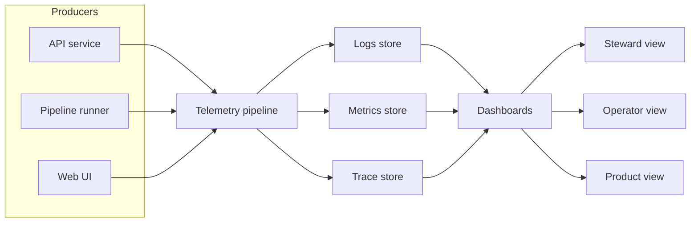

<!-- [KFM_META_BLOCK_V2]
doc_id: kfm://doc/271c1727-7cd5-4e48-aca7-a07b4c34701b
title: Observability Dashboards
type: standard
version: v1
status: draft
owners: TBD
created: 2026-02-23
updated: 2026-02-23
policy_label: restricted
related:
  - ../README.md
  - ../metrics/README.md
  - ../logs/README.md
  - ../tracing/README.md
tags: [kfm, observability, dashboards]
notes:
  - Source of truth for versioned dashboard definitions used by the observability stack.
  - Keep this directory safe: dashboards can leak sensitive operational context.
[/KFM_META_BLOCK_V2] -->

# Observability Dashboards
Versioned, governed dashboard definitions for KFM runtime health, governance signals, and product reliability.

[](#)
[](#)
[](#)
[](#)
[](#)

## Navigation
- [Scope](#scope)
- [Where this fits](#where-this-fits)
- [Observability flow](#observability-flow)
- [Directory layout](#directory-layout)
- [Dashboard contract](#dashboard-contract)
- [Telemetry keys](#telemetry-keys)
- [Baseline dashboard set](#baseline-dashboard-set)
- [Change workflow](#change-workflow)
- [Validation gates](#validation-gates)
- [Troubleshooting](#troubleshooting)
- [Appendix](#appendix)

---

## Scope

This folder holds **dashboards as code**: version-controlled definitions that visualize KFM telemetry and governance signals.

These dashboards exist to answer three questions quickly:

1. **Is the platform enforcing policy correctly?**
2. **Is the platform operating reliably?**
3. **Is the product experience healthy for users?**

> WARNING  
> Dashboards can accidentally expose sensitive information (system topology, internal URLs, identifiers, or restricted-location hints). Treat all dashboard artifacts in this directory as **restricted** unless explicitly reviewed and re-labeled.

[Back to top](#observability-dashboards)

---

## Where this fits

This directory is part of the governed configuration surface:

- `configs/` contains versioned configuration that can affect platform behavior.
- `configs/observability/` contains telemetry and monitoring configuration.
- `configs/observability/dashboards/` contains **visualizations** (dashboards) that sit on top of metrics, logs, and traces.

If you are looking for **public-facing dashboards** (end-user portal pages), those should live with the UI application, not here.

[Back to top](#observability-dashboards)

---

## Observability flow



This diagram is intentionally vendor-agnostic. Map the “stores” and “pipeline” boxes to your deployed observability stack (Prometheus, Loki, Tempo, OpenSearch, etc.) and update if conventions change.

[Back to top](#observability-dashboards)

---

## Directory layout

> NOTE  
> The exact subfolders in this repo may differ. Treat the tree below as a **recommended layout**. If the repository already has a different convention, keep that convention and update this README to match.

```
configs/observability/dashboards/
  README.md

  # Optional but recommended: a registry of dashboards in this directory
  catalog.yaml

  # Audience-oriented folders (recommended)
  steward/
  operator/
  product/

  # Optional: shared building blocks, templates, and screenshots
  lib/
  screenshots/
```

| Path | Purpose | Notes |
|---|---|---|
| `steward/` | Governance and policy dashboards | Denials, rights issues, quarantines |
| `operator/` | Platform operations dashboards | Pipelines, storage, deployments |
| `product/` | Product health dashboards | UI latency, accessibility signals |
| `lib/` | Shared variables, query snippets, templates | Keep generic and reusable |
| `screenshots/` | Review artifacts for diffs | Treat screenshots as restricted by default |
| `catalog.yaml` | Optional dashboard registry | Ownership and review metadata |

### Acceptable inputs

Dashboards and dashboard-adjacent assets only:

- Dashboard definitions (example formats)
  - Grafana dashboard JSON exports
  - Grafana provisioning YAML that references dashboard JSON
  - Jsonnet or other generated dashboard sources, if your stack uses them
- A dashboard registry (`catalog.yaml`) that records ownership and intent
- Screenshots for review diffs (optional)
- Short runbook links or annotations that point to the owning operational doc

### Exclusions

Do **not** commit:

- Secrets, API keys, tokens, cookies
- Personal data or user identifiers not required for operations
- Raw logs or raw trace payloads
- Data extracts, datasets, or evidence bundles
- Screenshots that show restricted locations or sensitive operational details without explicit policy approval

[Back to top](#observability-dashboards)

---

## Dashboard contract

Dashboards in this directory must support the platform’s **minimum observability** and the three required **audience views**.

### Minimum observability signals

Dashboards must be able to surface, at minimum:

- Structured logs with **correlation IDs** and `audit_ref`
- Metrics for:
  - **request latency P95** per API endpoint
  - **evidence resolver latency**
  - **tile response latency**
  - **pipeline run durations and failures**
- Traces are optional early, but dashboards should not prevent traces from being added later

### Audience views

Dashboards must support these views:

- **Steward view**: policy denials, rights issues, quarantines
- **Operator view**: pipeline health, storage usage, deployment status
- **Product view**: UI performance and accessibility regression indicators

[Back to top](#observability-dashboards)

---

## Telemetry keys

To make dashboards traceable across **runtime telemetry** and **governed artifacts**, use a stable set of identifiers in metrics, logs, and traces.

### Canonical key mapping

> TIP  
> When possible, keep *one* canonical identifier set that is reused across telemetry and catalogs. This makes it easier to jump from a chart panel to a run receipt, dataset version, or evidence bundle.

| Telemetry concept | OTel attribute | Metrics label | Guidance |
|---|---|---|---|
| Run ID | `kfm.job.run_id` | `job_run_id` | Use UUID or ULID |
| Commit | `kfm.git.commit_sha` | `commit_sha` | 7–40 hex characters |
| Status | `kfm.job.status` | `status` | `scheduled`, `running`, `succeeded`, `failed`, `canceled` |
| Started time | `kfm.job.started_at` | `started_at` | RFC3339 and optionally unix seconds |
| Ended time | `kfm.job.ended_at` | `ended_at` | RFC3339 and optionally unix seconds |
| Dataset ID | `kfm.dataset.id` | `dataset_id` | Use the STAC or DCAT dataset identifier |
| Pipeline name | `kfm.pipeline.name` | `pipeline` | Stable slug |

### Why this matters

- Enables **end-to-end traceability**: panel → run → catalog or provenance → artifacts.
- Reduces dashboard churn: queries stay stable as the system evolves.
- Supports governance: stewards can relate a spike in denials or quarantines to specific runs or dataset versions.

[Back to top](#observability-dashboards)

---

## Baseline dashboard set

Below is the recommended minimum dashboard set. Update the table to reflect what is actually present in this directory.

| Dashboard slug | Audience | Primary questions answered | Minimum signals | Owner | Status |
|---|---|---|---|---|---|
| `steward/governance-denials` | Steward | Are policy denials rising? Which policies? Which datasets? | policy denials, rights issues, quarantines | TBD | TODO |
| `operator/pipeline-health` | Operator | Are pipelines running on time? Are failures clustered? | pipeline durations, failures, storage usage | TBD | TODO |
| `product/ui-health` | Product | Is UI latency or accessibility regressing? | UI performance, a11y regression indicators | TBD | TODO |

> NOTE  
> If you add additional dashboards, keep them mapped to an audience view first. If a dashboard serves multiple audiences, duplicate it with view-specific presets rather than adding complex conditional logic.

[Back to top](#observability-dashboards)

---

## Change workflow

Use this workflow for new dashboards or edits.

1. **Pick a view**: steward, operator, or product.
2. **Define the question** the dashboard answers (one sentence).
3. **Confirm telemetry keys exist** for any run-level breakdown (run ID, commit, dataset, pipeline).
4. **Create or update the dashboard definition**
   - Prefer shared variables and query fragments from `lib/` if present.
   - Avoid embedding environment-specific hostnames or credentials.
5. **Update registry**
   - If `catalog.yaml` exists, add or update the dashboard entry.
6. **Review**
   - Steward dashboards require steward review.
   - Operator dashboards require operator review.
   - Product dashboards require product and accessibility review when applicable.
7. **Submit PR**
   - Include a screenshot diff if your workflow supports it.
   - Include a brief note describing the operational impact.

### Optional registry format

If the repo does not yet have a dashboard registry, the following schema is recommended:

```yaml
# configs/observability/dashboards/catalog.yaml
dashboards:
  - slug: steward/governance-denials
    title: Governance denials overview
    audience: steward
    description: Monitor policy denials, rights issues, and quarantines over time.
    sources:
      metrics: [kfm_policy_denials_total, kfm_quarantine_total]
      logs: [kfm_audit]
      traces: []
    owners:
      - team: TBD
    review:
      required: true
      reviewers: [steward]
    policy_label: restricted
```

[Back to top](#observability-dashboards)

---

## Validation gates

Treat dashboard changes like other governed configuration changes.

### Required checks

- [ ] No secrets or credentials committed
- [ ] No restricted-location details exposed in screenshots or panel text
- [ ] Dashboards use canonical telemetry keys where run-level filtering is needed
- [ ] Dashboard queries avoid high-cardinality explosions
- [ ] Dashboards are export-stable
  - Canonicalize JSON and YAML formatting to reduce false diffs
- [ ] Ownership is recorded (owner or team)
- [ ] Audience review completed

### Recommended checks

- [ ] JSON schema validation for dashboard definitions
- [ ] Render test or screenshot test in CI
- [ ] Lint rules for query style and label usage
- [ ] Panel links to run receipts or evidence bundles where appropriate

[Back to top](#observability-dashboards)

---

## Troubleshooting

### A dashboard is blank

- Confirm the target datasource is reachable in the environment.
- Confirm metric labels match canonical keys (example: `job_run_id`, `dataset_id`, `pipeline`).
- Confirm time range and filters are not excluding data.

### A query is too slow

- Reduce cardinality: avoid grouping by raw IDs unless the dashboard is strictly internal and reviewed.
- Prefer rollups for overview panels and drill-down panels for details.

### Unexpected spikes in denials or quarantines

- Start from the steward dashboard and drill into:
  - policy label
  - dataset ID
  - run ID
  - commit SHA
- Correlate with pipeline failures and deployment events in operator dashboards.

[Back to top](#observability-dashboards)

---

## Appendix

<details>
<summary>Design notes for stable diffs</summary>

- Exported dashboard JSON often changes ordering between exports. Prefer a canonical formatter and keep exports reproducible.
- Keep titles and descriptions consistent so diffs reflect intent rather than noise.
- Avoid embedding absolute URLs that differ by environment; prefer templated links or relative routes where your tooling allows.

</details>

<details>
<summary>Template for a new dashboard entry</summary>

1. Create a file under the correct audience folder (recommended):
   - `steward/<slug>.dashboard.json`
   - `operator/<slug>.dashboard.json`
   - `product/<slug>.dashboard.json`
2. Add an entry in `catalog.yaml` describing:
   - what question it answers
   - what signals it uses
   - who owns it
   - required reviewers

</details>
