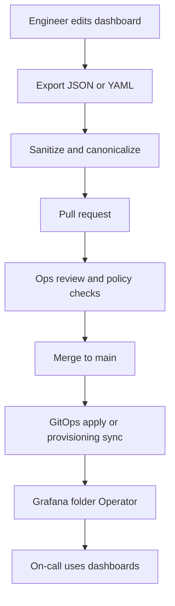

<!-- [KFM_META_BLOCK_V2]
doc_id: kfm://doc/d0923ac6-acd0-4577-accf-0f982f4cecf3
title: Operator Dashboards
type: standard
version: v1
status: draft
owners: platform-ops (TBD)
created: 2026-02-23
updated: 2026-02-23
policy_label: restricted
related:
  - configs/observability/README.md
  - configs/observability/dashboards/README.md
tags: [kfm, observability, dashboards, operator]
notes:
  - Directory README for operator-facing dashboards as code.
  - "operator" here means platform operators (SRE/on-call), not a Kubernetes Operator resource.
[/KFM_META_BLOCK_V2] -->

# Operator Dashboards
Operator-facing observability dashboards as code for the KFM platform.


> **NOTE**  
> These dashboards are intended for **platform operators** (SRE/DevOps/on-call) to keep KFM healthy and to troubleshoot incidents.

## Quick links
- [What belongs here](#what-belongs-here)
- [How dashboards flow](#how-dashboards-flow)
- [Where this fits in the repo](#where-this-fits-in-the-repo)
- [Directory layout](#directory-layout)
- [Dashboard registry](#dashboard-registry)
- [Conventions](#conventions)
- [Telemetry label conventions](#telemetry-label-conventions)
- [Add or update a dashboard](#add-or-update-a-dashboard)
- [Review checklist](#review-checklist)
- [Troubleshooting](#troubleshooting)

---

## What belongs here
This directory contains **operator-facing dashboards** that answer questions like:

- “Is the platform healthy right now?”
- “Where is the bottleneck (ingest, processing, storage, API, UI, indexing)?”
- “Did last deploy or pipeline run regress latency, errors, or cost?”
- “What changed (commit, image, config) at the time of impact?”

### Acceptable inputs
- Grafana dashboard exports saved as **JSON** (sanitized for drift and secrets)
- Grafana Operator `GrafanaDashboard` resources (**YAML**) that reference embedded JSON
- Library panels or shared dashboard fragments (only if your provisioning mechanism supports them)

### Exclusions
- ❌ Secrets or credentials (API keys, datasource passwords, auth headers)
- ❌ Public-facing analytics dashboards (those belong in the product/story UI layer)
- ❌ One-off “personal” dashboards that are not maintained
- ❌ Screenshots, exported CSVs, or incident data dumps

> **WARNING**  
> If a dashboard would expose sensitive locations, PII, or restricted datasets, it must be **redacted** or moved behind stricter access controls.

---

## How dashboards flow


---

## Where this fits in the repo
Path: `configs/observability/dashboards/operator/`

This folder is part of the **configuration layer** for observability. It should remain:

- reviewable (small diffs),
- deterministic (no noisy/volatile export fields),
- governable (clear ownership and access intent).

If sibling folders exist (examples):  
- `configs/observability/dashboards/product/` — product team dashboards  
- `configs/observability/dashboards/public/` — public portal dashboards (usually not Grafana)

Update these references to match your repo structure.

---

## Directory layout
> **TODO**: Align this tree to the actual provisioning method used in this repo.

```text
configs/observability/dashboards/operator/
├── README.md                        # you are here
├── registry.md                      # optional: human-maintained dashboard index (recommended)
├── grafana/                         # optional: raw Grafana dashboard JSON
│   ├── kfm-operator-overview.json
│   └── kfm-ingest-pipeline.json
└── grafana-operator/                # optional: GrafanaDashboard CRs (Kubernetes Operator provisioning)
    ├── kfm-operator-overview.yaml
    └── kfm-ingest-pipeline.yaml
```

---

## Dashboard registry
Maintain a lightweight index so operators can quickly find the right view.

> **TODO**: Replace example rows with real dashboards + real file paths once dashboards land.

| Dashboard | Primary question | File | Datasource(s) | Owner | Notes |
|---|---|---|---|---|---|
| KFM Operator Overview | Is the platform healthy? | `TBD` | `TBD` | `platform-ops` | Replace with real file |
| Ingest Pipeline | Are jobs flowing? Any failures/backlog? | `TBD` | `TBD` | `platform-ops` | Replace with real file |

---

## Conventions

### Naming
- Prefer stable slugs: `kfm-<area>-<purpose>.{json,yaml}`
- Dashboards SHOULD live in a Grafana folder named **Operator** (or equivalent), separated from public/product dashboards.

### Determinism and diff hygiene
Grafana exports are notoriously noisy. To keep PR reviews meaningful:

- Strip or normalize volatile fields (examples):
  - dashboard numeric `id`
  - export `version`
  - export `iteration` timestamp
- Canonicalize JSON formatting so the same logical dashboard produces the same bytes.
- Avoid embedding environment-specific datasource UIDs directly; use variables or provisioning-time mapping when possible.

Example sanitizer (adjust to your stack):
```bash
# Example only: normalize a Grafana dashboard export for version control
jq '
  .id = null
  | .version = 0
  | del(.iteration)
  | del(.templating.list[]?.current)
' kfm-operator-overview.raw.json \
  | jq -S '.' \
  > grafana/kfm-operator-overview.json
```

### Ownership and escalation
Every dashboard must declare:
- **Owner** (team or on-call rotation)
- **SLO signal** (what it measures)
- **Escalation link** (runbook, playbook, or incident guide)

If your Grafana provisioning supports annotations/tags, use tags like:
- `kfm`
- `operator`
- `tier:critical` / `tier:informational`
- `domain:ingest` / `domain:api` / `domain:storage`

---

## Telemetry label conventions
Operator dashboards should be able to pivot by pipeline run, dataset, and release identifiers.

Standardize on the following keys across metrics and traces:

| Semantic | OTel attribute | Prom label | Notes |
|---|---|---|---|
| Run ID | `kfm.job.run_id` | `job_run_id` | UUID or ULID |
| Commit | `kfm.git.commit_sha` | `commit_sha` | 7-40 hex |
| Status | `kfm.job.status` | `status` | `scheduled` `running` `succeeded` `failed` `canceled` |
| Started | `kfm.job.started_at` | `started_at` | RFC3339 plus unix seconds |
| Ended | `kfm.job.ended_at` | `ended_at` | RFC3339 plus unix seconds |
| Dataset | `kfm.dataset.id` | `dataset_id` | STAC or DCAT id |
| Pipeline | `kfm.pipeline.name` | `pipeline` | stable slug |
| Environment | `kfm.env` | `env` | `dev` `staging` `prod` |

---

## Add or update a dashboard
1. **Design for an operational question** (not “all the metrics”).
2. Build or modify the dashboard in Grafana.
3. Export to JSON (or update the `GrafanaDashboard` CR).
4. Sanitize + canonicalize.
5. Update the [Dashboard registry](#dashboard-registry).
6. Open a PR with:
   - before/after screenshots or a short GIF (optional but helpful),
   - query snippets for any non-obvious panels,
   - a link to the runbook if the dashboard is on-call critical.

---

## Review checklist
- [ ] Dashboard answers a clear operational question.
- [ ] No secrets embedded (datasource creds, headers, tokens).
- [ ] JSON/YAML is canonicalized (stable diffs).
- [ ] Panels use standard labels (run id, dataset id, env) when applicable.
- [ ] Ownership is set (registry row updated).
- [ ] If sensitive data is visualized, access controls are appropriate.

---

## Troubleshooting

### Dashboards not showing up
Common causes:
- Provisioning path not mounted / wrong folder
- `GrafanaDashboard` CR rejected (invalid JSON, wrong namespace)
- Datasource name/UID mismatch

Suggested checks (adjust to your environment):
```bash
# Kubernetes operator provisioning (example only)
kubectl get grafanadashboards -A
kubectl describe grafanadashboard <name> -n <namespace>
```

### Panels show “No data”
- Confirm the metric exists and labels match.
- Reduce label cardinality before using in high-level operator views.
- Verify time range and timezone settings.

---

<details>
<summary>Appendix: GrafanaDashboard CR skeleton (example)</summary>

```yaml
apiVersion: integreatly.org/v1alpha1
kind: GrafanaDashboard
metadata:
  name: kfm-operator-overview
spec:
  folder: Operator
  json: |
    { "title": "KFM Operator Overview", "panels": [] }
```
</details>

<p align="right"><a href="#operator-dashboards">Back to top</a></p>
