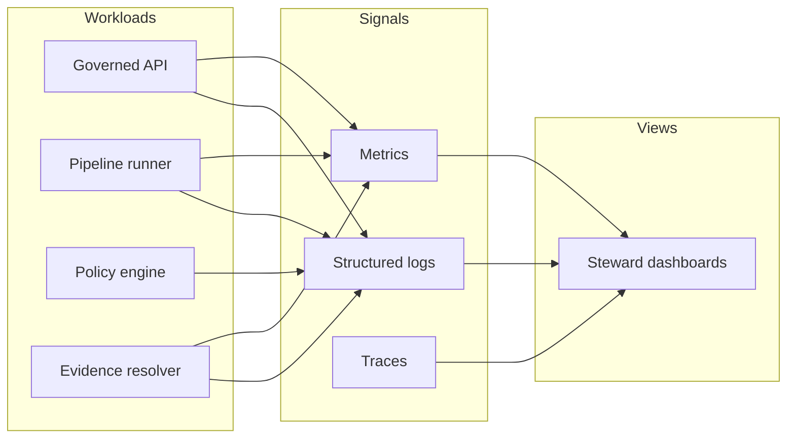

<!-- [KFM_META_BLOCK_V2]
doc_id: kfm://doc/0de01104-a37b-42da-8c0c-53b4c0d46edc
title: Steward Observability Dashboards
type: standard
version: v1
status: draft
owners: TBD
created: 2026-02-23
updated: 2026-02-23
policy_label: restricted
related:
  - TODO: ../README.md
  - TODO: ../../runbooks/observability.md
tags: [kfm, observability, dashboards, steward]
notes:
  - Directory contract for steward-facing observability dashboards.
[/KFM_META_BLOCK_V2] -->

# Steward Observability Dashboards
Steward-facing dashboards for governance signals: **policy denials**, **rights issues**, and **quarantines**.


> **NOTE**
> This folder is for the *steward* view only (governance oversight). Operational (SRE/operator) and product (UI performance) dashboards belong elsewhere.

## Quick links
- [What belongs here](#what-belongs-here)
- [Steward scope](#steward-scope)
- [Baseline signals](#baseline-signals)
- [Dashboard inventory](#dashboard-inventory)
- [How to add or update a dashboard](#how-to-add-or-update-a-dashboard)
- [Security and governance rules](#security-and-governance-rules)
- [CI expectations](#ci-expectations)
- [Appendix: naming and conventions](#appendix-naming-and-conventions)

---

## What belongs here

This directory is a **governed configuration surface** for steward-facing observability dashboards.

### Acceptable inputs
Store only *dashboard definitions* and closely related review artifacts:

- Exported dashboard definitions (tool-specific), e.g.:
  - `*.dashboard.json` (common for Grafana exports)
  - `*.ndjson` (common for Kibana saved objects exports)
  - `*.yaml` / `*.jsonnet` (if dashboards are generated from code)
- Optional: small, non-sensitive screenshots used for review (`_assets/`), if your workflow requires it.

### Exclusions
Do **not** commit:

- Secrets (API keys, tokens, passwords)
- Raw logs, traces, or metrics dumps
- PII or user-identifying fields (even if “only internal”)
- Restricted coordinates or sensitive location identifiers
- Tool state that is environment-specific and non-deterministic (volatile timestamps, random UIDs)

---

## Steward scope

These dashboards exist to make governance *operable*, not ad hoc. Steward view focuses on:

1. **Policy denials**
   - Denies by endpoint, policy label, reason code
   - “Fail closed” / default-deny triggers (unexpected deny spikes)
2. **Rights issues**
   - Missing rights metadata / attribution obligations
   - Content flagged as “rights changed” since last promotion
3. **Quarantines**
   - Datasets or outputs in quarantine (validation failures, unresolved rights, link-check failures)
   - Age-of-quarantine and queue health

---

## Baseline signals

A steward dashboard is only as good as the signals beneath it. At minimum, the platform should emit:

- **Structured logs** with `correlation_id` and `audit_ref`
- **Metrics** for:
  - endpoint latency (P95)
  - evidence resolver latency
  - tile response latency
  - pipeline run duration and failures
- **Traces** are optional early, but recommended when incident triage becomes frequent

### Drill-down contract
Where possible, steward dashboards should support a “3-click” path:

1. **See the anomaly** (deny spike, rights backlog growth, quarantine surge)
2. **Identify scope** (dataset slug/version, policy label, endpoint family)
3. **Jump to evidence** (audit reference, run receipt, or the governing decision record)

---

## Dashboard inventory

Maintain a lightweight inventory so stewardship is not tribal knowledge.

| Dashboard slug | Purpose | Primary signals | Sensitivity | Owner | Notes |
|---|---|---|---|---|---|
| *(TBD)* | *(TBD)* | *(TBD)* | *(TBD)* | *(TBD)* | Add entries as dashboards are created |

<details>
<summary><strong>Example inventory rows (template only)</strong></summary>

| Dashboard slug | Purpose | Primary signals | Sensitivity | Owner | Notes |
|---|---|---|---|---|---|
| `steward_policy_denials` | Monitor deny rates and reasons | deny_count, deny_rate, reason_code | internal | Steward | Avoid principal identifiers; aggregate |
| `steward_rights_issues` | Track rights clearance backlog | missing_rights_count, rights_changed | restricted | Steward | Links to rights registry entries |
| `steward_quarantine_queue` | Track quarantine items and age | quarantine_count, quarantine_age | internal | Steward + Operator | Identify top blockers by check name |

</details>

---

## How to add or update a dashboard

1. **Design for governance**
   - Start from a concrete stewardship question (e.g., “Why did denials spike today?”).
2. **Export deterministically**
   - Export the dashboard definition in a way that minimizes volatile fields.
3. **Name the file predictably**
   - Follow [Naming and conventions](#appendix-naming-and-conventions).
4. **Update the inventory table**
   - Add/modify the row in [Dashboard inventory](#dashboard-inventory).
5. **Open a PR**
   - Make the change reviewable: include a short intent statement and (optional) a screenshot.
6. **Verify no policy leaks**
   - Confirm the dashboard does not expose restricted identifiers, coordinates, or raw content.

---

## Security and governance rules

### Data minimization
- Prefer counts, rates, distributions, and coarse aggregations.
- Avoid “Top N users/principals” unless values are irreversibly anonymized and policy-approved.

### No sensitive locations
- Do not display precise coordinates or feature identifiers for any sensitive datasets.
- When in doubt, aggregate by admin units, grids, or generalized geometry methods.

### Auditability
- Any governance-relevant panel should be traceable to:
  - a policy decision (deny/allow + obligations), and/or
  - a run receipt / quarantine reason, and/or
  - a rights classification record

> **WARNING**
> If you cannot explain how a dashboard panel avoids leaking restricted information, **do not ship it**. Default to restricted draft and request review.

---

## CI expectations

> These checks may be implemented in CI. If they are not yet present, treat them as the definition of done for this folder.

- [ ] Dashboard files are valid JSON/NDJSON/YAML (as applicable)
- [ ] No secrets are committed (secret scanners pass)
- [ ] No restricted coordinates / identifiers appear in committed artifacts
- [ ] Inventory table is updated for any new or renamed dashboard
- [ ] Optional: dashboard export is normalized (stable formatting, stripped volatile fields)

---

## Directory tree

```text
configs/observability/dashboards/steward/
  README.md                  # this file
  *.dashboard.json           # exported dashboard definitions (tool-specific)
  *.ndjson                   # exported saved objects (tool-specific)
  *.yaml                     # generated/provisioned dashboards (tool-specific)
  _assets/                   # optional: review screenshots (non-sensitive only)
```

---

## Appendix: naming and conventions

### Naming
- Prefer `steward_<topic>` slugs (lowercase, underscores).
- Keep file names close to slugs:
  - `steward_policy_denials.dashboard.json`
  - `steward_rights_issues.dashboard.json`
  - `steward_quarantine_queue.dashboard.json`

### Ownership
Each dashboard should have a clear owner (person or team). If unknown, set to `TBD` and assign before relying on it for incident response.

### Minimal dashboard layout
- Overview row: top KPIs + sparklines
- Breakdown row: by reason code / dataset / endpoint
- Triage row: links to audit/run receipts (where policy allows)

---

## Reference architecture (conceptual)



---

[Back to top](#steward-observability-dashboards)
