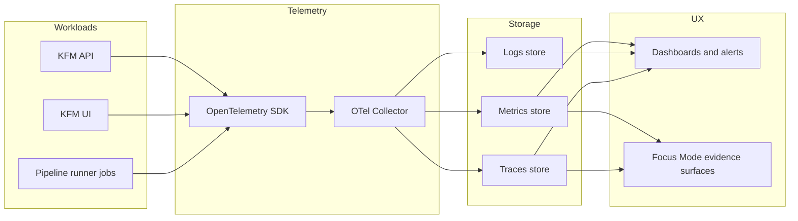

<!-- [KFM_META_BLOCK_V2]
doc_id: kfm://doc/0b50462a-caf2-43f7-ab2c-5fd4f9437abf
title: Observability Deploy
type: standard
version: v1
status: draft
owners: platform-sre (TODO), governance-owners (TODO)
created: 2026-02-23
updated: 2026-02-23
policy_label: restricted
related:
  - configs/observability/README.md (TODO)
  - docs/ops/observability/README.md (TODO)
tags: [kfm, observability, deploy, gitops, k8s]
notes:
  - Generated README template; align directory tree + commands with repo reality before promotion.
[/KFM_META_BLOCK_V2] -->

# Observability Deploy
Kubernetes/OpenShift deploy configs for the KFM observability stack (logs, metrics, traces) — **governance-first**, **evidence-linked**, **fail-closed**.


> WARNING  
> This directory is **policy-labeled `restricted`** by default because it can encode deployment topology, retention, and access control.  
> Do **not** commit secrets, tokens, or cluster-unique credentials here.

---

## Quick navigation
- [Overview](#overview)
- [Directory contract](#directory-contract)
- [Architecture](#architecture)
- [Minimum required signals](#minimum-required-signals)
- [Telemetry conventions](#telemetry-conventions)
- [Directory layout](#directory-layout)
- [Deploy workflows](#deploy-workflows)
- [CI and promotion gates](#ci-and-promotion-gates)
- [Backup restore incident response](#backup-restore-incident-response)
- [Ownership matrix](#ownership-matrix)
- [Appendix](#appendix)

---

## Overview

This folder contains **deployment-facing** configuration for observability components used by KFM to:
- Detect and debug **policy denials**, **quarantines**, and **rights/licensing issues**
- Monitor API/UI performance (latency, tiles) and pipeline health (durations, failures)
- Link runtime telemetry to **catalog + provenance** (so Focus Mode and the Evidence Drawer can “show the work”)

### Truth status
- ✅ **Confirmed** (from KFM design/pattern docs): minimum signal requirements; canonical telemetry keys; catalog linkage conventions; trust-membrane expectations.
- 🧪 **Proposed** (safe default templates): directory layout; deploy command examples; specific component choices (Prometheus/Grafana/etc).
- ❓ **Unknown** (must be verified in-repo / per environment): actual toolchain (Helm/Kustomize/ArgoCD/etc), namespaces, chart versions, retention numbers, SSO/auth wiring.

[Back to top](#observability-deploy)

---

## Directory contract

### Purpose (what belongs here)
**Acceptable inputs**
- Kubernetes manifests (`.yaml`) and/or Kustomize bases/overlays for observability workloads
- Helm values / Helmfile / chart wrappers for observability components
- OpenTelemetry Collector configuration (pipelines, processors, exporters)
- Dashboards-as-code (Grafana JSON), data sources, alert rules, recording rules
- Policy-constrained retention and redaction configs (where supported)

### Exclusions (what must NOT go here)
- ❌ Plaintext secrets (API keys, tokens, passwords, kubeconfigs)
- ❌ Production-only endpoint lists that reveal sensitive network topology (prefer indirection via DNS, service discovery, or sealed secret references)
- ❌ Unredacted sample logs/traces that may include PII or restricted locations
- ❌ “One-off” manual changes not represented as code + PR

### Where this fits in the repo
`configs/observability/deploy/` should be the **single source of truth** for deploying and updating the observability stack via PR + CI gates + controlled rollout.

[Back to top](#observability-deploy)

---

## Architecture



> NOTE  
> Storage backends (Prometheus/Mimir, Loki, Tempo, etc.) are **implementation choices**.  
> The *contract* is stable: metrics + logs + (optional early) traces, and the ability to link telemetry to catalog/provenance identifiers.

[Back to top](#observability-deploy)

---

## Minimum required signals

These are the **minimum observability expectations** for KFM deployments:

### Logs
- **Structured logs**
- Include **correlation IDs** and an **`audit_ref`** (or equivalent audit linkage)

### Metrics
At minimum, emit metrics for:
- Request latency (P95) **per endpoint**
- Evidence resolver latency
- Tile response latency
- Pipeline run durations and failures

### Traces
- Optional in early phases, but recommended once you need end-to-end causality across API ↔ evidence resolver ↔ pipelines.

### Dashboards must support three audiences
- **Steward view:** policy denials, rights issues, quarantines
- **Operator view:** pipeline health, storage usage, deployment status
- **Product view:** UI performance and accessibility regression indicators

[Back to top](#observability-deploy)

---

## Telemetry conventions

### Canonical keys (OTel attributes + Prom labels)

Use these keys consistently in:
- OpenTelemetry attributes (logs/spans)
- Prometheus-style labels (metrics)
- Catalog/provenance metadata (STAC/DCAT/PROV properties)

| Semantic meaning | OTel attribute key | Prometheus label | Allowed / notes |
|---|---|---|---|
| Run ID | `kfm.job.run_id` | `job_run_id` | UUID or ULID |
| Commit SHA | `kfm.git.commit_sha` | `commit_sha` | 7–40 hex |
| Job status | `kfm.job.status` | `status` | `scheduled` `running` `succeeded` `failed` `canceled` |
| Started time | `kfm.job.started_at` | `started_at` | RFC3339 string **and** unix seconds (see below) |
| Ended time | `kfm.job.ended_at` | `ended_at` | RFC3339 string **and** unix seconds (see below) |
| Dataset ID | `kfm.dataset.id` | `dataset_id` | STAC/DCAT dataset identifier |
| Pipeline name | `kfm.pipeline.name` | `pipeline` | Stable slug |
| Environment | `kfm.env` | `env` | `dev` `staging` `prod` |

**Timestamp rule:** emit timestamps twice:
- RFC3339 strings (good for traces and catalog metadata)
- unix seconds (good for PromQL math)

### Catalog linkage rules
- Write run identifiers into **STAC Item properties** (for example: `kfm:run_id`, commit SHA, status)
- In **PROV JSON-LD**, model the run as a `prov:Activity` with times + agents
- Use `dataset_id` to connect dashboards to catalog pages and Focus Mode evidence surfaces

> TIP  
> Treat these keys like an API contract: changing them is a breaking change for dashboards, alerts, and evidence linking.

[Back to top](#observability-deploy)

---

## Directory layout

> NOTE  
> The layout below is a **recommended shape**. Replace/trim to match what actually exists in your repo.

```text
configs/observability/deploy/                        # Deployment wiring for observability stack (PROPOSED)
├─ README.md                                         # (This file) deploy model, environments, and validation steps
│
├─ base/                                             # (PROPOSED) Kustomize base: shared manifests/values
├─ overlays/                                         # (PROPOSED) Environment overlays (small, explicit deltas)
│  ├─ dev/                                           # Dev patches (lighter footprint; faster iteration)
│  ├─ staging/                                       # Staging patches (prod-like where possible)
│  └─ prod/                                          # Prod patches (HA, strict policies, audited changes)
│
├─ helm/                                             # (PROPOSED) Helm values / chart wrappers (if Helm is used)
│
├─ otel/                                             # (PROPOSED) OpenTelemetry wiring used by deploy
│  └─ collector.yaml                                 # Collector pipelines (ingest → process → export)
│
├─ dashboards/                                       # (PROPOSED) Dashboards-as-code wiring
│  └─ grafana/                                       # Grafana dashboards provisioning (folders/datasources/dashboards)
│
├─ rules/                                            # (PROPOSED) Rules-as-code wiring
│  └─ prometheus/                                    # Prometheus recording + alert rules
│
├─ alerts/                                           # (PROPOSED) Alerting wiring
│  └─ routes.yaml                                    # Alert routing policy (severity → destinations, grouping)
│
└─ scripts/                                          # (PROPOSED) Validation + preflight helpers
   └─ validate.sh                                    # Local checks (lint, schema, render, dry-run apply)
```

[Back to top](#observability-deploy)

---

## Deploy workflows

Because the repo toolchain is **unknown**, this section lists safe patterns. Keep exactly **one** “blessed path” per environment once verified.

### Option A: Kustomize
```bash
# Dry-run (server-side) example
kubectl apply --server-side --dry-run=server -k configs/observability/deploy/overlays/dev

# Apply
kubectl apply -k configs/observability/deploy/overlays/dev
```

### Option B: Helm
```bash
# Example only: replace <release>, <ns>, and values paths with real ones
helm upgrade --install <release> <chart> \
  --namespace <ns> --create-namespace \
  -f configs/observability/deploy/helm/values-dev.yaml
```

### Verify after deploy (minimum smoke)
- Dashboards load (Grafana or equivalent)
- Metrics present for: endpoint latency P95, tile latency, pipeline duration/failure
- Logs contain correlation IDs + audit ref fields
- If traces enabled: can follow a request across API → evidence resolver → downstream

[Back to top](#observability-deploy)

---

## CI and promotion gates

### Non-negotiables for KFM changes (applies here)
- **Fail closed:** if evidence/signatures/policy checks fail, nothing ships.
- **Deterministic identity:** configs and outputs should be hashable and comparable.
- **Receipts:** important actions should emit a structured run receipt / manifest.

### PR checklist for this directory
- [ ] No secrets committed (including “temporary” test tokens)
- [ ] Telemetry conventions preserved (canonical keys unchanged or migrated safely)
- [ ] Dashboards/alerts updated to match label schema
- [ ] Retention and access policy reviewed (steward/operator)
- [ ] Rollback path defined (revert commit, sync GitOps, or Helm rollback)
- [ ] Change is *reproducible* from a clean checkout

### Suggested automated checks (wire into CI)
- YAML + schema lint (K8s objects, OTel config)
- K8s conformance validation (`kubeconform`/`kubectl --dry-run`)
- Policy-as-code checks (OPA/Conftest) for:
  - privileged pods, host networking, unsafe mounts
  - required labels/annotations for auditability
- License/compliance checks for dashboards/rules/config packs when applicable
- Optional: config digest + attestation verification for “deployment bundles”

<details>
<summary>Optional pattern: attest deployment bundles (PROPOSED)</summary>

If your repo already uses artifact attestation, consider applying the same idea to “deploy bundles”:
- Canonicalize configs (stable ordering)
- Compute digests
- Produce a signed attestation
- Verify attestation in CI before promotion

This is especially useful for high-risk environments (prod) where “what exactly got deployed?” must be answerable.
</details>

[Back to top](#observability-deploy)

---

## Backup restore incident response

> NOTE  
> Observability *itself* is not the only thing to back up; KFM relies on canonical stores that make recovery possible.

### Canonical stores to back up (KFM)
- Object storage (raw, work/quarantine, processed, catalog)
- Audit ledger
- Policy repository state (git)
- Story nodes and docs (git)

### Restore drill expectations
- Restore canonical stores
- Rebuild projections (indexes/search) from promoted artifacts
- Validate counts/extents against catalogs
- Run API + UI smoke tests
- Record the drill as a governed run receipt

### Governance incident types to design for
- Restricted data leakage
- Licensing violation risk (unlicensed media published)
- Corrupted catalogs or broken citations
- Pipelines producing non-deterministic outputs

For each incident type, define:
- Detection signals
- Escalation contacts (steward, operator, council)
- Containment steps
- Remediation steps (including retraction + new versions)
- Post-incident review (ADR + policy updates)

[Back to top](#observability-deploy)

---

## Ownership matrix

> TODO: Replace placeholders with actual on-call/owners and escalation paths.

| Area | Primary owner | Secondary | Notes |
|---|---|---|---|
| Metrics | platform-sre (TODO) | app-owners (TODO) | latency + pipeline health |
| Logs | platform-sre (TODO) | governance (TODO) | must include correlation IDs + audit refs |
| Traces | platform-sre (TODO) | app-owners (TODO) | optional early, recommended later |
| Dashboards/alerts | platform-sre (TODO) | product (TODO) | steward/operator/product views |
| Retention/access policy | governance (TODO) | platform-sre (TODO) | default-deny when unclear |

[Back to top](#observability-deploy)

---

## Appendix

<details>
<summary>Appendix A: What to verify before calling this “production-ready”</summary>

- CI gates exist and are merge-blocking for:
  - config validation
  - policy checks
  - (if adopted) attestation verification
- “Steward view” dashboards show:
  - policy denials
  - quarantines
  - rights/licensing issues
- “Operator view” dashboards show:
  - pipeline duration/failure rates
  - storage usage
  - deployment status
- “Product view” dashboards show:
  - UI performance
  - accessibility regression indicators
- Runbooks exist for:
  - telemetry dropouts (collector down, label mismatch)
  - alert storms
  - retention saturation
</details>
