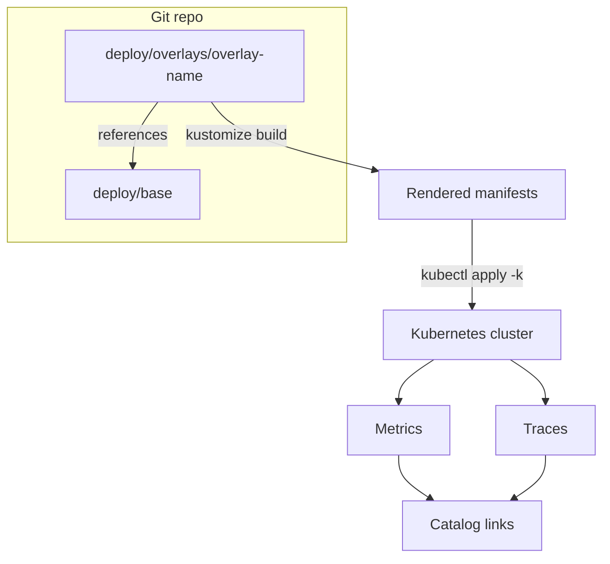

<!-- [KFM_META_BLOCK_V2]
doc_id: kfm://doc/afa6bef1-1cb7-4b71-a799-c13495a4fa55
title: Observability Deploy Overlays
type: standard
version: v1
status: draft
owners: TODO:platform-observability
created: 2026-02-23
updated: 2026-02-23
policy_label: public
related:
  - TODO:../base/README.md
  - TODO:../../../../docs/observability/README.md
tags: [kfm, observability, deploy, kustomize, overlays]
notes:
  - This README documents the overlays/ directory contract (what belongs here, how to render/apply).
  - Replace TODO links/owners once repo paths + team ownership are confirmed.
[/KFM_META_BLOCK_V2] -->

# Observability Deploy Overlays
Kustomize **overlays** for deploying the KFM observability stack to specific environments/clusters.


**Owners:** `TODO:platform-observability`  
**Path:** `configs/observability/deploy/overlays/`

> **NOTE**
> This file is written to be **safe by default**: it avoids assuming which overlays exist (e.g., `dev/`, `prod/`) until confirmed in-repo.
> Add your concrete overlay directories to the **Overlay registry** below.

## Quick navigation
- [Directory layout](#directory-layout)
- [How overlays work](#how-overlays-work)
- [Deploy and render](#deploy-and-render)
- [Overlay contract](#overlay-contract)
- [Telemetry identity mapping](#telemetry-identity-mapping)
- [Reproducibility and promotion gates](#reproducibility-and-promotion-gates)
- [Troubleshooting](#troubleshooting)

---

## Where this fits
This directory is part of the **deployment configuration** for observability:

- `configs/observability/deploy/base/` holds the shared, reusable manifests.
- `configs/observability/deploy/overlays/` (this directory) holds *deltas* per environment/cluster.

The intent is to keep overlays small and reviewable, so changes to cluster behavior are visible as focused diffs.

---

## Directory layout
This directory holds **environment/cluster-specific deltas** for the observability deployment.

```text
configs/observability/deploy/
├─ base/                        # shared observability resources (not shown here)
└─ overlays/
   ├─ README.md                 # this file
   └─ <overlay-name>/           # e.g., dev, stage, prod, or a cluster slug
      ├─ kustomization.yaml
      ├─ patches/               # strategic merge + JSON6902 patches (recommended)
      ├─ values/                # config maps / rendered values (only non-secret)
      └─ README.md              # optional: overlay-specific notes/runbook
```

### Overlay registry
Populate this table as overlays are added.

| Overlay | Intended target | Owner | Notes |
|---|---|---|---|
| `<overlay-name>` | `<cluster/env>` | `<team>` | `<what differs + why>` |

---

## How overlays work
Kustomize is organized as a hierarchy of **bases** and **overlays**. The **base** contains shared resources, while each **overlay** composes the base and adds only the deltas needed for a particular environment/cluster.



---

## Deploy and render

### Render manifests locally (dry run)
From repo root (or adjust paths as needed):

```bash
# Render YAML to stdout
kubectl kustomize configs/observability/deploy/overlays/<overlay-name> > /tmp/observability.rendered.yaml

# (Optional) Server-side dry-run if you have cluster access
kubectl apply --dry-run=server -f /tmp/observability.rendered.yaml
```

### Apply an overlay
```bash
kubectl apply -k configs/observability/deploy/overlays/<overlay-name>
```

> **TIP**
> Prefer a GitOps controller to apply overlays continuously (e.g., Argo CD / Flux), but keep `kubectl apply -k`
> as the baseline reproducible interface for local validation.

---

## Overlay contract

### What belongs here
Overlays should express **only environment/cluster deltas**, such as:

- Namespace selection (if your platform model allows it)
- Storage class / PVC sizes / retention policies for metrics & traces
- External endpoints (ingress/route hosts), TLS issuer refs
- Resource sizing (requests/limits), replica counts, autoscaling
- Feature toggles (enable/disable traces, profiling, alerts)
- RBAC differences required by the target cluster’s policy boundary

### What must NOT go here
- **Secrets** (tokens, passwords, private keys). Use your cluster’s secret mechanism (ExternalSecrets, sealed secrets, etc.).
- Cluster-unique data that is **not reproducible** (hand-edited manifests applied outside Git).
- Copy-pasted base YAML. Store shared config in `../base/` and keep overlays as deltas.

### Minimal `kustomization.yaml` shape (example)
```yaml
apiVersion: kustomize.config.k8s.io/v1beta1
kind: Kustomization

# Prefer resources (newer) over bases (older), but either may exist depending on repo conventions.
resources:
  - ../../base

# Common overlay knobs
namespace: observability

patches:
  - path: patches/otel-collector.resources.yaml
  - path: patches/grafana.ingress.yaml

configMapGenerator:
  - name: observability-runtime-config
    files:
      - values/runtime.yaml
generatorOptions:
  disableNameSuffixHash: true
```

---

## Telemetry identity mapping
To make deployments and pipeline runs traceable across **metrics, traces, and catalogs**, standardize on canonical attribute/label keys.

Use these keys consistently when configuring:
- OpenTelemetry resource attributes / span attributes
- Prometheus/Mimir labels (metric series labels)
- Links in STAC/DCAT/PROV metadata back to runtime telemetry

| Semantic OTel attribute | Prom label | Notes |
|---|---|---|
| `kfm.job.run_id` | `job_run_id` | UUID/ULID |
| `kfm.git.commit_sha` | `commit_sha` | 7–40 hex |
| `kfm.job.status` | `status` | `scheduled|running|succeeded|failed|canceled` |
| `kfm.job.started_at` (RFC3339) | `started_at` | Also emit unix seconds |
| `kfm.job.ended_at` (RFC3339) | `ended_at` | Also emit unix seconds |
| `kfm.dataset.id` | `dataset_id` | STAC/DCAT id |
| `kfm.pipeline.name` | `pipeline` | Stable slug |

> **NOTE**
> The mapping above is intentionally *small and canonical*—add new keys only when they’re needed for cross-system traceability
> and when they’re also representable in your catalogs.

---

## Reproducibility and promotion gates

Even though overlays are “just YAML,” treat them like production inputs:

- Keep diffs small and reviewable (overlay = delta).
- Make rendered output deterministic:
  - Avoid nondeterministic generators where possible.
  - Prefer stable ordering/canonicalization before hashing/signing artifacts.

### Suggested CI gates for this directory
Add/ensure CI checks that fail closed:

- [ ] `kustomize build` (or `kubectl kustomize`) succeeds for every overlay
- [ ] YAML validation/linting (schema + policy checks if available)
- [ ] **No secrets** committed (secret scanners)
- [ ] If you produce build attestations, ensure configs are canonicalized before hashing

<details>
<summary>Optional: attestation-oriented checklist</summary>

If your pipeline signs and verifies artifacts:

- Canonicalize configs before hashing (stable key ordering, minified JSON/YAML).
- Pin container image digests where possible.
- Gate promotion/publish on verification (e.g., `verify-attestation` must pass).

</details>

---

## Troubleshooting

### “resource mapping not found” / missing CRDs
If an overlay includes CRDs (or depends on them), confirm your cluster has them installed *before* applying dependent resources.

### “namespace not found”
If your platform workflow manages namespaces separately, overlays should not create them.
Either:
- point the overlay at an existing namespace, or
- coordinate with the cluster admin workflow that provisions namespaces.

### Render differences are noisy
If diffs are hard to review, move shared changes into `../base/` and keep overlays as deltas only.

---

## Governance notes

### Assumptions
- Overlay directory names and ownership are **not confirmed** in this sandbox; populate the [Overlay registry](#overlay-registry).
- The base directory is assumed to exist at `../base/` (common Kustomize layout), but confirm in-repo.

### Risks
- If overlays grow large, reviewers lose signal and drift increases (copy/paste base YAML).
- If secrets leak into overlays, repo history becomes a long-term incident.

### Tradeoffs
- Keeping overlays “delta-only” may require occasional refactors to move shared config into the base.
- Strict canonical key requirements for telemetry can constrain ad-hoc metrics, but improves cross-system traceability.

### Minimum verification steps (before promotion)
- `kubectl kustomize ...` renders without errors for each overlay.
- Rendered output passes your policy checks (schema, RBAC, network policy, pod security, etc.).
- Confirm required telemetry keys are being emitted in metrics/traces, and that catalog links resolve.

---

## Contributing
1. Create a new overlay directory under `overlays/<overlay-name>/`.
2. Add it to the **Overlay registry** table above.
3. Ensure `kustomize build` succeeds and produces deterministic output.
4. Open a PR with a minimal, reviewable diff.

---

<a id="back-to-top"></a>
**Back to top:** [Quick navigation](#quick-navigation)
