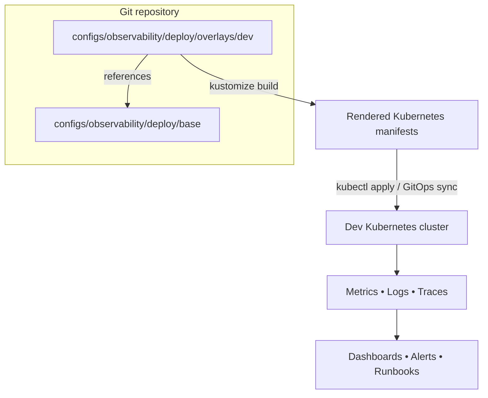

<!-- [KFM_META_BLOCK_V2]
doc_id: kfm://doc/b53ba2a3-eff9-47f6-bba0-2e28c710f17f
title: Observability deploy overlay (dev)
type: standard
version: v1
status: draft
owners: platform-observability (TODO)
created: 2026-02-23
updated: 2026-02-23
policy_label: restricted
related:
  - configs/observability/deploy/base/
  - configs/observability/deploy/overlays/stage/
  - configs/observability/deploy/overlays/prod/
tags: [kfm, observability, kustomize, overlay, dev]
notes:
  - Dev-only deltas for the observability stack. Keep this overlay minimal and reversible.
[/KFM_META_BLOCK_V2] -->

# Observability deploy overlay — dev
Dev environment Kustomize overlay for the **observability** deployment.


---

## Quick navigation
- [Purpose](#purpose)
- [At a glance](#at-a-glance)
- [Directory layout](#directory-layout)
- [Quick start](#quick-start)
- [How this overlay composes](#how-this-overlay-composes)
- [What belongs here](#what-belongs-here)
- [What must not go here](#what-must-not-go-here)
- [What changes in dev](#what-changes-in-dev)
- [Telemetry conventions](#telemetry-conventions)
- [Secrets and sensitive data](#secrets-and-sensitive-data)
- [Troubleshooting](#troubleshooting)
- [Contributing](#contributing)

---

## Purpose
This directory contains **dev-only deltas** for the observability deployment.

**Goal:** keep `deploy/base/` generic and reusable, while this overlay expresses the *minimum* set of differences needed for a dev cluster (resource sizing, retention, endpoints, feature flags, etc.).

> **NOTE**
> This overlay assumes the cluster is already “bootstrapped” with whatever platform prerequisites the observability stack needs (CRDs/operators/storage classes/ingress, etc.). If those prerequisites aren’t present, installation will fail during apply.

[Back to top](#quick-navigation)

---

## At a glance

| Field | Value |
|---|---|
| Environment | `dev` |
| Overlay entrypoint | `configs/observability/deploy/overlays/dev/kustomization.yaml` |
| Base directory | `configs/observability/deploy/base/` |
| Apply (from repo root) | `kubectl apply -k configs/observability/deploy/overlays/dev` |
| Render (no apply) | `kubectl kustomize configs/observability/deploy/overlays/dev` |
| Owners | `platform-observability` (TODO: confirm) |
| Policy label | `restricted` |

[Back to top](#quick-navigation)

---

## Directory layout

> **TIP**
> Update the tree below if files change. Keep the README accurate—docs are part of the production surface.

```text
configs/observability/deploy/
├─ base/                       # shared, environment-agnostic resources (source of truth)
└─ overlays/
   ├─ dev/                     # ✅ this overlay (dev-only deltas)
   │  ├─ kustomization.yaml     # required
   │  ├─ patches/               # recommended: dev patches live here
   │  ├─ components/            # optional: reusable kustomize components (if used)
   │  └─ README.md              # you are here
   ├─ stage/                    # stage overlay (if present)
   └─ prod/                     # prod overlay (if present)
```

[Back to top](#quick-navigation)

---

## Quick start

### 1) Render manifests (recommended before apply)
```bash
# From repo root
kubectl kustomize configs/observability/deploy/overlays/dev > /tmp/observability-dev.yaml

# Optional: inspect
less /tmp/observability-dev.yaml
```

### 2) Diff against the cluster
```bash
kubectl diff -k configs/observability/deploy/overlays/dev || true
```

### 3) Apply to a dev cluster
```bash
kubectl apply -k configs/observability/deploy/overlays/dev
```

### 4) Roll back
Rollback is expected to be **Git-driven**:
- revert the commit that changed this overlay; and/or
- re-sync the previous known-good revision via your GitOps controller.

If you need to remove all resources rendered by this overlay (destructive):
```bash
kubectl delete -k configs/observability/deploy/overlays/dev
```

> **WARNING**
> `kubectl delete -k` will delete everything in the rendered output, including PVCs *if* they’re part of the manifests. Use with care.

[Back to top](#quick-navigation)

---

## How this overlay composes



[Back to top](#quick-navigation)

---

## What belongs here

**Acceptable inputs (dev overlay only):**
- `kustomization.yaml` referencing `../../base` and any dev-only components
- strategic merge patches / JSON6902 patches that:
  - lower resource requests/limits for dev
  - shorten retention windows for dev telemetry storage
  - change dev-only hostnames/ingress/routes
  - enable dev-only debug toggles (where safe)
- dev-only `ConfigMapGenerator` / `SecretGenerator` *references* (never raw secret values)
- namespace overlays *only if* namespace management is owned by this repo (otherwise keep namespace out of app YAML)

[Back to top](#quick-navigation)

---

## What must not go here

**Exclusions:**
- shared “base” resources that apply everywhere (move to `../../base/`)
- cluster bootstrap concerns (CRDs, core ingress controller installs, platform RBAC, etc.)
- raw credentials, API keys, tokens, kubeconfigs, private cert material
- environment-agnostic dashboards or alert rules (put in base; enable/disable via overlay)

[Back to top](#quick-navigation)

---

## What changes in dev

This section describes the *intended* delta pattern. Make sure it matches the actual patch files in this overlay.

| Area | Typical dev delta | How to implement (preferred) |
|---|---|---|
| Compute | reduced CPU/memory requests & limits | patch Deployment/StatefulSet resources |
| Storage | smaller volumes; possibly ephemeral storage | patch PVC sizes / StorageClass |
| Retention | shorter retention (lower cost) | patch config flags / retention params |
| Ingress | dev hostnames and/or no public exposure | patch Ingress/Route + annotations |
| AuthN/Z | dev-only simplifications (never in prod) | patch values; keep defaults secure |
| Sampling | higher sampling (debug) OR lower (cost) | patch OTel collector pipelines |

> **NOTE**
> Keep overlays as deltas: if you find yourself copy/pasting full manifests into `overlays/dev`, that’s usually a smell—move shared state back to `base/` and patch the minimal difference here.

[Back to top](#quick-navigation)

---

## Telemetry conventions

KFM requires **stable identifiers** across telemetry and catalogs so that:
- pipeline runs can be traced in dashboards *and*
- those same runs can be linked to STAC/DCAT/PROV artifacts for governed evidence.

### Canonical keys (OTel ⇄ Prometheus labels)

| Concept | OTel attribute | Prom label | Notes |
|---|---|---|---|
| Run ID | `kfm.job.run_id` | `job_run_id` | UUID/ULID |
| Commit | `kfm.git.commit_sha` | `commit_sha` | 7–40 hex |
| Status | `kfm.job.status` | `status` | `scheduled|running|succeeded|failed|canceled` |
| Started | `kfm.job.started_at` (RFC3339) | `started_at` | also emit unix seconds |
| Ended | `kfm.job.ended_at` (RFC3339) | `ended_at` | also emit unix seconds |
| Dataset | `kfm.dataset.id` | `dataset_id` | STAC/DCAT id |
| Pipeline | `kfm.pipeline.name` | `pipeline` | stable slug |
| Environment | `kfm.env` | `env` | `dev|staging|prod` |

**Dev overlay requirement:** ensure `kfm.env=dev` is emitted consistently by:
- OTel SDK resource attributes (preferred)
- OTel collector processors (fallback)
- relabeling rules in metrics pipeline (if used)

### Catalog linkage expectations
When this overlay deploys/updates telemetry components, ensure the system supports:
- writing run identifiers into STAC Item properties (e.g., `kfm:run_id`, commit SHA, status)
- modeling runs as `prov:Activity` in PROV JSON-LD with timestamps and agents
- joining telemetry dashboards to catalog pages via `dataset_id`

[Back to top](#quick-navigation)

---

## Secrets and sensitive data

> **WARNING**
> Observability data is often sensitive (logs/traces can contain identifiers, payload fragments, or access tokens if upstream apps are misconfigured).

Rules for this overlay:
- **Never** commit raw secret values.
- Prefer external secret mechanisms (vault/external-secrets/sops) *as dictated by platform policy*.
- Don’t enable “public” endpoints in dev unless there is an explicit, reviewed reason.
- Treat dev telemetry storage as **restricted** unless governance says otherwise.

[Back to top](#quick-navigation)

---

## Troubleshooting

### “namespace not found”
- If namespaces are managed by platform admin, this repo may intentionally omit namespace declarations.
- Confirm the target namespace exists and your GitOps controller has permission to deploy into it.

### “no matches for kind … (CRD missing)”
- The cluster likely lacks prerequisite CRDs/operators. Ensure bootstrap/platform configuration is applied *before* this overlay.

### “kustomize build fails”
- Run:
  - `kubectl kustomize configs/observability/deploy/overlays/dev`
  - validate YAML syntax in patches
  - confirm referenced paths exist (e.g., `../../base`)

### “apply succeeds but no telemetry appears”
- Verify endpoints/service discovery and collector/exporter configuration.
- Confirm the canonical keys (above) are being emitted; missing `dataset_id` or `job_run_id` often breaks linking.

[Back to top](#quick-navigation)

---

## Contributing

### Definition of done (overlay changes)
- [ ] `kubectl kustomize configs/observability/deploy/overlays/dev` renders successfully
- [ ] `kubectl diff -k …` looks sane (no unintended deletions)
- [ ] overlay remains **delta-only** (no full manifest duplication without reason)
- [ ] telemetry key conventions are preserved (`kfm.job.run_id`, `kfm.dataset.id`, `kfm.env=dev`, etc.)
- [ ] README updated if behavior or layout changed

### Patch hygiene
- Prefer small, targeted patches with clear filenames:
  - `patch-resources-dev.yaml`
  - `patch-retention-dev.yaml`
  - `patch-ingress-dev.yaml`

<details>
<summary>Appendix: Example overlay skeleton (illustrative)</summary>

```yaml
# kustomization.yaml (example only — adjust to match repo conventions)
apiVersion: kustomize.config.k8s.io/v1beta1
kind: Kustomization

resources:
  - ../../base

patches:
  - path: patches/patch-resources-dev.yaml
  - path: patches/patch-retention-dev.yaml
```

</details>

[Back to top](#quick-navigation)
