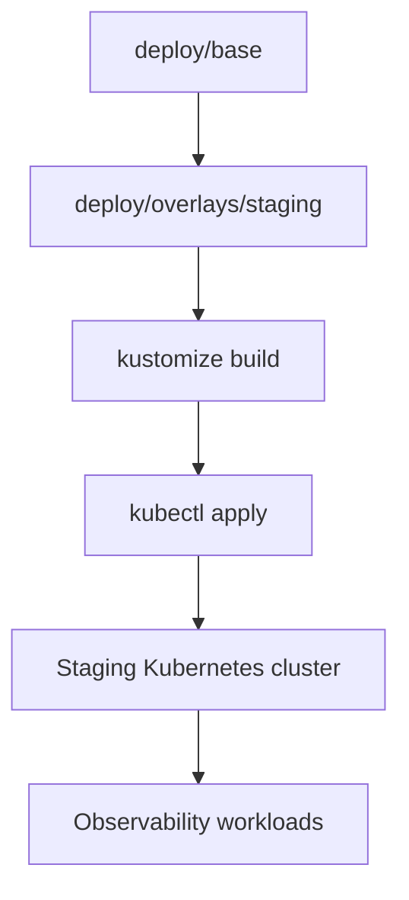

<!-- [KFM_META_BLOCK_V2]
doc_id: kfm://doc/0f4f8b92-1bdb-4e7a-9d21-6f36b8574a7f
title: Observability Staging Overlay
type: standard
version: v1
status: draft
owners: TBD (platform / sre)
created: 2026-02-23
updated: 2026-02-23
policy_label: restricted
related:
  - configs/observability/deploy/base
  - configs/observability/deploy/overlays/prod
tags: [kfm, observability, deploy, kustomize, staging]
notes:
  - Environment-scoped Kustomize overlay. No secrets should be committed here.
  - Update owners/related once repo conventions are confirmed.
[/KFM_META_BLOCK_V2] -->

# Observability Staging Overlay
Deploy-time deltas for the **staging** observability stack (Kustomize overlay).


> ⚠️ **WARNING**
> This overlay is intended for **staging** only. Always verify your Kubernetes context before applying.

---

## Navigation
- [Purpose and scope](#purpose-and-scope)
- [Where this fits](#where-this-fits)
- [Expected directory layout](#expected-directory-layout)
- [Quick start](#quick-start)
- [Overlay contract](#overlay-contract)
- [Promotion gates](#promotion-gates)
- [Security and data handling](#security-and-data-handling)
- [Troubleshooting](#troubleshooting)
- [Appendix](#appendix)

---

## Purpose and scope

This directory contains the **staging** environment overlay for the KFM **observability** deployment.

**What this overlay is for**
- Environment-specific configuration (staging-only deltas) layered on top of a shared base.
- Safe validation of observability changes before production promotion.

**What this overlay is *not* for**
- Long-lived secrets (tokens, passwords, client secrets, kubeconfigs).
- Cluster bootstrap (GitOps controller installation, namespace governance, CRD installs) unless explicitly owned by this layer.

---

## Where this fits

Kustomize overlays are typically used to keep the shared configuration in `base/` and keep only the environment deltas in `overlays/<env>/`.



---

## Expected directory layout

> NOTE
> This is the **expected** layout for a Kustomize overlay. If your repo differs, update this README to match reality.

```text
configs/observability/deploy/
├─ base/                          # shared resources (verify)
└─ overlays/
   ├─ staging/
   │  ├─ README.md                # this file
   │  ├─ kustomization.yaml       # overlay entrypoint (verify)
   │  ├─ patches/                 # staging-only patches (verify)
   │  └─ resources/               # staging-only resources (verify)
   └─ prod/                       # production overlay (verify)
```

---

## Quick start

### Prerequisites
- You have access to the **staging** cluster (kubeconfig is configured).
- Your `kubectl` includes Kustomize support (most modern kubectl versions do).
- You know the intended target namespace for observability in staging.

### Safety check: confirm your cluster context

```bash
kubectl config current-context
kubectl cluster-info
```

If the context is not staging, **stop** and switch contexts before continuing.

### Render manifests (no cluster changes)

```bash
kubectl kustomize configs/observability/deploy/overlays/staging > /tmp/observability-staging.yaml
```

Optional sanity checks you may have available in your tooling:
```bash
# Example: validate schemas if kubeconform is installed
kubeconform -strict /tmp/observability-staging.yaml
```

### Preview changes against the cluster (recommended)

```bash
kubectl diff -k configs/observability/deploy/overlays/staging
```

### Apply to staging

```bash
kubectl apply -k configs/observability/deploy/overlays/staging
```

### Post-deploy smoke checks (examples)

> NOTE
> Replace labels/names with whatever your observability stack actually uses.

```bash
kubectl get pods -A | grep -i observ
kubectl get svc -A | grep -E "grafana|prometheus|loki|tempo|otel|agent" || true
kubectl get ingress -A | grep -i grafana || true
```

---

## Overlay contract

This overlay should contain **only** staging-specific deltas. Common, acceptable deltas include:

- **Replicas / autoscaling**
  - lower replicas than production
  - different HPA thresholds

- **Resources**
  - different CPU/memory requests/limits for staging load profiles

- **Ingress and routing**
  - staging hostnames
  - staging TLS issuers / certificates (but not private keys)

- **Retention**
  - shorter retention windows for logs/metrics/traces in staging

- **Feature flags**
  - enabling/disabling experimental collectors/processors for validation

### Exclusions (default-deny)

Do **not** commit:
- API keys, tokens, passwords, private certificates, client secrets
- raw kubeconfigs
- any data dumps or captured logs/traces that may contain sensitive information

If secrets are required, use a controlled mechanism (examples):
- External Secrets Operator
- sealed secrets / SOPS (organization-dependent)
- GitOps secret integration (organization-dependent)

---

## Promotion gates

Staging is a trust membrane: we only promote changes that have evidence they are safe and reversible.

### Minimum “ready to merge” checks
- [ ] `kustomize build` succeeds for this overlay
- [ ] `kubectl diff -k ...` reviewed (no surprises)
- [ ] No secrets added (grep + code review)
- [ ] Resource changes reviewed for staging capacity
- [ ] Rollback path identified (Git revert or previous manifest snapshot)

### Minimum “ready to promote to prod” checks
- [ ] Staging runs clean for an agreed soak period (TBD by ops policy)
- [ ] Dashboards load and show expected signals (metrics/logs/traces as applicable)
- [ ] Alerts are not noisy (or are intentionally tuned and documented)
- [ ] Any schema/CRD changes validated for prod compatibility

---

## Security and data handling

Observability pipelines often ingest sensitive data (PII in logs, internal topology, request metadata). Staging does not automatically mean “safe.”

**Guardrails**
- Apply least-privilege RBAC for observability UIs and APIs.
- Prefer redaction/scrubbing at collection time (collect less; don’t “fix it later”).
- Keep staging retention short unless explicitly justified.
- Avoid exposing observability UIs publicly; require auth and (where possible) network restrictions.

> WARNING
> If you are unsure whether a dataset/signal is sensitive, **default-deny** exposure and flag for governance review.

---

## Troubleshooting

### “kustomization.yaml not found”
- Confirm you are applying the correct path:
  - `configs/observability/deploy/overlays/staging`
- Confirm the overlay has an entrypoint file:
  - `kustomization.yaml` (expected)

### “resource mapping not found / CRD missing”
- Your cluster may be missing required CRDs (common for Prometheus Operator / OpenTelemetry / etc).
- Resolve at the cluster bootstrap layer (not usually inside an app overlay), unless your governance says otherwise.

### “diff shows changes in unexpected namespaces”
- Overlays should not silently override namespace governance.
- Confirm whether namespace is set in overlay and whether that’s desired.

---

## Appendix

### Template: overlay intent checklist (copy/paste into PR)

```text
Overlay: configs/observability/deploy/overlays/staging

Intent:
- What changed:
- Why (link to issue/ADR if available):
- Expected effect in staging:
- Rollback plan:

Evidence:
- kustomize build: ✅/❌
- kubectl diff reviewed: ✅/❌
- smoke checks: ✅/❌
- notes/screenshots/logs (no sensitive data):
```

### Template: minimal kustomization.yaml skeleton (example)

> NOTE
> This is an example skeleton only. Update to match your actual base/patch layout.

```yaml
apiVersion: kustomize.config.k8s.io/v1beta1
kind: Kustomization

# namespace: observability-staging   # set only if namespace governance allows it

resources:
  - ../../base

# patchesStrategicMerge:
#   - patches/some-staging-patch.yaml

# images:
#   - name: your-image
#     newTag: staging-<gitsha>
```

---

_Back to top:_ [↑](#observability-staging-overlay)
