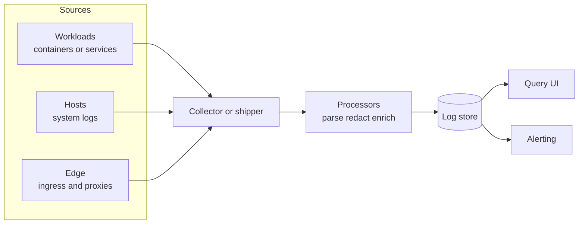

<!-- [KFM_META_BLOCK_V2]
doc_id: kfm://doc/1c353fea-0e15-4ce2-acb0-016ea2413a24
title: Observability Logs Configs
type: standard
version: v1
status: draft
owners: TODO(platform-observability)
created: 2026-02-23
updated: 2026-02-23
policy_label: restricted
related:
  - TODO(link to observability overview doc)
tags: [kfm, observability, logs, config]
notes:
  - This README is intentionally tool-agnostic until the log shipper/store are confirmed in-repo.
  - Treat all logs as potentially sensitive; follow redaction + retention gates before promotion.
[/KFM_META_BLOCK_V2] -->

# Observability Logs Configs
Configuration and conventions for collecting, processing, storing, and querying logs across the KFM system.


<!-- TODO: Replace badges with repo-specific CI/status once known -->

---

## Quick navigation
- [Purpose](#purpose)
- [Where this fits in the repo](#where-this-fits-in-the-repo)
- [Directory layout](#directory-layout)
- [Configuration contract](#configuration-contract)
- [Redaction and safety gates](#redaction-and-safety-gates)
- [Retention and access policy](#retention-and-access-policy)
- [How to make changes](#how-to-make-changes)
- [Validation and CI gates](#validation-and-ci-gates)
- [Troubleshooting](#troubleshooting)
- [Appendix](#appendix)

---

## Purpose
This directory contains **log observability configuration** (not application code):

- **Collection**: how logs are captured from workloads and hosts (stdout, files, journald, etc.).
- **Processing**: parsing, enrichment, sampling, and **redaction**.
- **Routing**: how logs are forwarded to one or more backends.
- **Contract**: a minimal schema and conventions so logs are searchable, correlatable, and governed.

> WARNING: Logs often contain sensitive data (PII, secrets, location hints, or operational details).  
> Treat all logs as **restricted** by default unless governance explicitly marks a subset as public.

[Back to top](#observability-logs-configs)

---

## Where this fits in the repo
**Layer:** Infrastructure / Interfaces (contracts + policy + adapters)

This folder is expected to be consumed by one of the deployment mechanisms used by the repo (examples: Helm, Kustomize, Terraform, Ansible, or platform-specific deployment code). The exact consumer is **unknown here**; this README defines **the contract and guardrails** so different deployment paths can stay consistent.

[Back to top](#observability-logs-configs)

---

## Directory layout
The repo’s exact contents may vary, but this directory should stay organized around **pipelines** and **policy**.

### Expected layout
```text
configs/observability/logs/                           # Log observability: pipelines + processors + sinks + schemas
├─ README.md                                          # Scope, supported tools, redaction rules, and validation workflow
│
├─ pipelines/                                         # End-to-end pipelines (shipper → processors → sinks)
│  └─ <tool-name>/                                    # e.g., otelcol/, vector/, fluentbit/, promtail/, filebeat/
│     └─ …                                            # Tool-specific pipeline configs + deploy wiring
│
├─ processors/                                        # Reusable processing steps (shared across pipelines)
│  ├─ parsing/                                        # Parsing rules (JSON/grok/regex), field extraction, normalization
│  ├─ redaction/                                      # Secret/PII filters, allow/deny lists, hashing/tokenization rules
│  └─ enrichment/                                     # Metadata enrichment (env/region/service/build/host mapping)
│
├─ sinks/                                             # Backend routing targets (storage/query systems)
│  └─ <sink-name>/                                    # e.g., loki/, elastic/, cloudwatch/, s3/
│     └─ …                                            # Sink configs (routing, retention hints, index/labels mapping)
│
├─ schemas/                                           # Structured log schemas (when applicable)
│  └─ events/                                         # Event schemas (JSONSchema or equivalent) for log envelope shapes
│
├─ examples/                                          # Sample configs + sample log lines (synthetic; safe)
│  └─ …                                               # Minimal “known-good” examples used by docs/tests
│
└─ tests/                                             # Lightweight validation (lint, schema checks, sample replays)
   └─ …                                               # Tool validate scripts + redaction assertions + fixtures
```

### Acceptable inputs (what belongs here)
- Configuration files for log shippers/collectors and their processors (YAML/TOML/CONF/etc.)
- Parsing rules, redaction rules, and field mapping/enrichment rules
- Environment overlays (dev/stage/prod) **as config**, not as prose
- Minimal fixtures for validation (sample log lines, schema samples, golden outputs)

### Exclusions (what must not go here)
- Application code (belongs in service repos/modules)
- Secrets (tokens, passwords, private keys), even in “examples”
- Environment-specific credentials (use secret managers/CI variables instead)
- “One-off” debug configs that bypass redaction/retention gates

[Back to top](#observability-logs-configs)

---

## Logging architecture


**Design intent:**
- Logs move through an explicit **policy boundary** (processors) before storage.
- Downstream systems must be able to correlate logs with **metrics/traces** via shared fields.

[Back to top](#observability-logs-configs)

---

## Configuration contract
This is the minimum contract to keep logging consistent across stacks.

### Event shape
Prefer **structured logs** (JSON per line) where feasible.

**Recommended fields**
| Field | Type | Why it matters |
|---|---:|---|
| `timestamp` | string (RFC3339/ISO-8601) | reliable ordering + queries |
| `level` | string | filtering + alert rules |
| `message` | string | human-readable explanation |
| `service.name` | string | primary grouping for queries |
| `service.version` | string | correlate to deploy/build |
| `env` | string | dev/stage/prod segmentation |
| `trace_id` | string | log ↔ trace correlation |
| `span_id` | string | pinpoint trace span |
| `host.name` | string | infra diagnosis |
| `k8s.namespace` / `pod` | string | workload attribution (if applicable) |
| `request.id` | string | request-level correlation (if available) |

> NOTE: If your stack supports OpenTelemetry semantic conventions, align names to those conventions.
> If not, keep a deterministic mapping in `processors/enrichment/`.

### Naming conventions
- Use **lowercase** keys where possible; avoid spaces.
- Prefer dotted namespaces for structured keys (e.g., `service.name`, `http.status_code`).
- Avoid embedding large blobs (full HTML, full payloads) unless explicitly approved.

### Correlation rules
- If traces exist, always attempt to include `trace_id` + `span_id`.
- If traces do not exist, include a deterministic `request.id` / `correlation.id`.

[Back to top](#observability-logs-configs)

---

## Redaction and safety gates
**Default-deny**: if you are not sure whether a field is sensitive, treat it as sensitive.

### Required rules
- **Never log secrets**: passwords, tokens, API keys, session cookies, private keys.
- **Minimize PII**: names, emails, phone numbers, government IDs.
- **Location handling**: if logs include coordinates or sensitive site identifiers, **coarsen** or remove unless policy explicitly allows precision.

### Recommended processor order
1. **Parse** (extract structured fields)
2. **Normalize** (rename fields into contract)
3. **Redact** (drop/replace/hash sensitive fields)
4. **Enrich** (add env/service/build metadata)
5. **Route** (send to sinks based on labels)

### Redaction patterns
Store patterns in a dedicated file (example path): `processors/redaction/patterns.(yaml|toml|json)`

Minimum pattern categories:
- secrets/token-like strings
- email/phone-like strings
- auth headers/cookies
- structured PII keys (e.g., `email`, `ssn`, `dob`, etc.)

> WARNING: Do not rely on UI-level access control as your only safety net.  
> Redaction must happen **before** logs reach long-term storage.

[Back to top](#observability-logs-configs)

---

## Retention and access policy
Retention and access are policy decisions; do not hardcode defaults without governance approval.

### Suggested policy table (edit to match governance)
| Class | Examples | Default access | Default retention |
|---|---|---|---|
| Operational (non-sensitive) | service health, timings | engineering | TODO |
| Operational (restricted) | infra details, partial identifiers | on-call + SRE | TODO |
| Sensitive | PII risk, auth context | tightly scoped | TODO |

**Access control guidelines**
- Follow least privilege (role-based access to query UI + backend).
- Separate environments (dev/stage/prod) at the index/tenant level where possible.

[Back to top](#observability-logs-configs)

---

## How to make changes
### Change checklist
- [ ] Identify whether the change impacts **parsing**, **redaction**, or **routing**
- [ ] Add/adjust **fixtures** in `examples/` (sample log lines)
- [ ] Update or add **tests** in `tests/` (lint, schema, sample replay)
- [ ] Verify no secrets/PII are introduced (including in examples)
- [ ] Ensure change is reversible (small diff, clear rollback)

### Recommended commit hygiene
- Keep changes scoped: one pipeline or one processor at a time.
- Include “before/after” sample outputs in PR description (sanitized).

[Back to top](#observability-logs-configs)

---

## Validation and CI gates
These gates should fail closed when possible.

### Minimum gates (recommended)
- **Lint**: YAML/TOML/CONF formatting checks
- **Schema**: validate structured log samples against `schemas/` (if present)
- **Safety**: scan for accidental secrets in this directory (including examples)
- **Dry-run**: replay sample logs through processors and compare to golden output (if tooling supports it)

### Example local commands (adapt to repo tooling)
```bash
# Lint configs (example)
# TODO: replace with repo-standard linter commands
make lint-observability-logs

# Run log pipeline validation against fixtures
make test-observability-logs
```

[Back to top](#observability-logs-configs)

---

## Troubleshooting
### Symptoms → likely causes
| Symptom | Likely cause | First check |
|---|---|---|
| Logs missing for a service | collector not scraping source | workload log source + pipeline routing |
| Logs present but unsearchable | parsing failed / fields inconsistent | parsing rules + field mapping |
| Sensitive strings showing up | redaction order wrong or patterns incomplete | redaction processor + patterns |
| Duplicated logs | multiple collectors shipping same source | source selection + dedupe keys |

### Minimal debug workflow
1. Confirm the log exists at the source (container stdout, file, journald)
2. Confirm the shipper is reading the source (agent status)
3. Confirm parsing output on a single sample line
4. Confirm redaction output on the same line
5. Confirm sink routing labels/streams

[Back to top](#observability-logs-configs)

---

## Appendix
<details>
<summary><strong>Sample structured log line</strong></summary>

```json
{
  "timestamp": "2026-02-23T18:40:12.123Z",
  "level": "INFO",
  "message": "request completed",
  "service.name": "example-service",
  "service.version": "1.2.3",
  "env": "prod",
  "request.id": "01J0EXAMPLEID",
  "trace_id": "4bf92f3577b34da6a3ce929d0e0e4736",
  "span_id": "00f067aa0ba902b7",
  "http.method": "GET",
  "http.route": "/healthz",
  "http.status_code": 200,
  "duration_ms": 12
}
```

</details>

<details>
<summary><strong>Redaction decision record template</strong></summary>

Use this template in PR descriptions (or a repo-standard ADR format if present).

- **What changed**:
- **Why**:
- **Sensitive fields affected**:
- **Redaction strategy** (drop / mask / hash / tokenize):
- **Residual risk**:
- **Rollback plan**:

</details>
