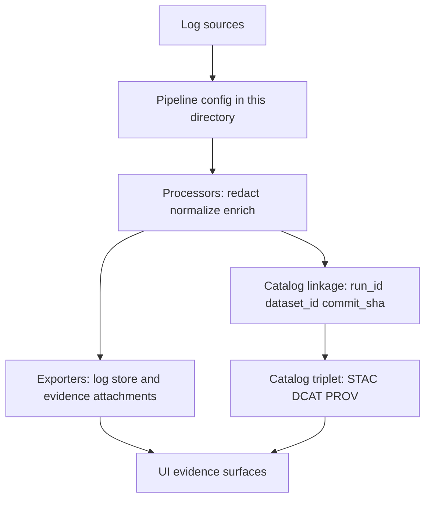

<!-- [KFM_META_BLOCK_V2]
doc_id: kfm://doc/e8068443-04e8-4fb3-b723-f3a3c9c3dd89
title: Logs pipeline configs
type: standard
version: v1
status: draft
owners: kfm-platform (TODO: confirm CODEOWNERS)
created: 2026-02-23
updated: 2026-02-23
policy_label: restricted
related:
  - kfm://pattern/OBSERVABILITY-OTEL-MAPPINGS (TODO: confirm canonical id)
  - kfm://doc/<repo-layout-and-governance-guide> (TODO)
tags:
  - kfm
  - observability
  - logs
  - pipelines
  - configs
notes:
  - Directory README. Update “Current directory contents” once pipelines land.
[/KFM_META_BLOCK_V2] -->

# Logs pipeline configs
Declarative, version-controlled log pipelines (collect → redact → enrich → export) for KFM runtimes.


**Path:** `configs/observability/logs/pipelines/`

---

## Quick navigation
- [Purpose](#purpose)
- [Where this fits](#where-this-fits)
- [What belongs here](#what-belongs-here)
- [What must not go here](#what-must-not-go-here)
- [Telemetry contract](#telemetry-contract)
- [Governance and safety](#governance-and-safety)
- [Definition of Done](#definition-of-done-for-a-new-or-changed-pipeline)
- [Directory layout](#directory-layout)
- [Assumptions and open questions](#assumptions-and-open-questions)
- [Minimum verification steps](#minimum-verification-steps)
- [Appendix](#appendix-examples-and-snippets)

---

## Purpose
This directory is the **single place** for log pipeline configurations that:
1. **Standardize run identity** across logs/metrics/traces/catalogs.
2. **Prevent sensitive leakage** (PII/secrets) by redaction at ingestion.
3. **Make runs auditable** (deterministic configs; verifiable promotion evidence).
4. **Support “evidence surfaces”** (UI + Focus Mode) by ensuring logs are linkable to receipts/manifests.

> [!NOTE]
> This README documents **cross-cutting invariants**. Tool-specific details (e.g., OpenTelemetry Collector vs Vector vs Fluent Bit) should live in subfolders once the owning tool is confirmed.

[Back to top](#quick-navigation)

---

## Where this fits
These configs sit in the **observability stack** and serve both:
- **Runtime debugging & SRE** (what happened, when, and why)
- **Governed provenance** (linking a pipeline run to its receipts/artifacts/catalog entries)

### Conceptual flow


[Back to top](#quick-navigation)

---

## What belongs here
✅ **Allowed inputs**
- Collector/agent/router configs for logs (YAML/JSON/TOML as dictated by the chosen tool).
- Pipeline fragments/modules (if supported) that compose into deployable configs.
- Test fixtures for logs (small, synthetic `.jsonl` / `.log` samples) used to validate:
  - redaction
  - required labels/attributes
  - routing behavior
- CI-facing validation harnesses **if they are strictly pipeline-config focused** (lint scripts, schema checks, fixture tests).

[Back to top](#quick-navigation)

---

## What must not go here
🚫 **Exclusions (default-deny)**
- **Secrets** (tokens, passwords, API keys, cookie values, private endpoints).
- **Production credentials** or any env-specific secret material (use secret manager / runtime injection).
- Dashboards, alert rules, and SLOs (put those in their designated observability/monitoring directories).
- Raw incident logs or exported log dumps (store as governed evidence artifacts under the evidence/logs retention model, not in git).

> [!WARNING]
> Treat pipeline configs as potentially sensitive. Even a “harmless” exporter URL can become an internal topology leak.

[Back to top](#quick-navigation)

---

## Telemetry contract
KFM’s observability pattern standardizes **canonical identifiers** so a single pipeline run can be traced across:
- logs (events)
- metrics (Prom/Mimir labels)
- traces (Tempo spans)
- catalogs (STAC/DCAT/PROV)

### Required canonical keys
These keys MUST be present (as OTel attributes / resource attrs) **and** mapped consistently to metrics labels where applicable:

| Semantic meaning | Canonical OTel attribute | Prom label | Notes |
|---|---|---|---|
| Run ID | `kfm.job.run_id` | `job_run_id` | UUID/ULID |
| Commit SHA | `kfm.git.commit_sha` | `commit_sha` | 7–40 hex |
| Status | `kfm.job.status` | `status` | `scheduled \| running \| succeeded \| failed \| canceled` |
| Started | `kfm.job.started_at` | `started_at` | RFC3339 string; also emit unix seconds |
| Ended | `kfm.job.ended_at` | `ended_at` | RFC3339 string; also emit unix seconds |
| Dataset ID | `kfm.dataset.id` | `dataset_id` | STAC/DCAT id |
| Pipeline name | `kfm.pipeline.name` | `pipeline` | stable slug |
| Environment | `kfm.env` | `env` | `dev \| staging \| prod` |

**Timestamp rule:** emit timestamps twice (RFC3339 for traces/catalog metadata, unix seconds for Prom math).

### Catalog linkage expectations
When a run produces publishable outputs, the **same identifiers** are written into catalog artifacts:
- STAC Item properties should include run identifiers (e.g., `kfm:run_id`, commit sha, status).
- PROV JSON-LD should model the run as a `prov:Activity`, with times and associated agents.
- `dataset_id` is used as the join key from telemetry dashboards to catalog pages (including Focus Mode).

[Back to top](#quick-navigation)

---

## Governance and safety
### Determinism and integrity
Configs are part of the provenance chain; treat them like production contracts.

**Required practices**
- Canonicalize configs **before hashing** (stable key ordering; minified JSON/YAML) to avoid false diffs.
- Pin container image digests in CI when building predicates/attestations for reproducibility.
- Store attestation bundle URIs in STAC/DCAT/PROV so downstream users can find proofs.
- Gate promotion/publish on attestation verification (`verify-attestation` must pass).

### Privacy and sensitive data
Pipeline logs can become a policy incident if they capture personal data.

**Minimum posture**
- Redact at ingestion (before export).
- Apply retention + access controls appropriate to `policy_label`.
- Prefer structured logging + explicit allowlists over “log everything.”

[Back to top](#quick-navigation)

---

## Definition of Done for a new or changed pipeline
- [ ] Pipeline config validates with the owning tool (syntax + schema).
- [ ] Redaction is demonstrably active (fixture test or dry-run output proves secrets/PII removed).
- [ ] Required canonical keys are present and correctly populated.
- [ ] Environment is explicit (`kfm.env`) and correct.
- [ ] Config is canonicalized (format is stable; no noisy diffs).
- [ ] Any publish/promotion step is attested and **verification is enforced**.
- [ ] This README’s “Current directory contents” section updated with new files + purpose.

[Back to top](#quick-navigation)

---

## Directory layout
### Current directory contents
> **Unknown in this context** — update this section after the first pipeline config lands.

```
configs/observability/logs/pipelines/
  README.md
  # TODO: list actual pipeline config files here
```

### Recommended layout (proposed)
```
configs/observability/logs/pipelines/                 # Log pipeline configs (parse → enrich → redact → route)
├─ README.md                                          # What pipelines do, naming rules, and how CI validates/redaction
│
├─ pipelines/                                         # Deployable pipeline configs (runtime artifacts)
│  └─ <pipeline>.yaml                                 # One pipeline per file (or approved modular scheme)
│
├─ fixtures/                                          # Synthetic samples for regression tests (JSONL log lines)
│  └─ <pipeline>.sample.jsonl                         # Sample input lines used by tests (no secrets; deterministic)
│
└─ tests/                                             # Lightweight validation (config-only; fail-fast)
   ├─ README.md                                       # How tests run + expected failure modes
   ├─ <tool>_validate.sh                              # Runs tool’s built-in config validation (syntax + wiring)
   └─ redact_assertions.py                            # Asserts known secret patterns never survive the pipeline
```

[Back to top](#quick-navigation)

---

## Assumptions and open questions
**Assumptions (not yet confirmed in repo)**
- A single “owning tool” exists for logs collection (OTel Collector / Vector / Fluent Bit / other).
- CI has (or will have) a gate to validate pipeline configs.
- Pipeline runs are linked to receipts/manifests and ultimately to STAC/DCAT/PROV.

**Open questions**
- Which config format(s) are authoritative (YAML vs JSON vs multiple)?
- Where do we store exporter endpoint allowlists (policy vs config)?
- Where is the governed retention policy for logs enforced (storage layer vs API vs both)?

[Back to top](#quick-navigation)

---

## Minimum verification steps
To convert “Unknown” → “Confirmed” for this directory:
1. **List actual files**: `git ls-tree --name-only HEAD configs/observability/logs/pipelines`
2. **Identify owning tool**: find deployment manifests referencing these configs (Helm/Kustomize/Argo/etc).
3. **Check CI gates**: locate workflow steps that validate these configs.
4. **Confirm canonical keys enforcement**: search configs/tests for `kfm.job.run_id` and friends.
5. **Confirm redaction behavior**: run a fixture through the pipeline locally in dry-run mode and verify outputs.

[Back to top](#quick-navigation)

---

## Appendix: examples and snippets
> All examples below are **illustrative**. Replace with tool-specific, repo-approved versions.

<details>
<summary><strong>Example: required keys checklist for reviewers</strong></summary>

- Does the config inject/propagate `kfm.job.run_id`?
- Does it set `kfm.pipeline.name` to a stable slug (not a host/pod name)?
- Does it populate `kfm.env` from an explicit environment value?
- Does redaction happen before any exporter?
- Are timestamps available as both RFC3339 and unix seconds (where relevant)?

</details>

<details>
<summary><strong>Example: safe redaction “deny patterns” list</strong></summary>

- Authorization headers
- Cookies
- Query params named `token`, `key`, `secret`, `password`
- Email addresses and phone-like patterns (if policy requires)
- Precise coordinates (if logs ever contain user-submitted locations)

</details>
