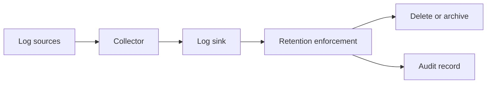

<!-- [KFM_META_BLOCK_V2]
doc_id: kfm://doc/7f3a1b7a-6a4f-4d8f-8a58-52c9b0b0e4e9
title: Log Retention Configs
type: standard
version: v1
status: draft
owners: TODO: Observability/SRE owners
created: 2026-02-23
updated: 2026-02-23
policy_label: restricted
related:
  - TODO: link to repo policy doc for logging/retention
  - TODO: link to observability root README
tags: [kfm, observability, logs, retention]
notes:
  - This directory defines retention rules for log storage backends. It is policy-driven and must remain auditable and reversible.
[/KFM_META_BLOCK_V2] -->

# Log Retention Configs
**Purpose:** Govern how long logs are retained (hot/warm/cold), by log class and sensitivity, across environments—so cost, privacy, and compliance stay aligned.


---

## Quick navigation
- [What belongs here](#what-belongs-here)
- [Directory layout](#directory-layout)
- [Retention policy model](#retention-policy-model)
- [Change process](#change-process)
- [Validation and promotion gates](#validation-and-promotion-gates)
- [Examples](#examples)
- [FAQ](#faq)
- [Appendix](#appendix)

---

## What belongs here

This directory is the **policy-to-implementation bridge** for log retention. It should contain **machine-readable retention declarations** and any **backend-specific retention configs** required to enforce them.

### Acceptable inputs
- Retention policy declarations (YAML/JSON) with:
  - log class (e.g., `app`, `access`, `audit`, `security`, `infra`)
  - environment scope (e.g., `dev`, `stage`, `prod`)
  - TTL / retention window (days) and/or lifecycle phases (hot/warm/cold)
  - ownership + justification + policy reference(s)
  - effective date and change ticket reference
- Backend implementation artifacts (examples; choose what matches your stack):
  - index lifecycle policies (ILM/ISM style)
  - bucket lifecycle rules (archive/delete)
  - log-sink retention settings (built-in retention knobs)
  - Helm values overlays / Terraform modules / Kustomize patches used to apply retention

### Exclusions
**Do not** put these here:
- Secrets (API keys, credentials, tokens)
- Raw log data
- Collector configs unrelated to retention (parsers, pipelines, transforms)
- Redaction rules (unless your repo explicitly co-locates them and you can justify it)
- One-off emergency overrides without an audit trail

> WARNING  
> Retention is not a substitute for **redaction**. If logs can contain sensitive location details (e.g., coordinates for vulnerable sites) or PII, that data must be handled upstream (redaction/minimization) and access-controlled. Retention only limits *duration*, not *exposure*.

[Back to top](#quick-navigation)

---

## Directory layout

> NOTE  
> The exact subfolders below are a **recommended** layout. If this repo already has a different convention, prefer the repo convention and adjust this README accordingly.

```text
configs/observability/logs/retention/
  README.md                         # this file (contract for the directory)
  policy/                           # human-reviewable retention declarations (source of truth)
    retention.policy.v1.yaml
    retention.policy.v1.schema.json
  backends/                         # backend-specific enforcement configs
    <backend-name>/                 # e.g., loki/, opensearch/, elasticsearch/, cloudwatch/, etc.
  env/                              # environment overlays (dev/stage/prod)
    dev/
    stage/
    prod/
  tests/                            # schema + policy gate tests (fail closed)
    README.md
```

[Back to top](#quick-navigation)

---

## Retention policy model

Retention rules must be:
- **Policy-driven:** every rule cites a policy section / requirement.
- **Traceable:** every change links to a ticket/PR and includes a rationale.
- **Deterministic:** conflict resolution is explicit (no “it depends” at runtime).
- **Fail-closed:** unknown log classes or missing metadata default to **shortest retention** and **restricted access** until classified.

### Conceptual flow



### Policy fields (minimum)

A retention rule **must** carry enough metadata to support governance review:

| Field | Required | Why it exists |
|------|----------|---------------|
| `log_class` | ✅ | Ensures retention matches risk/value (e.g., audit vs app debug) |
| `environment` | ✅ | Prevents “prod rules” leaking into dev or vice versa |
| `ttl_days` or `lifecycle` | ✅ | The actual retention behavior |
| `owner` | ✅ | Accountability (who can explain the rule later) |
| `justification` | ✅ | Business/ops reason, not “because we always did” |
| `policy_refs` | ✅ | Traceability to governance requirements |
| `effective_from` | ✅ | Deterministic rollout and audits |
| `change_ref` | ✅ | Ticket/PR/ADR identifier for reversibility |

[Back to top](#quick-navigation)

---

## Change process

### 1) Make the smallest reversible change
- Prefer **narrow overrides** (one log class, one environment) over global changes.
- Include rollback instructions (e.g., “revert TTL from 90 → 30 days”).

### 2) Update policy first, backend second
1. Edit the policy declaration under `policy/`
2. Regenerate/adjust backend enforcement configs (if applicable)
3. Run validations (schema + policy gates)
4. Open PR with audit-ready metadata

### 3) PR checklist (Definition of Done)
- [ ] Rule includes: owner, justification, policy_refs, effective_from, change_ref
- [ ] Rule is environment-scoped (or explicitly global with rationale)
- [ ] TTL/lifecycle is within policy bounds (min/max) for the log class
- [ ] No retention *increase* without explicit compliance/privacy review notes
- [ ] No retention *decrease* for audit/security logs without security sign-off notes
- [ ] Backends updated (or explicitly “policy-only” change)
- [ ] Tests/validators pass
- [ ] Rollback steps documented

[Back to top](#quick-navigation)

---

## Validation and promotion gates

Retention is a governance surface. Treat changes as “production behavior changes”.

**Recommended gates (automate in CI):**
1. **Schema validation** for policy files (JSONSchema)
2. **Policy lint**:
   - required fields present
   - TTL days are integers and within allowed ranges
   - no overlapping selectors without explicit precedence
3. **Diff guardrails**:
   - flag TTL increases over a threshold for manual review
   - flag removal of audit/security retention protections
4. **Backend conformance**:
   - backend configs match policy intent (as best as your tooling allows)

> TIP  
> Encode “fail closed” behavior: if policy can’t be parsed, do not deploy retention changes.

[Back to top](#quick-navigation)

---

## Examples

### Example policy file (v1)

```yaml
# policy/retention.policy.v1.yaml
version: v1
defaults:
  # Default retention is intentionally conservative.
  # Adjust only after governance review.
  ttl_days: 30

rules:
  - id: prod-audit-extended
    log_class: audit
    environment: prod
    ttl_days: 180
    owner: "TODO: team or oncall rotation"
    justification: "Meets operational audit needs and required retention window."
    policy_refs:
      - "TODO: kfm://policy/logs#audit-retention"
    effective_from: "2026-02-23"
    change_ref: "TODO: PR-#### or TICKET-####"

  - id: dev-debug-short
    log_class: app
    environment: dev
    selector:
      level: debug
    ttl_days: 7
    owner: "TODO"
    justification: "Reduce cost/noise; dev debug is high-volume and low long-term value."
    policy_refs:
      - "TODO: kfm://policy/logs#cost-control"
    effective_from: "2026-02-23"
    change_ref: "TODO"
```

### Example precedence rule (recommended)

If multiple rules match, apply:
1. **Most specific environment** (env-specific beats global)
2. **Most specific selector** (more fields beats fewer fields)
3. **Lowest ttl** wins **unless** a rule is explicitly marked `priority: high`

Document your precedence in code/tests so it can’t drift.

[Back to top](#quick-navigation)

---

## FAQ

### Why do we treat retention as “governed config”?
Because retention directly impacts:
- incident response capability (too short loses evidence)
- privacy exposure surface (too long increases risk)
- cost and performance (high-volume logs can explode storage)

### What if we don’t know the log class/sensitivity yet?
Default-deny behavior:
- classify as `unknown`
- apply shortest retention
- restrict access
- file a ticket to classify and update policy

### Does retention guarantee deletion everywhere?
Not automatically. Retention must be enforced **in the backend** (index lifecycle/bucket lifecycle/sink settings) and verified. The policy file is the “intent”; backend config is the “mechanism”.

[Back to top](#quick-navigation)

---

## Appendix

### Glossary
- **TTL**: Time-to-live; how long logs remain available before deletion/archival.
- **Lifecycle**: Multi-phase storage policy (hot/warm/cold/archive/delete).
- **Legal hold**: A retention override to preserve evidence. Must be explicit, time-bound, and approved.

### Template: new rule
```yaml
- id: <unique-rule-id>
  log_class: <app|access|audit|security|infra|unknown>
  environment: <dev|stage|prod|global>
  selector: {} # optional filter (labels, namespaces, level, component)
  ttl_days: <int>
  owner: "<team>"
  justification: "<why this is needed>"
  policy_refs: ["<policy ref>"]
  effective_from: "YYYY-MM-DD"
  change_ref: "<ticket/pr>"
```
