<!--
[KFM_META_BLOCK_V2]
doc_id: kfm://doc/f0802457-59de-47ed-a47e-e4285cbee09b
title: configs/pipelines
type: standard
version: v1
status: draft
owners: kfm-platform (assign CODEOWNERS)
created: 2026-02-22
updated: 2026-02-22
policy_label: internal
tags:
  - kfm
  - pipelines
  - promotion-contract
  - provenance
notes:
  - Contract-first configuration for dataset-family pipelines. Code lives elsewhere.
[/KFM_META_BLOCK_V2]
-->

# configs/pipelines

Contract-first pipeline configuration for **KFM dataset ingestion → validation → promotion → publication**.

**Status:** `draft` · **Owners:** `kfm-platform` (TBD) · **Policy:** `internal` · **Last updated:** `2026-02-22`  
**Badges:** `config-as-code` · `fail-closed` · `promotion-contract` · `evidence-first`

---

## Navigation

- [What lives here](#what-lives-here)
- [Conceptual data flow](#conceptual-data-flow)
- [Recommended layout](#recommended-layout)
- [Minimal pipeline blueprint](#minimal-pipeline-blueprint)
- [Data lifecycle zones](#data-lifecycle-zones)
- [Promotion Contract gates](#promotion-contract-gates)
- [Controlled vocabularies](#controlled-vocabularies)
- [Hash drift prevention](#hash-drift-prevention)
- [How to add or change a pipeline](#how-to-add-or-change-a-pipeline)
- [CI expectations](#ci-expectations)
- [Security and governance defaults](#security-and-governance-defaults)
- [Glossary](#glossary)
- [Appendix templates](#appendix-templates)

---

## What lives here

This folder is the **configuration boundary** for ingestion + promotion pipelines.

### Purpose

- Provide a **predictable, reviewable contract** per dataset family (pipeline specs, schemas, QA rules, catalog templates).
- Make governance enforceable by CI: **license-first, sensitivity-aware, fail-closed promotion**.
- Enable reproducible evidence: every promoted dataset version is backed by **artifacts + catalogs + provenance**.

### Non-goals

- Pipeline code typically lives under `src/pipelines/` (reference layout) or `tools/` — **not** here.
- This directory is **not** a place to store large raw or processed datasets.

> NOTE  
> Treat pipeline configs as governed artifacts: changes can affect what becomes citable in Map/Story/Focus surfaces.

[Back to top](#configspipelines)

---

## Conceptual data flow

```mermaid
flowchart LR
  A[Upstream sources] --> B[Connectors: fetch/snapshot]
  B --> C[RAW zone<br/>immutable + checksums]
  C --> D[WORK / QUARANTINE<br/>normalize + QA + redaction candidates]
  D --> E[PROCESSED zone<br/>publishable artifacts + checksums]
  E --> F[CATALOG/TRIPLET<br/>DCAT + STAC + PROV + run receipts]
  F --> G[Index builders<br/>db/search/graph/tiles]
  G --> H[Governed API<br/>policy + evidence resolver]
  H --> I[UI surfaces<br/>Map + Story + Focus]
```



**Key rule:** promotion is evidence-producing, not “just ETL”.

[Back to top](#configspipelines)

---

## Recommended layout

Recommended directory structure (one subfolder per dataset family / pipeline):

```text
configs/pipelines/
  README.md
  <dataset_slug>/                     # e.g., noaa_ncei_storm_events
    pipeline.yaml                     # orchestration + I/O plan
    spec.json                         # canonical spec input for spec_hash (recommended)
    schemas/                          # normalized schema contracts
    qa/                               # validation rules + drift thresholds
    dcat/                             # DCAT dataset + distribution templates (JSON-LD)
    stac/                             # STAC collection + item templates (JSON)
    prov/                             # PROV templates + emitted run outputs
    graph/                            # optional: graph mapping rules
    fixtures/                         # tiny sample inputs for CI
    expected/                         # golden outputs for CI (catalog snippets, QA reports)
```

> WARNING  
> Keep fixtures small. Anything large belongs in object storage (RAW/WORK/PROCESSED), not git.

[Back to top](#configspipelines)

---

## Minimal pipeline blueprint

Every dataset family should ship a predictable “blueprint” so review and automation are uniform.

| File/folder | Required | What it does |
|---|:---:|---|
| `pipeline.yaml` | ✅ | Declares inputs, outputs, schedule/cadence, resources, and the promotion plan. |
| `spec.json` | ✅ (recommended) | Canonical spec used to compute `spec_hash` and derive a stable `dataset_version_id`. |
| `schemas/` | ✅ | Normalized table/asset schemas (machine-validated). |
| `qa/` | ✅ | QA checks + drift thresholds; defines what fails promotion. |
| `dcat/` | ✅ | Dataset-level metadata + distribution inventory. |
| `stac/` | ✅ (if spatial/temporal assets) | Asset-level metadata for spatiotemporal artifacts. |
| `prov/` | ✅ | Lineage/provenance templates + run outputs; includes environment capture. |
| `graph/` | ⭕ | Mapping rules for graph ingest (if used). |
| `fixtures/` + `expected/` | ✅ | CI fixtures to validate schema, policy, catalogs, and EvidenceRef resolution. |

[Back to top](#configspipelines)

---

## Data lifecycle zones

KFM treats **object storage + catalogs + provenance** as canonical truth. Databases and indexes are rebuildable projections.

| Zone | What it contains | Mutability | Promotion notes |
|---|---|---|---|
| `RAW` | Acquisition manifests, raw artifacts, checksums, license/terms snapshot | Append-only | Never edit; supersede with a new acquisition. |
| `WORK / QUARANTINE` | Normalized intermediate representations, QA reports, candidate redactions, entity resolution outputs | Mutable (work) / blocked (quarantine) | Anything with failed validation, unclear rights, or sensitivity concerns stays quarantined. |
| `PROCESSED` | Publishable artifacts (e.g., GeoParquet, COG, PMTiles), checksums, derived metadata | Versioned | Only publish artifacts approved for runtime surfaces. |
| `CATALOG/TRIPLET` | DCAT + STAC + PROV + run receipts and cross-links | Versioned | Must validate and cross-link deterministically. |
| `PUBLISHED` | Governed API bundles / runtime views | Versioned | Only promoted dataset versions may be served. |

[Back to top](#configspipelines)

---

## Promotion Contract gates

A dataset version MUST NOT be promoted unless these gates pass (minimum credible set).

| Gate | Fail-closed checks (minimum) |
|---|---|
| **A — Identity and versioning** | Stable `dataset_slug`; immutable `dataset_version_id` derived from stable `spec_hash`. |
| **B — Licensing and rights** | Explicit license + rights holder + attribution captured. Unknown/unclear → QUARANTINE. |
| **C — Sensitivity + redaction plan** | `policy_label` assigned; obligations recorded; sensitive locations generalized or denied by default. |
| **D — Catalog triplet validation** | DCAT/STAC/PROV validate against profiles; cross-links resolve. |
| **E — Run receipt + checksums** | Run receipt exists; inputs/outputs enumerated with digests; environment recorded. |
| **F — Policy + contract tests** | Policy tests pass (fixtures); EvidenceRefs resolve; schemas/contracts validate. |
| **G — Optional (production posture)** | SBOM/provenance for images; perf smoke tests; a11y smoke tests (UI evidence drawer). |

> TIP  
> Think of Gate A–F as “non-negotiable”. Gate G becomes mandatory as you approach public release.

[Back to top](#configspipelines)

---

## Controlled vocabularies

Pipelines and catalogs should use a **small, controlled vocabulary** for cross-system interoperability and policy enforcement.

### `policy_label` (starter set)

| Value | Intended meaning |
|---|---|
| `public` | Safe to show publicly. |
| `public_generalized` | Public *derived* version of sensitive data (geometry generalized). |
| `restricted` | Requires authorization; not public. |
| `restricted_sensitive_location` | Precise locations protected; default deny. |
| `internal` | Visible to operators/stewards only. |
| `embargoed` | Time-limited restriction pending release. |
| `quarantine` | Not promoted (validation/rights unresolved). |

### `artifact.zone` (data lifecycle)

`raw` · `work` · `processed` · `catalog` · `published`

### `citation.kind` (evidence types)

`dcat` · `stac` · `prov` · `doc` · `graph` · `oci` (optional) · `url` (discouraged; prefer resolvable schemes)

### `geometry.generalization_method` (when applicable)

`centroid_only` · `grid_aggregation_<meters>` · `random_offset_<meters>` · `dissolve_to_admin_unit` · `bounding_box_only` · `none`

> NOTE  
> Prefer explicit generalization methods over ad hoc “fuzzing” so review and downstream interpretation are consistent.

[Back to top](#configspipelines)

---

## Hash drift prevention

When a canonical spec drives identity (`spec_hash` → `dataset_version_id`), **hash drift is a breaking change**.

Checklist:

- Store the **canonical spec** used for hashing next to the computed `spec_hash`.
- Unit-test that recomputing `spec_hash` from the stored spec yields the same value.
- Treat `spec_hash` changes as “why did the spec change?” events that require review.
- Never compute `spec_hash` from values that depend on clocks, random seeds, or nondeterministic ordering.

[Back to top](#configspipelines)

---

## How to add or change a pipeline

### For a new dataset family

1. Create `configs/pipelines/<dataset_slug>/`.
2. Add:
   - `pipeline.yaml`
   - `spec.json` (recommended canonical spec)
   - schemas, QA rules, and catalog templates (DCAT/STAC/PROV)
   - CI fixtures (`fixtures/`) and expected outputs (`expected/`)
3. Ensure the pipeline can:
   - fetch into `RAW` with checksums and license snapshot
   - normalize into `WORK`
   - validate + quarantine failures
   - publish `PROCESSED` artifacts
   - emit catalog triplet + run receipts
4. Open a PR and ensure CI validates:
   - schema validation
   - policy tests
   - spec_hash stability (recompute and compare)
   - catalog link checks

### For an update

- If `spec.json` changes, expect a **new dataset version** (new `spec_hash` → new `dataset_version_id`).
- Prefer additive changes over in-place edits to promoted artifacts.

[Back to top](#configspipelines)

---

## CI expectations

This folder is designed to be validated automatically.

### Minimum validations CI should run

- **YAML schema validation** for `pipeline.yaml` (and JSON schema validation for `spec.json`).
- **QA checks** on fixtures (schema + geometry/raster checks + completeness thresholds).
- **Catalog validation + cross-link checks** for DCAT/STAC/PROV.
- **Policy tests** (default deny, fixture-driven) and **EvidenceRef resolution smoke test**.
- **Digest checks**: ensure all referenced artifacts/cat outputs include `sha256:` digests.

### Suggested PR checklist (copy/paste)

- [ ] `pipeline.yaml` validates against pipeline schema
- [ ] `spec.json` is canonical and stable (spec_hash test included)
- [ ] `schemas/` cover all normalized outputs
- [ ] `qa/` includes thresholds + produces a report
- [ ] `dcat/`, `stac/`, `prov/` templates exist and validate
- [ ] Cross-links between DCAT ⇄ STAC ⇄ PROV resolve
- [ ] `policy_label` assigned; obligations documented (if any)
- [ ] Fixtures are small and expected outputs updated
- [ ] Changelog entry explains what changed and why

[Back to top](#configspipelines)

---

## Security and governance defaults

- **Trust membrane:** external clients never access storage directly; access is via governed APIs applying policy, redaction, and logging consistently.
- **Zero-trust ingest:** treat external acquisition as untrusted—use ephemeral auth, signed logs, content-addressed staging, and attestations; block promotion on missing/forbidden rights.
- **License-first:** capture rights at ingest and block promotion if rights are unknown/forbidden.
- **Determinism:** identical inputs + spec should produce identical outputs (or the run receipt must explain why not).
- **Provenance by default:** every run emits a run receipt with environment capture (image digest, git commit, params digest).
- **Sensitivity handling:** default-deny for precise sensitive locations; publish generalized alternatives when obligations require it.
- **Authority boundaries:** don’t overwrite “golden sources” with derived fusion; keep derived products explicitly labeled as derived.

[Back to top](#configspipelines)

---

## Glossary

- **Dataset**: Logical identity (e.g., “NOAA Storm Events (KS)”).
- **DatasetVersion**: Immutable promoted version backed by a stable `spec_hash`.
- **Artifact**: A concrete file/object produced by a run (e.g., GeoParquet, PMTiles, COG, JSONL).
- **spec_hash**: sha256 over a canonical spec (stable across platforms); drives DatasetVersion identity.
- **Run receipt**: Per-run record of inputs, outputs, environment, validation, and policy decisions.
- **Promotion manifest**: Release record enumerating artifacts + catalogs + approvals for a DatasetVersion.
- **Policy label**: Primary classification input (public/restricted/quarantine/etc.) determining access and obligations.
- **EvidenceRef**: Stable reference scheme (`dcat://`, `stac://`, `prov://`, `doc://`, `graph://`) resolvable by the evidence service.

[Back to top](#configspipelines)

---

## Appendix templates

<details>
<summary><strong>Illustrative pipeline.yaml skeleton</strong></summary>

```yaml
# NOTE: This is illustrative. Align field names to the pipeline schema used by the runner.
kfm_pipeline_version: v1
dataset_slug: example_dataset
title: "Example Dataset Family"

schedule:
  cadence: monthly  # daily|weekly|monthly|on_demand
  watcher: optional

inputs:
  - name: primary_source
    kind: http
    uri: https://example.invalid/source
    params: {}

resources:
  cpu: "2"
  memory: "4Gi"

steps:
  - id: fetch
    runner: kfm.fetch
    outputs:
      - zone: raw
        artifact_type: blob
        path: raw/example_dataset/{acquired_at}/source.bin

  - id: normalize
    runner: kfm.normalize
    inputs:
      - zone: raw
        path: raw/example_dataset/{acquired_at}/source.bin
    outputs:
      - zone: work
        artifact_type: parquet
        path: work/example_dataset/{run_id}/normalized.parquet

  - id: validate
    runner: kfm.qa
    profile: qa/default.yml

  - id: publish
    runner: kfm.publish
    outputs:
      - zone: processed
        artifact_type: geoparquet
        media_type: application/x-parquet
        path: processed/example_dataset/{dataset_version_id}/normalized.parquet

catalog:
  dcat_template: dcat/dataset.jsonld
  stac_template: stac/collection.json
  prov_template: prov/activity.jsonld

policy:
  policy_label_intent: public
  obligations: []
```

</details>

<details>
<summary><strong>Run receipt (shape)</strong></summary>

```json
{
  "run_id": "kfm://run/<timestamp>.<nonce>",
  "actor": {"principal": "svc:pipeline", "role": "pipeline"},
  "operation": "ingest+publish",
  "dataset_version_id": "<immutable id>",
  "inputs": [{"uri": "<raw uri>", "digest": "sha256:<...>"}],
  "outputs": [{"uri": "<processed uri>", "digest": "sha256:<...>"}],
  "environment": {
    "container_digest": "sha256:<...>",
    "git_commit": "<sha>",
    "params_digest": "sha256:<...>"
  },
  "validation": {"status": "pass|fail", "report_digest": "sha256:<...>"},
  "policy": {"decision_id": "kfm://policy_decision/<id>"},
  "created_at": "<rfc3339>"
}
```

</details>

<details>
<summary><strong>Promotion manifest (shape)</strong></summary>

```json
{
  "kfm_promotion_manifest_version": "v1",
  "dataset_slug": "example_dataset",
  "dataset_version_id": "<immutable id>",
  "spec_hash": "sha256:<...>",
  "released_at": "<rfc3339>",
  "artifacts": [
    {"path": "normalized.parquet", "digest": "sha256:<...>", "media_type": "application/x-parquet"}
  ],
  "catalogs": [
    {"path": "dcat.jsonld", "digest": "sha256:<...>"},
    {"path": "stac/collection.json", "digest": "sha256:<...>"},
    {"path": "prov/activity.jsonld", "digest": "sha256:<...>"}
  ],
  "qa": {"status": "pass|fail", "report_digest": "sha256:<...>"},
  "policy": {"policy_label": "public|restricted|...", "decision_id": "kfm://policy_decision/<id>"},
  "approvals": [
    {"role": "steward", "principal": "<id>", "approved_at": "<rfc3339>"}
  ]
}
```

</details>
