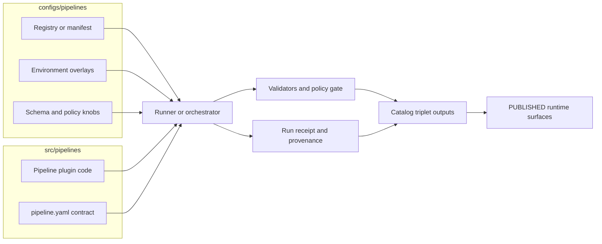

<!-- [KFM_META_BLOCK_V2]
doc_id: kfm://doc/0a5afa60-4763-4640-9edf-e11f1ce18705
title: Pipeline Configuration
type: standard
version: v1
status: draft
owners: KFM Maintainers
created: 2026-02-23
updated: 2026-02-23
policy_label: restricted
related:
  - ../../src/pipelines/
  - ../../docs/MASTER_GUIDE_v13.md
tags: [kfm, pipelines, configs, governance]
notes:
  - This README is a contract-first description of what belongs in configs/pipelines/.
  - Update the "Current layout" section once actual files settle.
[/KFM_META_BLOCK_V2] -->

<a id="top"></a>

# configs/pipelines — Pipeline configuration (governed)

**One-line purpose:** Central, schema-validated configuration for discovering, scheduling, and governing pipeline runs (without embedding pipeline code).


> **TODO (repo wiring):** Replace placeholder workflow badges once actual workflow file names + repo slug are known.

---

## Quick navigation

- [Purpose and scope](#purpose-and-scope)
- [Where this fits](#where-this-fits)
- [How configs are used](#how-configs-are-used)
- [Directory layout](#directory-layout)
- [Adding or changing a pipeline](#adding-or-changing-a-pipeline)
- [Validation and promotion gates](#validation-and-promotion-gates)
- [Secrets and credentials](#secrets-and-credentials)
- [CI integration](#ci-integration)
- [Appendix: templates](#appendix-templates)

---

## Purpose and scope

This directory exists to keep **pipeline behavior governed and reviewable**:

- **Discovery:** which pipeline plugins exist and are enabled.
- **Scheduling:** when pipelines run (cron/interval/event trigger).
- **Environment overlays:** dev/test/prod knobs *without modifying code*.
- **Governance knobs:** policy labels, required artifacts, and fail-closed checks.

> **WARNING**
> Pipeline **code** does **not** live here. Config changes are treated as governed changes because they can alter what data is produced and what surfaces it reaches.

[Back to top](#top)

---

## Where this fits

A common KFM separation of concerns:

| Concern | Lives in | Why |
|---|---|---|
| Pipeline plugin code (ETL, transforms, publishing) | `src/pipelines/<pipeline>/` | Infrastructure-layer jobs; testable in isolation |
| Pipeline “contract” (typed config per pipeline) | Usually `src/pipelines/<pipeline>/pipeline.yaml` | Co-located with plugin; schema-validated interface |
| **Global pipeline registry & env overlays** | **`configs/pipelines/`** | One place to enable/disable/schedule safely |
| Run receipts (per execution) | `data/prov/` / `prov/` (or configured location) | Auditability + provenance |
| Catalog triplet outputs (STAC/DCAT/PROV) | `data/stac/`, `data/catalog/dcat/`, `data/prov/` | Governed runtime inputs |

> **NOTE**
> KFM’s design intent is **plugin-based pipelines**: contributors can “drop in” a new pipeline following conventions, and an orchestrator discovers it via a registry/manifest or directory scan (no central engine edits required).  

[Back to top](#top)

---

## How configs are used

High-level flow:



**Design invariants (non-negotiable):**
- Pipelines are **modular** (failure isolation; independent tests).
- **No ad-hoc edits** to processed outputs—fix the pipeline and rerun.
- Promotion to publishable/runtime surfaces is **fail-closed** on missing/invalid governance artifacts.

[Back to top](#top)

---

## Directory layout

### Current layout

> **TODO:** Replace this section with the real tree once files exist.  
> Suggested command: `tree configs/pipelines -a -L 4`

### Recommended layout (template)

```text
configs/pipelines/
  README.md

  # 1) Discovery / enablement (registry of pipeline plugins)
  registry.yml                # signed allowlist / registry (preferred)
  manifest.yml                # alternative registry (if used)

  # 2) Shared schemas / contracts (validated in CI)
  schemas/
    pipeline.v1.schema.json
    registry.v1.schema.json
    run_receipt.v1.schema.json

  # 3) Environment overlays (non-secret knobs only)
  env/
    dev.yml
    test.yml
    prod.yml

  # 4) Scheduling / dispatch config (if not encoded in pipeline.yaml)
  schedules/
    schedules.yml

  # 5) Policy knobs (deny-by-default posture)
  policy/
    promotion_requirements.yml
    redaction_defaults.yml

  # 6) Examples / fixtures for CI gates
  fixtures/
    sample_pipeline.yml
    sample_registry.yml
```

> **TIP**
> Prefer **“registry + schema validation”** over “implicit conventions only.” A registry makes review and enable/disable decisions explicit.

[Back to top](#top)

---

## Adding or changing a pipeline

### Add a new pipeline (checklist)

1. **Create plugin code**  
   `src/pipelines/<pipeline_slug>/...`

2. **Define the pipeline contract**  
   `src/pipelines/<pipeline_slug>/pipeline.yaml` (or equivalent), including:
   - schedule/trigger (cron or event)
   - inputs + rights metadata
   - outputs (zones + paths)
   - resources (cpu/mem/timeouts)
   - policy label + obligations (if applicable)

3. **Register it here**  
   Add to `configs/pipelines/registry.yml` (or `manifest.yml`), including enablement + schedule overrides if used.

4. **Add test fixtures**  
   Add minimal fixtures and validation tests so CI can fail closed.

5. **Prove governance artifacts**  
   Ensure the pipeline emits:
   - run receipt (with inputs/outputs/environment + policy decision ref)
   - catalog triplet updates (STAC/DCAT/PROV)
   - validation report references/digests

6. **Open a PR**  
   Config and pipeline changes are reviewed together.

### Change an existing pipeline’s behavior (rules)

- **Never** edit processed artifacts “by hand.”
- Prefer:
  - config changes in `configs/pipelines/` for scheduling/enablement/env knobs
  - code changes in `src/pipelines/` for logic changes
- Any change that affects output schema, extents, licensing, or sensitivity must update:
  - the pipeline contract
  - validators/fixtures
  - catalog/provenance mapping

[Back to top](#top)

---

## Validation and promotion gates

Pipelines must produce enough evidence to move data across lifecycle zones:

- RAW → WORK/QUARANTINE → PROCESSED → CATALOG (DCAT+STAC+PROV) → PUBLISHED

**Minimum gate categories (starter):**
- **Identity & versioning** (deterministic version ID / spec hash)
- **Licensing & rights**
- **Sensitivity classification + redaction plan**
- **Catalog triplet validation** (STAC/DCAT/PROV consistency + cross-links)

### Definition of Done for “pipeline is promotable”

- [ ] Pipeline contract validates against schema
- [ ] Registry entry validates (and is signed if required)
- [ ] Run receipt emitted per run
- [ ] Validation status is **pass** (or explicitly quarantined with reason)
- [ ] Promotion manifest exists (or equivalent rollup)
- [ ] Catalog triplet updated and link-checked
- [ ] Policy decision recorded and obligations applied (if any)
- [ ] CI gates pass (deny-by-default)

> **WARNING**
> If any required artifact is missing or invalid, **promotion must be blocked** (fail closed).

[Back to top](#top)

---

## Secrets and credentials

**Hard rule:** **No secrets** in `configs/pipelines/` (or anywhere in git).

Allowed:
- Non-secret env overlays (timeouts, feature flags, batch sizes)
- References to secret *keys* (names/identifiers), not values
- Templates like `.env.example` (no real values)

Preferred patterns:
- OIDC-based short-lived credentials in CI
- Secret manager / Kubernetes secrets / GitHub Actions secrets (depending on runtime)

> **TIP**
> If a pipeline needs a credential, treat it as part of the pipeline’s *deployment* configuration, not its versioned *behavior* configuration.

[Back to top](#top)

---

## CI integration

This directory is intended to be CI-enforced:

- Schema validation for pipeline contracts and registries
- Policy gate checks (deny promotion if required fields missing)
- (Optional) signature verification for registry allow-lists

> **TODO**
> Link to the actual workflows under `.github/workflows/` once names exist.

[Back to top](#top)

---

## Appendix: templates

<details>
<summary><strong>Example: pipeline registry entry (illustrative)</strong></summary>

```yaml
# configs/pipelines/registry.yml
pipelines:
  - id: example_pipeline
    enabled: true
    plugin_path: src/pipelines/example_pipeline
    schedule: "0 3 * * *"  # cron
    environment_overrides:
      dev:
        enabled: false
```

</details>

<details>
<summary><strong>Example: pipeline contract (illustrative)</strong></summary>

```yaml
# src/pipelines/example_pipeline/pipeline.yaml
id: example_pipeline
description: "Example pipeline contract (template)"
schedule: "0 3 * * *"

inputs:
  - id: source_a
    uri: "https://example.invalid/source"
    license: "UNKNOWN"   # fail-closed unless resolved

outputs:
  - zone: raw
    path: "data/<domain>/<dataset>/raw/"
  - zone: processed
    path: "data/<domain>/<dataset>/processed/"

policy:
  label: restricted
  obligations: []

resources:
  cpu: "1"
  memory: "2Gi"
  timeout_seconds: 3600
```

</details>

<details>
<summary><strong>Example: run receipt shape (illustrative)</strong></summary>

```json
{
  "run_id": "kfm://run/2026-02-23T00:00:00Z.example",
  "operation": "ingest+publish",
  "inputs": [{"uri": "raw/source", "digest": "sha256:..."}],
  "outputs": [{"uri": "processed/output", "digest": "sha256:..."}],
  "environment": {"git_commit": "…", "container_digest": "sha256:…"},
  "validation": {"status": "pass"},
  "policy": {"decision_id": "kfm://policy_decision/…"},
  "created_at": "2026-02-23T00:05:00Z"
}
```

</details>

[Back to top](#top)
