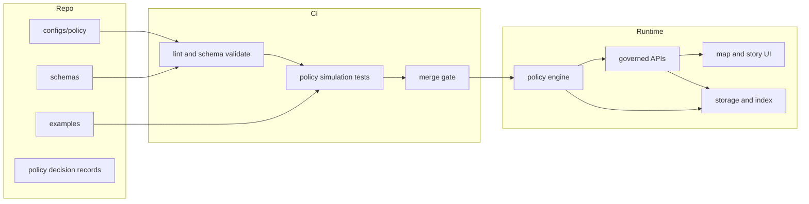

<!-- [KFM_META_BLOCK_V2]
doc_id: kfm://doc/4893914c-6be0-499d-b5f5-8bba30c5c179
title: Policy Configs
type: standard
version: v1
status: draft
owners: TODO(KFM:owners)
created: 2026-02-23
updated: 2026-02-23
policy_label: restricted
related:
  - TODO(KFM:related_paths_or_doc_ids)
tags: [kfm, policy, config]
notes:
  - This README defines conventions for declarative policy configs under configs/policy.
[/KFM_META_BLOCK_V2] -->

# configs/policy
**Declarative policy configs that govern what the system is allowed to say and do.**


**Owners:** TODO(KFM:owners)  
**Applies to:** data → pipelines → catalogs/provenance → storage/indexing → governed APIs → Map/Story UI → Focus Mode AI

---

## Navigate
- [Purpose](#purpose)
- [Where this fits](#where-this-fits)
- [What belongs here](#what-belongs-here)
- [What must not go here](#what-must-not-go-here)
- [Policy surfaces](#policy-surfaces)
- [Recommended structure](#recommended-structure)
- [How policy is enforced](#how-policy-is-enforced)
- [Change workflow](#change-workflow)
- [Review checklist](#review-checklist)
- [Troubleshooting](#troubleshooting)
- [Appendix: templates](#appendix-templates)

---

## Purpose
This directory **defines policy as data**: small, reviewable configuration files that drive the system’s *governed behavior*.

A change here can affect:
- what datasets can be promoted (Raw → Work → Processed → Published),
- who can access what (roles, permissions, rate limits),
- what must be redacted or generalized (privacy and sensitive locations),
- what claims can be surfaced (evidence requirements, provenance checks),
- what UI and AI features are enabled/disabled (feature flags tied to policy).

> [!WARNING]
> If a rule is ambiguous, **fail closed**: default-deny access, redact more, or generalize outputs until governance review completes.

[Back to top](#navigate)

---

## Where this fits
Policy config is the **trust membrane** boundary. UI and clients **must not** bypass it.



[Back to top](#navigate)

---

## What belongs here
**Acceptable inputs (directory standard):**
- Policy *definitions* (YAML/JSON/TOML) — roles, permissions, classification labels, redaction rules, release gates.
- Machine-checkable *schemas* for policy configs (JSON Schema or equivalent).
- *Decision records* explaining why a policy exists and what risks it mitigates (short, auditable).
- *Fixtures/examples* used by policy tests (synthetic and non-sensitive).

**Design intent:** keep configs small and composable; prefer many focused files over one giant file.

[Back to top](#navigate)

---

## What must not go here
**Exclusions (directory standard):**
- Secrets (API keys, tokens, passwords) — ever.
- Raw datasets, extracts, or user data (even “temporary”).
- Credentials, private keys, kubeconfigs, `.env` files.
- Ad-hoc one-off overrides that bypass review (use a time-bounded exception policy record instead).

> [!TIP]
> If you need an urgent exception, create a **time-boxed policy exception** with an explicit expiration date and an owner.

[Back to top](#navigate)

---

## Policy surfaces
These are the most common policy surfaces that should be handled here (names are illustrative—align to your repo’s actual implementation):

1. **Classification & sensitivity**
   - labels (public / internal / restricted / confidential)
   - location precision constraints
   - culturally restricted knowledge constraints

2. **Access control**
   - roles, permissions, datasets/collections, row/column rules
   - API authentication and authorization mapping

3. **Redaction & generalization**
   - PII rules
   - vulnerable site handling (no exact coordinates; coarse geography)
   - aggregation thresholds (k-anonymity style rules, minimum counts)

4. **Promotion gates**
   - required metadata
   - validation thresholds
   - license checks
   - provenance links and checksums
   - audit record requirements

5. **Evidence requirements**
   - citation requirements for claims
   - “cite-or-abstain” enforcement
   - provenance completeness thresholds

6. **Feature flags**
   - toggles for risky outputs (e.g., exporting exact coordinates)
   - toggles for experimental models or UI affordances

[Back to top](#navigate)

---

## Recommended structure
> [!NOTE]
> The table below is a **proposed** structure. If your repo already has established paths, keep them and map them here.

| Path (proposed) | Type | Purpose | Notes |
|---|---:|---|---|
| `configs/policy/README.md` | md | This document | Keep current |
| `configs/policy/_index.yaml` | yaml | One place to enumerate active policy bundles | Prefer explicit ordering |
| `configs/policy/classification/labels.yaml` | yaml | Sensitivity labels + constraints | Default-deny |
| `configs/policy/access/roles.yaml` | yaml | Role definitions | Human readable |
| `configs/policy/access/permissions.yaml` | yaml | Permission matrix | Avoid implicit grants |
| `configs/policy/redaction/rules.yaml` | yaml | Redaction + generalization rules | Coordinate precision guards |
| `configs/policy/promotion/gates.yaml` | yaml | Raw→Published promotion requirements | CI-enforced |
| `configs/policy/evidence/requirements.yaml` | yaml | What must be cited and when | “cite-or-abstain” |
| `configs/policy/schemas/` | dir | Schemas for validation | Treat as API contract |
| `configs/policy/examples/` | dir | Synthetic fixtures for tests | Never real user data |
| `configs/policy/decisions/` | dir | Policy decision records | Short + auditable |

### Directory tree (illustrative)
```text
configs/policy/
  README.md
  _index.yaml
  classification/
    labels.yaml
  access/
    roles.yaml
    permissions.yaml
  redaction/
    rules.yaml
  promotion/
    gates.yaml
  evidence/
    requirements.yaml
  schemas/
    # JSON Schema files that validate the configs above
  examples/
    # synthetic fixtures used by policy tests
  decisions/
    # policy decision records (why a rule exists, risks, tradeoffs)
```

[Back to top](#navigate)

---

## How policy is enforced
This repo should treat policy as **executable governance**:

- **CI enforcement**
  - Schema validation (fail closed)
  - Policy simulation tests (fixtures)
  - Backward-compatibility checks for policy contract changes
  - Required approvals / CODEOWNERS on `configs/policy/**`

- **Runtime enforcement**
  - Governed APIs load policy bundles at startup (or via hot reload if safe)
  - The policy engine mediates access between clients and storage/indexes
  - UI and AI features rely on the policy engine rather than implementing ad-hoc rules

> [!WARNING]
> Avoid duplicating policy in multiple places. If UI logic must mirror a rule, it should reference policy output from governed APIs, not re-implement the rule.

[Back to top](#navigate)

---

## Change workflow
### Step-by-step
1. **Pick the policy surface** (classification, access, redaction, promotion, evidence, flags).
2. **Edit configs** in the smallest possible diff.
3. **Update or add tests** (fixtures and expected outcomes).
4. **Run validation locally** (commands below are placeholders—replace with repo-specific scripts).
5. **Open a PR** with:
   - a short rationale
   - expected impact (what changes for users)
   - rollback plan
   - any required comms

```bash
# TODO: replace with repo-specific commands
make policy-lint
make policy-validate
make policy-test
```

### Definition of done
- [ ] Configs pass schema validation
- [ ] Tests cover the new/changed behavior
- [ ] Decision record added for non-trivial changes
- [ ] No secrets, no sensitive data, no private coordinates
- [ ] Promotion gates updated (if behavior affects data lifecycle)
- [ ] Owners/approvers signed off

[Back to top](#navigate)

---

## Review checklist
Use this checklist in PR review:

### Safety and governance
- [ ] Default-deny preserved (no unintended broad access)
- [ ] Sensitive locations are protected (coarse geography where required)
- [ ] Redaction rules cover new fields/outputs
- [ ] Audit requirements still produce reproducible receipts

### Correctness
- [ ] Schema change is versioned (e.g., `v1` → `v2`) with migration notes
- [ ] Policy bundles remain deterministic (order is explicit)
- [ ] No ambiguity in precedence rules (who wins when two rules conflict)

### Operational
- [ ] Runtime load behavior is safe (no partial loads)
- [ ] Rollback is documented and feasible
- [ ] CI gates are updated in lockstep with policy changes

[Back to top](#navigate)

---

## Troubleshooting
**Schema validation fails**
- Ensure required keys are present and types match the schema.
- Prefer explicit `version:` fields in every policy file.
- If you changed a schema, update fixtures and tests in the same PR.

**A rule seems ignored**
- Check policy bundle ordering (`_index.yaml` or equivalent).
- Look for precedence rules (most specific wins vs first match wins).
- Verify the runtime is loading the expected bundle version.

**Policy change broke downstream services**
- Confirm whether this is a breaking contract change.
- If yes, version the policy contract and provide a migration window.

[Back to top](#navigate)

---

## Appendix: templates
<details>
<summary>Click to expand templates (YAML examples)</summary>

### Classification labels
```yaml
# configs/policy/classification/labels.yaml
version: v1
labels:
  - id: public
    description: Public data; no special restrictions.
  - id: restricted
    description: Restricted data; requires explicit authorization and redaction.
    constraints:
      # Example: prevent publishing exact site locations
      max_coordinate_precision_m: 1000
      allow_exact_coordinates: false
```

### Roles and permissions
```yaml
# configs/policy/access/roles.yaml
version: v1
roles:
  - id: viewer
    description: Read-only access to approved outputs.
  - id: steward
    description: Governance role; can approve promotions and policy exceptions.
```

```yaml
# configs/policy/access/permissions.yaml
version: v1
permissions:
  - role: viewer
    allow:
      - action: read
        resource: published_datasets
    deny:
      - action: read
        resource: raw_zone
  - role: steward
    allow:
      - action: promote
        resource: datasets
      - action: approve
        resource: policy_exceptions
```

### Redaction and generalization
```yaml
# configs/policy/redaction/rules.yaml
version: v1
rules:
  - id: pii_email
    match:
      field: email
    action:
      type: redact
      replacement: "[REDACTED]"

  - id: vulnerable_site_location
    match:
      field: location
      label: restricted
    action:
      type: generalize_location
      # Example: snap to coarse geometry or admin region
      min_precision_m: 1000
```

### Promotion gates
```yaml
# configs/policy/promotion/gates.yaml
version: v1
gates:
  published:
    require:
      - metadata.identity
      - metadata.schema
      - metadata.extents
      - metadata.license
      - metadata.sensitivity
      - validation.results
      - provenance.links
      - checksums
      - audit.record
```

</details>

[Back to top](#navigate)
