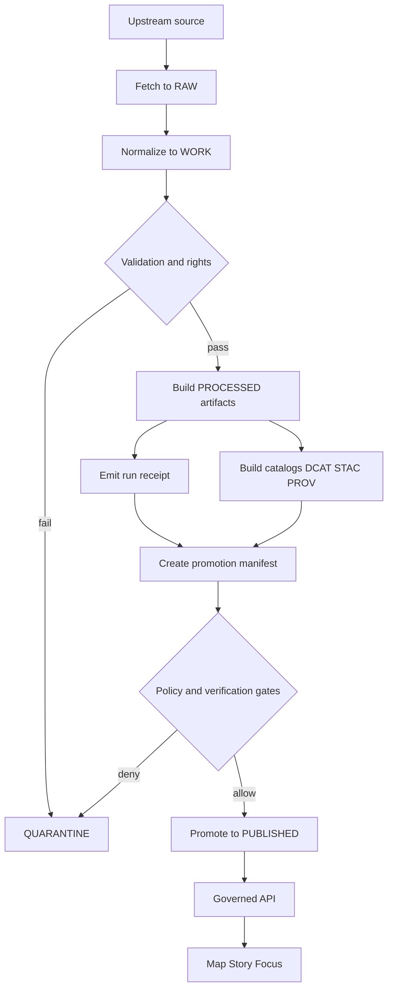

<!-- [KFM_META_BLOCK_V2]
doc_id: kfm://doc/bea4e223-b57c-46c1-b177-d55f5871304d
title: configs/promotion README
type: standard
version: v1
status: draft
owners: TBD
created: 2026-02-23
updated: 2026-02-23
policy_label: TBD
related:
  - TODO: link to governance guide Promotion Contract section
  - TODO: link to policy pack docs (OPA/Rego + Conftest)
  - TODO: link to schemas for run_receipt and promotion_manifest
tags: [kfm, promotion, governance, ci, policy]
notes:
  - This directory defines the config + contracts that keep promotion fail-closed.
[/KFM_META_BLOCK_V2] -->

# configs/promotion
**Fail-closed Promotion Contract configuration for moving dataset versions into Published surfaces.**


> NOTE: This directory is governance-sensitive. Treat changes like production code:
> PRs, review, tests, and rollback notes. If policy/evidence is missing → promotion must deny.

## Navigation
- [Purpose](#purpose)
- [Where this fits](#where-this-fits)
- [What lives here](#what-lives-here)
- [What must not live here](#what-must-not-live-here)
- [Promotion Contract v1](#promotion-contract-v1)
- [Directory layout](#directory-layout)
- [Promotion workflow](#promotion-workflow)
- [Local validation](#local-validation)
- [CI integration](#ci-integration)
- [Change management](#change-management)
- [Definition of Done](#definition-of-done)
- [Security and privacy notes](#security-and-privacy-notes)
- [Appendix](#appendix)

---

## Purpose
This folder holds configuration and machine-checkable contracts that enforce **promotion**:
moving a dataset version from **Raw/Work** into **Processed + Catalog/Lineage**, making it eligible for
the governed runtime surfaces (API + Map + Story + Focus).

Promotion is **deny by default**:
- If evidence is missing → deny
- If schema validation fails → deny
- If policy checks fail → deny
- If signatures/attestations are required and cannot be verified → deny

---

## Where this fits
Conceptual wiring:

Domain pipeline specs → **promotion configs** → policy gates in CI → processed artifacts + catalogs → governed API → UI + Focus Mode

This directory is the **configuration boundary** for “what is allowed to ship.”
Pipelines and CI must consult these configs and policies; clients must not bypass them.

---

## What lives here
Acceptable inputs for `configs/promotion/`:

- Versioned promotion contract settings (YAML/JSON).
- JSON Schemas for promotion artifacts:
  - promotion manifest
  - run receipts
- Policy gate inputs:
  - allow-lists
  - controlled vocabularies
  - QA threshold configs
- OPA/Rego + Conftest policies (or references to canonical policies) used to evaluate promotion evidence.
- Environment/“lane” profiles (dev/staging/prod) **only if** promotion requirements differ by lane.

---

## What must not live here
- Secrets (API keys, tokens), private keys, signing keys.
- Large datasets or binary artifacts.
- Pipeline code (belongs in pipeline modules, not configs).
- Free-form approvals without a machine-verifiable record (use governance tickets / signed approvals / auditable logs).

---

## Promotion Contract v1

### Data lifecycle zones
- **RAW**  
  Immutable acquisition artifacts + checksums + minimal metadata.

- **WORK / QUARANTINE**  
  Intermediate transforms + QA + candidate redactions.  
  QUARANTINE is fail-closed: unclear licensing, sensitivity concerns, failed validation, or upstream instability stays quarantined.

- **PROCESSED**  
  Publishable artifacts in approved formats, digest-addressed.

- **CATALOG/TRIPLET**  
  DCAT + STAC + PROV + run receipts.

- **PUBLISHED**  
  API/UI may only serve promoted versions with:
  processed artifacts, validated catalogs, run receipts, and a policy label assignment.

### Minimum promotion gates
| Gate | Fail-closed rule | Typical evidence required |
|---|---|---|
| A. Identity and versioning | Dataset ID stable; DatasetVersion immutable and derived from deterministic `spec_hash`. | Promotion manifest; deterministic spec hash inputs. |
| B. Licensing and rights | License explicit + compatible; rights holder + attribution captured; unclear license quarantines. | DCAT license + rights fields; captured terms snapshot. |
| C. Sensitivity and redaction | `policy_label` assigned; for sensitive/restricted data, a redaction/generalization plan exists and is recorded in PROV. | Policy decision record; PROV activity for redaction steps. |
| D. Catalog triplet validation | DCAT/STAC/PROV exist and validate to KFM profiles; cross-links resolve. | `dcat.jsonld`, STAC `collection.json` + items, PROV bundle. |
| E. Run receipt and checksums | A `run_receipt` exists for each producing run; inputs/outputs digested; environment recorded. | Run receipts; digests for raw + processed artifacts; container digest + params digest. |
| F. Policy and contract tests | OPA tests pass; evidence resolver resolves at least one EvidenceRef in CI; schemas validate. | Conftest results; schema validation logs; evidence resolve smoke tests. |
| G. Production posture | Supply-chain evidence, perf + accessibility smoke checks. | SBOM, attestations, perf smoke reports, a11y smoke reports. |

### Process diagram


---

## Directory layout
> TIP: Keep file paths predictable. Promotion and provenance are easiest to audit when paths are stable.

**Proposed skeleton** (adjust to repo conventions):

```
configs/promotion/                                 # Promotion configuration (contract + schemas + gates)
├─ README.md                                       # What “promotion” means, required artifacts, and CI wiring (fail-closed)
│
├─ contract/                                       # Human-readable contract inputs (normative declarations)
│  ├─ promotion_contract.v1.yaml                   # Promotion requirements (artifacts, checks, failure modes)
│  ├─ policy_labels.yaml                          # Policy labels taxonomy used during promotion (public/restricted/etc.)
│  └─ controlled_vocab.yaml                       # Controlled vocabulary (licenses, roles, sensitivity flags, etc.)
│
├─ schemas/                                        # Machine-validated schemas used by promotion gates
│  ├─ promotion_manifest.v1.schema.json            # Manifest schema for a promotion request/run
│  └─ run_receipt.v1.schema.json                   # Run receipt schema (required evidence of what was produced)
│
├─ policy/                                         # Policy logic + fixtures used by promotion gates
│  ├─ opa/                                         # OPA/Rego policy modules invoked by CI/runtime during promotion
│  │  ├─ receipt.rego                              # Validates receipt presence/shape + required fields
│  │  └─ promotion.rego                            # Promotion gate rules (deny-by-default; explicit allow)
│  └─ fixtures/                                    # Example inputs (synthetic; deterministic)
│     ├─ public_example.json                       # Example that should pass under public policy label
│     └─ restricted_example.json                   # Example that should gate/redact/deny under restricted label
│
├─ profiles/                                       # Environment profiles (non-secret knobs; dev vs prod strictness)
│  ├─ dev.yaml                                     # Dev profile (faster iteration; still fail-closed on essentials)
│  └─ prod.yaml                                    # Prod profile (strict gates, audited thresholds)
│
└─ thresholds/                                     # QA thresholds used by validators (bounded + reviewable)
   └─ qa_thresholds.yaml                           # Drift/error tolerances, coverage minimums, quality bars
```

### Responsibilities
| Path | Purpose |
|---|---|
| `contract/` | Human-reviewed config that defines gates, labels, and required evidence. |
| `schemas/` | JSON Schemas for receipts and manifests so CI can fail fast. |
| `policy/` | Deny-by-default policy rules and fixtures for testable governance. |
| `profiles/` | Lane-specific toggles and overrides, only if needed. |
| `thresholds/` | QA thresholds used by validators and promotion checks. |

---

## Promotion workflow
PR-based workflow shape:

1. Contributor opens a PR adding:
   - source registry entry
   - pipeline spec
   - small fixture sample + expected outputs
2. CI runs:
   - schema validation
   - policy tests
   - `spec_hash` stability test
   - link checks for catalogs
3. Steward review:
   - licensing and sensitivity
   - approve `policy_label`
4. Operator merges and triggers controlled pipeline run.
5. Outputs land in processed + catalogs.
6. Release manifest is created and tagged.

---

## Local validation
These commands are examples. Use the repo’s actual scripts if different.

Validate a promotion manifest against its schema:
```bash
ajv validate -s configs/promotion/schemas/promotion_manifest.v1.schema.json \
  -d data/catalog/releases/<dataset_version_id>/promotion_manifest.json
```

Run policy gates with conftest:
```bash
conftest test data/prov/run_receipts/<run_id>.json \
  -p configs/promotion/policy/opa
```

Compute a deterministic spec hash from canonical JSON:
```bash
jq -S . < pipeline_spec.json | sha256sum
```

---

## CI integration
Target CI behavior:
- Block merges unless the promotion gates pass.
- Verify signatures/attestations for artifacts where enabled.
- Require catalogs and receipts to be present, schema-valid, and cross-linked.
- Produce a reproducible preview and a rollback-first plan.

If using GitHub Actions, an integration pattern suggests workflows like:
- `.github/workflows/kfm__provenance-policy-gate.yml`
- `.github/workflows/pr-verify-receipts.yml`
- `.github/workflows/kfm__watchers.yml`

---

## Change management
Promotion config changes are governed changes.

Checklist for any PR touching `configs/promotion/`:
- [ ] Explain intent and risk: what will now be allowed or denied.
- [ ] Update or version the contract (`v1` → `v1.1` if breaking).
- [ ] Add or update policy fixtures so the behavior is testable.
- [ ] Add rollback notes and migration notes.
- [ ] Reference a governance ticket for any exception to default-deny.

---

## Definition of Done
Dataset promotion is considered done only when all of these are true:
- [ ] RAW acquisition is reproducible and documented.
- [ ] WORK transforms are deterministic.
- [ ] PROCESSED artifacts exist in approved formats and are digest-addressed.
- [ ] Catalog triplet validates and is cross-linked.
- [ ] EvidenceRefs resolve and render in the UI evidence drawer.
- [ ] Policy label is assigned and reviewed.
- [ ] Changelog notes what changed and why.

---

## Security and privacy notes
- Never ship exact locations for restricted or sensitive sites unless policy explicitly allows and redaction rules are satisfied.
- Treat `policy_labels` and rights metadata as first-class security controls.
- Keep signing keys out of the repo; use keyless signing or external secret stores.

---

## Appendix

<details>
<summary>Promotion manifest starter</summary>

```json
{
  "kfm_promotion_manifest_version": "v1",
  "dataset_slug": "example_dataset",
  "dataset_version_id": "YYYY-MM.hash",
  "spec_hash": "sha256:...",
  "released_at": "YYYY-MM-DDTHH:MM:SSZ",
  "artifacts": [
    { "path": "processed/<file>", "digest": "sha256:...", "media_type": "..." }
  ],
  "catalogs": [
    { "path": "catalog/dcat.jsonld", "digest": "sha256:..." },
    { "path": "catalog/stac/collection.json", "digest": "sha256:..." },
    { "path": "prov/<bundle>.jsonld", "digest": "sha256:..." }
  ],
  "qa": { "status": "pass", "report_digest": "sha256:..." },
  "policy": { "policy_label": "public", "decision_id": "kfm://policy_decision/..." },
  "approvals": [
    { "role": "steward", "principal": "tbd", "approved_at": "YYYY-MM-DDTHH:MM:SSZ" }
  ]
}
```

</details>

<details>
<summary>Receipt and promotion gate invariants</summary>

- Every processed artifact has a digest and can be traced to exactly one `run_receipt`.
- DCAT/STAC/PROV cross-links resolve without network access to privileged systems.
- CI remains fail-closed: missing evidence is a hard error, not a warning.

</details>

---

_Back to top: [configs/promotion](#configspromotion)_
