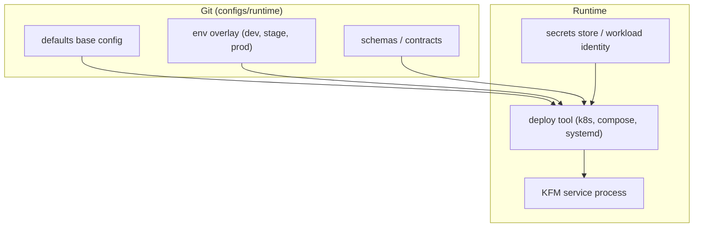

<!-- [KFM_META_BLOCK_V2]
doc_id: kfm://doc/3fbbf49c-86f6-4c66-84ab-10e68dfb0a8b
title: configs/runtime — Runtime configuration
type: standard
version: v1
status: draft
owners: TODO
created: 2026-02-23
updated: 2026-02-23
policy_label: restricted
related:
  - kfm://doc/TODO
tags: [kfm, config, runtime, ops]
notes:
  - Directory contract for runtime (non-secret) configuration artifacts and their governance gates.
  - Keep this doc aligned with deployment tooling and CI gates as they evolve.
[/KFM_META_BLOCK_V2] -->

# `configs/runtime/`
Runtime configuration (non-secret) for KFM deployments — **config-as-code, fail-closed, and reviewable**.


> **WARNING**
> This directory must **never** contain production secrets (API keys, passwords, private keys, tokens).  
> Use a secrets manager / workload identity and inject secrets **at runtime**.

## Navigation
- [Purpose](#purpose)
- [Where this fits in the repo](#where-this-fits-in-the-repo)
- [What belongs here](#what-belongs-here)
- [What must not go here](#what-must-not-go-here)
- [How runtime config is applied](#how-runtime-config-is-applied)
- [Directory layout](#directory-layout)
- [Config precedence](#config-precedence)
- [Change and promotion gates](#change-and-promotion-gates)
- [Adding a new setting](#adding-a-new-setting)
- [Troubleshooting](#troubleshooting)

---

## Purpose
`configs/runtime/` is the **single source of truth in Git** for *non-secret* settings needed to run KFM services across environments (local/dev/stage/prod).

This directory exists so that:
- runtime behavior is **reviewable in PRs** (diffs are meaningful);
- changes are **reproducible** (config is versioned and can be rolled back);
- deployments can be **promoted between environments** without rebuilding images (environment-specific config is injected at runtime).

---

## Where this fits in the repo
This directory is part of the broader “governance-by-construction” loop used across KFM (contracts → policy → CI gates → promotion).  
Even though the Promotion Contract is defined primarily for *data* promotion, the same **fail-closed** and **evidence-first** posture applies to runtime config changes: if validation fails, config does **not** ship to runtime surfaces.

> **NOTE**
> The exact deployment mechanism (Kubernetes, Compose, systemd, etc.) is **not confirmed in repo** from the provided artifacts.  
> This README documents the *expected contract* for whatever runner you use.

---

## What belongs here
✅ Allowed artifacts (non-secret):
- **Environment overlays** (e.g., `env/dev/*.yaml`, `env/prod/*.yaml`, `*.env.example`)
- **Runtime config manifests** for the chosen orchestrator (e.g., K8s ConfigMaps, Helm values, Compose overrides)
- **Config contracts** (schemas) used by CI to validate settings (JSON Schema, CUE, etc.)
- **Generated checksums** / lockfiles *if* they are deterministic and reviewable (see “Config precedence” and “Gates”)
- **Docs** explaining how config is applied and validated

### Artifact registry (expected)
| Path / pattern | Responsibility | Contains secrets? | Notes |
|---|---|---:|---|
| `defaults/**` | Base (shared) runtime config | ❌ | Safe defaults; should be minimal |
| `env/<environment>/**` | Environment overlays | ❌ | Only what differs from base |
| `schema/**` | Config contracts (schemas) | ❌ | CI validates overlays against these |
| `k8s/**` | Orchestrator manifests (optional) | ❌ | Only non-secret config here |
| `checksums/**` | Deterministic digests (optional) | ❌ | Use canonicalization before hashing |

---

## What must not go here
❌ Disallowed artifacts:
- Secrets (passwords, tokens, private keys), including “temporary” or “just for dev” secrets
- Unredacted sensitive endpoints or credentials embedded in URLs
- Large environment dumps (e.g., full `.env` copied from a live system)
- Machine-specific local files (editor settings, absolute paths)
- Any file whose presence would allow someone to **access systems they shouldn’t**

> **TIP**
> If a value is sensitive, store only the **reference** here (secret name / key), not the secret value.

---

## How runtime config is applied



### Pattern
1. **Base config** defines safe defaults (works locally where possible).
2. **Environment overlay** overrides only what must differ per environment.
3. **Secrets** are injected at runtime via secret mounts/env vars (never committed).
4. CI validates config against **contracts** before merge/deploy.

---

## Directory layout

> **NOTE**
> Replace the “Reference layout” below with the *actual* directory tree once the repo is available.  
> Suggested command: `tree configs/runtime -L 4`.

### Reference layout (proposed default)
```text
configs/runtime/                                  # Runtime configuration (non-secret): defaults → env overlays → deploy wiring
├─ README.md                                      # How runtime config is loaded, validated, and promoted (fail-closed)
│
├─ defaults/                                      # Environment-agnostic defaults (safe; non-secret)
│  ├─ app.yaml                                    # Shared app defaults (feature flags, limits, URLs, timeouts)
│  └─ logging.yaml                                # Logging defaults (levels, formats, redaction toggles)
│
├─ env/                                           # Environment overlays (non-secret deltas only)
│  ├─ local/
│  │  ├─ app.yaml                                 # Local overrides (developer machine; no secrets)
│  │  └─ .env.example                             # Copy to .env outside git (keys only)
│  ├─ dev/
│  │  └─ app.yaml                                 # Dev overrides (debug knobs; safe defaults)
│  ├─ stage/
│  │  └─ app.yaml                                 # Stage overrides (prod-like where possible)
│  └─ prod/
│     └─ app.yaml                                 # Prod overrides (strict posture; audited changes)
│
├─ k8s/                                           # Kubernetes wiring (only if K8s is used)
│  ├─ base/
│  │  └─ configmap.yaml                            # ConfigMap template (non-secret runtime config)
│  └─ overlays/
│     ├─ dev/
│     ├─ stage/
│     └─ prod/
│
├─ schema/                                        # Validation contract for runtime config
│  └─ runtime-config.schema.json                  # JSON Schema for merged runtime config bundle
│
└─ checksums/                                     # Optional integrity hooks for the merged config bundle
   └─ runtime-config.sha256                       # Canonicalized + hashed config bundle (detect drift/tampering)
```

### Directory documentation standard
- **Purpose:** store runtime config artifacts (non-secret) + contracts + CI-facing evidence
- **Acceptable inputs:** YAML/JSON templates, `.env.example`, orchestrator manifests, schemas
- **Exclusions:** secrets, generated files without determinism, env dumps, machine-local state

---

## Config precedence
If multiple files apply, precedence should be deterministic and documented. A common order:

1. `defaults/*` (lowest)
2. `env/<environment>/*`
3. Runtime-injected values from the orchestrator
4. Secrets injected at runtime (highest)

### Canonicalization and hashing
To keep diffs meaningful and support attestations:
- **Canonicalize** YAML/JSON before hashing (stable key ordering, normalized formatting)
- Hash the canonical bundle and store the digest as an artifact (optional, but recommended)

---

## Change and promotion gates
Runtime config must be treated as “promotable” infrastructure state. Minimum gates recommended:

### CI checks (fail closed)
- [ ] **Secret scanning**: fail if a likely secret is committed
- [ ] **Schema validation**: config matches `schema/` contracts
- [ ] **Overlay completeness**: required keys present for each environment
- [ ] **Deterministic build**: canonicalization + checksum stable across runs
- [ ] **Policy checks** (if applicable): denylist risky settings, enforce TLS, etc.

### Release / promote checks
- [ ] Merge only via PR with review
- [ ] Promotion record (who/what/when/why) attached to deploy job logs
- [ ] Rollback path documented (last-known-good config ref)

> **TIP**
> If you already use OPA/Rego + Conftest for other KFM gates, reuse that mechanism here for runtime config rules.

---

## Adding a new setting
1. Add the key to the appropriate **base** file in `defaults/`.
2. Add/override only what differs in each `env/<environment>/`.
3. Update or add a **schema** entry in `schema/` so CI can validate it.
4. Add a short note to this README (or a service-specific doc) explaining:
   - what the setting does,
   - which environments should override it,
   - whether it has any security implications.

### Definition of done (runtime config change)
- [ ] No secrets added
- [ ] CI passes (schema + policy + secret scan)
- [ ] Change is reviewable and reversible
- [ ] Affected services documented

---

## Troubleshooting
### “Config changed but nothing happened”
- Confirm the deploy agent/orchestrator is actually consuming the files you changed.
- Confirm the environment overlay you edited matches the environment you deployed to.
- Confirm the runner triggers redeploy on config change (some systems require explicit rollout).

### “Config is different in runtime than in Git”
- Investigate drift: manual edits in cluster/host should be treated as incidents.
- Reconcile back to Git (GitOps principle) and rotate any credentials if secrets were exposed.

---

<details>
<summary>Appendix: Suggested conventions (optional)</summary>

- Use `env/{local,dev,stage,prod}` as canonical environment names unless the repo defines a different set.
- Prefer small, composable config files over a single monolith.
- If using Kubernetes:
  - Use ConfigMaps for non-sensitive settings.
  - Use Secrets for sensitive settings and mount/inject at runtime.

</details>
